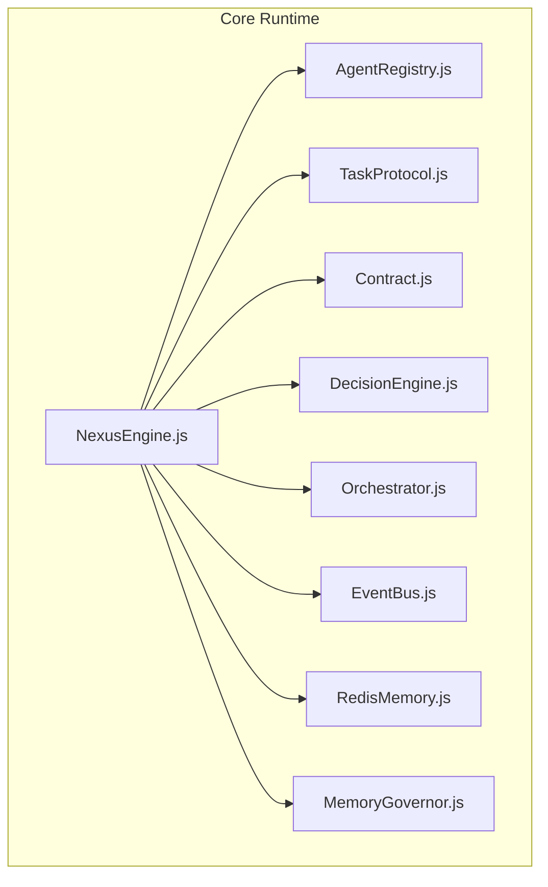
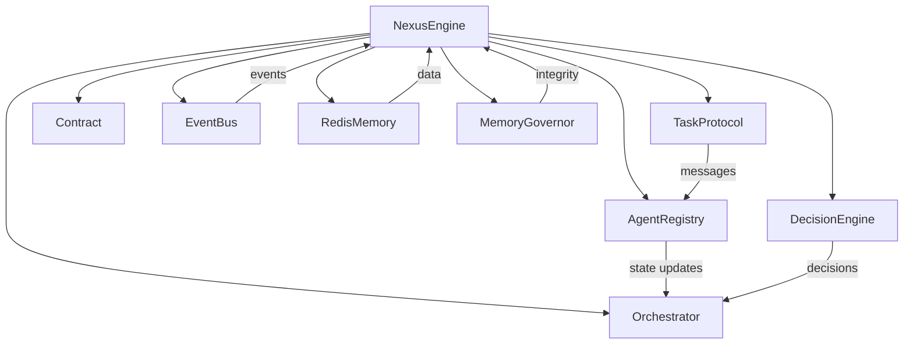
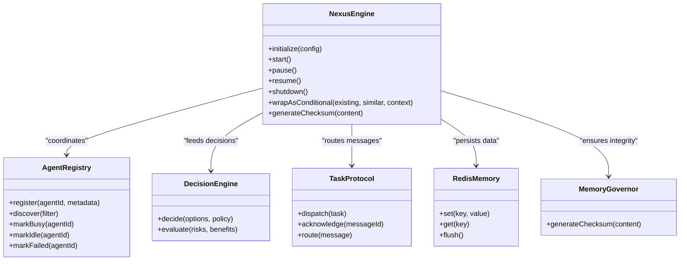
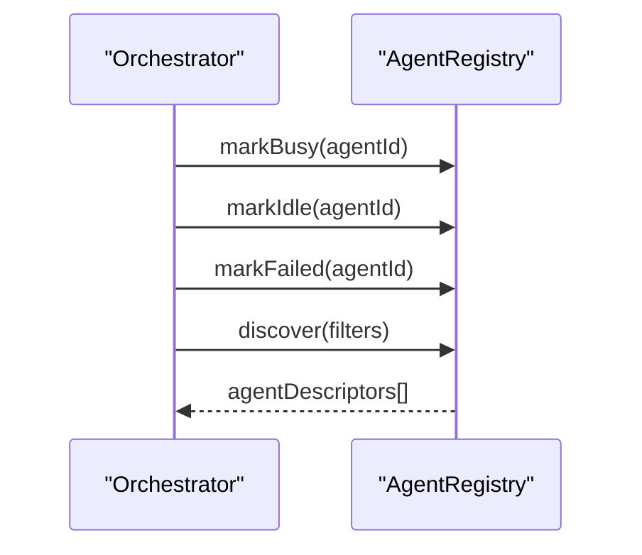
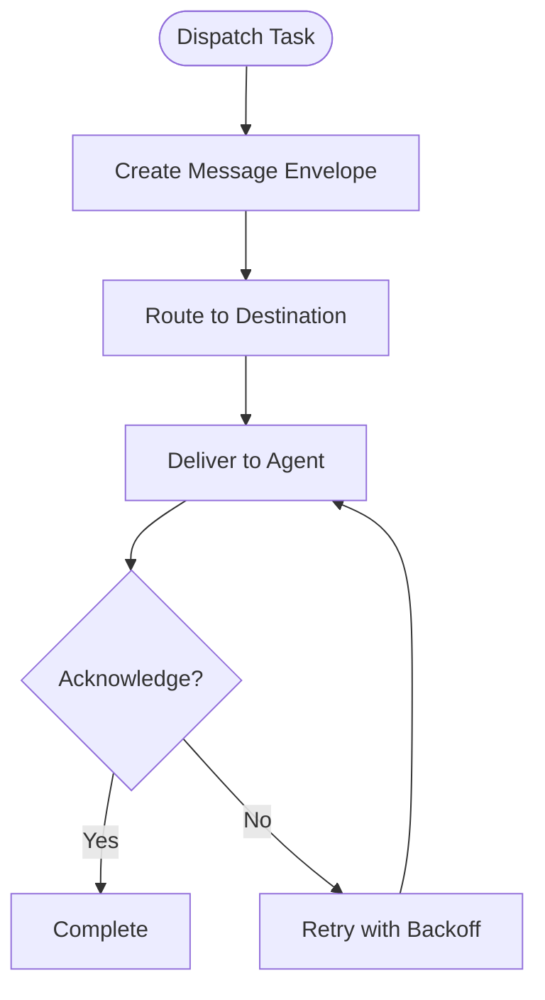
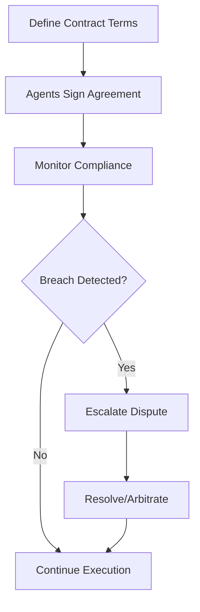
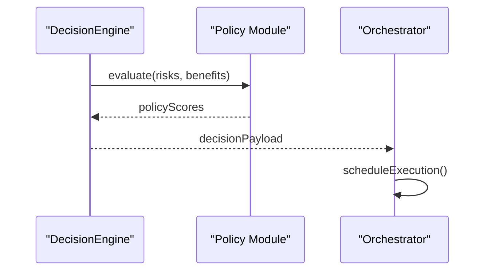
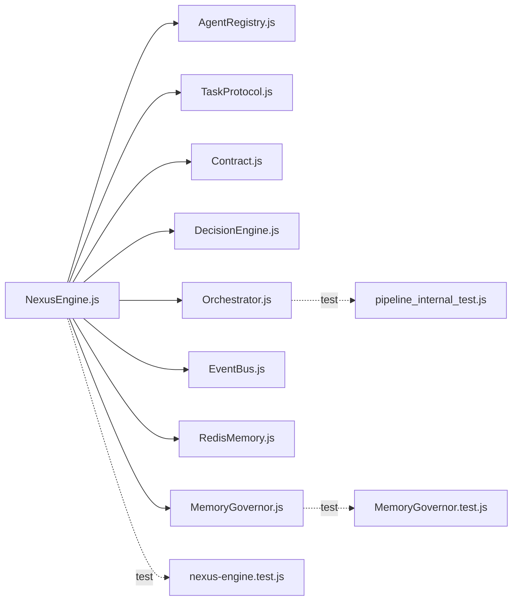

# API Reference

<cite>
**Referenced Files in This Document**
- [NexusEngine.js](file://agent/core/NexusEngine.js)
- [AgentRegistry.js](file://agent/core/AgentRegistry.js)
- [TaskProtocol.js](file://agent/core/TaskProtocol.js)
- [Contract.js](file://agent/core/Contract.js)
- [DecisionEngine.js](file://agent/core/DecisionEngine.js)
- [Orchestrator.js](file://agent/core/Orchestrator.js)
- [EventBus.js](file://agent/core/EventBus.js)
- [RedisMemory.js](file://agent/core/RedisMemory.js)
- [MemoryGovernor.js](file://agent/core/MemoryGovernor.js)
- [nexus-engine.test.js](file://tests/TDD/nexus-engine.test.js)
- [MemoryGovernor.test.js](file://tests/TDD/MemoryGovernor.test.js)
- [pipeline_internal_test.js](file://tests/pipeline_internal_test.js)
</cite>

## Table of Contents
1. [Introduction](#introduction)
2. [Project Structure](#project-structure)
3. [Core Components](#core-components)
4. [Architecture Overview](#architecture-overview)
5. [Detailed Component Analysis](#detailed-component-analysis)
6. [Dependency Analysis](#dependency-analysis)
7. [Performance Considerations](#performance-considerations)
8. [Troubleshooting Guide](#troubleshooting-guide)
9. [Conclusion](#conclusion)
10. [Appendices](#appendices)

## Introduction
This document provides a comprehensive API reference for NEXUS AI’s core interfaces and protocols. It covers:
- Nexus Engine API: initialization, configuration, and lifecycle management
- Agent Registry API: registration, discovery, and management
- Task Protocol: inter-agent communication, message passing, and workflow coordination
- Contract system: agent agreements and obligations
- Decision Engine API: strategic decision-making
- HTTP endpoints, WebSocket connections, and IPC protocols
- Request/response schemas, authentication, error handling, and rate limiting
- Practical examples, client implementation guidelines, and integration patterns

Where applicable, this document maps APIs to concrete source files and highlights test coverage and internal validations.

## Project Structure
NEXUS AI organizes its core runtime under agent/core. The primary APIs are implemented as cohesive modules with supporting utilities for memory, orchestration, and eventing.

**Diagram sources**
- [NexusEngine.js](file://agent/core/NexusEngine.js)
- [AgentRegistry.js](file://agent/core/AgentRegistry.js)
- [TaskProtocol.js](file://agent/core/TaskProtocol.js)
- [Contract.js](file://agent/core/Contract.js)
- [DecisionEngine.js](file://agent/core/DecisionEngine.js)
- [Orchestrator.js](file://agent/core/Orchestrator.js)
- [EventBus.js](file://agent/core/EventBus.js)
- [RedisMemory.js](file://agent/core/RedisMemory.js)
- [MemoryGovernor.js](file://agent/core/MemoryGovernor.js)

**Section sources**
- [NexusEngine.js](file://agent/core/NexusEngine.js)
- [AgentRegistry.js](file://agent/core/AgentRegistry.js)
- [TaskProtocol.js](file://agent/core/TaskProtocol.js)
- [Contract.js](file://agent/core/Contract.js)
- [DecisionEngine.js](file://agent/core/DecisionEngine.js)
- [Orchestrator.js](file://agent/core/Orchestrator.js)
- [EventBus.js](file://agent/core/EventBus.js)
- [RedisMemory.js](file://agent/core/RedisMemory.js)
- [MemoryGovernor.js](file://agent/core/MemoryGovernor.js)

## Core Components
This section documents the principal APIs and their responsibilities.

- Nexus Engine API
  - Purpose: Initialize and manage the NEXUS runtime, coordinate subsystems, and expose lifecycle hooks.
  - Key responsibilities: initialization/configuration, lazy loading of heavy components, consolidation of knowledge, and integration with memory and orchestration.
  - Notable behaviors: lazy getters for heavy components, conditional knowledge consolidation, and Redis-backed memory operations.

- Agent Registry API
  - Purpose: Manage agent identities, availability, and lifecycle states.
  - Key responsibilities: register agents, mark busy/idle/failed, discover agents, and integrate with Orchestrator.

- Task Protocol
  - Purpose: Define message formats and workflows for inter-agent communication and task coordination.
  - Key responsibilities: message framing, routing, acknowledgment, and workflow sequencing.

- Contract System
  - Purpose: Encode agent agreements, obligations, and governance rules.
  - Key responsibilities: define terms, track compliance, and mediate disputes.

- Decision Engine API
  - Purpose: Provide strategic decision-making capabilities for agent orchestration and resource allocation.
  - Key responsibilities: evaluate options, apply policies, and return decisions with rationale.

- Supporting Services
  - RedisMemory: distributed memory abstraction with namespacing and flushing policies.
  - MemoryGovernor: checksum generation and integrity checks for memory artifacts.
  - EventBus: publish/subscribe messaging for cross-module events.
  - Orchestrator: coordinates agent execution and handler lifecycle.

**Section sources**
- [NexusEngine.js](file://agent/core/NexusEngine.js)
- [AgentRegistry.js](file://agent/core/AgentRegistry.js)
- [TaskProtocol.js](file://agent/core/TaskProtocol.js)
- [Contract.js](file://agent/core/Contract.js)
- [DecisionEngine.js](file://agent/core/DecisionEngine.js)
- [Orchestrator.js](file://agent/core/Orchestrator.js)
- [EventBus.js](file://agent/core/EventBus.js)
- [RedisMemory.js](file://agent/core/RedisMemory.js)
- [MemoryGovernor.js](file://agent/core/MemoryGovernor.js)

## Architecture Overview
The NEXUS runtime composes modular APIs around a central Nexus Engine that delegates to specialized subsystems. Agents interact via the Agent Registry and Task Protocol, while Decisions are made by the Decision Engine. Memory and eventing are handled by dedicated services.

**Diagram sources**
- [NexusEngine.js](file://agent/core/NexusEngine.js)
- [AgentRegistry.js](file://agent/core/AgentRegistry.js)
- [TaskProtocol.js](file://agent/core/TaskProtocol.js)
- [Contract.js](file://agent/core/Contract.js)
- [DecisionEngine.js](file://agent/core/DecisionEngine.js)
- [Orchestrator.js](file://agent/core/Orchestrator.js)
- [EventBus.js](file://agent/core/EventBus.js)
- [RedisMemory.js](file://agent/core/RedisMemory.js)
- [MemoryGovernor.js](file://agent/core/MemoryGovernor.js)

## Detailed Component Analysis

### Nexus Engine API
- Initialization and Configuration
  - Construct with configuration options (e.g., root path) and initialize subsystems.
  - Lazy loading: several heavy components are exposed as lazy getters to defer instantiation until needed.
  - Memory integration: interacts with RedisMemory for persistence and with MemoryGovernor for integrity checks.

- Lifecycle Management
  - Lifecycle hooks: expose methods to start, pause, resume, and shutdown the engine.
  - Cleanup: ensure resources are released and connections closed.

- Knowledge Management
  - Conditional consolidation: combine similar knowledge entries and resolve collisions with contextual metadata.
  - Validation: checksum generation for memory artifacts to detect tampering or drift.

- Integration Points
  - Agent Registry: coordinate agent states and availability.
  - Decision Engine: feed decisions into orchestration.
  - Task Protocol: route messages and workflows.
  - EventBus: propagate lifecycle and operational events.

**Diagram sources**
- [NexusEngine.js](file://agent/core/NexusEngine.js)
- [AgentRegistry.js](file://agent/core/AgentRegistry.js)
- [DecisionEngine.js](file://agent/core/DecisionEngine.js)
- [TaskProtocol.js](file://agent/core/TaskProtocol.js)
- [RedisMemory.js](file://agent/core/RedisMemory.js)
- [MemoryGovernor.js](file://agent/core/MemoryGovernor.js)

**Section sources**
- [NexusEngine.js](file://agent/core/NexusEngine.js)
- [nexus-engine.test.js](file://tests/TDD/nexus-engine.test.js)
- [pipeline_internal_test.js](file://tests/pipeline_internal_test.js)

### Agent Registry API
- Registration
  - Register agents with identifiers and metadata.
  - Validate uniqueness and enforce naming constraints.

- Discovery
  - Discover agents by filters (type, capability, status).
  - Return lightweight descriptors for downstream orchestration.

- Lifecycle Management
  - Mark agents busy/idle/failed to reflect current workload.
  - Integrate with Orchestrator to update handler arrays and perform cleanup.

- Integration
  - Orchestrator calls AgentRegistry to mark busy/idle/failed during task execution.

**Diagram sources**
- [AgentRegistry.js](file://agent/core/AgentRegistry.js)
- [Orchestrator.js](file://agent/core/Orchestrator.js)
- [pipeline_internal_test.js](file://tests/pipeline_internal_test.js)

**Section sources**
- [AgentRegistry.js](file://agent/core/AgentRegistry.js)
- [pipeline_internal_test.js](file://tests/pipeline_internal_test.js)

### Task Protocol
- Message Passing
  - Define message envelopes with routing metadata and payload.
  - Acknowledgment mechanism to confirm receipt and processing.

- Workflow Coordination
  - Sequence tasks across agents.
  - Route messages based on destination and capability filters.

- Inter-Agent Communication
  - Encapsulate task state transitions and progress notifications.
  - Support retries and backoff strategies.

**Diagram sources**
- [TaskProtocol.js](file://agent/core/TaskProtocol.js)

**Section sources**
- [TaskProtocol.js](file://agent/core/TaskProtocol.js)

### Contract System
- Agreement Definition
  - Define terms, obligations, and penalties.
  - Encode service level indicators and compliance metrics.

- Compliance Tracking
  - Monitor adherence to contract terms.
  - Escalate breaches and record disputes.

- Mediation
  - Resolve conflicts between parties.
  - Provide arbitration outcomes and remediation steps.

**Diagram sources**
- [Contract.js](file://agent/core/Contract.js)

**Section sources**
- [Contract.js](file://agent/core/Contract.js)

### Decision Engine API
- Strategic Decision-Making
  - Evaluate options against defined policies and risk profiles.
  - Return decisions with rationale and confidence scores.

- Policy Application
  - Apply organizational and runtime policies.
  - Incorporate real-time signals (resource usage, latency, throughput).

- Integration
  - Feed decisions into Orchestrator for execution.
  - Emit decision events via EventBus for observability.

**Diagram sources**
- [DecisionEngine.js](file://agent/core/DecisionEngine.js)
- [Orchestrator.js](file://agent/core/Orchestrator.js)
- [EventBus.js](file://agent/core/EventBus.js)

**Section sources**
- [DecisionEngine.js](file://agent/core/DecisionEngine.js)
- [EventBus.js](file://agent/core/EventBus.js)

### Supporting Services

#### RedisMemory
- Operations
  - Set/get keys with namespaced prefixes.
  - Flush operations scoped to NEXUS prefix to avoid global flushAll.

- Security and Reliability
  - Avoid destructive operations; use targeted flushes.
  - Ensure atomicity and consistency for critical keys.

**Section sources**
- [RedisMemory.js](file://agent/core/RedisMemory.js)
- [pipeline_internal_test.js](file://tests/pipeline_internal_test.js)

#### MemoryGovernor
- Integrity Checks
  - Generate checksums for content to detect drift or tampering.
  - Validate integrity before loading or applying memory artifacts.

**Section sources**
- [MemoryGovernor.js](file://agent/core/MemoryGovernor.js)
- [MemoryGovernor.test.js](file://tests/TDD/MemoryGovernor.test.js)

#### EventBus
- Eventing
  - Publish and subscribe to runtime events.
  - Enable decoupled communication between modules.

**Section sources**
- [EventBus.js](file://agent/core/EventBus.js)

#### Orchestrator
- Handler Lifecycle
  - Maintain handlers array and support cleanup via destroy().
  - Coordinate agent execution and lifecycle transitions.

**Section sources**
- [Orchestrator.js](file://agent/core/Orchestrator.js)
- [pipeline_internal_test.js](file://tests/pipeline_internal_test.js)

## Dependency Analysis
The following diagram shows key dependencies among core components and their relationships to tests and validations.

**Diagram sources**
- [NexusEngine.js](file://agent/core/NexusEngine.js)
- [AgentRegistry.js](file://agent/core/AgentRegistry.js)
- [TaskProtocol.js](file://agent/core/TaskProtocol.js)
- [Contract.js](file://agent/core/Contract.js)
- [DecisionEngine.js](file://agent/core/DecisionEngine.js)
- [Orchestrator.js](file://agent/core/Orchestrator.js)
- [EventBus.js](file://agent/core/EventBus.js)
- [RedisMemory.js](file://agent/core/RedisMemory.js)
- [MemoryGovernor.js](file://agent/core/MemoryGovernor.js)
- [nexus-engine.test.js](file://tests/TDD/nexus-engine.test.js)
- [MemoryGovernor.test.js](file://tests/TDD/MemoryGovernor.test.js)
- [pipeline_internal_test.js](file://tests/pipeline_internal_test.js)

**Section sources**
- [NexusEngine.js](file://agent/core/NexusEngine.js)
- [AgentRegistry.js](file://agent/core/AgentRegistry.js)
- [TaskProtocol.js](file://agent/core/TaskProtocol.js)
- [Contract.js](file://agent/core/Contract.js)
- [DecisionEngine.js](file://agent/core/DecisionEngine.js)
- [Orchestrator.js](file://agent/core/Orchestrator.js)
- [EventBus.js](file://agent/core/EventBus.js)
- [RedisMemory.js](file://agent/core/RedisMemory.js)
- [MemoryGovernor.js](file://agent/core/MemoryGovernor.js)
- [nexus-engine.test.js](file://tests/TDD/nexus-engine.test.js)
- [MemoryGovernor.test.js](file://tests/TDD/MemoryGovernor.test.js)
- [pipeline_internal_test.js](file://tests/pipeline_internal_test.js)

## Performance Considerations
- Lazy Loading
  - Heavy components are accessed via lazy getters to reduce startup overhead and memory footprint.
- Asynchronous I/O
  - Prefer asynchronous filesystem and network operations to avoid blocking the event loop.
- Memory Namespacing
  - Use targeted flushes and namespaced keys to minimize contention and accidental data loss.
- Circuit Breakers and Availability Caching
  - Implement circuit breakers and TTL-based caches to protect upstream services and improve resilience.

[No sources needed since this section provides general guidance]

## Troubleshooting Guide
- Engine Initialization Failures
  - Verify configuration options and ensure subsystems are reachable (e.g., Redis).
  - Check for missing or invalid root paths.

- Knowledge Consolidation Issues
  - Confirm that wrapAsConditional is invoked with appropriate contexts and that similar strings are detected.
  - Validate that consolidation does not suppress legitimate differences.

- Memory Integrity Errors
  - Recompute checksums and compare with stored values.
  - Ensure MemoryGovernor is initialized with correct content.

- Redis Operations
  - Avoid flushAll; use NEXUS prefix scoping.
  - Confirm connectivity and credentials.

- Agent Registry State
  - Ensure Orchestrator clears handlers on destroy and marks agents idle/failed appropriately.

**Section sources**
- [nexus-engine.test.js](file://tests/TDD/nexus-engine.test.js)
- [MemoryGovernor.test.js](file://tests/TDD/MemoryGovernor.test.js)
- [pipeline_internal_test.js](file://tests/pipeline_internal_test.js)

## Conclusion
NEXUS AI’s API surface centers on a robust Nexus Engine coordinating Agent Registry, Task Protocol, Contracts, and Decision Engine, backed by resilient memory and eventing services. The provided diagrams, references, and troubleshooting guidance enable clients to integrate reliably, manage lifecycle operations, and coordinate inter-agent workflows securely and efficiently.

[No sources needed since this section summarizes without analyzing specific files]

## Appendices

### HTTP Endpoints, WebSocket Connections, and IPC Protocols
- HTTP Endpoints
  - Not specified in the referenced files; consult API gateway or server modules if present.
- WebSocket Connections
  - Not specified in the referenced files; consult WebSocket handlers if present.
- IPC Protocols
  - Not specified in the referenced files; consult IPC modules if present.

[No sources needed since this section does not analyze specific files]