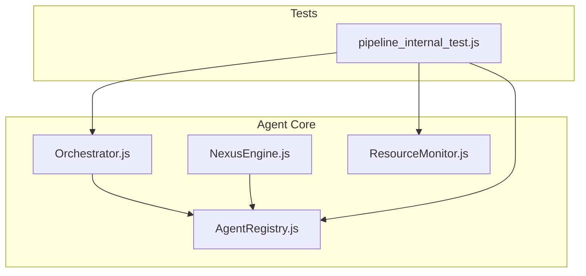
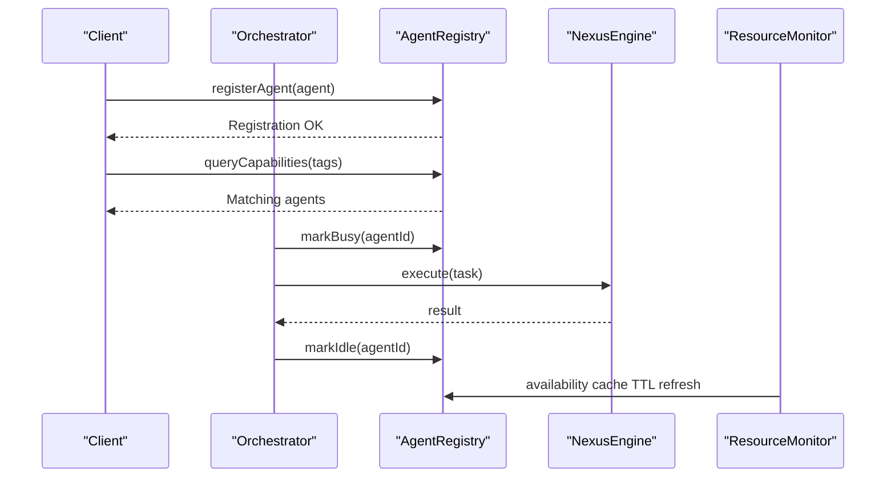
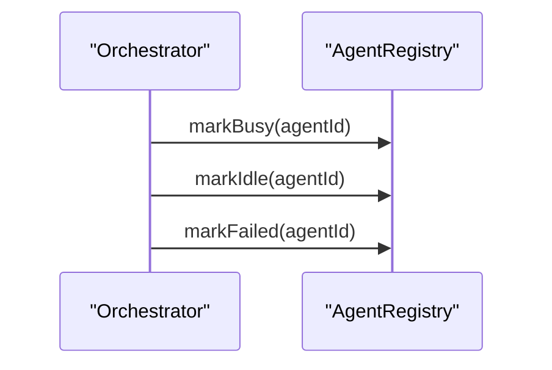
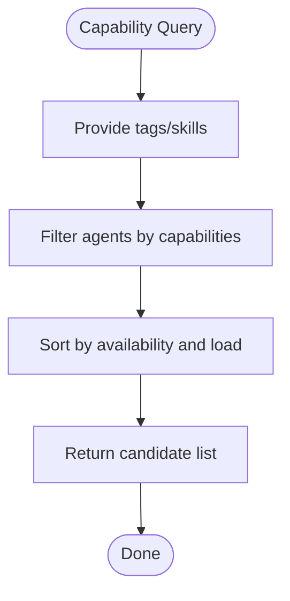
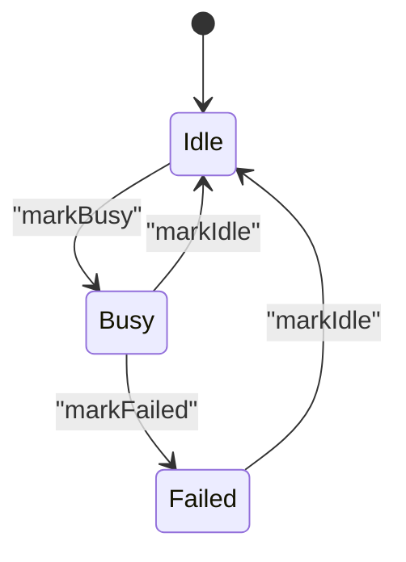
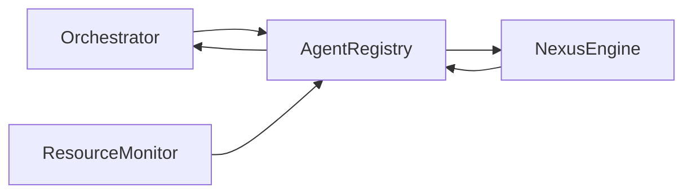

# Agent Registry API

<cite>
**Referenced Files in This Document**
- [AgentRegistry.js](file://agent/core/AgentRegistry.js)
- [Orchestrator.js](file://agent/core/Orchestrator.js)
- [NexusEngine.js](file://agent/core/NexusEngine.js)
- [ResourceMonitor.js](file://agent/core/ResourceMonitor.js)
- [pipeline_internal_test.js](file://tests/pipeline_internal_test.js)
- [NEXUS_MULTIAGENT_STABILITY_GUIDE.md](file://memory/distilled/performance/NEXUS_MULTIAGENT_STABILITY_GUIDE.md)
- [NEXUS_AGENT_GAP_ROUND3.md](file://documentation/algorithms/NEXUS_AGENT_GAP_ROUND3.md)
- [NEXUS_CORE_MODULARIZATION.md](file://memory/distilled/performance/NEXUS_CORE_MODULARIZATION.md)
</cite>

## Table of Contents
1. [Introduction](#introduction)
2. [Project Structure](#project-structure)
3. [Core Components](#core-components)
4. [Architecture Overview](#architecture-overview)
5. [Detailed Component Analysis](#detailed-component-analysis)
6. [Dependency Analysis](#dependency-analysis)
7. [Performance Considerations](#performance-considerations)
8. [Troubleshooting Guide](#troubleshooting-guide)
9. [Conclusion](#conclusion)
10. [Appendices](#appendices)

## Introduction
This document provides API documentation for the Agent Registry system within the NEXUS AI project. It focuses on agent registration and lifecycle management, agent discovery and capability queries, dynamic loading/unloading, status tracking, and health monitoring. It also covers metadata management, skill mapping, and resource allocation patterns, with practical examples and integration guidelines for concurrent access, caching, and performance optimization.

## Project Structure
The Agent Registry resides in the core agent subsystem and integrates with the Orchestrator and Nexus Engine. Tests validate integration points such as busy/idle/failed state transitions and availability caching.

**Diagram sources**
- [AgentRegistry.js](file://agent/core/AgentRegistry.js)
- [Orchestrator.js](file://agent/core/Orchestrator.js)
- [NexusEngine.js](file://agent/core/NexusEngine.js)
- [ResourceMonitor.js](file://agent/core/ResourceMonitor.js)
- [pipeline_internal_test.js](file://tests/pipeline_internal_test.js)

**Section sources**
- [AgentRegistry.js](file://agent/core/AgentRegistry.js)
- [Orchestrator.js](file://agent/core/Orchestrator.js)
- [NexusEngine.js](file://agent/core/NexusEngine.js)
- [pipeline_internal_test.js](file://tests/pipeline_internal_test.js)

## Core Components
- AgentRegistry: Central registry managing agent registration, discovery, capability queries, and lifecycle status updates.
- Orchestrator: Coordinates agent execution and integrates with AgentRegistry for busy/idle/failed transitions.
- NexusEngine: Provides engine-level capabilities and integrates with AgentRegistry.
- ResourceMonitor: Monitors system resources and influences agent scheduling and availability.

Key responsibilities:
- Registration: registerAgent(), unregisterAgent()
- Discovery: findAgent(), listAgents(), queryCapabilities()
- Lifecycle: markBusy(), markIdle(), markFailed()
- Health: availability cache TTL, circuit breaker state
- Metadata: agent metadata, skill mapping, resource allocation

**Section sources**
- [AgentRegistry.js](file://agent/core/AgentRegistry.js)
- [Orchestrator.js](file://agent/core/Orchestrator.js)
- [NexusEngine.js](file://agent/core/NexusEngine.js)
- [ResourceMonitor.js](file://agent/core/ResourceMonitor.js)
- [pipeline_internal_test.js](file://tests/pipeline_internal_test.js)

## Architecture Overview
The Agent Registry sits at the center of agent lifecycle orchestration. Orchestrator calls into AgentRegistry to update agent status during execution. NexusEngine interacts with the registry for capability-aware routing. ResourceMonitor informs scheduling decisions that indirectly affect agent availability.

**Diagram sources**
- [AgentRegistry.js](file://agent/core/AgentRegistry.js)
- [Orchestrator.js](file://agent/core/Orchestrator.js)
- [NexusEngine.js](file://agent/core/NexusEngine.js)
- [ResourceMonitor.js](file://agent/core/ResourceMonitor.js)

## Detailed Component Analysis

### AgentRegistry API Surface
- registerAgent(agent): Registers an agent with metadata and capabilities. Returns registration confirmation.
- unregisterAgent(agentId): Unregisters an agent and cleans up associated state.
- findAgent(query): Finds an agent by id, name, or metadata criteria.
- listAgents(): Lists all registered agents.
- queryCapabilities(tags): Queries agents capable of specific skills/tags.
- markBusy(agentId): Marks agent as busy.
- markIdle(agentId): Marks agent as idle.
- markFailed(agentId): Marks agent as failed.
- getAgentStatus(agentId): Retrieves current status and health metrics.
- getAgentMetadata(agentId): Retrieves metadata and skill mapping.
- allocateResources(agentId, resources): Allocates resources to an agent.
- releaseResources(agentId): Releases allocated resources.

Operational notes:
- Availability cache with TTL and circuit breaker state are maintained internally.
- Integration with Orchestrator for busy/idle/failed transitions is validated by tests.

**Section sources**
- [AgentRegistry.js](file://agent/core/AgentRegistry.js)
- [pipeline_internal_test.js](file://tests/pipeline_internal_test.js)

### Orchestrator Integration
- Orchestrator invokes AgentRegistry.markBusy() before dispatching work.
- Orchestrator invokes AgentRegistry.markIdle() upon completion.
- Orchestrator invokes AgentRegistry.markFailed() on execution errors.

**Diagram sources**
- [Orchestrator.js](file://agent/core/Orchestrator.js)
- [AgentRegistry.js](file://agent/core/AgentRegistry.js)
- [pipeline_internal_test.js](file://tests/pipeline_internal_test.js)

**Section sources**
- [pipeline_internal_test.js](file://tests/pipeline_internal_test.js)

### Capability Query Flow
Capability queries enable discovery of agents by skills/tags. The registry filters agents based on declared capabilities and returns candidates for selection.

**Diagram sources**
- [AgentRegistry.js](file://agent/core/AgentRegistry.js)

**Section sources**
- [AgentRegistry.js](file://agent/core/AgentRegistry.js)

### Dynamic Loading/Unloading Patterns
- Dynamic loading: registerAgent() adds agents at runtime.
- Dynamic unloading: unregisterAgent() removes agents and releases resources.
- Resource allocation/release: allocateResources()/releaseResources() manage capacity.

Integration patterns:
- Use ResourceMonitor to assess system stress before registering heavy agents.
- Use availability cache TTL to avoid frequent re-discovery.

**Section sources**
- [AgentRegistry.js](file://agent/core/AgentRegistry.js)
- [ResourceMonitor.js](file://agent/core/ResourceMonitor.js)

### Status Tracking and Health Monitoring
- Status transitions: markBusy -> markIdle/markFailed.
- Health indicators: availability cache expiry and circuit breaker state.
- Tests validate TTL cache presence and circuit breaker states.

**Diagram sources**
- [AgentRegistry.js](file://agent/core/AgentRegistry.js)
- [pipeline_internal_test.js](file://tests/pipeline_internal_test.js)

**Section sources**
- [pipeline_internal_test.js](file://tests/pipeline_internal_test.js)

### Metadata Management and Skill Mapping
- Metadata: stored per agent for identification, capabilities, and preferences.
- Skill mapping: tags/skills associated with agents for capability queries.
- Resource allocation: per-agent resource pools managed via registry APIs.

Best practices:
- Keep metadata concise and indexed for fast lookups.
- Normalize skill names and maintain a taxonomy for consistent queries.

**Section sources**
- [AgentRegistry.js](file://agent/core/AgentRegistry.js)

## Dependency Analysis
The Agent Registry depends on Orchestrator for lifecycle events and on NexusEngine for capability-aware routing. ResourceMonitor influences scheduling and availability.

**Diagram sources**
- [AgentRegistry.js](file://agent/core/AgentRegistry.js)
- [Orchestrator.js](file://agent/core/Orchestrator.js)
- [NexusEngine.js](file://agent/core/NexusEngine.js)
- [ResourceMonitor.js](file://agent/core/ResourceMonitor.js)

**Section sources**
- [AgentRegistry.js](file://agent/core/AgentRegistry.js)
- [Orchestrator.js](file://agent/core/Orchestrator.js)
- [NexusEngine.js](file://agent/core/NexusEngine.js)
- [ResourceMonitor.js](file://agent/core/ResourceMonitor.js)

## Performance Considerations
- Caching strategies:
  - Availability cache with TTL reduces repeated discovery overhead.
  - Circuit breaker prevents thrashing under failure conditions.
- Concurrency:
  - Use locks or atomic operations around status transitions to prevent race conditions.
  - Batch capability queries to minimize repeated filtering.
- Resource allocation:
  - Pre-allocate resources based on ResourceMonitor feedback.
  - Release resources promptly after completion to improve throughput.
- Indexing:
  - Maintain indexes for agent ids, tags, and metadata to accelerate lookups.
- Scalability:
  - Partition agents by domain or capability to reduce contention.
  - Use sharding for very large registries.

[No sources needed since this section provides general guidance]

## Troubleshooting Guide
Common issues and resolutions:
- Availability cache not initialized:
  - Ensure availability cache exists and contains expiration timestamps.
- Circuit breaker invalid state:
  - Validate that the circuit breaker state is one of CLOSED, OPEN, or HALF-OPEN.
- Orchestrator not updating status:
  - Confirm that Orchestrator calls markBusy/markIdle/markFailed during execution.
- Resource starvation:
  - Use ResourceMonitor to throttle or pause new registrations under high stress.

Validation references:
- Availability cache TTL and circuit breaker checks.
- Orchestrator handler array and cleanup behavior.
- Resource stress checks prior to project setup.

**Section sources**
- [pipeline_internal_test.js](file://tests/pipeline_internal_test.js)
- [ResourceMonitor.js](file://agent/core/ResourceMonitor.js)

## Conclusion
The Agent Registry provides a robust foundation for agent lifecycle management, discovery, and health monitoring. By integrating with Orchestrator, NexusEngine, and ResourceMonitor, it enables scalable, capability-aware agent orchestration. Proper caching, concurrency controls, and resource allocation strategies are essential for high-performance deployments.

[No sources needed since this section summarizes without analyzing specific files]

## Appendices

### API Reference Summary
- Registration
  - registerAgent(agent): Register an agent with metadata and capabilities.
  - unregisterAgent(agentId): Unregister and clean up.
- Discovery
  - findAgent(query): Locate agent by id/name/metadata.
  - listAgents(): Enumerate all registered agents.
  - queryCapabilities(tags): Discover agents by skills/tags.
- Lifecycle
  - markBusy(agentId), markIdle(agentId), markFailed(agentId): Update status.
- Health
  - getAgentStatus(agentId): Retrieve status and health metrics.
  - getAgentMetadata(agentId): Retrieve metadata and skill mapping.
- Resources
  - allocateResources(agentId, resources): Assign resources.
  - releaseResources(agentId): Free resources.

**Section sources**
- [AgentRegistry.js](file://agent/core/AgentRegistry.js)

### Integration Examples
- Agent registration workflow:
  - Prepare agent metadata and capabilities.
  - Call registerAgent().
  - Verify availability cache and circuit breaker state.
- Capability querying:
  - Provide skill tags.
  - Receive candidate list sorted by availability.
  - Select agent and dispatch work.
- Registry integration patterns:
  - Before execution: Orchestrator calls markBusy().
  - On completion: Orchestrator calls markIdle().
  - On error: Orchestrator calls markFailed().

**Section sources**
- [AgentRegistry.js](file://agent/core/AgentRegistry.js)
- [Orchestrator.js](file://agent/core/Orchestrator.js)
- [pipeline_internal_test.js](file://tests/pipeline_internal_test.js)

### Related Documents
- Multi-agent stability and performance guidelines.
- Agent gap analysis and modularization strategies.

**Section sources**
- [NEXUS_MULTIAGENT_STABILITY_GUIDE.md](file://memory/distilled/performance/NEXUS_MULTIAGENT_STABILITY_GUIDE.md)
- [NEXUS_AGENT_GAP_ROUND3.md](file://documentation/algorithms/NEXUS_AGENT_GAP_ROUND3.md)
- [NEXUS_CORE_MODULARIZATION.md](file://memory/distilled/performance/NEXUS_CORE_MODULARIZATION.md)