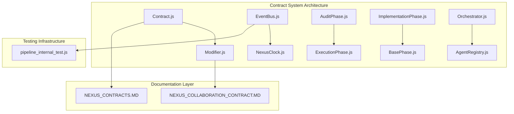
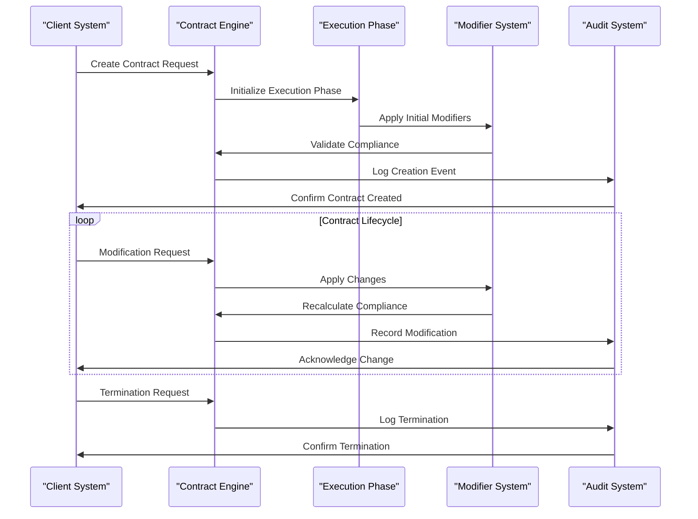
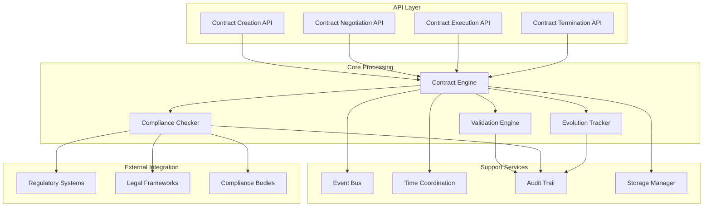
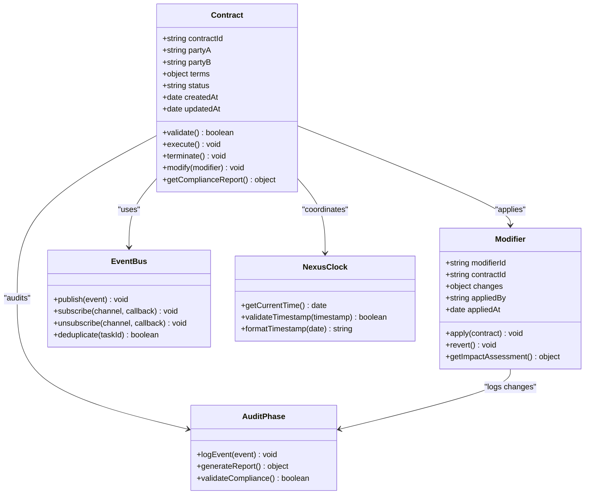
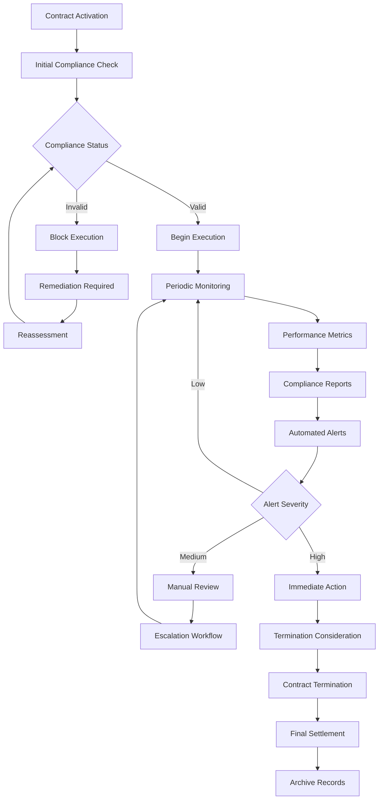
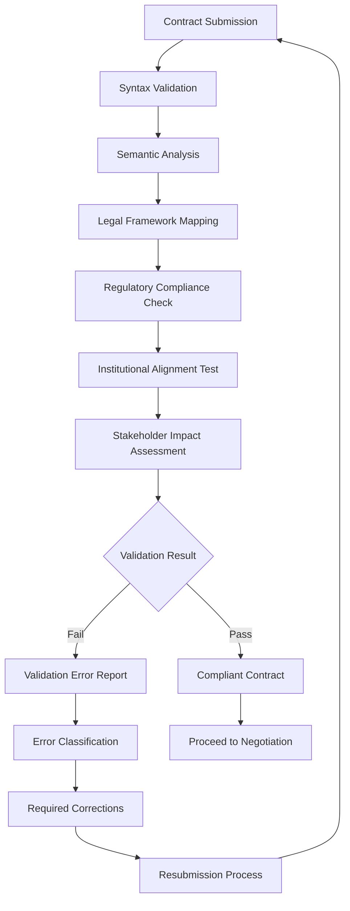
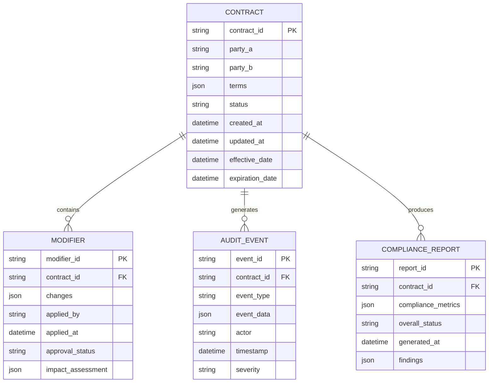
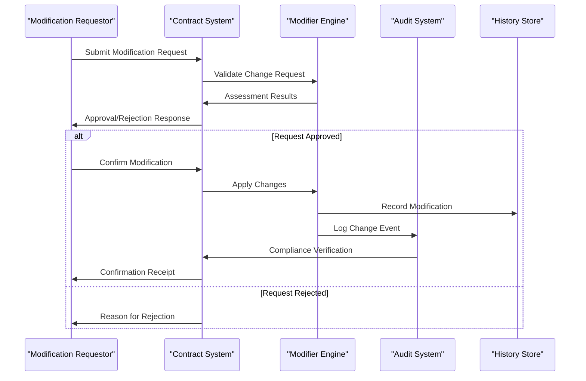
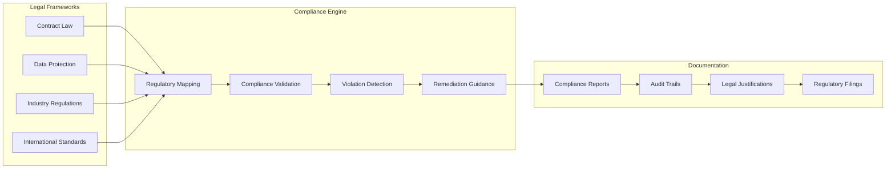

# Contract System API

<cite>
**Referenced Files in This Document**
- [Contract.js](file://agent/core/Contract.js)
- [Modifier.js](file://agent/core/Modifier.js)
- [NEXUS_CONTRACTS.MD](file://memory/archived/standards/NEXUS_CONTRACTS.MD)
- [NEXUS_COLLABORATION_CONTRACT.MD](file://memory/archived/standards/NEXUS_COLLABORATION_CONTRACT.MD)
- [EventBus.js](file://agent/core/EventBus.js)
- [NexusClock.js](file://agent/core/NexusClock.js)
- [AuditPhase.js](file://agent/core/phases/AuditPhase.js)
- [ExecutionPhase.js](file://agent/core/phases/ExecutionPhase.js)
- [ImplementationPhase.js](file://agent/core/phases/ImplementationPhase.js)
- [BasePhase.js](file://agent/core/phases/BasePhase.js)
- [Orchestrator.js](file://agent/core/Orchestrator.js)
- [AgentRegistry.js](file://agent/core/AgentRegistry.js)
- [pipeline_internal_test.js](file://tests/pipeline_internal_test.js)
</cite>

## Table of Contents
1. [Introduction](#introduction)
2. [Project Structure](#project-structure)
3. [Core Components](#core-components)
4. [Architecture Overview](#architecture-overview)
5. [Detailed Component Analysis](#detailed-component-analysis)
6. [Contract Lifecycle Management](#contract-lifecycle-management)
7. [Validation and Compliance Systems](#validation-and-compliance-systems)
8. [Storage and Retrieval Interfaces](#storage-and-retrieval-interfaces)
9. [Modification and Evolution Tracking](#modification-and-evolution-tracking)
10. [Legal Compliance and Regulatory Integration](#legal-compliance-and-regulatory-integration)
11. [Performance Considerations](#performance-considerations)
12. [Troubleshooting Guide](#troubleshooting-guide)
13. [Conclusion](#conclusion)

## Introduction

The Contract System API manages agent agreements and obligations within the NEXUS AI framework. This system provides comprehensive contract lifecycle management including creation, negotiation, execution, and termination. The API ensures legal compliance, maintains audit trails, and integrates regulatory requirements through automated validation and monitoring systems.

The system operates on institutionalized principles that govern agent interactions, ensuring transparency, accountability, and adherence to established standards. Contracts serve as binding agreements that define obligations, permissions, and constraints for autonomous agent behavior.

## Project Structure

The Contract System is organized within the agent core architecture, with specialized components handling different aspects of contract management:



**Diagram sources**
- [Contract.js](file://agent/core/Contract.js)
- [Modifier.js](file://agent/core/Modifier.js)
- [EventBus.js](file://agent/core/EventBus.js)
- [NexusClock.js](file://agent/core/NexusClock.js)
- [NEXUS_CONTRACTS.MD](file://memory/archived/standards/NEXUS_CONTRACTS.MD)
- [NEXUS_COLLABORATION_CONTRACT.MD](file://memory/archived/standards/NEXUS_COLLABORATION_CONTRACT.MD)
- [pipeline_internal_test.js](file://tests/pipeline_internal_test.js)

**Section sources**
- [Contract.js](file://agent/core/Contract.js)
- [Modifier.js](file://agent/core/Modifier.js)
- [NEXUS_CONTRACTS.MD](file://memory/archived/standards/NEXUS_CONTRACTS.MD)

## Core Components

### Contract Management Engine

The Contract system centers around the Contract.js module, which serves as the primary interface for contract operations. This component manages contract states, validations, and lifecycle transitions while maintaining strict adherence to institutional guidelines.

Key responsibilities include:
- Contract creation and initialization
- Validation against compliance frameworks
- State management throughout contract lifecycle
- Integration with temporal coordination systems

### Modifier Application System

The Modifier.js component handles dynamic contract modifications and evolution tracking. It provides mechanisms for applying changes while maintaining historical context and ensuring backward compatibility.

Core functionalities:
- Dynamic modifier application
- Evolution tracking and versioning
- Compliance impact assessment
- Historical change management

### Phase-Based Execution Control

The system employs a multi-phase approach for contract execution, with specialized phases handling different aspects of contract management:



**Diagram sources**
- [Contract.js](file://agent/core/Contract.js)
- [ExecutionPhase.js](file://agent/core/phases/ExecutionPhase.js)
- [Modifier.js](file://agent/core/Modifier.js)
- [AuditPhase.js](file://agent/core/phases/AuditPhase.js)

**Section sources**
- [Contract.js](file://agent/core/Contract.js)
- [Modifier.js](file://agent/core/Modifier.js)
- [ExecutionPhase.js](file://agent/core/phases/ExecutionPhase.js)

## Architecture Overview

The Contract System follows a distributed architecture pattern that ensures scalability, maintainability, and compliance:



**Diagram sources**
- [Contract.js](file://agent/core/Contract.js)
- [EventBus.js](file://agent/core/EventBus.js)
- [NexusClock.js](file://agent/core/NexusClock.js)
- [AuditPhase.js](file://agent/core/phases/AuditPhase.js)

The architecture ensures separation of concerns while maintaining tight integration between validation, execution, and compliance monitoring systems.

## Detailed Component Analysis

### Contract Class Architecture



**Diagram sources**
- [Contract.js](file://agent/core/Contract.js)
- [Modifier.js](file://agent/core/Modifier.js)
- [EventBus.js](file://agent/core/EventBus.js)
- [NexusClock.js](file://agent/core/NexusClock.js)
- [AuditPhase.js](file://agent/core/phases/AuditPhase.js)

### Contract Lifecycle Management

The system implements a comprehensive lifecycle management approach that covers all phases from creation to termination:

```mermaid
stateDiagram-v2
[*] --> Draft
Draft --> Negotiation : Proposal Submitted
Negotiation --> Active : Agreement Reached
Negotiation --> Draft : Revisions Needed
Active --> Execution : Start Date Reached
Execution --> Completed : Obligations Fulfilled
Execution --> Breach : Non-Compliance Detected
Active --> Suspended : Terms Modified
Suspended --> Active : Modifications Approved
Breach --> Terminated : Legal Action
Active --> Terminated : Agreement Ended
Completed --> Terminated : Final Settlement
Terminated --> [*]
state Active {
[*] --> Execution
Execution --> Monitoring : Compliance Verified
Monitoring --> Breach : Violation Detected
Monitoring --> Suspense : Pending Issues
}
state Suspense {
[*] --> Review
Review --> Resolution : Issue Resolved
Review --> Suspense : Further Review Needed
}
```

**Diagram sources**
- [Contract.js](file://agent/core/Contract.js)
- [ExecutionPhase.js](file://agent/core/phases/ExecutionPhase.js)
- [AuditPhase.js](file://agent/core/phases/AuditPhase.js)

**Section sources**
- [Contract.js](file://agent/core/Contract.js)
- [ExecutionPhase.js](file://agent/core/phases/ExecutionPhase.js)
- [AuditPhase.js](file://agent/core/phases/AuditPhase.js)

## Contract Lifecycle Management

### Contract Creation API

The contract creation process involves multiple validation stages and compliance checks:

1. **Initial Proposal Submission**
   - Party identification and authorization verification
   - Basic terms and conditions specification
   - Initial compliance assessment

2. **Negotiation Phase**
   - Multi-party discussion and agreement building
   - Terms refinement and optimization
   - Stakeholder approval workflows

3. **Formalization Process**
   - Contract template generation
   - Legal review and approval
   - Digital signature and timestamping

### Contract Execution Management

Execution monitoring ensures continuous compliance and performance tracking:



**Diagram sources**
- [Contract.js](file://agent/core/Contract.js)
- [ExecutionPhase.js](file://agent/core/phases/ExecutionPhase.js)
- [AuditPhase.js](file://agent/core/phases/AuditPhase.js)

### Contract Termination Procedures

Termination follows structured procedures to ensure proper closure and compliance:

1. **Termination Request Processing**
   - Validity verification and authorization checks
   - Outstanding obligation settlement
   - Financial and legal obligations fulfillment

2. **Post-Termination Activities**
   - Archive preservation and access controls
   - Final compliance audit
   - Stakeholder notification and settlement

**Section sources**
- [Contract.js](file://agent/core/Contract.js)
- [ExecutionPhase.js](file://agent/core/phases/ExecutionPhase.js)

## Validation and Compliance Systems

### Automated Compliance Checking

The system implements comprehensive validation mechanisms:



**Diagram sources**
- [Contract.js](file://agent/core/Contract.js)
- [NEXUS_CONTRACTS.MD](file://memory/archived/standards/NEXUS_CONTRACTS.MD)
- [NEXUS_COLLABORATION_CONTRACT.MD](file://memory/archived/standards/NEXUS_COLLABORATION_CONTRACT.MD)

### Real-Time Compliance Monitoring

Continuous monitoring ensures ongoing adherence to contractual obligations:

- **Performance Metrics Tracking**: Real-time measurement of key performance indicators
- **Behavioral Pattern Analysis**: Detection of deviations from agreed terms
- **Automated Alert Systems**: Immediate notification of potential compliance issues
- **Predictive Compliance Modeling**: Anticipatory identification of potential violations

**Section sources**
- [Contract.js](file://agent/core/Contract.js)
- [NexusClock.js](file://agent/core/NexusClock.js)
- [AuditPhase.js](file://agent/core/phases/AuditPhase.js)

## Storage and Retrieval Interfaces

### Contract Data Management

The system provides robust storage mechanisms for contract data:



**Diagram sources**
- [Contract.js](file://agent/core/Contract.js)
- [Modifier.js](file://agent/core/Modifier.js)
- [AuditPhase.js](file://agent/core/phases/AuditPhase.js)

### Retrieval and Search Capabilities

Advanced search and retrieval mechanisms support efficient contract management:

- **Full-Text Search**: Comprehensive contract content indexing
- **Metadata Filtering**: Targeted retrieval based on contract attributes
- **Temporal Queries**: Historical contract lookup and comparison
- **Relationship Traversal**: Associated contract and modifier discovery

**Section sources**
- [Contract.js](file://agent/core/Contract.js)
- [Modifier.js](file://agent/core/Modifier.js)

## Modification and Evolution Tracking

### Dynamic Contract Evolution

The system supports controlled contract modifications while maintaining historical context:



**Diagram sources**
- [Modifier.js](file://agent/core/Modifier.js)
- [Contract.js](file://agent/core/Contract.js)
- [AuditPhase.js](file://agent/core/phases/AuditPhase.js)

### Evolution Impact Assessment

Each modification triggers comprehensive impact analysis:

1. **Legal Impact Evaluation**
   - Regulatory compliance effects
   - Contractual validity assessment
   - Third-party rights consideration

2. **Operational Impact Analysis**
   - System performance implications
   - Resource allocation changes
   - Integration compatibility checks

3. **Financial Impact Calculation**
   - Cost-benefit analysis
   - Revenue/profitability effects
   - Risk assessment and mitigation

**Section sources**
- [Modifier.js](file://agent/core/Modifier.js)
- [Contract.js](file://agent/core/Contract.js)

## Legal Compliance and Regulatory Integration

### Regulatory Framework Integration

The system incorporates comprehensive regulatory compliance mechanisms:



**Diagram sources**
- [NEXUS_CONTRACTS.MD](file://memory/archived/standards/NEXUS_CONTRACTS.MD)
- [NEXUS_COLLABORATION_CONTRACT.MD](file://memory/archived/standards/NEXUS_COLLABORATION_CONTRACT.MD)
- [Contract.js](file://agent/core/Contract.js)

### Dispute Resolution Mechanisms

Integrated dispute resolution supports efficient conflict management:

1. **Automated Dispute Detection**
   - Pattern recognition for potential conflicts
   - Early warning systems for high-risk situations
   - Predictive analytics for dispute likelihood

2. **Resolution Workflow Integration**
   - Mediation support and facilitation
   - Arbitration process initiation
   - Legal representation coordination

3. **Documentation and Evidence Preservation**
   - Complete audit trail maintenance
   - Evidence collection and organization
   - Legal proceeding preparation

**Section sources**
- [NEXUS_CONTRACTS.MD](file://memory/archived/standards/NEXUS_CONTRACTS.MD)
- [NEXUS_COLLABORATION_CONTRACT.MD](file://memory/archived/standards/NEXUS_COLLABORATION_CONTRACT.MD)

## Performance Considerations

### System Scalability

The Contract System is designed for high-performance operation:

- **Asynchronous Processing**: Non-blocking operations for improved responsiveness
- **Caching Strategies**: Intelligent caching of frequently accessed contract data
- **Load Distribution**: Distributed processing for high-volume contract management
- **Resource Optimization**: Efficient memory and CPU utilization patterns

### Monitoring and Metrics

Comprehensive performance monitoring ensures optimal system operation:

- **Real-time Performance Tracking**: Continuous system health monitoring
- **Capacity Planning Tools**: Predictive scaling and resource allocation
- **Error Rate Analytics**: Trend analysis for system reliability improvement
- **User Experience Metrics**: Performance impact assessment on contract operations

## Troubleshooting Guide

### Common Issues and Solutions

**Contract Creation Failures**
- Verify legal framework alignment
- Check stakeholder authorization status
- Validate required metadata completeness
- Review compliance validation results

**Execution Monitoring Problems**
- Confirm clock synchronization with NexusClock
- Verify event bus connectivity and message routing
- Check audit trail accessibility and completeness
- Validate compliance checker configuration

**Modification Processing Issues**
- Review modifier application permissions
- Verify impact assessment completion
- Check historical change conflicts
- Validate reapplication feasibility

### Diagnostic Procedures

1. **System Health Check**
   - Verify core component initialization
   - Check database connectivity and performance
   - Validate external service integrations
   - Review memory and resource utilization

2. **Contract State Verification**
   - Confirm contract status consistency
   - Verify compliance tracking accuracy
   - Check audit trail completeness
   - Validate modification history integrity

**Section sources**
- [pipeline_internal_test.js](file://tests/pipeline_internal_test.js)
- [EventBus.js](file://agent/core/EventBus.js)
- [Contract.js](file://agent/core/Contract.js)

## Conclusion

The Contract System API provides a comprehensive framework for managing agent agreements and obligations within the NEXUS AI ecosystem. Through its multi-layered architecture, the system ensures legal compliance, maintains detailed audit trails, and supports dynamic contract evolution while preserving institutional integrity.

Key strengths include:
- **Robust Legal Framework Integration**: Comprehensive compliance checking against multiple regulatory domains
- **Advanced Monitoring Capabilities**: Real-time performance tracking and automated alert systems
- **Flexible Evolution Support**: Controlled modification mechanisms with complete impact assessment
- **Transparent Governance**: Complete audit trails and documentation for all contract activities

The system's design enables efficient contract lifecycle management while maintaining the highest standards of legal compliance and regulatory adherence. Future enhancements will focus on expanding integration capabilities, improving automation features, and enhancing user experience for contract management operations.