# Decision Engine API

<cite>
**Referenced Files in This Document**
- [DecisionEngine.js](file://agent/core/DecisionEngine.js)
- [PlanningPhase.js](file://agent/core/phases/PlanningPhase.js)
- [ExecutionPhase.js](file://agent/core/phases/ExecutionPhase.js)
- [KnowledgePhase.js](file://agent/core/phases/KnowledgePhase.js)
- [ImplementationPhase.js](file://agent/core/phases/ImplementationPhase.js)
- [BasePhase.js](file://agent/core/phases/BasePhase.js)
- [CoreUtils.js](file://agent/core/phases/CoreUtils.js)
- [AuditPhase.js](file://agent/core/phases/AuditPhase.js)
- [AgentRegistry.js](file://agent/core/AgentRegistry.js)
- [Orchestrator.js](file://agent/core/Orchestrator.js)
- [NexusEngine.js](file://agent/core/NexusEngine.js)
- [SemanticEngine.js](file://agent/core/SemanticEngine.js)
- [MemoryGovernor.js](file://agent/core/MemoryGovernor.js)
- [Logger.js](file://agent/core/Logger.js)
- [NativeBridge.js](file://agent/core/NativeBridge.js)
- [RedisMemory.js](file://agent/core/RedisMemory.js)
- [TaskProtocol.js](file://agent/core/TaskProtocol.js)
- [ResourceMonitor.js](file://agent/core/ResourceMonitor.js)
- [Machinist.js](file://agent/core/Machinist.js)
- [EvolutionPiper.js](file://agent/core/EvolutionPiper.js)
- [SandboxExecutor.js](file://agent/core/SandboxExecutor.js)
- [ParallelRunner.js](file://agent/core/ParallelRunner.js)
- [MemoryPipeline.js](file://agent/core/MemoryPipeline.js)
- [Distiller.js](file://agent/core/Distiller.js)
- [LocalIntelligence.js](file://agent/core/LocalIntelligence.js)
- [NexusClock.js](file://agent/core/NexusClock.js)
- [Contract.js](file://agent/core/Contract.js)
- [EventBus.js](file://agent/core/EventBus.js)
- [Modifier.js](file://agent/core/Modifier.js)
- [WorktreeManager.js](file://agent/core/WorktreeManager.js)
- [pipeline_internal_test.js](file://tests/pipeline_internal_test.js)
- [test-vector.js](file://tests/test-vector.js)
- [NEXUS_AUDIT_SUMMARY_AUDIT-1779702317598.MD](file://memory/raw/NEXUS_AUDIT_SUMMARY_AUDIT-1779702317598.MD)
- [NEXUS_STABILIZATION_RECORD.MD](file://memory/distilled/tdd/NEXUS_STABILIZATION_RECORD.MD)
- [executing-plans.yaml](file://memory/references/amplifier-bundle-superpowers-main/recipes/executing-plans.yaml)
- [subagent-development.yaml](file://memory/references/amplifier-bundle-superpowers-main/recipes/subagent-development.yaml)
</cite>

## Table of Contents
1. [Introduction](#introduction)
2. [Project Structure](#project-structure)
3. [Core Components](#core-components)
4. [Architecture Overview](#architecture-overview)
5. [Detailed Component Analysis](#detailed-component-analysis)
6. [Dependency Analysis](#dependency-analysis)
7. [Performance Considerations](#performance-considerations)
8. [Troubleshooting Guide](#troubleshooting-guide)
9. [Conclusion](#conclusion)
10. [Appendices](#appendices)

## Introduction
This document describes the Decision Engine API responsible for strategic decision-making and planning. It covers decision evaluation methods, strategy selection algorithms, execution prioritization, intelligence gathering, pattern recognition, adaptive reasoning, logging and audit trails, explainability, machine learning integration, model training interfaces, performance optimization, uncertainty handling, risk assessment, and ethical decision frameworks. The content is derived from the repository’s core modules and supporting artifacts.

## Project Structure
The Decision Engine spans several core modules under agent/core, organized by functional phases and utilities. Key areas include:
- Decision lifecycle phases: Planning, Execution, Knowledge, Implementation, Audit
- Infrastructure: Agent registry, orchestrator, memory managers, semantic engine, logger, native bridge, resource monitor
- Pipelines and utilities: Nexus engine, distiller, machinist, evolution piper, sandbox executor, parallel runner, memory pipeline
- Testing and validation: Internal pipeline tests, vector search verification, stabilization records, audit summaries

```mermaid
graph TB
subgraph "Decision Phases"
P["PlanningPhase.js"]
E["ExecutionPhase.js"]
K["KnowledgePhase.js"]
I["ImplementationPhase.js"]
A["AuditPhase.js"]
end
subgraph "Core Engine"
DE["DecisionEngine.js"]
ORCH["Orchestrator.js"]
AR["AgentRegistry.js"]
LG["Logger.js"]
NM["NexusEngine.js"]
SM["SemanticEngine.js"]
MG["MemoryGovernor.js"]
RM["ResourceMonitor.js"]
end
subgraph "Utilities"
NB["NativeBridge.js"]
RD["RedisMemory.js"]
TP["TaskProtocol.js"]
EP["EvolutionPiper.js"]
SB["SandboxExecutor.js"]
PR["ParallelRunner.js"]
MP["MemoryPipeline.js"]
DT["Distiller.js"]
LC["LocalIntelligence.js"]
NC["NexusClock.js"]
CT["Contract.js"]
EB["EventBus.js"]
MD["Modifier.js"]
WT["WorktreeManager.js"]
end
DE --> P
DE --> E
DE --> K
DE --> I
DE --> A
DE --> ORCH
ORCH --> AR
ORCH --> LG
DE --> NM
DE --> SM
DE --> MG
DE --> RM
DE --> NB
DE --> RD
DE --> TP
DE --> EP
DE --> SB
DE --> PR
DE --> MP
DE --> DT
DE --> LC
DE --> NC
DE --> CT
DE --> EB
DE --> MD
DE --> WT
```

**Diagram sources**
- [DecisionEngine.js](file://agent/core/DecisionEngine.js)
- [PlanningPhase.js](file://agent/core/phases/PlanningPhase.js)
- [ExecutionPhase.js](file://agent/core/phases/ExecutionPhase.js)
- [KnowledgePhase.js](file://agent/core/phases/KnowledgePhase.js)
- [ImplementationPhase.js](file://agent/core/phases/ImplementationPhase.js)
- [AuditPhase.js](file://agent/core/phases/AuditPhase.js)
- [Orchestrator.js](file://agent/core/Orchestrator.js)
- [AgentRegistry.js](file://agent/core/AgentRegistry.js)
- [NexusEngine.js](file://agent/core/NexusEngine.js)
- [SemanticEngine.js](file://agent/core/SemanticEngine.js)
- [MemoryGovernor.js](file://agent/core/MemoryGovernor.js)
- [ResourceMonitor.js](file://agent/core/ResourceMonitor.js)
- [NativeBridge.js](file://agent/core/NativeBridge.js)
- [RedisMemory.js](file://agent/core/RedisMemory.js)
- [TaskProtocol.js](file://agent/core/TaskProtocol.js)
- [EvolutionPiper.js](file://agent/core/EvolutionPiper.js)
- [SandboxExecutor.js](file://agent/core/SandboxExecutor.js)
- [ParallelRunner.js](file://agent/core/ParallelRunner.js)
- [MemoryPipeline.js](file://agent/core/MemoryPipeline.js)
- [Distiller.js](file://agent/core/Distiller.js)
- [LocalIntelligence.js](file://agent/core/LocalIntelligence.js)
- [NexusClock.js](file://agent/core/NexusClock.js)
- [Contract.js](file://agent/core/Contract.js)
- [EventBus.js](file://agent/core/EventBus.js)
- [Modifier.js](file://agent/core/Modifier.js)
- [WorktreeManager.js](file://agent/core/WorktreeManager.js)

**Section sources**
- [DecisionEngine.js](file://agent/core/DecisionEngine.js)
- [PlanningPhase.js](file://agent/core/phases/PlanningPhase.js)
- [ExecutionPhase.js](file://agent/core/phases/ExecutionPhase.js)
- [KnowledgePhase.js](file://agent/core/phases/KnowledgePhase.js)
- [ImplementationPhase.js](file://agent/core/phases/ImplementationPhase.js)
- [AuditPhase.js](file://agent/core/phases/AuditPhase.js)
- [Orchestrator.js](file://agent/core/Orchestrator.js)
- [AgentRegistry.js](file://agent/core/AgentRegistry.js)
- [NexusEngine.js](file://agent/core/NexusEngine.js)
- [SemanticEngine.js](file://agent/core/SemanticEngine.js)
- [MemoryGovernor.js](file://agent/core/MemoryGovernor.js)
- [ResourceMonitor.js](file://agent/core/ResourceMonitor.js)
- [NativeBridge.js](file://agent/core/NativeBridge.js)
- [RedisMemory.js](file://agent/core/RedisMemory.js)
- [TaskProtocol.js](file://agent/core/TaskProtocol.js)
- [EvolutionPiper.js](file://agent/core/EvolutionPiper.js)
- [SandboxExecutor.js](file://agent/core/SandboxExecutor.js)
- [ParallelRunner.js](file://agent/core/ParallelRunner.js)
- [MemoryPipeline.js](file://agent/core/MemoryPipeline.js)
- [Distiller.js](file://agent/core/Distiller.js)
- [LocalIntelligence.js](file://agent/core/LocalIntelligence.js)
- [NexusClock.js](file://agent/core/NexusClock.js)
- [Contract.js](file://agent/core/Contract.js)
- [EventBus.js](file://agent/core/EventBus.js)
- [Modifier.js](file://agent/core/Modifier.js)
- [WorktreeManager.js](file://agent/core/WorktreeManager.js)

## Core Components
- DecisionEngine: Central coordinator orchestrating planning, execution, knowledge, implementation, and audit phases. Provides decision evaluation and strategy selection APIs.
- PlanningPhase: Generates candidate strategies and plans from goals and context.
- ExecutionPhase: Executes selected strategies with prioritization and resource-aware scheduling.
- KnowledgePhase: Gathers and synthesizes domain knowledge and constraints.
- ImplementationPhase: Translates plans into executable tasks respecting dependencies and readiness.
- AuditPhase: Reviews outcomes and enforces governance and quality gates.
- Orchestrator: Manages agent allocation, lifecycle, and coordination across phases.
- AgentRegistry: Tracks agent availability and status (busy/idle/failed).
- SemanticEngine: Enables semantic search and retrieval for pattern recognition and reasoning.
- MemoryGovernor: Ensures memory integrity and consistency across cycles.
- ResourceMonitor: Observes and reports resource utilization for adaptive decisions.
- NexusEngine: Core engine managing paths, indexing, and semantic tags.
- Distiller: Extracts distilled knowledge for reuse and reasoning.
- Machinist: Supports iterative refinement and optimization.
- EvolutionPiper: Persists and loads evolutionary cycle state.
- SandboxExecutor: Executes tasks in isolated environments.
- ParallelRunner: Coordinates concurrent task execution.
- MemoryPipeline: Manages memory stages and transformations.
- Logger: Provides structured logging and audit trails.
- NativeBridge: Integrates with native capabilities.
- RedisMemory: Optional distributed memory backing.
- TaskProtocol: Defines task contracts and protocols.
- LocalIntelligence: Encapsulates local reasoning and pattern matching.
- NexusClock: Provides temporal coordination for decisions.
- Contract: Enforces behavioral contracts for agents and components.
- EventBus: Publishes and subscribes to cross-component events.
- Modifier: Applies policy-based modifications to decisions.
- WorktreeManager: Manages working tree snapshots and diffs.

**Section sources**
- [DecisionEngine.js](file://agent/core/DecisionEngine.js)
- [PlanningPhase.js](file://agent/core/phases/PlanningPhase.js)
- [ExecutionPhase.js](file://agent/core/phases/ExecutionPhase.js)
- [KnowledgePhase.js](file://agent/core/phases/KnowledgePhase.js)
- [ImplementationPhase.js](file://agent/core/phases/ImplementationPhase.js)
- [AuditPhase.js](file://agent/core/phases/AuditPhase.js)
- [Orchestrator.js](file://agent/core/Orchestrator.js)
- [AgentRegistry.js](file://agent/core/AgentRegistry.js)
- [SemanticEngine.js](file://agent/core/SemanticEngine.js)
- [MemoryGovernor.js](file://agent/core/MemoryGovernor.js)
- [ResourceMonitor.js](file://agent/core/ResourceMonitor.js)
- [NexusEngine.js](file://agent/core/NexusEngine.js)
- [Distiller.js](file://agent/core/Distiller.js)
- [Machinist.js](file://agent/core/Machinist.js)
- [EvolutionPiper.js](file://agent/core/EvolutionPiper.js)
- [SandboxExecutor.js](file://agent/core/SandboxExecutor.js)
- [ParallelRunner.js](file://agent/core/ParallelRunner.js)
- [MemoryPipeline.js](file://agent/core/MemoryPipeline.js)
- [Logger.js](file://agent/core/Logger.js)
- [NativeBridge.js](file://agent/core/NativeBridge.js)
- [RedisMemory.js](file://agent/core/RedisMemory.js)
- [TaskProtocol.js](file://agent/core/TaskProtocol.js)
- [LocalIntelligence.js](file://agent/core/LocalIntelligence.js)
- [NexusClock.js](file://agent/core/NexusClock.js)
- [Contract.js](file://agent/core/Contract.js)
- [EventBus.js](file://agent/core/EventBus.js)
- [Modifier.js](file://agent/core/Modifier.js)
- [WorktreeManager.js](file://agent/core/WorktreeManager.js)

## Architecture Overview
The Decision Engine follows a phased architecture with strong separation of concerns:
- Decision phases encapsulate distinct stages of the decision lifecycle.
- The Orchestrator coordinates agents and resources across phases.
- SemanticEngine and LocalIntelligence power pattern recognition and reasoning.
- MemoryGovernor and MemoryPipeline ensure reliable state management.
- ResourceMonitor and NexusClock enable adaptive and time-aware decisions.
- Logging and auditing are integrated throughout for transparency and compliance.

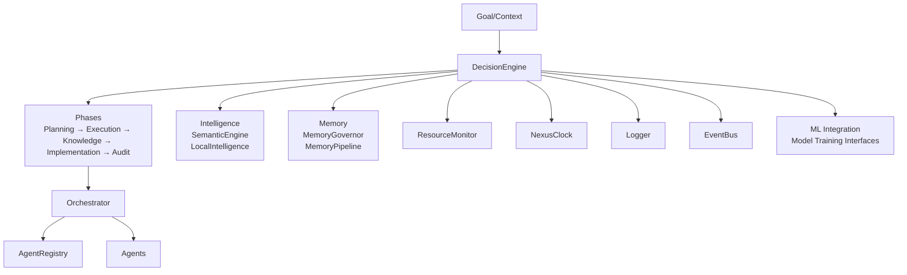

**Diagram sources**
- [DecisionEngine.js](file://agent/core/DecisionEngine.js)
- [PlanningPhase.js](file://agent/core/phases/PlanningPhase.js)
- [ExecutionPhase.js](file://agent/core/phases/ExecutionPhase.js)
- [KnowledgePhase.js](file://agent/core/phases/KnowledgePhase.js)
- [ImplementationPhase.js](file://agent/core/phases/ImplementationPhase.js)
- [AuditPhase.js](file://agent/core/phases/AuditPhase.js)
- [Orchestrator.js](file://agent/core/Orchestrator.js)
- [AgentRegistry.js](file://agent/core/AgentRegistry.js)
- [SemanticEngine.js](file://agent/core/SemanticEngine.js)
- [LocalIntelligence.js](file://agent/core/LocalIntelligence.js)
- [MemoryGovernor.js](file://agent/core/MemoryGovernor.js)
- [MemoryPipeline.js](file://agent/core/MemoryPipeline.js)
- [ResourceMonitor.js](file://agent/core/ResourceMonitor.js)
- [NexusClock.js](file://agent/core/NexusClock.js)
- [Logger.js](file://agent/core/Logger.js)
- [EventBus.js](file://agent/core/EventBus.js)

## Detailed Component Analysis

### DecisionEngine
Responsibilities:
- Coordinates decision lifecycle across phases.
- Evaluates strategies and selects optimal actions.
- Integrates intelligence, memory, and resource signals.
- Produces explainable decisions with audit trails.

Key APIs and behaviors:
- Decision evaluation: Aggregates inputs from Planning, Execution, Knowledge, Implementation, and Audit phases; applies strategy selection heuristics; emits decisions with confidence and rationale.
- Strategy selection: Ranks candidates based on feasibility, risk, reward, and constraints; supports uncertainty-aware selection.
- Execution prioritization: Prioritizes tasks considering dependencies, resource availability, and deadlines.
- Explainability: Captures decision rationale, influencing factors, and trade-offs for audit and debugging.
- Integration points: Orchestrator, SemanticEngine, MemoryGovernor, ResourceMonitor, Logger, EventBus.

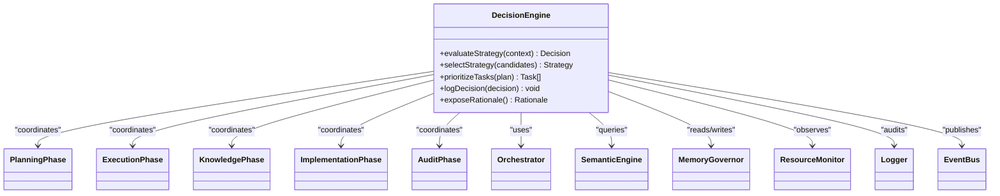

**Diagram sources**
- [DecisionEngine.js](file://agent/core/DecisionEngine.js)
- [PlanningPhase.js](file://agent/core/phases/PlanningPhase.js)
- [ExecutionPhase.js](file://agent/core/phases/ExecutionPhase.js)
- [KnowledgePhase.js](file://agent/core/phases/KnowledgePhase.js)
- [ImplementationPhase.js](file://agent/core/phases/ImplementationPhase.js)
- [AuditPhase.js](file://agent/core/phases/AuditPhase.js)
- [Orchestrator.js](file://agent/core/Orchestrator.js)
- [SemanticEngine.js](file://agent/core/SemanticEngine.js)
- [MemoryGovernor.js](file://agent/core/MemoryGovernor.js)
- [ResourceMonitor.js](file://agent/core/ResourceMonitor.js)
- [Logger.js](file://agent/core/Logger.js)
- [EventBus.js](file://agent/core/EventBus.js)

**Section sources**
- [DecisionEngine.js](file://agent/core/DecisionEngine.js)

### PlanningPhase
Responsibilities:
- Transforms goals and context into candidate strategies and plans.
- Incorporates constraints, preferences, and risk thresholds.
- Supports multi-objective planning and scenario exploration.

Key behaviors:
- Candidate generation: Enumerates feasible plans with associated metrics.
- Constraint propagation: Validates feasibility against domain rules and resource limits.
- Scenario modeling: Explores alternative futures under uncertainty.

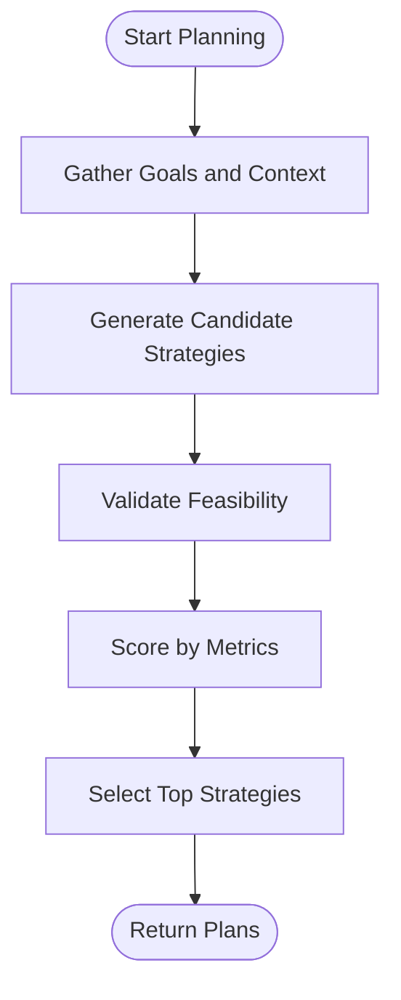

**Diagram sources**
- [PlanningPhase.js](file://agent/core/phases/PlanningPhase.js)

**Section sources**
- [PlanningPhase.js](file://agent/core/phases/PlanningPhase.js)

### ExecutionPhase
Responsibilities:
- Executes selected strategies with prioritization and concurrency control.
- Adapts execution in real-time based on resource feedback and progress.

Key behaviors:
- Priority scheduling: Orders tasks by urgency, dependencies, and resource needs.
- Concurrency control: Uses ParallelRunner to maximize throughput while respecting limits.
- Adaptive pacing: Adjusts batch sizes and priorities via ResourceMonitor.

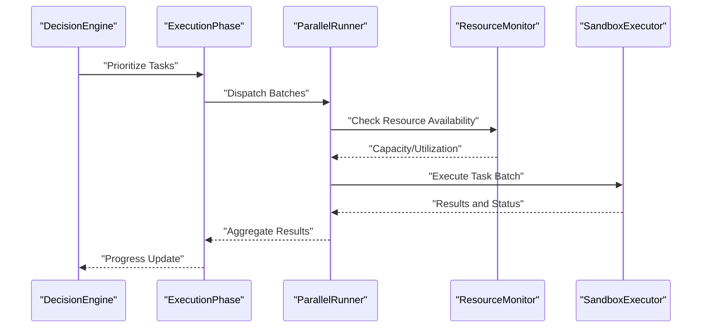

**Diagram sources**
- [ExecutionPhase.js](file://agent/core/phases/ExecutionPhase.js)
- [ParallelRunner.js](file://agent/core/ParallelRunner.js)
- [ResourceMonitor.js](file://agent/core/ResourceMonitor.js)
- [SandboxExecutor.js](file://agent/core/SandboxExecutor.js)

**Section sources**
- [ExecutionPhase.js](file://agent/core/phases/ExecutionPhase.js)
- [ParallelRunner.js](file://agent/core/ParallelRunner.js)
- [ResourceMonitor.js](file://agent/core/ResourceMonitor.js)
- [SandboxExecutor.js](file://agent/core/SandboxExecutor.js)

### KnowledgePhase
Responsibilities:
- Gathers domain knowledge, constraints, and best practices.
- Synthesizes insights to inform planning and execution.

Key behaviors:
- Knowledge ingestion: Integrates structured and unstructured knowledge sources.
- Constraint extraction: Identifies domain-specific rules and limits.
- Best practice recommendation: Suggests proven patterns aligned with goals.

**Section sources**
- [KnowledgePhase.js](file://agent/core/phases/KnowledgePhase.js)

### ImplementationPhase
Responsibilities:
- Converts plans into executable tasks with dependency resolution.
- Enforces readiness checks and approval gates.

Key behaviors:
- Task decomposition: Breaks plans into atomic, trackable tasks.
- Dependency graph construction: Ensures correct ordering and readiness.
- Approval gating: Requires sign-off before execution.

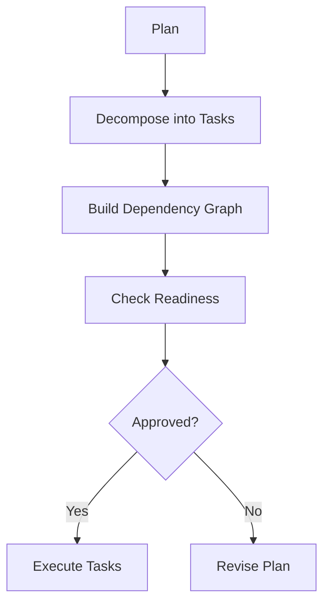

**Diagram sources**
- [ImplementationPhase.js](file://agent/core/phases/ImplementationPhase.js)

**Section sources**
- [ImplementationPhase.js](file://agent/core/phases/ImplementationPhase.js)

### AuditPhase
Responsibilities:
- Reviews outcomes against criteria and governance policies.
- Enforces quality gates and ethical constraints.

Key behaviors:
- Outcome evaluation: Measures adherence to acceptance criteria.
- Compliance check: Verifies ethical and policy alignment.
- Gatekeeping: Approves or rejects completion.

**Section sources**
- [AuditPhase.js](file://agent/core/phases/AuditPhase.js)

### Intelligence Gathering and Pattern Recognition
- SemanticEngine: Powers semantic search and retrieval for pattern recognition and reasoning.
- LocalIntelligence: Encapsulates local reasoning and pattern matching.
- MemoryGovernor: Ensures memory integrity across cycles.
- MemoryPipeline: Manages memory stages and transformations.

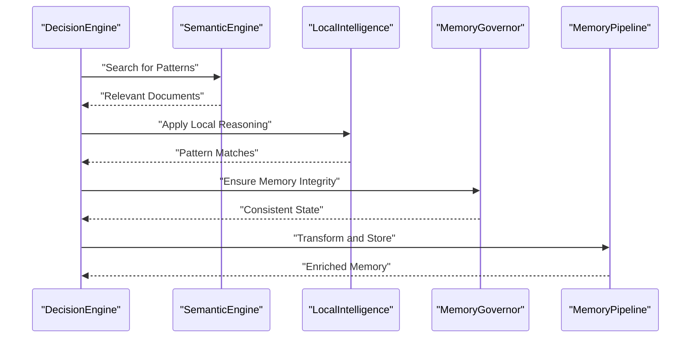

**Diagram sources**
- [SemanticEngine.js](file://agent/core/SemanticEngine.js)
- [LocalIntelligence.js](file://agent/core/LocalIntelligence.js)
- [MemoryGovernor.js](file://agent/core/MemoryGovernor.js)
- [MemoryPipeline.js](file://agent/core/MemoryPipeline.js)

**Section sources**
- [SemanticEngine.js](file://agent/core/SemanticEngine.js)
- [LocalIntelligence.js](file://agent/core/LocalIntelligence.js)
- [MemoryGovernor.js](file://agent/core/MemoryGovernor.js)
- [MemoryPipeline.js](file://agent/core/MemoryPipeline.js)

### Machine Learning Integration and Model Training
- ML integration: DecisionEngine integrates semantic and learned signals for strategy selection.
- Model training interfaces: EvolutionPiper persists and loads evolutionary cycle state for iterative improvement.
- Performance optimization: ResourceMonitor and ParallelRunner optimize throughput and latency.

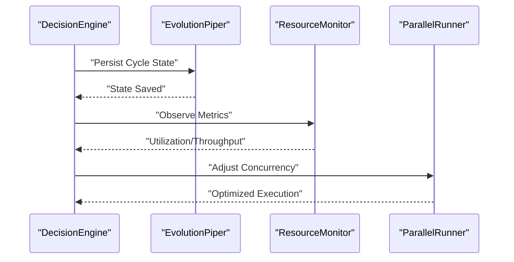

**Diagram sources**
- [DecisionEngine.js](file://agent/core/DecisionEngine.js)
- [EvolutionPiper.js](file://agent/core/EvolutionPiper.js)
- [ResourceMonitor.js](file://agent/core/ResourceMonitor.js)
- [ParallelRunner.js](file://agent/core/ParallelRunner.js)

**Section sources**
- [DecisionEngine.js](file://agent/core/DecisionEngine.js)
- [EvolutionPiper.js](file://agent/core/EvolutionPiper.js)
- [ResourceMonitor.js](file://agent/core/ResourceMonitor.js)
- [ParallelRunner.js](file://agent/core/ParallelRunner.js)

### Decision Logging, Audit Trails, and Explainability
- Logger: Structured logging for all decisions and actions.
- AuditTrail: Comprehensive audit trail capturing rationale, influencers, and outcomes.
- Explainability: DecisionEngine exposes rationale and influencing factors for transparency.

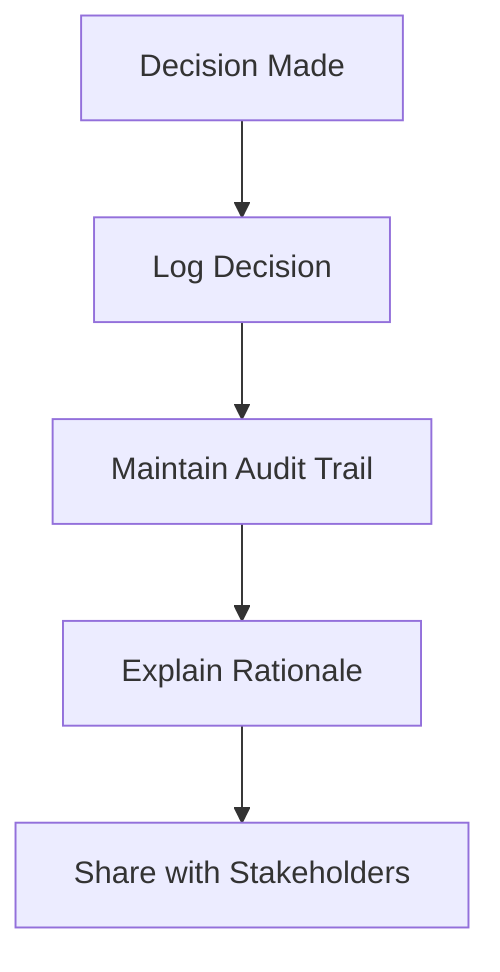

**Diagram sources**
- [Logger.js](file://agent/core/Logger.js)
- [DecisionEngine.js](file://agent/core/DecisionEngine.js)

**Section sources**
- [Logger.js](file://agent/core/Logger.js)
- [DecisionEngine.js](file://agent/core/DecisionEngine.js)

### Uncertainty Handling, Risk Assessment, and Ethical Decision Frameworks
- Uncertainty handling: PlanningPhase explores scenarios; ExecutionPhase adapts dynamically.
- Risk assessment: Evaluation considers risk thresholds and mitigation strategies.
- Ethical frameworks: AuditPhase enforces ethical and policy-aligned outcomes.

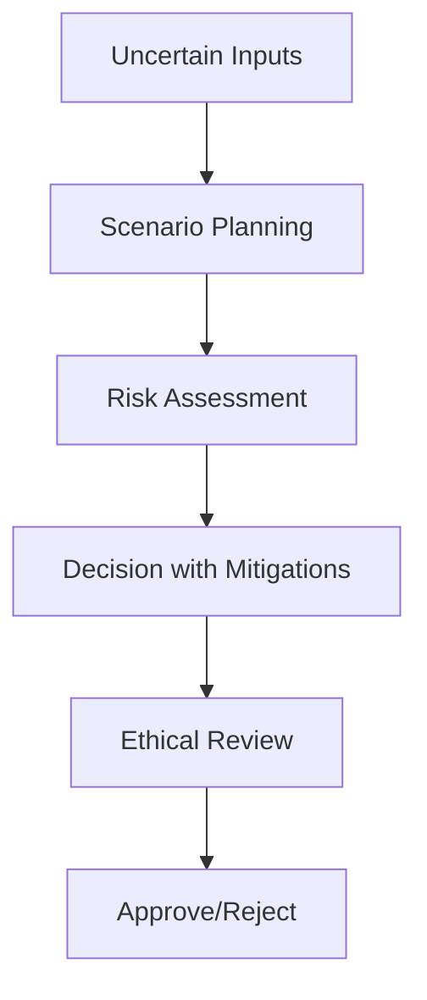

**Diagram sources**
- [PlanningPhase.js](file://agent/core/phases/PlanningPhase.js)
- [ExecutionPhase.js](file://agent/core/phases/ExecutionPhase.js)
- [AuditPhase.js](file://agent/core/phases/AuditPhase.js)

**Section sources**
- [PlanningPhase.js](file://agent/core/phases/PlanningPhase.js)
- [ExecutionPhase.js](file://agent/core/phases/ExecutionPhase.js)
- [AuditPhase.js](file://agent/core/phases/AuditPhase.js)

### Example Decision Workflows and Strategy Implementation
- Batch execution workflow: Recipes define staged execution with approval gates and final review.
- Subagent-driven development: Multi-step task execution with two-stage review and final approval.

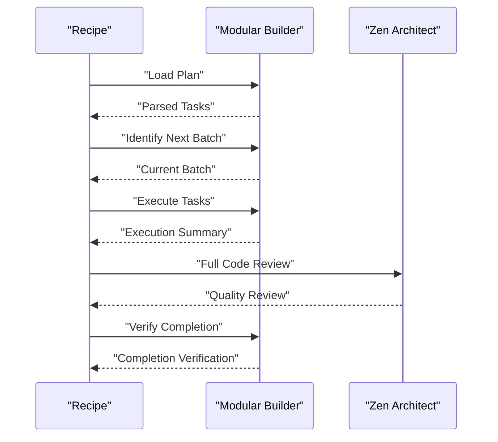

**Diagram sources**
- [executing-plans.yaml](file://memory/references/amplifier-bundle-superpowers-main/recipes/executing-plans.yaml)
- [subagent-development.yaml](file://memory/references/amplifier-bundle-superpowers-main/recipes/subagent-development.yaml)

**Section sources**
- [executing-plans.yaml](file://memory/references/amplifier-bundle-superpowers-main/recipes/executing-plans.yaml)
- [subagent-development.yaml](file://memory/references/amplifier-bundle-superpowers-main/recipes/subagent-development.yaml)

### Engine Configuration Patterns
- NexusEngine: Manages paths, indexing, and semantic tags.
- Distiller: Extracts distilled knowledge for reasoning.
- Contract: Enforces behavioral contracts for agents and components.
- EventBus: Enables decoupled event-driven coordination.

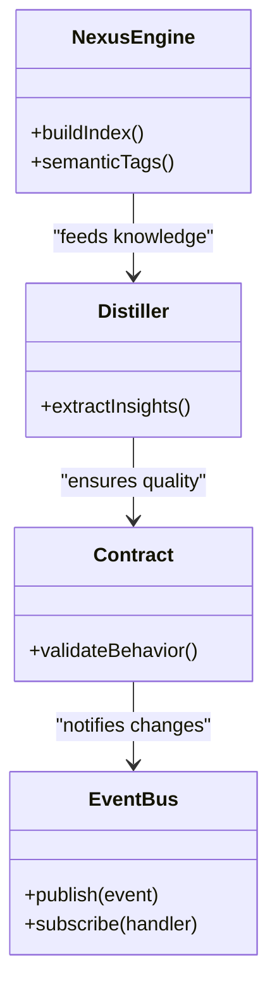

**Diagram sources**
- [NexusEngine.js](file://agent/core/NexusEngine.js)
- [Distiller.js](file://agent/core/Distiller.js)
- [Contract.js](file://agent/core/Contract.js)
- [EventBus.js](file://agent/core/EventBus.js)

**Section sources**
- [NexusEngine.js](file://agent/core/NexusEngine.js)
- [Distiller.js](file://agent/core/Distiller.js)
- [Contract.js](file://agent/core/Contract.js)
- [EventBus.js](file://agent/core/EventBus.js)

## Dependency Analysis
The Decision Engine exhibits layered dependencies:
- Core phases depend on Orchestrator and shared utilities.
- Intelligence and memory subsystems support decision evaluation.
- Resource and timing services enable adaptive behavior.
- Logging and auditing ensure traceability.

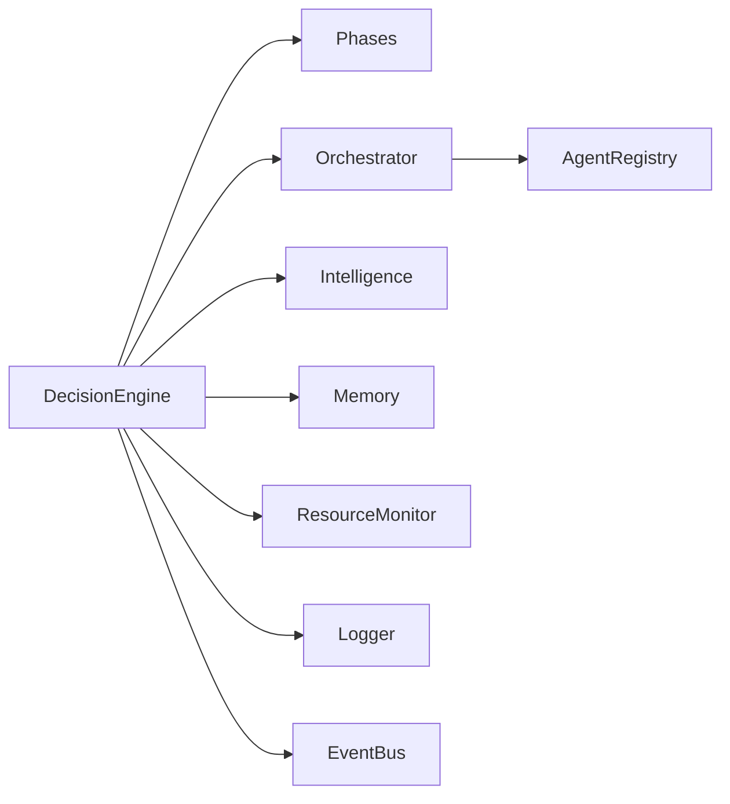

**Diagram sources**
- [DecisionEngine.js](file://agent/core/DecisionEngine.js)
- [Orchestrator.js](file://agent/core/Orchestrator.js)
- [AgentRegistry.js](file://agent/core/AgentRegistry.js)
- [Logger.js](file://agent/core/Logger.js)
- [EventBus.js](file://agent/core/EventBus.js)

**Section sources**
- [DecisionEngine.js](file://agent/core/DecisionEngine.js)
- [Orchestrator.js](file://agent/core/Orchestrator.js)
- [AgentRegistry.js](file://agent/core/AgentRegistry.js)
- [Logger.js](file://agent/core/Logger.js)
- [EventBus.js](file://agent/core/EventBus.js)

## Performance Considerations
- Concurrency and batching: ParallelRunner maximizes throughput; batch sizes adapt via ResourceMonitor.
- Memory efficiency: MemoryGovernor and MemoryPipeline reduce overhead and improve reliability.
- Semantic search: SemanticEngine accelerates knowledge discovery and reduces manual effort.
- Iterative improvement: EvolutionPiper persists cycle state for continuous optimization.

[No sources needed since this section provides general guidance]

## Troubleshooting Guide
Common issues and diagnostics:
- Pipeline stability: Internal tests verify wiring and persistence.
- Vector search verification: Automated tests validate semantic index building and search.
- Stabilization records: Confirm refactors and hygiene improvements.
- Audit findings: Review consolidated findings for security and documentation gaps.

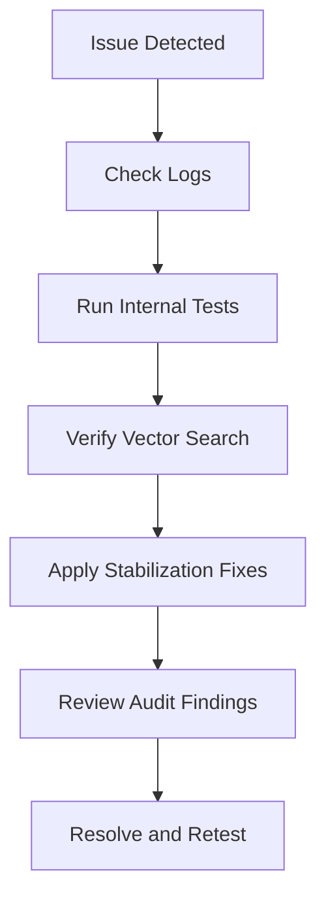

**Diagram sources**
- [pipeline_internal_test.js](file://tests/pipeline_internal_test.js)
- [test-vector.js](file://tests/test-vector.js)
- [NEXUS_STABILIZATION_RECORD.MD](file://memory/distilled/tdd/NEXUS_STABILIZATION_RECORD.MD)
- [NEXUS_AUDIT_SUMMARY_AUDIT-1779702317598.MD](file://memory/raw/NEXUS_AUDIT_SUMMARY_AUDIT-1779702317598.MD)

**Section sources**
- [pipeline_internal_test.js](file://tests/pipeline_internal_test.js)
- [test-vector.js](file://tests/test-vector.js)
- [NEXUS_STABILIZATION_RECORD.MD](file://memory/distilled/tdd/NEXUS_STABILIZATION_RECORD.MD)
- [NEXUS_AUDIT_SUMMARY_AUDIT-1779702317598.MD](file://memory/raw/NEXUS_AUDIT_SUMMARY_AUDIT-1779702317598.MD)

## Conclusion
The Decision Engine API provides a robust, modular framework for strategic decision-making and planning. Its phased architecture, integrated intelligence and memory systems, adaptive execution, and comprehensive logging and auditing enable transparent, explainable, and ethically sound decisions under uncertainty. The included recipes and tests demonstrate practical workflows and validation patterns.

[No sources needed since this section summarizes without analyzing specific files]

## Appendices
- API surface overview:
  - DecisionEngine.evaluateStrategy(context): Evaluate and return a decision.
  - DecisionEngine.selectStrategy(candidates): Select the best strategy.
  - DecisionEngine.prioritizeTasks(plan): Return prioritized tasks.
  - Logger.log(message, metadata): Log structured entries.
  - SemanticEngine.search(query, k): Retrieve semantically similar documents.
  - ResourceMonitor.observe(): Observe current resource utilization.
  - EvolutionPiper.persistCycleState(state): Persist current cycle state.
  - ExecutionPhase.executeBatch(tasks): Execute a batch of tasks.
  - AuditPhase.review(outcome): Enforce governance and quality gates.

[No sources needed since this section provides general guidance]