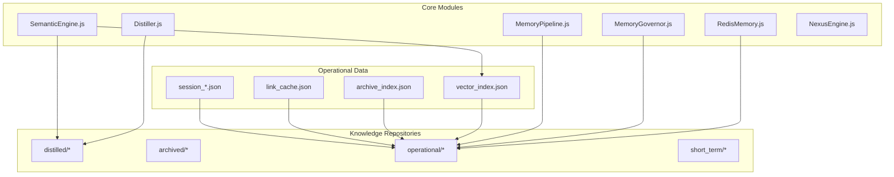
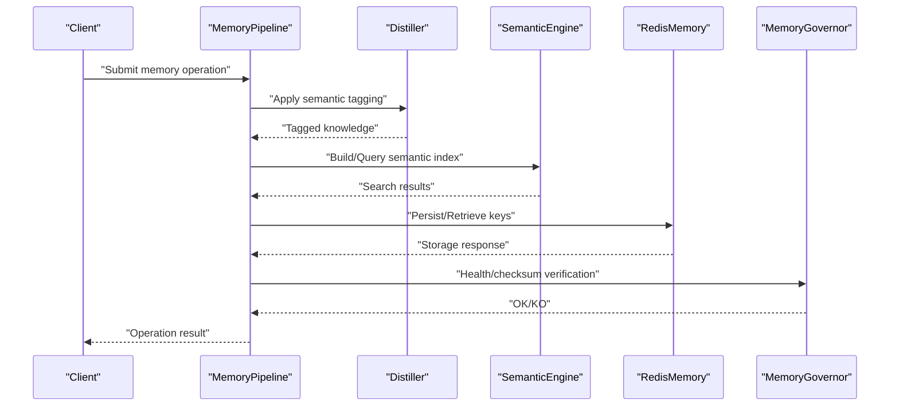
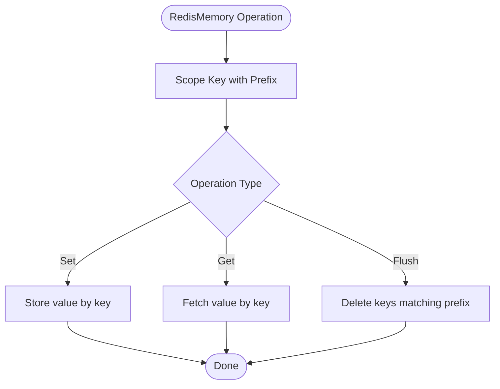
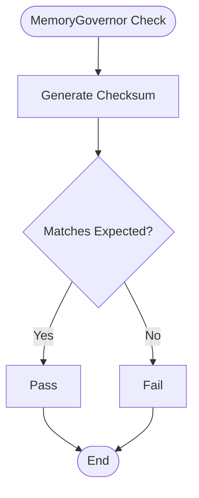
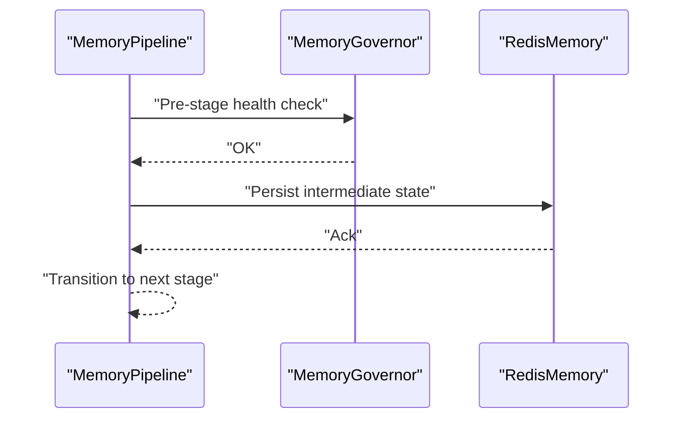
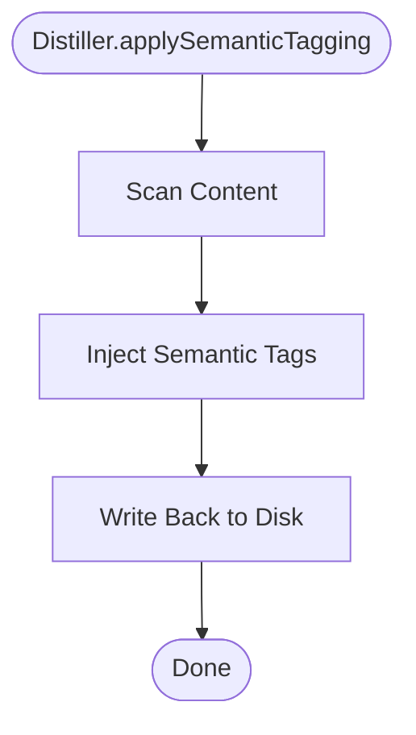
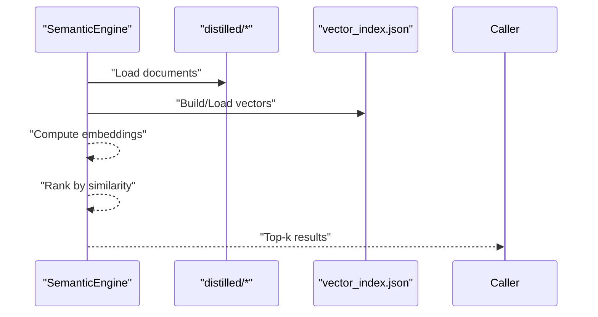
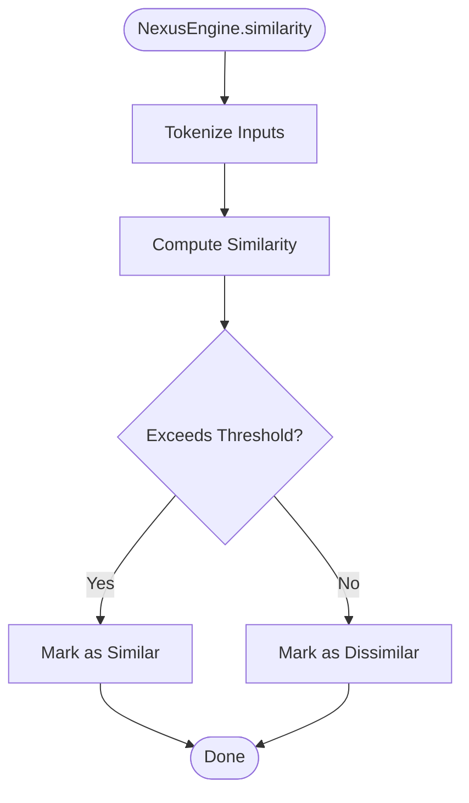
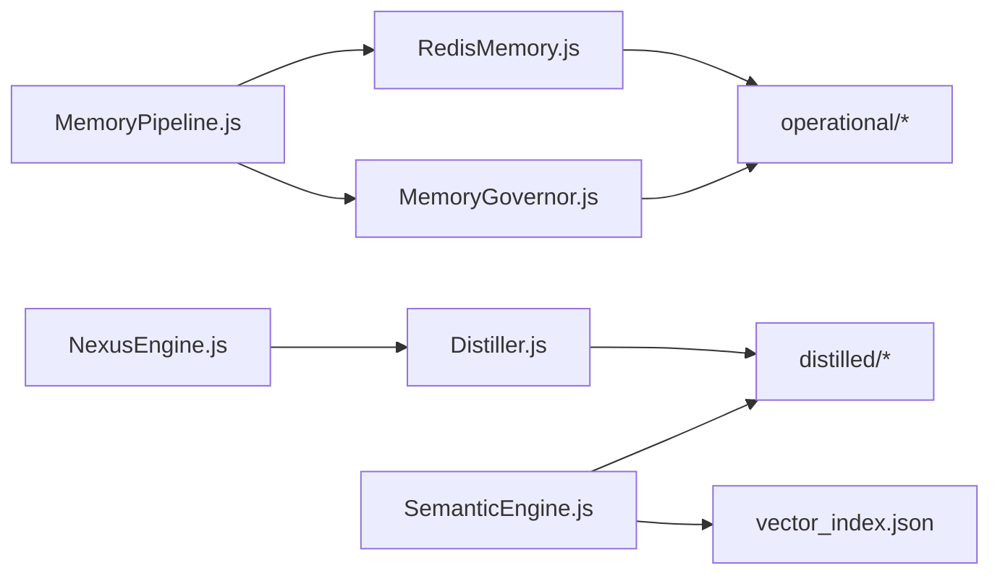

# Memory System APIs

<cite>
**Referenced Files in This Document**
- [RedisMemory.js](file://agent/core/RedisMemory.js)
- [MemoryGovernor.js](file://agent/core/MemoryGovernor.js)
- [MemoryPipeline.js](file://agent/core/MemoryPipeline.js)
- [Distiller.js](file://agent/core/Distiller.js)
- [SemanticEngine.js](file://agent/core/SemanticEngine.js)
- [NexusEngine.js](file://agent/core/NexusEngine.js)
- [MemoryGovernor.test.js](file://tests/TDD/MemoryGovernor.test.js)
- [similarity.test.js](file://tests/TDD/similarity.test.js)
- [test-vector.js](file://tests/test-vector.js)
- [pipeline_internal_test.js](file://tests/pipeline_internal_test.js)
- [Memory Manager.md](file://agent/prompts/internal/memory-manager.md)
- [Caching State Manager.md](file://agent/prompts/internal/caching-state-manager.md)
- [memory-context-manager.md](file://agent/prompts/internal/memory-context-manager.md)
- [INDEX.md](file://memory/INDEX.md)
- [INDEX_NEURAL_MAP.md](file://memory/INDEX_NEURAL_MAP.md)
- [NEXUS_SEMANTIC_INDEX.json](file://memory/distilled/NEXUS_SEMANTIC_INDEX.json)
- [vector_index.json](file://memory/short_term/vector_index.json)
- [archive_index.json](file://memory/operational/archive_index.json)
- [link_cache.json](file://memory/operational/link_cache.json)
- [session_*.json](file://memory/operational/session_*.json)
- [NEXUS_DISTILLATION_API.md](file://golden/harvest/NEXUS_DISTILLATION_API.md)
- [NEXUS_DISTILLATION_DATABASE.md](file://golden/harvest/NEXUS_DISTILLATION_DATABASE.md)
- [NEXUS_DISTILLATION_OTHER.md](file://golden/harvest/NEXUS_DISTILLATION_OTHER.md)
- [NEXUS_DISTILLATION_PERFORMANCE.md](file://golden/harvest/NEXUS_DISTILLATION_PERFORMANCE.md)
- [NEXUS_DISTILLATION_UI-UX.md](file://golden/harvest/NEXUS_DISTILLATION_UI-UX.md)
- [NEXUS_DISTILLATION_VCS.md](file://golden/harvest/NEXUS_DISTILLATION_VCS.md)
- [NEXUS_DISTILLATION_SAAS.md](file://memory/archived/json/agents/NEXUS_DISTILLATION_SAAS.md)
- [NEXUS_DISTILLATION_LOGS_2026-05-10.md](file://memory/distilled/audit/NEXUS_DISTILLATION_LOGS_2026-05-10.md)
- [NEXUS_DISTILLATION_LOGS_2026-05-13.md](file://memory/distilled/audit/NEXUS_DISTILLATION_LOGS_2026-05-13.md)
- [NEXUS_AUDIT_SUMMARY_10_LOOP_SCAN.md](file://memory/distilled/audit/NEXUS_AUDIT_SUMMARY_10_LOOP_SCAN.md)
- [NEXUS_SANDBOX_PIPELINE_EXTREME_AUDIT.md](file://memory/distilled/audit/NEXUS_SANDBOX_PIPELINE_EXTREME_AUDIT.md)
- [NEXUS_PIPELINE_REMEDIATION_REPORT.md](file://memory/distilled/database/NEXUS_PIPELINE_REMEDIATION_REPORT.md)
- [NEXUS_EXTREME_PERFORMANCE_ROADMAP.md](file://memory/distilled/performance/NEXUS_EXTREME_PERFORMANCE_ROADMAP.md)
- [NEXUS_MULTIAGENT_STABILITY_GUIDE.md](file://memory/distilled/performance/NEXUS_MULTIAGENT_STABILITY_GUIDE.md)
- [NEXUS_CORE_MODULARIZATION.md](file://memory/distilled/performance/NEXUS_CORE_MODULARIZATION.md)
- [NEXUS_HYBRID_CORE_ROADMAP.md](file://documentation/nexus_rules/NEXUS_HYBRID_CORE_ROADMAP.md)
- [NEXUS_INTERNAL_PIPELINE_RECAP.md](file://documentation/nexus_rules/NEXUS_INTERNAL_PIPELINE_RECAP.md)
- [NEXUS_EXTERNAL_PIPELINE_RECAP.md](file://documentation/nexus_rules/NEXUS_EXTERNAL_PIPELINE_RECAP.md)
- [NEXUS_BUG_REPORT.md](file://documentation/nexus_rules/NEXUS_BUG_REPORT.md)
- [NEXUS_DOCKER_TALL_EVOLUTION.md](file://documentation/nexus_rules/NEXUS_DOCKER_TALL_EVOLUTION.md)
- [NEXUS_VISION_1000_PROJECT.md](file://documentation/nexus_rules/NEXUS_VISION_1000_PROJECT.md)
- [NEXUS_AI_ARCHITECTURE_AUDIT.md](file://documentation/planning/NEXUS_AI_ARCHITECTURE_AUDIT.md)
- [NEXUS_AI_Architecture_Analysis.md](file://documentation/planning/NEXUS_AI_Architecture_Analysis.md)
- [NEXUS_AI_Code_Review.md](file://documentation/planning/NEXUS_AI_Code_Review.md)
- [NEXUS_AI_v2_Code_Review.md](file://documentation/planning/NEXUS_AI_v2_Code_Review.md)
- [NEXUS_CORE_MODULARIZATION.md](file://documentation/planning/NEXUS_CORE_MODULARIZATION.md)
- [NEXUS_HARDENING_PLAN.md](file://documentation/planning/NEXUS_HARDENING_PLAN.md)
- [NEXUS_MULTIAGENT_STABILITY_GUIDE.md](file://documentation/planning/NEXUS_MULTIAGENT_STABILITY_GUIDE.md)
- [NEXUS_MULTI_AGENT_STABILIZATION_PLAN.md](file://documentation/planning/NEXUS_MULTI_AGENT_STABILIZATION_PLAN.md)
- [NEXUS_SANDBOX_Review.md](file://documentation/planning/NEXUS_SANDBOX_Review.md)
- [NEXUS_VECTOR_SEARCH_UPGRADE.md](file://documentation/planning/NEXUS_VECTOR_SEARCH_UPGRADE.md)
- [NEXUS_STABILIZATION_PLAN.md](file://documentation/planning/NEXUS_STABILIZATION_PLAN.md)
- [NEXUS_POST_STABILIZATION_HARDERING.md](file://documentation/planning/NEXUS_POST_STABILIZATION_HARDERING.md)
- [NEXUS_STABILIZATION.md](file://documentation/planning/NEXUS_STABILIZATION.md)
- [NEXUS_TESTING_TDD.md](file://documentation/planning/NEXUS_TESTING_TDD.md)
- [NEXUS_AUDIT-NEXUS-HARDENING-SYNC.md](file://documentation/audit/AUDIT-NEXUS-HARDENING-SYNC.md)
- [SANDBOX_PIPELINE_EXTREME_AUDIT.md](file://documentation/audit/SANDBOX_PIPELINE_EXTREME_AUDIT.md)
- [PIPELINE_REMEDIATION_REPORT.md](file://documentation/audit/PIPELINE_REMEDIATION_REPORT.md)
- [NEXUS_AGENT_GAP_ROUND3.md](file://documentation/algorithms/NEXUS_AGENT_GAP_ROUND3.md)
- [NEXUS-MISSING-AGENTS.md](file://documentation/algorithms/NEXUS-MISSING-AGENTS.md)
- [NEXUS-SKILL-AUDIT.md](file://documentation/algorithms/NEXUS-SKILL-AUDIT.md)
- [NEXUS_TASK.md](file://documentation/algorithms/NEXUS_TASK.md)
- [NEXUS_SKILL.md](file://documentation/algorithms/NEXUS_SKILL.md)
- [NEXUS_ALGORITHMS.md](file://documentation/algorithms/nexus-ai-tech-stack.md)
- [NEXUS_MEMOMRY.md](file://documentation/mermaid/alur memomry.md)
- [NEXUS_PIPELINE_MAP.md](file://documentation/mermaid/nexus_pipeline_map.md)
- [NEXUS_SANDBOX_PIPELINE.md](file://documentation/mermaid/sandbox_pipeline.md)
</cite>

## Table of Contents
1. [Introduction](#introduction)
2. [Project Structure](#project-structure)
3. [Core Components](#core-components)
4. [Architecture Overview](#architecture-overview)
5. [Detailed Component Analysis](#detailed-component-analysis)
6. [Dependency Analysis](#dependency-analysis)
7. [Performance Considerations](#performance-considerations)
8. [Troubleshooting Guide](#troubleshooting-guide)
9. [Conclusion](#conclusion)
10. [Appendices](#appendices)

## Introduction
This document describes the Memory System APIs responsible for data persistence, retrieval, and processing across the NEXUS AI platform. It covers Redis integration, memory governance controls, pipeline processing interfaces, serialization and indexing, semantic search, optimization and caching strategies, archival systems, distillation and knowledge extraction, and semantic indexing. It also provides examples of memory operations, data flow patterns, performance tuning guidelines, and outlines data integrity, backup, and recovery mechanisms.

## Project Structure
The memory system spans several core modules and operational directories:
- Core modules: Redis-backed memory, memory governance, memory pipeline, distillation, and semantic search engines
- Operational data: JSON indexes, caches, and session artifacts
- Golden and distilled knowledge repositories for API, database, performance, UI/UX, VCS, and SaaS domains
- Documentation and audit trails supporting architecture, planning, and remediation

**Diagram sources**
- [RedisMemory.js](file://agent/core/RedisMemory.js)
- [MemoryGovernor.js](file://agent/core/MemoryGovernor.js)
- [MemoryPipeline.js](file://agent/core/MemoryPipeline.js)
- [Distiller.js](file://agent/core/Distiller.js)
- [SemanticEngine.js](file://agent/core/SemanticEngine.js)
- [vector_index.json](file://memory/short_term/vector_index.json)
- [archive_index.json](file://memory/operational/archive_index.json)
- [link_cache.json](file://memory/operational/link_cache.json)
- [session_*.json](file://memory/operational/session_*.json)

**Section sources**
- [RedisMemory.js](file://agent/core/RedisMemory.js)
- [MemoryGovernor.js](file://agent/core/MemoryGovernor.js)
- [MemoryPipeline.js](file://agent/core/MemoryPipeline.js)
- [Distiller.js](file://agent/core/Distiller.js)
- [SemanticEngine.js](file://agent/core/SemanticEngine.js)
- [vector_index.json](file://memory/short_term/vector_index.json)
- [archive_index.json](file://memory/operational/archive_index.json)
- [link_cache.json](file://memory/operational/link_cache.json)
- [session_*.json](file://memory/operational/session_*.json)

## Core Components
- RedisMemory: Provides Redis-backed persistence with key scoping and lifecycle controls
- MemoryGovernor: Enforces memory health checks and integrity via checksums
- MemoryPipeline: Orchestrates memory processing stages and governs transitions
- Distiller: Applies semantic tagging and knowledge extraction to distilled content
- SemanticEngine: Builds and queries semantic indexes for vectorized search
- NexusEngine: Supplies similarity metrics and auxiliary utilities for memory operations

**Section sources**
- [RedisMemory.js](file://agent/core/RedisMemory.js)
- [MemoryGovernor.js](file://agent/core/MemoryGovernor.js)
- [MemoryPipeline.js](file://agent/core/MemoryPipeline.js)
- [Distiller.js](file://agent/core/Distiller.js)
- [SemanticEngine.js](file://agent/core/SemanticEngine.js)
- [NexusEngine.js](file://agent/core/NexusEngine.js)

## Architecture Overview
The memory system integrates Redis for fast persistence, governs health and lifecycle, processes knowledge through a pipeline, distills and tags content, and enables semantic search over vectorized indexes. Operational artifacts maintain caches, indexes, and session states.

**Diagram sources**
- [MemoryPipeline.js](file://agent/core/MemoryPipeline.js)
- [Distiller.js](file://agent/core/Distiller.js)
- [SemanticEngine.js](file://agent/core/SemanticEngine.js)
- [RedisMemory.js](file://agent/core/RedisMemory.js)
- [MemoryGovernor.js](file://agent/core/MemoryGovernor.js)

## Detailed Component Analysis

### RedisMemory API
Responsibilities:
- Scoped key management for memory entries
- Persistence operations with Redis
- Lifecycle controls and cleanup

Key behaviors:
- Uses a scoped prefix to avoid collisions
- Supports set/get operations and flush operations respecting the prefix
- Disconnects gracefully

Example operations:
- Persist a memory entry under a scoped key
- Retrieve a memory entry by key
- Flush only scoped entries

**Diagram sources**
- [RedisMemory.js](file://agent/core/RedisMemory.js)

**Section sources**
- [RedisMemory.js](file://agent/core/RedisMemory.js)

### MemoryGovernor API
Responsibilities:
- Integrity checks for memory content
- Checksum generation for validation

Key behaviors:
- Generates a fixed-length checksum for content
- Validates root path and state consistency

Example operations:
- Compute checksum for a given content
- Verify integrity during memory operations

**Diagram sources**
- [MemoryGovernor.js](file://agent/core/MemoryGovernor.js)

**Section sources**
- [MemoryGovernor.js](file://agent/core/MemoryGovernor.js)
- [MemoryGovernor.test.js](file://tests/TDD/MemoryGovernor.test.js)

### MemoryPipeline API
Responsibilities:
- Coordinates memory processing stages
- Integrates with governance and orchestration

Key behaviors:
- Manages transitions between pipeline stages
- Ensures lifecycle hooks and cleanup

Example operations:
- Initialize pipeline
- Execute stage-specific tasks
- Persist or rollback state

**Diagram sources**
- [MemoryPipeline.js](file://agent/core/MemoryPipeline.js)
- [MemoryGovernor.js](file://agent/core/MemoryGovernor.js)
- [RedisMemory.js](file://agent/core/RedisMemory.js)

**Section sources**
- [MemoryPipeline.js](file://agent/core/MemoryPipeline.js)
- [pipeline_internal_test.js](file://tests/pipeline_internal_test.js)

### Distiller API
Responsibilities:
- Applies semantic tagging to knowledge content
- Extracts and annotates topics for downstream search

Key behaviors:
- Scans content and injects semantic metadata
- Persists tagged content back to disk

Example operations:
- Load knowledge files
- Apply semantic tagging
- Save tagged content

**Diagram sources**
- [Distiller.js](file://agent/core/Distiller.js)

**Section sources**
- [Distiller.js](file://agent/core/Distiller.js)
- [NexusEngine.js](file://agent/core/NexusEngine.js)
- [similarity.test.js](file://tests/TDD/similarity.test.js)

### SemanticEngine API
Responsibilities:
- Builds semantic indexes from distilled knowledge
- Performs vectorized semantic search

Key behaviors:
- Index building over knowledge corpus
- Query scoring and ranking
- Integration with vector index artifacts

Example operations:
- Build index from distilled knowledge
- Search with query and top-k selection
- Retrieve matched files and metadata

**Diagram sources**
- [SemanticEngine.js](file://agent/core/SemanticEngine.js)
- [vector_index.json](file://memory/short_term/vector_index.json)

**Section sources**
- [SemanticEngine.js](file://agent/core/SemanticEngine.js)
- [test-vector.js](file://tests/test-vector.js)
- [NEXUS_SEMANTIC_INDEX.json](file://memory/distilled/NEXUS_SEMANTIC_INDEX.json)

### NexusEngine Utilities
Responsibilities:
- Provides similarity calculations and related utilities
- Supports memory operations with textual similarity metrics

Example operations:
- Calculate similarity between two texts
- Use similarity thresholds for deduplication or relevance filtering

**Diagram sources**
- [NexusEngine.js](file://agent/core/NexusEngine.js)

**Section sources**
- [NexusEngine.js](file://agent/core/NexusEngine.js)
- [similarity.test.js](file://tests/TDD/similarity.test.js)

## Dependency Analysis
The memory system exhibits layered dependencies:
- RedisMemory underpins persistence for operational artifacts
- MemoryGovernor validates integrity across the system
- MemoryPipeline coordinates processing and governance
- Distiller enriches knowledge for SemanticEngine
- SemanticEngine relies on vector indexes and distilled knowledge

**Diagram sources**
- [RedisMemory.js](file://agent/core/RedisMemory.js)
- [MemoryGovernor.js](file://agent/core/MemoryGovernor.js)
- [MemoryPipeline.js](file://agent/core/MemoryPipeline.js)
- [Distiller.js](file://agent/core/Distiller.js)
- [SemanticEngine.js](file://agent/core/SemanticEngine.js)
- [vector_index.json](file://memory/short_term/vector_index.json)

**Section sources**
- [RedisMemory.js](file://agent/core/RedisMemory.js)
- [MemoryGovernor.js](file://agent/core/MemoryGovernor.js)
- [MemoryPipeline.js](file://agent/core/MemoryPipeline.js)
- [Distiller.js](file://agent/core/Distiller.js)
- [SemanticEngine.js](file://agent/core/SemanticEngine.js)
- [vector_index.json](file://memory/short_term/vector_index.json)

## Performance Considerations
- Vector search performance depends on index quality and embedding dimensions; ensure regular rebuilds after knowledge updates
- Redis operations should leverage key scoping to minimize cross-contamination and enable targeted flushing
- MemoryGovernor checksums help detect corruption early, reducing downstream reprocessing costs
- Caching strategies:
  - Short-term vector index and link cache reduce repeated computation and IO
  - Session artifacts isolate transient states to avoid contention
- Pipeline stages should be bounded with timeouts and cleanup hooks to prevent resource leaks

[No sources needed since this section provides general guidance]

## Troubleshooting Guide
Common issues and remedies:
- Redis connectivity failures: verify connection parameters and ensure Redis is reachable; use disconnect handlers to recover gracefully
- Index build failures: confirm distilled knowledge paths and permissions; rebuild index after content changes
- Semantic search returns empty: adjust query phrasing or expand search scope; validate vector index presence
- Integrity errors: regenerate checksums and compare with stored values; investigate content mutations
- Pipeline stalls: inspect stage transitions and timeouts; ensure lifecycle cleanup is executed

**Section sources**
- [RedisMemory.js](file://agent/core/RedisMemory.js)
- [SemanticEngine.js](file://agent/core/SemanticEngine.js)
- [MemoryGovernor.js](file://agent/core/MemoryGovernor.js)
- [MemoryPipeline.js](file://agent/core/MemoryPipeline.js)
- [pipeline_internal_test.js](file://tests/pipeline_internal_test.js)

## Conclusion
The Memory System APIs integrate Redis-backed persistence, governance, and pipeline orchestration with distillation and semantic search. By leveraging checksums, scoped keys, vectorized indexes, and operational caches, the system supports scalable memory operations. Adhering to the outlined data flow patterns, performance guidelines, and troubleshooting steps ensures robustness, reliability, and maintainability.

[No sources needed since this section summarizes without analyzing specific files]

## Appendices

### Data Serialization and Indexing
- JSON-based artifacts for vector indexes, archive indices, and link caches
- Short-term caches for transient states and sessions
- Distilled knowledge with semantic metadata for enhanced search

**Section sources**
- [vector_index.json](file://memory/short_term/vector_index.json)
- [archive_index.json](file://memory/operational/archive_index.json)
- [link_cache.json](file://memory/operational/link_cache.json)
- [session_*.json](file://memory/operational/session_*.json)
- [NEXUS_SEMANTIC_INDEX.json](file://memory/distilled/NEXUS_SEMANTIC_INDEX.json)

### Archival Systems
- Archival directories for normalized, operational, raw, semantic, and short-term memory
- Structured paths support separation of concerns and lifecycle management

**Section sources**
- [INDEX.md](file://memory/INDEX.md)
- [INDEX_NEURAL_MAP.md](file://memory/INDEX_NEURAL_MAP.md)

### Knowledge Extraction and Semantic Tagging
- Distiller applies semantic tagging to knowledge content
- Golden and distilled repositories organize domain-specific knowledge (API, database, performance, UI/UX, VCS, SaaS)

**Section sources**
- [Distiller.js](file://agent/core/Distiller.js)
- [NexusEngine.js](file://agent/core/NexusEngine.js)
- [NEXUS_DISTILLATION_API.md](file://golden/harvest/NEXUS_DISTILLATION_API.md)
- [NEXUS_DISTILLATION_DATABASE.md](file://golden/harvest/NEXUS_DISTILLATION_DATABASE.md)
- [NEXUS_DISTILLATION_OTHER.md](file://golden/harvest/NEXUS_DISTILLATION_OTHER.md)
- [NEXUS_DISTILLATION_PERFORMANCE.md](file://golden/harvest/NEXUS_DISTILLATION_PERFORMANCE.md)
- [NEXUS_DISTILLATION_UI-UX.md](file://golden/harvest/NEXUS_DISTILLATION_UI-UX.md)
- [NEXUS_DISTILLATION_VCS.md](file://golden/harvest/NEXUS_DISTILLATION_VCS.md)
- [NEXUS_DISTILLATION_SAAS.md](file://memory/archived/json/agents/NEXUS_DISTILLATION_SAAS.md)

### Semantic Indexing and Search Capabilities
- SemanticEngine builds and queries semantic indexes
- Vector search verification demonstrates multi-domain query scenarios

**Section sources**
- [SemanticEngine.js](file://agent/core/SemanticEngine.js)
- [test-vector.js](file://tests/test-vector.js)
- [NEXUS_VECTOR_SEARCH_UPGRADE.md](file://documentation/planning/NEXUS_VECTOR_SEARCH_UPGRADE.md)

### Memory Optimization and Caching Strategies
- Short-term caches and link caches improve retrieval latency
- Session artifacts isolate transient states
- Governance and pipeline controls enforce lifecycle discipline

**Section sources**
- [MemoryGovernor.js](file://agent/core/MemoryGovernor.js)
- [MemoryPipeline.js](file://agent/core/MemoryPipeline.js)
- [Memory Manager.md](file://agent/prompts/internal/memory-manager.md)
- [Caching State Manager.md](file://agent/prompts/internal/caching-state-manager.md)
- [memory-context-manager.md](file://agent/prompts/internal/memory-context-manager.md)

### Data Integrity, Backup, and Recovery
- Integrity: checksum generation and validation
- Backup: archival directories and serialized artifacts
- Recovery: pipeline state persistence and lifecycle cleanup

**Section sources**
- [MemoryGovernor.js](file://agent/core/MemoryGovernor.js)
- [MemoryPipeline.js](file://agent/core/MemoryPipeline.js)
- [pipeline_internal_test.js](file://tests/pipeline_internal_test.js)

### Examples of Memory Operations and Data Flow Patterns
- Persist memory entry via RedisMemory
- Apply semantic tagging via Distiller
- Build and query semantic index via SemanticEngine
- Validate integrity via MemoryGovernor
- Coordinate end-to-end via MemoryPipeline

**Section sources**
- [RedisMemory.js](file://agent/core/RedisMemory.js)
- [Distiller.js](file://agent/core/Distiller.js)
- [SemanticEngine.js](file://agent/core/SemanticEngine.js)
- [MemoryGovernor.js](file://agent/core/MemoryGovernor.js)
- [MemoryPipeline.js](file://agent/core/MemoryPipeline.js)

### Performance Tuning Guidelines
- Rebuild semantic indexes after significant knowledge updates
- Monitor Redis latency and optimize key patterns
- Tune semantic search parameters (top-k, thresholds)
- Use checksums to detect anomalies early

**Section sources**
- [SemanticEngine.js](file://agent/core/SemanticEngine.js)
- [MemoryGovernor.js](file://agent/core/MemoryGovernor.js)
- [NEXUS_EXTREME_PERFORMANCE_ROADMAP.md](file://memory/distilled/performance/NEXUS_EXTREME_PERFORMANCE_ROADMAP.md)
- [NEXUS_MULTIAGENT_STABILITY_GUIDE.md](file://memory/distilled/performance/NEXUS_MULTIAGENT_STABILITY_GUIDE.md)
- [NEXUS_CORE_MODULARIZATION.md](file://memory/distilled/performance/NEXUS_CORE_MODULARIZATION.md)