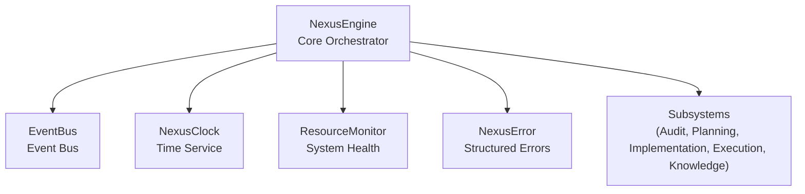
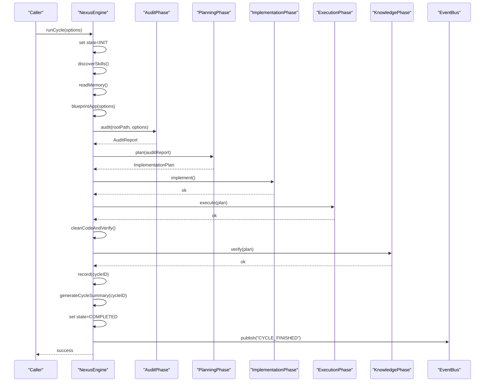
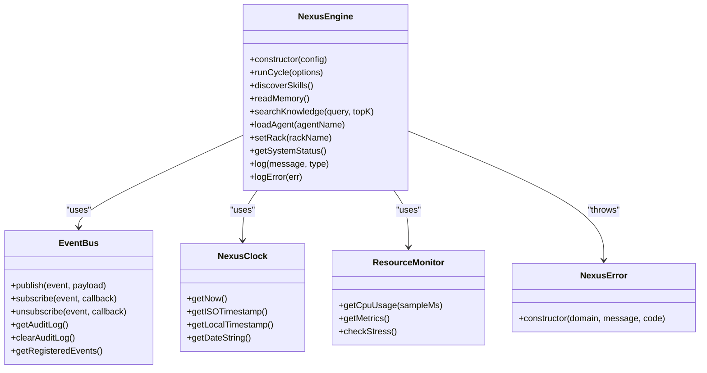

# Nexus Engine API

<cite>
**Referenced Files in This Document**
- [NexusEngine.js](file://agent/core/NexusEngine.js)
- [EventBus.js](file://agent/core/EventBus.js)
- [NexusClock.js](file://agent/core/NexusClock.js)
- [ResourceMonitor.js](file://agent/core/ResourceMonitor.js)
- [NexusError.js](file://agent/core/NexusError.js)
</cite>

## Table of Contents
1. [Introduction](#introduction)
2. [Project Structure](#project-structure)
3. [Core Components](#core-components)
4. [Architecture Overview](#architecture-overview)
5. [Detailed Component Analysis](#detailed-component-analysis)
6. [Dependency Analysis](#dependency-analysis)
7. [Performance Considerations](#performance-considerations)
8. [Troubleshooting Guide](#troubleshooting-guide)
9. [Conclusion](#conclusion)

## Introduction
This document provides comprehensive API documentation for the Nexus Engine core interface. It covers initialization, configuration, lifecycle management (start, stop, reset), event bus inter-component communication, clock synchronization, resource management, thread safety, performance characteristics, and monitoring capabilities. It also includes integration patterns and examples of engine instantiation and usage.

## Project Structure
The Nexus Engine resides in the agent core module and orchestrates multiple subsystems:
- Engine lifecycle and orchestration
- Event bus for decoupled inter-component messaging
- Clock service for consistent timekeeping
- Resource monitor for system health checks
- Error wrapper for structured diagnostics

**Diagram sources**
- [NexusEngine.js:60-137](file://agent/core/NexusEngine.js#L60-L137)
- [EventBus.js:17-99](file://agent/core/EventBus.js#L17-L99)
- [NexusClock.js:5-39](file://agent/core/NexusClock.js#L5-L39)
- [ResourceMonitor.js:9-96](file://agent/core/ResourceMonitor.js#L9-L96)
- [NexusError.js:6-15](file://agent/core/NexusError.js#L6-L15)

**Section sources**
- [NexusEngine.js:60-137](file://agent/core/NexusEngine.js#L60-L137)

## Core Components
This section documents the primary API surface of the Nexus Engine, including initialization, configuration, lifecycle, and auxiliary services.

- Initialization and Configuration
  - Constructor: Creates and initializes subsystems, sets up paths, registers specialized phases, and attempts Redis and local AI connectivity.
  - Configuration options: rootPath influences engine paths and behavior. Additional runtime configuration is supported via optional parameters in lifecycle methods.

- Lifecycle Management
  - runCycle(options): Executes a full modularized cycle with timeout protection and state transitions.
  - Internal cycle stages: discovery, audit, plan, implement, execute, verification, logging, and completion.
  - Error handling: Wraps runtime errors into NexusError and logs diagnostics.

- Event Bus System
  - EventBus: Centralized event publisher/subscriber with schema validation and deduplication.
  - Events: SCANNER_TRIGGERED, SCANNER_FINISHED, TASK_FAILED, CYCLE_FINISHED, MEMORY_UPDATED, AGENT_READY, AGENT_BUSY, SYSTEM_PAUSE, SYSTEM_RESUME.
  - Subscription: subscribe(event, callback), unsubscribe(event, callback).

- Clock Synchronization
  - NexusClock: Provides UTC+8 timestamps for consistent time across environments.

- Resource Management
  - ResourceMonitor: Measures CPU and memory usage, exposes stress checks with recommendations.

- Error Handling
  - NexusError: Structured error with domain, code, message, and timestamp.

**Section sources**
- [NexusEngine.js:60-137](file://agent/core/NexusEngine.js#L60-L137)
- [NexusEngine.js:346-395](file://agent/core/NexusEngine.js#L346-L395)
- [EventBus.js:17-99](file://agent/core/EventBus.js#L17-L99)
- [NexusClock.js:5-39](file://agent/core/NexusClock.js#L5-L39)
- [ResourceMonitor.js:9-96](file://agent/core/ResourceMonitor.js#L9-L96)
- [NexusError.js:6-15](file://agent/core/NexusError.js#L6-L15)

## Architecture Overview
The Nexus Engine coordinates subsystems through a modularized lifecycle. It uses the event bus for inter-component communication, NexusClock for time consistency, and ResourceMonitor for system health.

**Diagram sources**
- [NexusEngine.js:346-395](file://agent/core/NexusEngine.js#L346-L395)
- [NexusEngine.js:310-344](file://agent/core/NexusEngine.js#L310-L344)
- [EventBus.js:31-71](file://agent/core/EventBus.js#L31-L71)

## Detailed Component Analysis

### NexusEngine API
- Constructor
  - Purpose: Initialize engine with configuration and subsystems.
  - Parameters: config (optional object). Key fields:
    - rootPath: Base working directory for the project.
  - Behavior:
    - Resolves engine and data paths.
    - Initializes subsystems: orchestrator, logger, memory governor, resource monitor, sandbox, semantic engine, agent registry, and specialized phases.
    - Attempts Redis connection and local AI availability checks.
  - Side effects: May log informational and warning messages depending on environment.

- Lifecycle Methods
  - runCycle(options)
    - Purpose: Execute a single orchestrated cycle with timeout protection.
    - Parameters: options (object, optional). Supports per-run overrides.
    - Returns: Promise resolving when cycle completes or rejects on timeout or error.
    - Errors: Rejects with NexusError when timeout occurs (after 90 minutes).
    - State transitions: INIT → PROCESSING → EXECUTING → LOGGING → COMPLETED; on error: FAILED.
  - Internal cycle steps:
    - discoverSkills(): Builds skill registry from workflows and external sources.
    - readMemory(): Loads short-term memory and builds semantic index.
    - blueprintApp(options): Generates and caches project blueprint when applicable.
    - audit(targetPath, options): Runs audit phase.
    - plan(auditReport): Runs planning phase.
    - implement(): Runs implementation phase.
    - execute(plan): Runs execution phase.
    - cleanCodeAndVerify(projectPath): Cleans and verifies code quality.
    - verify(plan): Verifies outcomes.
    - record(cycleID): Writes session record.
    - generateCycleSummary(cycleID): Produces cycle summary.
    - logError(err): Logs error details to summary.

- Utility and Discovery Methods
  - discoverAgents(): Scans agent prompt files and returns registry.
  - readMemory(): Reads short-term memory and builds semantic index.
  - searchKnowledge(query, topK): Performs vector search via semantic engine or falls back to semantic index.
  - loadAgent(agentName): Locates and loads an agent prompt file.
  - setRack(rackName): Sets active rack focus.
  - getSystemStatus(): Returns system stress metrics and agent health.

- Knowledge and Skill Management
  - harvest(sourcePath): Harvests knowledge from source.
  - distill(): Runs knowledge distillation.
  - updateStatus(): Updates knowledge status.
  - massUpdateSkills(): Injects skill registry and deep wisdom into agent prompts.
  - massRefactor(): Refactors golden standards into distilled knowledge with decision-driven merge.
  - wrapAsConditional(existing, added, context): Consolidates conflicting knowledge with scoring and collision resolution.

- Thread Safety and Concurrency
  - The engine uses synchronous filesystem operations and EventEmitter for pub/sub. Subsystems are initialized once and reused. For concurrent access, ensure callers coordinate lifecycle boundaries and avoid mutating shared state outside documented methods.

- Monitoring and Diagnostics
  - getSystemStatus(): Aggregates resource monitor stress and agent registry health.
  - log(message, type): Logs with correlation ID and structured entries.
  - logError(err): Persists error logs with phase, state, and timestamp.

- Examples
  - Instantiation and basic usage:
    - Create engine with default rootPath or specify a project directory.
    - Call runCycle(options) to execute a full cycle.
    - Subscribe to events via EventBus for observability.
  - Configuration patterns:
    - Provide rootPath to control engine and data directories.
    - Use options in lifecycle methods to override defaults per run.

**Section sources**
- [NexusEngine.js:60-137](file://agent/core/NexusEngine.js#L60-L137)
- [NexusEngine.js:346-395](file://agent/core/NexusEngine.js#L346-L395)
- [NexusEngine.js:310-344](file://agent/core/NexusEngine.js#L310-L344)
- [NexusEngine.js:202-221](file://agent/core/NexusEngine.js#L202-L221)
- [NexusEngine.js:223-251](file://agent/core/NexusEngine.js#L223-L251)
- [NexusEngine.js:269-278](file://agent/core/NexusEngine.js#L269-L278)
- [NexusEngine.js:280-300](file://agent/core/NexusEngine.js#L280-L300)
- [NexusEngine.js:164-169](file://agent/core/NexusEngine.js#L164-L169)
- [NexusEngine.js:517-522](file://agent/core/NexusEngine.js#L517-L522)
- [NexusEngine.js:507-515](file://agent/core/NexusEngine.js#L507-L515)

### EventBus API
- Purpose: Decoupled inter-component communication with schema validation and deduplication.
- Methods:
  - publish(event, payload): Validates event against schema and required fields; deduplicates recent events; emits to listeners.
  - subscribe(event, callback): Registers listener.
  - unsubscribe(event, callback): Removes listener.
  - getAuditLog(): Returns audit trail of published events.
  - clearAuditLog(): Clears audit log.
  - getRegisteredEvents(): Lists all registered event names.

- Event Schema
  - SCANNER_TRIGGERED: { required: ["agent", "pluginPath", "input"] }
  - SCANNER_FINISHED: { required: ["task_id", "result"] }
  - TASK_FAILED: { required: ["task_id", "error"] }
  - CYCLE_FINISHED: { required: [] }
  - MEMORY_UPDATED: { required: ["category", "filename"] }
  - AGENT_READY: { required: ["agent_id"] }
  - AGENT_BUSY: { required: ["agent_id", "task_id"] }
  - SYSTEM_PAUSE: { required: ["reason"] }
  - SYSTEM_RESUME: { required: [] }

- Deduplication
  - Uses a composite key based on event name, agent, and task_id to avoid duplicate processing within a short window.

- Example
  - Subscribe to CYCLE_FINISHED to react after each engine cycle completes.

**Section sources**
- [EventBus.js:17-99](file://agent/core/EventBus.js#L17-L99)

### NexusClock API
- Purpose: Provide consistent time in UTC+8 across the framework.
- Methods:
  - getNow(): Returns Date adjusted to UTC+8.
  - getISOTimestamp(): Returns ISO string in UTC+8.
  - getLocalTimestamp(): Returns human-readable local string in UTC+8.
  - getDateString(): Returns date string (YYYY-MM-DD) in UTC+8.

- Use Cases:
  - Logging timestamps, session records, and summaries.

**Section sources**
- [NexusClock.js:5-39](file://agent/core/NexusClock.js#L5-L39)

### ResourceMonitor API
- Purpose: Monitor system CPU and memory usage and provide stress recommendations.
- Methods:
  - getCpuUsage(sampleMs): Measures CPU usage via two-snapshot delta method.
  - getMetrics(): Returns current CPU, memory, timestamp, platform, and load average.
  - checkStress(): Determines stress state and recommendation (PROCEED, THROTTLE, PAUSE).

- Thresholds:
  - Defaults: CPU threshold 80%, memory threshold 85%. Configurable via constructor.

- Example
  - Integrate with engine status checks to adapt concurrency or pause operations under stress.

**Section sources**
- [ResourceMonitor.js:9-96](file://agent/core/ResourceMonitor.js#L9-L96)

### NexusError API
- Purpose: Structured error type for production readiness.
- Constructor: new NexusError(domain, message, code)
  - Fields: domain, code, message, timestamp (UTC+8), name, phase (alias).

- Example
  - Wrap runtime errors during lifecycle to ensure consistent logging and diagnostics.

**Section sources**
- [NexusError.js:6-15](file://agent/core/NexusError.js#L6-L15)

## Dependency Analysis
The Nexus Engine composes multiple subsystems and depends on shared services for time and monitoring.

**Diagram sources**
- [NexusEngine.js:60-137](file://agent/core/NexusEngine.js#L60-L137)
- [EventBus.js:17-99](file://agent/core/EventBus.js#L17-L99)
- [NexusClock.js:5-39](file://agent/core/NexusClock.js#L5-L39)
- [ResourceMonitor.js:9-96](file://agent/core/ResourceMonitor.js#L9-L96)
- [NexusError.js:6-15](file://agent/core/NexusError.js#L6-L15)

**Section sources**
- [NexusEngine.js:60-137](file://agent/core/NexusEngine.js#L60-L137)

## Performance Considerations
- Timeouts: runCycle enforces a 90-minute cap to prevent indefinite hangs.
- Lazy initialization: Some expensive subsystems are lazily created on first access to reduce startup overhead.
- Deduplication: EventBus deduplicates events to minimize redundant processing.
- Resource-awareness: ResourceMonitor provides CPU/memory metrics and recommendations to throttle or pause operations under stress.
- Vector search fallback: searchKnowledge falls back to semantic index if vector search fails.

[No sources needed since this section provides general guidance]

## Troubleshooting Guide
- Timeout during runCycle
  - Symptom: Promise rejection after 90 minutes.
  - Cause: Long-running audit/planning/execution stage.
  - Action: Investigate slow subsystems (e.g., local AI generation) and adjust environment or options.

- Redis or local AI unavailability
  - Symptom: Warning logs indicating unavailable services.
  - Action: Ensure Redis and local AI are reachable; engine continues in degraded mode.

- Event schema violations
  - Symptom: Error thrown when publishing event with missing required fields.
  - Action: Register event in schema and provide all required fields.

- High resource usage
  - Symptom: Stress recommendations (THROTTLE/PAUSE).
  - Action: Reduce concurrency, throttle agents, or pause operations until recovery.

**Section sources**
- [NexusEngine.js:346-358](file://agent/core/NexusEngine.js#L346-L358)
- [NexusEngine.js:147-162](file://agent/core/NexusEngine.js#L147-L162)
- [EventBus.js:31-51](file://agent/core/EventBus.js#L31-L51)
- [ResourceMonitor.js:66-96](file://agent/core/ResourceMonitor.js#L66-L96)

## Conclusion
The Nexus Engine provides a robust, modularized orchestration layer with explicit lifecycle management, structured error handling, and integrated observability via the event bus and resource monitor. Its design emphasizes consistency (via NexusClock), resilience (via timeouts and stress checks), and scalability (via lazy initialization and event-driven communication).