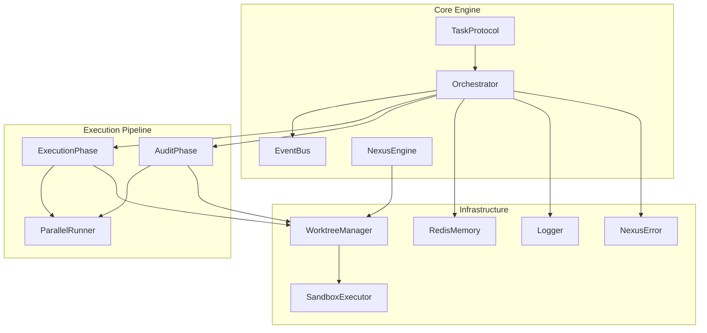
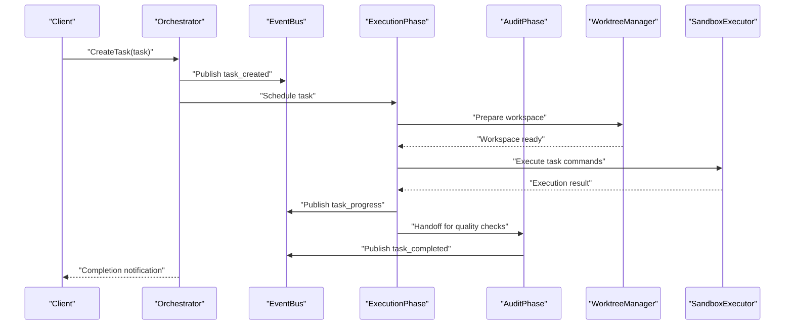
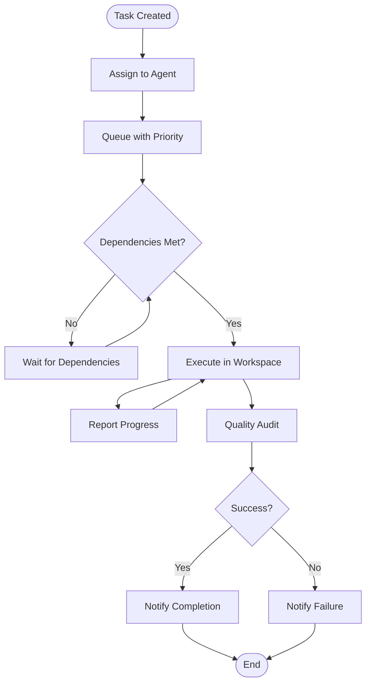
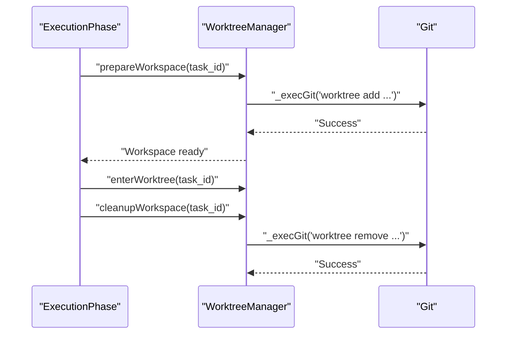
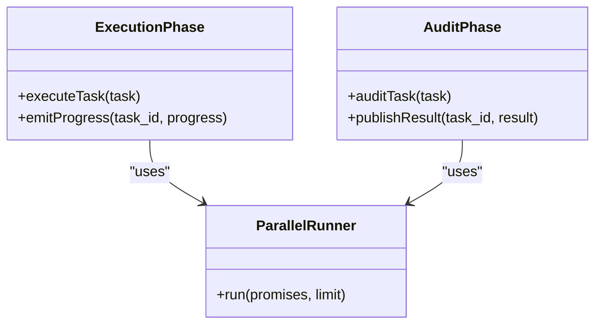
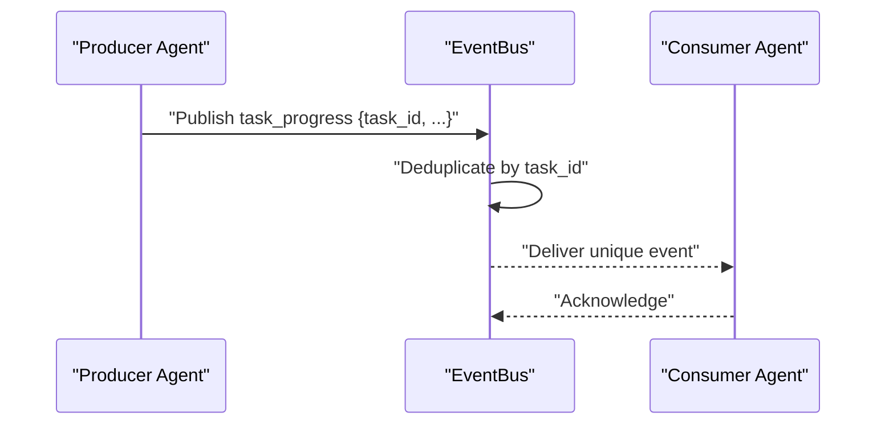
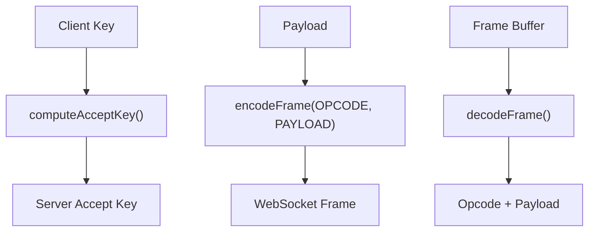
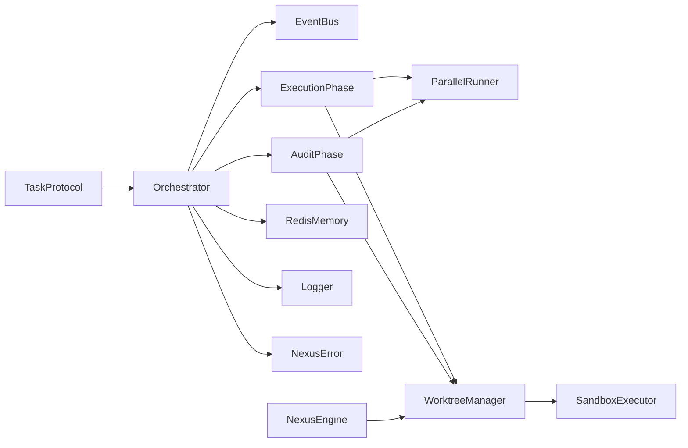

# Task Protocol API

<cite>
**Referenced Files in This Document**
- [TaskProtocol.js](file://agent/core/TaskProtocol.js)
- [WorktreeManager.js](file://agent/core/WorktreeManager.js)
- [Orchestrator.js](file://agent/core/Orchestrator.js)
- [EventBus.js](file://agent/core/EventBus.js)
- [NexusEngine.js](file://agent/core/NexusEngine.js)
- [ExecutionPhase.js](file://agent/core/phases/ExecutionPhase.js)
- [AuditPhase.js](file://agent/core/phases/AuditPhase.js)
- [ParallelRunner.js](file://agent/core/ParallelRunner.js)
- [SandboxExecutor.js](file://agent/core/SandboxExecutor.js)
- [RedisMemory.js](file://agent/core/RedisMemory.js)
- [Logger.js](file://agent/core/Logger.js)
- [NexusError.js](file://agent/core/NexusError.js)
- [pipeline_internal_test.js](file://tests/pipeline_internal_test.js)
- [test-worktree-native-preference.sh](file://memory/distilled/superpowers-main/tests/claude-code/test-worktree-native-preference.sh)
- [ws-protocol.test.js](file://memory/distilled/superpowers-main/tests/brainstorm-server/ws-protocol.test.js)
- [server.cjs](file://memory/distilled/superpowers-main/skills/brainstorming/scripts/server.cjs)
</cite>

## Table of Contents
1. [Introduction](#introduction)
2. [Project Structure](#project-structure)
3. [Core Components](#core-components)
4. [Architecture Overview](#architecture-overview)
5. [Detailed Component Analysis](#detailed-component-analysis)
6. [Dependency Analysis](#dependency-analysis)
7. [Performance Considerations](#performance-considerations)
8. [Troubleshooting Guide](#troubleshooting-guide)
9. [Conclusion](#conclusion)
10. [Appendices](#appendices)

## Introduction
This document specifies the Task Protocol API for enabling inter-agent communication and workflow coordination within the NEXUS AI system. It covers task lifecycle operations (creation, assignment, execution tracking, completion notifications), message passing protocols, worktree management interfaces, and semantic processing capabilities. It also documents task queue operations, priority handling, dependency resolution, protocol messages, serialization formats, and transport layer abstraction. Practical examples, collaboration patterns, and implementation guidelines are included, along with error handling, retry mechanisms, and fault tolerance strategies.

## Project Structure
The Task Protocol system spans several core modules:
- TaskProtocol: Defines the protocol messages, serialization, and transport abstraction for task operations.
- WorktreeManager: Manages isolated workspaces for task execution and isolation.
- Orchestrator: Coordinates task routing, scheduling, and cross-agent collaboration.
- EventBus: Provides event-driven messaging and deduplication for task-related events.
- NexusEngine: Provides lazy access to heavy subsystems including WorktreeManager.
- ExecutionPhase and AuditPhase: Implement task execution and quality assurance phases.
- ParallelRunner: Controls concurrency limits for task execution.
- Supporting infrastructure: SandboxExecutor, RedisMemory, Logger, NexusError.

**Diagram sources**
- [TaskProtocol.js](file://agent/core/TaskProtocol.js)
- [Orchestrator.js](file://agent/core/Orchestrator.js)
- [EventBus.js](file://agent/core/EventBus.js)
- [NexusEngine.js](file://agent/core/NexusEngine.js)
- [ExecutionPhase.js](file://agent/core/phases/ExecutionPhase.js)
- [AuditPhase.js](file://agent/core/phases/AuditPhase.js)
- [ParallelRunner.js](file://agent/core/ParallelRunner.js)
- [WorktreeManager.js](file://agent/core/WorktreeManager.js)
- [SandboxExecutor.js](file://agent/core/SandboxExecutor.js)
- [RedisMemory.js](file://agent/core/RedisMemory.js)
- [Logger.js](file://agent/core/Logger.js)
- [NexusError.js](file://agent/core/NexusError.js)

**Section sources**
- [TaskProtocol.js](file://agent/core/TaskProtocol.js)
- [WorktreeManager.js](file://agent/core/WorktreeManager.js)
- [Orchestrator.js](file://agent/core/Orchestrator.js)
- [EventBus.js](file://agent/core/EventBus.js)
- [NexusEngine.js](file://agent/core/NexusEngine.js)
- [ExecutionPhase.js](file://agent/core/phases/ExecutionPhase.js)
- [AuditPhase.js](file://agent/core/phases/AuditPhase.js)
- [ParallelRunner.js](file://agent/core/ParallelRunner.js)
- [SandboxExecutor.js](file://agent/core/SandboxExecutor.js)
- [RedisMemory.js](file://agent/core/RedisMemory.js)
- [Logger.js](file://agent/core/Logger.js)
- [NexusError.js](file://agent/core/NexusError.js)

## Core Components
This section outlines the primary components involved in the Task Protocol API and their responsibilities.

- TaskProtocol
  - Defines protocol messages for task creation, assignment, progress updates, completion, and failure notifications.
  - Specifies serialization format (JSON) and transport abstraction for message delivery.
  - Encodes task metadata, dependencies, priority, and execution context.

- WorktreeManager
  - Manages Git worktrees for isolated task execution environments.
  - Provides workspace setup, cleanup, and isolation guarantees.
  - Ensures asynchronous operations and avoids blocking I/O.

- Orchestrator
  - Routes tasks to appropriate agents and phases.
  - Maintains task queues, applies priority and dependency rules.
  - Publishes completion and error events via EventBus.

- EventBus
  - Centralized event bus for inter-agent messaging.
  - Deduplicates events using task_id to prevent redundant processing.

- NexusEngine
  - Lazy initialization of heavy components, including WorktreeManager.
  - Reduces startup overhead and improves scalability.

- ExecutionPhase and AuditPhase
  - ExecutionPhase: Executes tasks within isolated workspaces and publishes progress.
  - AuditPhase: Validates task outcomes and enforces quality gates with controlled concurrency.

- ParallelRunner
  - Limits concurrent task execution to avoid resource contention.
  - Supports bounded concurrency for deterministic performance.

- Infrastructure
  - SandboxExecutor: Secure execution of task commands with path traversal protection.
  - RedisMemory: Namespace-aware persistence with NEXUS prefix.
  - Logger: Chain-protected write queue to prevent race conditions.
  - NexusError: Standardized error types and propagation.

**Section sources**
- [TaskProtocol.js](file://agent/core/TaskProtocol.js)
- [WorktreeManager.js](file://agent/core/WorktreeManager.js)
- [Orchestrator.js](file://agent/core/Orchestrator.js)
- [EventBus.js](file://agent/core/EventBus.js)
- [NexusEngine.js](file://agent/core/NexusEngine.js)
- [ExecutionPhase.js](file://agent/core/phases/ExecutionPhase.js)
- [AuditPhase.js](file://agent/core/phases/AuditPhase.js)
- [ParallelRunner.js](file://agent/core/ParallelRunner.js)
- [SandboxExecutor.js](file://agent/core/SandboxExecutor.js)
- [RedisMemory.js](file://agent/core/RedisMemory.js)
- [Logger.js](file://agent/core/Logger.js)
- [NexusError.js](file://agent/core/NexusError.js)

## Architecture Overview
The Task Protocol API orchestrates task workflows across agents and phases, leveraging worktree isolation and event-driven communication.

**Diagram sources**
- [Orchestrator.js](file://agent/core/Orchestrator.js)
- [EventBus.js](file://agent/core/EventBus.js)
- [ExecutionPhase.js](file://agent/core/phases/ExecutionPhase.js)
- [AuditPhase.js](file://agent/core/phases/AuditPhase.js)
- [WorktreeManager.js](file://agent/core/WorktreeManager.js)
- [SandboxExecutor.js](file://agent/core/SandboxExecutor.js)

## Detailed Component Analysis

### TaskProtocol API
The TaskProtocol defines the message contract for task operations.

- Message Types
  - task_created: Emitted when a task is accepted and queued.
  - task_assigned: Emitted when a task is assigned to an agent.
  - task_progress: Periodic progress updates during execution.
  - task_completed: Emitted upon successful completion.
  - task_failed: Emitted when execution fails with error details.
  - task_cancelled: Emitted when a task is cancelled.

- Serialization and Transport
  - JSON serialization for all protocol messages.
  - Transport abstraction supports in-process, IPC, and network delivery.

- Message Fields
  - task_id: Unique identifier for the task.
  - type: One of the message types above.
  - payload: Task-specific data (metadata, dependencies, priority).
  - timestamp: ISO 8601 timestamp.
  - source_agent: Identifier of the originating agent.
  - destination_agent: Target agent (if applicable).

- Priority and Dependencies
  - Priority levels: low, medium, high, critical.
  - Dependencies: array of task_ids that must complete before execution.

- Example Workflows
  - Single-agent task: Create -> Assign -> Progress -> Complete.
  - Multi-phase task: Create -> Assign -> Execute -> Audit -> Complete.
  - Dependent task chain: A -> B (depends on A) -> C (depends on B).

**Diagram sources**
- [TaskProtocol.js](file://agent/core/TaskProtocol.js)
- [ExecutionPhase.js](file://agent/core/phases/ExecutionPhase.js)
- [AuditPhase.js](file://agent/core/phases/AuditPhase.js)

**Section sources**
- [TaskProtocol.js](file://agent/core/TaskProtocol.js)

### Worktree Management Interface
WorktreeManager provides isolated execution environments for tasks.

- Responsibilities
  - Create and manage Git worktrees for task isolation.
  - Ensure asynchronous operations and avoid blocking I/O.
  - Provide workspace setup, cleanup, and safety checks.

- Key Methods
  - prepareWorkspace(task_id): Initialize workspace for a task.
  - cleanupWorkspace(task_id): Remove workspace artifacts.
  - enterWorktree(task_id): Switch to task workspace.
  - _execGit(cmd): Asynchronous Git command execution with timeouts.

- Safety and Concurrency
  - Path traversal protection and safe command execution.
  - Timeout enforcement for Git operations.

**Diagram sources**
- [WorktreeManager.js](file://agent/core/WorktreeManager.js)
- [ExecutionPhase.js](file://agent/core/phases/ExecutionPhase.js)

**Section sources**
- [WorktreeManager.js](file://agent/core/WorktreeManager.js)
- [test-worktree-native-preference.sh](file://memory/distilled/superpowers-main/tests/claude-code/test-worktree-native-preference.sh)

### Execution and Audit Phases
ExecutionPhase and AuditPhase implement task execution and quality assurance.

- ExecutionPhase
  - Executes task commands within the prepared workspace.
  - Emits progress updates and handles failures.
  - Integrates with WorktreeManager and SandboxExecutor.

- AuditPhase
  - Performs quality checks and validation.
  - Uses ParallelRunner with bounded concurrency (limit=2) to avoid overload.
  - Publishes audit results via EventBus.

**Diagram sources**
- [ExecutionPhase.js](file://agent/core/phases/ExecutionPhase.js)
- [AuditPhase.js](file://agent/core/phases/AuditPhase.js)
- [ParallelRunner.js](file://agent/core/ParallelRunner.js)

**Section sources**
- [ExecutionPhase.js](file://agent/core/phases/ExecutionPhase.js)
- [AuditPhase.js](file://agent/core/phases/AuditPhase.js)
- [ParallelRunner.js](file://agent/core/ParallelRunner.js)
- [pipeline_internal_test.js](file://tests/pipeline_internal_test.js)

### Event Bus and Task Coordination
EventBus centralizes inter-agent messaging and deduplication.

- Deduplication
  - Uses task_id as the deduplication key to prevent redundant processing.
  - Maintains deduplication state to ensure idempotent event handling.

- Event Types
  - task_created, task_assigned, task_progress, task_completed, task_failed, task_cancelled.

**Diagram sources**
- [EventBus.js](file://agent/core/EventBus.js)
- [pipeline_internal_test.js](file://tests/pipeline_internal_test.js)

**Section sources**
- [EventBus.js](file://agent/core/EventBus.js)
- [pipeline_internal_test.js](file://tests/pipeline_internal_test.js)

### Transport Layer Abstraction
The Task Protocol supports pluggable transport mechanisms.

- WebSocket Transport (Zero-Dep Reference Implementation)
  - RFC 6455-compliant handshake and framing.
  - Frame encoding/decoding for TEXT, CLOSE, PING, PONG opcodes.
  - Handshake key computation and masked payload handling.

- Protocol Functions
  - computeAcceptKey(clientKey): Derives server accept key.
  - encodeFrame(opcode, payload): Encodes WebSocket frame.
  - decodeFrame(buffer): Decodes WebSocket frame.

**Diagram sources**
- [ws-protocol.test.js](file://memory/distilled/superpowers-main/tests/brainstorm-server/ws-protocol.test.js)
- [server.cjs](file://memory/distilled/superpowers-main/skills/brainstorming/scripts/server.cjs)

**Section sources**
- [ws-protocol.test.js](file://memory/distilled/superpowers-main/tests/brainstorm-server/ws-protocol.test.js)
- [server.cjs](file://memory/distilled/superpowers-main/skills/brainstorming/scripts/server.cjs)

## Dependency Analysis
The Task Protocol system exhibits layered dependencies with clear separation of concerns.

**Diagram sources**
- [TaskProtocol.js](file://agent/core/TaskProtocol.js)
- [Orchestrator.js](file://agent/core/Orchestrator.js)
- [EventBus.js](file://agent/core/EventBus.js)
- [NexusEngine.js](file://agent/core/NexusEngine.js)
- [ExecutionPhase.js](file://agent/core/phases/ExecutionPhase.js)
- [AuditPhase.js](file://agent/core/phases/AuditPhase.js)
- [ParallelRunner.js](file://agent/core/ParallelRunner.js)
- [WorktreeManager.js](file://agent/core/WorktreeManager.js)
- [SandboxExecutor.js](file://agent/core/SandboxExecutor.js)
- [RedisMemory.js](file://agent/core/RedisMemory.js)
- [Logger.js](file://agent/core/Logger.js)
- [NexusError.js](file://agent/core/NexusError.js)

**Section sources**
- [TaskProtocol.js](file://agent/core/TaskProtocol.js)
- [Orchestrator.js](file://agent/core/Orchestrator.js)
- [EventBus.js](file://agent/core/EventBus.js)
- [NexusEngine.js](file://agent/core/NexusEngine.js)
- [ExecutionPhase.js](file://agent/core/phases/ExecutionPhase.js)
- [AuditPhase.js](file://agent/core/phases/AuditPhase.js)
- [ParallelRunner.js](file://agent/core/ParallelRunner.js)
- [WorktreeManager.js](file://agent/core/WorktreeManager.js)
- [SandboxExecutor.js](file://agent/core/SandboxExecutor.js)
- [RedisMemory.js](file://agent/core/RedisMemory.js)
- [Logger.js](file://agent/core/Logger.js)
- [NexusError.js](file://agent/core/NexusError.js)

## Performance Considerations
- Concurrency Control
  - Use ParallelRunner with bounded concurrency (e.g., limit=2) to prevent resource exhaustion.
  - Avoid unbounded Promise.all patterns to maintain stability.

- Workspace Operations
  - Prefer asynchronous Git operations with timeouts to avoid blocking.
  - Minimize workspace churn by reusing worktrees when safe.

- Event Handling
  - Deduplicate events by task_id to reduce redundant processing.
  - Chain Logger writes to prevent race conditions and improve throughput.

- Persistence
  - Use namespace-aware Redis keys (NEXUS prefix) to avoid collisions and enable targeted flushing.

**Section sources**
- [pipeline_internal_test.js](file://tests/pipeline_internal_test.js)
- [WorktreeManager.js](file://agent/core/WorktreeManager.js)
- [Logger.js](file://agent/core/Logger.js)
- [RedisMemory.js](file://agent/core/RedisMemory.js)

## Troubleshooting Guide
- Duplicate Orchestrator Instance
  - Ensure a single Orchestrator instance is created to avoid inconsistent state.

- Path Traversal and Blocking I/O
  - Verify path resolution and safety checks in SandboxExecutor.
  - Replace blocking filesystem operations with async equivalents.

- Memory Flush Strategy
  - Use NEXUS prefix-based flush instead of global flushAll to avoid unintended data loss.

- Event Deduplication
  - Confirm task_id-based deduplication and dedupKey usage in EventBus.

- Concurrency Limiting
  - Validate ParallelRunner usage with explicit concurrency limits.

- Worktree Operations
  - Ensure _execGit uses timeouts and avoids execSync to prevent hangs.

**Section sources**
- [pipeline_internal_test.js](file://tests/pipeline_internal_test.js)
- [SandboxExecutor.js](file://agent/core/SandboxExecutor.js)
- [RedisMemory.js](file://agent/core/RedisMemory.js)
- [EventBus.js](file://agent/core/EventBus.js)
- [ParallelRunner.js](file://agent/core/ParallelRunner.js)
- [WorktreeManager.js](file://agent/core/WorktreeManager.js)

## Conclusion
The Task Protocol API provides a robust foundation for inter-agent collaboration and workflow coordination. By combining a clear message contract, transport abstraction, isolated workspaces, and event-driven orchestration, it enables scalable and fault-tolerant task execution. Adhering to the guidelines and best practices outlined here ensures reliable operation across diverse deployment scenarios.

## Appendices

### API Definition Summary
- Task Creation
  - Emit task_created with metadata and dependencies.
- Assignment
  - Emit task_assigned with destination_agent.
- Execution Tracking
  - Emit task_progress periodically with progress metrics.
- Completion Notification
  - Emit task_completed on success; task_failed on error with details.
- Transport
  - JSON messages over in-process, IPC, or WebSocket transport.

### Implementation Guidelines
- Use task_id consistently for deduplication and correlation.
- Apply bounded concurrency in audit and execution phases.
- Employ WorktreeManager for isolation and safety.
- Leverage EventBus for decoupled communication.
- Implement retry and backoff for transient failures.
- Log all protocol events and errors for observability.