# Agent Phases

<cite>
**Referenced Files in This Document**
- [BasePhase.js](file://agent/core/phases/BasePhase.js)
- [CoreUtils.js](file://agent/core/phases/CoreUtils.js)
- [AuditPhase.js](file://agent/core/phases/AuditPhase.js)
- [PlanningPhase.js](file://agent/core/phases/PlanningPhase.js)
- [ImplementationPhase.js](file://agent/core/phases/ImplementationPhase.js)
- [ExecutionPhase.js](file://agent/core/phases/ExecutionPhase.js)
- [KnowledgePhase.js](file://agent/core/phases/KnowledgePhase.js)
- [NexusEngine.js](file://agent/core/NexusEngine.js)
- [AgentRegistry.js](file://agent/core/AgentRegistry.js)
- [main.js](file://agent/main.js)
</cite>

## Table of Contents
1. [Introduction](#introduction)
2. [Project Structure](#project-structure)
3. [Core Components](#core-components)
4. [Architecture Overview](#architecture-overview)
5. [Detailed Component Analysis](#detailed-component-analysis)
6. [Dependency Analysis](#dependency-analysis)
7. [Performance Considerations](#performance-considerations)
8. [Troubleshooting Guide](#troubleshooting-guide)
9. [Conclusion](#conclusion)

## Introduction
This document explains the NEXUS AI agent phase system that governs the autonomous lifecycle of the Human-AI Nexus framework. The system is organized into five distinct phases:
- Audit Phase: System assessment and problem identification
- Planning Phase: Strategy development and resource allocation
- Implementation Phase: Code generation and deployment
- Execution Phase: Coordinated task implementation and verification
- Knowledge Phase: Learning and adaptation

It also documents the BasePhase architecture, CoreUtils utilities, and the phase transition mechanisms orchestrated by NexusEngine. The goal is to provide a clear understanding of responsibilities, data flows, inter-phase coordination, and decision points across the agent lifecycle.

## Project Structure
The phase system resides under agent/core/phases and is orchestrated by NexusEngine. The CLI entry point (main.js) exposes commands to run cycles and individual phases.

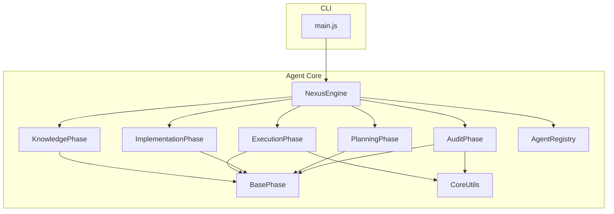

**Diagram sources**
- [NexusEngine.js:39-135](file://agent/core/NexusEngine.js#L39-L135)
- [BasePhase.js:1-28](file://agent/core/phases/BasePhase.js#L1-L28)
- [CoreUtils.js:1-53](file://agent/core/phases/CoreUtils.js#L1-L53)
- [AuditPhase.js:1-189](file://agent/core/phases/AuditPhase.js#L1-L189)
- [PlanningPhase.js:1-73](file://agent/core/phases/PlanningPhase.js#L1-L73)
- [ImplementationPhase.js:1-1093](file://agent/core/phases/ImplementationPhase.js#L1-L1093)
- [ExecutionPhase.js:1-937](file://agent/core/phases/ExecutionPhase.js#L1-L937)
- [KnowledgePhase.js:1-104](file://agent/core/phases/KnowledgePhase.js#L1-L104)
- [AgentRegistry.js:1-124](file://agent/core/AgentRegistry.js#L1-L124)
- [main.js:1-316](file://agent/main.js#L1-L316)

**Section sources**
- [NexusEngine.js:39-135](file://agent/core/NexusEngine.js#L39-L135)
- [main.js:19-121](file://agent/main.js#L19-L121)

## Core Components
- BasePhase: Defines the common interface and logging for all phases. It enforces a mandatory run() contract and provides centralized logging and error handling hooks.
- CoreUtils: Provides path resolution, recursive file scanning, and safe deletion helpers used across phases (especially Audit and Execution).
- NexusEngine: The orchestrator that initializes specialized phases, coordinates transitions, maintains state, and exposes modular delegation methods for each phase.

Key responsibilities:
- BasePhase: Standardized lifecycle entry points and error propagation.
- CoreUtils: Robust filesystem operations and path discovery aligned with Nexus conventions.
- NexusEngine: Lifecycle orchestration, state transitions, and integration of tools and utilities.

**Section sources**
- [BasePhase.js:1-28](file://agent/core/phases/BasePhase.js#L1-L28)
- [CoreUtils.js:1-53](file://agent/core/phases/CoreUtils.js#L1-L53)
- [NexusEngine.js:60-137](file://agent/core/NexusEngine.js#L60-L137)

## Architecture Overview
The five-phase lifecycle is executed as a modularized cycle within NexusEngine. Each phase consumes outputs from previous phases and produces artifacts consumed by subsequent phases.

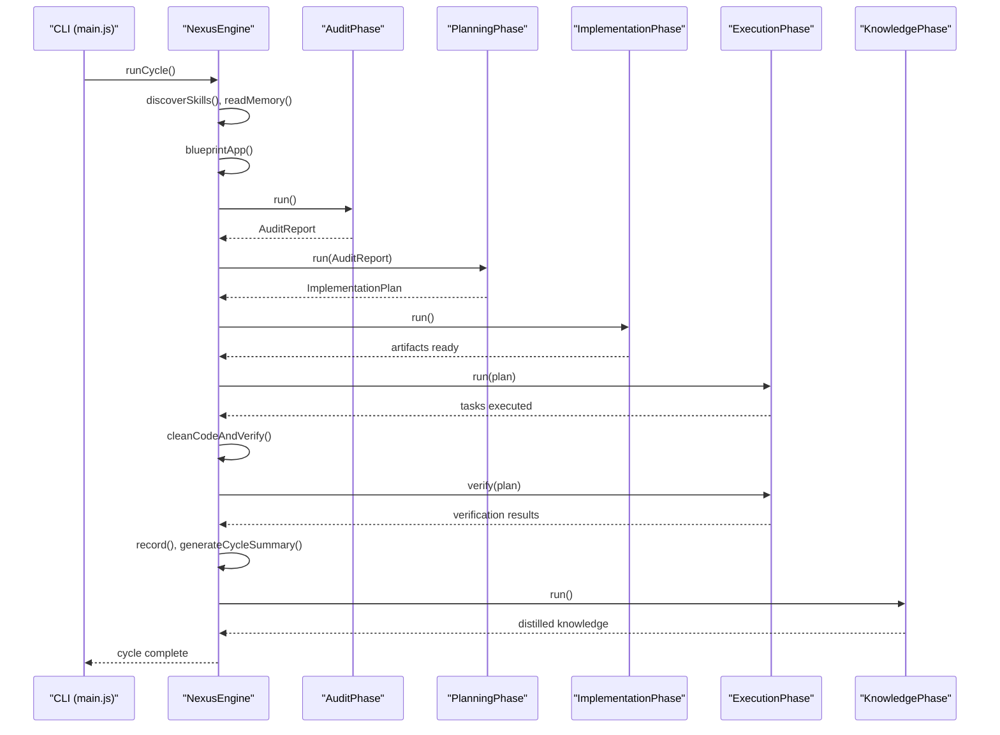

**Diagram sources**
- [NexusEngine.js:348-395](file://agent/core/NexusEngine.js#L348-L395)
- [AuditPhase.js:9-162](file://agent/core/phases/AuditPhase.js#L9-L162)
- [PlanningPhase.js:9-68](file://agent/core/phases/PlanningPhase.js#L9-L68)
- [ImplementationPhase.js:8-66](file://agent/core/phases/ImplementationPhase.js#L8-L66)
- [ExecutionPhase.js:10-106](file://agent/core/phases/ExecutionPhase.js#L10-L106)
- [KnowledgePhase.js:7-16](file://agent/core/phases/KnowledgePhase.js#L7-L16)
- [main.js:37-121](file://agent/main.js#L37-L121)

## Detailed Component Analysis

### BasePhase Architecture
BasePhase establishes a uniform contract for all phases:
- Constructor: Receives the engine, exposing logger, config, and shared utilities.
- run(): Abstract method enforced by child classes.
- log(): Centralized logging with phase-aware prefixes.
- handleError(): Standardized error handling and propagation.

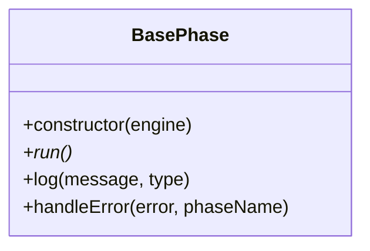

**Diagram sources**
- [BasePhase.js:6-25](file://agent/core/phases/BasePhase.js#L6-L25)

**Section sources**
- [BasePhase.js:6-25](file://agent/core/phases/BasePhase.js#L6-L25)

### CoreUtils Utilities
CoreUtils encapsulates filesystem helpers used by phases:
- resolvePath(): Determines canonical locations for folders using Nexus conventions.
- globRecursive(): Optimized recursive file discovery with ignore lists.
- removeRecursive(): Safe deletion helper.

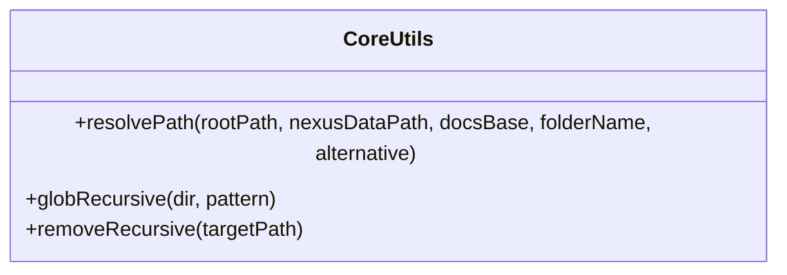

**Diagram sources**
- [CoreUtils.js:8-50](file://agent/core/phases/CoreUtils.js#L8-L50)

**Section sources**
- [CoreUtils.js:8-50](file://agent/core/phases/CoreUtils.js#L8-L50)

### Audit Phase
Responsibilities:
- Validates project structure and standard folders.
- Scans for sensitive files and compliance items.
- Executes parallel specialist scans via Orchestrator and ParallelRunner.
- Runs autonomous machine checks (SchemaGuard, QueryOptimizer, AccessibilityScanner).
- Produces an AuditReport and consolidated markdown summary.

Data flow:
- Consumes engine paths and tools.
- Emits metrics and logs per specialist.
- Aggregates findings into a single report.

Decision points:
- Mode selection (learning vs efficient).
- Concurrency limits for specialist scans.
- Handling of missing folders and missing files.

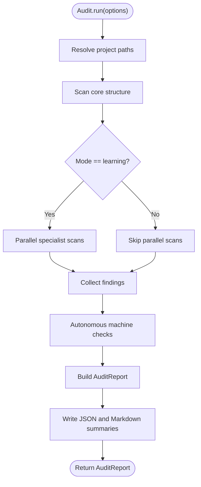

**Diagram sources**
- [AuditPhase.js:9-162](file://agent/core/phases/AuditPhase.js#L9-L162)

**Section sources**
- [AuditPhase.js:9-162](file://agent/core/phases/AuditPhase.js#L9-L162)

### Planning Phase
Responsibilities:
- Requires a valid AuditReport.
- Transforms findings into actionable tasks with rationale and recommendations.
- Auto-generates actions for specific findings (e.g., .env handling).
- Produces an ImplementationPlan and writes plan artifacts.

Decision points:
- Filtering INFO findings and excluding completion messages.
- Auto-action generation for specific conditions.

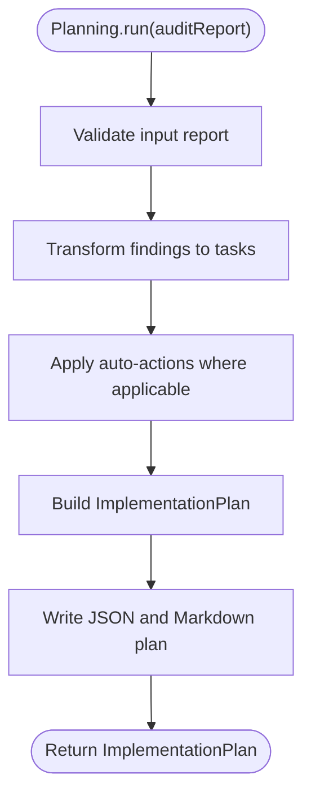

**Diagram sources**
- [PlanningPhase.js:9-68](file://agent/core/phases/PlanningPhase.js#L9-L68)

**Section sources**
- [PlanningPhase.js:9-68](file://agent/core/phases/PlanningPhase.js#L9-L68)

### Implementation Phase
Responsibilities:
- Generates models, policies, API controllers, migrations, factories, seeders, Livewire components, routes, and layouts based on NEXUS_BLUEPRINT.json.
- Bootstraps application dependencies (Composer, NPM, Breeze, keys, migrations).
- Caches generated code and persists training datasets.
- Validates PHP syntax and falls back to safe templates when needed.

Decision points:
- Blueprint existence and freshness.
- Dependency scaffolding and migration strategy.
- Caching and dataset persistence.

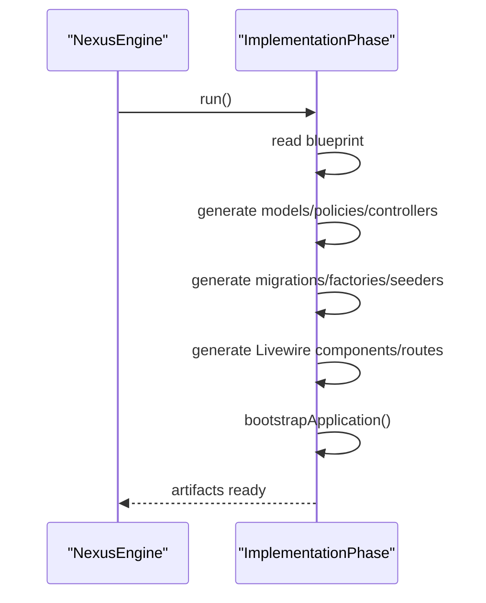

**Diagram sources**
- [ImplementationPhase.js:8-66](file://agent/core/phases/ImplementationPhase.js#L8-L66)
- [NexusEngine.js:397-490](file://agent/core/NexusEngine.js#L397-L490)

**Section sources**
- [ImplementationPhase.js:8-200](file://agent/core/phases/ImplementationPhase.js#L8-L200)
- [NexusEngine.js:397-490](file://agent/core/NexusEngine.js#L397-L490)

### Execution Phase
Responsibilities:
- Executes tasks from the plan, applying TDD enforcement and asset optimization.
- Performs verification of executed actions.
- Conducts cleanup and stability verification, including legacy file removal, route cleanup, auto-wiring frontend, database reset, and service health checks.
- Implements self-healing routines using deterministic fixes and AI-driven repairs.

Decision points:
- TDD gating for file modifications.
- Asset optimization vs direct modifier application.
- Legacy pattern detection and protection of allowed components/models.
- Self-healing stages and port availability checks.

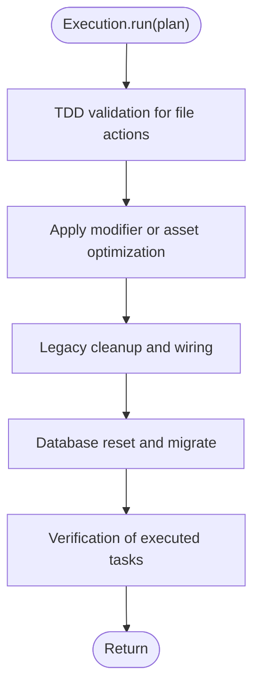

**Diagram sources**
- [ExecutionPhase.js:10-145](file://agent/core/phases/ExecutionPhase.js#L10-L145)

**Section sources**
- [ExecutionPhase.js:10-480](file://agent/core/phases/ExecutionPhase.js#L10-L480)

### Knowledge Phase
Responsibilities:
- Optimizes and distills memory via MemoryPipeline and Distiller.
- Harvests knowledge from remote projects into the Golden HUB, merging conflicts conditionally.
- Updates system status in README.md.

Decision points:
- Source selection among nexus/docs/memory.
- Conflict resolution and conditional merging.

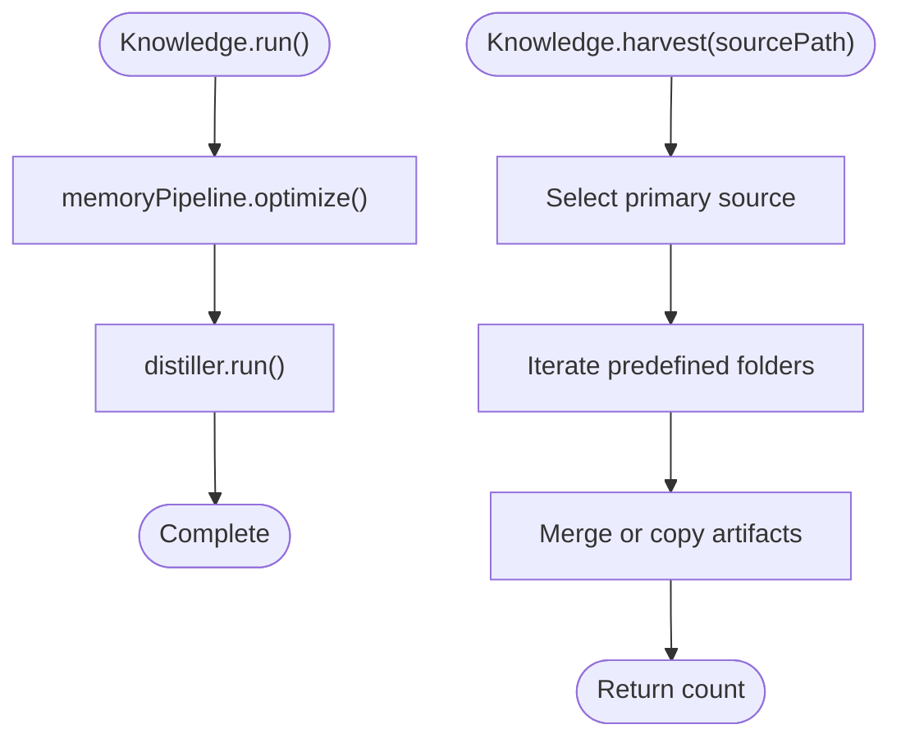

**Diagram sources**
- [KnowledgePhase.js:7-16](file://agent/core/phases/KnowledgePhase.js#L7-L16)
- [KnowledgePhase.js:19-93](file://agent/core/phases/KnowledgePhase.js#L19-L93)

**Section sources**
- [KnowledgePhase.js:7-104](file://agent/core/phases/KnowledgePhase.js#L7-L104)

### Phase Transition Mechanisms
NexusEngine coordinates transitions between phases:
- runCycle(): Orchestrates discovery, blueprinting, audit, planning, implementation, execution, verification, recording, and summarization.
- Modular delegation: Methods like audit(), plan(), implement(), execute(), verify(), cleanCodeAndVerify(), harvest(), distill(), updateStatus() delegate to respective phases.
- State management: Tracks lifecycle states (INIT, PROCESSING, EXECUTING, LOGGING, COMPLETED, FAILED).
- Timeout protection: Enforces a global 90-minute cap per cycle.

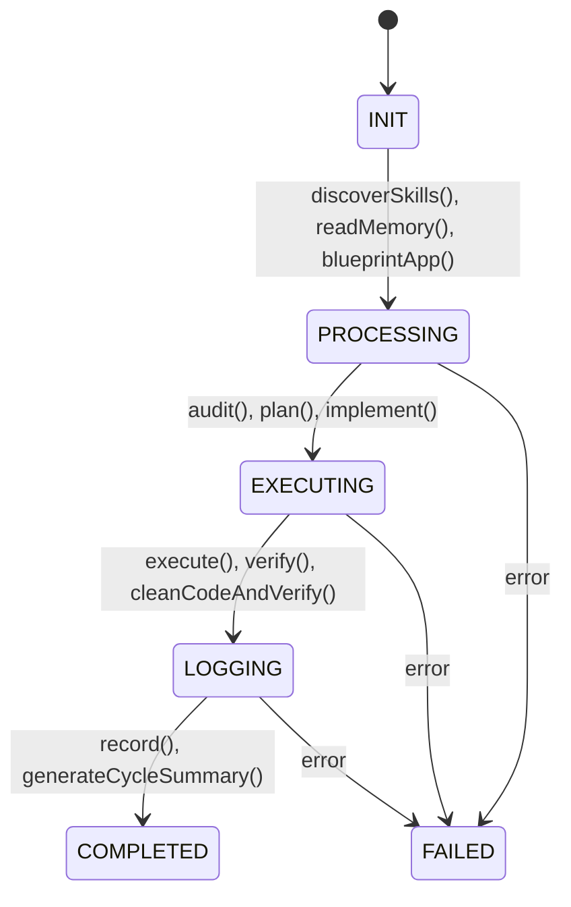

**Diagram sources**
- [NexusEngine.js:48-55](file://agent/core/NexusEngine.js#L48-L55)
- [NexusEngine.js:348-395](file://agent/core/NexusEngine.js#L348-L395)

**Section sources**
- [NexusEngine.js:348-395](file://agent/core/NexusEngine.js#L348-L395)

## Dependency Analysis
Inter-module dependencies and coupling:
- NexusEngine composes BasePhase-derived phases and integrates tools (Modifier, LaravelArchitect, MemoryPipeline, TDDGuard, AssetEngine, Validator, BugHunter, Designer, AccessibilityScanner, SchemaGuard, QueryOptimizer, WorktreeManager, RootCauseAnalyzer, Machinist, Distiller, TDDScaffolder, Logger, MemoryGovernor, EventBus, SandboxExecutor, NexusClock, Orchestrator, ResourceMonitor, EvolutionPiper, DecisionEngine, SemanticEngine, redis, localAI, AgentRegistry, CoreUtils, ParallelRunner, NativeBridge).
- AuditPhase and ExecutionPhase depend on CoreUtils for filesystem operations.
- ImplementationPhase depends on LocalIntelligence for code generation and caches outputs.
- KnowledgePhase relies on MemoryPipeline and Distiller for knowledge processing.

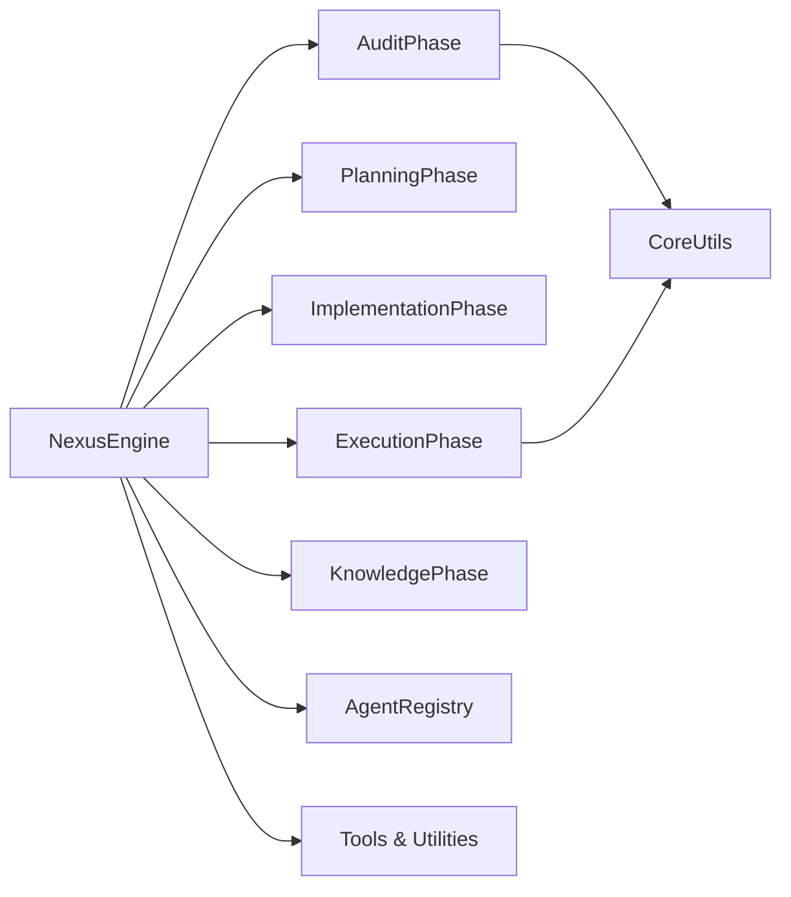

**Diagram sources**
- [NexusEngine.js:39-135](file://agent/core/NexusEngine.js#L39-L135)
- [AuditPhase.js:1-7](file://agent/core/phases/AuditPhase.js#L1-L7)
- [ExecutionPhase.js:1-8](file://agent/core/phases/ExecutionPhase.js#L1-L8)
- [CoreUtils.js:1-53](file://agent/core/phases/CoreUtils.js#L1-L53)
- [AgentRegistry.js:1-124](file://agent/core/AgentRegistry.js#L1-L124)

**Section sources**
- [NexusEngine.js:39-135](file://agent/core/NexusEngine.js#L39-L135)

## Performance Considerations
- Concurrency control: AuditPhase uses ParallelRunner with a capped concurrency to prevent OOM on constrained environments.
- Filesystem operations: CoreUtils leverages fast-glob for SSD-friendly recursive scanning and safe deletion.
- Command execution: ImplementationPhase and ExecutionPhase use spawn with timeouts and platform-aware shells to avoid hangs.
- Caching: ImplementationPhase caches generated code and datasets to reduce repeated AI generation costs.
- Self-healing: ExecutionPhase includes iterative port probing and deterministic pre-heals to minimize retries and failures.

[No sources needed since this section provides general guidance]

## Troubleshooting Guide
Common issues and remedies:
- Audit scan failures: Verify project structure and required files (.env handling controlled by allowSensitive flag). Check logs and metrics per specialist.
- Planning approval loops: Incorporate user feedback into findings to refine subsequent plans.
- Execution task failures: Inspect TDD validation outcomes and apply scaffolding when blocked. Review verification results and task statuses.
- Legacy cleanup conflicts: Ensure allowed components/models are properly configured in NEXUS_BLUEPRINT.json to avoid accidental deletions.
- Self-healing: Deterministic pre-heals address common PHP fatal errors; if unresolved, AI-based healing parses laravel.log and applies full-file replacements after PHP lint validation.
- Knowledge harvesting collisions: wrapAsConditional consolidates conflicting knowledge using similarity scoring and option-based consolidation.

**Section sources**
- [AuditPhase.js:74-112](file://agent/core/phases/AuditPhase.js#L74-L112)
- [PlanningPhase.js:19-40](file://agent/core/phases/PlanningPhase.js#L19-L40)
- [ExecutionPhase.js:24-82](file://agent/core/phases/ExecutionPhase.js#L24-L82)
- [ExecutionPhase.js:670-800](file://agent/core/phases/ExecutionPhase.js#L670-L800)
- [KnowledgePhase.js:52-73](file://agent/core/phases/KnowledgePhase.js#L52-L73)
- [NexusEngine.js:524-563](file://agent/core/NexusEngine.js#L524-L563)

## Conclusion
The NEXUS AI agent phase system provides a robust, modular, and autonomous lifecycle for continuous system improvement. BasePhase ensures consistent behavior across phases, CoreUtils offers reliable filesystem operations, and NexusEngine orchestrates transitions with clear decision points and safeguards. Together, they enable scalable auditing, planning, implementation, execution, and knowledge distillation, culminating in a self-improving system capable of adapting to evolving requirements.