# Audit Phase

<cite>
**Referenced Files in This Document**
- [AuditPhase.js](file://agent/core/phases/AuditPhase.js)
- [BasePhase.js](file://agent/core/phases/BasePhase.js)
- [LocalIntelligence.js](file://agent/core/LocalIntelligence.js)
- [NexusClock.js](file://agent/core/NexusClock.js)
- [EventBus.js](file://agent/core/EventBus.js)
- [MemoryPipeline.js](file://agent/core/MemoryPipeline.js)
- [Contract.js](file://agent/core/Contract.js)
- [Distiller.js](file://agent/core/Distiller.js)
- [RootCauseAnalyzer.js](file://agent/tools/RootCauseAnalyzer.js)
- [Validator.js](file://agent/tools/Validator.js)
- [audit-workflow.md](file://agent/workflows/internal/audit-workflow.md)
- [NEXUS_AUDIT_SUMMARY_AUDIT-1778479692344.MD](file://memory/raw/NEXUS_AUDIT_SUMMARY_AUDIT-1778479692344.MD)
- [NEXUS_REPORT_DATABASE-ARCHITECT_AUDIT-1779702317598.MD](file://memory/raw/NEXUS_REPORT_DATABASE-ARCHITECT_AUDIT-1779702317598.MD)
</cite>

## Table of Contents
1. [Introduction](#introduction)
2. [Project Structure](#project-structure)
3. [Core Components](#core-components)
4. [Architecture Overview](#architecture-overview)
5. [Detailed Component Analysis](#detailed-component-analysis)
6. [Dependency Analysis](#dependency-analysis)
7. [Performance Considerations](#performance-considerations)
8. [Troubleshooting Guide](#troubleshooting-guide)
9. [Conclusion](#conclusion)

## Introduction
The Audit Phase is the foundational stage of the NEXUS AI agent system responsible for system assessment, problem identification, and initial analysis. Its primary goal is to collect and analyze evidence across the agent ecosystem, detect anomalies and risks, and produce structured audit reports that guide subsequent phases such as Planning and Execution. The phase integrates with LocalIntelligence for contextual awareness and reasoning, and coordinates timing via NexusClock to ensure consistent temporal anchoring across assessments. It also leverages the MemoryPipeline for artifact archival and the EventBus for audit logging, ensuring traceability and continuity of findings.

## Project Structure
The Audit Phase is implemented as part of the agent core phases and interacts with several supporting modules:
- Core phase framework: BasePhase and AuditPhase
- Intelligence and reasoning: LocalIntelligence
- Temporal coordination: NexusClock
- Logging and observability: EventBus
- Knowledge curation: MemoryPipeline and Distiller
- Contracts and validation: Contract
- Diagnostic tools: RootCauseAnalyzer and Validator
- Workflow specification: audit-workflow.md
- Historical artifacts: audit summaries and specialist reports

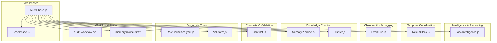

**Diagram sources**
- [AuditPhase.js](file://agent/core/phases/AuditPhase.js)
- [BasePhase.js](file://agent/core/phases/BasePhase.js)
- [LocalIntelligence.js](file://agent/core/LocalIntelligence.js)
- [NexusClock.js](file://agent/core/NexusClock.js)
- [EventBus.js](file://agent/core/EventBus.js)
- [MemoryPipeline.js](file://agent/core/MemoryPipeline.js)
- [Distiller.js](file://agent/core/Distiller.js)
- [Contract.js](file://agent/core/Contract.js)
- [RootCauseAnalyzer.js](file://agent/tools/RootCauseAnalyzer.js)
- [Validator.js](file://agent/tools/Validator.js)
- [audit-workflow.md](file://agent/workflows/internal/audit-workflow.md)

**Section sources**
- [AuditPhase.js](file://agent/core/phases/AuditPhase.js)
- [BasePhase.js](file://agent/core/phases/BasePhase.js)
- [LocalIntelligence.js](file://agent/core/LocalIntelligence.js)
- [NexusClock.js](file://agent/core/NexusClock.js)
- [EventBus.js](file://agent/core/EventBus.js)
- [MemoryPipeline.js](file://agent/core/MemoryPipeline.js)
- [Distiller.js](file://agent/core/Distiller.js)
- [Contract.js](file://agent/core/Contract.js)
- [RootCauseAnalyzer.js](file://agent/tools/RootCauseAnalyzer.js)
- [Validator.js](file://agent/tools/Validator.js)
- [audit-workflow.md](file://agent/workflows/internal/audit-workflow.md)

## Core Components
- AuditPhase: Orchestrates the audit lifecycle, including trigger evaluation, data collection, pattern recognition, and issue detection. It emits structured findings and coordinates with downstream components for remediation planning.
- BasePhase: Provides shared lifecycle hooks and utilities used by AuditPhase.
- LocalIntelligence: Supplies contextual awareness and reasoning capabilities, routing tasks to appropriate inference engines and managing rate limits and circuit breakers.
- NexusClock: Ensures consistent timestamping across audit activities, aligning all logs and reports to a unified temporal reference.
- EventBus: Maintains an audit log for traceability and enables cross-component visibility of audit events.
- MemoryPipeline: Archives and organizes audit artifacts into the knowledge base, preserving historical context for future assessments.
- Distiller: Transforms raw agent logs into structured Markdown audit reports, enabling synthesis and knowledge distillation.
- Contract: Defines strict schemas for audit artifacts (AuditReport, ImplementationPlan) to enforce data integrity and completeness.
- RootCauseAnalyzer and Validator: Provide diagnostic capabilities to identify root causes and validate findings against predefined criteria.

**Section sources**
- [AuditPhase.js](file://agent/core/phases/AuditPhase.js)
- [BasePhase.js](file://agent/core/phases/BasePhase.js)
- [LocalIntelligence.js](file://agent/core/LocalIntelligence.js)
- [NexusClock.js](file://agent/core/NexusClock.js)
- [EventBus.js](file://agent/core/EventBus.js)
- [MemoryPipeline.js](file://agent/core/MemoryPipeline.js)
- [Distiller.js](file://agent/core/Distiller.js)
- [Contract.js](file://agent/core/Contract.js)
- [RootCauseAnalyzer.js](file://agent/tools/RootCauseAnalyzer.js)
- [Validator.js](file://agent/tools/Validator.js)

## Architecture Overview
The Audit Phase follows a structured workflow:
1. Trigger evaluation: Determines when an audit should run based on system state, scheduled cadence, or external signals.
2. Data collection: Gathers telemetry, logs, and contextual signals from across the system.
3. Pattern recognition: Identifies anomalies, trends, and risk indicators using LocalIntelligence and diagnostic tools.
4. Issue detection: Flags violations against established contracts and validation rules.
5. Reporting: Produces structured audit reports and archives them via MemoryPipeline and Distiller.
6. Logging: Records all audit events in EventBus for traceability and compliance.

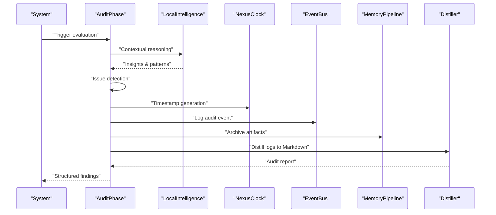

**Diagram sources**
- [AuditPhase.js](file://agent/core/phases/AuditPhase.js)
- [LocalIntelligence.js](file://agent/core/LocalIntelligence.js)
- [NexusClock.js](file://agent/core/NexusClock.js)
- [EventBus.js](file://agent/core/EventBus.js)
- [MemoryPipeline.js](file://agent/core/MemoryPipeline.js)
- [Distiller.js](file://agent/core/Distiller.js)

## Detailed Component Analysis

### AuditPhase
Responsibilities:
- Define audit lifecycle hooks and orchestrate data collection and analysis.
- Integrate with LocalIntelligence for contextual reasoning and with NexusClock for timestamping.
- Emit findings and coordinate with EventBus for logging and with MemoryPipeline for artifact archival.
- Produce structured outputs consumable by downstream phases.

Key behaviors:
- Trigger evaluation: Decides whether to initiate an audit based on system conditions or schedule.
- Data aggregation: Collects telemetry and contextual signals.
- Pattern recognition: Uses reasoning capabilities to identify anomalies.
- Issue detection: Validates findings against contracts and diagnostic tools.
- Reporting: Generates structured reports and archives them.

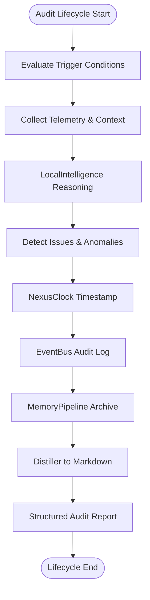

**Diagram sources**
- [AuditPhase.js](file://agent/core/phases/AuditPhase.js)
- [LocalIntelligence.js](file://agent/core/LocalIntelligence.js)
- [NexusClock.js](file://agent/core/NexusClock.js)
- [EventBus.js](file://agent/core/EventBus.js)
- [MemoryPipeline.js](file://agent/core/MemoryPipeline.js)
- [Distiller.js](file://agent/core/Distiller.js)

**Section sources**
- [AuditPhase.js](file://agent/core/phases/AuditPhase.js)
- [BasePhase.js](file://agent/core/phases/BasePhase.js)

### LocalIntelligence Integration
Role:
- Provides contextual awareness and reasoning to support pattern recognition and anomaly detection.
- Manages inference routing, rate limiting, and circuit breaker logic to ensure resilient operation.

Integration points:
- Task routing based on capability and resource availability.
- Prompt chunking for large inputs and circuit breaker fail-fast behavior.
- Rate limit handling with retries and cooldown periods.

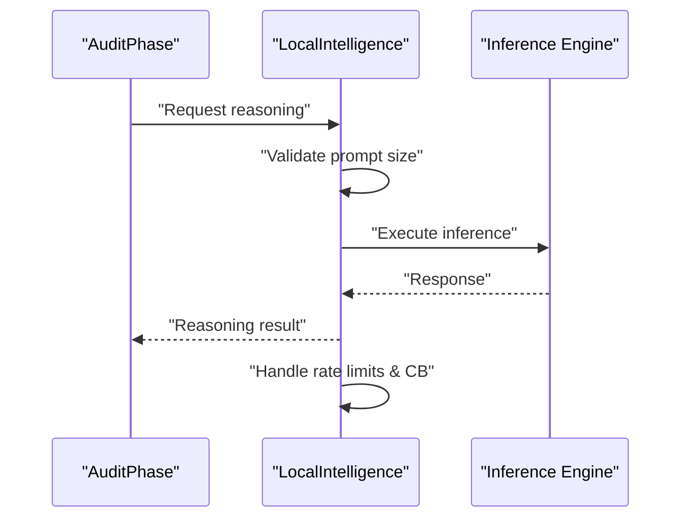

**Diagram sources**
- [LocalIntelligence.js](file://agent/core/LocalIntelligence.js)
- [AuditPhase.js](file://agent/core/phases/AuditPhase.js)

**Section sources**
- [LocalIntelligence.js](file://agent/core/LocalIntelligence.js)

### NexusClock Coordination
Role:
- Ensures consistent timestamping across all audit activities, aligning logs and reports to a unified temporal reference.

Usage:
- Generates ISO timestamps for audit entries and report metadata.
- Supports local timestamp formatting for human-readable outputs.

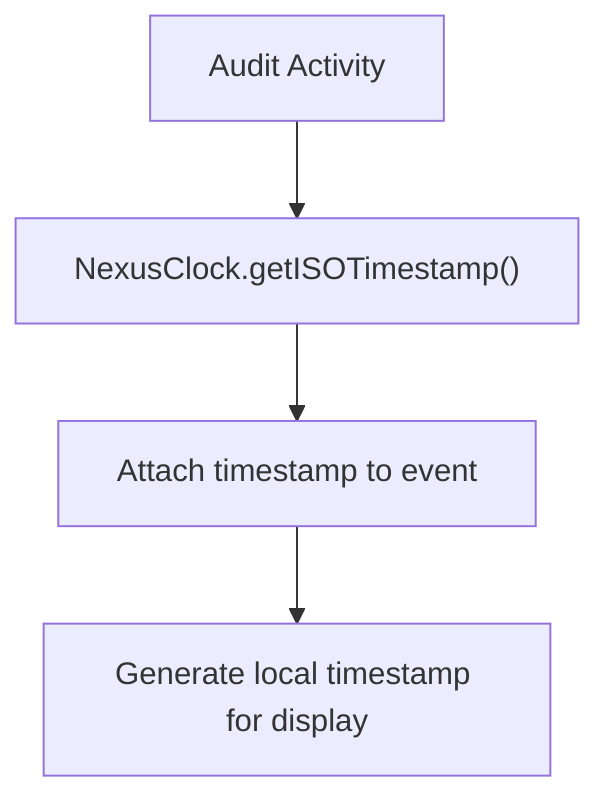

**Diagram sources**
- [NexusClock.js](file://agent/core/NexusClock.js)
- [AuditPhase.js](file://agent/core/phases/AuditPhase.js)

**Section sources**
- [NexusClock.js](file://agent/core/NexusClock.js)

### EventBus Audit Logging
Role:
- Maintains an audit log for traceability and enables cross-component visibility of audit events.

Capabilities:
- Append audit entries with contextual metadata.
- Retrieve and clear audit logs for analysis and compliance.

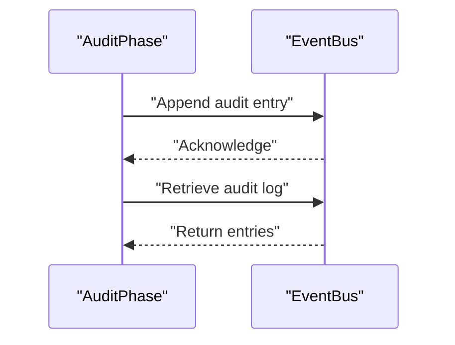

**Diagram sources**
- [EventBus.js](file://agent/core/EventBus.js)
- [AuditPhase.js](file://agent/core/phases/AuditPhase.js)

**Section sources**
- [EventBus.js](file://agent/core/EventBus.js)

### MemoryPipeline Archival
Role:
- Archives audit artifacts into the knowledge base, preserving historical context for future assessments.

Behavior:
- Creates dedicated audit directories under memory/raw/audits.
- Archives reports and indices for long-term retention and retrieval.

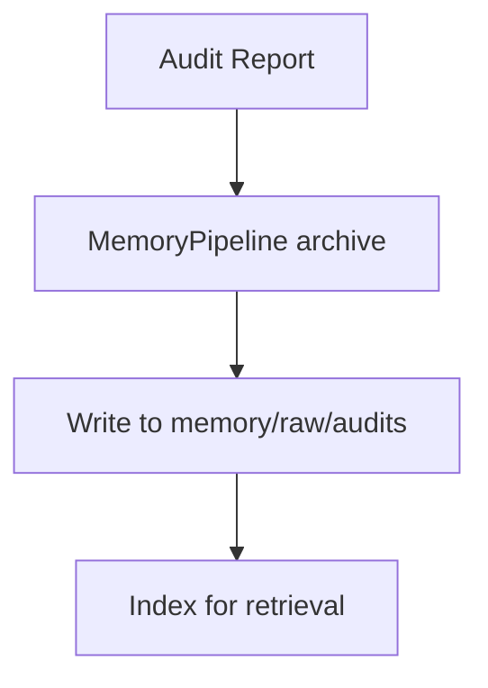

**Diagram sources**
- [MemoryPipeline.js](file://agent/core/MemoryPipeline.js)
- [AuditPhase.js](file://agent/core/phases/AuditPhase.js)

**Section sources**
- [MemoryPipeline.js](file://agent/core/MemoryPipeline.js)

### Distiller Audit Report Generation
Role:
- Transforms raw agent logs into structured Markdown audit reports, enabling synthesis and knowledge distillation.

Process:
- Reads JSON logs from logs/agents/.
- Produces Markdown reports grouped by date and category.
- Writes curated knowledge nodes to the audit knowledge path.

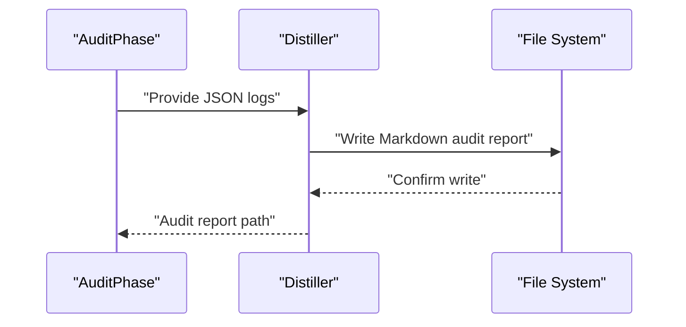

**Diagram sources**
- [Distiller.js](file://agent/core/Distiller.js)
- [AuditPhase.js](file://agent/core/phases/AuditPhase.js)

**Section sources**
- [Distiller.js](file://agent/core/Distiller.js)

### Contract Validation
Role:
- Enforces strict schemas for audit artifacts to ensure data integrity and completeness.

Components:
- AuditReport: Defines required fields and validation rules for audit findings.
- ImplementationPlan: Structured remediation plan linked to audit references.

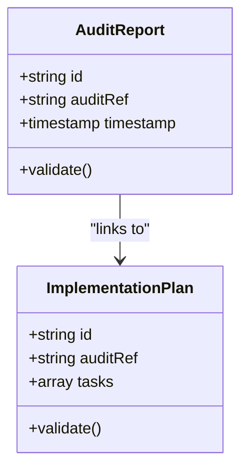

**Diagram sources**
- [Contract.js](file://agent/core/Contract.js)
- [AuditPhase.js](file://agent/core/phases/AuditPhase.js)

**Section sources**
- [Contract.js](file://agent/core/Contract.js)

### Diagnostic Tools
RootCauseAnalyzer:
- Identifies root causes of detected issues using diagnostic heuristics and system introspection.

Validator:
- Validates findings against predefined criteria and contracts to prevent false positives and ensure actionable insights.

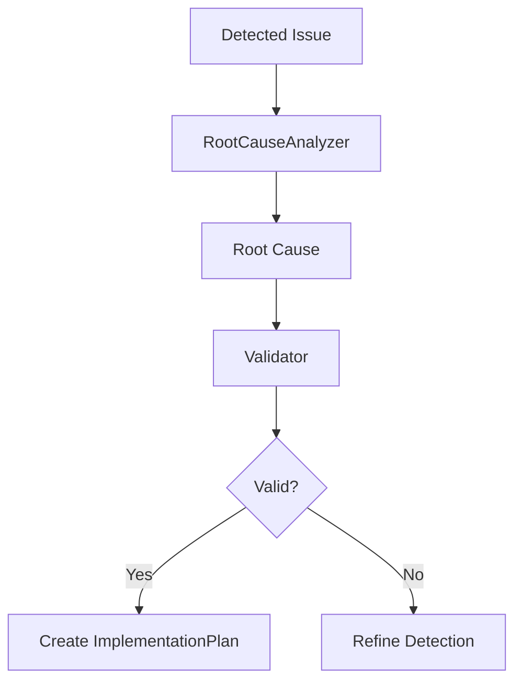

**Diagram sources**
- [RootCauseAnalyzer.js](file://agent/tools/RootCauseAnalyzer.js)
- [Validator.js](file://agent/tools/Validator.js)
- [AuditPhase.js](file://agent/core/phases/AuditPhase.js)

**Section sources**
- [RootCauseAnalyzer.js](file://agent/tools/RootCauseAnalyzer.js)
- [Validator.js](file://agent/tools/Validator.js)

### Workflow Specification
The internal audit workflow defines the canonical process for conducting audits, including trigger conditions, assessment criteria, and decision-making checkpoints. It serves as a reference for aligning automated and manual audit activities.

**Section sources**
- [audit-workflow.md](file://agent/workflows/internal/audit-workflow.md)

### Historical Artifacts
- Audit summaries and specialist reports demonstrate real-world audit outputs, including warnings and remediation steps.
- Examples include database architect findings with hardcoded credentials and other security concerns.

**Section sources**
- [NEXUS_AUDIT_SUMMARY_AUDIT-1778479692344.MD](file://memory/raw/NEXUS_AUDIT_SUMMARY_AUDIT-1778479692344.MD)
- [NEXUS_REPORT_DATABASE-ARCHITECT_AUDIT-1779702317598.MD](file://memory/raw/NEXUS_REPORT_DATABASE-ARCHITECT_AUDIT-1779702317598.MD)

## Dependency Analysis
The Audit Phase exhibits strong cohesion around its core responsibilities while maintaining loose coupling with supporting modules. Dependencies are primarily unidirectional, flowing from AuditPhase outward to LocalIntelligence, NexusClock, EventBus, MemoryPipeline, Distiller, Contract, and diagnostic tools.

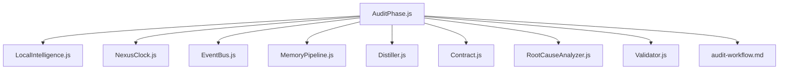

**Diagram sources**
- [AuditPhase.js](file://agent/core/phases/AuditPhase.js)
- [LocalIntelligence.js](file://agent/core/LocalIntelligence.js)
- [NexusClock.js](file://agent/core/NexusClock.js)
- [EventBus.js](file://agent/core/EventBus.js)
- [MemoryPipeline.js](file://agent/core/MemoryPipeline.js)
- [Distiller.js](file://agent/core/Distiller.js)
- [Contract.js](file://agent/core/Contract.js)
- [RootCauseAnalyzer.js](file://agent/tools/RootCauseAnalyzer.js)
- [Validator.js](file://agent/tools/Validator.js)
- [audit-workflow.md](file://agent/workflows/internal/audit-workflow.md)

**Section sources**
- [AuditPhase.js](file://agent/core/phases/AuditPhase.js)
- [LocalIntelligence.js](file://agent/core/LocalIntelligence.js)
- [NexusClock.js](file://agent/core/NexusClock.js)
- [EventBus.js](file://agent/core/EventBus.js)
- [MemoryPipeline.js](file://agent/core/MemoryPipeline.js)
- [Distiller.js](file://agent/core/Distiller.js)
- [Contract.js](file://agent/core/Contract.js)
- [RootCauseAnalyzer.js](file://agent/tools/RootCauseAnalyzer.js)
- [Validator.js](file://agent/tools/Validator.js)
- [audit-workflow.md](file://agent/workflows/internal/audit-workflow.md)

## Performance Considerations
- Asynchronous orchestration: AuditPhase leverages asynchronous operations to avoid blocking and to scale across multiple data sources.
- Circuit breaker and rate limiting: LocalIntelligence mitigates resource contention and prevents cascading failures during inference-heavy operations.
- Efficient logging: EventBus maintains compact audit entries to minimize I/O overhead.
- Incremental archival: MemoryPipeline writes artifacts incrementally to reduce memory pressure and improve resilience.
- Report distillation: Distiller batches and formats outputs to optimize downstream consumption.

## Troubleshooting Guide
Common issues and resolutions:
- Audit not triggering: Verify trigger conditions and workflow alignment. Check NexusClock timestamps for consistency.
- Missing audit logs: Confirm EventBus append operations and ensure audit log retrieval is enabled.
- Inference failures: Review LocalIntelligence circuit breaker state and rate limit handling; adjust retry policies if necessary.
- Contract validation errors: Ensure AuditReport and ImplementationPlan schemas match required fields and constraints.
- Artifact archival failures: Validate MemoryPipeline paths and permissions; confirm write operations succeed.
- Distillation errors: Inspect JSON log formats and ensure Distiller has access to required directories.

**Section sources**
- [AuditPhase.js](file://agent/core/phases/AuditPhase.js)
- [EventBus.js](file://agent/core/EventBus.js)
- [LocalIntelligence.js](file://agent/core/LocalIntelligence.js)
- [Contract.js](file://agent/core/Contract.js)
- [MemoryPipeline.js](file://agent/core/MemoryPipeline.js)
- [Distiller.js](file://agent/core/Distiller.js)

## Conclusion
The Audit Phase establishes a robust foundation for system assessment within the NEXUS AI agent ecosystem. By integrating contextual reasoning, temporal coordination, and comprehensive logging, it delivers structured, actionable insights that drive informed decision-making and remediation planning. Its modular design and adherence to contracts ensure reliability, traceability, and scalability across diverse audit scenarios.