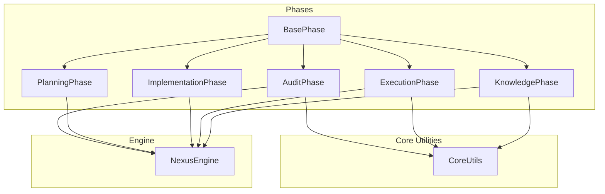
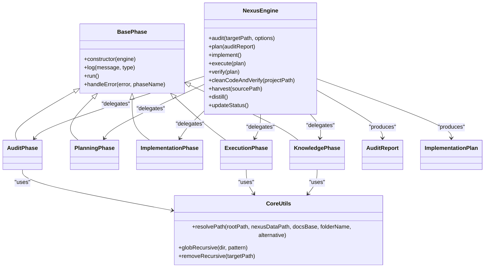
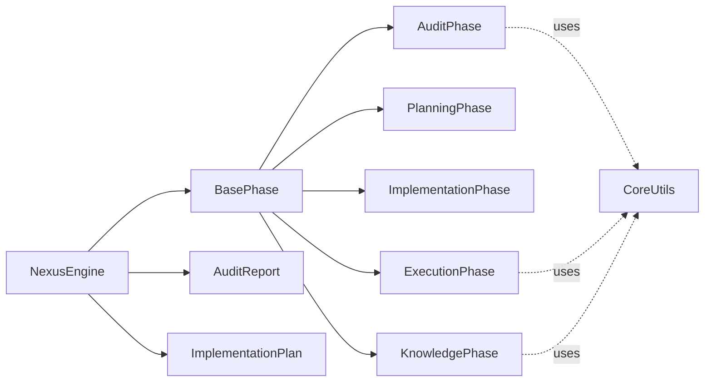

# Base Phase Architecture

<cite>
**Referenced Files in This Document**
- [BasePhase.js](file://agent/core/phases/BasePhase.js)
- [CoreUtils.js](file://agent/core/phases/CoreUtils.js)
- [AuditPhase.js](file://agent/core/phases/AuditPhase.js)
- [PlanningPhase.js](file://agent/core/phases/PlanningPhase.js)
- [ExecutionPhase.js](file://agent/core/phases/ExecutionPhase.js)
- [ImplementationPhase.js](file://agent/core/phases/ImplementationPhase.js)
- [KnowledgePhase.js](file://agent/core/phases/KnowledgePhase.js)
- [NexusEngine.js](file://agent/core/NexusEngine.js)
- [Contract.js](file://agent/core/Contract.js)
</cite>

## Table of Contents
1. [Introduction](#introduction)
2. [Project Structure](#project-structure)
3. [Core Components](#core-components)
4. [Architecture Overview](#architecture-overview)
5. [Detailed Component Analysis](#detailed-component-analysis)
6. [Dependency Analysis](#dependency-analysis)
7. [Performance Considerations](#performance-considerations)
8. [Troubleshooting Guide](#troubleshooting-guide)
9. [Conclusion](#conclusion)

## Introduction
This document explains the Base Phase Architecture and Core Utilities that underpin the Nexus Engine’s modular, lifecycle-driven phases. It covers the BasePhase abstract class design, common phase functionality, lifecycle management, and the CoreUtils utility functions that coordinate shared resources. It also documents architectural patterns, inheritance hierarchies, common interfaces, and best practices for extending phases and leveraging utilities.

## Project Structure
The Base Phase Architecture resides primarily under agent/core/phases and integrates with the NexusEngine orchestration layer. The phases are designed to be stateless, composable units that communicate through the engine and shared contracts.

**Diagram sources**
- [BasePhase.js:6-25](file://agent/core/phases/BasePhase.js#L6-L25)
- [AuditPhase.js:8-189](file://agent/core/phases/AuditPhase.js#L8-L189)
- [PlanningPhase.js:8-73](file://agent/core/phases/PlanningPhase.js#L8-L73)
- [ImplementationPhase.js:7-1143](file://agent/core/phases/ImplementationPhase.js#L7-L1143)
- [ExecutionPhase.js:9-937](file://agent/core/phases/ExecutionPhase.js#L9-L937)
- [KnowledgePhase.js:6-104](file://agent/core/phases/KnowledgePhase.js#L6-L104)
- [CoreUtils.js:8-53](file://agent/core/phases/CoreUtils.js#L8-L53)
- [NexusEngine.js:39-44](file://agent/core/NexusEngine.js#L39-L44)

**Section sources**
- [BasePhase.js:1-28](file://agent/core/phases/BasePhase.js#L1-L28)
- [CoreUtils.js:1-53](file://agent/core/phases/CoreUtils.js#L1-L53)
- [NexusEngine.js:39-44](file://agent/core/NexusEngine.js#L39-L44)

## Core Components
- BasePhase: Abstract base class that standardizes logging, lifecycle hooks, and error handling across all phases.
- CoreUtils: Shared utilities for path resolution, recursive file scanning, and safe deletion.
- Phase classes: AuditPhase, PlanningPhase, ImplementationPhase, ExecutionPhase, KnowledgePhase, each extending BasePhase and implementing run() and optional verify()/cleanup routines.
- NexusEngine: Orchestrator that initializes shared resources, exposes delegation methods, and coordinates phase execution.

Key responsibilities:
- BasePhase: Provides constructor wiring (engine, logger, config), standardized log() and handleError(), and enforces run() contract.
- CoreUtils: Path resolution, SSD-optimized recursive scanning, and safe recursive deletion.
- NexusEngine: Manages resource instantiation, path resolution, and lifecycle orchestration.

**Section sources**
- [BasePhase.js:6-25](file://agent/core/phases/BasePhase.js#L6-L25)
- [CoreUtils.js:8-53](file://agent/core/phases/CoreUtils.js#L8-L53)
- [NexusEngine.js:39-44](file://agent/core/NexusEngine.js#L39-L44)

## Architecture Overview
The Base Phase Architecture follows a layered, dependency-injected design:
- BasePhase defines the common interface and lifecycle.
- CoreUtils encapsulates cross-cutting utilities.
- NexusEngine composes specialized tools and phases, exposing a clean API for orchestration.
- Contract classes define shared data contracts for audit reports and plans.

**Diagram sources**
- [BasePhase.js:6-25](file://agent/core/phases/BasePhase.js#L6-L25)
- [CoreUtils.js:8-53](file://agent/core/phases/CoreUtils.js#L8-L53)
- [AuditPhase.js:8-189](file://agent/core/phases/AuditPhase.js#L8-L189)
- [PlanningPhase.js:8-73](file://agent/core/phases/PlanningPhase.js#L8-L73)
- [ImplementationPhase.js:7-1143](file://agent/core/phases/ImplementationPhase.js#L7-L1143)
- [ExecutionPhase.js:9-937](file://agent/core/phases/ExecutionPhase.js#L9-L937)
- [KnowledgePhase.js:6-104](file://agent/core/phases/KnowledgePhase.js#L6-L104)
- [NexusEngine.js:39-44](file://agent/core/NexusEngine.js#L39-L44)
- [Contract.js:7-59](file://agent/core/Contract.js#L7-L59)

## Detailed Component Analysis

### BasePhase: Abstract Base Class
- Purpose: Define a uniform interface for all phases, enforce lifecycle discipline, and centralize logging and error handling.
- Constructor wiring: Captures engine reference, logger, and config for downstream use.
- Logging: Wraps engine.log with phase context.
- Lifecycle: run() is abstract and must be implemented by subclasses.
- Error handling: Centralized handleError() logs and rethrows.

Best practices:
- Always call super constructor in derived classes.
- Use this.log() for consistent, contextual logging.
- Implement run() and optionally verify()/cleanup methods in derived phases.

**Section sources**
- [BasePhase.js:6-25](file://agent/core/phases/BasePhase.js#L6-L25)

### CoreUtils: Shared Utilities
- Path resolution: resolvePath() resolves a folder path across multiple candidate locations, prioritizing project conventions and falling back to memory/.
- Recursive scanning: globRecursive() uses fast-glob for SSD-friendly traversal, with sensible ignores.
- Safe deletion: removeRecursive() deletes a target path if it exists.

Usage patterns:
- AuditPhase and ExecutionPhase use CoreUtils.globRecursive() to scan project files efficiently.
- KnowledgePhase uses CoreUtils.resolvePath() to locate source folders for harvesting.

**Section sources**
- [CoreUtils.js:8-53](file://agent/core/phases/CoreUtils.js#L8-L53)

### AuditPhase: Discovery and Parallel Audit
- Responsibilities:
  - Validates core structure and sensitive files.
  - Runs a configurable learning mode with dynamic specialist plugins.
  - Executes autonomous machine audit (schema, query, accessibility).
  - Produces consolidated AuditReport and artifacts.
- Parallelism: Uses ParallelRunner to cap concurrency and avoid OOM.
- Error resilience: Marks failing agents and continues.

Lifecycle integration:
- Called by NexusEngine.audit(), produces currentAudit for downstream phases.

**Section sources**
- [AuditPhase.js:8-189](file://agent/core/phases/AuditPhase.js#L8-L189)
- [NexusEngine.js:310-312](file://agent/core/NexusEngine.js#L310-L312)

### PlanningPhase: Plan Creation from Audit
- Responsibilities:
  - Converts audit findings into actionable tasks.
  - Generates ImplementationPlan with tasks and actions.
  - Persists plan JSON and Markdown summaries.
- Data contract: Uses ImplementationPlan from Contract.js.

Lifecycle integration:
- Called by NexusEngine.plan(), sets engine.currentPlan.

**Section sources**
- [PlanningPhase.js:8-73](file://agent/core/phases/PlanningPhase.js#L8-L73)
- [Contract.js:35-59](file://agent/core/Contract.js#L35-L59)
- [NexusEngine.js:314-316](file://agent/core/NexusEngine.js#L314-L316)

### ImplementationPhase: Code Generation and Bootstrap
- Responsibilities:
  - Reads NEXUS_BLUEPRINT.json and generates models, policies, migrations, factories, seeders, Livewire components, routes, and layout.
  - Bootstraps application dependencies and assets with intelligent caching and safety checks.
  - Uses LocalIntelligence for code generation with template caching and dataset capture.
- Safety and caching:
  - Bootstrap cache compares composer/package lock hashes to skip redundant installs.
  - PHP syntax validation and fallbacks for generated code.

Lifecycle integration:
- Called by NexusEngine.implement().

**Section sources**
- [ImplementationPhase.js:7-1143](file://agent/core/phases/ImplementationPhase.js#L7-L1143)
- [NexusEngine.js:318-320](file://agent/core/NexusEngine.js#L318-L320)

### ExecutionPhase: Action Execution, Verification, and Self-Healing
- Responsibilities:
  - Executes tasks from the plan, enforcing TDD guardrails and applying actions via modifier.
  - Verifies outcomes via validator.
  - Cleans up legacy templates and unused components, auto-wires frontend, migrates database, and validates stability.
  - Self-healing: Deterministic pre-heal and AI-based healing for common fatal errors.
- Concurrency and stability:
  - Iterative port search to avoid stack overflow.
  - Stability loop with health checks and self-healing retries.

Lifecycle integration:
- Called by NexusEngine.execute() and NexusEngine.verify().
- Clean-up and verification steps are exposed via NexusEngine.cleanCodeAndVerify().

**Section sources**
- [ExecutionPhase.js:9-937](file://agent/core/phases/ExecutionPhase.js#L9-L937)
- [NexusEngine.js:322-332](file://agent/core/NexusEngine.js#L322-L332)

### KnowledgePhase: HUB Distillation and Harvesting
- Responsibilities:
  - Optimizes and distills memory into the HUB.
  - Harvests knowledge from remote projects into golden/harvest.
  - Updates system status in README.
- Path resolution: Uses CoreUtils.resolvePath() to locate source folders.

Lifecycle integration:
- Called by NexusEngine.distill() and NexusEngine.harvest().

**Section sources**
- [KnowledgePhase.js:6-104](file://agent/core/phases/KnowledgePhase.js#L6-L104)
- [NexusEngine.js:334-344](file://agent/core/NexusEngine.js#L334-L344)

### NexusEngine: Orchestration and Lifecycle Management
- Lifecycle states: INIT, PROCESSING, EXECUTING, LOGGING, COMPLETED, FAILED.
- Delegation methods: audit(), plan(), implement(), execute(), verify(), cleanCodeAndVerify(), harvest(), distill(), updateStatus().
- Path resolution: Uses CoreUtils.resolvePath() to compute internal paths for audit, planning, knowledge, logs, etc.
- Timeout protection: runCycle() enforces a 90-minute global timeout.
- Error handling: Centralizes error logging and state transitions.

**Section sources**
- [NexusEngine.js:48-55](file://agent/core/NexusEngine.js#L48-L55)
- [NexusEngine.js:309-344](file://agent/core/NexusEngine.js#L309-L344)
- [NexusEngine.js:346-395](file://agent/core/NexusEngine.js#L346-L395)

### Data Contracts: AuditReport and ImplementationPlan
- AuditReport: Immutable contract for audit findings with validation and JSON serialization.
- ImplementationPlan: Immutable contract for execution tasks with validation and JSON serialization.

**Section sources**
- [Contract.js:7-59](file://agent/core/Contract.js#L7-L59)

## Dependency Analysis
- Cohesion: Each phase encapsulates a cohesive responsibility and depends minimally on others.
- Coupling: All phases depend on BasePhase and share CoreUtils. NexusEngine composes and delegates to phases.
- External dependencies: fast-glob for scanning, fs-extra for filesystem operations, child_process for CLI commands, axios for service checks.

**Diagram sources**
- [NexusEngine.js:39-44](file://agent/core/NexusEngine.js#L39-L44)
- [BasePhase.js:6-25](file://agent/core/phases/BasePhase.js#L6-L25)
- [CoreUtils.js:8-53](file://agent/core/phases/CoreUtils.js#L8-L53)
- [Contract.js:7-59](file://agent/core/Contract.js#L7-L59)

**Section sources**
- [NexusEngine.js:39-44](file://agent/core/NexusEngine.js#L39-L44)
- [BasePhase.js:6-25](file://agent/core/phases/BasePhase.js#L6-L25)
- [CoreUtils.js:8-53](file://agent/core/phases/CoreUtils.js#L8-L53)
- [Contract.js:7-59](file://agent/core/Contract.js#L7-L59)

## Performance Considerations
- SSD-optimized scanning: CoreUtils.globRecursive() leverages fast-glob to reduce I/O overhead.
- Concurrency control: AuditPhase limits parallel agent execution to prevent OOM on constrained hardware.
- Caching: ImplementationPhase caches generated code and bootstrap state to avoid redundant work.
- Stability checks: ExecutionPhase iteratively selects ports and validates services to avoid hangs and resource conflicts.

[No sources needed since this section provides general guidance]

## Troubleshooting Guide
Common issues and strategies:
- Phase not implemented: Ensure run() is implemented in derived classes; BasePhase.run() throws if not overridden.
- Missing audit report: PlanningPhase requires a valid AuditReport; pass engine.currentAudit or provide one explicitly.
- Missing plan: ExecutionPhase requires an approved plan; ensure NexusEngine.plan() was invoked prior to execution.
- Path resolution failures: Use CoreUtils.resolvePath() to standardize folder discovery across environments.
- Excessive memory usage: AuditPhase caps concurrency; adjust ParallelRunner limits if needed.
- Self-healing: ExecutionPhase includes deterministic pre-heal and AI-based healing; monitor logs for “Self-Healing” updates.

**Section sources**
- [BasePhase.js:17-19](file://agent/core/phases/BasePhase.js#L17-L19)
- [PlanningPhase.js:9-13](file://agent/core/phases/PlanningPhase.js#L9-L13)
- [ExecutionPhase.js:10-17](file://agent/core/phases/ExecutionPhase.js#L10-L17)
- [CoreUtils.js:12-25](file://agent/core/phases/CoreUtils.js#L12-L25)

## Conclusion
The Base Phase Architecture establishes a robust, extensible foundation for lifecycle-driven automation. BasePhase and CoreUtils provide consistent interfaces and utilities, while NexusEngine orchestrates phases with strong error handling and lifecycle controls. By adhering to the contracts and patterns outlined here, developers can extend the system with new phases, integrate additional tools, and maintain predictable behavior across diverse environments.