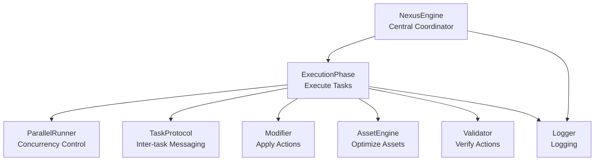
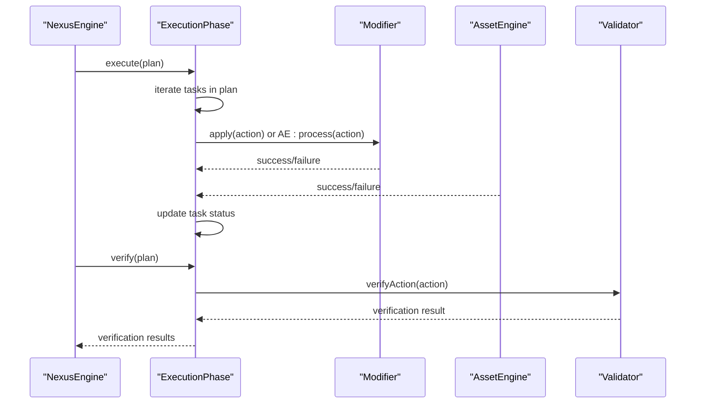
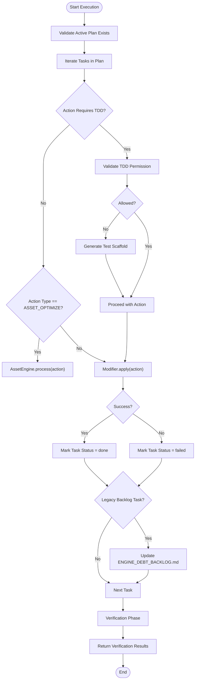
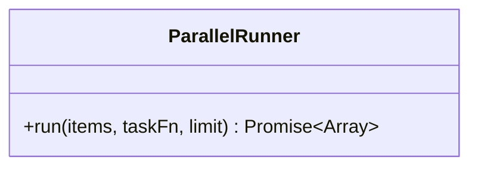
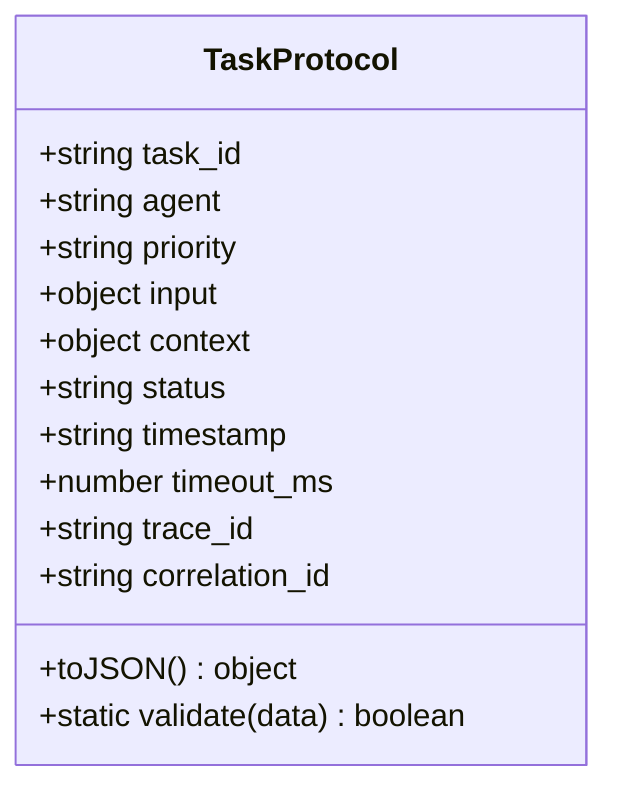
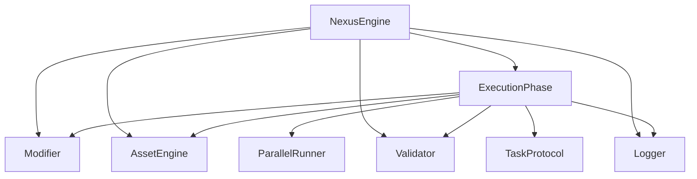

# Execution Phase

<cite>
**Referenced Files in This Document**
- [ExecutionPhase.js](file://agent/core/phases/ExecutionPhase.js)
- [ParallelRunner.js](file://agent/core/ParallelRunner.js)
- [TaskProtocol.js](file://agent/core/TaskProtocol.js)
- [BasePhase.js](file://agent/core/phases/BasePhase.js)
- [NexusEngine.js](file://agent/core/NexusEngine.js)
- [execution-workflow.md](file://agent/workflows/internal/execution-workflow.md)
- [executing-plans.yaml](file://memory/references/amplifier-bundle-superpowers-main/recipes/executing-plans.yaml)
</cite>

## Table of Contents
1. [Introduction](#introduction)
2. [Project Structure](#project-structure)
3. [Core Components](#core-components)
4. [Architecture Overview](#architecture-overview)
5. [Detailed Component Analysis](#detailed-component-analysis)
6. [Dependency Analysis](#dependency-analysis)
7. [Performance Considerations](#performance-considerations)
8. [Troubleshooting Guide](#troubleshooting-guide)
9. [Conclusion](#conclusion)

## Introduction
The Execution Phase is the third stage in the NEXUS AI agent pipeline, responsible for transforming approved plans into concrete actions against the filesystem and runtime environment. It coordinates task execution, enforces TDD safeguards, applies asset optimizations, validates outcomes, and performs post-execution cleanup and stability checks. This document explains how the Execution Phase orchestrates coordinated task implementation, integrates with ParallelRunner for concurrency, and leverages TaskProtocol for inter-task communication and tracing. It also covers execution scheduling, progress tracking, load balancing, fault tolerance, and completion handling.

## Project Structure
The Execution Phase is implemented as a dedicated phase class within the core phases module and collaborates with several engine components and utilities:
- ExecutionPhase: Core execution logic and verification
- ParallelRunner: Concurrency controller for parallel task execution
- TaskProtocol: Inter-task messaging and tracing contract
- BasePhase: Shared phase lifecycle and logging
- NexusEngine: Central coordinator that invokes ExecutionPhase and manages subsystems

**Diagram sources**
- [NexusEngine.js:322-332](file://agent/core/NexusEngine.js#L322-L332)
- [ExecutionPhase.js:9-106](file://agent/core/phases/ExecutionPhase.js#L9-L106)
- [ParallelRunner.js:6-36](file://agent/core/ParallelRunner.js#L6-L36)
- [TaskProtocol.js:3-15](file://agent/core/TaskProtocol.js#L3-L15)

**Section sources**
- [ExecutionPhase.js:9-106](file://agent/core/phases/ExecutionPhase.js#L9-L106)
- [NexusEngine.js:322-332](file://agent/core/NexusEngine.js#L322-L332)

## Core Components
- ExecutionPhase: Executes tasks from the current plan, applies TDD enforcement, asset optimization, and modifier actions, updates task statuses, and supports verification and cleanup.
- ParallelRunner: Runs tasks in parallel with a configurable concurrency limit, collecting results and handling errors gracefully without failing the entire batch.
- TaskProtocol: Defines a standardized task envelope with identifiers, priority, input/context, status, timestamps, trace IDs, and validation rules for inter-agent communication.
- BasePhase: Provides shared logging and lifecycle hooks used by ExecutionPhase.
- NexusEngine: Coordinates the pipeline, initializes subsystems, and delegates execution to ExecutionPhase.

Key responsibilities:
- Task distribution: Iterates over plan tasks and executes them sequentially within the phase.
- Resource coordination: Uses modifier and asset engine to apply actions and optimize assets.
- Progress tracking: Updates task status to "done" or "failed" and logs outcomes.
- Verification: Validates executed actions and aggregates results.
- Cleanup and stability: Removes legacy artifacts, auto-wires frontend components, migrates databases, and verifies service health.

**Section sources**
- [ExecutionPhase.js:9-145](file://agent/core/phases/ExecutionPhase.js#L9-L145)
- [ParallelRunner.js:6-36](file://agent/core/ParallelRunner.js#L6-L36)
- [TaskProtocol.js:3-51](file://agent/core/TaskProtocol.js#L3-L51)
- [BasePhase.js:6-25](file://agent/core/phases/BasePhase.js#L6-L25)
- [NexusEngine.js:111-134](file://agent/core/NexusEngine.js#L111-L134)

## Architecture Overview
The Execution Phase participates in the broader Nexus Engine orchestration cycle. After planning and implementation, the engine delegates execution to ExecutionPhase, which then applies actions, validates outcomes, and performs post-execution cleanup and stability checks.

**Diagram sources**
- [NexusEngine.js:372-383](file://agent/core/NexusEngine.js#L372-L383)
- [ExecutionPhase.js:10-145](file://agent/core/phases/ExecutionPhase.js#L10-L145)

## Detailed Component Analysis

### ExecutionPhase
ExecutionPhase transforms plan tasks into physical changes and validations. It enforces TDD for file-modification actions, applies asset optimizations, and updates task statuses. It also supports verification and a comprehensive cleanup-and-stability routine.

Key behaviors:
- TDD Enforcement: For file-replace and file-append actions, it validates whether modifications are permitted and scaffolds tests if needed.
- Asset Optimization: Applies asset optimization via AssetEngine for ASSET_OPTIMIZE actions.
- Action Application: Uses Modifier to apply other actions; updates task status accordingly.
- Legacy Backlog Update: Supports updating a project debt backlog file for specific task descriptions.
- Verification: Verifies executed actions and marks tasks as failed_verification if checks fail.
- Cleanup and Stability: Removes legacy templates and unused components, auto-wires frontend components, migrates databases, and runs smoke tests and stability loops with self-healing.

**Diagram sources**
- [ExecutionPhase.js:10-145](file://agent/core/phases/ExecutionPhase.js#L10-L145)

**Section sources**
- [ExecutionPhase.js:10-145](file://agent/core/phases/ExecutionPhase.js#L10-L145)

### ParallelRunner
ParallelRunner controls concurrency for parallelizable operations. It runs a set of tasks with a bounded concurrency limit, collects results, and continues despite individual task failures to maximize throughput.

Implementation highlights:
- Concurrency Limit: Configurable limit (default 3) balances SSD throughput and AI execution.
- Worker Pool: Creates a fixed number of workers to process items concurrently.
- Error Isolation: Captures errors per task and marks them with severity without failing the entire batch.
- Deterministic Ordering: Maintains original index ordering in results array.

**Diagram sources**
- [ParallelRunner.js:6-36](file://agent/core/ParallelRunner.js#L6-L36)

**Section sources**
- [ParallelRunner.js:6-36](file://agent/core/ParallelRunner.js#L6-L36)

### TaskProtocol
TaskProtocol defines a standardized envelope for tasks across agents and systems. It ensures consistent identification, priority, context, and tracing for inter-task communication.

Key fields and validation:
- Fields: task_id, agent, priority, input, context, status, timestamp, timeout_ms, trace_id, correlation_id
- Validation: Ensures required fields exist and that priority/status values are valid
- Serialization: Converts to JSON for transport and persistence

**Diagram sources**
- [TaskProtocol.js:3-51](file://agent/core/TaskProtocol.js#L3-L51)

**Section sources**
- [TaskProtocol.js:3-51](file://agent/core/TaskProtocol.js#L3-L51)

### BasePhase
BasePhase provides shared infrastructure for all phases, including logging and error handling hooks. ExecutionPhase inherits from BasePhase to reuse logging and lifecycle utilities.

**Section sources**
- [BasePhase.js:6-25](file://agent/core/phases/BasePhase.js#L6-L25)

### NexusEngine Integration
NexusEngine initializes ExecutionPhase alongside other phases and subsystems. It delegates execution to ExecutionPhase and coordinates subsequent verification and cleanup steps.

**Section sources**
- [NexusEngine.js:111-134](file://agent/core/NexusEngine.js#L111-L134)
- [NexusEngine.js:322-332](file://agent/core/NexusEngine.js#L322-L332)

## Dependency Analysis
ExecutionPhase depends on several subsystems for action application, validation, and environment management. ParallelRunner and TaskProtocol are integrated conceptually for parallel execution and inter-task communication, respectively.

**Diagram sources**
- [ExecutionPhase.js:9-106](file://agent/core/phases/ExecutionPhase.js#L9-L106)
- [ParallelRunner.js:6-36](file://agent/core/ParallelRunner.js#L6-L36)
- [TaskProtocol.js:3-15](file://agent/core/TaskProtocol.js#L3-L15)
- [NexusEngine.js:96-126](file://agent/core/NexusEngine.js#L96-L126)

**Section sources**
- [ExecutionPhase.js:9-106](file://agent/core/phases/ExecutionPhase.js#L9-L106)
- [ParallelRunner.js:6-36](file://agent/core/ParallelRunner.js#L6-L36)
- [TaskProtocol.js:3-15](file://agent/core/TaskProtocol.js#L3-L15)
- [NexusEngine.js:96-126](file://agent/core/NexusEngine.js#L96-L126)

## Performance Considerations
- Concurrency Control: Use ParallelRunner to bound concurrent operations and avoid overwhelming I/O or AI services. Tune the limit based on hardware capabilities and workload characteristics.
- Error Resilience: ParallelRunner isolates task failures to prevent cascading failures; ensure downstream logic handles partial results appropriately.
- I/O Bound Operations: Prefer asynchronous file operations and avoid blocking calls to maintain responsiveness.
- Resource Monitoring: Integrate with NexusEngine’s resource monitor to adjust concurrency dynamically under load.

[No sources needed since this section provides general guidance]

## Troubleshooting Guide
Common issues and remedies during execution:
- TDD Block: When TDD validation denies a file modification, the system generates a test scaffold. Review scaffolding reasons and adjust permissions or requirements.
- Asset Optimization Failures: Verify asset engine inputs and dependencies; re-run optimization after resolving configuration issues.
- Action Application Errors: Inspect modifier application logs and task status updates to identify failing actions.
- Verification Failures: Address validation messages and rerun verification after fixing issues.
- Cleanup and Stability Checks:
  - Legacy artifact removal: Ensure blueprint-defined allowed components/models are respected to avoid unintended deletions.
  - Database migration: If migrations fail, attempt the nuclear reset procedure and review logs for conflicts.
  - Smoke and stability loops: Investigate service readiness timeouts; confirm ports are available and services start without exceptions.

**Section sources**
- [ExecutionPhase.js:31-57](file://agent/core/phases/ExecutionPhase.js#L31-L57)
- [ExecutionPhase.js:147-480](file://agent/core/phases/ExecutionPhase.js#L147-L480)

## Conclusion
The Execution Phase is the operational backbone of the NEXUS AI agent pipeline, transforming plans into tangible outcomes while enforcing quality gates, optimizing assets, and ensuring system stability. By leveraging ParallelRunner for controlled concurrency and TaskProtocol for standardized inter-task communication, it achieves reliable, scalable, and observable task execution. The phase’s verification and cleanup routines further guarantee correctness and maintainability of generated applications.