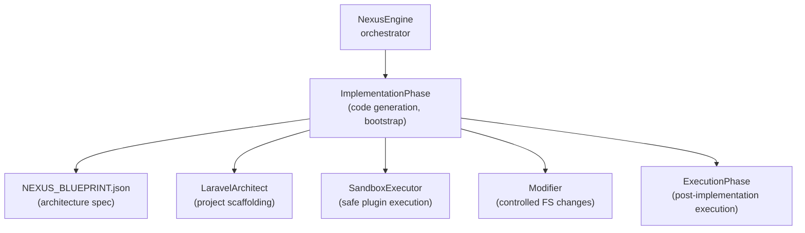
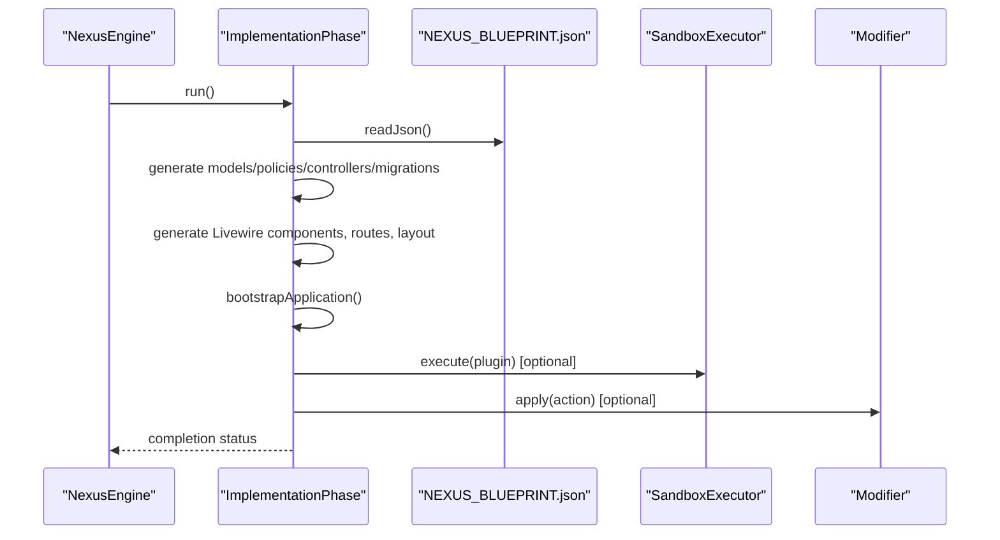
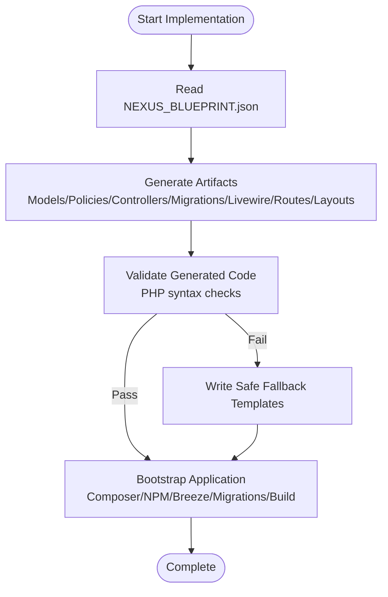
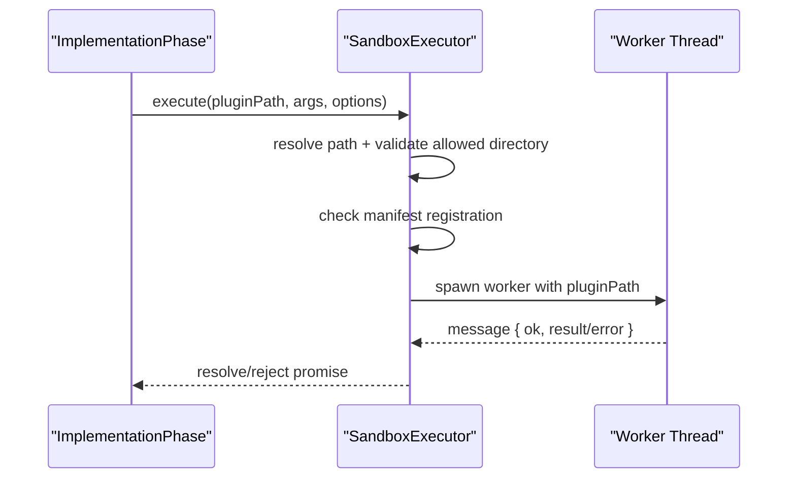
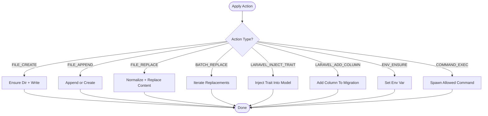
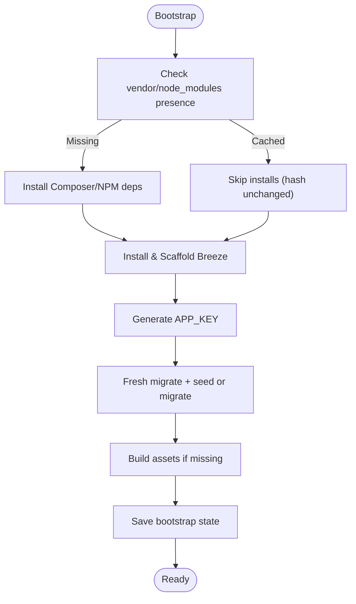
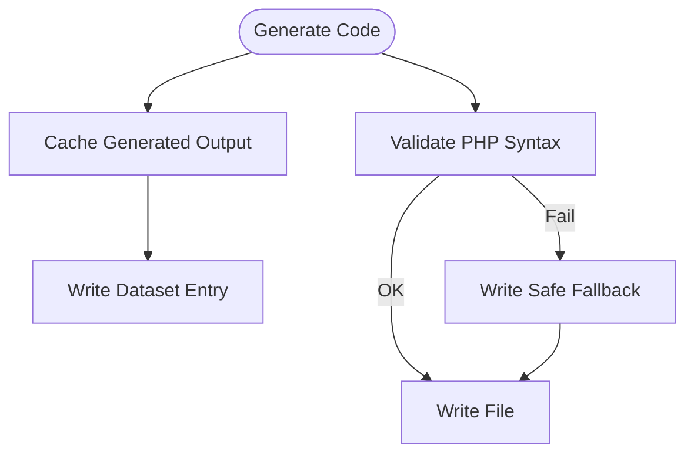
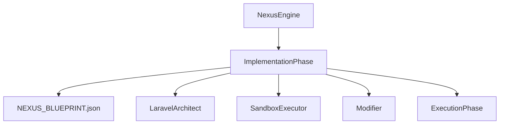

# Implementation Phase

<cite>
**Referenced Files in This Document**
- [ImplementationPhase.js](file://agent/core/phases/ImplementationPhase.js)
- [BasePhase.js](file://agent/core/phases/BasePhase.js)
- [NexusEngine.js](file://agent/core/NexusEngine.js)
- [SandboxExecutor.js](file://agent/core/SandboxExecutor.js)
- [Modifier.js](file://agent/core/Modifier.js)
- [LaravelArchitect.js](file://agent/core/LaravelArchitect.js)
- [ExecutionPhase.js](file://agent/core/phases/ExecutionPhase.js)
- [NEXUS_BLUEPRINT.json](file://NEXUS_BLUEPRINT.json)
- [laravel_database_rules.md](file://memory/distilled/laravel_database_rules.md)
- [NEXUS_SANDBOX_Review.md](file://memory/distilled/tdd/NEXUS_SANDBOX_Review.md)
- [NEXUS_HYBRID_CORE_ROADMAP.md](file://memory/distilled/tdd/NEXUS_HYBRID_CORE_ROADMAP.md)
</cite>

## Table of Contents
1. [Introduction](#introduction)
2. [Project Structure](#project-structure)
3. [Core Components](#core-components)
4. [Architecture Overview](#architecture-overview)
5. [Detailed Component Analysis](#detailed-component-analysis)
6. [Dependency Analysis](#dependency-analysis)
7. [Performance Considerations](#performance-considerations)
8. [Troubleshooting Guide](#troubleshooting-guide)
9. [Conclusion](#conclusion)

## Introduction
The Implementation Phase is the third stage in the NEXUS AI agent lifecycle. Its primary responsibility is to realize the planned architecture by generating code artifacts, bootstrapping the application environment, and integrating with system change mechanisms. It transforms the blueprint produced by earlier phases into a working Laravel TALL stack application, ensuring code quality, validating syntax, and preparing the system for execution and verification.

## Project Structure
The Implementation Phase is implemented as a dedicated phase class that orchestrates code generation, validation, and environment bootstrapping. It collaborates with supporting components such as the sandbox executor for safe plugin execution and the modifier for controlled system changes.

**Diagram sources**
- [NexusEngine.js:318-320](file://agent/core/NexusEngine.js#L318-L320)
- [ImplementationPhase.js:7-67](file://agent/core/phases/ImplementationPhase.js#L7-L67)
- [LaravelArchitect.js](file://agent/core/LaravelArchitect.js)
- [SandboxExecutor.js:1-80](file://agent/core/SandboxExecutor.js#L1-L80)
- [Modifier.js:1-230](file://agent/core/Modifier.js#L1-L230)
- [ExecutionPhase.js](file://agent/core/phases/ExecutionPhase.js)

**Section sources**
- [NexusEngine.js:318-320](file://agent/core/NexusEngine.js#L318-L320)
- [ImplementationPhase.js:7-67](file://agent/core/phases/ImplementationPhase.js#L7-L67)

## Core Components
- ImplementationPhase: Generates models, policies, controllers, migrations, Livewire components, routes, and layouts; bootstraps dependencies and database; validates generated code; and writes fallbacks on failure.
- BasePhase: Provides logging and error handling infrastructure for all phases.
- SandboxExecutor: Executes trusted plugins within a secure sandbox with path validation and timeouts.
- Modifier: Applies atomic, controlled file system changes with safety checks and whitelisted commands.
- LaravelArchitect: Assists in project scaffolding aligned with the blueprint.
- ExecutionPhase: Runs post-implementation verification and execution steps.

**Section sources**
- [ImplementationPhase.js:7-67](file://agent/core/phases/ImplementationPhase.js#L7-L67)
- [BasePhase.js:1-28](file://agent/core/phases/BasePhase.js#L1-L28)
- [SandboxExecutor.js:1-80](file://agent/core/SandboxExecutor.js#L1-L80)
- [Modifier.js:1-230](file://agent/core/Modifier.js#L1-L230)
- [LaravelArchitect.js](file://agent/core/LaravelArchitect.js)
- [ExecutionPhase.js](file://agent/core/phases/ExecutionPhase.js)

## Architecture Overview
The Implementation Phase operates after blueprint creation and planning. It reads the blueprint to drive deterministic generation of Laravel artifacts, then bootstraps the environment and applies safety validations. It integrates with the sandbox executor for plugin-based scans and with the modifier for controlled system changes.

**Diagram sources**
- [NexusEngine.js:318-320](file://agent/core/NexusEngine.js#L318-L320)
- [ImplementationPhase.js:7-67](file://agent/core/phases/ImplementationPhase.js#L7-L67)
- [SandboxExecutor.js:16-76](file://agent/core/SandboxExecutor.js#L16-L76)
- [Modifier.js:17-56](file://agent/core/Modifier.js#L17-L56)

## Detailed Component Analysis

### ImplementationPhase: Code Generation and Bootstrap
Responsibilities:
- Reads NEXUS_BLUEPRINT.json to drive deterministic artifact generation.
- Generates Laravel models, policies, API controllers, migrations, Livewire components, routes, and Blade layouts.
- Bootstraps the application by managing Composer and NPM dependencies, Laravel Breeze scaffolding, key generation, database migration and seeding, and asset compilation.
- Validates generated PHP code for syntax correctness and writes safe fallbacks when generation fails.
- Implements caching for generated code and dataset collection for downstream fine-tuning.

Key workflows:
- Code synthesis: Uses a local AI interface to generate code from structured prompts tailored to Laravel conventions and project schema.
- Validation: Executes PHP syntax checks for generated files; falls back to safe templates when validation fails.
- Integration: Writes files to conventional Laravel locations and ensures proper imports and namespaces.

Examples of generation patterns:
- Model generation with UUID primary keys, soft deletes, and explicit trait usage.
- Migration generation with UUID primary keys, constrained foreign keys, timestamps, and soft deletes.
- Livewire component generation with Blade views and Tailwind styling.
- API controller generation with resourceful actions and schema-driven validation.

Deployment strategies:
- Dependency caching: Skips Composer and NPM installs if lock hashes indicate no changes.
- Database reset: Ensures SQLite database exists and performs a clean migration before bootstrapping.
- Build pipeline: Compiles assets only when necessary.

**Diagram sources**
- [ImplementationPhase.js:20-67](file://agent/core/phases/ImplementationPhase.js#L20-L67)
- [ImplementationPhase.js:362-450](file://agent/core/phases/ImplementationPhase.js#L362-L450)
- [ImplementationPhase.js:456-647](file://agent/core/phases/ImplementationPhase.js#L456-L647)
- [ImplementationPhase.js:649-715](file://agent/core/phases/ImplementationPhase.js#L649-L715)
- [ImplementationPhase.js:717-771](file://agent/core/phases/ImplementationPhase.js#L717-L771)
- [ImplementationPhase.js:773-827](file://agent/core/phases/ImplementationPhase.js#L773-L827)
- [ImplementationPhase.js:1049-1067](file://agent/core/phases/ImplementationPhase.js#L1049-L1067)
- [ImplementationPhase.js:69-250](file://agent/core/phases/ImplementationPhase.js#L69-L250)

**Section sources**
- [ImplementationPhase.js:20-67](file://agent/core/phases/ImplementationPhase.js#L20-L67)
- [ImplementationPhase.js:362-450](file://agent/core/phases/ImplementationPhase.js#L362-L450)
- [ImplementationPhase.js:456-647](file://agent/core/phases/ImplementationPhase.js#L456-L647)
- [ImplementationPhase.js:649-715](file://agent/core/phases/ImplementationPhase.js#L649-L715)
- [ImplementationPhase.js:717-771](file://agent/core/phases/ImplementationPhase.js#L717-L771)
- [ImplementationPhase.js:773-827](file://agent/core/phases/ImplementationPhase.js#L773-L827)
- [ImplementationPhase.js:1049-1067](file://agent/core/phases/ImplementationPhase.js#L1049-L1067)
- [ImplementationPhase.js:69-250](file://agent/core/phases/ImplementationPhase.js#L69-L250)

### SandboxExecutor: Safe Plugin Execution
Responsibilities:
- Enforces path traversal protection by resolving plugin paths and verifying they reside under an allowed directory.
- Validates plugin registration against a manifest to ensure only approved plugins are executed.
- Spawns worker threads with configurable timeouts to prevent hanging executions.
- Emits structured messages with success/failure semantics.

Integration with Implementation Phase:
- Used to execute trusted scanning or analysis plugins during implementation tasks when required.

**Diagram sources**
- [SandboxExecutor.js:16-76](file://agent/core/SandboxExecutor.js#L16-L76)
- [ImplementationPhase.js:7-67](file://agent/core/phases/ImplementationPhase.js#L7-L67)

**Section sources**
- [SandboxExecutor.js:1-80](file://agent/core/SandboxExecutor.js#L1-L80)

### Modifier: Controlled System Changes
Responsibilities:
- Applies atomic file operations with strict safety checks:
  - FILE_CREATE, FILE_APPEND, FILE_REPLACE, BATCH_REPLACE
  - LARAVEL_INJECT_TRAIT, LARAVEL_ADD_COLUMN
  - ENV_ENSURE for environment variables
  - COMMAND_EXEC with a whitelist of allowed commands
- Prevents writing outside the project root and enforces normalized content matching for replacements.

Integration with Implementation Phase:
- Used to apply targeted changes to generated files or environment configuration when needed.

**Diagram sources**
- [Modifier.js:17-56](file://agent/core/Modifier.js#L17-L56)
- [Modifier.js:98-116](file://agent/core/Modifier.js#L98-L116)
- [Modifier.js:177-193](file://agent/core/Modifier.js#L177-L193)
- [Modifier.js:195-210](file://agent/core/Modifier.js#L195-L210)
- [Modifier.js:212-226](file://agent/core/Modifier.js#L212-L226)

**Section sources**
- [Modifier.js:1-230](file://agent/core/Modifier.js#L1-L230)

### Bootstrap Pipeline Details
Highlights:
- Dependency caching: Computes MD5 hash of composer.lock and package-lock.json to skip redundant installs.
- SQLite preparation: Ensures database.sqlite exists when DB_CONNECTION=sqlite.
- Breeze scaffolding: Installs and scaffolds Laravel Breeze if not present.
- Migration strategy: Attempts migrate:fresh with seed; falls back to migrate on failure.
- Asset build: Runs npm run build only when manifest is missing.

**Diagram sources**
- [ImplementationPhase.js:69-250](file://agent/core/phases/ImplementationPhase.js#L69-L250)

**Section sources**
- [ImplementationPhase.js:69-250](file://agent/core/phases/ImplementationPhase.js#L69-L250)

### Code Quality Assurance and Fallbacks
Quality controls:
- Template cache: Stores generated code and dataset entries keyed by prompt+taskType hash.
- Syntax validation: Uses php -l for generated PHP files; writes safe fallbacks on failure.
- Strict templates: Policies and controllers use rigid prompt templates to avoid hallucinations.
- Safe fallbacks: Provides minimal valid PHP templates for models, migrations, routes, factories, seeders, and controllers.

**Diagram sources**
- [ImplementationPhase.js:252-291](file://agent/core/phases/ImplementationPhase.js#L252-L291)
- [ImplementationPhase.js:349-360](file://agent/core/phases/ImplementationPhase.js#L349-L360)
- [ImplementationPhase.js:452-454](file://agent/core/phases/ImplementationPhase.js#L452-L454)
- [ImplementationPhase.js:1027-1048](file://agent/core/phases/ImplementationPhase.js#L1027-L1048)

**Section sources**
- [ImplementationPhase.js:252-291](file://agent/core/phases/ImplementationPhase.js#L252-L291)
- [ImplementationPhase.js:349-360](file://agent/core/phases/ImplementationPhase.js#L349-L360)
- [ImplementationPhase.js:452-454](file://agent/core/phases/ImplementationPhase.js#L452-L454)
- [ImplementationPhase.js:1027-1048](file://agent/core/phases/ImplementationPhase.js#L1027-L1048)

### Integration with SandboxExecutor and Modifier
- SandboxExecutor is used to execute trusted plugins safely, enforcing allowed directories and manifests.
- Modifier is used for controlled, atomic changes to the filesystem and environment, with whitelisted commands and strict path checks.

**Section sources**
- [SandboxExecutor.js:16-76](file://agent/core/SandboxExecutor.js#L16-L76)
- [Modifier.js:17-56](file://agent/core/Modifier.js#L17-L56)

### Examples of Implementation Scenarios
- Generating a complete Laravel model with UUID primary key, soft deletes, and explicit traits.
- Creating a database migration with constrained foreign keys, timestamps, and soft deletes.
- Building Livewire components with Blade views and Tailwind styling.
- Writing API controllers with resourceful actions and schema-driven validation.
- Bootstrapping the application with Composer, NPM, Breeze, migrations, and asset builds.

**Section sources**
- [ImplementationPhase.js:362-450](file://agent/core/phases/ImplementationPhase.js#L362-L450)
- [ImplementationPhase.js:456-647](file://agent/core/phases/ImplementationPhase.js#L456-L647)
- [ImplementationPhase.js:649-715](file://agent/core/phases/ImplementationPhase.js#L649-L715)
- [ImplementationPhase.js:717-771](file://agent/core/phases/ImplementationPhase.js#L717-L771)
- [ImplementationPhase.js:773-827](file://agent/core/phases/ImplementationPhase.js#L773-L827)

## Dependency Analysis
The Implementation Phase depends on:
- NexusEngine for orchestration and shared utilities.
- Blueprint for deterministic artifact generation.
- LaravelArchitect for scaffolding.
- SandboxExecutor for safe plugin execution.
- Modifier for controlled system changes.

**Diagram sources**
- [NexusEngine.js:318-320](file://agent/core/NexusEngine.js#L318-L320)
- [ImplementationPhase.js:7-67](file://agent/core/phases/ImplementationPhase.js#L7-L67)

**Section sources**
- [NexusEngine.js:318-320](file://agent/core/NexusEngine.js#L318-L320)
- [ImplementationPhase.js:7-67](file://agent/core/phases/ImplementationPhase.js#L7-L67)

## Performance Considerations
- Dependency caching reduces repeated installations by comparing lockfile hashes.
- Asynchronous operations minimize blocking I/O.
- Command timeouts prevent indefinite waits during plugin execution or system commands.
- Asset builds are skipped when manifests exist to avoid redundant work.

**Section sources**
- [ImplementationPhase.js:69-250](file://agent/core/phases/ImplementationPhase.js#L69-L250)
- [SandboxExecutor.js:16-76](file://agent/core/SandboxExecutor.js#L16-L76)
- [NEXUS_HYBRID_CORE_ROADMAP.md:32-50](file://memory/distilled/tdd/NEXUS_HYBRID_CORE_ROADMAP.md#L32-L50)

## Troubleshooting Guide
Common issues and mitigations:
- Missing blueprint: The phase skips implementation if NEXUS_BLUEPRINT.json is absent.
- Syntax errors in generated code: Automatically writes safe fallback templates.
- Bootstrap failures: Attempts migrate fallback and continues with warnings.
- Sandbox path violations: Enforces allowed directories and manifest checks.
- Modifier security violations: Prevents writes outside the project root and validates action types.

**Section sources**
- [ImplementationPhase.js:15-18](file://agent/core/phases/ImplementationPhase.js#L15-L18)
- [ImplementationPhase.js:349-360](file://agent/core/phases/ImplementationPhase.js#L349-L360)
- [ImplementationPhase.js:202-208](file://agent/core/phases/ImplementationPhase.js#L202-L208)
- [SandboxExecutor.js:21-43](file://agent/core/SandboxExecutor.js#L21-L43)
- [Modifier.js:22-25](file://agent/core/Modifier.js#L22-L25)

## Conclusion
The Implementation Phase transforms the NEXUS blueprint into a functional Laravel application by generating and validating code artifacts, bootstrapping the environment, and applying controlled system changes. It emphasizes safety through sandboxed plugin execution, strict validation, and fallback templates, while optimizing performance via dependency caching and selective rebuilds. Together with the Execution Phase, it ensures reliable realization and verification of the designed system.