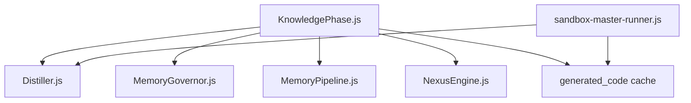
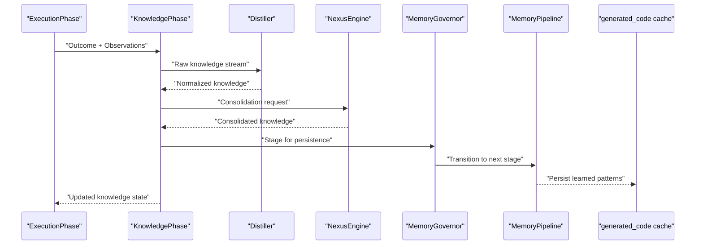
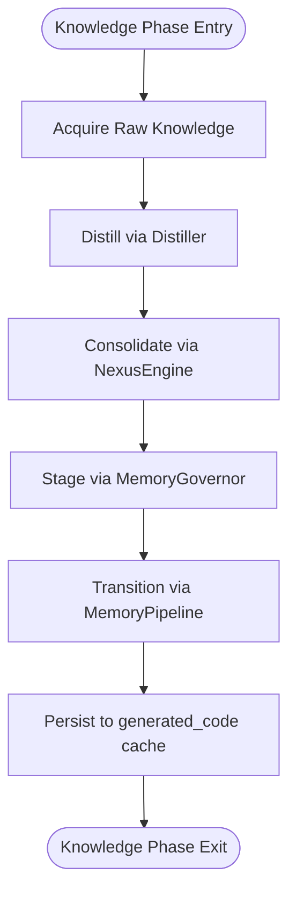
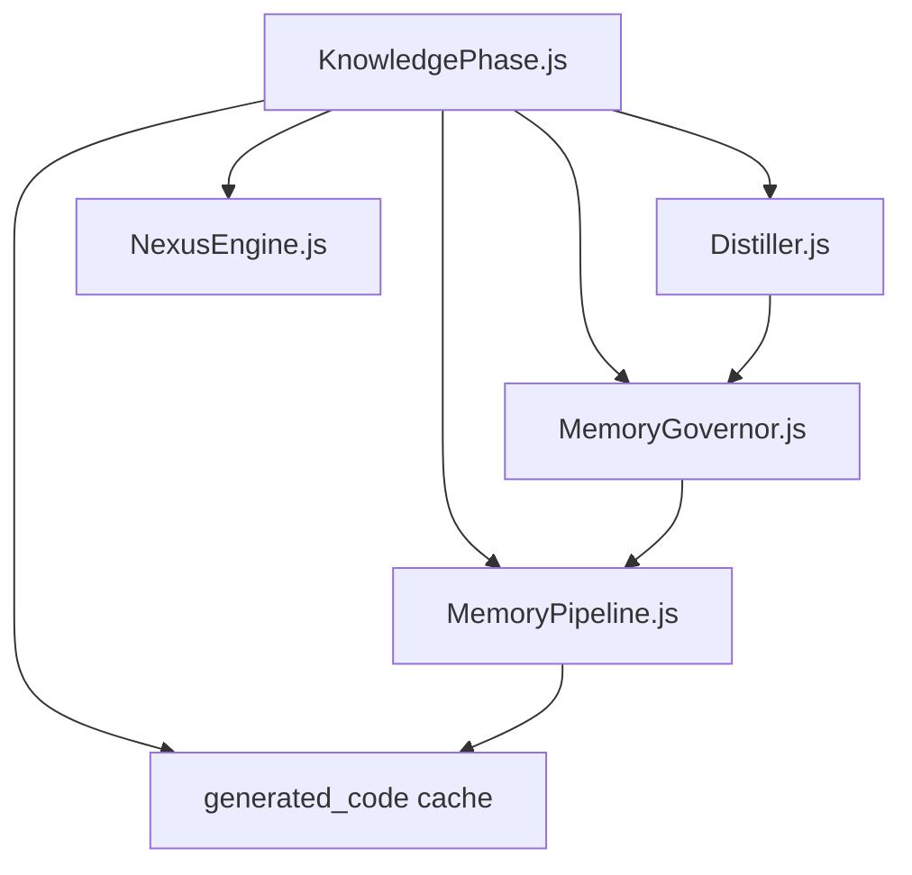

# Knowledge Phase

<cite>
**Referenced Files in This Document**
- [KnowledgePhase.js](file://agent/core/phases/KnowledgePhase.js)
- [Distiller.js](file://agent/core/Distiller.js)
- [NexusEngine.js](file://agent/core/NexusEngine.js)
- [MemoryGovernor.js](file://agent/core/MemoryGovernor.js)
- [MemoryPipeline.js](file://agent/core/MemoryPipeline.js)
- [generated_code cache](file://agent/memory/cache/generated_code/)
- [sandbox-master-runner.js](file://tests/TDD/sandbox-master-runner.js)
- [nexus-engine.test.js](file://tests/TDD/nexus-engine.test.js)
</cite>

## Table of Contents
1. [Introduction](#introduction)
2. [Project Structure](#project-structure)
3. [Core Components](#core-components)
4. [Architecture Overview](#architecture-overview)
5. [Detailed Component Analysis](#detailed-component-analysis)
6. [Dependency Analysis](#dependency-analysis)
7. [Performance Considerations](#performance-considerations)
8. [Troubleshooting Guide](#troubleshooting-guide)
9. [Conclusion](#conclusion)

## Introduction
The Knowledge Phase is a central component of the NEXUS AI agent system responsible for learning, adaptation, and knowledge consolidation. It orchestrates the ingestion and refinement of newly acquired insights, transforming raw observations and outcomes into structured, reusable knowledge. The phase integrates tightly with the Distiller for knowledge processing and leverages the generated_code cache to persist learned patterns. It also coordinates with the NexusEngine for knowledge consolidation and conflict resolution, and with MemoryGovernor and MemoryPipeline for memory lifecycle management.

Key responsibilities include:
- Learning from execution outcomes and environmental feedback
- Adapting behavior via skill evolution and pattern extraction
- Consolidating knowledge to reduce redundancy and resolve conflicts
- Persisting and retrieving learned patterns for reuse

## Project Structure
The Knowledge Phase resides within the core phases module and collaborates with several core systems:
- KnowledgePhase.js: Implements the Knowledge Phase logic
- Distiller.js: Processes and normalizes knowledge streams
- NexusEngine.js: Provides consolidation and collision resolution utilities
- MemoryGovernor.js and MemoryPipeline.js: Manage memory stages and persistence
- generated_code cache: Stores learned patterns for retrieval and reuse
- sandbox-master-runner.js: Demonstrates distillation and cache behavior in tests

**Diagram sources**
- [KnowledgePhase.js](file://agent/core/phases/KnowledgePhase.js)
- [Distiller.js](file://agent/core/Distiller.js)
- [MemoryGovernor.js](file://agent/core/MemoryGovernor.js)
- [MemoryPipeline.js](file://agent/core/MemoryPipeline.js)
- [NexusEngine.js](file://agent/core/NexusEngine.js)
- [generated_code cache](file://agent/memory/cache/generated_code/)
- [sandbox-master-runner.js](file://tests/TDD/sandbox-master-runner.js)

**Section sources**
- [KnowledgePhase.js](file://agent/core/phases/KnowledgePhase.js)
- [Distiller.js](file://agent/core/Distiller.js)
- [MemoryGovernor.js](file://agent/core/MemoryGovernor.js)
- [MemoryPipeline.js](file://agent/core/MemoryPipeline.js)
- [NexusEngine.js](file://agent/core/NexusEngine.js)
- [generated_code cache](file://agent/memory/cache/generated_code/)
- [sandbox-master-runner.js](file://tests/TDD/sandbox-master-runner.js)

## Core Components
- KnowledgePhase: Coordinates knowledge acquisition, consolidation, and persistence. It interacts with Distiller to normalize and refine knowledge, with NexusEngine for consolidation and collision resolution, and with MemoryGovernor and MemoryPipeline for memory staging and lifecycle.
- Distiller: Transforms raw knowledge into normalized forms suitable for long-term storage and retrieval. It supports distillation workflows and integrates with the Knowledge Phase during consolidation.
- NexusEngine: Provides utilities for wrapping and consolidating knowledge, including conditional wrapping and collision resolution, ensuring coherent knowledge representation.
- MemoryGovernor and MemoryPipeline: Govern memory stages (short-term, operational, normalized, distilled) and manage transitions and persistence, enabling structured knowledge evolution.
- generated_code cache: A persistent cache for learned patterns, enabling fast retrieval and reuse during subsequent iterations.

**Section sources**
- [KnowledgePhase.js](file://agent/core/phases/KnowledgePhase.js)
- [Distiller.js](file://agent/core/Distiller.js)
- [NexusEngine.js](file://agent/core/NexusEngine.js)
- [MemoryGovernor.js](file://agent/core/MemoryGovernor.js)
- [MemoryPipeline.js](file://agent/core/MemoryPipeline.js)
- [generated_code cache](file://agent/memory/cache/generated_code/)

## Architecture Overview
The Knowledge Phase participates in a continuous learning loop:
- Observation and Outcome Capture: Execution outcomes and environmental feedback are captured and prepared for knowledge processing.
- Distillation: The Distiller normalizes and enriches knowledge, preparing it for consolidation.
- Consolidation and Conflict Resolution: The NexusEngine consolidates similar knowledge and resolves collisions to maintain coherence.
- Persistence and Retrieval: Consolidated knowledge is staged through MemoryGovernor and MemoryPipeline, while learned patterns are stored in the generated_code cache for future reuse.

**Diagram sources**
- [KnowledgePhase.js](file://agent/core/phases/KnowledgePhase.js)
- [Distiller.js](file://agent/core/Distiller.js)
- [NexusEngine.js](file://agent/core/NexusEngine.js)
- [MemoryGovernor.js](file://agent/core/MemoryGovernor.js)
- [MemoryPipeline.js](file://agent/core/MemoryPipeline.js)
- [generated_code cache](file://agent/memory/cache/generated_code/)

## Detailed Component Analysis

### Knowledge Acquisition and Distillation
The Knowledge Phase initiates knowledge acquisition by receiving outcomes and observations from the Execution Phase. It forwards raw knowledge to the Distiller, which normalizes and enriches the knowledge stream. This distillation process prepares knowledge for consolidation and ensures consistent representation across domains.

Key steps:
- Receive raw knowledge from execution outcomes
- Normalize and enrich via Distiller
- Prepare for consolidation and persistence

Integration points:
- Distiller normalization aligns knowledge with system standards
- MemoryGovernor and MemoryPipeline stage knowledge for long-term storage

**Section sources**
- [KnowledgePhase.js](file://agent/core/phases/KnowledgePhase.js)
- [Distiller.js](file://agent/core/Distiller.js)
- [MemoryGovernor.js](file://agent/core/MemoryGovernor.js)
- [MemoryPipeline.js](file://agent/core/MemoryPipeline.js)

### Pattern Extraction and Skill Enhancement
Pattern extraction involves identifying recurring structures and successful strategies from distilled knowledge. The Knowledge Phase leverages the generated_code cache to store these patterns, enabling rapid retrieval and application in similar contexts. This mechanism supports skill enhancement by allowing the agent to evolve its capabilities over time.

Mechanisms:
- Extract reusable patterns from distilled knowledge
- Store patterns in generated_code cache
- Retrieve and apply patterns for similar tasks

Evidence:
- Tests demonstrate bootstrap caching behavior, indicating efficient pattern reuse
- Sandbox runner confirms distillation and cache interactions

**Section sources**
- [generated_code cache](file://agent/memory/cache/generated_code/)
- [sandbox-master-runner.js](file://tests/TDD/sandbox-master-runner.js)

### Knowledge Consolidation and Conflict Resolution
The NexusEngine provides consolidation utilities that the Knowledge Phase invokes to merge similar knowledge entries and resolve conflicts. This ensures that the knowledge base remains coherent and free from contradictory information.

Consolidation workflow:
- Identify similar knowledge entries
- Merge entries into consolidated form
- Resolve collisions with conflict resolution strategies
- Maintain logical consistency

Validation:
- Tests verify consolidation and collision resolution behaviors

**Section sources**
- [NexusEngine.js](file://agent/core/NexusEngine.js)
- [nexus-engine.test.js](file://tests/TDD/nexus-engine.test.js)

### Integration with Distiller and Memory Systems
The Knowledge Phase integrates with Distiller for knowledge processing and with MemoryGovernor and MemoryPipeline for memory lifecycle management. This integration ensures that knowledge moves through standardized stages and is persisted appropriately.

**Diagram sources**
- [KnowledgePhase.js](file://agent/core/phases/KnowledgePhase.js)
- [Distiller.js](file://agent/core/Distiller.js)
- [NexusEngine.js](file://agent/core/NexusEngine.js)
- [MemoryGovernor.js](file://agent/core/MemoryGovernor.js)
- [MemoryPipeline.js](file://agent/core/MemoryPipeline.js)
- [generated_code cache](file://agent/memory/cache/generated_code/)

**Section sources**
- [KnowledgePhase.js](file://agent/core/phases/KnowledgePhase.js)
- [Distiller.js](file://agent/core/Distiller.js)
- [NexusEngine.js](file://agent/core/NexusEngine.js)
- [MemoryGovernor.js](file://agent/core/MemoryGovernor.js)
- [MemoryPipeline.js](file://agent/core/MemoryPipeline.js)
- [generated_code cache](file://agent/memory/cache/generated_code/)

### Knowledge Transfer Scenarios and Adaptive Learning
Knowledge transfer occurs when distilled knowledge is applied to new but related tasks. The adaptive learning process leverages the generated_code cache to accelerate learning by reusing previously learned patterns. The Knowledge Phase coordinates this by ensuring that consolidated knowledge is properly staged and persisted.

Scenarios:
- Applying learned patterns to similar tasks
- Evolving skills based on recent outcomes
- Integrating domain-specific knowledge through Distiller

Evidence:
- Bootstrap caching tests illustrate reduced disk work on subsequent transformations
- Sandbox runner demonstrates distillation and cache interactions

**Section sources**
- [sandbox-master-runner.js](file://tests/TDD/sandbox-master-runner.js)
- [generated_code cache](file://agent/memory/cache/generated_code/)

## Dependency Analysis
The Knowledge Phase depends on several core modules for its operation. The following diagram outlines these dependencies and their roles.

**Diagram sources**
- [KnowledgePhase.js](file://agent/core/phases/KnowledgePhase.js)
- [Distiller.js](file://agent/core/Distiller.js)
- [NexusEngine.js](file://agent/core/NexusEngine.js)
- [MemoryGovernor.js](file://agent/core/MemoryGovernor.js)
- [MemoryPipeline.js](file://agent/core/MemoryPipeline.js)
- [generated_code cache](file://agent/memory/cache/generated_code/)

**Section sources**
- [KnowledgePhase.js](file://agent/core/phases/KnowledgePhase.js)
- [Distiller.js](file://agent/core/Distiller.js)
- [NexusEngine.js](file://agent/core/NexusEngine.js)
- [MemoryGovernor.js](file://agent/core/MemoryGovernor.js)
- [MemoryPipeline.js](file://agent/core/MemoryPipeline.js)
- [generated_code cache](file://agent/memory/cache/generated_code/)

## Performance Considerations
- Efficient Distillation: Ensure distillation processes minimize redundant computations and leverage caching where appropriate.
- Generated Code Cache: Utilize the generated_code cache to avoid repeated disk work and accelerate pattern retrieval.
- Memory Staging: Optimize transitions between memory stages to reduce latency and improve throughput.
- Consolidation Strategies: Apply consolidation judiciously to balance coherence with computational overhead.

[No sources needed since this section provides general guidance]

## Troubleshooting Guide
Common issues and resolutions:
- Distillation Failures: Verify that the Distiller receives properly formatted knowledge and that normalization steps succeed.
- Consolidation Errors: Check for conflicts and ensure NexusEngine consolidation logic is invoked correctly.
- Cache Misses: Confirm that the generated_code cache is populated and accessible; validate paths and permissions.
- Memory Pipeline Stalls: Monitor transitions between memory stages and address bottlenecks promptly.

Validation references:
- Consolidation and collision resolution tests provide baseline expectations for knowledge handling.

**Section sources**
- [nexus-engine.test.js](file://tests/TDD/nexus-engine.test.js)

## Conclusion
The Knowledge Phase is integral to the NEXUS AI agent’s ability to learn, adapt, and consolidate knowledge. By integrating with the Distiller, NexusEngine, MemoryGovernor, MemoryPipeline, and the generated_code cache, it ensures that knowledge is processed, consolidated, and persisted effectively. This enables robust knowledge transfer, skill evolution, and adaptive learning, forming the backbone of the agent’s autonomous capabilities.

[No sources needed since this section summarizes without analyzing specific files]