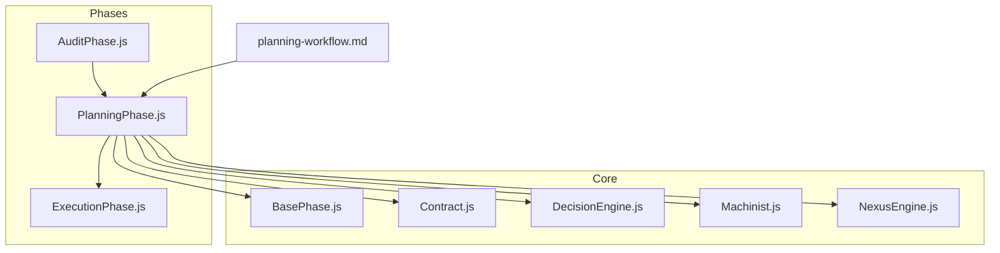
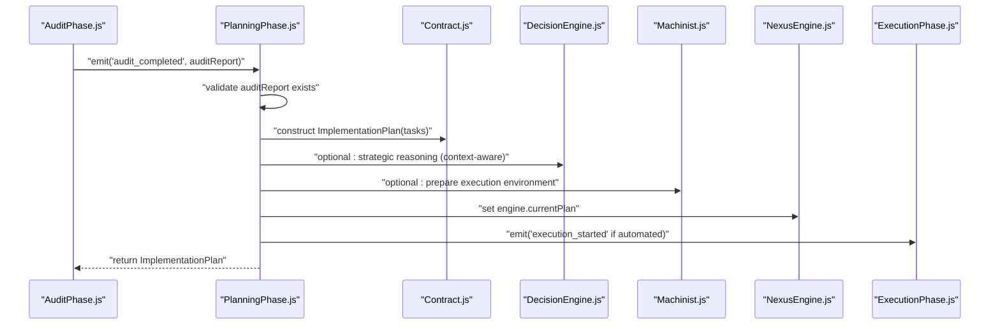
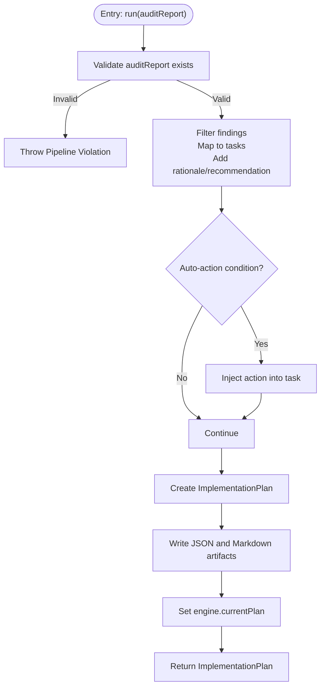
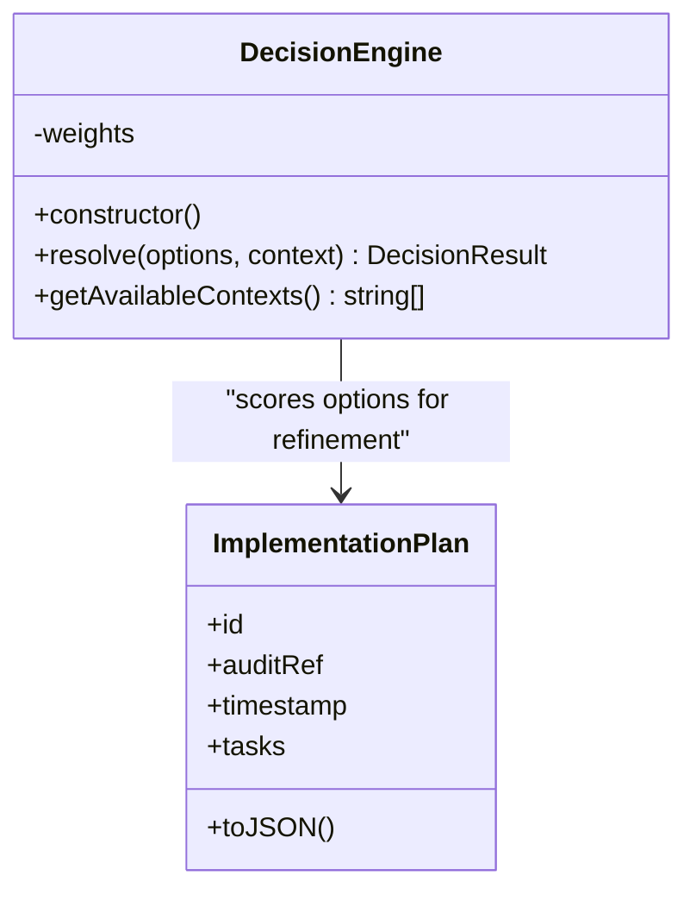
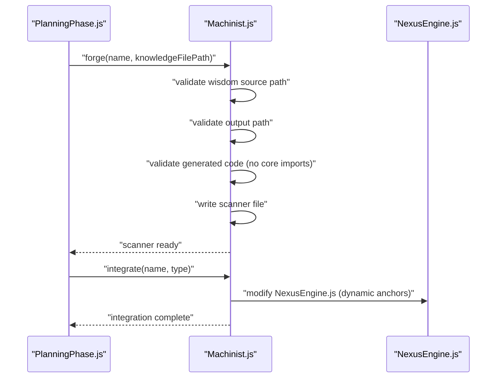
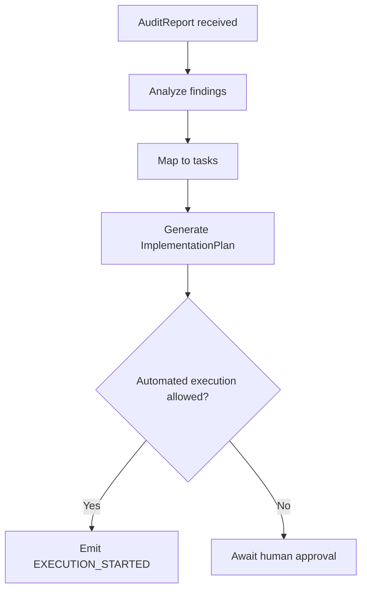
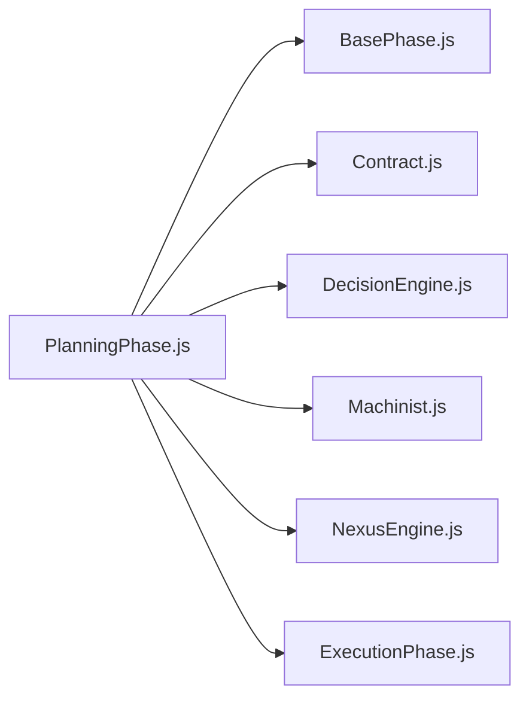

# Planning Phase

<cite>
**Referenced Files in This Document**
- [PlanningPhase.js](file://agent/core/phases/PlanningPhase.js)
- [BasePhase.js](file://agent/core/phases/BasePhase.js)
- [Contract.js](file://agent/core/Contract.js)
- [DecisionEngine.js](file://agent/core/DecisionEngine.js)
- [Machinist.js](file://agent/core/Machinist.js)
- [planning-workflow.md](file://agent/workflows/internal/planning-workflow.md)
- [NexusEngine.js](file://agent/core/NexusEngine.js)
- [ExecutionPhase.js](file://agent/core/phases/ExecutionPhase.js)
- [AuditPhase.js](file://agent/core/phases/AuditPhase.js)
- [session_1778405404788.json](file://memory/operational/session_1778405404788.json)
</cite>

## Table of Contents
1. [Introduction](#introduction)
2. [Project Structure](#project-structure)
3. [Core Components](#core-components)
4. [Architecture Overview](#architecture-overview)
5. [Detailed Component Analysis](#detailed-component-analysis)
6. [Dependency Analysis](#dependency-analysis)
7. [Performance Considerations](#performance-considerations)
8. [Troubleshooting Guide](#troubleshooting-guide)
9. [Conclusion](#conclusion)
10. [Appendices](#appendices)

## Introduction
The Planning Phase is the second stage in the NEXUS AI agent pipeline. Its primary responsibility is to transform an Audit Report into a structured Implementation Plan that guides Execution. The phase:
- Validates the presence of a valid audit report
- Extracts actionable findings and maps them to tasks
- Generates an Implementation Plan with optional auto-actions
- Persists the plan as both JSON and Markdown artifacts
- Integrates with DecisionEngine for strategic reasoning and Machinist for plan execution preparation

This document explains the planning workflow, constraint handling, plan validation, and how the Planning Phase interacts with downstream phases and supporting systems.

## Project Structure
The Planning Phase is implemented as a dedicated phase class and integrates with shared contracts, base phase infrastructure, and orchestration artifacts.

**Diagram sources**
- [PlanningPhase.js:1-73](file://agent/core/phases/PlanningPhase.js#L1-L73)
- [BasePhase.js:1-28](file://agent/core/phases/BasePhase.js#L1-L28)
- [Contract.js:1-73](file://agent/core/Contract.js#L1-L73)
- [DecisionEngine.js:1-73](file://agent/core/DecisionEngine.js#L1-L73)
- [Machinist.js:1-279](file://agent/core/Machinist.js#L1-L279)
- [NexusEngine.js](file://agent/core/NexusEngine.js)
- [AuditPhase.js](file://agent/core/phases/AuditPhase.js)
- [ExecutionPhase.js](file://agent/core/phases/ExecutionPhase.js)
- [planning-workflow.md:1-6](file://agent/workflows/internal/planning-workflow.md#L1-L6)

**Section sources**
- [PlanningPhase.js:1-73](file://agent/core/phases/PlanningPhase.js#L1-L73)
- [planning-workflow.md:1-6](file://agent/workflows/internal/planning-workflow.md#L1-L6)

## Core Components
- PlanningPhase: Orchestrates plan creation from an audit report, generates tasks, applies auto-actions when appropriate, persists artifacts, and sets the current plan in the engine.
- BasePhase: Provides logging, configuration access, and standardized error handling for all phases.
- Contract: Defines data contracts for AuditReport and ImplementationPlan, ensuring deterministic interfaces and validation.
- DecisionEngine: Supplies strategic reasoning via weighted scoring across criteria (security, stability, performance, readability) with context-aware profiles.
- Machinist: Prepares the runtime environment for plan execution by integrating new capabilities and enforcing strict guardrails for safe forging and registration.

Key responsibilities:
- Strategy development: Uses DecisionEngine to prioritize and refine plan components.
- Resource allocation: Maps findings to tasks and optionally injects auto-actions to reduce manual intervention.
- Task decomposition: Transforms audit findings into executable tasks with rationale and recommendations.
- Constraint handling: Enforces guardrails for plan persistence and auto-action generation.
- Plan validation: Ensures the plan adheres to contract requirements and is persisted consistently.

**Section sources**
- [PlanningPhase.js:8-69](file://agent/core/phases/PlanningPhase.js#L8-L69)
- [BasePhase.js:6-25](file://agent/core/phases/BasePhase.js#L6-L25)
- [Contract.js:7-59](file://agent/core/Contract.js#L7-L59)
- [DecisionEngine.js:18-70](file://agent/core/DecisionEngine.js#L18-L70)
- [Machinist.js:30-204](file://agent/core/Machinist.js#L30-L204)

## Architecture Overview
The Planning Phase participates in a deterministic pipeline orchestrated by NexusEngine. It consumes an Audit Report, produces an Implementation Plan, and signals readiness for execution.

**Diagram sources**
- [PlanningPhase.js:9-69](file://agent/core/phases/PlanningPhase.js#L9-L69)
- [Contract.js:35-59](file://agent/core/Contract.js#L35-L59)
- [DecisionEngine.js:29-61](file://agent/core/DecisionEngine.js#L29-L61)
- [Machinist.js:119-157](file://agent/core/Machinist.js#L119-L157)
- [NexusEngine.js](file://agent/core/NexusEngine.js)
- [ExecutionPhase.js](file://agent/core/phases/ExecutionPhase.js)

## Detailed Component Analysis

### PlanningPhase
Responsibilities:
- Accept an audit report (or use the engine’s current audit)
- Filter findings to actionable tasks (exclude INFO noise unless meaningful)
- Construct tasks with rationale and recommendation
- Apply auto-actions when specific conditions are met (e.g., environment configuration)
- Persist plan as JSON and Markdown
- Store plan in engine state for downstream consumption

Processing logic:
- Input validation ensures a valid audit report is present; otherwise, a pipeline violation error is raised.
- Task generation filters findings and enriches each task with rationale and recommendation.
- Auto-action injection augments tasks with executable actions when patterns are recognized.
- Artifacts are written to the planning directory with deterministic filenames.
- The plan is attached to the engine for subsequent phases.

**Diagram sources**
- [PlanningPhase.js:9-69](file://agent/core/phases/PlanningPhase.js#L9-L69)

**Section sources**
- [PlanningPhase.js:8-69](file://agent/core/phases/PlanningPhase.js#L8-L69)

### DecisionEngine Integration
The Planning Phase can leverage DecisionEngine for strategic reasoning:
- Weight profiles define context-specific priorities (e.g., security, stability, performance, readability).
- The resolver computes a final score per option using weighted criteria and selects a winner with margin.
- Context selection enables tailored decision-making aligned with project goals.

**Diagram sources**
- [DecisionEngine.js:18-70](file://agent/core/DecisionEngine.js#L18-L70)
- [Contract.js:35-59](file://agent/core/Contract.js#L35-L59)

**Section sources**
- [DecisionEngine.js:29-61](file://agent/core/DecisionEngine.js#L29-L61)

### Machinist Integration for Execution Preparation
Machinist prepares the runtime environment for plan execution:
- Enforces a strict path whitelist/blacklist to prevent unauthorized writes.
- Validates that generated code avoids importing forbidden core modules.
- Supports dynamic integration of new auditing capabilities into NexusEngine.
- Can scaffold tests for newly forged scanners.

**Diagram sources**
- [Machinist.js:163-204](file://agent/core/Machinist.js#L163-L204)
- [Machinist.js:119-157](file://agent/core/Machinist.js#L119-L157)
- [NexusEngine.js](file://agent/core/NexusEngine.js)

**Section sources**
- [Machinist.js:30-204](file://agent/core/Machinist.js#L30-L204)

### Planning Workflow and Control Flow
The planning workflow defines the high-level steps:
- Analyze the AuditReport
- Map deficiencies to executable actions
- Generate the ImplementationPlan
- Emit an execution trigger when automated execution is allowed

Operational context:
- Sessions correlate cycles, audits, and plans, enabling deterministic traceability across runs.

**Diagram sources**
- [planning-workflow.md:1-6](file://agent/workflows/internal/planning-workflow.md#L1-L6)
- [session_1778405404788.json:1-6](file://memory/operational/session_1778405404788.json#L1-L6)

**Section sources**
- [planning-workflow.md:1-6](file://agent/workflows/internal/planning-workflow.md#L1-L6)
- [session_1778405404788.json:1-6](file://memory/operational/session_1778405404788.json#L1-L6)

## Dependency Analysis
The Planning Phase depends on:
- BasePhase for logging and error handling
- Contract for plan validation and serialization
- DecisionEngine for strategic reasoning
- Machinist for environment preparation
- NexusEngine for state management and integration anchors

**Diagram sources**
- [PlanningPhase.js:1-73](file://agent/core/phases/PlanningPhase.js#L1-L73)
- [BasePhase.js:1-28](file://agent/core/phases/BasePhase.js#L1-L28)
- [Contract.js:1-73](file://agent/core/Contract.js#L1-L73)
- [DecisionEngine.js:1-73](file://agent/core/DecisionEngine.js#L1-L73)
- [Machinist.js:1-279](file://agent/core/Machinist.js#L1-L279)
- [NexusEngine.js](file://agent/core/NexusEngine.js)
- [ExecutionPhase.js](file://agent/core/phases/ExecutionPhase.js)

**Section sources**
- [PlanningPhase.js:1-73](file://agent/core/phases/PlanningPhase.js#L1-L73)

## Performance Considerations
- Task filtering and mapping: The phase filters findings and constructs tasks linearly with respect to the number of findings. Complexity is O(F) for F findings.
- Auto-action injection: Conditional checks are constant-time per finding, adding minimal overhead.
- Artifact persistence: Writing JSON and Markdown is I/O bound; ensure the planning directory is on fast storage for throughput.
- Strategic reasoning: DecisionEngine scoring is O(O × C) per option O, where C is the number of criteria. Keep the number of options reasonable to maintain responsiveness.

[No sources needed since this section provides general guidance]

## Troubleshooting Guide
Common issues and resolutions:
- Pipeline Violation: Planning requires a valid Audit Report. Ensure an audit has completed and is available in the engine before invoking the Planning Phase.
- Missing artifacts: Verify the planning directory exists and is writable; the phase ensures the directory before writing.
- Auto-action not applied: Confirm the finding message matches the condition for auto-action injection.
- Strategic reasoning context: If an unknown context is supplied, the DecisionEngine falls back to default weights and logs a warning.

**Section sources**
- [PlanningPhase.js:11-13](file://agent/core/phases/PlanningPhase.js#L11-L13)
- [PlanningPhase.js:45-46](file://agent/core/phases/PlanningPhase.js#L45-L46)
- [DecisionEngine.js:34-40](file://agent/core/DecisionEngine.js#L34-L40)

## Conclusion
The Planning Phase transforms audit insights into a structured, executable plan while maintaining strict constraints and deterministic artifacts. By integrating with DecisionEngine and Machinist, it supports strategic reasoning and safe execution preparation. The phase’s design emphasizes clarity, validation, and traceability, laying a solid foundation for robust execution.

[No sources needed since this section summarizes without analyzing specific files]

## Appendices

### Planning Scenarios and Examples
- Scenario: Environment configuration exposure
  - Finding: Environment file detection
  - Action: Auto-append to ignore file
  - Outcome: Reduced risk and immediate remediation
- Scenario: Security vulnerability
  - Finding: Outdated dependency with known CVE
  - Action: Upgrade instruction with pinned version
  - Outcome: Mitigated risk with traceable remediation
- Scenario: Code quality degradation
  - Finding: Excessive complexity in a module
  - Action: Refactor suggestion with modularization guidance
  - Outcome: Improved maintainability and readability

[No sources needed since this section provides general guidance]

### Resource Optimization Techniques
- Prioritize tasks by severity and impact using DecisionEngine context profiles.
- Batch similar tasks to minimize context switching and improve throughput.
- Reuse generated scanners via Machinist to accelerate repetitive checks.

[No sources needed since this section provides general guidance]

### Adaptive Planning Mechanisms
- Context-aware decision-making: Switch weight profiles based on project context (e.g., security, performance, learning).
- Pattern-based skill forging: Identify recurring findings and automatically generate targeted scanners.
- Iterative refinement: Incorporate feedback from Execution and Validation phases to update future plans.

[No sources needed since this section provides general guidance]