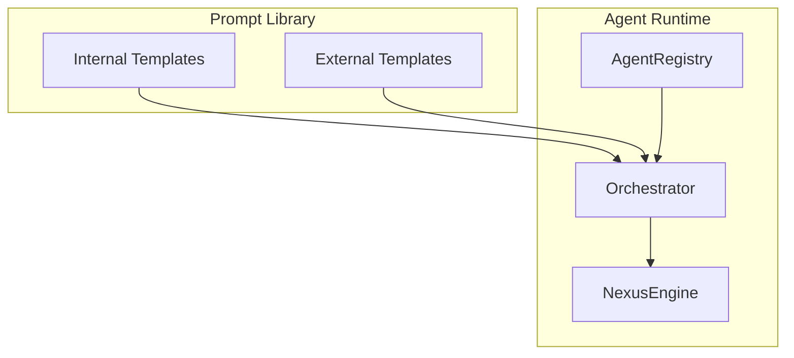
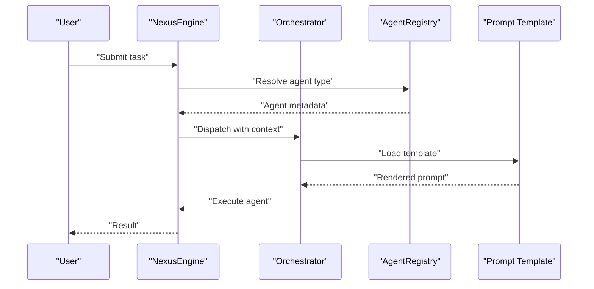
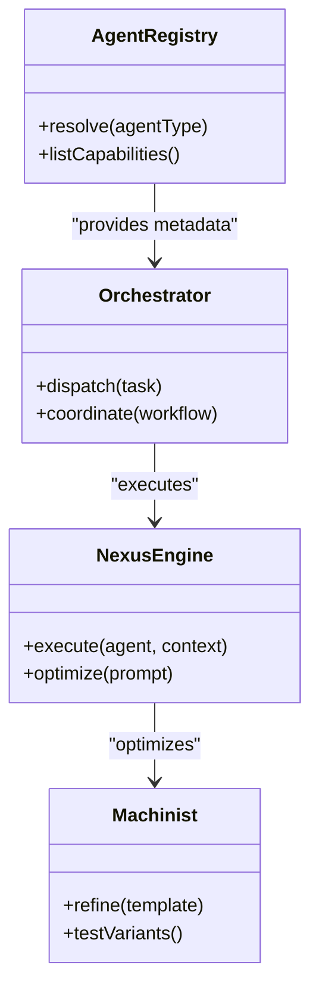

# Agent Prompts and Templates

<cite>
**Referenced Files in This Document**
- [README.md](file://README.md)
- [AgentRegistry.js](file://agent/core/AgentRegistry.js)
- [NexusEngine.js](file://agent/core/NexusEngine.js)
- [Orchestrator.js](file://agent/core/Orchestrator.js)
- [LaravelArchitect.js](file://agent/core/LaravelArchitect.js)
- [Machinist.js](file://agent/core/Machinist.js)
- [prompt-engineer.md](file://agent/prompts/internal/prompt-engineer.md)
- [llm-orchestrator.md](file://agent/prompts/internal/llm-orchestrator.md)
- [machinist.md](file://agent/prompts/internal/machinist.md)
- [laravel-core-specialist.md](file://agent/prompts/internal/laravel-core-specialist.md)
- [composer-dependency-agent.md](file://agent/prompts/internal/composer-dependency-agent.md)
- [livewire-specialist.md](file://agent/prompts/internal/livewire-specialist.md)
- [filament-forms-specialist.md](file://agent/prompts/internal/filament-forms-specialist.md)
- [sanctum-auth-specialist.md](file://agent/prompts/internal/sanctum-auth-specialist.md)
- [jwt-auth-specialist.md](file://agent/prompts/internal/jwt-auth-specialist.md)
- [two-factor-specialist.md](file://agent/prompts/internal/two-factor-specialist.md)
- [ssl-certificates-specialist.md](file://agent/prompts/internal/ssl-certificates-specialist.md)
- [laravel-queue-specialist.md](file://agent/prompts/internal/laravel-queue-specialist.md)
- [laravel-telescope-specialist.md](file://agent/prompts/internal/laravel-telescope-specialist.md)
- [laravel-octane-specialist.md](file://agent/prompts/internal/laravel-octane-specialist.md)
- [laravel-api-specialist.md](file://agent/prompts/internal/laravel-api-specialist.md)
- [laravel-event-specialist.md](file://agent/prompts/internal/laravel-event-specialist.md)
- [laravel-package-specialist.md](file://agent/prompts/internal/laravel-package-specialist.md)
- [nextjs-laravel-specialist.md](file://agent/prompts/internal/nextjs-laravel-specialist.md)
- [nuxt-laravel-specialist.md](file://agent/prompts/internal/nuxt-laravel-specialist.md)
- [web-components-specialist.md](file://agent/prompts/internal/web-components-specialist.md)
- [inertiajs-specialist.md](file://agent/prompts/internal/inertiajs-specialist.md)
- [livewire-alpinejs-bridge.md](file://agent/prompts/internal/livewire-alpinejs-bridge.md)
- [capacitor-specialist.md](file://agent/prompts/internal/capacitor-specialist.md)
- [alpinejs-bridge.md](file://agent/prompts/internal/livewire-alpinejs-bridge.md)
- [api-gateway-streaming.md](file://agent/prompts/internal/api-gateway-streaming.md)
- [rest-api-designer.md](file://agent/prompts/internal/rest-api-designer.md)
- [json-api-specialist.md](file://agent/prompts/internal/json-api-specialist.md)
- [websocket-specialist.md](file://agent/prompts/internal/websocket-specialist.md)
- [notification-specialist.md](file://agent/prompts/internal/notification-specialist.md)
- [email-template-specialist.md](file://agent/prompts/internal/email-template-specialist.md)
- [responsive-email-specialist.md](file://agent/prompts/internal/responsive-email-specialist.md)
- [media-manager-specialist.md](file://agent/prompts/internal/media-manager-specialist.md)
- [media-library-specialist.md](file://agent/prompts/internal/media-library-specialist.md)
- [image-optimization-agent.md](file://agent/prompts/internal/image-optimization-agent.md)
- [file-upload-specialist.md](file://agent/prompts/internal/file-upload-specialist.md)
- [content-versioning-specialist.md](file://agent/prompts/internal/content-versioning-specialist.md)
- [data-export-specialist.md](file://agent/prompts/internal/data-export-specialist.md)
- [data-visualization-specialist.md](file://agent/prompts/internal/data-visualization-specialist.md)
- [dashboard-analytics-specialist.md](file://agent/prompts/internal/dashboard-analytics-specialist.md)
- [search-specialist.md](file://agent/prompts/internal/search-specialist.md)
- [elasticsearch-specialist.md](file://agent/prompts/internal/elasticsearch-specialist.md)
- [algolia-specialist.md](file://agent/prompts/internal/algolia-specialist.md)
- [headless-cms-specialist.md](file://agent/prompts/internal/headless-cms-specialist.md)
- [broadcasting-specialist.md](file://agent/prompts/internal/broadcasting-specialist.md)
- [uptime-monitoring-specialist.md](file://agent/prompts/internal/uptime-monitoring-specialist.md)
- [monitoring-logging.md](file://agent/prompts/internal/monitoring-logging.md)
- [log-management-specialist.md](file://agent/prompts/internal/log-management-specialist.md)
- [security-code-scanner.md](file://agent/prompts/internal/security-code-scanner.md)
- [cyber-security.md](file://agent/prompts/internal/cyber-security.md)
- [oauth-specialist.md](file://agent/prompts/internal/oauth-specialist.md)
- [social-auth-specialist.md](file://agent/prompts/internal/social-auth-specialist.md)
- [multitenancy-specialist.md](file://agent/prompts/internal/multitenancy-specialist.md)
- [nginx-apache-specialist.md](file://agent/prompts/internal/nginx-apache-specialist.md)
- [docker-laravel-specialist.md](file://agent/prompts/internal/docker-laravel-specialist.md)
- [github-actions-specialist.md](file://agent/prompts/internal/github-actions-specialist.md)
- [vcs-architect.md](file://agent/prompts/internal/vcs-architect.md)
- [documentation-architect.md](file://agent/prompts/internal/documentation-architect.md)
- [database-architect.md](file://agent/prompts/internal/database-architect.md)
- [e2e-testing-specialist.md](file://agent/prompts/internal/e2e-testing-specialist.md)
- [looping-tester.md](file://agent/prompts/internal/looping-tester.md)
- [performance-testing-agent.md](file://agent/prompts/internal/performance-testing-agent.md)
- [mutation-testing-agent.md](file://agent/prompts/internal/mutation-testing-agent.md)
- [dead-code-detector.md](file://agent/prompts/internal/dead-code-detector.md)
- [code-review-agent.md](file://agent/prompts/internal/code-review-agent.md)
- [refactor-specialist.md](file://agent/prompts/internal/refactor-specialist.md)
- [pest-php-specialist.md](file://agent/prompts/internal/pest-php-specialist.md)
- [tdd-guard.md](file://agent/prompts/internal/tdd-guard.md)
- [golden-crawler.md](file://agent/prompts/internal/golden-crawler.md)
- [accessibility-testing-agent.md](file://agent/prompts/internal/accessibility-testing-agent.md)
- [core-web-vitals-specialist.md](file://agent/prompts/internal/core-web-vitals-specialist.md)
- [web-components-specialist.md](file://agent/prompts/internal/web-components-specialist.md)
- [i18n-specialist.md](file://agent/prompts/internal/i18n-specialist.md)
- [local-seo-indonesia.md](file://agent/prompts/internal/local-seo-indonesia.md)
- [whatsapp-api-specialist.md](file://agent/prompts/internal/whatsapp-api-specialist.md)
- [midtrans-specialist.md](file://agent/prompts/internal/midtrans-specialist.md)
- [rupiah-payment-specialist.md](file://agent/prompts/internal/rupiah-payment-specialist.md)
- [timezone-specialist.md](file://agent/prompts/internal/timezone-specialist.md)
- [role-permission-specialist.md](file://agent/prompts/internal/role-permission-specialist.md)
- [subscription-specialist.md](file://agent/prompts/internal/subscription-specialist.md)
- [reporting-specialist.md](file://agent/prompts/internal/reporting-specialist.md)
- [data-visualization-specialist.md](file://agent/prompts/internal/data-visualization-specialist.md)
- [memory-manager.md](file://agent/prompts/internal/memory-manager.md)
- [memory-context-manager.md](file://agent/prompts/internal/memory-context-manager.md)
- [context-window-optimizer.md](file://agent/prompts/internal/context-window-optimizer.md)
- [token-budget-manager.md](file://agent/prompts/internal/token-budget-manager.md)
- [output-validator.md](file://agent/prompts/internal/output-validator.md)
- [output-diff-analyzer.md](file://agent/prompts/internal/output-diff-analyzer.md)
- [output-consistency-checker.md](file://agent/prompts/internal/output-consistency-checker.md)
- [prompt-optimizer-agent.md](file://agent/prompts/internal/prompt-optimizer-agent.md)
- [prompt-ab-tester.md](file://agent/prompts/internal/prompt-ab-tester.md)
- [performance-optimizer.md](file://agent/prompts/internal/performance-optimizer.md)
- [pipeline-architect.md](file://agent/prompts/internal/pipeline-architect.md)
- [orchestration-coordinator.md](file://agent/prompts/internal/orchestration-coordinator.md)
- [agent-manager.md](file://agent/prompts/internal/agent-manager.md)
- [agent-performance-profiler.md](file://agent/prompts/internal/agent-performance-profiler.md)
- [llm-orchestrator.md](file://agent/prompts/internal/llm-orchestrator.md)
- [guru.md](file://agent/prompts/internal/guru.md)
- [umkm-context-agent.md](file://agent/prompts/internal/umkm-context-agent.md)
- [blade-template-specialist.md](file://agent/prompts/internal/blade-template-specialist.md)
- [component-template-library.md](file://agent/prompts/internal/component-template-library.md)
- [ux-engineer.md](file://agent/prompts/internal/ux-engineer.md)
- [tailwind-architect.md](file://agent/prompts/internal/tailwind-architect.md)
- [middleware-specialist.md](file://agent/prompts/internal/middleware-specialist.md)
- [client-state-specialist.md](file://agent/prompts/internal/client-state-specialist.md)
- [server-state-specialist.md](file://agent/prompts/internal/server-state-specialist.md)
- [caching-state-manager.md](file://agent/prompts/internal/caching-state-manager.md)
- [filter-sort-specialist.md](file://agent/prompts/internal/filter-sort-specialist.md)
- [lazy-loading-specialist.md](file://agent/prompts/internal/lazy-loading-specialist.md)
- [seo-performance-specialist.md](file://agent/prompts/internal/seo-performance-specialist.md)
- [lighthouse-graphql-specialist.md](file://agent/prompts/internal/lighthouse-graphql-specialist.md)
- [api-versioning-specialist.md](file://agent/prompts/internal/api-versioning-specialist.md)
- [backup-recovery-specialist.md](file://agent/prompts/internal/backup-recovery-specialist.md)
- [changelog-manager.md](file://agent/prompts/internal/changelog-manager.md)
- [knowledge-distillation.md](file://agent/prompts/internal/knowledge-distillation.md)
</cite>

## Table of Contents
1. [Introduction](#introduction)
2. [Project Structure](#project-structure)
3. [Core Components](#core-components)
4. [Architecture Overview](#architecture-overview)
5. [Detailed Component Analysis](#detailed-component-analysis)
6. [Dependency Analysis](#dependency-analysis)
7. [Performance Considerations](#performance-considerations)
8. [Troubleshooting Guide](#troubleshooting-guide)
9. [Conclusion](#conclusion)
10. [Appendices](#appendices)

## Introduction
This document describes the NEXUS AI agent prompt system and template library. It explains how the system organizes and deploys a broad catalog of specialized agent prompts across domains such as development tools, business applications, security systems, the Laravel ecosystem, and utility agents. It also documents prompt engineering patterns, template customization, agent-specific instruction frameworks, and performance optimization strategies tailored to different agent types.

## Project Structure
The prompt system is organized under agent/prompts with two primary categories:
- Internal templates: domain-focused agent prompts curated for internal use and orchestration.
- External templates: categorized by domain (core, creative, engineering, business, security).

These templates are consumed by the agent runtime and orchestrators to guide LLM-based reasoning and action selection.

**Section sources**
- [README.md](file://README.md)
- [AgentRegistry.js](file://agent/core/AgentRegistry.js)
- [NexusEngine.js](file://agent/core/NexusEngine.js)
- [Orchestrator.js](file://agent/core/Orchestrator.js)

## Core Components
- AgentRegistry: central registry for agent identities, capabilities, and lifecycle.
- NexusEngine: core engine coordinating agent selection, prompt injection, and execution.
- Orchestrator: manages multi-agent workflows, routing, and coordination.
- LaravelArchitect: specialized orchestrator for Laravel-centric tasks.
- Machinist: prompt authoring and refinement utility.

These components collaborate to select appropriate prompts, inject context, and execute agent tasks efficiently.

**Section sources**
- [AgentRegistry.js](file://agent/core/AgentRegistry.js)
- [NexusEngine.js](file://agent/core/NexusEngine.js)
- [Orchestrator.js](file://agent/core/Orchestrator.js)
- [LaravelArchitect.js](file://agent/core/LaravelArchitect.js)
- [Machinist.js](file://agent/core/Machinist.js)

## Architecture Overview
The prompt system integrates with the agent runtime via a clear pipeline:
- Prompt selection based on agent type and task.
- Context injection and template customization.
- Execution through the orchestrator and engine.
- Feedback loops for refinement and performance optimization.

**Diagram sources**
- [NexusEngine.js](file://agent/core/NexusEngine.js)
- [Orchestrator.js](file://agent/core/Orchestrator.js)
- [AgentRegistry.js](file://agent/core/AgentRegistry.js)

## Detailed Component Analysis

### Prompt Engineering Patterns and Template Customization
- Instruction-first structure: clear roles, goals, and constraints.
- Context window management: explicit token budgeting and summarization strategies.
- Output formatting: structured response schemas and validation hooks.
- Iterative refinement: feedback loops for prompt optimization and A/B testing.

Key internal templates demonstrate these patterns:
- [prompt-engineer.md](file://agent/prompts/internal/prompt-engineer.md)
- [llm-orchestrator.md](file://agent/prompts/internal/llm-orchestrator.md)
- [machinist.md](file://agent/prompts/internal/machinist.md)
- [prompt-optimizer-agent.md](file://agent/prompts/internal/prompt-optimizer-agent.md)
- [prompt-ab-tester.md](file://agent/prompts/internal/prompt-ab-tester.md)

**Section sources**
- [prompt-engineer.md](file://agent/prompts/internal/prompt-engineer.md)
- [llm-orchestrator.md](file://agent/prompts/internal/llm-orchestrator.md)
- [machinist.md](file://agent/prompts/internal/machinist.md)
- [prompt-optimizer-agent.md](file://agent/prompts/internal/prompt-optimizer-agent.md)
- [prompt-ab-tester.md](file://agent/prompts/internal/prompt-ab-tester.md)

### Agent-Specific Instruction Frameworks
- Domain specialization: prompts tailored to specific technologies and ecosystems.
- Role-based reasoning: explicit agent personas and decision-making steps.
- Tool integration: guidance for interacting with external systems and APIs.
- Quality gates: validation, diff analysis, and consistency checks.

Representative templates:
- Laravel ecosystem:
  - [laravel-core-specialist.md](file://agent/prompts/internal/laravel-core-specialist.md)
  - [composer-dependency-agent.md](file://agent/prompts/internal/composer-dependency-agent.md)
  - [livewire-specialist.md](file://agent/prompts/internal/livewire-specialist.md)
  - [filament-forms-specialist.md](file://agent/prompts/internal/filament-forms-specialist.md)
  - [sanctum-auth-specialist.md](file://agent/prompts/internal/sanctum-auth-specialist.md)
  - [laravel-queue-specialist.md](file://agent/prompts/internal/laravel-queue-specialist.md)
  - [laravel-telescope-specialist.md](file://agent/prompts/internal/laravel-telescope-specialist.md)
  - [laravel-octane-specialist.md](file://agent/prompts/internal/laravel-octane-specialist.md)
  - [laravel-api-specialist.md](file://agent/prompts/internal/laravel-api-specialist.md)
  - [laravel-event-specialist.md](file://agent/prompts/internal/laravel-event-specialist.md)
  - [laravel-package-specialist.md](file://agent/prompts/internal/laravel-package-specialist.md)
  - [nextjs-laravel-specialist.md](file://agent/prompts/internal/nextjs-laravel-specialist.md)
  - [nuxt-laravel-specialist.md](file://agent/prompts/internal/nuxt-laravel-specialist.md)
- Frontend bridges and frameworks:
  - [web-components-specialist.md](file://agent/prompts/internal/web-components-specialist.md)
  - [inertiajs-specialist.md](file://agent/prompts/internal/inertiajs-specialist.md)
  - [livewire-alpinejs-bridge.md](file://agent/prompts/internal/livewire-alpinejs-bridge.md)
  - [capacitor-specialist.md](file://agent/prompts/internal/capacitor-specialist.md)
- API and integration:
  - [api-gateway-streaming.md](file://agent/prompts/internal/api-gateway-streaming.md)
  - [rest-api-designer.md](file://agent/prompts/internal/rest-api-designer.md)
  - [json-api-specialist.md](file://agent/prompts/internal/json-api-specialist.md)
  - [websocket-specialist.md](file://agent/prompts/internal/websocket-specialist.md)
  - [notification-specialist.md](file://agent/prompts/internal/notification-specialist.md)
  - [email-template-specialist.md](file://agent/prompts/internal/email-template-specialist.md)
  - [responsive-email-specialist.md](file://agent/prompts/internal/responsive-email-specialist.md)
- Media and assets:
  - [media-manager-specialist.md](file://agent/prompts/internal/media-manager-specialist.md)
  - [media-library-specialist.md](file://agent/prompts/internal/media-library-specialist.md)
  - [image-optimization-agent.md](file://agent/prompts/internal/image-optimization-agent.md)
  - [file-upload-specialist.md](file://agent/prompts/internal/file-upload-specialist.md)
- Content and SEO:
  - [content-versioning-specialist.md](file://agent/prompts/internal/content-versioning-specialist.md)
  - [data-export-specialist.md](file://agent/prompts/internal/data-export-specialist.md)
  - [data-visualization-specialist.md](file://agent/prompts/internal/data-visualization-specialist.md)
  - [dashboard-analytics-specialist.md](file://agent/prompts/internal/dashboard-analytics-specialist.md)
  - [search-specialist.md](file://agent/prompts/internal/search-specialist.md)
  - [elasticsearch-specialist.md](file://agent/prompts/internal/elasticsearch-specialist.md)
  - [algolia-specialist.md](file://agent/prompts/internal/algolia-specialist.md)
  - [headless-cms-specialist.md](file://agent/prompts/internal/headless-cms-specialist.md)
  - [seo-performance-specialist.md](file://agent/prompts/internal/seo-performance-specialist.md)
- Observability and operations:
  - [uptime-monitoring-specialist.md](file://agent/prompts/internal/uptime-monitoring-specialist.md)
  - [monitoring-logging.md](file://agent/prompts/internal/monitoring-logging.md)
  - [log-management-specialist.md](file://agent/prompts/internal/log-management-specialist.md)
  - [nginx-apache-specialist.md](file://agent/prompts/internal/nginx-apache-specialist.md)
  - [docker-laravel-specialist.md](file://agent/prompts/internal/docker-laravel-specialist.md)
  - [github-actions-specialist.md](file://agent/prompts/internal/github-actions-specialist.md)
- Security:
  - [security-code-scanner.md](file://agent/prompts/internal/security-code-scanner.md)
  - [cyber-security.md](file://agent/prompts/internal/cyber-security.md)
  - [oauth-specialist.md](file://agent/prompts/internal/oauth-specialist.md)
  - [social-auth-specialist.md](file://agent/prompts/internal/social-auth-specialist.md)
  - [multitenancy-specialist.md](file://agent/prompts/internal/multitenancy-specialist.md)
  - [jwt-auth-specialist.md](file://agent/prompts/internal/jwt-auth-specialist.md)
  - [two-factor-specialist.md](file://agent/prompts/internal/two-factor-specialist.md)
  - [ssl-certificates-specialist.md](file://agent/prompts/internal/ssl-certificates-specialist.md)
- DevOps and infrastructure:
  - [vcs-architect.md](file://agent/prompts/internal/vcs-architect.md)
  - [documentation-architect.md](file://agent/prompts/internal/documentation-architect.md)
  - [database-architect.md](file://agent/prompts/internal/database-architect.md)
- Testing and quality:
  - [e2e-testing-specialist.md](file://agent/prompts/internal/e2e-testing-specialist.md)
  - [looping-tester.md](file://agent/prompts/internal/looping-tester.md)
  - [performance-testing-agent.md](file://agent/prompts/internal/performance-testing-agent.md)
  - [mutation-testing-agent.md](file://agent/prompts/internal/mutation-testing-agent.md)
  - [dead-code-detector.md](file://agent/prompts/internal/dead-code-detector.md)
  - [code-review-agent.md](file://agent/prompts/internal/code-review-agent.md)
  - [refactor-specialist.md](file://agent/prompts/internal/refactor-specialist.md)
  - [pest-php-specialist.md](file://agent/prompts/internal/pest-php-specialist.md)
  - [tdd-guard.md](file://agent/prompts/internal/tdd-guard.md)
- Utility and productivity:
  - [golden-crawler.md](file://agent/prompts/internal/golden-crawler.md)
  - [accessibility-testing-agent.md](file://agent/prompts/internal/accessibility-testing-agent.md)
  - [core-web-vitals-specialist.md](file://agent/prompts/internal/core-web-vitals-specialist.md)
  - [i18n-specialist.md](file://agent/prompts/internal/i18n-specialist.md)
  - [local-seo-indonesia.md](file://agent/prompts/internal/local-seo-indonesia.md)
  - [whatsapp-api-specialist.md](file://agent/prompts/internal/whatsapp-api-specialist.md)
  - [midtrans-specialist.md](file://agent/prompts/internal/midtrans-specialist.md)
  - [rupiah-payment-specialist.md](file://agent/prompts/internal/rupiah-payment-specialist.md)
  - [timezone-specialist.md](file://agent/prompts/internal/timezone-specialist.md)
  - [role-permission-specialist.md](file://agent/prompts/internal/role-permission-specialist.md)
  - [subscription-specialist.md](file://agent/prompts/internal/subscription-specialist.md)
  - [reporting-specialist.md](file://agent/prompts/internal/reporting-specialist.md)
  - [memory-manager.md](file://agent/prompts/internal/memory-manager.md)
  - [memory-context-manager.md](file://agent/prompts/internal/memory-context-manager.md)
  - [context-window-optimizer.md](file://agent/prompts/internal/context-window-optimizer.md)
  - [token-budget-manager.md](file://agent/prompts/internal/token-budget-manager.md)
  - [output-validator.md](file://agent/prompts/internal/output-validator.md)
  - [output-diff-analyzer.md](file://agent/prompts/internal/output-diff-analyzer.md)
  - [output-consistency-checker.md](file://agent/prompts/internal/output-consistency-checker.md)
  - [performance-optimizer.md](file://agent/prompts/internal/performance-optimizer.md)
  - [pipeline-architect.md](file://agent/prompts/internal/pipeline-architect.md)
  - [orchestration-coordinator.md](file://agent/prompts/internal/orchestration-coordinator.md)
  - [agent-manager.md](file://agent/prompts/internal/agent-manager.md)
  - [agent-performance-profiler.md](file://agent/prompts/internal/agent-performance-profiler.md)
  - [llm-orchestrator.md](file://agent/prompts/internal/llm-orchestrator.md)
  - [guru.md](file://agent/prompts/internal/guru.md)
  - [umkm-context-agent.md](file://agent/prompts/internal/umkm-context-agent.md)
  - [blade-template-specialist.md](file://agent/prompts/internal/blade-template-specialist.md)
  - [component-template-library.md](file://agent/prompts/internal/component-template-library.md)
  - [ux-engineer.md](file://agent/prompts/internal/ux-engineer.md)
  - [tailwind-architect.md](file://agent/prompts/internal/tailwind-architect.md)
  - [middleware-specialist.md](file://agent/prompts/internal/middleware-specialist.md)
  - [client-state-specialist.md](file://agent/prompts/internal/client-state-specialist.md)
  - [server-state-specialist.md](file://agent/prompts/internal/server-state-specialist.md)
  - [caching-state-manager.md](file://agent/prompts/internal/caching-state-manager.md)
  - [filter-sort-specialist.md](file://agent/prompts/internal/filter-sort-specialist.md)
  - [lazy-loading-specialist.md](file://agent/prompts/internal/lazy-loading-specialist.md)
  - [lighthouse-graphql-specialist.md](file://agent/prompts/internal/lighthouse-graphql-specialist.md)
  - [api-versioning-specialist.md](file://agent/prompts/internal/api-versioning-specialist.md)
  - [backup-recovery-specialist.md](file://agent/prompts/internal/backup-recovery-specialist.md)
  - [changelog-manager.md](file://agent/prompts/internal/changelog-manager.md)
  - [knowledge-distillation.md](file://agent/prompts/internal/knowledge-distillation.md)

### Prompt Variations and Context Injection Techniques
- Dynamic context insertion: injecting project-specific artifacts, logs, diffs, and environment details.
- Multi-turn prompting: iterative refinement guided by validation and feedback.
- Structured constraints: explicit formatting and schema requirements to reduce ambiguity.
- Domain adapters: transforming generic prompts into specialized instructions for frameworks and tools.

Examples of templates demonstrating these techniques:
- [prompt-engineer.md](file://agent/prompts/internal/prompt-engineer.md)
- [llm-orchestrator.md](file://agent/prompts/internal/llm-orchestrator.md)
- [context-window-optimizer.md](file://agent/prompts/internal/context-window-optimizer.md)
- [token-budget-manager.md](file://agent/prompts/internal/token-budget-manager.md)
- [output-validator.md](file://agent/prompts/internal/output-validator.md)
- [output-diff-analyzer.md](file://agent/prompts/internal/output-diff-analyzer.md)
- [output-consistency-checker.md](file://agent/prompts/internal/output-consistency-checker.md)

**Section sources**
- [prompt-engineer.md](file://agent/prompts/internal/prompt-engineer.md)
- [llm-orchestrator.md](file://agent/prompts/internal/llm-orchestrator.md)
- [context-window-optimizer.md](file://agent/prompts/internal/context-window-optimizer.md)
- [token-budget-manager.md](file://agent/prompts/internal/token-budget-manager.md)
- [output-validator.md](file://agent/prompts/internal/output-validator.md)
- [output-diff-analyzer.md](file://agent/prompts/internal/output-diff-analyzer.md)
- [output-consistency-checker.md](file://agent/prompts/internal/output-consistency-checker.md)

### Performance Optimization Strategies by Agent Type
- Token efficiency: use context-window-optimizer and token-budget-manager to constrain input size.
- Caching and memoization: leverage caching-state-manager for repeated computations.
- Validation early: apply output-validator and diff analyzer to avoid costly re-executions.
- Batch orchestration: pipeline-architect coordinates multi-step tasks to minimize overhead.
- Specialized tooling: use framework-specific agents (e.g., Laravel specialists) to reduce ambiguity and improve throughput.

Representative templates:
- [context-window-optimizer.md](file://agent/prompts/internal/context-window-optimizer.md)
- [token-budget-manager.md](file://agent/prompts/internal/token-budget-manager.md)
- [caching-state-manager.md](file://agent/prompts/internal/caching-state-manager.md)
- [output-validator.md](file://agent/prompts/internal/output-validator.md)
- [pipeline-architect.md](file://agent/prompts/internal/pipeline-architect.md)
- [laravel-core-specialist.md](file://agent/prompts/internal/laravel-core-specialist.md)
- [composer-dependency-agent.md](file://agent/prompts/internal/composer-dependency-agent.md)
- [laravel-queue-specialist.md](file://agent/prompts/internal/laravel-queue-specialist.md)
- [laravel-telescope-specialist.md](file://agent/prompts/internal/laravel-telescope-specialist.md)
- [laravel-octane-specialist.md](file://agent/prompts/internal/laravel-octane-specialist.md)

**Section sources**
- [context-window-optimizer.md](file://agent/prompts/internal/context-window-optimizer.md)
- [token-budget-manager.md](file://agent/prompts/internal/token-budget-manager.md)
- [caching-state-manager.md](file://agent/prompts/internal/caching-state-manager.md)
- [output-validator.md](file://agent/prompts/internal/output-validator.md)
- [pipeline-architect.md](file://agent/prompts/internal/pipeline-architect.md)
- [laravel-core-specialist.md](file://agent/prompts/internal/laravel-core-specialist.md)
- [composer-dependency-agent.md](file://agent/prompts/internal/composer-dependency-agent.md)
- [laravel-queue-specialist.md](file://agent/prompts/internal/laravel-queue-specialist.md)
- [laravel-telescope-specialist.md](file://agent/prompts/internal/laravel-telescope-specialist.md)
- [laravel-octane-specialist.md](file://agent/prompts/internal/laravel-octane-specialist.md)

## Dependency Analysis
The prompt system interacts with the agent runtime through a well-defined contract:
- AgentRegistry supplies agent metadata and capabilities.
- Orchestrator selects and dispatches agents based on task requirements.
- NexusEngine executes agents and manages resource allocation.
- Machinist refines prompts iteratively.

**Diagram sources**
- [AgentRegistry.js](file://agent/core/AgentRegistry.js)
- [Orchestrator.js](file://agent/core/Orchestrator.js)
- [NexusEngine.js](file://agent/core/NexusEngine.js)
- [Machinist.js](file://agent/core/Machinist.js)

**Section sources**
- [AgentRegistry.js](file://agent/core/AgentRegistry.js)
- [Orchestrator.js](file://agent/core/Orchestrator.js)
- [NexusEngine.js](file://agent/core/NexusEngine.js)
- [Machinist.js](file://agent/core/Machinist.js)

## Performance Considerations
- Reduce context size: use context-window-optimizer and token-budget-manager to limit input tokens.
- Leverage caching: caching-state-manager minimizes recomputation for repeated tasks.
- Validate early: output-validator and diff analyzer prevent unnecessary retries.
- Optimize orchestration: pipeline-architect batches related tasks to reduce overhead.
- Specialization: framework-specific agents reduce ambiguity and improve throughput.

[No sources needed since this section provides general guidance]

## Troubleshooting Guide
Common issues and remedies:
- Excessive token usage: switch to context-window-optimizer and token-budget-manager to trim context.
- Ambiguous outputs: enable output-validator and diff analyzer to enforce consistency.
- Slow execution: use caching-state-manager and pipeline-architect to optimize workflows.
- Agent misrouting: verify AgentRegistry entries and Orchestrator dispatch logic.

**Section sources**
- [context-window-optimizer.md](file://agent/prompts/internal/context-window-optimizer.md)
- [token-budget-manager.md](file://agent/prompts/internal/token-budget-manager.md)
- [output-validator.md](file://agent/prompts/internal/output-validator.md)
- [output-diff-analyzer.md](file://agent/prompts/internal/output-diff-analyzer.md)
- [caching-state-manager.md](file://agent/prompts/internal/caching-state-manager.md)
- [pipeline-architect.md](file://agent/prompts/internal/pipeline-architect.md)
- [AgentRegistry.js](file://agent/core/AgentRegistry.js)
- [Orchestrator.js](file://agent/core/Orchestrator.js)

## Conclusion
The NEXUS AI prompt system provides a scalable, modular, and performance-aware foundation for deploying specialized agents across diverse domains. By combining robust prompt engineering patterns, dynamic context injection, and agent-specific instruction frameworks, it enables efficient, reliable, and extensible automation across development, business, security, and utility workloads.

[No sources needed since this section summarizes without analyzing specific files]

## Appendices
- Prompt catalog overview: the internal templates directory contains a comprehensive set of agent prompts covering development, business, security, and utility domains. These serve as the backbone for agent orchestration and execution.
- External templates: categorized by domain (core, creative, engineering, business, security), enabling cross-project reuse and standardized guidance.

[No sources needed since this section provides general guidance]