# Agent Registry and Management

<cite>
**Referenced Files in This Document**
- [AgentRegistry.js](file://agent/core/AgentRegistry.js)
- [Contract.js](file://agent/core/Contract.js)
- [DecisionEngine.js](file://agent/core/DecisionEngine.js)
- [LocalIntelligence.js](file://agent/core/LocalIntelligence.js)
- [NexusEngine.js](file://agent/core/NexusEngine.js)
- [Machinist.js](file://agent/core/Machinist.js)
- [NexusClock.js](file://agent/core/NexusClock.js)
- [ParallelRunner.js](file://agent/core/ParallelRunner.js)
- [SandboxExecutor.js](file://agent/core/SandboxExecutor.js)
- [TaskProtocol.js](file://agent/core/TaskProtocol.js)
- [Orchestrator.js](file://agent/core/Orchestrator.js)
- [ResourceMonitor.js](file://agent/core/ResourceMonitor.js)
- [WorktreeManager.js](file://agent/core/WorktreeManager.js)
- [BasePhase.js](file://agent/core/phases/BasePhase.js)
- [Distiller.js](file://agent/core/Distiller.js)
</cite>

## Table of Contents
1. [Introduction](#introduction)
2. [Project Structure](#project-structure)
3. [Core Components](#core-components)
4. [Architecture Overview](#architecture-overview)
5. [Detailed Component Analysis](#detailed-component-analysis)
6. [Dependency Analysis](#dependency-analysis)
7. [Performance Considerations](#performance-considerations)
8. [Troubleshooting Guide](#troubleshooting-guide)
9. [Conclusion](#conclusion)
10. [Appendices](#appendices)

## Introduction
This document explains the NEXUS AI agent registry and management system. It covers how agents are discovered, registered, monitored, and orchestrated; how contracts define data and protocol guarantees; how decisions are made among competing agent suggestions; how local intelligence provides contextual, bounded AI capabilities; and how the NexusEngine coordinates end-to-end cycles. It also documents the Machinist agent factory, NexusClock for temporal consistency, ParallelRunner for concurrency, SandboxExecutor for safe task execution, and TaskProtocol for inter-agent communication. Practical examples illustrate agent registration, contract negotiation, and collaborative workflows.

## Project Structure
The agent core subsystem organizes responsibilities into cohesive modules:
- Registry and lifecycle: AgentRegistry, Orchestrator
- Contracts and protocols: Contract, TaskProtocol
- Decision-making: DecisionEngine
- Contextual intelligence: LocalIntelligence, NexusClock
- Coordination: NexusEngine, ParallelRunner, SandboxExecutor
- Evolution and knowledge: Machinist, Distiller
- Infrastructure: ResourceMonitor, WorktreeManager, BasePhase

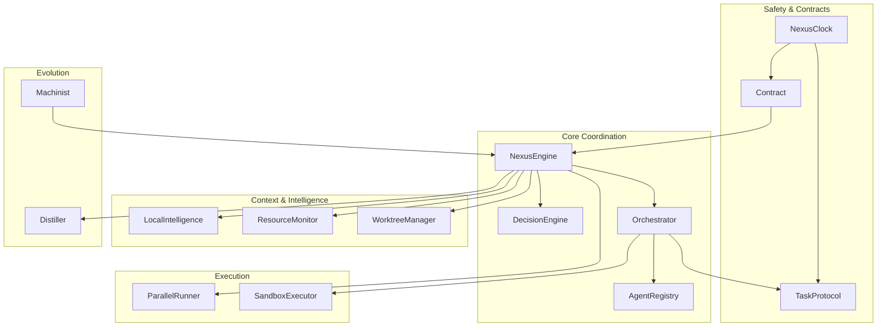

**Diagram sources**
- [NexusEngine.js:60-137](file://agent/core/NexusEngine.js#L60-L137)
- [Orchestrator.js:15-33](file://agent/core/Orchestrator.js#L15-L33)
- [AgentRegistry.js:6-124](file://agent/core/AgentRegistry.js#L6-L124)
- [TaskProtocol.js:3-54](file://agent/core/TaskProtocol.js#L3-L54)
- [Contract.js:5-73](file://agent/core/Contract.js#L5-L73)
- [NexusClock.js:5-40](file://agent/core/NexusClock.js#L5-L40)
- [ParallelRunner.js:6-40](file://agent/core/ParallelRunner.js#L6-L40)
- [SandboxExecutor.js:9-80](file://agent/core/SandboxExecutor.js#L9-L80)
- [LocalIntelligence.js:24-405](file://agent/core/LocalIntelligence.js#L24-L405)
- [ResourceMonitor.js:9-100](file://agent/core/ResourceMonitor.js#L9-L100)
- [WorktreeManager.js:13-110](file://agent/core/WorktreeManager.js#L13-L110)
- [Machinist.js:30-279](file://agent/core/Machinist.js#L30-L279)
- [Distiller.js:10-550](file://agent/core/Distiller.js#L10-L550)

**Section sources**
- [NexusEngine.js:60-137](file://agent/core/NexusEngine.js#L60-L137)
- [Orchestrator.js:15-33](file://agent/core/Orchestrator.js#L15-L33)
- [AgentRegistry.js:6-124](file://agent/core/AgentRegistry.js#L6-L124)
- [TaskProtocol.js:3-54](file://agent/core/TaskProtocol.js#L3-L54)
- [Contract.js:5-73](file://agent/core/Contract.js#L5-L73)
- [NexusClock.js:5-40](file://agent/core/NexusClock.js#L5-L40)
- [ParallelRunner.js:6-40](file://agent/core/ParallelRunner.js#L6-L40)
- [SandboxExecutor.js:9-80](file://agent/core/SandboxExecutor.js#L9-L80)
- [LocalIntelligence.js:24-405](file://agent/core/LocalIntelligence.js#L24-L405)
- [ResourceMonitor.js:9-100](file://agent/core/ResourceMonitor.js#L9-L100)
- [WorktreeManager.js:13-110](file://agent/core/WorktreeManager.js#L13-L110)
- [Machinist.js:30-279](file://agent/core/Machinist.js#L30-L279)
- [Distiller.js:10-550](file://agent/core/Distiller.js#L10-L550)

## Core Components
- AgentRegistry: Central registry tracking agent health, status, and activity; detects stuck agents and provides health reports.
- Contract: Defines standardized data contracts (AuditReport, ImplementationPlan, NexusErrorPayload) with validation and serialization.
- DecisionEngine: Selects the best agent suggestion using context-aware weighted scoring.
- LocalIntelligence: Provides bounded, secure local/cloud inference with safety guards, circuit breaker, and output validation.
- NexusEngine: Orchestrates the full lifecycle, discovers skills and agents, coordinates phases, and manages resources.
- Machinist: Factory for evolving the system by safely generating and integrating new scanners and tools.
- NexusClock: Centralized time service enforcing UTC+8 timestamps for deterministic operations.
- ParallelRunner: Controlled concurrency for parallel task execution.
- SandboxExecutor: Secure execution of plugins in worker threads with path and manifest validation.
- TaskProtocol: Inter-agent communication schema with validation, priority, and tracing.
- Orchestrator: Routes tasks to agents, tracks lifecycle, integrates with AgentRegistry, and persists dead-letter queue.
- ResourceMonitor: CPU/memory monitoring with stress recommendations.
- WorktreeManager: Optional Git worktree isolation for feature development.
- BasePhase: Common base for modular execution phases.

**Section sources**
- [AgentRegistry.js:6-124](file://agent/core/AgentRegistry.js#L6-L124)
- [Contract.js:5-73](file://agent/core/Contract.js#L5-L73)
- [DecisionEngine.js:18-73](file://agent/core/DecisionEngine.js#L18-L73)
- [LocalIntelligence.js:24-405](file://agent/core/LocalIntelligence.js#L24-L405)
- [NexusEngine.js:60-137](file://agent/core/NexusEngine.js#L60-L137)
- [Machinist.js:30-279](file://agent/core/Machinist.js#L30-L279)
- [NexusClock.js:5-40](file://agent/core/NexusClock.js#L5-L40)
- [ParallelRunner.js:6-40](file://agent/core/ParallelRunner.js#L6-L40)
- [SandboxExecutor.js:9-80](file://agent/core/SandboxExecutor.js#L9-L80)
- [TaskProtocol.js:3-54](file://agent/core/TaskProtocol.js#L3-L54)
- [Orchestrator.js:15-239](file://agent/core/Orchestrator.js#L15-L239)
- [ResourceMonitor.js:9-100](file://agent/core/ResourceMonitor.js#L9-L100)
- [WorktreeManager.js:13-110](file://agent/core/WorktreeManager.js#L13-L110)
- [BasePhase.js:6-28](file://agent/core/phases/BasePhase.js#L6-L28)

## Architecture Overview
The NexusEngine composes subsystems to run autonomous cycles:
- Discovery: Scans for agents and skills, loads prompts and workflows.
- Audit: Identifies issues and generates audit reports.
- Plan: Builds implementation plans from audits.
- Implement: Executes scaffolding and code generation.
- Execute: Runs verification and cleanup.
- Distill: Consolidates knowledge and updates semantic links.

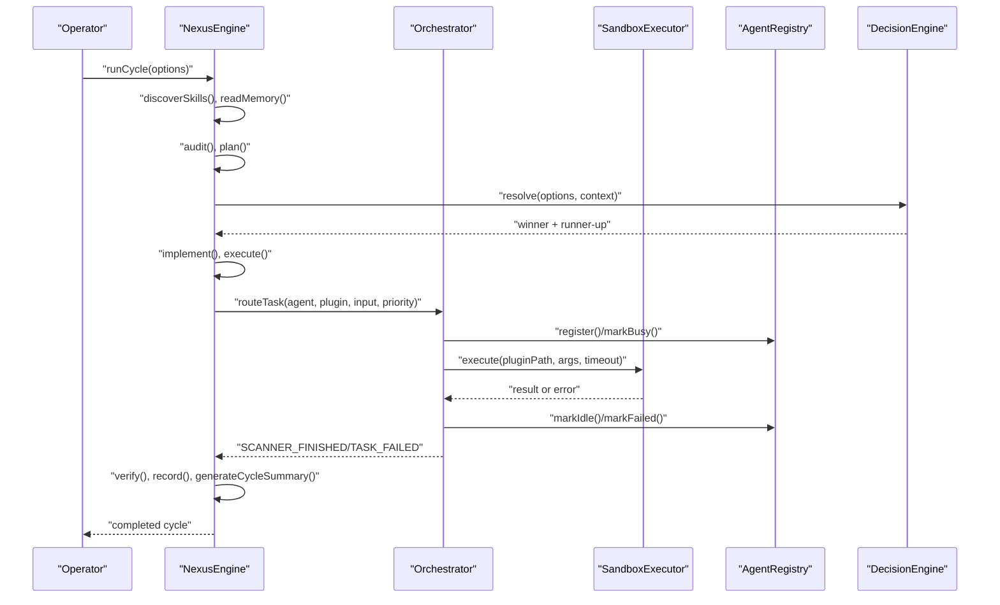

**Diagram sources**
- [NexusEngine.js:346-395](file://agent/core/NexusEngine.js#L346-L395)
- [Orchestrator.js:167-207](file://agent/core/Orchestrator.js#L167-L207)
- [SandboxExecutor.js:16-76](file://agent/core/SandboxExecutor.js#L16-L76)
- [AgentRegistry.js:17-73](file://agent/core/AgentRegistry.js#L17-L73)
- [DecisionEngine.js:29-61](file://agent/core/DecisionEngine.js#L29-L61)

## Detailed Component Analysis

### AgentRegistry
AgentRegistry maintains a central map of active agents with health and lifecycle metadata. It supports registering agents, marking busy/idle/failed states, detecting stuck agents via a time threshold, and generating health reports.

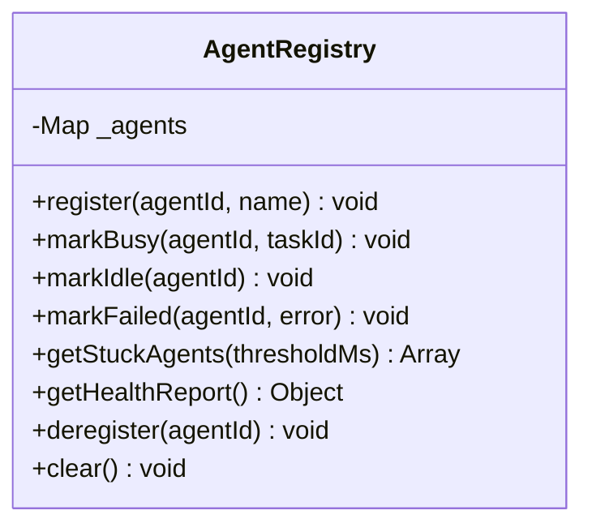

**Diagram sources**
- [AgentRegistry.js:6-124](file://agent/core/AgentRegistry.js#L6-L124)

**Section sources**
- [AgentRegistry.js:6-124](file://agent/core/AgentRegistry.js#L6-L124)

### Contract System
Contracts define strict schemas for cross-module data exchange:
- AuditReport: Timestamped audit findings with metadata.
- ImplementationPlan: Tasks derived from audits with statuses and actions.
- NexusErrorPayload: Structured error envelopes with retryability and agent attribution.

Validation ensures required fields and consistent typing across modules.

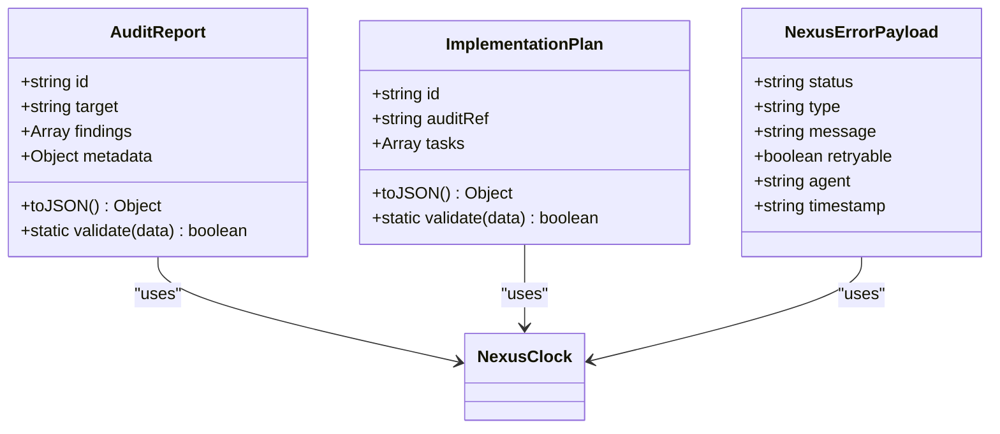

**Diagram sources**
- [Contract.js:7-73](file://agent/core/Contract.js#L7-L73)
- [NexusClock.js:5-40](file://agent/core/NexusClock.js#L5-L40)

**Section sources**
- [Contract.js:5-73](file://agent/core/Contract.js#L5-L73)

### DecisionEngine
DecisionEngine resolves conflicts among agent suggestions by computing weighted scores per context profile. It selects a winner, runner-up, and difference score, and exposes available contexts.

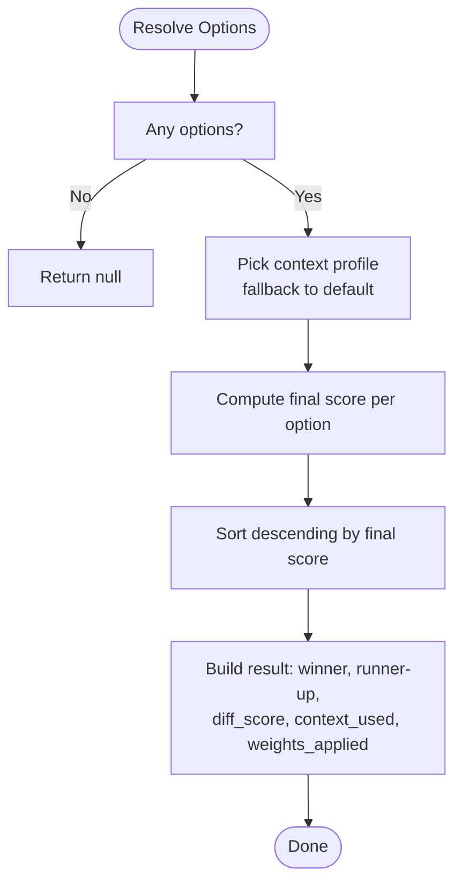

**Diagram sources**
- [DecisionEngine.js:18-73](file://agent/core/DecisionEngine.js#L18-L73)

**Section sources**
- [DecisionEngine.js:18-73](file://agent/core/DecisionEngine.js#L18-L73)

### LocalIntelligence
LocalIntelligence provides secure, bounded AI inference:
- Availability checks with TTL caching and circuit breaker.
- Allowed task enforcement and prompt chunking to avoid OOM.
- Dual-path inference: cloud Gemini API or local node-llama-cpp with context sizing tuned per task type.
- Output validation and truncation safeguards.

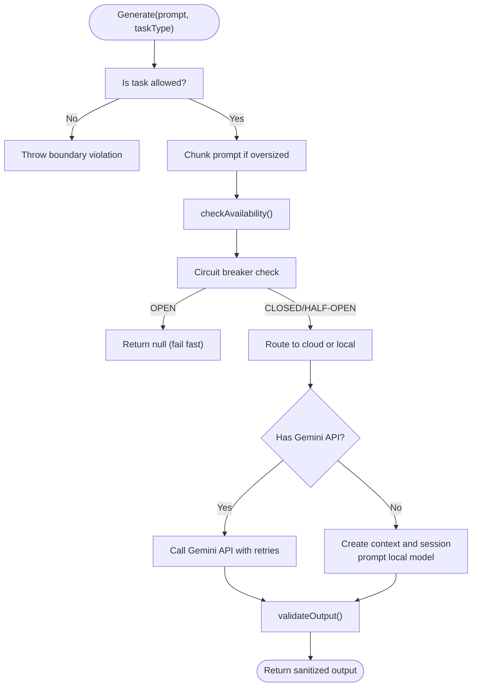

**Diagram sources**
- [LocalIntelligence.js:118-352](file://agent/core/LocalIntelligence.js#L118-L352)

**Section sources**
- [LocalIntelligence.js:24-405](file://agent/core/LocalIntelligence.js#L24-L405)

### NexusEngine
NexusEngine orchestrates the full lifecycle:
- Paths resolution for prompts, workflows, and memory.
- Discovery of agents and skills.
- Memory access and semantic search.
- Modular phases: Audit, Planning, Implementation, Execution, Knowledge.
- Resource monitoring and system status.
- Error logging and cycle recording.

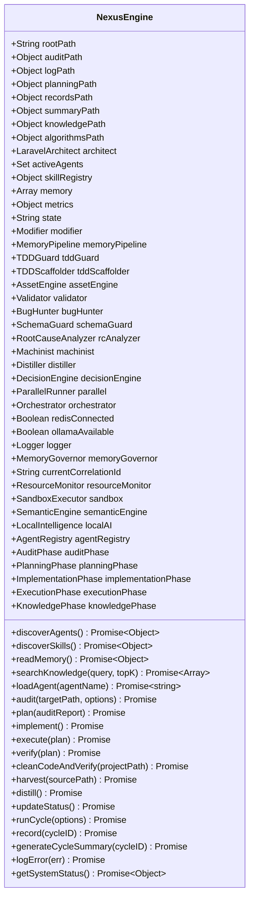

**Diagram sources**
- [NexusEngine.js:60-137](file://agent/core/NexusEngine.js#L60-L137)
- [NexusEngine.js:171-221](file://agent/core/NexusEngine.js#L171-L221)
- [NexusEngine.js:223-278](file://agent/core/NexusEngine.js#L223-L278)
- [NexusEngine.js:346-395](file://agent/core/NexusEngine.js#L346-L395)

**Section sources**
- [NexusEngine.js:60-137](file://agent/core/NexusEngine.js#L60-L137)
- [NexusEngine.js:171-221](file://agent/core/NexusEngine.js#L171-L221)
- [NexusEngine.js:223-278](file://agent/core/NexusEngine.js#L223-L278)
- [NexusEngine.js:346-395](file://agent/core/NexusEngine.js#L346-L395)

### Machinist (Agent Factory)
Machinist evolves the system by safely generating and integrating new scanners:
- Validates output paths against whitelists/blacklists.
- Validates wisdom sources from the knowledge hub.
- Generates scanner templates with embedded rules and checkpoints.
- Prevents forbidden imports in generated code.
- Optionally scaffolds tests automatically.

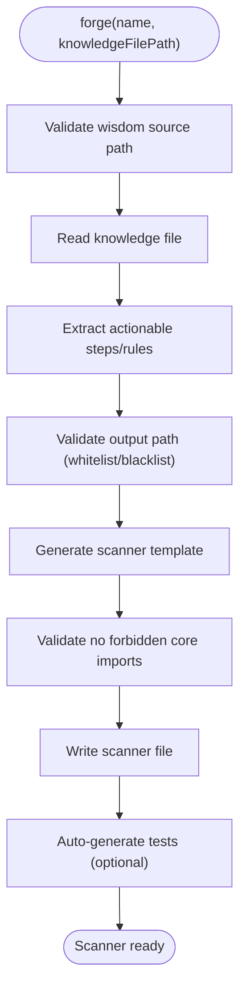

**Diagram sources**
- [Machinist.js:163-204](file://agent/core/Machinist.js#L163-L204)
- [Machinist.js:38-100](file://agent/core/Machinist.js#L38-L100)

**Section sources**
- [Machinist.js:30-279](file://agent/core/Machinist.js#L30-L279)

### NexusClock
Provides centralized, deterministic timestamps in UTC+8 for contracts and protocols.

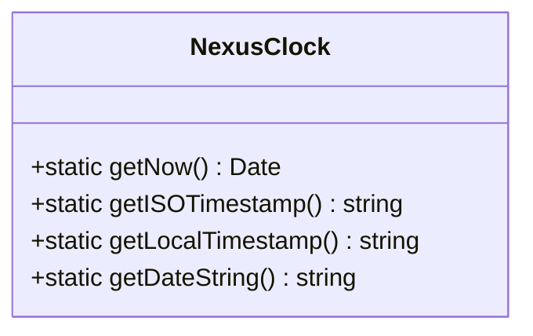

**Diagram sources**
- [NexusClock.js:5-40](file://agent/core/NexusClock.js#L5-L40)

**Section sources**
- [NexusClock.js:5-40](file://agent/core/NexusClock.js#L5-L40)

### ParallelRunner
Controls concurrency for parallel task execution with configurable limits and robust error handling.

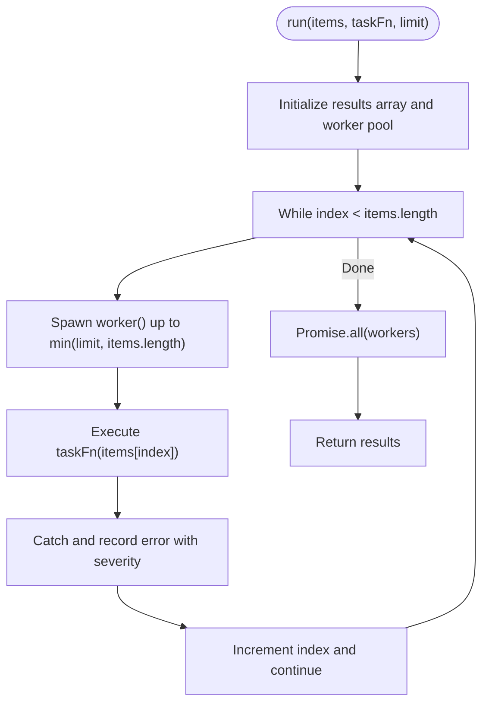

**Diagram sources**
- [ParallelRunner.js:13-36](file://agent/core/ParallelRunner.js#L13-L36)

**Section sources**
- [ParallelRunner.js:6-40](file://agent/core/ParallelRunner.js#L6-L40)

### SandboxExecutor
Executes plugins in worker threads with strict sandboxing:
- Path traversal prevention via resolved absolute paths and allowed directory checks.
- Manifest-based allow-list enforcement.
- Timeout protection and worker lifecycle management.

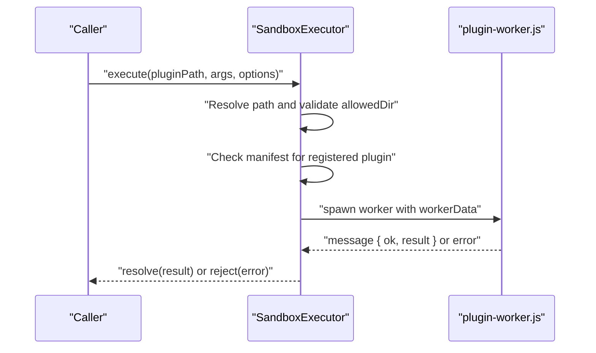

**Diagram sources**
- [SandboxExecutor.js:16-76](file://agent/core/SandboxExecutor.js#L16-L76)

**Section sources**
- [SandboxExecutor.js:9-80](file://agent/core/SandboxExecutor.js#L9-L80)

### TaskProtocol
Defines the canonical schema for inter-agent communication with validation and tracing.

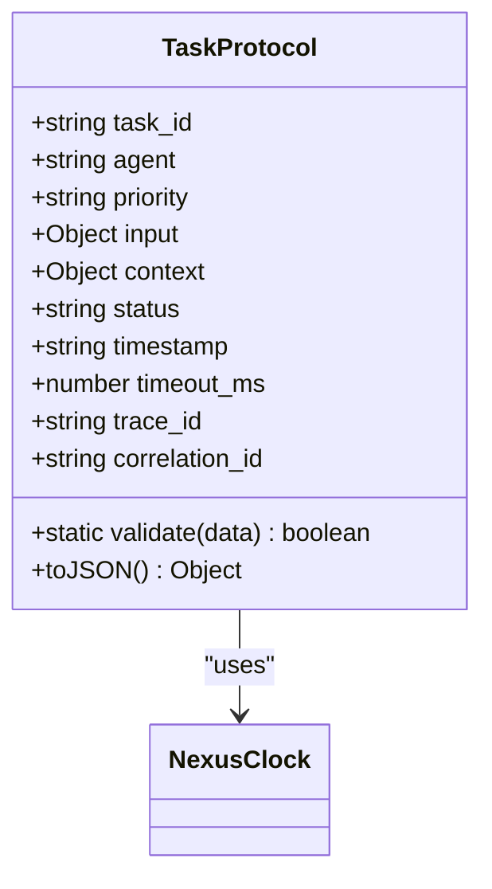

**Diagram sources**
- [TaskProtocol.js:3-54](file://agent/core/TaskProtocol.js#L3-L54)
- [NexusClock.js:5-40](file://agent/core/NexusClock.js#L5-L40)

**Section sources**
- [TaskProtocol.js:3-54](file://agent/core/TaskProtocol.js#L3-L54)

### Orchestrator
Routes tasks to agents, integrates with AgentRegistry, and persists dead-letter queue entries.

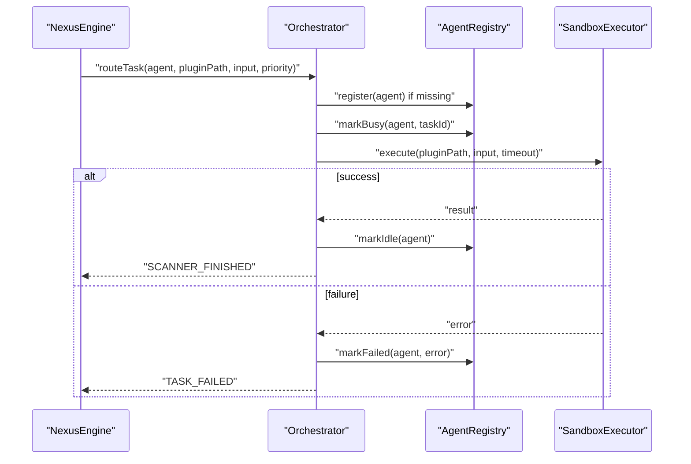

**Diagram sources**
- [Orchestrator.js:58-136](file://agent/core/Orchestrator.js#L58-L136)
- [AgentRegistry.js:17-73](file://agent/core/AgentRegistry.js#L17-L73)
- [SandboxExecutor.js:16-76](file://agent/core/SandboxExecutor.js#L16-L76)

**Section sources**
- [Orchestrator.js:15-239](file://agent/core/Orchestrator.js#L15-L239)

### ResourceMonitor
Monitors CPU and memory usage and recommends actions based on thresholds.

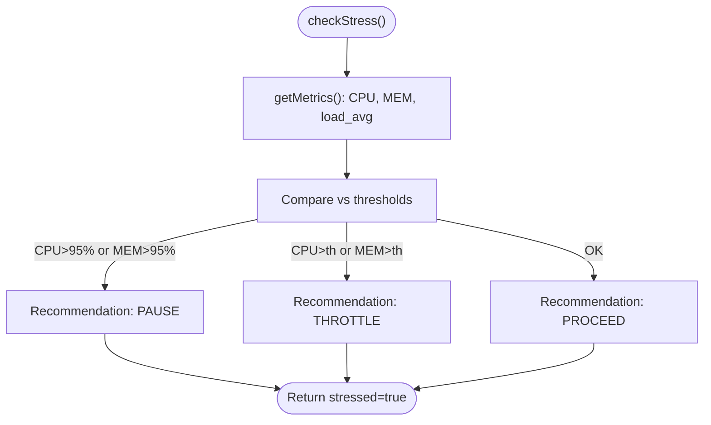

**Diagram sources**
- [ResourceMonitor.js:66-96](file://agent/core/ResourceMonitor.js#L66-L96)

**Section sources**
- [ResourceMonitor.js:9-100](file://agent/core/ResourceMonitor.js#L9-L100)

### WorktreeManager
Optional Git worktree isolation for feature development with async command execution and timeouts.

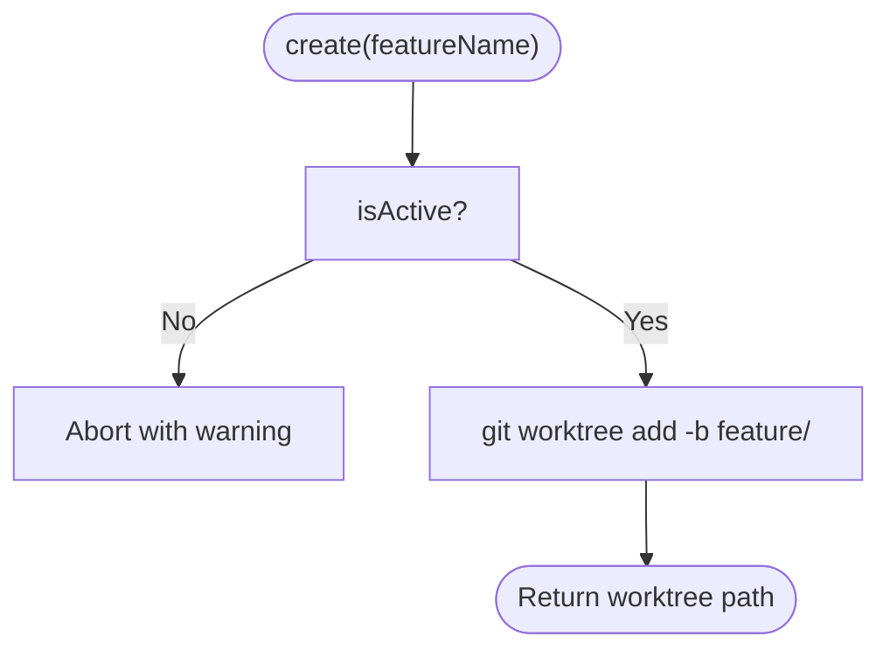

**Diagram sources**
- [WorktreeManager.js:40-54](file://agent/core/WorktreeManager.js#L40-L54)

**Section sources**
- [WorktreeManager.js:13-110](file://agent/core/WorktreeManager.js#L13-L110)

### BasePhase
Base class for modular phases with logging and error handling.

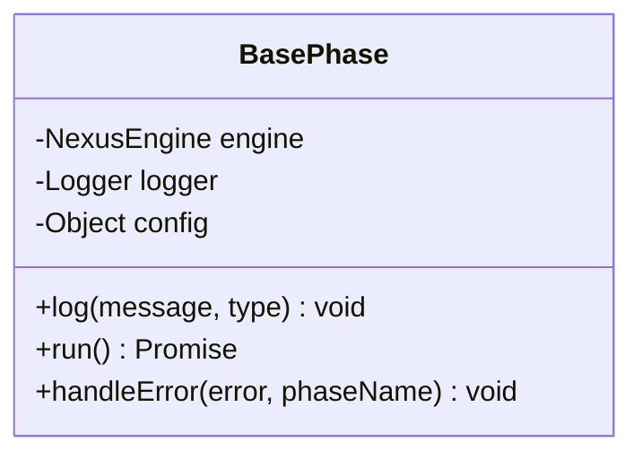

**Diagram sources**
- [BasePhase.js:6-28](file://agent/core/phases/BasePhase.js#L6-L28)

**Section sources**
- [BasePhase.js:6-28](file://agent/core/phases/BasePhase.js#L6-L28)

### Distiller
Knowledge consolidation and semantic enrichment pipeline:
- Standardizes filenames, distills JSON logs, shelves by categories, applies semantic tagging, builds neural maps, and rebuilds vector indices.

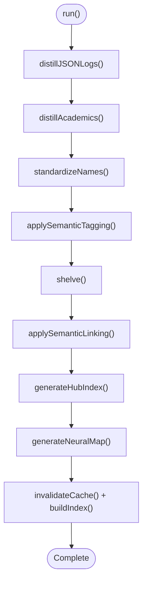

**Diagram sources**
- [Distiller.js:532-546](file://agent/core/Distiller.js#L532-L546)

**Section sources**
- [Distiller.js:10-550](file://agent/core/Distiller.js#L10-L550)

## Dependency Analysis
The following diagram highlights key dependencies among core modules:

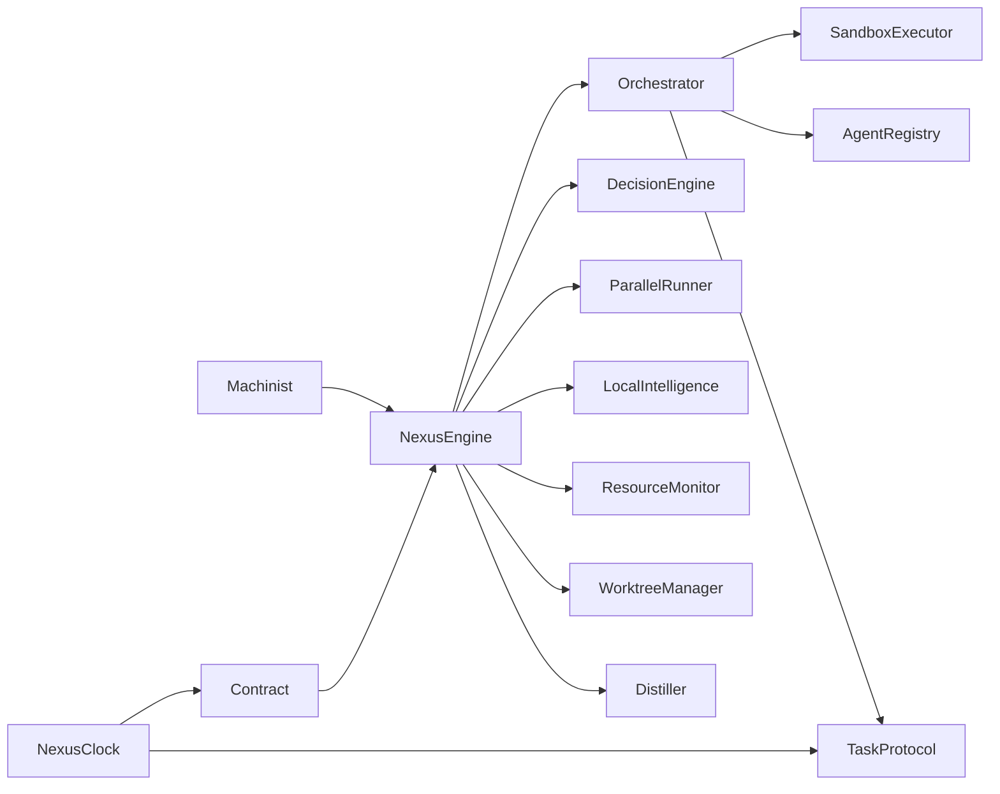

**Diagram sources**
- [NexusEngine.js:60-137](file://agent/core/NexusEngine.js#L60-L137)
- [Orchestrator.js:15-33](file://agent/core/Orchestrator.js#L15-L33)
- [SandboxExecutor.js:9-80](file://agent/core/SandboxExecutor.js#L9-L80)
- [AgentRegistry.js:6-124](file://agent/core/AgentRegistry.js#L6-L124)
- [TaskProtocol.js:3-54](file://agent/core/TaskProtocol.js#L3-L54)
- [DecisionEngine.js:18-73](file://agent/core/DecisionEngine.js#L18-L73)
- [ParallelRunner.js:6-40](file://agent/core/ParallelRunner.js#L6-L40)
- [LocalIntelligence.js:24-405](file://agent/core/LocalIntelligence.js#L24-L405)
- [ResourceMonitor.js:9-100](file://agent/core/ResourceMonitor.js#L9-L100)
- [WorktreeManager.js:13-110](file://agent/core/WorktreeManager.js#L13-L110)
- [Distiller.js:10-550](file://agent/core/Distiller.js#L10-L550)
- [Machinist.js:30-279](file://agent/core/Machinist.js#L30-L279)
- [Contract.js:5-73](file://agent/core/Contract.js#L5-L73)
- [NexusClock.js:5-40](file://agent/core/NexusClock.js#L5-L40)

**Section sources**
- [NexusEngine.js:60-137](file://agent/core/NexusEngine.js#L60-L137)
- [Orchestrator.js:15-33](file://agent/core/Orchestrator.js#L15-L33)
- [SandboxExecutor.js:9-80](file://agent/core/SandboxExecutor.js#L9-L80)
- [AgentRegistry.js:6-124](file://agent/core/AgentRegistry.js#L6-L124)
- [TaskProtocol.js:3-54](file://agent/core/TaskProtocol.js#L3-L54)
- [DecisionEngine.js:18-73](file://agent/core/DecisionEngine.js#L18-L73)
- [ParallelRunner.js:6-40](file://agent/core/ParallelRunner.js#L6-L40)
- [LocalIntelligence.js:24-405](file://agent/core/LocalIntelligence.js#L24-L405)
- [ResourceMonitor.js:9-100](file://agent/core/ResourceMonitor.js#L9-L100)
- [WorktreeManager.js:13-110](file://agent/core/WorktreeManager.js#L13-L110)
- [Distiller.js:10-550](file://agent/core/Distiller.js#L10-L550)
- [Machinist.js:30-279](file://agent/core/Machinist.js#L30-L279)
- [Contract.js:5-73](file://agent/core/Contract.js#L5-L73)
- [NexusClock.js:5-40](file://agent/core/NexusClock.js#L5-L40)

## Performance Considerations
- Concurrency control: ParallelRunner balances SSD throughput and AI execution with a default limit suitable for local environments.
- Safety-first inference: LocalIntelligence chunks prompts and validates outputs to prevent OOM and hallucinations.
- Resource-aware orchestration: ResourceMonitor provides real CPU measurements and throttling recommendations to maintain stability.
- Lazy initialization: NexusEngine defers instantiation of heavy components until accessed, reducing startup overhead.
- Circuit breaker: LocalIntelligence’s circuit breaker prevents cascading failures during transient API issues.

[No sources needed since this section provides general guidance]

## Troubleshooting Guide
Common issues and diagnostics:
- Stuck agents: Use AgentRegistry.getStuckAgents() to detect agents exceeding the busy threshold; address underlying task failures.
- Task timeouts: Orchestrator.executeTask() enforces timeouts; inspect SCANNER_TRIGGERED to SCANNER_FINISHED events and TASK_FAILED entries.
- Sandbox violations: SandboxExecutor rejects plugins outside allowed directories or unregistered in manifest; verify plugin paths and manifest entries.
- Contract violations: Contract.validate() throws on missing fields; ensure AuditReport and ImplementationPlan conform to required schemas.
- Resource stress: ResourceMonitor.checkStress() returns recommendations; reduce concurrency or pause operations when thresholds are exceeded.
- Dead letter queue: Orchestrator persists failed tasks; inspect logs/dead_letter_queue.json for permanent failures and retry patterns.

**Section sources**
- [AgentRegistry.js:80-86](file://agent/core/AgentRegistry.js#L80-L86)
- [Orchestrator.js:167-207](file://agent/core/Orchestrator.js#L167-L207)
- [SandboxExecutor.js:21-43](file://agent/core/SandboxExecutor.js#L21-L43)
- [Contract.js:16-21](file://agent/core/Contract.js#L16-L21)
- [ResourceMonitor.js:66-96](file://agent/core/ResourceMonitor.js#L66-L96)
- [Orchestrator.js:110-131](file://agent/core/Orchestrator.js#L110-L131)

## Conclusion
The NEXUS AI agent registry and management system provides a robust, safe, and scalable foundation for multi-agent orchestration. By combining a central registry, strict contracts, intelligent decision-making, bounded local intelligence, and secure execution, it enables reliable collaborative workflows. Evolutionary capabilities through Machinist and knowledge consolidation via Distiller ensure continuous improvement. Resource-aware design and comprehensive diagnostics support stable operation across diverse environments.

[No sources needed since this section summarizes without analyzing specific files]

## Appendices

### Examples

- Agent Registration
  - Register an agent with a unique identifier and human-readable name.
  - Mark agent busy when a task starts; mark idle upon completion; mark failed on persistent errors.
  - Periodically query getHealthReport() to monitor system-wide agent status.

  **Section sources**
  - [AgentRegistry.js:17-73](file://agent/core/AgentRegistry.js#L17-L73)
  - [AgentRegistry.js:89-104](file://agent/core/AgentRegistry.js#L89-L104)

- Contract Negotiation
  - Create AuditReport and ImplementationPlan instances with NexusClock timestamps.
  - Validate contracts using static validate() to ensure required fields are present.
  - Serialize to JSON for inter-agent transport and persistence.

  **Section sources**
  - [Contract.js:7-73](file://agent/core/Contract.js#L7-L73)
  - [NexusClock.js:19-21](file://agent/core/NexusClock.js#L19-L21)

- Collaborative Workflow
  - NexusEngine.runCycle() orchestrates discovery, audit, planning, implementation, execution, verification, and recording.
  - DecisionEngine.resolve() selects the best plan from multiple agent suggestions using context-aware weights.
  - Orchestrator.routeTask() publishes SCANNER_TRIGGERED events; SandboxExecutor executes plugins; AgentRegistry tracks agent states.

  **Section sources**
  - [NexusEngine.js:346-395](file://agent/core/NexusEngine.js#L346-L395)
  - [DecisionEngine.js:29-61](file://agent/core/DecisionEngine.js#L29-L61)
  - [Orchestrator.js:199-206](file://agent/core/Orchestrator.js#L199-L206)
  - [SandboxExecutor.js:16-76](file://agent/core/SandboxExecutor.js#L16-L76)
  - [AgentRegistry.js:35-58](file://agent/core/AgentRegistry.js#L35-L58)