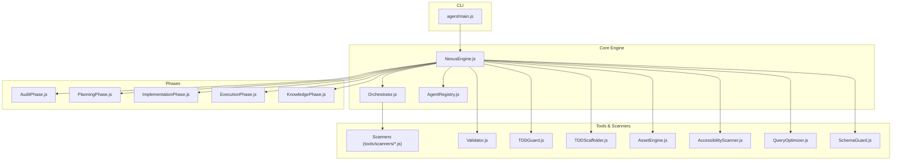
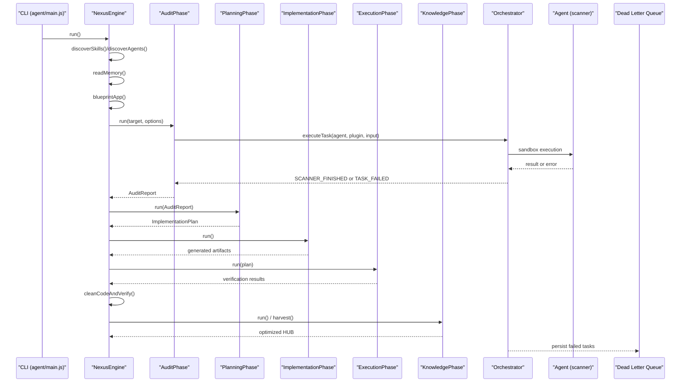
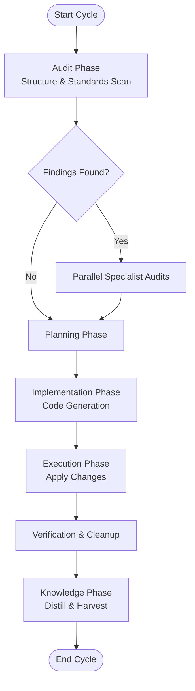
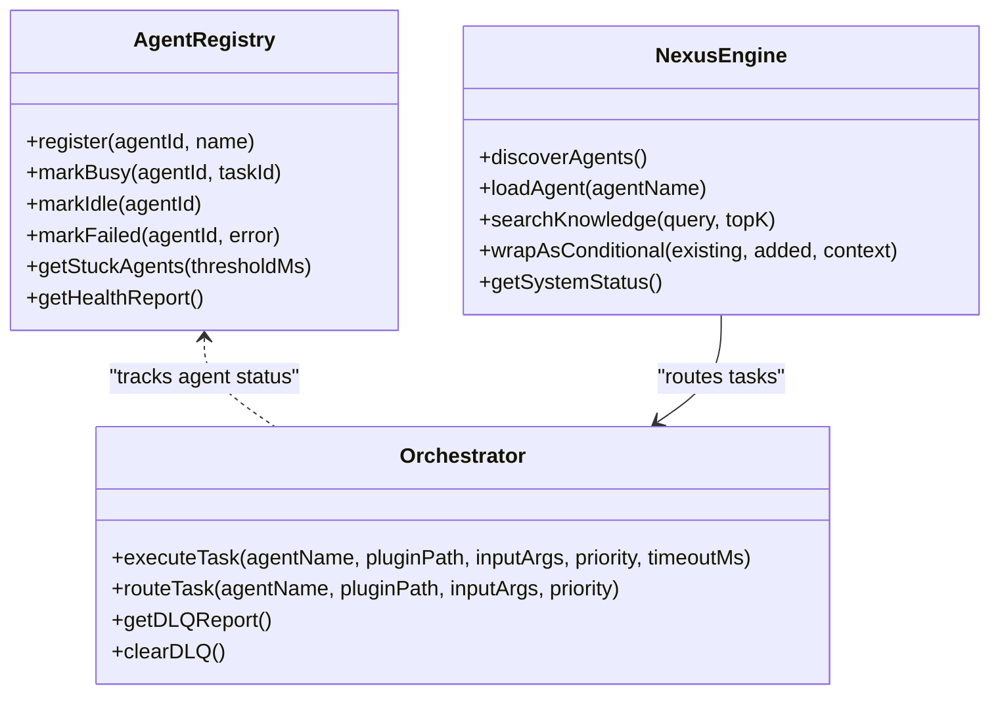
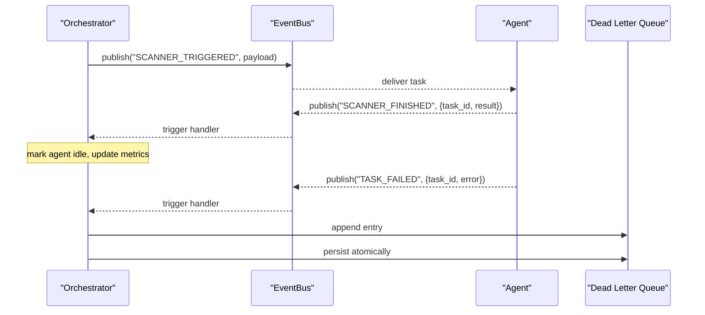
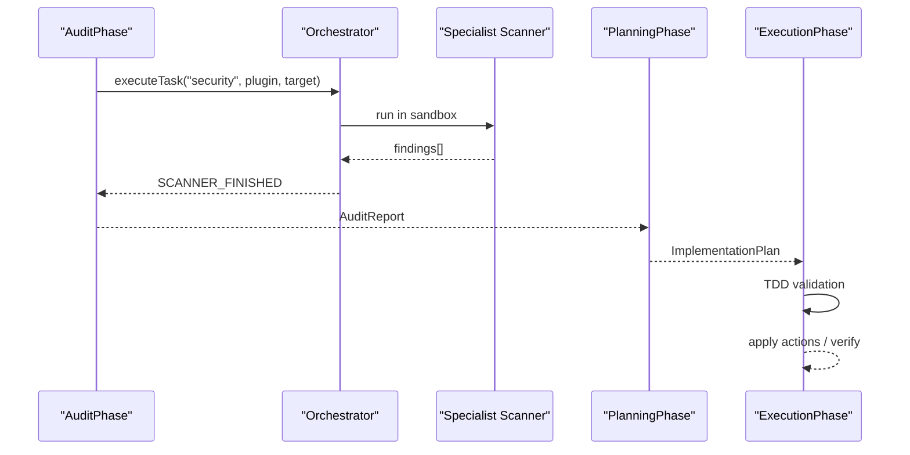
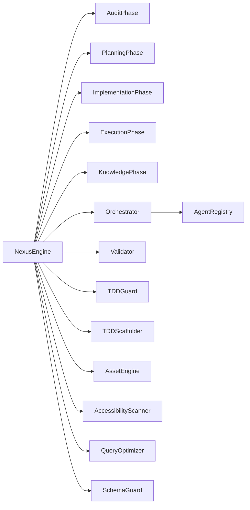

# Agent System

<cite>
**Referenced Files in This Document**
- [agent/main.js](file://agent/main.js)
- [agent/core/NexusEngine.js](file://agent/core/NexusEngine.js)
- [agent/core/Orchestrator.js](file://agent/core/Orchestrator.js)
- [agent/core/AgentRegistry.js](file://agent/core/AgentRegistry.js)
- [agent/core/phases/AuditPhase.js](file://agent/core/phases/AuditPhase.js)
- [agent/core/phases/PlanningPhase.js](file://agent/core/phases/PlanningPhase.js)
- [agent/core/phases/ImplementationPhase.js](file://agent/core/phases/ImplementationPhase.js)
- [agent/core/phases/ExecutionPhase.js](file://agent/core/phases/ExecutionPhase.js)
- [agent/core/phases/KnowledgePhase.js](file://agent/core/phases/KnowledgePhase.js)
</cite>

## Table of Contents
1. [Introduction](#introduction)
2. [Project Structure](#project-structure)
3. [Core Components](#core-components)
4. [Architecture Overview](#architecture-overview)
5. [Detailed Component Analysis](#detailed-component-analysis)
6. [Dependency Analysis](#dependency-analysis)
7. [Performance Considerations](#performance-considerations)
8. [Troubleshooting Guide](#troubleshooting-guide)
9. [Conclusion](#conclusion)
10. [Appendices](#appendices)

## Introduction
This document explains the NEXUS AI agent system architecture and its multi-phase lifecycle. The system orchestrates autonomous agents across five phases: Audit, Planning, Implementation, Execution, and Knowledge. It includes agent classification, prompt engineering patterns, specialized agent capabilities, collaboration protocols, and decision-making mechanisms. The goal is to enable end-to-end autonomous software engineering cycles with robust governance, memory, and self-healing.

## Project Structure
The agent system is organized around a core engine that coordinates specialized phases, agents, and tools. Key areas:
- Core engine and orchestration: NexusEngine, Orchestrator, AgentRegistry
- Lifecycle phases: AuditPhase, PlanningPhase, ImplementationPhase, ExecutionPhase, KnowledgePhase
- Prompts and workflows: agent/prompts and agent/workflows
- Tools and scanners: security, accessibility, schema, query optimization, TDD scaffolding, validators
- Memory and knowledge: memory/ and golden/harvest
- CLI entrypoint: agent/main.js

**Diagram sources**
- [agent/main.js:1-316](file://agent/main.js#L1-L316)
- [agent/core/NexusEngine.js:1-1119](file://agent/core/NexusEngine.js#L1-L1119)
- [agent/core/Orchestrator.js:1-239](file://agent/core/Orchestrator.js#L1-L239)
- [agent/core/AgentRegistry.js:1-124](file://agent/core/AgentRegistry.js#L1-L124)
- [agent/core/phases/AuditPhase.js:1-189](file://agent/core/phases/AuditPhase.js#L1-L189)
- [agent/core/phases/PlanningPhase.js:1-73](file://agent/core/phases/PlanningPhase.js#L1-L73)
- [agent/core/phases/ImplementationPhase.js:1-1053](file://agent/core/phases/ImplementationPhase.js#L1-L1053)
- [agent/core/phases/ExecutionPhase.js:1-937](file://agent/core/phases/ExecutionPhase.js#L1-L937)
- [agent/core/phases/KnowledgePhase.js:1-104](file://agent/core/phases/KnowledgePhase.js#L1-L104)

**Section sources**
- [agent/main.js:1-316](file://agent/main.js#L1-L316)
- [agent/core/NexusEngine.js:1-1119](file://agent/core/NexusEngine.js#L1-L1119)

## Core Components
- NexusEngine: Central coordinator that initializes subsystems, discovers skills and agents, orchestrates phases, and manages memory and knowledge.
- Orchestrator: Event-driven task router with timeouts, retries, and Dead Letter Queue (DLQ) persistence.
- AgentRegistry: Global registry tracking agent health, status, and activity to detect stuck agents.
- Phases: Modular lifecycle stages implementing Audit, Planning, Implementation, Execution, and Knowledge.
- Tools and Scanners: Domain-specific utilities for security, accessibility, schema validation, query optimization, asset optimization, and TDD enforcement.

Key responsibilities:
- Lifecycle orchestration and state transitions
- Parallel execution with bounded concurrency
- Persistent logging and error handling
- Knowledge harvesting and distillation
- Self-healing and stability loops

**Section sources**
- [agent/core/NexusEngine.js:1-1119](file://agent/core/NexusEngine.js#L1-L1119)
- [agent/core/Orchestrator.js:1-239](file://agent/core/Orchestrator.js#L1-L239)
- [agent/core/AgentRegistry.js:1-124](file://agent/core/AgentRegistry.js#L1-L124)

## Architecture Overview
The system follows a modular, event-driven architecture:
- CLI invokes NexusEngine to run a full cycle or individual phases.
- NexusEngine delegates to specialized phases, which may activate agents via Orchestrator.
- Agents execute tasks in isolated sandboxes, publish events, and update AgentRegistry.
- Knowledge is continuously distilled and stored in memory for reuse.

**Diagram sources**
- [agent/main.js:1-316](file://agent/main.js#L1-L316)
- [agent/core/NexusEngine.js:1-1119](file://agent/core/NexusEngine.js#L1-L1119)
- [agent/core/Orchestrator.js:1-239](file://agent/core/Orchestrator.js#L1-L239)
- [agent/core/phases/AuditPhase.js:1-189](file://agent/core/phases/AuditPhase.js#L1-L189)
- [agent/core/phases/PlanningPhase.js:1-73](file://agent/core/phases/PlanningPhase.js#L1-L73)
- [agent/core/phases/ImplementationPhase.js:1-1053](file://agent/core/phases/ImplementationPhase.js#L1-L1053)
- [agent/core/phases/ExecutionPhase.js:1-937](file://agent/core/phases/ExecutionPhase.js#L1-L937)
- [agent/core/phases/KnowledgePhase.js:1-104](file://agent/core/phases/KnowledgePhase.js#L1-L104)

## Detailed Component Analysis

### Multi-Phase Lifecycle
- Audit Phase: Scans project structure, validates standards, runs parallel specialists, and aggregates findings into an audit report.
- Planning Phase: Translates findings into actionable tasks with rationales and recommendations.
- Implementation Phase: Generates models, migrations, Livewire components, routes, policies, factories, and seeders; bootstraps application dependencies.
- Execution Phase: Applies modifications with TDD checks, asset optimization, and verification; performs cleanup and stability checks.
- Knowledge Phase: Optimizes memory, distills knowledge, and harvests external artifacts into the HUB.

**Diagram sources**
- [agent/core/phases/AuditPhase.js:1-189](file://agent/core/phases/AuditPhase.js#L1-L189)
- [agent/core/phases/PlanningPhase.js:1-73](file://agent/core/phases/PlanningPhase.js#L1-L73)
- [agent/core/phases/ImplementationPhase.js:1-1053](file://agent/core/phases/ImplementationPhase.js#L1-L1053)
- [agent/core/phases/ExecutionPhase.js:1-937](file://agent/core/phases/ExecutionPhase.js#L1-L937)
- [agent/core/phases/KnowledgePhase.js:1-104](file://agent/core/phases/KnowledgePhase.js#L1-L104)

**Section sources**
- [agent/core/phases/AuditPhase.js:1-189](file://agent/core/phases/AuditPhase.js#L1-L189)
- [agent/core/phases/PlanningPhase.js:1-73](file://agent/core/phases/PlanningPhase.js#L1-L73)
- [agent/core/phases/ImplementationPhase.js:1-1053](file://agent/core/phases/ImplementationPhase.js#L1-L1053)
- [agent/core/phases/ExecutionPhase.js:1-937](file://agent/core/phases/ExecutionPhase.js#L1-L937)
- [agent/core/phases/KnowledgePhase.js:1-104](file://agent/core/phases/KnowledgePhase.js#L1-L104)

### Agent Classification and Prompt Engineering Patterns
- Classification: Agents are discovered from prompt directories and classified by filename segments and content metadata (domain tags extracted from filenames, roles, focus areas, and keyword patterns).
- Prompt patterns: Each agent prompt defines a role, focus area, and domain keywords. The engine extracts tags and metadata to power semantic indexing and skill discovery.
- Specialized agents: The system supports hundreds of specialized agents covering domains such as security, UX/UI, SEO/performance, database architecture, VCS, documentation, Laravel ecosystem, payment integrations, and more.

**Diagram sources**
- [agent/core/AgentRegistry.js:1-124](file://agent/core/AgentRegistry.js#L1-L124)
- [agent/core/Orchestrator.js:1-239](file://agent/core/Orchestrator.js#L1-L239)
- [agent/core/NexusEngine.js:1-1119](file://agent/core/NexusEngine.js#L1-L1119)

**Section sources**
- [agent/core/NexusEngine.js:565-719](file://agent/core/NexusEngine.js#L565-L719)
- [agent/core/AgentRegistry.js:1-124](file://agent/core/AgentRegistry.js#L1-L124)
- [agent/core/Orchestrator.js:1-239](file://agent/core/Orchestrator.js#L1-L239)

### Collaboration Protocols and Decision-Making
- Event-driven collaboration: Orchestrator publishes task triggers and listens for completion or failure events. Tasks are retried up to a configured limit with exponential backoff semantics implicitly enforced by the loop.
- Dead Letter Queue: Permanently failed tasks are persisted atomically to disk for later inspection and remediation.
- Decision-making: NexusEngine enforces pipeline invariants (e.g., Planning requires a valid Audit Report; Execution requires an approved Plan). It also applies TDD gating and auto-scaffolding when changes touch test-sensitive files.

**Diagram sources**
- [agent/core/Orchestrator.js:1-239](file://agent/core/Orchestrator.js#L1-L239)

**Section sources**
- [agent/core/Orchestrator.js:1-239](file://agent/core/Orchestrator.js#L1-L239)
- [agent/core/NexusEngine.js:346-395](file://agent/core/NexusEngine.js#L346-L395)

### Examples of Agent Interactions and Workflow Orchestration
- Parallel specialist audits: During Audit Phase, multiple scanners run concurrently with bounded concurrency to reduce total runtime on constrained hardware.
- TDD enforcement: Execution Phase validates risky changes against TDD rules and generates scaffolds when necessary.
- Self-healing: Execution Phase includes a deterministic pre-heal and an AI-based healing mode that parses logs and replaces affected files with corrected content.

**Diagram sources**
- [agent/core/phases/AuditPhase.js:1-189](file://agent/core/phases/AuditPhase.js#L1-L189)
- [agent/core/Orchestrator.js:1-239](file://agent/core/Orchestrator.js#L1-L239)
- [agent/core/phases/ExecutionPhase.js:1-937](file://agent/core/phases/ExecutionPhase.js#L1-L937)

**Section sources**
- [agent/core/phases/AuditPhase.js:70-119](file://agent/core/phases/AuditPhase.js#L70-L119)
- [agent/core/phases/ExecutionPhase.js:24-83](file://agent/core/phases/ExecutionPhase.js#L24-L83)

## Dependency Analysis
- NexusEngine depends on:
  - Phases for lifecycle coordination
  - Orchestrator for task routing and sandbox execution
  - Tools for validations and optimizations
  - Memory systems for knowledge retrieval and storage
- Orchestrator depends on:
  - EventBus for decoupled communication
  - SandboxExecutor for secure task execution
  - AgentRegistry for agent health tracking
- Phases depend on:
  - NexusEngine for resource access and utilities
  - Tools for domain-specific validations

**Diagram sources**
- [agent/core/NexusEngine.js:1-1119](file://agent/core/NexusEngine.js#L1-L1119)
- [agent/core/Orchestrator.js:1-239](file://agent/core/Orchestrator.js#L1-L239)
- [agent/core/AgentRegistry.js:1-124](file://agent/core/AgentRegistry.js#L1-L124)

**Section sources**
- [agent/core/NexusEngine.js:1-1119](file://agent/core/NexusEngine.js#L1-L1119)

## Performance Considerations
- Concurrency control: ParallelRunner limits concurrent specialist scans to prevent memory pressure on low-resource systems.
- Sandboxing and timeouts: Orchestrator enforces per-task timeouts and retries to avoid hangs.
- Caching and dataset generation: ImplementationPhase caches generated code and writes dataset entries for downstream fine-tuning.
- Stability loops: ExecutionPhase includes iterative checks and self-healing to stabilize applications quickly.

[No sources needed since this section provides general guidance]

## Troubleshooting Guide
- Dead Letter Queue: Investigate permanently failed tasks via the DLQ report and clear it when needed.
- Stuck agents: Use AgentRegistry health report to identify agents stuck beyond a threshold.
- System status: NexusEngine exposes a real-time status endpoint to check resource utilization and agent health.
- Error logging: NexusEngine persists structured error logs for diagnosis.

**Section sources**
- [agent/core/Orchestrator.js:110-131](file://agent/core/Orchestrator.js#L110-L131)
- [agent/core/AgentRegistry.js:75-104](file://agent/core/AgentRegistry.js#L75-L104)
- [agent/core/NexusEngine.js:517-522](file://agent/core/NexusEngine.js#L517-L522)
- [agent/core/NexusEngine.js:507-515](file://agent/core/NexusEngine.js#L507-L515)

## Conclusion
The NEXUS AI agent system provides a robust, modular framework for autonomous software engineering. Its five-phase lifecycle, event-driven orchestration, and extensive agent ecosystem enable scalable, repeatable, and self-healing development cycles. The system’s emphasis on governance, memory, and safety nets ensures reliable operation across diverse domains and environments.

[No sources needed since this section summarizes without analyzing specific files]

## Appendices
- CLI usage and commands are documented in the CLI entrypoint, including run, audit, skills, agents, harvest, refactor, update-skills, distill, forge, status, sandbox, dlq, think, and review.
- The engine supports a blueprint-driven workflow for Laravel TALL stack applications and integrates with local AI for code generation and self-healing.

**Section sources**
- [agent/main.js:276-300](file://agent/main.js#L276-L300)
- [agent/core/NexusEngine.js:397-490](file://agent/core/NexusEngine.js#L397-L490)