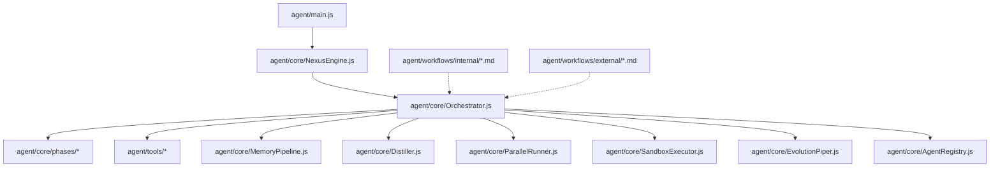
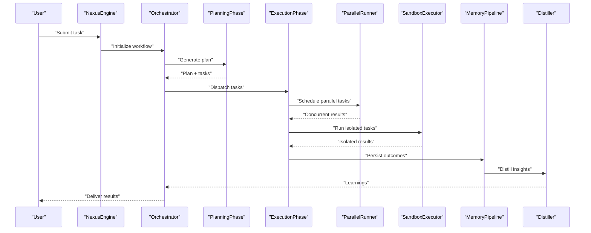
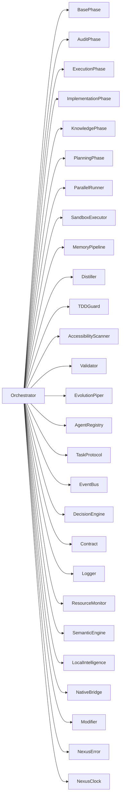

# Agent Workflows and Orchestration

<cite>
**Referenced Files in This Document**
- [agent/main.js](file://agent/main.js)
- [agent/core/NexusEngine.js](file://agent/core/NexusEngine.js)
- [agent/core/Orchestrator.js](file://agent/core/Orchestrator.js)
- [agent/core/phases/BasePhase.js](file://agent/core/phases/BasePhase.js)
- [agent/core/phases/AuditPhase.js](file://agent/core/phases/AuditPhase.js)
- [agent/core/phases/ExecutionPhase.js](file://agent/core/phases/ExecutionPhase.js)
- [agent/core/phases/ImplementationPhase.js](file://agent/core/phases/ImplementationPhase.js)
- [agent/core/phases/KnowledgePhase.js](file://agent/core/phases/KnowledgePhase.js)
- [agent/core/phases/PlanningPhase.js](file://agent/core/phases/PlanningPhase.js)
- [agent/core/Distiller.js](file://agent/core/Distiller.js)
- [agent/core/MemoryGovernor.js](file://agent/core/MemoryGovernor.js)
- [agent/core/MemoryPipeline.js](file://agent/core/MemoryPipeline.js)
- [agent/core/EvolutionPiper.js](file://agent/core/EvolutionPiper.js)
- [agent/core/ParallelRunner.js](file://agent/core/ParallelRunner.js)
- [agent/core/SandboxExecutor.js](file://agent/core/SandboxExecutor.js)
- [agent/core/TaskProtocol.js](file://agent/core/TaskProtocol.js)
- [agent/core/DecisionEngine.js](file://agent/core/DecisionEngine.js)
- [agent/core/EventBus.js](file://agent/core/EventBus.js)
- [agent/core/LaravelArchitect.js](file://agent/core/LaravelArchitect.js)
- [agent/core/Machinist.js](file://agent/core/Machinist.js)
- [agent/core/WorktreeManager.js](file://agent/core/WorktreeManager.js)
- [agent/core/LocalIntelligence.js](file://agent/core/LocalIntelligence.js)
- [agent/core/NativeBridge.js](file://agent/core/NativeBridge.js)
- [agent/core/ResourceMonitor.js](file://agent/core/ResourceMonitor.js)
- [agent/core/SemanticEngine.js](file://agent/core/SemanticEngine.js)
- [agent/core/Contract.js](file://agent/core/Contract.js)
- [agent/core/Logger.js](file://agent/core/Logger.js)
- [agent/core/NexusClock.js](file://agent/core/NexusClock.js)
- [agent/core/AgentRegistry.js](file://agent/core/AgentRegistry.js)
- [agent/core/Modifier.js](file://agent/core/Modifier.js)
- [agent/core/NexusError.js](file://agent/core/NexusError.js)
- [agent/workflows/internal/agent-classification.md](file://agent/workflows/internal/agent-classification.md)
- [agent/workflows/internal/audit-workflow.md](file://agent/workflows/internal/audit-workflow.md)
- [agent/workflows/internal/educational-audit.md](file://agent/workflows/internal/educational-audit.md)
- [agent/workflows/internal/execution-workflow.md](file://agent/workflows/internal/execution-workflow.md)
- [agent/workflows/internal/knowledge-liaison.md](file://agent/workflows/internal/knowledge-liaison.md)
- [agent/workflows/internal/loop-testing.md](file://agent/workflows/internal/loop-testing.md)
- [agent/workflows/internal/nexus-pipeline.md](file://agent/workflows/internal/nexus-pipeline.md)
- [agent/workflows/internal/pattern-recognition.md](file://agent/workflows/internal/pattern-recognition.md)
- [agent/workflows/internal/planning-workflow.md](file://agent/workflows/internal/planning-workflow.md)
- [agent/workflows/internal/skill-evolution.md](file://agent/workflows/internal/skill-evolution.md)
- [agent/workflows/external/distribution-workflow.md](file://agent/workflows/external/distribution-workflow.md)
- [agent/workflows/external/harvest-workflow.md](file://agent/workflows/external/harvest-workflow.md)
- [agent/tools/TDDGuard.js](file://agent/tools/TDDGuard.js)
- [agent/tools/RetroDatasetExtractor.js](file://agent/tools/RetroDatasetExtractor.js)
- [agent/tools/AccessibilityScanner.js](file://agent/tools/AccessibilityScanner.js)
- [agent/tools/Validator.js](file://agent/tools/Validator.js)
- [agent/scripts/tdd_automated_loop.js](file://agent/scripts/tdd_automated_loop.js)
- [tests/TDD/EvolutionPiper.test.js](file://tests/TDD/EvolutionPiper.test.js)
- [tests/TDD/Machinist.test.js](file://tests/TDD/Machinist.test.js)
- [tests/TDD/MemoryGovernor.test.js](file://tests/TDD/MemoryGovernor.test.js)
- [tests/TDD/Orchestrator.test.js](file://tests/TDD/Orchestrator.test.js)
- [tests/TDD/nexus-engine.test.js](file://tests/TDD/nexus-engine.test.js)
- [tests/TDD/distiller.test.js](file://tests/TDD/distiller.test.js)
- [tests/TDD/TDDGuard.test.js](file://tests/TDD/TDDGuard.test.js)
- [tests/pipeline_internal_test.js](file://tests/pipeline_internal_test.js)
- [memory/INDEX.md](file://memory/INDEX.md)
- [memory/INDEX_NEURAL_MAP.md](file://memory/INDEX_NEURAL_MAP.md)
- [README.md](file://README.md)
</cite>

## Table of Contents
1. [Introduction](#introduction)
2. [Project Structure](#project-structure)
3. [Core Components](#core-components)
4. [Architecture Overview](#architecture-overview)
5. [Detailed Component Analysis](#detailed-component-analysis)
6. [Dependency Analysis](#dependency-analysis)
7. [Performance Considerations](#performance-considerations)
8. [Troubleshooting Guide](#troubleshooting-guide)
9. [Conclusion](#conclusion)
10. [Appendices](#appendices)

## Introduction
This document explains the NEXUS AI agent workflows and orchestration patterns. It covers internal workflows such as agent classification, audit workflows, educational auditing, execution workflows, knowledge liaison processes, loop testing procedures, nexus pipeline operations, pattern recognition workflows, planning workflows, and skill evolution processes. It also documents external workflows for distribution and harvest operations. The guide emphasizes workflow orchestration, decision points, parallel processing capabilities, and integration patterns, and provides examples of workflow execution and agent collaboration scenarios.

## Project Structure
The agent subsystem centers around a core engine and orchestrator that coordinate specialized phases and tools. Workflows are documented in dedicated markdown files and integrated with memory systems and test suites.

**Diagram sources**
- [agent/main.js](file://agent/main.js)
- [agent/core/NexusEngine.js](file://agent/core/NexusEngine.js)
- [agent/core/Orchestrator.js](file://agent/core/Orchestrator.js)
- [agent/core/phases/BasePhase.js](file://agent/core/phases/BasePhase.js)
- [agent/core/MemoryPipeline.js](file://agent/core/MemoryPipeline.js)
- [agent/core/Distiller.js](file://agent/core/Distiller.js)
- [agent/core/ParallelRunner.js](file://agent/core/ParallelRunner.js)
- [agent/core/SandboxExecutor.js](file://agent/core/SandboxExecutor.js)
- [agent/core/EvolutionPiper.js](file://agent/core/EvolutionPiper.js)
- [agent/core/AgentRegistry.js](file://agent/core/AgentRegistry.js)
- [agent/workflows/internal/agent-classification.md](file://agent/workflows/internal/agent-classification.md)
- [agent/workflows/external/distribution-workflow.md](file://agent/workflows/external/distribution-workflow.md)

**Section sources**
- [agent/main.js](file://agent/main.js)
- [agent/core/NexusEngine.js](file://agent/core/NexusEngine.js)
- [agent/core/Orchestrator.js](file://agent/core/Orchestrator.js)

## Core Components
- NexusEngine: Central runtime that initializes and coordinates subsystems.
- Orchestrator: Manages workflow execution, decision-making, and resource allocation.
- Phases: Modular workflow stages (Audit, Execution, Implementation, Knowledge, Planning).
- Tools: Specialized utilities for testing, scanning, scaffolding, and validation.
- MemoryPipeline: Manages memory ingestion, normalization, and retrieval.
- Distiller: Extracts and distills insights from raw and operational memory.
- ParallelRunner: Executes tasks concurrently.
- SandboxExecutor: Runs isolated tasks for safety and reproducibility.
- EvolutionPiper: Drives recursive skill and agent evolution.
- AgentRegistry: Tracks and manages agent instances and capabilities.
- WorktreeManager: Manages file system workspaces for collaborative tasks.
- DecisionEngine: Provides decision logic for routing and branching.
- EventBus: Publishes and subscribes to cross-component events.
- TaskProtocol: Defines standardized task contracts and handoffs.
- Contract: Enforces protocol-level guarantees.
- Logger: Standardized logging across components.
- ResourceMonitor: Observes and reports resource usage.
- SemanticEngine: Powers semantic search and clustering.
- LocalIntelligence: Encapsulates local reasoning and contextual awareness.
- NativeBridge: Integrates native OS/browser capabilities.
- Modifier: Applies controlled modifications to artifacts.
- NexusError: Centralized error handling and propagation.
- NexusClock: Provides temporal coordination for workflows.

**Section sources**
- [agent/core/NexusEngine.js](file://agent/core/NexusEngine.js)
- [agent/core/Orchestrator.js](file://agent/core/Orchestrator.js)
- [agent/core/phases/BasePhase.js](file://agent/core/phases/BasePhase.js)
- [agent/core/phases/AuditPhase.js](file://agent/core/phases/AuditPhase.js)
- [agent/core/phases/ExecutionPhase.js](file://agent/core/phases/ExecutionPhase.js)
- [agent/core/phases/ImplementationPhase.js](file://agent/core/phases/ImplementationPhase.js)
- [agent/core/phases/KnowledgePhase.js](file://agent/core/phases/KnowledgePhase.js)
- [agent/core/phases/PlanningPhase.js](file://agent/core/phases/PlanningPhase.js)
- [agent/core/Distiller.js](file://agent/core/Distiller.js)
- [agent/core/MemoryPipeline.js](file://agent/core/MemoryPipeline.js)
- [agent/core/EvolutionPiper.js](file://agent/core/EvolutionPiper.js)
- [agent/core/ParallelRunner.js](file://agent/core/ParallelRunner.js)
- [agent/core/SandboxExecutor.js](file://agent/core/SandboxExecutor.js)
- [agent/core/TaskProtocol.js](file://agent/core/TaskProtocol.js)
- [agent/core/DecisionEngine.js](file://agent/core/DecisionEngine.js)
- [agent/core/EventBus.js](file://agent/core/EventBus.js)
- [agent/core/AgentRegistry.js](file://agent/core/AgentRegistry.js)
- [agent/core/WorktreeManager.js](file://agent/core/WorktreeManager.js)
- [agent/core/Contract.js](file://agent/core/Contract.js)
- [agent/core/Logger.js](file://agent/core/Logger.js)
- [agent/core/NexusClock.js](file://agent/core/NexusClock.js)
- [agent/core/ResourceMonitor.js](file://agent/core/ResourceMonitor.js)
- [agent/core/SemanticEngine.js](file://agent/core/SemanticEngine.js)
- [agent/core/LocalIntelligence.js](file://agent/core/LocalIntelligence.js)
- [agent/core/NativeBridge.js](file://agent/core/NativeBridge.js)
- [agent/core/Modifier.js](file://agent/core/Modifier.js)
- [agent/core/NexusError.js](file://agent/core/NexusError.js)

## Architecture Overview
The system is orchestrated by the NexusEngine, which delegates to the Orchestrator. The Orchestrator coordinates phases, tools, memory, and evolution while maintaining event-driven communication via the EventBus. ParallelRunner enables concurrent execution, and SandboxExecutor isolates risky operations. MemoryPipeline integrates with Distiller and SemanticEngine to support knowledge retention and retrieval.

```mermaid
graph TB
subgraph "Runtime"
NE["NexusEngine"]
OR["Orchestrator"]
end
subgraph "Workflow Phases"
BP["BasePhase"]
AP["AuditPhase"]
EP["ExecutionPhase"]
IP["ImplementationPhase"]
KP["KnowledgePhase"]
PP["PlanningPhase"]
end
subgraph "Tools"
TG["TDDGuard"]
RD["RetroDatasetExtractor"]
AS["AccessibilityScanner"]
V["Validator"]
end
subgraph "Memory & Learning"
MP["MemoryPipeline"]
DI["Distiller"]
SE["SemanticEngine"]
end
subgraph "Execution"
PR["ParallelRunner"]
SX["SandboxExecutor"]
EV["EvolutionPiper"]
end
subgraph "Support"
EB["EventBus"]
DE["DecisionEngine"]
TP["TaskProtocol"]
AR["AgentRegistry"]
WT["WorktreeManager"]
RM["ResourceMonitor"]
LC["LocalIntelligence"]
NB["NativeBridge"]
MOD["Modifier"]
ERR["NexusError"]
CLK["NexusClock"]
end
NE --> OR
OR --> BP
OR --> AP
OR --> EP
OR --> IP
OR --> KP
OR --> PP
OR --> TG
OR --> RD
OR --> AS
OR --> V
OR --> MP
OR --> DI
OR --> SE
OR --> PR
OR --> SX
OR --> EV
OR --> EB
OR --> DE
OR --> TP
OR --> AR
OR --> WT
OR --> RM
OR --> LC
OR --> NB
OR --> MOD
OR --> ERR
OR --> CLK
```

**Diagram sources**
- [agent/core/NexusEngine.js](file://agent/core/NexusEngine.js)
- [agent/core/Orchestrator.js](file://agent/core/Orchestrator.js)
- [agent/core/phases/BasePhase.js](file://agent/core/phases/BasePhase.js)
- [agent/core/phases/AuditPhase.js](file://agent/core/phases/AuditPhase.js)
- [agent/core/phases/ExecutionPhase.js](file://agent/core/phases/ExecutionPhase.js)
- [agent/core/phases/ImplementationPhase.js](file://agent/core/phases/ImplementationPhase.js)
- [agent/core/phases/KnowledgePhase.js](file://agent/core/phases/KnowledgePhase.js)
- [agent/core/phases/PlanningPhase.js](file://agent/core/phases/PlanningPhase.js)
- [agent/core/ParallelRunner.js](file://agent/core/ParallelRunner.js)
- [agent/core/SandboxExecutor.js](file://agent/core/SandboxExecutor.js)
- [agent/core/EvolutionPiper.js](file://agent/core/EvolutionPiper.js)
- [agent/core/MemoryPipeline.js](file://agent/core/MemoryPipeline.js)
- [agent/core/Distiller.js](file://agent/core/Distiller.js)
- [agent/core/SemanticEngine.js](file://agent/core/SemanticEngine.js)
- [agent/core/EventBus.js](file://agent/core/EventBus.js)
- [agent/core/DecisionEngine.js](file://agent/core/DecisionEngine.js)
- [agent/core/TaskProtocol.js](file://agent/core/TaskProtocol.js)
- [agent/core/AgentRegistry.js](file://agent/core/AgentRegistry.js)
- [agent/core/WorktreeManager.js](file://agent/core/WorktreeManager.js)
- [agent/core/ResourceMonitor.js](file://agent/core/ResourceMonitor.js)
- [agent/core/LocalIntelligence.js](file://agent/core/LocalIntelligence.js)
- [agent/core/NativeBridge.js](file://agent/core/NativeBridge.js)
- [agent/core/Modifier.js](file://agent/core/Modifier.js)
- [agent/core/NexusError.js](file://agent/core/NexusError.js)
- [agent/core/NexusClock.js](file://agent/core/NexusClock.js)
- [agent/tools/TDDGuard.js](file://agent/tools/TDDGuard.js)
- [agent/tools/RetroDatasetExtractor.js](file://agent/tools/RetroDatasetExtractor.js)
- [agent/tools/AccessibilityScanner.js](file://agent/tools/AccessibilityScanner.js)
- [agent/tools/Validator.js](file://agent/tools/Validator.js)

## Detailed Component Analysis

### Internal Workflows

#### Agent Classification Workflow
- Purpose: Assign roles and capabilities to agents based on task profiles and skill matrices.
- Orchestration: Uses DecisionEngine to evaluate task requirements against agent profiles; registers outcomes via AgentRegistry; logs decisions with Logger.
- Collaboration: Integrates with TaskProtocol for standardized task intake and with MemoryPipeline for historical performance context.
- Decision points: Capability match thresholds, fallback strategies, and registry updates.
- Parallel processing: Optional parallel evaluation of candidate agents.
- Examples: Classification of testing specialists for TDD tasks, UI specialists for accessibility tasks.

**Section sources**
- [agent/workflows/internal/agent-classification.md](file://agent/workflows/internal/agent-classification.md)
- [agent/core/DecisionEngine.js](file://agent/core/DecisionEngine.js)
- [agent/core/AgentRegistry.js](file://agent/core/AgentRegistry.js)
- [agent/core/TaskProtocol.js](file://agent/core/TaskProtocol.js)
- [agent/core/Logger.js](file://agent/core/Logger.js)

#### Audit Workflow
- Purpose: Perform internal and external audits to validate system readiness and compliance.
- Orchestration: Orchestrator initiates AuditPhase; integrates with tools like AccessibilityScanner and Validator; aggregates findings via Distiller; publishes results through EventBus.
- Decision points: Severity thresholds, remediation triggers, and re-audit scheduling.
- Parallel processing: Multiple auditors can run concurrently on disjoint subsystems.
- Examples: Security audit, documentation coverage audit, performance audit.

**Section sources**
- [agent/workflows/internal/audit-workflow.md](file://agent/workflows/internal/audit-workflow.md)
- [agent/core/phases/AuditPhase.js](file://agent/core/phases/AuditPhase.js)
- [agent/tools/AccessibilityScanner.js](file://agent/tools/AccessibilityScanner.js)
- [agent/tools/Validator.js](file://agent/tools/Validator.js)
- [agent/core/Distiller.js](file://agent/core/Distiller.js)
- [agent/core/EventBus.js](file://agent/core/EventBus.js)

#### Educational Audit
- Purpose: Assess learning effectiveness and identify gaps in agent education and training.
- Orchestration: Uses RetroDatasetExtractor to gather historical learning data; evaluates patterns with SemanticEngine; generates recommendations via PlanningPhase.
- Decision points: Thresholds for knowledge retention, skill proficiency, and adaptive curriculum adjustments.
- Examples: Review of past TDD projects, skill mastery tracking, and curriculum alignment.

**Section sources**
- [agent/workflows/internal/educational-audit.md](file://agent/workflows/internal/educational-audit.md)
- [agent/tools/RetroDatasetExtractor.js](file://agent/tools/RetroDatasetExtractor.js)
- [agent/core/SemanticEngine.js](file://agent/core/SemanticEngine.js)
- [agent/core/phases/PlanningPhase.js](file://agent/core/phases/PlanningPhase.js)

#### Execution Workflow
- Purpose: Execute planned actions with safeguards and observability.
- Orchestration: ExecutionPhase coordinates with ParallelRunner for concurrency and SandboxExecutor for isolation; tracks progress via ResourceMonitor; updates MemoryPipeline with outcomes.
- Decision points: Safety checks, resource availability, and outcome validation.
- Parallel processing: Tasks are scheduled and executed in parallel where safe.
- Examples: Automated refactoring, asset generation, and deployment preparation.

**Section sources**
- [agent/workflows/internal/execution-workflow.md](file://agent/workflows/internal/execution-workflow.md)
- [agent/core/phases/ExecutionPhase.js](file://agent/core/phases/ExecutionPhase.js)
- [agent/core/ParallelRunner.js](file://agent/core/ParallelRunner.js)
- [agent/core/SandboxExecutor.js](file://agent/core/SandboxExecutor.js)
- [agent/core/ResourceMonitor.js](file://agent/core/ResourceMonitor.js)
- [agent/core/MemoryPipeline.js](file://agent/core/MemoryPipeline.js)

#### Knowledge Liaison Process
- Purpose: Bridge knowledge sources and maintain coherent understanding across domains.
- Orchestration: KnowledgePhase collaborates with MemoryPipeline and Distiller; leverages SemanticEngine for semantic alignment; ensures consistency via Contract and TaskProtocol.
- Decision points: Source trustworthiness, relevance scoring, and consolidation strategies.
- Examples: Cross-domain knowledge synthesis, policy alignment, and semantic indexing.

**Section sources**
- [agent/workflows/internal/knowledge-liaison.md](file://agent/workflows/internal/knowledge-liaison.md)
- [agent/core/phases/KnowledgePhase.js](file://agent/core/phases/KnowledgePhase.js)
- [agent/core/MemoryPipeline.js](file://agent/core/MemoryPipeline.js)
- [agent/core/Distiller.js](file://agent/core/Distiller.js)
- [agent/core/SemanticEngine.js](file://agent/core/SemanticEngine.js)
- [agent/core/Contract.js](file://agent/core/Contract.js)
- [agent/core/TaskProtocol.js](file://agent/core/TaskProtocol.js)

#### Loop Testing Procedures
- Purpose: Automate iterative testing loops to improve quality and reduce regressions.
- Orchestration: Orchestrator invokes TDDGuard and related tools; executes automated loop via script; monitors outcomes and triggers re-tests.
- Decision points: Pass/fail criteria, threshold tuning, and loop termination conditions.
- Examples: Continuous integration testing, regression detection, and automated fix verification.

**Section sources**
- [agent/workflows/internal/loop-testing.md](file://agent/workflows/internal/loop-testing.md)
- [agent/tools/TDDGuard.js](file://agent/tools/TDDGuard.js)
- [agent/scripts/tdd_automated_loop.js](file://agent/scripts/tdd_automated_loop.js)

#### Nexus Pipeline Operations
- Purpose: Define and manage the end-to-end pipeline from planning to delivery.
- Orchestration: Orchestrator coordinates phases and tools; NexusClock governs timing; MemoryGovernor ensures memory health; ParallelRunner optimizes throughput.
- Decision points: Stage gating, resource balancing, and quality gates.
- Examples: Feature development pipeline, release preparation pipeline, and maintenance pipeline.

**Section sources**
- [agent/workflows/internal/nexus-pipeline.md](file://agent/workflows/internal/nexus-pipeline.md)
- [agent/core/NexusClock.js](file://agent/core/NexusClock.js)
- [agent/core/MemoryGovernor.js](file://agent/core/MemoryGovernor.js)
- [agent/core/ParallelRunner.js](file://agent/core/ParallelRunner.js)

#### Pattern Recognition Workflow
- Purpose: Detect recurring patterns in tasks, errors, and solutions.
- Orchestration: Uses SemanticEngine and Distiller to cluster and classify patterns; stores insights in MemoryPipeline; informs future PlanningPhase decisions.
- Decision points: Pattern strength thresholds, novelty detection, and actionability.
- Examples: Bug pattern recognition, architectural anti-pattern detection, and solution reuse strategies.

**Section sources**
- [agent/workflows/internal/pattern-recognition.md](file://agent/workflows/internal/pattern-recognition.md)
- [agent/core/SemanticEngine.js](file://agent/core/SemanticEngine.js)
- [agent/core/Distiller.js](file://agent/core/Distiller.js)
- [agent/core/MemoryPipeline.js](file://agent/core/MemoryPipeline.js)

#### Planning Workflow
- Purpose: Generate actionable plans aligned with goals and constraints.
- Orchestration: PlanningPhase consumes inputs from KnowledgePhase and MemoryPipeline; applies DecisionEngine for prioritization; produces executable tasks via TaskProtocol.
- Decision points: Goal alignment, feasibility checks, and resource allocation.
- Examples: Sprint planning, release planning, and incident response planning.

**Section sources**
- [agent/workflows/internal/planning-workflow.md](file://agent/workflows/internal/planning-workflow.md)
- [agent/core/phases/PlanningPhase.js](file://agent/core/phases/PlanningPhase.js)
- [agent/core/DecisionEngine.js](file://agent/core/DecisionEngine.js)
- [agent/core/TaskProtocol.js](file://agent/core/TaskProtocol.js)

#### Skill Evolution Processes
- Purpose: Continuously evolve agent skills and capabilities.
- Orchestration: EvolutionPiper drives recursive improvements; integrates feedback from MemoryPipeline and Distiller; adjusts agent configurations via AgentRegistry.
- Decision points: Evolution thresholds, risk controls, and success metrics.
- Examples: Skill acquisition, capability refinement, and autonomous adaptation.

**Section sources**
- [agent/workflows/internal/skill-evolution.md](file://agent/workflows/internal/skill-evolution.md)
- [agent/core/EvolutionPiper.js](file://agent/core/EvolutionPiper.js)
- [agent/core/MemoryPipeline.js](file://agent/core/MemoryPipeline.js)
- [agent/core/Distiller.js](file://agent/core/Distiller.js)
- [agent/core/AgentRegistry.js](file://agent/core/AgentRegistry.js)

### External Workflows

#### Distribution Workflow
- Purpose: Manage external distribution of artifacts and knowledge.
- Orchestration: Orchestrator coordinates with external integrations; ensures compliance with contracts; publishes via appropriate channels.
- Decision points: Distribution permissions, versioning, and channel selection.
- Examples: Package distribution, documentation publishing, and knowledge sharing.

**Section sources**
- [agent/workflows/external/distribution-workflow.md](file://agent/workflows/external/distribution-workflow.md)
- [agent/core/Contract.js](file://agent/core/Contract.js)
- [agent/core/TaskProtocol.js](file://agent/core/TaskProtocol.js)

#### Harvest Workflow
- Purpose: Collect and process external resources and datasets.
- Orchestration: Orchestrator initiates harvesting tasks; validates and normalizes data; enriches memory via MemoryPipeline.
- Decision points: Data quality thresholds, enrichment strategies, and storage policies.
- Examples: Dataset harvesting, portfolio audits, and external knowledge ingestion.

**Section sources**
- [agent/workflows/external/harvest-workflow.md](file://agent/workflows/external/harvest-workflow.md)
- [agent/core/MemoryPipeline.js](file://agent/core/MemoryPipeline.js)

### Conceptual Overview
The following conceptual sequence illustrates a typical agent collaboration scenario across planning, execution, and evolution phases.

[No sources needed since this diagram shows conceptual workflow, not actual code structure]

## Dependency Analysis
The Orchestrator acts as the central coordinator, depending on phases, tools, memory, and support components. Dependencies are loosely coupled via interfaces and protocols, enabling modularity and extensibility.

**Diagram sources**
- [agent/core/Orchestrator.js](file://agent/core/Orchestrator.js)
- [agent/core/phases/BasePhase.js](file://agent/core/phases/BasePhase.js)
- [agent/core/phases/AuditPhase.js](file://agent/core/phases/AuditPhase.js)
- [agent/core/phases/ExecutionPhase.js](file://agent/core/phases/ExecutionPhase.js)
- [agent/core/phases/ImplementationPhase.js](file://agent/core/phases/ImplementationPhase.js)
- [agent/core/phases/KnowledgePhase.js](file://agent/core/phases/KnowledgePhase.js)
- [agent/core/phases/PlanningPhase.js](file://agent/core/phases/PlanningPhase.js)
- [agent/core/ParallelRunner.js](file://agent/core/ParallelRunner.js)
- [agent/core/SandboxExecutor.js](file://agent/core/SandboxExecutor.js)
- [agent/core/MemoryPipeline.js](file://agent/core/MemoryPipeline.js)
- [agent/core/Distiller.js](file://agent/core/Distiller.js)
- [agent/tools/TDDGuard.js](file://agent/tools/TDDGuard.js)
- [agent/tools/AccessibilityScanner.js](file://agent/tools/AccessibilityScanner.js)
- [agent/tools/Validator.js](file://agent/tools/Validator.js)
- [agent/core/EvolutionPiper.js](file://agent/core/EvolutionPiper.js)
- [agent/core/AgentRegistry.js](file://agent/core/AgentRegistry.js)
- [agent/core/TaskProtocol.js](file://agent/core/TaskProtocol.js)
- [agent/core/EventBus.js](file://agent/core/EventBus.js)
- [agent/core/DecisionEngine.js](file://agent/core/DecisionEngine.js)
- [agent/core/Contract.js](file://agent/core/Contract.js)
- [agent/core/Logger.js](file://agent/core/Logger.js)
- [agent/core/ResourceMonitor.js](file://agent/core/ResourceMonitor.js)
- [agent/core/SemanticEngine.js](file://agent/core/SemanticEngine.js)
- [agent/core/LocalIntelligence.js](file://agent/core/LocalIntelligence.js)
- [agent/core/NativeBridge.js](file://agent/core/NativeBridge.js)
- [agent/core/Modifier.js](file://agent/core/Modifier.js)
- [agent/core/NexusError.js](file://agent/core/NexusError.js)
- [agent/core/NexusClock.js](file://agent/core/NexusClock.js)

**Section sources**
- [agent/core/Orchestrator.js](file://agent/core/Orchestrator.js)

## Performance Considerations
- Concurrency: Use ParallelRunner judiciously to balance throughput and resource contention; monitor with ResourceMonitor.
- Isolation: Prefer SandboxExecutor for untrusted or risky tasks to prevent cascading failures.
- Memory: Regularly distill and index via Distiller and SemanticEngine to keep queries fast and relevant.
- Timing: NexusClock helps coordinate periodic tasks and throttling; adjust intervals based on workload.
- Observability: Leverage Logger and EventBus for real-time diagnostics and alerting.

[No sources needed since this section provides general guidance]

## Troubleshooting Guide
- Error propagation: Centralized handling via NexusError; ensure proper error context and stack traces.
- Logging: Use Logger consistently across components; correlate events via EventBus.
- Resource limits: Monitor ResourceMonitor to detect bottlenecks; scale ParallelRunner and adjust task sizes.
- Memory health: Track MemoryGovernor and MemoryPipeline; prune stale entries and refresh indexes.
- Protocol compliance: Verify TaskProtocol adherence to avoid misrouted or malformed tasks.

**Section sources**
- [agent/core/NexusError.js](file://agent/core/NexusError.js)
- [agent/core/Logger.js](file://agent/core/Logger.js)
- [agent/core/ResourceMonitor.js](file://agent/core/ResourceMonitor.js)
- [agent/core/MemoryGovernor.js](file://agent/core/MemoryGovernor.js)
- [agent/core/MemoryPipeline.js](file://agent/core/MemoryPipeline.js)
- [agent/core/TaskProtocol.js](file://agent/core/TaskProtocol.js)

## Conclusion
NEXUS AI employs a modular, event-driven architecture to orchestrate sophisticated agent workflows. The NexusEngine and Orchestrator coordinate phases, tools, and memory systems to deliver robust internal and external operations. By leveraging parallelism, isolation, and continuous evolution, the system supports scalable, self-improving automation across diverse domains.

[No sources needed since this section summarizes without analyzing specific files]

## Appendices

### Test Coverage and Validation
- Unit and integration tests validate core components and workflows.
- Example tests include EvolutionPiper, Machinist, MemoryGovernor, Orchestrator, NexusEngine, Distiller, and TDDGuard.
- Pipeline tests ensure internal workflow integrity.

**Section sources**
- [tests/TDD/EvolutionPiper.test.js](file://tests/TDD/EvolutionPiper.test.js)
- [tests/TDD/Machinist.test.js](file://tests/TDD/Machinist.test.js)
- [tests/TDD/MemoryGovernor.test.js](file://tests/TDD/MemoryGovernor.test.js)
- [tests/TDD/Orchestrator.test.js](file://tests/TDD/Orchestrator.test.js)
- [tests/TDD/nexus-engine.test.js](file://tests/TDD/nexus-engine.test.js)
- [tests/TDD/distiller.test.js](file://tests/TDD/distiller.test.js)
- [tests/TDD/TDDGuard.test.js](file://tests/TDD/TDDGuard.test.js)
- [tests/pipeline_internal_test.js](file://tests/pipeline_internal_test.js)

### Memory Indexes and Neural Maps
- Memory indexes and neural maps support semantic search and retrieval across distilled knowledge.
- These indices underpin pattern recognition and knowledge liaison workflows.

**Section sources**
- [memory/INDEX.md](file://memory/INDEX.md)
- [memory/INDEX_NEURAL_MAP.md](file://memory/INDEX_NEURAL_MAP.md)

### Getting Started and Context
- The main entry point initializes the runtime and loads workflows.
- General project context and purpose are described in the repository README.

**Section sources**
- [agent/main.js](file://agent/main.js)
- [README.md](file://README.md)