# Architecture Agents

<cite>
**Referenced Files in This Document**
- [main.js](file://agent/main.js)
- [AgentRegistry.js](file://agent/core/AgentRegistry.js)
- [NexusEngine.js](file://agent/core/NexusEngine.js)
- [Orchestrator.js](file://agent/core/Orchestrator.js)
- [LaravelArchitect.js](file://agent/core/LaravelArchitect.js)
- [database-architect.md](file://agent/prompts/internal/database-architect.md)
- [api-gateway-streaming.md](file://agent/prompts/internal/api-gateway-streaming.md)
- [rest-api-designer.md](file://agent/prompts/internal/rest-api-designer.md)
- [lighthouse-graphql-specialist.md](file://agent/prompts/internal/lighthouse-graphql-specialist.md)
- [headless-cms-specialist.md](file://agent/prompts/internal/headless-cms-specialist.md)
- [elasticsearch-specialist.md](file://agent/prompts/internal/elasticsearch-specialist.md)
- [algolia-specialist.md](file://agent/prompts/internal/algolia-specialist.md)
- [laravel-queue-specialist.md](file://agent/prompts/internal/laravel-queue-specialist.md)
- [laravel-event-specialist.md](file://agent/prompts/internal/laravel-event-specialist.md)
- [middleware-specialist.md](file://agent/prompts/internal/middleware-specialist.md)
- [sanctum-auth-specialist.md](file://agent/prompts/internal/sanctum-auth-specialist.md)
- [caching-state-manager.md](file://agent/prompts/internal/caching-state-manager.md)
- [log-management-specialist.md](file://agent/prompts/internal/log-management-specialist.md)
- [monitoring-logging.md](file://agent/prompts/internal/monitoring-logging.md)
- [backup-recovery-specialist.md](file://agent/prompts/internal/backup-recovery-specialist.md)
- [multitenancy-specialist.md](file://agent/prompts/internal/multitenancy-specialist.md)
- [data-export-specialist.md](file://agent/prompts/internal/data-export-specialist.md)
- [reporting-specialist.md](file://agent/prompts/internal/reporting-specialist.md)
- [dashboard-analytics-specialist.md](file://agent/prompts/internal/dashboard-analytics-specialist.md)
- [performance-optimizer.md](file://agent/prompts/internal/performance-optimizer.md)
- [nginx-apache-specialist.md](file://agent/prompts/internal/nginx-apache-specialist.md)
- [websocket-specialist.md](file://agent/prompts/internal/websocket-specialist.md)
- [RolePermissionSpecialist.md](file://agent/prompts/internal/role-permission-specialist.md)
- [oauth-specialist.md](file://agent/prompts/internal/oauth-specialist.md)
- [cyber-security.md](file://agent/prompts/internal/cyber-security.md)
- [SecurityCodeScanner.md](file://agent/prompts/internal/security-code-scanner.md)
- [EventBus.js](file://agent/core/EventBus.js)
- [MemoryGovernor.js](file://agent/core/MemoryGovernor.js)
- [RedisMemory.js](file://agent/core/RedisMemory.js)
- [ResourceMonitor.js](file://agent/core/ResourceMonitor.js)
- [SchemaGuard.js](file://agent/tools/scanners/SchemaGuard.js)
- [QueryOptimizer.js](file://agent/tools/QueryOptimizer.js)
- [Validator.js](file://agent/tools/Validator.js)
- [TDDGuard.js](file://agent/tools/TDDGuard.js)
- [TDDScaffolder.js](file://agent/tools/TDDScaffolder.js)
- [Designer.js](file://agent/tools/Designer.js)
- [AssetEngine.js](file://agent/tools/AssetEngine.js)
- [RootCauseAnalyzer.js](file://agent/tools/RootCauseAnalyzer.js)
- [BugHunter.js](file://agent/tools/BugHunter.js)
- [DatasetExtractor.js](file://agent/tools/DatasetExtractor.js)
- [RetroDatasetExtractor.js](file://agent/tools/RetroDatasetExtractor.js)
- [AccessibilityScanner.js](file://agent/tools/AccessibilityScanner.js)
- [NexusClock.js](file://agent/core/NexusClock.js)
- [TaskProtocol.js](file://agent/core/TaskProtocol.js)
- [WorktreeManager.js](file://agent/core/WorktreeManager.js)
- [ExecutionPhase.js](file://agent/core/phases/ExecutionPhase.js)
- [ImplementationPhase.js](file://agent/core/phases/ImplementationPhase.js)
- [PlanningPhase.js](file://agent/core/phases/PlanningPhase.js)
- [AuditPhase.js](file://agent/core/phases/AuditPhase.js)
- [KnowledgePhase.js](file://agent/core/phases/KnowledgePhase.js)
- [BasePhase.js](file://agent/core/phases/BasePhase.js)
- [CoreUtils.js](file://agent/core/phases/CoreUtils.js)
- [ParallelRunner.js](file://agent/core/ParallelRunner.js)
- [SandboxExecutor.js](file://agent/core/SandboxExecutor.js)
- [SemanticEngine.js](file://agent/core/SemanticEngine.js)
- [EvolutionPiper.js](file://agent/core/EvolutionPiper.js)
- [DecisionEngine.js](file://agent/core/DecisionEngine.js)
- [Distiller.js](file://agent/core/Distiller.js)
- [Contract.js](file://agent/core/Contract.js)
- [LocalIntelligence.js](file://agent/core/LocalIntelligence.js)
- [Logger.js](file://agent/core/Logger.js)
- [Machinist.js](file://agent/core/Machinist.js)
- [Modifier.js](file://agent/core/Modifier.js)
- [NativeBridge.js](file://agent/core/NativeBridge.js)
- [NexusError.js](file://agent/core/NexusError.js)
- [MemoryPipeline.js](file://agent/core/MemoryPipeline.js)
- [README.md](file://README.md)
</cite>

## Table of Contents
1. [Introduction](#introduction)
2. [Project Structure](#project-structure)
3. [Core Components](#core-components)
4. [Architecture Overview](#architecture-overview)
5. [Detailed Component Analysis](#detailed-component-analysis)
6. [Dependency Analysis](#dependency-analysis)
7. [Performance Considerations](#performance-considerations)
8. [Troubleshooting Guide](#troubleshooting-guide)
9. [Conclusion](#conclusion)

## Introduction
This document describes the NEXUS AI architecture agents that enable system design, API architecture, and enterprise-level infrastructure capabilities. It focuses on specialized agents for database architecture, API gateway streaming, REST API design, GraphQL implementations, and headless CMS. It also covers advanced topics such as search (Elasticsearch, Algolia), queues and event-driven architecture, middleware design, authentication and authorization, caching strategies, logging and monitoring, security architecture, performance optimization, scalability planning, availability design, disaster recovery, backups, multitenancy, state management, data export, reporting, analytics, and system monitoring. The documentation synthesizes the agent framework, prompt-based specialization, and tooling to present a cohesive blueprint for building robust, scalable, and secure systems.

## Project Structure
The architecture agents are organized around a central engine and registry that coordinate specialized agents and workflows. Prompts define agent roles and responsibilities, while tools provide scanning, validation, scaffolding, and analysis capabilities. Phases encapsulate planning, execution, implementation, auditing, and knowledge capture.

```mermaid
graph TB
subgraph "Core Engine"
NE["NexusEngine"]
OR["Orchestrator"]
AR["AgentRegistry"]
EB["EventBus"]
TM["TaskProtocol"]
WC["WorktreeManager"]
NC["NexusClock"]
end
subgraph "Agents"
LA["LaravelArchitect"]
DBA["Database Architect"]
AGS["API Gateway Streaming"]
RAD["REST API Designer"]
GQL["GraphQL Specialist"]
CMS["Headless CMS Specialist"]
ES["Elasticsearch Specialist"]
ALG["Algolia Specialist"]
LQS["Laravel Queue Specialist"]
LES["Laravel Event Specialist"]
MID["Middleware Specialist"]
AUTH["Auth/Authorization Specialist"]
CSM["Caching/StateManager"]
LOG["Log Management"]
MON["Monitoring/Logging"]
BK["Backup/Recovery"]
MT["Multitenancy"]
DE["Data Export"]
RP["Reporting"]
DA["Dashboard Analytics"]
PO["Performance Optimizer"]
NG["Nginx/Apache Specialist"]
WS["WebSocket Specialist"]
SEC["Security Architect"]
end
subgraph "Tools"
SG["SchemaGuard"]
QO["QueryOptimizer"]
VL["Validator"]
TDG["TDDGuard"]
TDS["TDDScaffolder"]
DS["Designer"]
AE["AssetEngine"]
RCA["RootCauseAnalyzer"]
BH["BugHunter"]
DSE["DatasetExtractor"]
RDE["RetroDatasetExtractor"]
ASC["AccessibilityScanner"]
end
subgraph "Phases"
PL["PlanningPhase"]
EX["ExecutionPhase"]
IM["ImplementationPhase"]
AU["AuditPhase"]
KN["KnowledgePhase"]
BS["BasePhase"]
CU["CoreUtils"]
end
NE --> OR
OR --> AR
AR --> LA
AR --> DBA
AR --> AGS
AR --> RAD
AR --> GQL
AR --> CMS
AR --> ES
AR --> ALG
AR --> LQS
AR --> LES
AR --> MID
AR --> AUTH
AR --> CSM
AR --> LOG
AR --> MON
AR --> BK
AR --> MT
AR --> DE
AR --> RP
AR --> DA
AR --> PO
AR --> NG
AR --> WS
AR --> SEC
LA --> EB
LA --> TM
LA --> WC
LA --> NC
DBA --> SG
DBA --> QO
RAD --> VL
GQL --> DS
CMS --> AE
ES --> RCA
ALG --> BH
LQS --> DSE
LES --> RDE
AUTH --> ASC
CSM --> SG
LOG --> VL
MON --> TDG
BK --> TDS
MT --> DS
DE --> AE
RP --> RCA
DA --> BH
PO --> DSE
NG --> RDE
WS --> ASC
SEC --> SG
NE --> PL
NE --> EX
NE --> IM
NE --> AU
NE --> KN
NE --> BS
NE --> CU
```

**Diagram sources**
- [NexusEngine.js](file://agent/core/NexusEngine.js)
- [Orchestrator.js](file://agent/core/Orchestrator.js)
- [AgentRegistry.js](file://agent/core/AgentRegistry.js)
- [EventBus.js](file://agent/core/EventBus.js)
- [TaskProtocol.js](file://agent/core/TaskProtocol.js)
- [WorktreeManager.js](file://agent/core/WorktreeManager.js)
- [NexusClock.js](file://agent/core/NexusClock.js)
- [LaravelArchitect.js](file://agent/core/LaravelArchitect.js)
- [database-architect.md](file://agent/prompts/internal/database-architect.md)
- [api-gateway-streaming.md](file://agent/prompts/internal/api-gateway-streaming.md)
- [rest-api-designer.md](file://agent/prompts/internal/rest-api-designer.md)
- [lighthouse-graphql-specialist.md](file://agent/prompts/internal/lighthouse-graphql-specialist.md)
- [headless-cms-specialist.md](file://agent/prompts/internal/headless-cms-specialist.md)
- [elasticsearch-specialist.md](file://agent/prompts/internal/elasticsearch-specialist.md)
- [algolia-specialist.md](file://agent/prompts/internal/algolia-specialist.md)
- [laravel-queue-specialist.md](file://agent/prompts/internal/laravel-queue-specialist.md)
- [laravel-event-specialist.md](file://agent/prompts/internal/laravel-event-specialist.md)
- [middleware-specialist.md](file://agent/prompts/internal/middleware-specialist.md)
- [sanctum-auth-specialist.md](file://agent/prompts/internal/sanctum-auth-specialist.md)
- [caching-state-manager.md](file://agent/prompts/internal/caching-state-manager.md)
- [log-management-specialist.md](file://agent/prompts/internal/log-management-specialist.md)
- [monitoring-logging.md](file://agent/prompts/internal/monitoring-logging.md)
- [backup-recovery-specialist.md](file://agent/prompts/internal/backup-recovery-specialist.md)
- [multitenancy-specialist.md](file://agent/prompts/internal/multitenancy-specialist.md)
- [data-export-specialist.md](file://agent/prompts/internal/data-export-specialist.md)
- [reporting-specialist.md](file://agent/prompts/internal/reporting-specialist.md)
- [dashboard-analytics-specialist.md](file://agent/prompts/internal/dashboard-analytics-specialist.md)
- [performance-optimizer.md](file://agent/prompts/internal/performance-optimizer.md)
- [nginx-apache-specialist.md](file://agent/prompts/internal/nginx-apache-specialist.md)
- [websocket-specialist.md](file://agent/prompts/internal/websocket-specialist.md)
- [cyber-security.md](file://agent/prompts/internal/cyber-security.md)
- [SchemaGuard.js](file://agent/tools/scanners/SchemaGuard.js)
- [QueryOptimizer.js](file://agent/tools/QueryOptimizer.js)
- [Validator.js](file://agent/tools/Validator.js)
- [TDDGuard.js](file://agent/tools/TDDGuard.js)
- [TDDScaffolder.js](file://agent/tools/TDDScaffolder.js)
- [Designer.js](file://agent/tools/Designer.js)
- [AssetEngine.js](file://agent/tools/AssetEngine.js)
- [RootCauseAnalyzer.js](file://agent/tools/RootCauseAnalyzer.js)
- [BugHunter.js](file://agent/tools/BugHunter.js)
- [DatasetExtractor.js](file://agent/tools/DatasetExtractor.js)
- [RetroDatasetExtractor.js](file://agent/tools/RetroDatasetExtractor.js)
- [AccessibilityScanner.js](file://agent/tools/AccessibilityScanner.js)
- [PlanningPhase.js](file://agent/core/phases/PlanningPhase.js)
- [ExecutionPhase.js](file://agent/core/phases/ExecutionPhase.js)
- [ImplementationPhase.js](file://agent/core/phases/ImplementationPhase.js)
- [AuditPhase.js](file://agent/core/AuditPhase.js)
- [KnowledgePhase.js](file://agent/core/KnowledgePhase.js)
- [BasePhase.js](file://agent/core/BasePhase.js)
- [CoreUtils.js](file://agent/core/phases/CoreUtils.js)

**Section sources**
- [README.md](file://README.md)
- [main.js](file://agent/main.js)

## Core Components
- NexusEngine: Central runtime coordinating agent lifecycle, resource allocation, and orchestration.
- Orchestrator: Manages agent selection, scheduling, and inter-agent coordination.
- AgentRegistry: Maintains agent metadata, capabilities, and routing rules.
- EventBus: Publish-subscribe mechanism for cross-agent messaging and events.
- TaskProtocol: Defines task composition, serialization, and execution semantics.
- WorktreeManager: Manages isolated workspaces per task or agent.
- NexusClock: Provides temporal coordination and timeouts for long-running tasks.
- Phases: Structured execution model including Planning, Execution, Implementation, Audit, and Knowledge capture.

These components collectively enable modular, extensible, and autonomous agent behavior across diverse architectural domains.

**Section sources**
- [NexusEngine.js](file://agent/core/NexusEngine.js)
- [Orchestrator.js](file://agent/core/Orchestrator.js)
- [AgentRegistry.js](file://agent/core/AgentRegistry.js)
- [EventBus.js](file://agent/core/EventBus.js)
- [TaskProtocol.js](file://agent/core/TaskProtocol.js)
- [WorktreeManager.js](file://agent/core/WorktreeManager.js)
- [NexusClock.js](file://agent/core/NexusClock.js)
- [PlanningPhase.js](file://agent/core/phases/PlanningPhase.js)
- [ExecutionPhase.js](file://agent/core/phases/ExecutionPhase.js)
- [ImplementationPhase.js](file://agent/core/phases/ImplementationPhase.js)
- [AuditPhase.js](file://agent/core/AuditPhase.js)
- [KnowledgePhase.js](file://agent/core/KnowledgePhase.js)
- [BasePhase.js](file://agent/core/BasePhase.js)
- [CoreUtils.js](file://agent/core/phases/CoreUtils.js)

## Architecture Overview
The system adopts a multi-agent architecture with specialized agents for distinct domains. Agents consume domain-specific prompts, leverage tools for validation and optimization, and collaborate via the EventBus. The NexusEngine coordinates lifecycle and resource management, while phases govern structured progression from planning to implementation and audit.

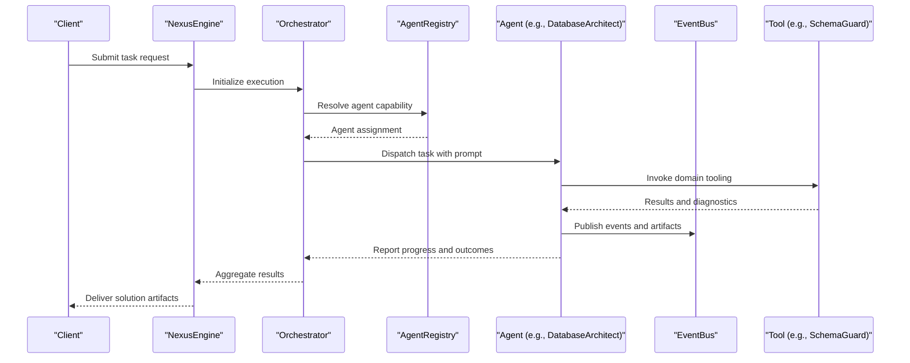

**Diagram sources**
- [NexusEngine.js](file://agent/core/NexusEngine.js)
- [Orchestrator.js](file://agent/core/Orchestrator.js)
- [AgentRegistry.js](file://agent/core/AgentRegistry.js)
- [EventBus.js](file://agent/core/EventBus.js)
- [database-architect.md](file://agent/prompts/internal/database-architect.md)
- [SchemaGuard.js](file://agent/tools/scanners/SchemaGuard.js)

## Detailed Component Analysis

### Database Architect
The Database Architect agent specializes in schema design, normalization, indexing strategies, and query optimization. It leverages SchemaGuard for schema validation and QueryOptimizer for SQL tuning. The agent consumes a dedicated prompt to guide design decisions aligned with performance and maintainability.

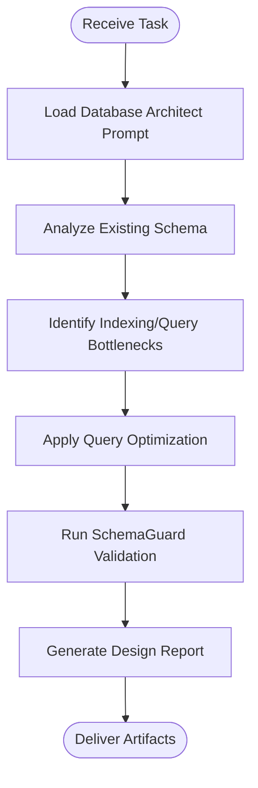

**Diagram sources**
- [database-architect.md](file://agent/prompts/internal/database-architect.md)
- [SchemaGuard.js](file://agent/tools/scanners/SchemaGuard.js)
- [QueryOptimizer.js](file://agent/tools/QueryOptimizer.js)

**Section sources**
- [database-architect.md](file://agent/prompts/internal/database-architect.md)
- [SchemaGuard.js](file://agent/tools/scanners/SchemaGuard.js)
- [QueryOptimizer.js](file://agent/tools/QueryOptimizer.js)

### API Gateway Streaming
The API Gateway Streaming agent designs and implements streaming-oriented API gateways for microservices communication. It focuses on real-time event routing, protocol upgrades, and resilience patterns. The agent uses a dedicated prompt to define gateway policies, routing rules, and observability hooks.

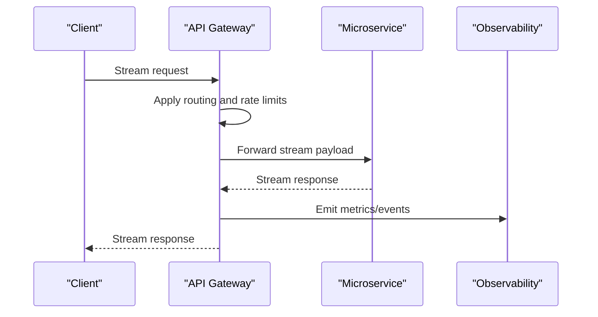

**Diagram sources**
- [api-gateway-streaming.md](file://agent/prompts/internal/api-gateway-streaming.md)

**Section sources**
- [api-gateway-streaming.md](file://agent/prompts/internal/api-gateway-streaming.md)

### REST API Designer
The REST API Designer agent produces RESTful API specifications with clear contracts, versioning, and validation. It integrates Validator for contract enforcement and TDDGuard for test-driven design alignment.

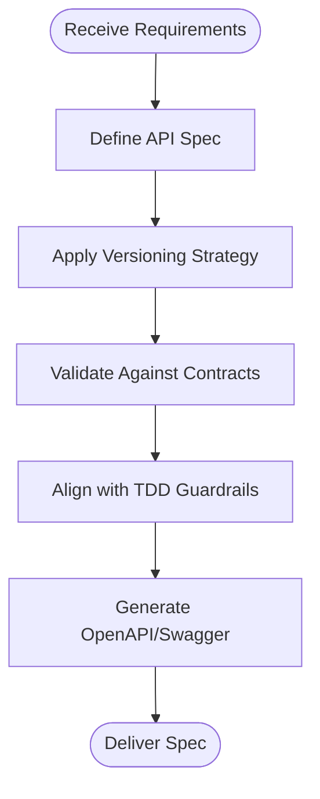

**Diagram sources**
- [rest-api-designer.md](file://agent/prompts/internal/rest-api-designer.md)
- [Validator.js](file://agent/tools/Validator.js)
- [TDDGuard.js](file://agent/tools/TDDGuard.js)

**Section sources**
- [rest-api-designer.md](file://agent/prompts/internal/rest-api-designer.md)
- [Validator.js](file://agent/tools/Validator.js)
- [TDDGuard.js](file://agent/tools/TDDGuard.js)

### GraphQL Specialist
The GraphQL Specialist agent designs and implements GraphQL APIs with schema-first development, resolver patterns, and performance optimizations. It uses Designer for schema generation and AssetEngine for asset bundling.

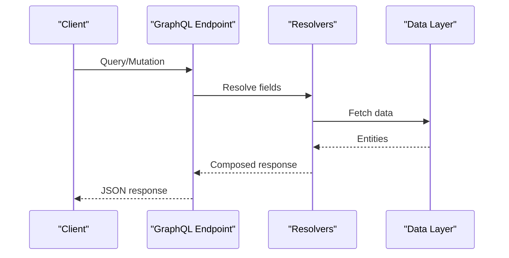

**Diagram sources**
- [lighthouse-graphql-specialist.md](file://agent/prompts/internal/lighthouse-graphql-specialist.md)
- [Designer.js](file://agent/tools/Designer.js)
- [AssetEngine.js](file://agent/tools/AssetEngine.js)

**Section sources**
- [lighthouse-graphql-specialist.md](file://agent/prompts/internal/lighthouse-graphql-specialist.md)
- [Designer.js](file://agent/tools/Designer.js)
- [AssetEngine.js](file://agent/tools/AssetEngine.js)

### Headless CMS Specialist
The Headless CMS Specialist agent designs content management systems decoupled from presentation. It focuses on content modeling, delivery APIs, and preview workflows. AssetEngine supports media and asset handling.

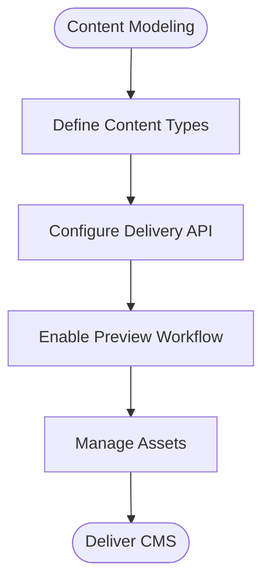

**Diagram sources**
- [headless-cms-specialist.md](file://agent/prompts/internal/headless-cms-specialist.md)
- [AssetEngine.js](file://agent/tools/AssetEngine.js)

**Section sources**
- [headless-cms-specialist.md](file://agent/prompts/internal/headless-cms-specialist.md)
- [AssetEngine.js](file://agent/tools/AssetEngine.js)

### Search Specialists (Elasticsearch and Algolia)
Search specialists implement enterprise-grade search with Elasticsearch and Algolia. They focus on index design, query tuning, faceting, and performance. Tools like RootCauseAnalyzer and BugHunter support diagnostics and reliability.

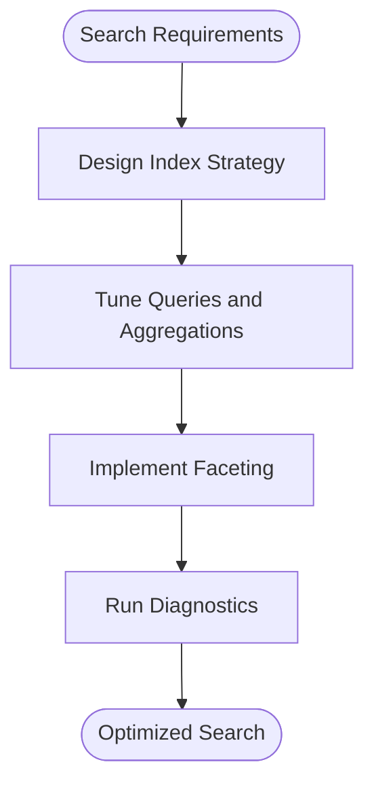

**Diagram sources**
- [elasticsearch-specialist.md](file://agent/prompts/internal/elasticsearch-specialist.md)
- [algolia-specialist.md](file://agent/prompts/internal/algolia-specialist.md)
- [RootCauseAnalyzer.js](file://agent/tools/RootCauseAnalyzer.js)
- [BugHunter.js](file://agent/tools/BugHunter.js)

**Section sources**
- [elasticsearch-specialist.md](file://agent/prompts/internal/elasticsearch-specialist.md)
- [algolia-specialist.md](file://agent/prompts/internal/algolia-specialist.md)
- [RootCauseAnalyzer.js](file://agent/tools/RootCauseAnalyzer.js)
- [BugHunter.js](file://agent/tools/BugHunter.js)

### Queue Systems and Event-Driven Architecture
Queue and event specialists design resilient asynchronous workflows. They focus on message ordering, retries, dead-letter handling, and event sourcing patterns. DatasetExtractor and RetroDatasetExtractor support historical analysis and replay scenarios.

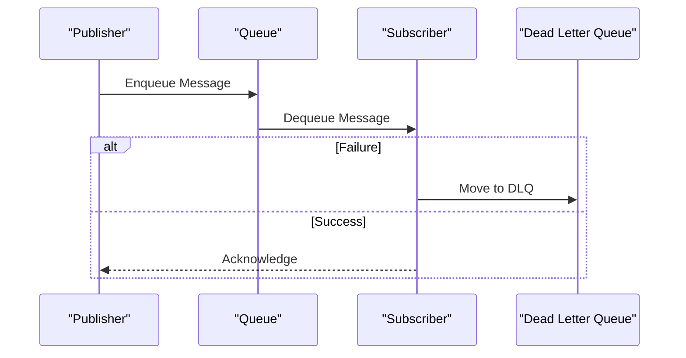

**Diagram sources**
- [laravel-queue-specialist.md](file://agent/prompts/internal/laravel-queue-specialist.md)
- [laravel-event-specialist.md](file://agent/prompts/internal/laravel-event-specialist.md)
- [DatasetExtractor.js](file://agent/tools/DatasetExtractor.js)
- [RetroDatasetExtractor.js](file://agent/tools/RetroDatasetExtractor.js)

**Section sources**
- [laravel-queue-specialist.md](file://agent/prompts/internal/laravel-queue-specialist.md)
- [laravel-event-specialist.md](file://agent/prompts/internal/laravel-event-specialist.md)
- [DatasetExtractor.js](file://agent/tools/DatasetExtractor.js)
- [RetroDatasetExtractor.js](file://agent/tools/RetroDatasetExtractor.js)

### Middleware Design
Middleware specialists implement cross-cutting concerns such as authentication, logging, rate limiting, and request transformation. They use Middleware Specialist prompt and integrate with Sanctum for authentication.

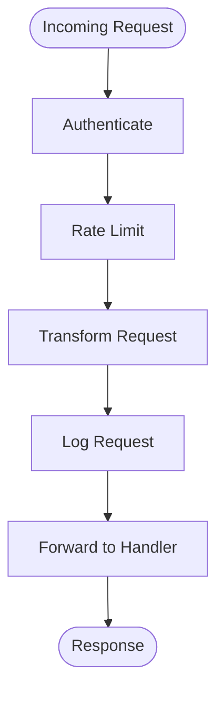

**Diagram sources**
- [middleware-specialist.md](file://agent/prompts/internal/middleware-specialist.md)
- [sanctum-auth-specialist.md](file://agent/prompts/internal/sanctum-auth-specialist.md)

**Section sources**
- [middleware-specialist.md](file://agent/prompts/internal/middleware-specialist.md)
- [sanctum-auth-specialist.md](file://agent/prompts/internal/sanctum-auth-specialist.md)

### Authentication and Authorization
Authentication and authorization agents enforce identity, permissions, OAuth flows, and role-based access control. They align with RolePermissionSpecialist and OAuth Specialist prompts.

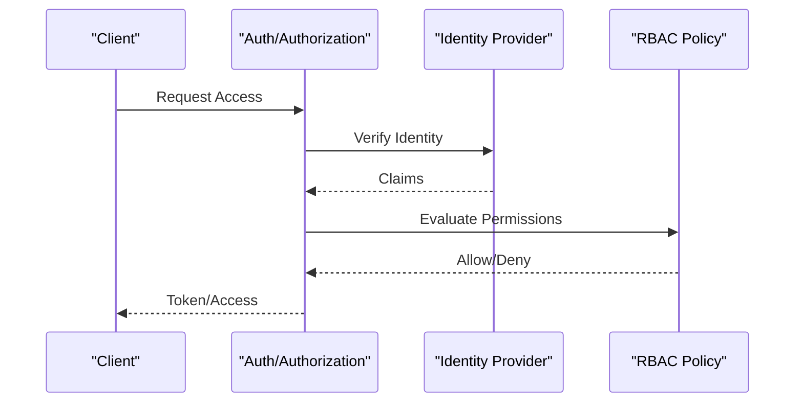

**Diagram sources**
- [RolePermissionSpecialist.md](file://agent/prompts/internal/role-permission-specialist.md)
- [oauth-specialist.md](file://agent/prompts/internal/oauth-specialist.md)
- [sanctum-auth-specialist.md](file://agent/prompts/internal/sanctum-auth-specialist.md)

**Section sources**
- [RolePermissionSpecialist.md](file://agent/prompts/internal/role-permission-specialist.md)
- [oauth-specialist.md](file://agent/prompts/internal/oauth-specialist.md)
- [sanctum-auth-specialist.md](file://agent/prompts/internal/sanctum-auth-specialist.md)

### Caching Strategies and State Management
Caching and state management agents optimize performance and consistency. They apply caching patterns, invalidate strategies, and state synchronization across services.

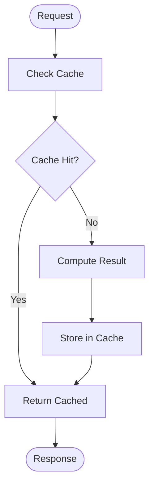

**Diagram sources**
- [caching-state-manager.md](file://agent/prompts/internal/caching-state-manager.md)

**Section sources**
- [caching-state-manager.md](file://agent/prompts/internal/caching-state-manager.md)

### Logging and Monitoring
Logging and monitoring agents establish observability pipelines, alerting, and dashboards. They integrate with monitoring-logging and log-management-specialist prompts.

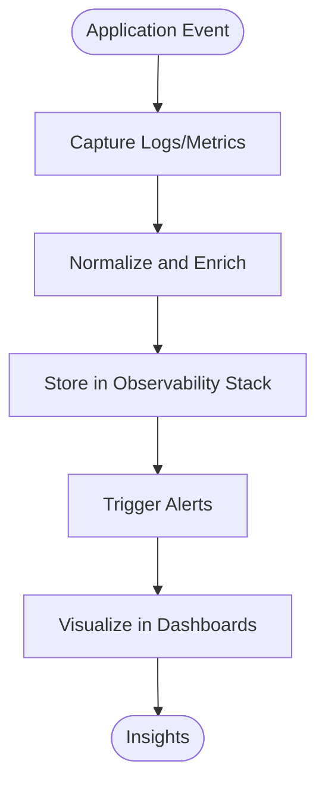

**Diagram sources**
- [monitoring-logging.md](file://agent/prompts/internal/monitoring-logging.md)
- [log-management-specialist.md](file://agent/prompts/internal/log-management-specialist.md)

**Section sources**
- [monitoring-logging.md](file://agent/prompts/internal/monitoring-logging.md)
- [log-management-specialist.md](file://agent/prompts/internal/log-management-specialist.md)

### Security Architecture
Security architects implement defense-in-depth strategies, vulnerability assessments, and compliance controls. They use cyber-security and security-code-scanner prompts.

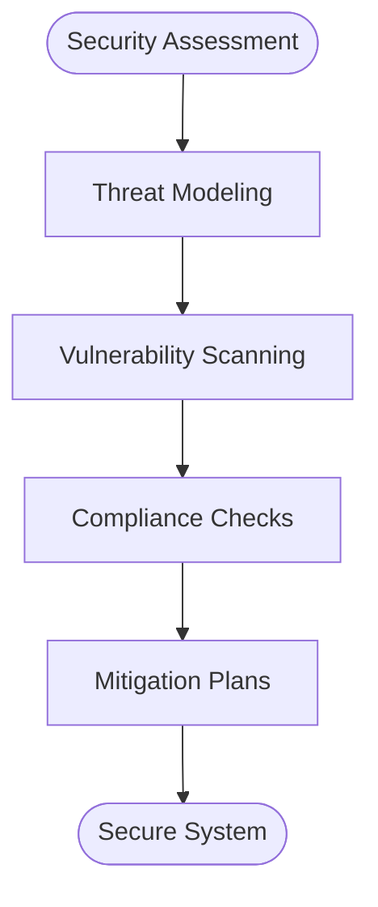

**Diagram sources**
- [cyber-security.md](file://agent/prompts/internal/cyber-security.md)
- [SecurityCodeScanner.md](file://agent/prompts/internal/security-code-scanner.md)

**Section sources**
- [cyber-security.md](file://agent/prompts/internal/cyber-security.md)
- [SecurityCodeScanner.md](file://agent/prompts/internal/security-code-scanner.md)

### Performance Optimization
Performance optimizers focus on latency reduction, throughput scaling, and resource efficiency. They leverage performance-optimizer prompt and related tools.

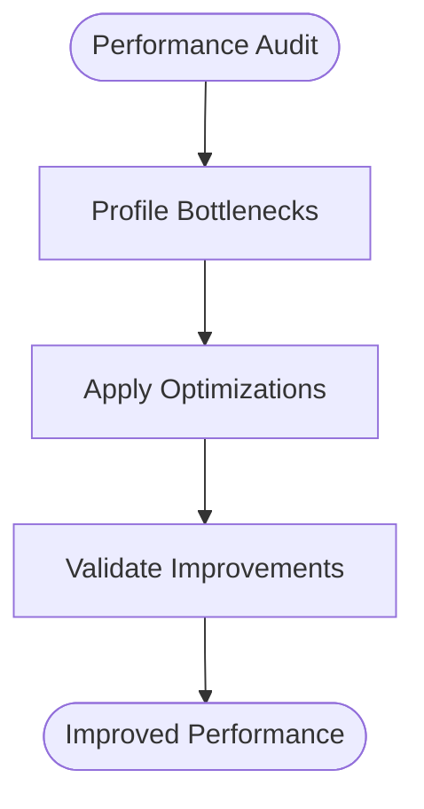

**Diagram sources**
- [performance-optimizer.md](file://agent/prompts/internal/performance-optimizer.md)

**Section sources**
- [performance-optimizer.md](file://agent/prompts/internal/performance-optimizer.md)

### Scalability, Availability, Disaster Recovery, Backups
Scalability and availability agents design horizontal scaling, auto-healing, and fault tolerance. Disaster recovery and backup agents implement backup strategies and restoration procedures.

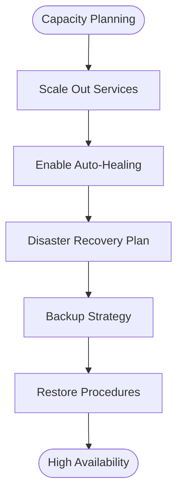

**Diagram sources**
- [backup-recovery-specialist.md](file://agent/prompts/internal/backup-recovery-specialist.md)
- [multitenancy-specialist.md](file://agent/prompts/internal/multitenancy-specialist.md)

**Section sources**
- [backup-recovery-specialist.md](file://agent/prompts/internal/backup-recovery-specialist.md)
- [multitenancy-specialist.md](file://agent/prompts/internal/multitenancy-specialist.md)

### Data Export, Reporting, Analytics, and System Monitoring
Agents handle data export pipelines, reporting dashboards, analytics insights, and continuous system monitoring. They use dedicated prompts for each domain.

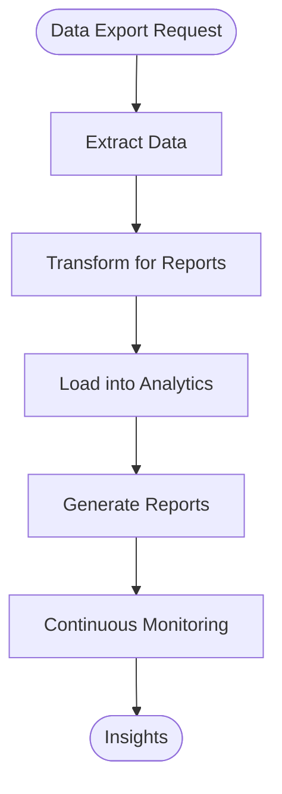

**Diagram sources**
- [data-export-specialist.md](file://agent/prompts/internal/data-export-specialist.md)
- [reporting-specialist.md](file://agent/prompts/internal/reporting-specialist.md)
- [dashboard-analytics-specialist.md](file://agent/prompts/internal/dashboard-analytics-specialist.md)
- [monitoring-logging.md](file://agent/prompts/internal/monitoring-logging.md)

**Section sources**
- [data-export-specialist.md](file://agent/prompts/internal/data-export-specialist.md)
- [reporting-specialist.md](file://agent/prompts/internal/reporting-specialist.md)
- [dashboard-analytics-specialist.md](file://agent/prompts/internal/dashboard-analytics-specialist.md)
- [monitoring-logging.md](file://agent/prompts/internal/monitoring-logging.md)

### Infrastructure and Networking
Infrastructure agents manage load balancers, reverse proxies, and networking. They use nginx-apache-specialist and websocket-specialist prompts for edge routing and real-time connectivity.

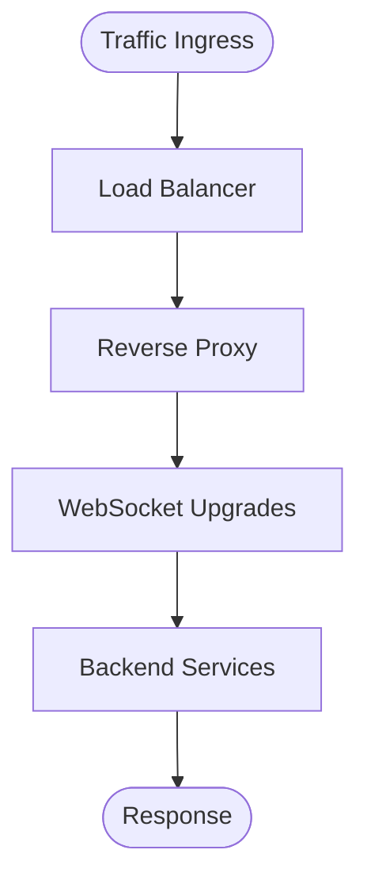

**Diagram sources**
- [nginx-apache-specialist.md](file://agent/prompts/internal/nginx-apache-specialist.md)
- [websocket-specialist.md](file://agent/prompts/internal/websocket-specialist.md)

**Section sources**
- [nginx-apache-specialist.md](file://agent/prompts/internal/nginx-apache-specialist.md)
- [websocket-specialist.md](file://agent/prompts/internal/websocket-specialist.md)

## Dependency Analysis
The agent ecosystem exhibits clear separation of concerns:
- Core engine depends on orchestrators and registries to select and coordinate agents.
- Agents depend on domain-specific prompts and tools for execution.
- Tools provide reusable capabilities (validation, optimization, scanning, scaffolding).
- Phases define lifecycle transitions and governance.

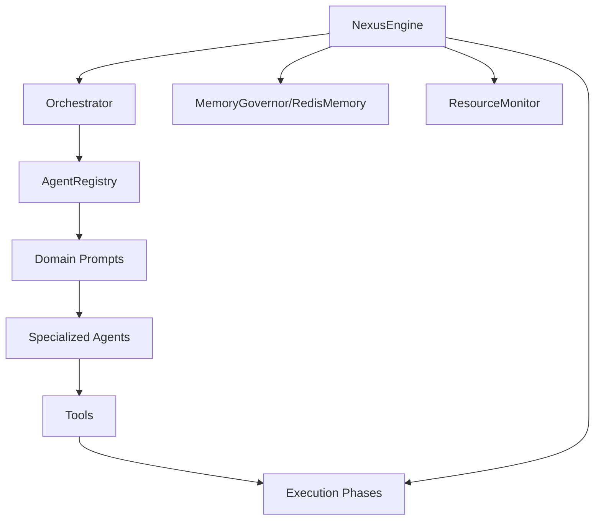

**Diagram sources**
- [NexusEngine.js](file://agent/core/NexusEngine.js)
- [Orchestrator.js](file://agent/core/Orchestrator.js)
- [AgentRegistry.js](file://agent/core/AgentRegistry.js)
- [MemoryGovernor.js](file://agent/core/MemoryGovernor.js)
- [RedisMemory.js](file://agent/core/RedisMemory.js)
- [ResourceMonitor.js](file://agent/core/ResourceMonitor.js)
- [PlanningPhase.js](file://agent/core/phases/PlanningPhase.js)
- [ExecutionPhase.js](file://agent/core/phases/ExecutionPhase.js)
- [ImplementationPhase.js](file://agent/core/phases/ImplementationPhase.js)
- [AuditPhase.js](file://agent/core/AuditPhase.js)
- [KnowledgePhase.js](file://agent/core/KnowledgePhase.js)

**Section sources**
- [NexusEngine.js](file://agent/core/NexusEngine.js)
- [Orchestrator.js](file://agent/core/Orchestrator.js)
- [AgentRegistry.js](file://agent/core/AgentRegistry.js)
- [MemoryGovernor.js](file://agent/core/MemoryGovernor.js)
- [RedisMemory.js](file://agent/core/RedisMemory.js)
- [ResourceMonitor.js](file://agent/core/ResourceMonitor.js)
- [PlanningPhase.js](file://agent/core/phases/PlanningPhase.js)
- [ExecutionPhase.js](file://agent/core/phases/ExecutionPhase.js)
- [ImplementationPhase.js](file://agent/core/phases/ImplementationPhase.js)
- [AuditPhase.js](file://agent/core/AuditPhase.js)
- [KnowledgePhase.js](file://agent/core/KnowledgePhase.js)

## Performance Considerations
- Use NexusClock for timeout management and ParallelRunner for concurrent task execution.
- Employ MemoryGovernor and RedisMemory to cap memory usage and persist state efficiently.
- Apply QueryOptimizer and SchemaGuard to reduce database overhead.
- Integrate monitoring-logging and log-management-specialist prompts to track performance regressions.
- Utilize performance-optimizer prompt to iteratively improve latency and throughput.

[No sources needed since this section provides general guidance]

## Troubleshooting Guide
- Use RootCauseAnalyzer to diagnose system issues and identify failure points.
- Leverage BugHunter for automated bug detection and remediation suggestions.
- Apply TDDGuard and TDDScaffolder to maintain code quality and test coverage.
- AccessibilityScanner ensures inclusive and accessible implementations.
- NexusError centralizes error handling and propagation across agents.

**Section sources**
- [RootCauseAnalyzer.js](file://agent/tools/RootCauseAnalyzer.js)
- [BugHunter.js](file://agent/tools/BugHunter.js)
- [TDDGuard.js](file://agent/tools/TDDGuard.js)
- [TDDScaffolder.js](file://agent/tools/TDDScaffolder.js)
- [AccessibilityScanner.js](file://agent/tools/AccessibilityScanner.js)
- [NexusError.js](file://agent/core/NexusError.js)

## Conclusion
NEXUS AI’s architecture agents provide a comprehensive, modular framework for designing and operating enterprise-grade systems. By combining specialized agents, prompt-driven guidance, and robust tooling, the platform enables scalable, secure, and observable architectures across databases, APIs, search, queues, events, middleware, authentication, caching, logging, monitoring, security, performance, availability, disaster recovery, backups, multitenancy, state management, data export, reporting, analytics, and infrastructure. The structured phases and governance mechanisms ensure disciplined execution from planning through implementation and audit.