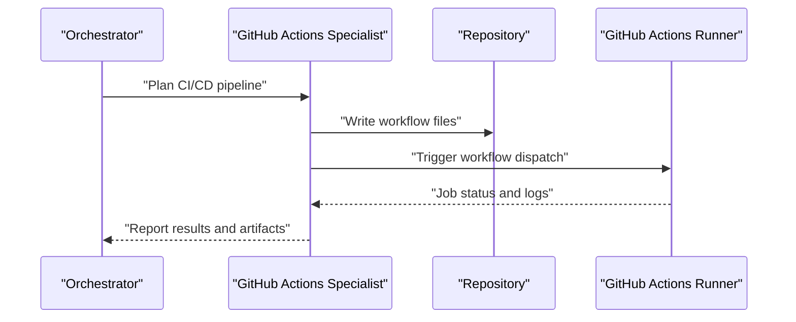
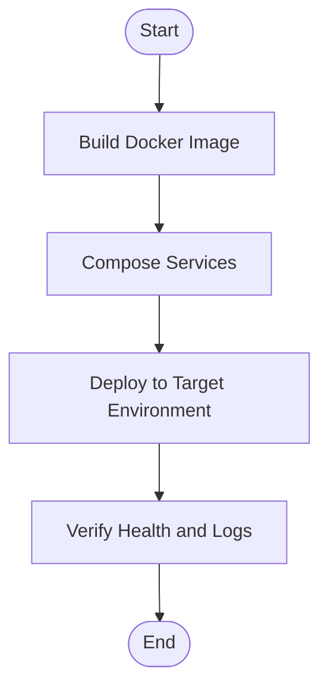
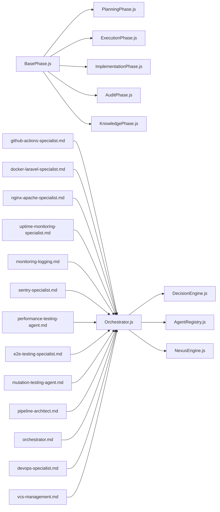

# DevOps Agents

<cite>
**Referenced Files in This Document**
- [README.md](file://README.md)
- [package.json](file://package.json)
- [Dockerfile](file://Dockerfile)
- [docker-compose.yml](file://docker-compose.yml)
- [.dockerignore](file://.dockerignore)
- [agent/main.js](file://agent/main.js)
- [agent/core/NexusEngine.js](file://agent/core/NexusEngine.js)
- [agent/core/AgentRegistry.js](file://agent/core/AgentRegistry.js)
- [agent/core/Orchestrator.js](file://agent/core/Orchestrator.js)
- [agent/core/DecisionEngine.js](file://agent/core/DecisionEngine.js)
- [agent/core/Machinist.js](file://agent/core/Machinist.js)
- [agent/core/ResourceMonitor.js](file://agent/core/ResourceMonitor.js)
- [agent/core/ParallelRunner.js](file://agent/core/ParallelRunner.js)
- [agent/core/phases/BasePhase.js](file://agent/core/phases/BasePhase.js)
- [agent/core/phases/PlanningPhase.js](file://agent/core/phases/PlanningPhase.js)
- [agent/core/phases/ExecutionPhase.js](file://agent/core/phases/ExecutionPhase.js)
- [agent/core/phases/ImplementationPhase.js](file://agent/core/phases/ImplementationPhase.js)
- [agent/core/phases/AuditPhase.js](file://agent/core/phases/AuditPhase.js)
- [agent/core/phases/KnowledgePhase.js](file://agent/core/phases/KnowledgePhase.js)
- [agent/core/phases/CoreUtils.js](file://agent/core/phases/CoreUtils.js)
- [agent/core/workers/plugin-worker.js](file://agent/core/workers/plugin-worker.js)
- [agent/prompts/internal/docker-laravel-specialist.md](file://agent/prompts/internal/docker-laravel-specialist.md)
- [agent/prompts/internal/github-actions-specialist.md](file://agent/prompts/internal/github-actions-specialist.md)
- [agent/prompts/internal/nginx-apache-specialist.md](file://agent/prompts/internal/nginx-apache-specialist.md)
- [agent/prompts/internal/uptime-monitoring-specialist.md](file://agent/prompts/internal/uptime-monitoring-specialist.md)
- [agent/prompts/internal/monitoring-logging.md](file://agent/prompts/internal/monitoring-logging.md)
- [agent/prompts/internal/sentry-specialist.md](file://agent/prompts/internal/sentry-specialist.md)
- [agent/prompts/internal/performance-testing-agent.md](file://agent/prompts/internal/performance-testing-agent.md)
- [agent/prompts/internal/e2e-testing-specialist.md](file://agent/prompts/internal/e2e-testing-specialist.md)
- [agent/prompts/internal/mutation-testing-agent.md](file://agent/prompts/internal/mutation-testing-agent.md)
- [agent/prompts/internal/pipeline-architect.md](file://agent/prompts/internal/pipeline-architect.md)
- [agent/prompts/internal/orchestrator.md](file://agent/prompts/internal/orchestrator.md)
- [agent/prompts/internal/backup-recovery-specialist.md](file://agent/prompts/internal/backup-recovery-specialist.md)
- [agent/prompts/internal/ssl-domain-specialist.md](file://agent/prompts/internal/ssl-domain-specialist.md)
- [agent/prompts/internal/shared-hosting-specialist.md](file://agent/prompts/internal/shared-hosting-specialist.md)
- [agent/prompts/internal/pwa-specialist.md](file://agent/prompts/internal/pwa-specialist.md)
- [agent/prompts/internal/email-delivery-smtp-specialist.md](file://agent/prompts/internal/email-delivery-smtp-specialist.md)
- [agent/prompts/internal/sms-whatsapp-api-specialist.md](file://agent/prompts/internal/sms-whatsapp-api-specialist.md)
- [agent/prompts/internal/midtrans-payment-integration-specialist.md](file://agent/prompts/internal/midtrans-payment-integration-specialist.md)
- [agent/prompts/internal/subscription-billing-specialist.md](file://agent/prompts/internal/subscription-billing-specialist.md)
- [agent/prompts/internal/financial-integration-specialist.md](file://agent/prompts/internal/financial-integration-specialist.md)
- [agent/prompts/internal/container-orchestration-kubernetes-specialist.md](file://agent/prompts/internal/container-orchestration-kubernetes-specialist.md)
- [agent/prompts/internal/cloud-deployment-specialists.md](file://agent/prompts/internal/cloud-deployment-specialists.md)
- [agent/prompts/internal/serverless-deployment-specialist.md](file://agent/prompts/internal/serverless-deployment-specialist.md)
- [agent/prompts/internal/infrastructure-as-code-specialists.md](file://agent/prompts/internal/infrastructure-as-code-specialists.md)
- [agent/prompts/internal/configuration-management.md](file://agent/prompts/internal/configuration-management.md)
- [agent/prompts/internal/network-security.md](file://agent/prompts/internal/network-security.md)
- [agent/prompts/internal/load-balancing.md](file://agent/prompts/internal/load-balancing.md)
- [agent/prompts/internal/dns-domain-management.md](file://agent/prompts/internal/dns-domain-management.md)
- [agent/workflows/external/devops/devops-specialist.md](file://agent/workflows/external/devops/devops-specialist.md)
- [agent/workflows/external/devops/vcs-management.md](file://agent/workflows/external/devops/vcs-management.md)
- [agent/tools/TDDGuard.js](file://agent/tools/TDDGuard.js)
- [agent/tools/Validator.js](file://agent/tools/Validator.js)
- [agent/scripts/tdd_automated_loop.js](file://agent/scripts/tdd_automated_loop.js)
- [.github/workflows/ci.yml](file://.github/workflows/ci.yml)
- [.github/workflows/npm-publish.yml](file://.github/workflows/npm-publish.yml)
- [tests/pipeline_internal_test.js](file://tests/pipeline_internal_test.js)
- [tests/TDD/EvolutionPiper.test.js](file://tests/TDD/EvolutionPiper.test.js)
- [tests/TDD/Machinist.test.js](file://tests/TDD/Machinist.test.js)
- [tests/TDD/MemoryGovernor.test.js](file://tests/TDD/MemoryGovernor.test.js)
- [tests/TDD/Orchestrator.test.js](file://tests/TDD/Orchestrator.test.js)
- [tests/TDD/nexus-engine.test.js](file://tests/TDD/nexus-engine.test.js)
- [tests/TDD/distiller.test.js](file://tests/TDD/distiller.test.js)
- [tests/TDD/TDDGuard.test.js](file://tests/TDD/TDDGuard.test.js)
- [tests/stress-test.js](file://tests/stress-test.js)
</cite>

## Table of Contents
1. [Introduction](#introduction)
2. [Project Structure](#project-structure)
3. [Core Components](#core-components)
4. [Architecture Overview](#architecture-overview)
5. [Detailed Component Analysis](#detailed-component-analysis)
6. [Dependency Analysis](#dependency-analysis)
7. [Performance Considerations](#performance-considerations)
8. [Troubleshooting Guide](#troubleshooting-guide)
9. [Conclusion](#conclusion)
10. [Appendices](#appendices)

## Introduction
This document describes the NEXUS AI DevOps agents ecosystem, focusing on continuous integration/deployment, infrastructure management, and operational excellence. It synthesizes the repository's agent framework, workflows, and specialized prompts to present practical deployment strategies, infrastructure patterns, and operational procedures for teams adopting AI-driven DevOps automation.

The project exposes a modular agent architecture with specialized roles for:
- CI/CD automation via GitHub Actions and internal pipeline orchestration
- Containerization and orchestration with Docker and Docker Compose
- Web server configuration (Nginx/Apache)
- SSL and domain management
- Shared hosting environments
- Progressive Web Applications (PWA)
- Uptime monitoring and observability
- Error tracking (Sentry)
- Performance and end-to-end testing
- Advanced mutation testing
- Infrastructure as Code (IaC) and cloud deployment
- Serverless and network security
- Email delivery, SMS/WhatsApp APIs
- Payment integrations (Midtrans), subscriptions, and financial systems

## Project Structure
At a high level, the repository organizes DevOps capabilities across:
- Agent runtime and orchestration engine
- Specialized prompts for each agent role
- Workflow definitions for DevOps processes
- CI/CD pipeline configurations
- Containerization assets
- Testing and validation tools

```mermaid
graph TB
subgraph "Agent Runtime"
MAIN["agent/main.js"]
NE["NexusEngine.js"]
REG["AgentRegistry.js"]
ORCH["Orchestrator.js"]
DEC["DecisionEngine.js"]
PH_BASE["BasePhase.js"]
PH_PLAN["PlanningPhase.js"]
PH_EXEC["ExecutionPhase.js"]
PH_IMPL["ImplementationPhase.js"]
PH_AUD["AuditPhase.js"]
PH_KNOW["KnowledgePhase.js"]
end
subgraph "Specialist Prompts"
GH["github-actions-specialist.md"]
DL["docker-laravel-specialist.md"]
NG["nginx-apache-specialist.md"]
UM["uptime-monitoring-specialist.md"]
ML["monitoring-logging.md"]
SE["sentry-specialist.md"]
PT["performance-testing-agent.md"]
E2E["e2e-testing-specialist.md"]
MT["mutation-testing-agent.md"]
PA["pipeline-architect.md"]
ORCHP["orchestrator.md"]
end
subgraph "Workflows"
WDEV["devops-specialist.md"]
WVCS["vcs-management.md"]
end
subgraph "CI/CD"
GHW1[".github/workflows/ci.yml"]
GHW2[".github/workflows/npm-publish.yml"]
end
subgraph "Containerization"
DKF["Dockerfile"]
DCK["docker-compose.yml"]
DGI[".dockerignore"]
end
MAIN --> NE --> REG
NE --> ORCH
NE --> DEC
ORCH --> PH_BASE
PH_BASE --> PH_PLAN
PH_BASE --> PH_EXEC
PH_BASE --> PH_IMPL
PH_BASE --> PH_AUD
PH_BASE --> PH_KNOW
GH -.-> ORCH
DL -.-> ORCH
NG -.-> ORCH
UM -.-> ORCH
ML -.-> ORCH
SE -.-> ORCH
PT -.-> ORCH
E2E -.-> ORCH
MT -.-> ORCH
PA -.-> ORCH
ORCHP -.-> ORCH
WDEV -.-> ORCH
WVCS -.-> ORCH
GHW1 -.-> ORCH
GHW2 -.-> ORCH
DKF -.-> DL
DCK -.-> DL
DGI -.-> DL
```

**Diagram sources**
- [agent/main.js:1-200](file://agent/main.js#L1-L200)
- [agent/core/NexusEngine.js:1-200](file://agent/core/NexusEngine.js#L1-L200)
- [agent/core/AgentRegistry.js:1-200](file://agent/core/AgentRegistry.js#L1-L200)
- [agent/core/Orchestrator.js:1-200](file://agent/core/Orchestrator.js#L1-L200)
- [agent/core/DecisionEngine.js:1-200](file://agent/core/DecisionEngine.js#L1-L200)
- [agent/core/phases/BasePhase.js:1-200](file://agent/core/phases/BasePhase.js#L1-L200)
- [agent/core/phases/PlanningPhase.js:1-200](file://agent/core/phases/PlanningPhase.js#L1-L200)
- [agent/core/phases/ExecutionPhase.js:1-200](file://agent/core/phases/ExecutionPhase.js#L1-L200)
- [agent/core/phases/ImplementationPhase.js:1-200](file://agent/core/phases/ImplementationPhase.js#L1-L200)
- [agent/core/phases/AuditPhase.js:1-200](file://agent/core/phases/AuditPhase.js#L1-L200)
- [agent/core/phases/KnowledgePhase.js:1-200](file://agent/core/phases/KnowledgePhase.js#L1-L200)
- [agent/prompts/internal/github-actions-specialist.md:1-200](file://agent/prompts/internal/github-actions-specialist.md#L1-L200)
- [agent/prompts/internal/docker-laravel-specialist.md:1-200](file://agent/prompts/internal/docker-laravel-specialist.md#L1-L200)
- [agent/prompts/internal/nginx-apache-specialist.md:1-200](file://agent/prompts/internal/nginx-apache-specialist.md#L1-L200)
- [agent/prompts/internal/uptime-monitoring-specialist.md:1-200](file://agent/prompts/internal/uptime-monitoring-specialist.md#L1-L200)
- [agent/prompts/internal/monitoring-logging.md:1-200](file://agent/prompts/internal/monitoring-logging.md#L1-L200)
- [agent/prompts/internal/sentry-specialist.md:1-200](file://agent/prompts/internal/sentry-specialist.md#L1-L200)
- [agent/prompts/internal/performance-testing-agent.md:1-200](file://agent/prompts/internal/performance-testing-agent.md#L1-L200)
- [agent/prompts/internal/e2e-testing-specialist.md:1-200](file://agent/prompts/internal/e2e-testing-specialist.md#L1-L200)
- [agent/prompts/internal/mutation-testing-agent.md:1-200](file://agent/prompts/internal/mutation-testing-agent.md#L1-L200)
- [agent/prompts/internal/pipeline-architect.md:1-200](file://agent/prompts/internal/pipeline-architect.md#L1-L200)
- [agent/prompts/internal/orchestrator.md:1-200](file://agent/prompts/internal/orchestrator.md#L1-L200)
- [agent/workflows/external/devops/devops-specialist.md:1-200](file://agent/workflows/external/devops/devops-specialist.md#L1-L200)
- [agent/workflows/external/devops/vcs-management.md:1-200](file://agent/workflows/external/devops/vcs-management.md#L1-L200)
- [.github/workflows/ci.yml:1-200](file://.github/workflows/ci.yml#L1-L200)
- [.github/workflows/npm-publish.yml:1-200](file://.github/workflows/npm-publish.yml#L1-L200)
- [Dockerfile:1-200](file://Dockerfile#L1-L200)
- [docker-compose.yml:1-200](file://docker-compose.yml#L1-L200)
- [.dockerignore:1-200](file://.dockerignore#L1-L200)

**Section sources**
- [README.md:1-200](file://README.md#L1-L200)
- [package.json:1-200](file://package.json#L1-L200)

## Core Components
- Agent runtime and orchestration:
  - NexusEngine coordinates agent lifecycle and resource allocation.
  - AgentRegistry manages agent discovery and instantiation.
  - Orchestrator executes tasks across agents and phases.
  - DecisionEngine selects optimal actions based on context and goals.
  - ParallelRunner enables concurrent execution of tasks.
  - ResourceMonitor tracks system resources and throttles workloads.
  - Machinist provides tooling scaffolding and validation hooks.
- Phase-based execution model:
  - BasePhase defines the lifecycle contract.
  - PlanningPhase gathers requirements and constraints.
  - ExecutionPhase carries out operations.
  - ImplementationPhase integrates artifacts and updates state.
  - AuditPhase validates outcomes and captures feedback.
  - KnowledgePhase enriches memory with lessons learned.
- Specialized prompts:
  - Dedicated prompts encode role-specific knowledge for CI/CD, containers, web servers, monitoring, testing, IaC, cloud, serverless, security, and integrations.
- Workflows:
  - DevOps workflows define process templates for automation and governance.
- CI/CD:
  - GitHub Actions workflows automate build, test, and publish tasks.
- Containerization:
  - Dockerfile and docker-compose.yml define container images and service composition.

**Section sources**
- [agent/core/NexusEngine.js:1-200](file://agent/core/NexusEngine.js#L1-L200)
- [agent/core/AgentRegistry.js:1-200](file://agent/core/AgentRegistry.js#L1-L200)
- [agent/core/Orchestrator.js:1-200](file://agent/core/Orchestrator.js#L1-L200)
- [agent/core/DecisionEngine.js:1-200](file://agent/core/DecisionEngine.js#L1-L200)
- [agent/core/ParallelRunner.js:1-200](file://agent/core/ParallelRunner.js#L1-L200)
- [agent/core/ResourceMonitor.js:1-200](file://agent/core/ResourceMonitor.js#L1-L200)
- [agent/core/Machinist.js:1-200](file://agent/core/Machinist.js#L1-L200)
- [agent/core/phases/BasePhase.js:1-200](file://agent/core/phases/BasePhase.js#L1-L200)
- [agent/core/phases/PlanningPhase.js:1-200](file://agent/core/phases/PlanningPhase.js#L1-L200)
- [agent/core/phases/ExecutionPhase.js:1-200](file://agent/core/phases/ExecutionPhase.js#L1-L200)
- [agent/core/phases/ImplementationPhase.js:1-200](file://agent/core/phases/ImplementationPhase.js#L1-L200)
- [agent/core/phases/AuditPhase.js:1-200](file://agent/core/phases/AuditPhase.js#L1-L200)
- [agent/core/phases/KnowledgePhase.js:1-200](file://agent/core/phases/KnowledgePhase.js#L1-L200)
- [agent/prompts/internal/github-actions-specialist.md:1-200](file://agent/prompts/internal/github-actions-specialist.md#L1-L200)
- [agent/prompts/internal/docker-laravel-specialist.md:1-200](file://agent/prompts/internal/docker-laravel-specialist.md#L1-L200)
- [agent/prompts/internal/nginx-apache-specialist.md:1-200](file://agent/prompts/internal/nginx-apache-specialist.md#L1-L200)
- [agent/prompts/internal/uptime-monitoring-specialist.md:1-200](file://agent/prompts/internal/uptime-monitoring-specialist.md#L1-L200)
- [agent/prompts/internal/monitoring-logging.md:1-200](file://agent/prompts/internal/monitoring-logging.md#L1-L200)
- [agent/prompts/internal/sentry-specialist.md:1-200](file://agent/prompts/internal/sentry-specialist.md#L1-L200)
- [agent/prompts/internal/performance-testing-agent.md:1-200](file://agent/prompts/internal/performance-testing-agent.md#L1-L200)
- [agent/prompts/internal/e2e-testing-specialist.md:1-200](file://agent/prompts/internal/e2e-testing-specialist.md#L1-L200)
- [agent/prompts/internal/mutation-testing-agent.md:1-200](file://agent/prompts/internal/mutation-testing-agent.md#L1-L200)
- [agent/prompts/internal/pipeline-architect.md:1-200](file://agent/prompts/internal/pipeline-architect.md#L1-L200)
- [agent/prompts/internal/orchestrator.md:1-200](file://agent/prompts/internal/orchestrator.md#L1-L200)
- [agent/workflows/external/devops/devops-specialist.md:1-200](file://agent/workflows/external/devops/devops-specialist.md#L1-L200)
- [agent/workflows/external/devops/vcs-management.md:1-200](file://agent/workflows/external/devops/vcs-management.md#L1-L200)
- [.github/workflows/ci.yml:1-200](file://.github/workflows/ci.yml#L1-L200)
- [.github/workflows/npm-publish.yml:1-200](file://.github/workflows/npm-publish.yml#L1-L200)
- [Dockerfile:1-200](file://Dockerfile#L1-L200)
- [docker-compose.yml:1-200](file://docker-compose.yml#L1-L200)
- [.dockerignore:1-200](file://.dockerignore#L1-L200)

## Architecture Overview
The DevOps agents architecture centers on an intelligent orchestrator that selects and sequences specialized agents to deliver end-to-end operations. The system emphasizes modularity, observability, and iterative improvement through auditing and knowledge capture.

```mermaid
graph TB
subgraph "Agents"
GHSA["GitHub Actions Specialist"]
DLAR["Docker Laravel Specialist"]
NGAP["Nginx/Apache Specialist"]
UMON["Uptime Monitoring Specialist"]
MONLOG["Monitoring and Logging"]
SENTRY["Sentry Specialist"]
PERF["Performance Testing Agent"]
E2E["End-to-End Testing Specialist"]
MUT["Mutation Testing Agent"]
PIPE["Pipeline Architect"]
ORCH["Orchestrator"]
end
subgraph "Infrastructure"
DOCKER["Docker Engine"]
K8S["Kubernetes"]
CLOUD["Cloud Providers"]
SERVERLESS["Serverless"]
IAC["Infrastructure as Code"]
end
subgraph "Observability"
METRICS["Metrics Collection"]
LOGS["Logs Aggregation"]
TRACES["Tracing"]
ALERTS["Alerting"]
end
GHSA --> PIPE
DLAR --> PIPE
NGAP --> PIPE
UMON --> PIPE
MONLOG --> PIPE
SENTRY --> PIPE
PERF --> PIPE
E2E --> PIPE
MUT --> PIPE
PIPE --> ORCH
PIPE --> DOCKER
PIPE --> K8S
PIPE --> CLOUD
PIPE --> SERVERLESS
PIPE --> IAC
PIPE --> METRICS
PIPE --> LOGS
PIPE --> TRACES
PIPE --> ALERTS
```

**Diagram sources**
- [agent/prompts/internal/github-actions-specialist.md:1-200](file://agent/prompts/internal/github-actions-specialist.md#L1-L200)
- [agent/prompts/internal/docker-laravel-specialist.md:1-200](file://agent/prompts/internal/docker-laravel-specialist.md#L1-L200)
- [agent/prompts/internal/nginx-apache-specialist.md:1-200](file://agent/prompts/internal/nginx-apache-specialist.md#L1-L200)
- [agent/prompts/internal/uptime-monitoring-specialist.md:1-200](file://agent/prompts/internal/uptime-monitoring-specialist.md#L1-L200)
- [agent/prompts/internal/monitoring-logging.md:1-200](file://agent/prompts/internal/monitoring-logging.md#L1-L200)
- [agent/prompts/internal/sentry-specialist.md:1-200](file://agent/prompts/internal/sentry-specialist.md#L1-L200)
- [agent/prompts/internal/performance-testing-agent.md:1-200](file://agent/prompts/internal/performance-testing-agent.md#L1-L200)
- [agent/prompts/internal/e2e-testing-specialist.md:1-200](file://agent/prompts/internal/e2e-testing-specialist.md#L1-L200)
- [agent/prompts/internal/mutation-testing-agent.md:1-200](file://agent/prompts/internal/mutation-testing-agent.md#L1-L200)
- [agent/prompts/internal/pipeline-architect.md:1-200](file://agent/prompts/internal/pipeline-architect.md#L1-L200)
- [agent/prompts/internal/orchestrator.md:1-200](file://agent/prompts/internal/orchestrator.md#L1-L200)

## Detailed Component Analysis

### GitHub Actions Specialist
- Purpose: Automates CI/CD pipelines using GitHub Actions, integrating linting, testing, building, and publishing.
- Responsibilities:
  - Define reusable workflows for build/test/publish stages.
  - Integrate with artifact and release management.
  - Coordinate with other agents for environment provisioning and deployment steps.
- Integration points:
  - Orchestrator triggers specialized tasks aligned with workflow definitions.
  - Pipeline Architect ensures stage sequencing and gating.
- Operational procedures:
  - Validate workflow syntax and permissions.
  - Monitor job logs and failure remediation.
  - Maintain versioned workflow configurations.

**Diagram sources**
- [agent/prompts/internal/github-actions-specialist.md:1-200](file://agent/prompts/internal/github-actions-specialist.md#L1-L200)
- [agent/prompts/internal/pipeline-architect.md:1-200](file://agent/prompts/internal/pipeline-architect.md#L1-L200)
- [.github/workflows/ci.yml:1-200](file://.github/workflows/ci.yml#L1-L200)
- [.github/workflows/npm-publish.yml:1-200](file://.github/workflows/npm-publish.yml#L1-L200)

**Section sources**
- [agent/prompts/internal/github-actions-specialist.md:1-200](file://agent/prompts/internal/github-actions-specialist.md#L1-L200)
- [agent/prompts/internal/pipeline-architect.md:1-200](file://agent/prompts/internal/pipeline-architect.md#L1-L200)
- [.github/workflows/ci.yml:1-200](file://.github/workflows/ci.yml#L1-L200)
- [.github/workflows/npm-publish.yml:1-200](file://.github/workflows/npm-publish.yml#L1-L200)

### Docker Laravel Specialist
- Purpose: Containerizes Laravel applications and orchestrates multi-service deployments.
- Responsibilities:
  - Author Dockerfiles and docker-compose configurations.
  - Manage image builds, tagging, and registry operations.
  - Coordinate with Nginx/Apache Specialist for reverse proxy and routing.
- Integration points:
  - GitHub Actions Specialist for automated image pushes.
  - Pipeline Architect for deployment sequencing.
- Operational procedures:
  - Validate Dockerfile best practices and .dockerignore exclusions.
  - Test container startup and health checks.
  - Rotate secrets and manage persistent volumes.

**Diagram sources**
- [agent/prompts/internal/docker-laravel-specialist.md:1-200](file://agent/prompts/internal/docker-laravel-specialist.md#L1-L200)
- [Dockerfile:1-200](file://Dockerfile#L1-L200)
- [docker-compose.yml:1-200](file://docker-compose.yml#L1-L200)
- [.dockerignore:1-200](file://.dockerignore#L1-L200)

**Section sources**
- [agent/prompts/internal/docker-laravel-specialist.md:1-200](file://agent/prompts/internal/docker-laravel-specialist.md#L1-L200)
- [Dockerfile:1-200](file://Dockerfile#L1-L200)
- [docker-compose.yml:1-200](file://docker-compose.yml#L1-L200)
- [.dockerignore:1-200](file://.dockerignore#L1-L200)

### Nginx/Apache Specialist
- Purpose: Configures web servers for Laravel applications, including SSL termination, routing, and performance tuning.
- Responsibilities:
  - Generate server blocks and virtual hosts.
  - Configure SSL certificates and redirect policies.
  - Optimize caching, compression, and static asset serving.
- Integration points:
  - Docker Laravel Specialist for upstream proxy configuration.
  - SSL Domain Specialist for certificate lifecycle management.
- Operational procedures:
  - Validate configuration syntax and reload services safely.
  - Monitor response times and error rates.
  - Rotate certificates and enforce HSTS policies.

**Section sources**
- [agent/prompts/internal/nginx-apache-specialist.md:1-200](file://agent/prompts/internal/nginx-apache-specialist.md#L1-L200)

### SSL Domain Specialist
- Purpose: Manages SSL/TLS certificates, DNS validation, and domain provisioning.
- Responsibilities:
  - Provision and renew certificates via ACME or vendor APIs.
  - Configure DNS records for validation challenges.
  - Enforce certificate expiration alerts and automated renewal.
- Integration points:
  - Nginx/Apache Specialist for certificate installation.
  - DNS and Domain Management for authoritative records.
- Operational procedures:
  - Monitor certificate expiry and issuance failures.
  - Maintain certificate chains and private key security.
  - Automate renewal and rollback procedures.

**Section sources**
- [agent/prompts/internal/ssl-domain-specialist.md:1-200](file://agent/prompts/internal/ssl-domain-specialist.md#L1-L200)
- [agent/prompts/internal/dns-domain-management.md:1-200](file://agent/prompts/internal/dns-domain-management.md#L1-L200)

### Shared Hosting Specialist
- Purpose: Optimizes Laravel deployments for shared hosting environments with resource constraints.
- Responsibilities:
  - Minimize PHP memory usage and optimize autoloaders.
  - Configure .htaccess and public/index.php routing.
  - Set up cron jobs and queue workers compatible with shared plans.
- Integration points:
  - Docker Laravel Specialist for containerized alternatives.
  - Uptime Monitoring Specialist for availability metrics.
- Operational procedures:
  - Validate disk quotas and CPU limits.
  - Schedule maintenance windows and monitor error logs.

**Section sources**
- [agent/prompts/internal/shared-hosting-specialist.md:1-200](file://agent/prompts/internal/shared-hosting-specialist.md#L1-L200)

### PWA Specialist
- Purpose: Implements Progressive Web App features for Laravel-based frontends.
- Responsibilities:
  - Configure service workers, manifest files, and offline caching.
  - Optimize Core Web Vitals and installability signals.
  - Integrate push notifications and background sync.
- Integration points:
  - Frontend toolchains and build pipelines.
  - Monitoring and Logging for runtime diagnostics.
- Operational procedures:
  - Test app shell caching and update strategies.
  - Measure performance metrics and user engagement.

**Section sources**
- [agent/prompts/internal/pwa-specialist.md:1-200](file://agent/prompts/internal/pwa-specialist.md#L1-L200)
- [agent/prompts/internal/monitoring-logging.md:1-200](file://agent/prompts/internal/monitoring-logging.md#L1-L200)

### Uptime Monitoring Specialist
- Purpose: Ensures system reliability through synthetic checks, alerting, and incident response.
- Responsibilities:
  - Define health check endpoints and SLIs/SLOs.
  - Configure alert channels and escalation policies.
  - Track mean time to recovery and resolution metrics.
- Integration points:
  - Monitoring and Logging for telemetry ingestion.
  - Sentry Specialist for error correlation.
- Operational procedures:
  - Run periodic checks and validate response codes/timeouts.
  - Review alert fatigue and tune thresholds.

**Section sources**
- [agent/prompts/internal/uptime-monitoring-specialist.md:1-200](file://agent/prompts/internal/uptime-monitoring-specialist.md#L1-L200)
- [agent/prompts/internal/monitoring-logging.md:1-200](file://agent/prompts/internal/monitoring-logging.md#L1-L200)

### Monitoring and Logging Specialists
- Purpose: Establishes observability pipelines for metrics, logs, traces, and dashboards.
- Responsibilities:
  - Select instrumentation libraries and exporters.
  - Aggregate logs and metrics for alerting and analytics.
  - Build dashboards and runbooks for common incidents.
- Integration points:
  - Uptime Monitoring Specialist for health signals.
  - Sentry Specialist for error tracking.
- Operational procedures:
  - Define retention policies and cost controls.
  - Audit access and compliance requirements.

**Section sources**
- [agent/prompts/internal/monitoring-logging.md:1-200](file://agent/prompts/internal/monitoring-logging.md#L1-L200)

### Sentry Specialist
- Purpose: Centralizes error tracking, grouping, and triage for applications.
- Responsibilities:
  - Configure SDKs and sampling strategies.
  - Create issue alerts and team assignments.
  - Investigate regressions and performance anomalies.
- Integration points:
  - Monitoring and Logging for correlated telemetry.
  - Uptime Monitoring Specialist for error volume trends.
- Operational procedures:
  - Review error rates and top offenders.
  - Validate stack traces and environment context.

**Section sources**
- [agent/prompts/internal/sentry-specialist.md:1-200](file://agent/prompts/internal/sentry-specialist.md#L1-L200)

### Performance Testing Agent
- Purpose: Conducts load and stress testing to validate scalability and stability.
- Responsibilities:
  - Design test scenarios and injection loads.
  - Instrument metrics collection and correlate with logs.
  - Report bottlenecks and capacity recommendations.
- Integration points:
  - Monitoring and Logging for real-time telemetry.
  - Pipeline Architect for automated regression runs.
- Operational procedures:
  - Normalize environments and baseline measurements.
  - Validate test data freshness and masking.

**Section sources**
- [agent/prompts/internal/performance-testing-agent.md:1-200](file://agent/prompts/internal/performance-testing-agent.md#L1-L200)
- [agent/prompts/internal/pipeline-architect.md:1-200](file://agent/prompts/internal/pipeline-architect.md#L1-L200)

### End-to-End Testing Specialist
- Purpose: Validates complete user journeys across browsers and devices.
- Responsibilities:
  - Define test suites and page object models.
  - Execute tests in CI and on headed browsers.
  - Capture screenshots and videos for regressions.
- Integration points:
  - GitHub Actions Specialist for CI execution.
  - Pipeline Architect for test scheduling and gating.
- Operational procedures:
  - Maintain deterministic selectors and waits.
  - Archive artifacts and investigate flaky tests.

**Section sources**
- [agent/prompts/internal/e2e-testing-specialist.md:1-200](file://agent/prompts/internal/e2e-testing-specialist.md#L1-L200)
- [agent/prompts/internal/pipeline-architect.md:1-200](file://agent/prompts/internal/pipeline-architect.md#L1-L200)

### Mutation Testing Agent
- Purpose: Enhances test quality by introducing faults and measuring detection capability.
- Responsibilities:
  - Apply mutations to source code and run tests.
  - Compute mutation scores and identify weak tests.
  - Recommend targeted refactoring and coverage improvements.
- Integration points:
  - Testing Framework and Automation specialists for tooling.
  - Pipeline Architect for CI integration.
- Operational procedures:
  - Control mutation rate and execution timeouts.
  - Prioritize high-risk areas and critical paths.

**Section sources**
- [agent/prompts/internal/mutation-testing-agent.md:1-200](file://agent/prompts/internal/mutation-testing-agent.md#L1-L200)
- [agent/prompts/internal/pipeline-architect.md:1-200](file://agent/prompts/internal/pipeline-architect.md#L1-L200)

### Testing Framework and Automation Specialists
- Purpose: Provides foundational frameworks and tooling for unit, integration, and contract testing.
- Responsibilities:
  - Scaffold test projects and configure runners.
  - Enforce coding standards and coverage thresholds.
  - Maintain test data and fixtures.
- Integration points:
  - End-to-End Testing Specialist for cross-layer validation.
  - Mutation Testing Agent for quality assurance.
- Operational procedures:
  - Align with TDD Guard for policy enforcement.
  - Automate cleanup and isolation between runs.

**Section sources**
- [agent/tools/TDDGuard.js:1-200](file://agent/tools/TDDGuard.js#L1-L200)
- [agent/tools/Validator.js:1-200](file://agent/tools/Validator.js#L1-L200)
- [agent/scripts/tdd_automated_loop.js:1-200](file://agent/scripts/tdd_automated_loop.js#L1-L200)

### CI/CD Specialists
- Purpose: Coordinates build, test, and release pipelines across environments.
- Responsibilities:
  - Define stages, gates, and approvals.
  - Manage artifact promotion and rollback procedures.
  - Enforce security scanning and compliance checks.
- Integration points:
  - GitHub Actions Specialist for automation.
  - Pipeline Architect for orchestration.
- Operational procedures:
  - Review pipeline performance and concurrency limits.
  - Maintain secrets rotation and least-privilege access.

**Section sources**
- [agent/prompts/internal/pipeline-architect.md:1-200](file://agent/prompts/internal/pipeline-architect.md#L1-L200)
- [.github/workflows/ci.yml:1-200](file://.github/workflows/ci.yml#L1-L200)
- [.github/workflows/npm-publish.yml:1-200](file://.github/workflows/npm-publish.yml#L1-L200)

### Container Orchestration and Kubernetes Specialists
- Purpose: Deploys and manages applications on Kubernetes clusters.
- Responsibilities:
  - Author manifests for Deployments, Services, Ingress, and ConfigMaps.
  - Configure autoscaling, rolling updates, and health probes.
  - Manage namespaces, RBAC, and cluster resources.
- Integration points:
  - Docker Laravel Specialist for image preparation.
  - Infrastructure as Code specialists for declarative management.
- Operational procedures:
  - Validate resource requests/limits and pod topology.
  - Monitor cluster events and node pressure.

**Section sources**
- [agent/prompts/internal/container-orchestration-kubernetes-specialist.md:1-200](file://agent/prompts/internal/container-orchestration-kubernetes-specialist.md#L1-L200)
- [agent/prompts/internal/infrastructure-as-code-specialists.md:1-200](file://agent/prompts/internal/infrastructure-as-code-specialists.md#L1-L200)

### Cloud Deployment Specialists (AWS, GCP, Azure)
- Purpose: Automates deployments across major cloud providers.
- Responsibilities:
  - Provision compute, networking, and managed services.
  - Configure IAM, VPCs, and security groups.
  - Migrate workloads and manage multi-region replication.
- Integration points:
  - Infrastructure as Code specialists for IaC.
  - Container Orchestration specialists for cluster management.
- Operational procedures:
  - Enforce tagging and cost allocation.
  - Validate disaster recovery and backup policies.

**Section sources**
- [agent/prompts/internal/cloud-deployment-specialists.md:1-200](file://agent/prompts/internal/cloud-deployment-specialists.md#L1-L200)
- [agent/prompts/internal/infrastructure-as-code-specialists.md:1-200](file://agent/prompts/internal/infrastructure-as-code-specialists.md#L1-L200)

### Serverless Deployment Specialist
- Purpose: Deploys event-driven functions and APIs with minimal operational overhead.
- Responsibilities:
  - Package and upload function code.
  - Configure triggers, environment variables, and permissions.
  - Monitor cold starts and throughput scaling.
- Integration points:
  - CI/CD specialists for automated releases.
  - Monitoring and Logging for observability.
- Operational procedures:
  - Optimize memory allocation and timeout settings.
  - Test error handling and dead letter queues.

**Section sources**
- [agent/prompts/internal/serverless-deployment-specialist.md:1-200](file://agent/prompts/internal/serverless-deployment-specialist.md#L1-L200)
- [agent/prompts/internal/monitoring-logging.md:1-200](file://agent/prompts/internal/monitoring-logging.md#L1-L200)

### Infrastructure as Code Specialists (Terraform, Ansible)
- Purpose: Defines and provisions infrastructure declaratively.
- Responsibilities:
  - Write modules and playbooks for repeatable environments.
  - Manage state backends and secret encryption.
  - Enforce drift detection and approval workflows.
- Integration points:
  - Cloud Deployment specialists for provider-specific resources.
  - Configuration Management specialists for host-level automation.
- Operational procedures:
  - Plan changes and validate against production constraints.
  - Automate security scans and compliance checks.

**Section sources**
- [agent/prompts/internal/infrastructure-as-code-specialists.md:1-200](file://agent/prompts/internal/infrastructure-as-code-specialists.md#L1-L200)
- [agent/prompts/internal/configuration-management.md:1-200](file://agent/prompts/internal/configuration-management.md#L1-L200)

### Configuration Management
- Purpose: Ensures consistent system and application configuration across environments.
- Responsibilities:
  - Standardize OS and service configurations.
  - Manage secrets, templates, and environment overlays.
  - Automate remediation for configuration drift.
- Integration points:
  - Infrastructure as Code specialists for base resources.
  - Network Security specialists for firewall and ACL policies.
- Operational procedures:
  - Audit configuration baselines and change logs.
  - Validate idempotency and convergence speed.

**Section sources**
- [agent/prompts/internal/configuration-management.md:1-200](file://agent/prompts/internal/configuration-management.md#L1-L200)
- [agent/prompts/internal/network-security.md:1-200](file://agent/prompts/internal/network-security.md#L1-L200)

### Infrastructure Monitoring
- Purpose: Observes infrastructure health and capacity utilization.
- Responsibilities:
  - Collect metrics from hosts, containers, and cloud services.
  - Alert on threshold breaches and anomaly detection.
  - Support capacity planning and cost optimization.
- Integration points:
  - Monitoring and Logging specialists for centralized pipelines.
  - Load Balancing specialists for traffic visibility.
- Operational procedures:
  - Tune alert thresholds and reduce noise.
  - Correlate infrastructure events with application logs.

**Section sources**
- [agent/prompts/internal/monitoring-logging.md:1-200](file://agent/prompts/internal/monitoring-logging.md#L1-L200)
- [agent/prompts/internal/load-balancing.md:1-200](file://agent/prompts/internal/load-balancing.md#L1-L200)

### Network Security
- Purpose: Protects applications and data in transit and at rest.
- Responsibilities:
  - Configure firewalls, IDS/IPS, and DDoS protection.
  - Enforce zero-trust policies and micro-segmentation.
  - Monitor and respond to threats and incidents.
- Integration points:
  - DNS and Domain Management for authoritative records.
  - Infrastructure Monitoring for attack indicators.
- Operational procedures:
  - Validate ingress/egress rules and NAT traversal.
  - Conduct periodic penetration testing and vulnerability assessments.

**Section sources**
- [agent/prompts/internal/network-security.md:1-200](file://agent/prompts/internal/network-security.md#L1-L200)
- [agent/prompts/internal/dns-domain-management.md:1-200](file://agent/prompts/internal/dns-domain-management.md#L1-L200)

### Load Balancing
- Purpose: Distributes traffic across instances and regions for resilience and performance.
- Responsibilities:
  - Configure health checks, stickiness, and failover policies.
  - Optimize for latency, throughput, and cost.
  - Integrate with auto-scaling and WAF protections.
- Integration points:
  - Infrastructure Monitoring for traffic analytics.
  - Network Security for threat mitigation.
- Operational procedures:
  - Test failover scenarios and circuit breaker behavior.
  - Validate SSL offload and compression settings.

**Section sources**
- [agent/prompts/internal/load-balancing.md:1-200](file://agent/prompts/internal/load-balancing.md#L1-L200)
- [agent/prompts/internal/monitoring-logging.md:1-200](file://agent/prompts/internal/monitoring-logging.md#L1-L200)

### DNS and Domain Management
- Purpose: Controls domain registration, DNS zones, and routing policies.
- Responsibilities:
  - Manage registrar accounts and WHOIS privacy.
  - Configure authoritative DNS servers and routing policies.
  - Automate DNS changes and propagation monitoring.
- Integration points:
  - SSL Domain Specialist for certificate automation.
  - Network Security for DNSSEC and DNS-over-HTTPS.
- Operational procedures:
  - Validate zone transfers and delegation security.
  - Monitor DNS resolution latency and failure rates.

**Section sources**
- [agent/prompts/internal/dns-domain-management.md:1-200](file://agent/prompts/internal/dns-domain-management.md#L1-L200)
- [agent/prompts/internal/ssl-domain-specialist.md:1-200](file://agent/prompts/internal/ssl-domain-specialist.md#L1-L200)

### Email Delivery and SMTP Specialists
- Purpose: Ensures reliable transactional and marketing email delivery.
- Responsibilities:
  - Configure SMTP relays, SPF/DKIM/DMARC, and bounce handling.
  - Integrate with ESP APIs and suppression lists.
  - Monitor deliverability and inbox placement metrics.
- Integration points:
  - Shared Hosting Specialist for SMTP relay compatibility.
  - Monitoring and Logging for delivery insights.
- Operational procedures:
  - Validate sender reputation and IP warming schedules.
  - Test unsubscribe and complaint handling workflows.

**Section sources**
- [agent/prompts/internal/email-delivery-smtp-specialist.md:1-200](file://agent/prompts/internal/email-delivery-smtp-specialist.md#L1-L200)
- [agent/prompts/internal/monitoring-logging.md:1-200](file://agent/prompts/internal/monitoring-logging.md#L1-L200)

### SMS and WhatsApp API Specialists
- Purpose: Integrates messaging channels for notifications and customer engagement.
- Responsibilities:
  - Configure carrier gateways and channel-specific APIs.
  - Handle message templating, scheduling, and delivery receipts.
  - Enforce compliance and opt-out management.
- Integration points:
  - Pipeline Architect for webhook and callback handling.
  - Monitoring and Logging for delivery analytics.
- Operational procedures:
  - Validate message formatting and character encoding.
  - Test fallback mechanisms and retry policies.

**Section sources**
- [agent/prompts/internal/sms-whatsapp-api-specialist.md:1-200](file://agent/prompts/internal/sms-whatsapp-api-specialist.md#L1-L200)
- [agent/prompts/internal/pipeline-architect.md:1-200](file://agent/prompts/internal/pipeline-architect.md#L1-L200)

### Midtrans and Payment Integration Specialists
- Purpose: Implements secure payment processing with tokenization and reconciliation.
- Responsibilities:
  - Integrate with payment gateways and bank APIs.
  - Enforce PCI compliance and data minimization.
  - Handle refunds, chargebacks, and dispute workflows.
- Integration points:
  - Subscription and Billing specialists for recurring payments.
  - Financial Integration specialists for accounting alignment.
- Operational procedures:
  - Validate webhook signatures and payload integrity.
  - Reconcile daily statements and maintain audit trails.

**Section sources**
- [agent/prompts/internal/midtrans-payment-integration-specialist.md:1-200](file://agent/prompts/internal/midtrans-payment-integration-specialist.md#L1-L200)
- [agent/prompts/internal/subscription-billing-specialist.md:1-200](file://agent/prompts/internal/subscription-billing-specialist.md#L1-L200)
- [agent/prompts/internal/financial-integration-specialist.md:1-200](file://agent/prompts/internal/financial-integration-specialist.md#L1-L200)

### Subscription and Billing Specialists
- Purpose: Manages recurring billing, proration, and usage-based invoicing.
- Responsibilities:
  - Define plans, tiers, and billing cycles.
  - Automate invoicing, collection, and dunning workflows.
  - Provide self-service portals and cancellation flows.
- Integration points:
  - Payment Integration specialists for transaction capture.
  - Monitoring and Logging for revenue analytics.
- Operational procedures:
  - Validate tax calculation and jurisdictional rules.
  - Audit proration precision and invoice accuracy.

**Section sources**
- [agent/prompts/internal/subscription-billing-specialist.md:1-200](file://agent/prompts/internal/subscription-billing-specialist.md#L1-L200)
- [agent/prompts/internal/monitoring-logging.md:1-200](file://agent/prompts/internal/monitoring-logging.md#L1-L200)

### Financial Integration Specialists
- Purpose: Aligns operational and financial systems for accurate reporting and compliance.
- Responsibilities:
  - Map transactions to chart of accounts and cost centers.
  - Generate financial statements and reconcile intercompany transfers.
  - Enforce SOX controls and segregation of duties.
- Integration points:
  - Subscription and Billing specialists for revenue recognition.
  - Payment Integration specialists for cash application.
- Operational procedures:
  - Validate period-end cutoffs and accruals.
  - Maintain audit trails and change histories.

**Section sources**
- [agent/prompts/internal/financial-integration-specialist.md:1-200](file://agent/prompts/internal/financial-integration-specialist.md#L1-L200)

## Dependency Analysis
The agent system exhibits strong cohesion within functional domains and moderate coupling through the orchestrator and shared phases. Dependencies are primarily unidirectional from specialized prompts/workflows to the orchestrator and runtime components.

**Diagram sources**
- [agent/core/phases/BasePhase.js:1-200](file://agent/core/phases/BasePhase.js#L1-L200)
- [agent/core/phases/PlanningPhase.js:1-200](file://agent/core/phases/PlanningPhase.js#L1-L200)
- [agent/core/phases/ExecutionPhase.js:1-200](file://agent/core/phases/ExecutionPhase.js#L1-L200)
- [agent/core/phases/ImplementationPhase.js:1-200](file://agent/core/phases/ImplementationPhase.js#L1-L200)
- [agent/core/phases/AuditPhase.js:1-200](file://agent/core/phases/AuditPhase.js#L1-L200)
- [agent/core/phases/KnowledgePhase.js:1-200](file://agent/core/phases/KnowledgePhase.js#L1-L200)
- [agent/core/Orchestrator.js:1-200](file://agent/core/Orchestrator.js#L1-L200)
- [agent/core/DecisionEngine.js:1-200](file://agent/core/DecisionEngine.js#L1-L200)
- [agent/core/AgentRegistry.js:1-200](file://agent/core/AgentRegistry.js#L1-L200)
- [agent/core/NexusEngine.js:1-200](file://agent/core/NexusEngine.js#L1-L200)
- [agent/prompts/internal/github-actions-specialist.md:1-200](file://agent/prompts/internal/github-actions-specialist.md#L1-L200)
- [agent/prompts/internal/docker-laravel-specialist.md:1-200](file://agent/prompts/internal/docker-laravel-specialist.md#L1-L200)
- [agent/prompts/internal/nginx-apache-specialist.md:1-200](file://agent/prompts/internal/nginx-apache-specialist.md#L1-L200)
- [agent/prompts/internal/uptime-monitoring-specialist.md:1-200](file://agent/prompts/internal/uptime-monitoring-specialist.md#L1-L200)
- [agent/prompts/internal/monitoring-logging.md:1-200](file://agent/prompts/internal/monitoring-logging.md#L1-L200)
- [agent/prompts/internal/sentry-specialist.md:1-200](file://agent/prompts/internal/sentry-specialist.md#L1-L200)
- [agent/prompts/internal/performance-testing-agent.md:1-200](file://agent/prompts/internal/performance-testing-agent.md#L1-L200)
- [agent/prompts/internal/e2e-testing-specialist.md:1-200](file://agent/prompts/internal/e2e-testing-specialist.md#L1-L200)
- [agent/prompts/internal/mutation-testing-agent.md:1-200](file://agent/prompts/internal/mutation-testing-agent.md#L1-L200)
- [agent/prompts/internal/pipeline-architect.md:1-200](file://agent/prompts/internal/pipeline-architect.md#L1-L200)
- [agent/prompts/internal/orchestrator.md:1-200](file://agent/prompts/internal/orchestrator.md#L1-L200)
- [agent/workflows/external/devops/devops-specialist.md:1-200](file://agent/workflows/external/devops/devops-specialist.md#L1-L200)
- [agent/workflows/external/devops/vcs-management.md:1-200](file://agent/workflows/external/devops/vcs-management.md#L1-L200)

**Section sources**
- [agent/core/NexusEngine.js:1-200](file://agent/core/NexusEngine.js#L1-L200)
- [agent/core/Orchestrator.js:1-200](file://agent/core/Orchestrator.js#L1-L200)
- [agent/core/DecisionEngine.js:1-200](file://agent/core/DecisionEngine.js#L1-L200)
- [agent/core/AgentRegistry.js:1-200](file://agent/core/AgentRegistry.js#L1-L200)
- [agent/core/phases/BasePhase.js:1-200](file://agent/core/phases/BasePhase.js#L1-L200)

## Performance Considerations
- Concurrency and resource management:
  - ParallelRunner enables concurrent task execution while respecting resource limits.
  - ResourceMonitor helps avoid overload during heavy CI/CD or testing phases.
- Containerization:
  - Optimize Dockerfile layers and use .dockerignore to reduce build times.
  - Prefer multi-stage builds for production images.
- Observability:
  - Instrument critical paths and set appropriate sampling rates.
  - Use structured logging and correlation IDs for traceability.
- Testing:
  - Isolate test data and use deterministic seeds to minimize flakiness.
  - Employ caching and pre-warmed environments for performance tests.

[No sources needed since this section provides general guidance]

## Troubleshooting Guide
- CI/CD failures:
  - Inspect workflow logs and validate environment variables and secrets.
  - Confirm runner compatibility and permission scopes.
- Container deployment issues:
  - Verify image digest, tag, and registry credentials.
  - Check service readiness probes and resource constraints.
- Monitoring gaps:
  - Ensure collectors are reachable and configured with correct endpoints.
  - Validate metric cardinality and label explosion.
- Error tracking:
  - Confirm SDK initialization and environment context.
  - Review scrubbing rules and sample rate settings.
- Testing instability:
  - Re-run flaky tests in isolation and record artifacts.
  - Compare baseline runs and environment differences.

**Section sources**
- [.github/workflows/ci.yml:1-200](file://.github/workflows/ci.yml#L1-L200)
- [.github/workflows/npm-publish.yml:1-200](file://.github/workflows/npm-publish.yml#L1-L200)
- [Dockerfile:1-200](file://Dockerfile#L1-L200)
- [docker-compose.yml:1-200](file://docker-compose.yml#L1-L200)
- [agent/prompts/internal/monitoring-logging.md:1-200](file://agent/prompts/internal/monitoring-logging.md#L1-L200)
- [agent/prompts/internal/sentry-specialist.md:1-200](file://agent/prompts/internal/sentry-specialist.md#L1-L200)

## Conclusion
NEXUS AI’s DevOps agents provide a cohesive, extensible framework for modern software delivery. By combining specialized agents with robust workflows, CI/CD automation, and comprehensive observability, teams can achieve operational excellence across environments—from shared hosting to cloud-native platforms. The modular design supports continuous evolution, enabling organizations to adapt processes and integrate new technologies as requirements change.

[No sources needed since this section summarizes without analyzing specific files]

## Appendices
- Deployment strategies:
  - Canary releases with progressive traffic shifting.
  - Blue/green deployments with automated rollback.
  - Immutable infrastructure with versioned artifacts.
- Infrastructure patterns:
  - Microservices with bounded contexts and API gateways.
  - Event-driven architectures with message brokers and stream processing.
  - Multi-region active/passive or active/active topologies.
- Operational procedures:
  - Post-mortem culture focused on learning and prevention.
  - Regular security and compliance reviews.
  - Capacity planning aligned with growth forecasts.

[No sources needed since this section provides general guidance]