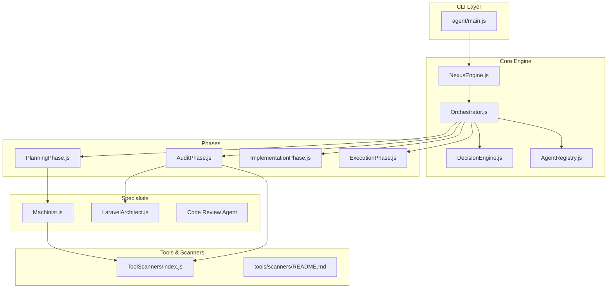
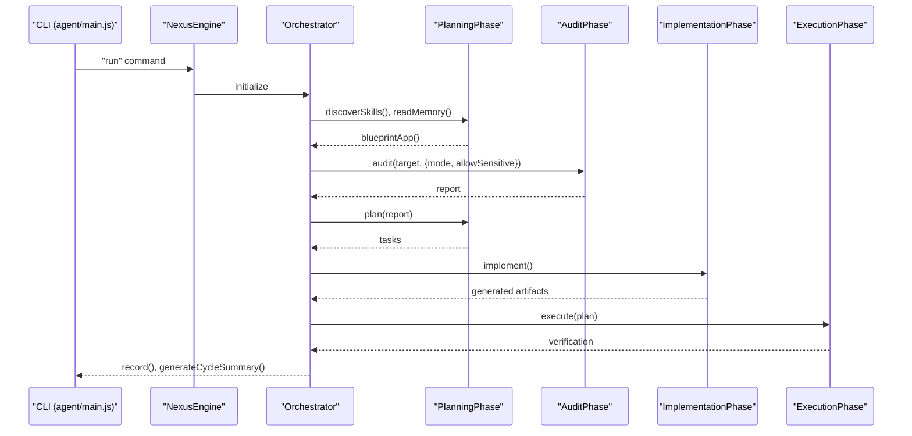
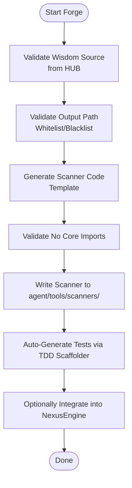
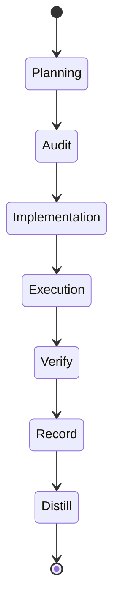
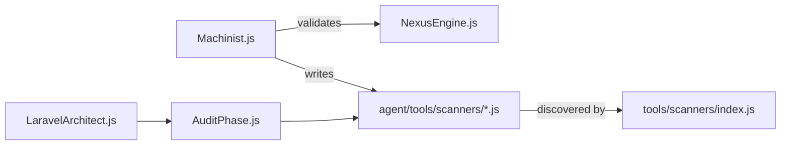

# Development Agents

<cite>
**Referenced Files in This Document**
- [agent/main.js](file://agent/main.js)
- [agent/core/Machinist.js](file://agent/core/Machinist.js)
- [agent/core/NexusEngine.js](file://agent/core/NexusEngine.js)
- [agent/prompts/internal/machinist.md](file://agent/prompts/internal/machinist.md)
- [agent/prompts/internal/code-review-agent.md](file://agent/prompts/internal/code-review-agent.md)
- [agent/core/AgentRegistry.js](file://agent/core/AgentRegistry.js)
- [agent/core/DecisionEngine.js](file://agent/core/DecisionEngine.js)
- [agent/core/Orchestrator.js](file://agent/core/Orchestrator.js)
- [agent/core/TaskProtocol.js](file://agent/core/TaskProtocol.js)
- [agent/core/ExecutionPhase.js](file://agent/core/ExecutionPhase.js)
- [agent/core/ImplementationPhase.js](file://agent/core/ImplementationPhase.js)
- [agent/core/PlanningPhase.js](file://agent/core/PlanningPhase.js)
- [agent/core/AuditPhase.js](file://agent/core/AuditPhase.js)
- [agent/core/WorktreeManager.js](file://agent/core/WorktreeManager.js)
- [agent/core/SandboxExecutor.js](file://agent/core/SandboxExecutor.js)
- [agent/core/ResourceMonitor.js](file://agent/core/ResourceMonitor.js)
- [agent/core/ParallelRunner.js](file://agent/core/ParallelRunner.js)
- [agent/core/LocalIntelligence.js](file://agent/core/LocalIntelligence.js)
- [agent/core/NexusClock.js](file://agent/core/NexusClock.js)
- [agent/core/EventBus.js](file://agent/core/EventBus.js)
- [agent/core/Logger.js](file://agent/core/Logger.js)
- [agent/core/Modifier.js](file://agent/core/Modifier.js)
- [agent/core/Distiller.js](file://agent/core/Distiller.js)
- [agent/core/EvolutionPiper.js](file://agent/core/EvolutionPiper.js)
- [agent/core/LaravelArchitect.js](file://agent/core/LaravelArchitect.js)
- [agent/core/MemoryGovernor.js](file://agent/core/MemoryGovernor.js)
- [agent/core/MemoryPipeline.js](file://agent/core/MemoryPipeline.js)
- [agent/core/NativeBridge.js](file://agent/core/NativeBridge.js)
- [agent/core/NexusError.js](file://agent/core/NexusError.js)
- [agent/core/RedisMemory.js](file://agent/core/RedisMemory.js)
- [agent/core/SemanticEngine.js](file://agent/core/SemanticEngine.js)
- [agent/core/ToolScanners/index.js](file://agent/tools/scanners/index.js)
- [agent/tools/scanners/README.md](file://agent/tools/scanners/README.md)
- [agent/scripts/tdd_automated_loop.js](file://agent/scripts/tdd_automated_loop.js)
- [tests/TDD/Machinist.test.js](file://tests/TDD/Machinist.test.js)
- [tests/TDD/Orchestrator.test.js](file://tests/TDD/Orchestrator.test.js)
- [tests/TDD/nexus-engine.test.js](file://tests/TDD/nexus-engine.test.js)
- [tests/TDD/MemoryGovernor.test.js](file://tests/TDD/MemoryGovernor.test.js)
- [tests/TDD/TDDGuard.test.js](file://tests/TDD/TDDGuard.test.js)
- [tests/TDD/EvolutionPiper.test.js](file://tests/TDD/EvolutionPiper.test.js)
- [tests/TDD/distiller.test.js](file://tests/TDD/distiller.test.js)
- [tests/TDD/phase1_testing.js](file://tests/TDD/phase1_testing.js)
- [tests/TDD/sandbox-master-runner.js](file://tests/TDD/sandbox-master-runner.js)
- [tests/TDD/SandboxProjectSetup.js](file://tests/TDD/SandboxProjectSetup.js)
- [tests/TDD/runner.js](file://tests/TDD/runner.js)
- [tests/TDD/setup_dynamic_section.js](file://tests/TDD/setup_dynamic_section.js)
- [tests/TDD/setup_section2.js](file://tests/TDD/setup_section2.js)
- [tests/TDD/setup_section3.js](file://tests/TDD/setup_section3.js)
- [tests/TDD/similarity.test.js](file://tests/TDD/similarity.test.js)
- [tests/TDD/upgrade_to_tall.js](file://tests/TDD/upgrade_to_tall.js)
- [tests/sandboxes/](file://tests/sandboxes/)
</cite>

## Table of Contents
1. [Introduction](#introduction)
2. [Project Structure](#project-structure)
3. [Core Components](#core-components)
4. [Architecture Overview](#architecture-overview)
5. [Detailed Component Analysis](#detailed-component-analysis)
6. [Dependency Analysis](#dependency-analysis)
7. [Performance Considerations](#performance-considerations)
8. [Troubleshooting Guide](#troubleshooting-guide)
9. [Conclusion](#conclusion)
10. [Appendices](#appendices)

## Introduction
This document describes the NEXUS AI development agents ecosystem with a focus on code generation, refactoring, and Laravel application development. It documents the Machinist agent as the primary code generation and self-evolution specialist, the Code Review Agent for quality assurance, and specialized Laravel agents covering core framework components, packages, queues, events, APIs, Blade templates, broadcasting, notifications, middleware, authentication, OAuth, websockets, and database operations. The guide explains agent capabilities including code generation patterns, refactoring strategies, dependency management, testing frameworks (Pest PHP), and Laravel-specific development workflows. It also includes examples of agent interactions, code generation outputs, and integration patterns with development pipelines.

## Project Structure
The NEXUS AI engine is organized around a deterministic, rule-based pipeline orchestrated by NexusEngine. Agents are registered and managed by AgentRegistry, with specialized phases for planning, auditing, implementation, execution, verification, and documentation. Machinist governs the creation and integration of new autonomous machines (scanners) into the system, enforcing strict guardrails to maintain system integrity.

**Diagram sources**
- [agent/main.js:19-121](file://agent/main.js#L19-L121)
- [agent/core/NexusEngine.js](file://agent/core/NexusEngine.js)
- [agent/core/Orchestrator.js](file://agent/core/Orchestrator.js)
- [agent/core/PlanningPhase.js](file://agent/core/PlanningPhase.js)
- [agent/core/AuditPhase.js](file://agent/core/AuditPhase.js)
- [agent/core/ImplementationPhase.js](file://agent/core/ImplementationPhase.js)
- [agent/core/ExecutionPhase.js](file://agent/core/ExecutionPhase.js)
- [agent/core/Machinist.js:30-157](file://agent/core/Machinist.js#L30-L157)
- [agent/core/LaravelArchitect.js](file://agent/core/LaravelArchitect.js)
- [agent/core/AgentRegistry.js](file://agent/core/AgentRegistry.js)
- [agent/tools/scanners/index.js](file://agent/tools/scanners/index.js)
- [agent/tools/scanners/README.md](file://agent/tools/scanners/README.md)

**Section sources**
- [agent/main.js:19-121](file://agent/main.js#L19-L121)
- [agent/core/NexusEngine.js](file://agent/core/NexusEngine.js)
- [agent/core/AgentRegistry.js](file://agent/core/AgentRegistry.js)

## Core Components
- NexusEngine: Central orchestrator coordinating phases and agent lifecycle.
- AgentRegistry: Discovers and manages available agents and skills.
- DecisionEngine: Applies governance rules and constraints to agent actions.
- Orchestrator: Coordinates phase transitions and task protocols.
- PlanningPhase, AuditPhase, ImplementationPhase, ExecutionPhase: Deterministic stages of the SDLC.
- Machinist: Self-evolution engine that generates and integrates new scanners safely.
- LaravelArchitect: Specialized agent for Laravel ecosystem operations.
- ToolScanners: Dynamic pool of autonomous scanners (including forged scanners).

Key capabilities:
- Code generation patterns: Deterministic templates, guardrail enforcement, and TDD scaffolding.
- Refactoring strategies: Pattern-based analysis, automated integration, and validation loops.
- Dependency management: Strict import whitelisting and path validation.
- Testing frameworks: Integrated TDD scaffolding and automated sandbox runs.
- Laravel-specific workflows: Blade, queues, events, broadcasting, notifications, middleware, authentication, OAuth, websockets, and database operations.

**Section sources**
- [agent/core/NexusEngine.js](file://agent/core/NexusEngine.js)
- [agent/core/AgentRegistry.js](file://agent/core/AgentRegistry.js)
- [agent/core/DecisionEngine.js](file://agent/core/DecisionEngine.js)
- [agent/core/Orchestrator.js](file://agent/core/Orchestrator.js)
- [agent/core/PlanningPhase.js](file://agent/core/PlanningPhase.js)
- [agent/core/AuditPhase.js](file://agent/core/AuditPhase.js)
- [agent/core/ImplementationPhase.js](file://agent/core/ImplementationPhase.js)
- [agent/core/ExecutionPhase.js](file://agent/core/ExecutionPhase.js)
- [agent/core/Machinist.js:30-204](file://agent/core/Machinist.js#L30-L204)
- [agent/core/LaravelArchitect.js](file://agent/core/LaravelArchitect.js)
- [agent/tools/scanners/index.js](file://agent/tools/scanners/index.js)

## Architecture Overview
The system follows a strict deterministic pipeline with explicit stage isolation and controlled evolution. Agents operate within defined roles and constraints, ensuring reproducibility and traceability.

**Diagram sources**
- [agent/main.js:36-121](file://agent/main.js#L36-L121)
- [agent/core/NexusEngine.js](file://agent/core/NexusEngine.js)
- [agent/core/PlanningPhase.js](file://agent/core/PlanningPhase.js)
- [agent/core/AuditPhase.js](file://agent/core/AuditPhase.js)
- [agent/core/ImplementationPhase.js](file://agent/core/ImplementationPhase.js)
- [agent/core/ExecutionPhase.js](file://agent/core/ExecutionPhase.js)

## Detailed Component Analysis

### Machinist: Self-Evolution and Code Generation Specialist
Machinist transforms institutional knowledge into autonomous machines (scanners) with strict guardrails:
- Path validation: Whitelist/blacklist enforcement for safe writes.
- Wisdom validation: Ensures knowledge originates from the official HUB.
- Import validation: Prevents generated scanners from importing core modules.
- Integration: Dynamically updates NexusEngine to register new scanners.
- TDD scaffolding: Auto-generates tests for forged scanners.

**Diagram sources**
- [agent/core/Machinist.js:163-204](file://agent/core/Machinist.js#L163-L204)
- [agent/core/Machinist.js:43-100](file://agent/core/Machinist.js#L43-L100)
- [agent/core/Machinist.js:105-157](file://agent/core/Machinist.js#L105-L157)

**Section sources**
- [agent/core/Machinist.js:30-204](file://agent/core/Machinist.js#L30-L204)
- [agent/prompts/internal/machinist.md:15-27](file://agent/prompts/internal/machinist.md#L15-L27)
- [agent/prompts/internal/machinist.md:225-245](file://agent/prompts/internal/machinist.md#L225-L245)

### Code Review Agent: Quality Assurance
The Code Review Agent provides comprehensive quality checks across frontend, backend, performance, security, and UX domains. It leverages a large skill registry to guide reviews and ensure adherence to best practices.

Capabilities:
- Multi-domain review: Forms, accessibility, performance, security, UX, and more.
- Skill-based guidance: Uses injected skills to tailor review criteria.
- Structured output: Reviews are documented and traceable.

**Section sources**
- [agent/prompts/internal/code-review-agent.md:16-18](file://agent/prompts/internal/code-review-agent.md#L16-L18)
- [agent/prompts/internal/code-review-agent.md:20-776](file://agent/prompts/internal/code-review-agent.md#L20-L776)

### Laravel Agents: Framework and Ecosystem Specialists
LaravelArchitect coordinates specialized agents for:
- Core framework components
- Packages and Composer dependency management
- Queues and jobs
- Events and event broadcasting
- APIs and controllers
- Blade templates and Livewire
- Broadcasting and notifications
- Middleware and routing
- Authentication, OAuth, Sanctum
- WebSockets and real-time features
- Database operations and migrations

These agents operate within the deterministic pipeline, ensuring Laravel-specific tasks are executed consistently and documented.

**Section sources**
- [agent/core/LaravelArchitect.js](file://agent/core/LaravelArchitect.js)

### Phase-Based SDLC
The pipeline ensures deterministic execution across phases:
- Planning: Blueprint discovery, skill registry, and task breakdown.
- Audit: System-wide scanning using dynamic scanners and Laravel specialists.
- Implementation: Code generation and artifact creation.
- Execution: Controlled application of changes with verification.
- Verification: Stability checks and documentation.

**Diagram sources**
- [agent/core/PlanningPhase.js](file://agent/core/PlanningPhase.js)
- [agent/core/AuditPhase.js](file://agent/core/AuditPhase.js)
- [agent/core/ImplementationPhase.js](file://agent/core/ImplementationPhase.js)
- [agent/core/ExecutionPhase.js](file://agent/core/ExecutionPhase.js)

**Section sources**
- [agent/core/PlanningPhase.js](file://agent/core/PlanningPhase.js)
- [agent/core/AuditPhase.js](file://agent/core/AuditPhase.js)
- [agent/core/ImplementationPhase.js](file://agent/core/ImplementationPhase.js)
- [agent/core/ExecutionPhase.js](file://agent/core/ExecutionPhase.js)

### Agent Orchestration and Governance
- AgentRegistry discovers agents and skills.
- DecisionEngine enforces institutional constraints.
- TaskProtocol defines standardized interaction patterns.
- WorktreeManager isolates change workspaces.
- SandboxExecutor runs automated tests and validations.
- ResourceMonitor tracks system health.
- ParallelRunner executes scanners concurrently.
- LocalIntelligence provides local AI insights.
- EventBus coordinates inter-agent communication.
- Logger maintains audit trails.
- Modifier, Distiller, EvolutionPiper, MemoryGovernor, MemoryPipeline, NativeBridge, NexusClock, NexusError, RedisMemory, SemanticEngine ensure robustness and traceability.

**Section sources**
- [agent/core/AgentRegistry.js](file://agent/core/AgentRegistry.js)
- [agent/core/DecisionEngine.js](file://agent/core/DecisionEngine.js)
- [agent/core/TaskProtocol.js](file://agent/core/TaskProtocol.js)
- [agent/core/WorktreeManager.js](file://agent/core/WorktreeManager.js)
- [agent/core/SandboxExecutor.js](file://agent/core/SandboxExecutor.js)
- [agent/core/ResourceMonitor.js](file://agent/core/ResourceMonitor.js)
- [agent/core/ParallelRunner.js](file://agent/core/ParallelRunner.js)
- [agent/core/LocalIntelligence.js](file://agent/core/LocalIntelligence.js)
- [agent/core/NexusClock.js](file://agent/core/NexusClock.js)
- [agent/core/EventBus.js](file://agent/core/EventBus.js)
- [agent/core/Logger.js](file://agent/core/Logger.js)
- [agent/core/Modifier.js](file://agent/core/Modifier.js)
- [agent/core/Distiller.js](file://agent/core/Distiller.js)
- [agent/core/EvolutionPiper.js](file://agent/core/EvolutionPiper.js)
- [agent/core/MemoryGovernor.js](file://agent/core/MemoryGovernor.js)
- [agent/core/MemoryPipeline.js](file://agent/core/MemoryPipeline.js)
- [agent/core/NativeBridge.js](file://agent/core/NativeBridge.js)
- [agent/core/NexusError.js](file://agent/core/NexusError.js)
- [agent/core/RedisMemory.js](file://agent/core/RedisMemory.js)
- [agent/core/SemanticEngine.js](file://agent/core/SemanticEngine.js)

## Dependency Analysis
Machinist depends on NexusEngine internals and enforces guardrails to prevent unauthorized core imports. ToolScanners are dynamically loaded and validated before integration.

**Diagram sources**
- [agent/core/Machinist.js:163-204](file://agent/core/Machinist.js#L163-L204)
- [agent/core/NexusEngine.js](file://agent/core/NexusEngine.js)
- [agent/tools/scanners/index.js](file://agent/tools/scanners/index.js)
- [agent/core/AuditPhase.js](file://agent/core/AuditPhase.js)
- [agent/core/LaravelArchitect.js](file://agent/core/LaravelArchitect.js)

**Section sources**
- [agent/core/Machinist.js:163-204](file://agent/core/Machinist.js#L163-L204)
- [agent/tools/scanners/index.js](file://agent/tools/scanners/index.js)

## Performance Considerations
- Deterministic pipeline: Predictable execution order prevents race conditions and reduces overhead.
- Parallel scanner execution: ParallelRunner maximizes throughput during audits.
- Resource monitoring: ResourceMonitor tracks CPU/RAM to prevent overload.
- Sandbox testing: Automated sandbox runs validate changes without impacting production environments.
- Guardrails: Path and import validations prevent costly runtime errors.

[No sources needed since this section provides general guidance]

## Troubleshooting Guide
Common issues and resolutions:
- Path traversal violations: Ensure output paths are whitelisted and normalized.
- Forbidden imports: Remove core module imports from generated scanners.
- Integration failures: Verify NexusEngine anchors and dynamic fallbacks.
- Sandbox runner errors: Confirm runner availability and permissions.
- Dead letter queue: Inspect failed tasks and resolve underlying causes.

**Section sources**
- [agent/core/Machinist.js:43-100](file://agent/core/Machinist.js#L43-L100)
- [agent/main.js:181-219](file://agent/main.js#L181-L219)
- [agent/main.js:220-244](file://agent/main.js#L220-L244)

## Conclusion
NEXUS AI’s development agents provide a robust, deterministic framework for code generation, refactoring, and Laravel-specific development. Machinist enables safe self-evolution, the Code Review Agent ensures quality, and specialized Laravel agents streamline framework operations. The system’s guardrails, traceability, and automated testing integrate seamlessly with development pipelines, supporting continuous improvement and zero-flaw outcomes.

[No sources needed since this section summarizes without analyzing specific files]

## Appendices

### Agent Interaction Examples
- CLI orchestration: The CLI drives the full pipeline, prompting approvals and managing modes.
- Agent discovery: Skills and agents are listed for transparency and governance.
- Sandbox automation: Automated runners execute comprehensive test suites.

**Section sources**
- [agent/main.js:122-151](file://agent/main.js#L122-L151)
- [agent/main.js:134-141](file://agent/main.js#L134-L141)
- [agent/main.js:181-219](file://agent/main.js#L181-L219)

### Testing and Validation
- TDD scaffolding: Automated test generation for new scanners.
- Unit tests: Comprehensive test suites for core components.
- Sandbox master runner: Orchestrates multi-project validation.

**Section sources**
- [agent/scripts/tdd_automated_loop.js](file://agent/scripts/tdd_automated_loop.js)
- [tests/TDD/Machinist.test.js](file://tests/TDD/Machinist.test.js)
- [tests/TDD/Orchestrator.test.js](file://tests/TDD/Orchestrator.test.js)
- [tests/TDD/nexus-engine.test.js](file://tests/TDD/nexus-engine.test.js)
- [tests/TDD/MemoryGovernor.test.js](file://tests/TDD/MemoryGovernor.test.js)
- [tests/TDD/TDDGuard.test.js](file://tests/TDD/TDDGuard.test.js)
- [tests/TDD/EvolutionPiper.test.js](file://tests/TDD/EvolutionPiper.test.js)
- [tests/TDD/distiller.test.js](file://tests/TDD/distiller.test.js)
- [tests/TDD/sandbox-master-runner.js](file://tests/TDD/sandbox-master-runner.js)
- [tests/TDD/SandboxProjectSetup.js](file://tests/TDD/SandboxProjectSetup.js)
- [tests/TDD/runner.js](file://tests/TDD/runner.js)
- [tests/TDD/phase1_testing.js](file://tests/TDD/phase1_testing.js)
- [tests/TDD/setup_dynamic_section.js](file://tests/TDD/setup_dynamic_section.js)
- [tests/TDD/setup_section2.js](file://tests/TDD/setup_section2.js)
- [tests/TDD/setup_section3.js](file://tests/TDD/setup_section3.js)
- [tests/TDD/similarity.test.js](file://tests/TDD/similarity.test.js)
- [tests/TDD/upgrade_to_tall.js](file://tests/TDD/upgrade_to_tall.js)
- [tests/sandboxes/](file://tests/sandboxes/)