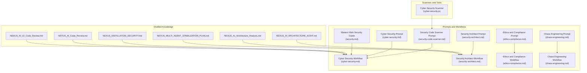
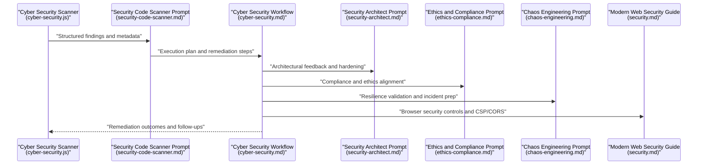
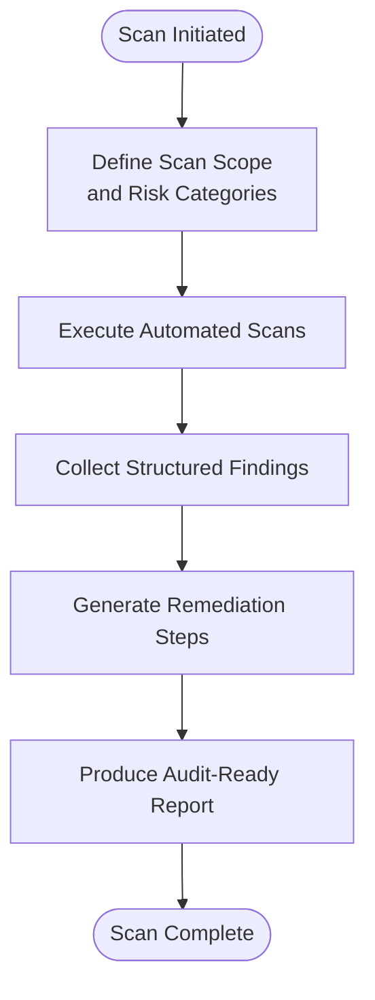
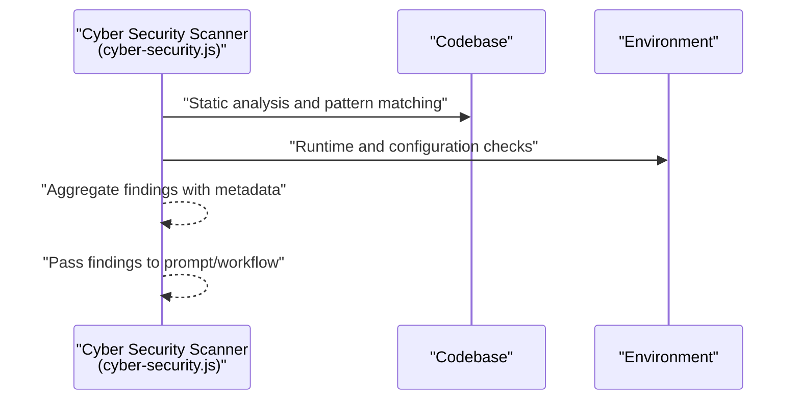
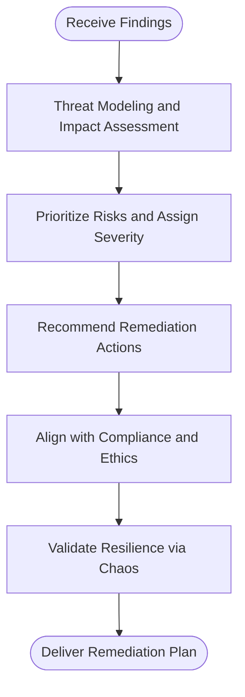
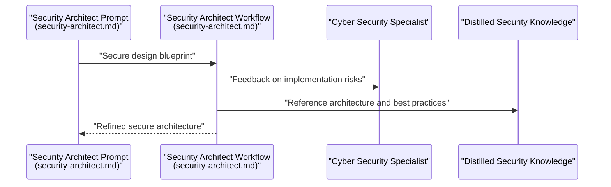
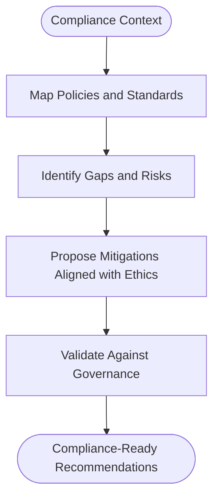
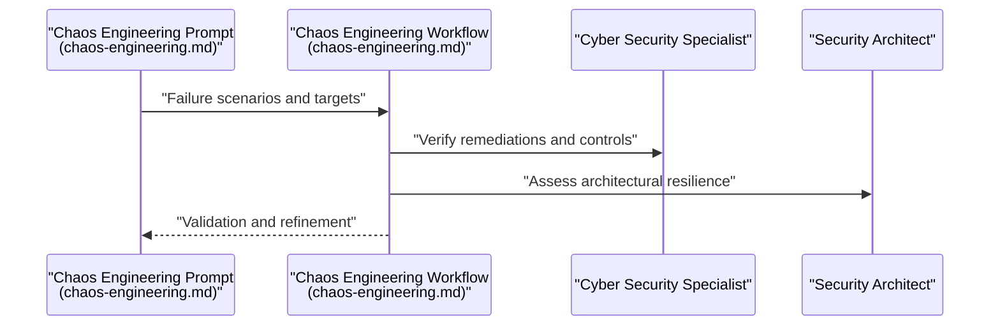
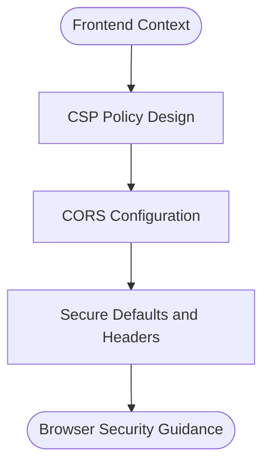
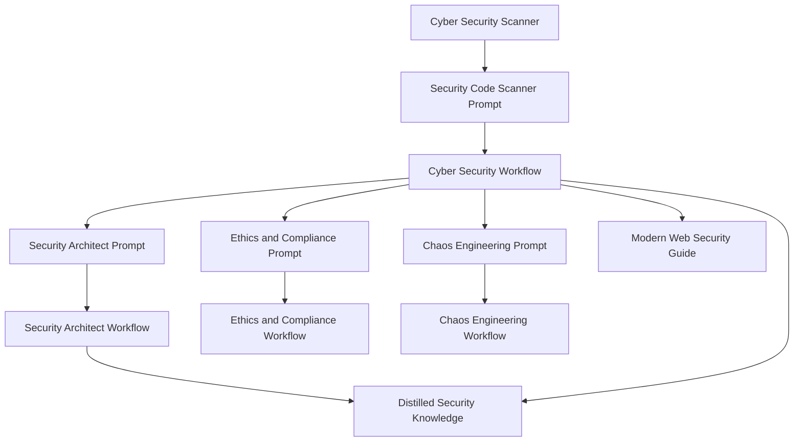

# Security Agents

<cite>
**Referenced Files in This Document**
- [cyber-security.js](file://agent/tools/scanners/cyber-security.js)
- [security-code-scanner.md](file://agent/prompts/internal/security-code-scanner.md)
- [cyber-security.md](file://agent/prompts/internal/cyber-security.md)
- [cyber-security.md](file://agent/prompts/external/security/cyber-security.md)
- [security-architect.md](file://agent/prompts/external/security/security-architect.md)
- [ethics-compliance.md](file://agent/prompts/external/security/ethics-compliance.md)
- [chaos-engineering.md](file://agent/prompts/external/security/chaos-engineering.md)
- [cyber-security.md](file://agent/workflows/external/security/cyber-security.md)
- [security-architect.md](file://agent/workflows/external/security/security-architect.md)
- [ethics-compliance.md](file://agent/workflows/external/security/ethics-compliance.md)
- [chaos-engineering.md](file://agent/workflows/external/security/chaos-engineering.md)
- [NEXUS_DISTILLATION_SECURITY.md](file://memory/distilled/security/NEXUS_DISTILLATION_SECURITY.md)
- [NEXUS_AI_ARCHITECTURE_AUDIT.md](file://memory/distilled/security/NEXUS_AI_ARCHITECTURE_AUDIT.md)
- [NEXUS_AI_Architecture_Analysis.md](file://memory/distilled/security/NEXUS_AI_Architecture_Analysis.md)
- [NEXUS_AI_Code_Review.md](file://memory/distilled/security/NEXUS_AI_Code_Review.md)
- [NEXUS_AI_v2_Code_Review.md](file://memory/distilled/security/NEXUS_AI_v2_Code_Review.md)
- [NEXUS_MULTI_AGENT_STABILIZATION_PLAN.md](file://memory/distilled/security/NEXUS_MULTI_AGENT_STABILIZATION_PLAN.md)
- [security.md](file://agent/workflows/external/frontend/modern-web-guidance/guides/security/security.md)
</cite>

## Table of Contents
1. [Introduction](#introduction)
2. [Project Structure](#project-structure)
3. [Core Components](#core-components)
4. [Architecture Overview](#architecture-overview)
5. [Detailed Component Analysis](#detailed-component-analysis)
6. [Dependency Analysis](#dependency-analysis)
7. [Performance Considerations](#performance-considerations)
8. [Troubleshooting Guide](#troubleshooting-guide)
9. [Conclusion](#conclusion)
10. [Appendices](#appendices)

## Introduction
This document describes the Security Agents ecosystem within NEXUS AI, focusing on automated threat detection, vulnerability assessment, and security architecture capabilities. It synthesizes scanner tools, specialized prompts, workflows, and distilled security knowledge to present a cohesive framework for building, operating, and auditing secure systems. The coverage includes Security Code Scanner for automated vulnerability detection, Cyber Security specialists for comprehensive security analysis, and cross-cutting specializations for modern authentication, browser security, attack prevention, and compliance.

## Project Structure
Security agents are organized around three pillars:
- Scanners and Tools: Automated detection and remediation helpers
- Prompts and Workflows: Structured reasoning and execution plans for security tasks
- Distilled Knowledge: Security-aware synthesis of architecture, audits, and reviews

**Diagram sources**
- [cyber-security.js](file://agent/tools/scanners/cyber-security.js)
- [security-code-scanner.md](file://agent/prompts/internal/security-code-scanner.md)
- [cyber-security.md](file://agent/prompts/internal/cyber-security.md)
- [cyber-security.md](file://agent/prompts/external/security/cyber-security.md)
- [security-architect.md](file://agent/prompts/external/security/security-architect.md)
- [ethics-compliance.md](file://agent/prompts/external/security/ethics-compliance.md)
- [chaos-engineering.md](file://agent/prompts/external/security/chaos-engineering.md)
- [cyber-security.md](file://agent/workflows/external/security/cyber-security.md)
- [security-architect.md](file://agent/workflows/external/security/security-architect.md)
- [ethics-compliance.md](file://agent/workflows/external/security/ethics-compliance.md)
- [chaos-engineering.md](file://agent/workflows/external/security/chaos-engineering.md)
- [security.md](file://agent/workflows/external/frontend/modern-web-guidance/guides/security/security.md)
- [NEXUS_DISTILLATION_SECURITY.md](file://memory/distilled/security/NEXUS_DISTILLATION_SECURITY.md)
- [NEXUS_AI_ARCHITECTURE_AUDIT.md](file://memory/distilled/security/NEXUS_AI_ARCHITECTURE_AUDIT.md)
- [NEXUS_AI_Architecture_Analysis.md](file://memory/distilled/security/NEXUS_AI_Architecture_Analysis.md)
- [NEXUS_AI_Code_Review.md](file://memory/distilled/security/NEXUS_AI_Code_Review.md)
- [NEXUS_AI_v2_Code_Review.md](file://memory/distilled/security/NEXUS_AI_v2_Code_Review.md)
- [NEXUS_MULTI_AGENT_STABILIZATION_PLAN.md](file://memory/distilled/security/NEXUS_MULTI_AGENT_STABILIZATION_PLAN.md)

**Section sources**
- [cyber-security.js](file://agent/tools/scanners/cyber-security.js)
- [security-code-scanner.md](file://agent/prompts/internal/security-code-scanner.md)
- [cyber-security.md](file://agent/prompts/internal/cyber-security.md)
- [NEXUS_DISTILLATION_SECURITY.md](file://memory/distilled/security/NEXUS_DISTILLATION_SECURITY.md)

## Core Components
- Security Code Scanner: Internal prompt that defines scanning scope, risk categories, remediation steps, and reporting expectations for automated vulnerability detection.
- Cyber Security Scanner: Tool that performs security scans and feeds structured findings into downstream workflows.
- Cyber Security Specialist: External prompt and workflow that guide comprehensive security analysis, including threat modeling, risk assessment, and remediation planning.
- Security Architect: External prompt and workflow that focus on secure architecture design, integration patterns, and long-term security posture.
- Ethics and Compliance: External prompt and workflow that align security practices with ethical guidelines and regulatory compliance.
- Chaos Engineering: External prompt and workflow that introduce controlled failure modes to validate resilience and incident response readiness.
- Modern Web Security Guide: Frontend-focused guidance for browser security controls such as CSP, CORS, and secure defaults.

These components collectively enable automated detection, guided analysis, and continuous improvement of security posture across the system.

**Section sources**
- [security-code-scanner.md](file://agent/prompts/internal/security-code-scanner.md)
- [cyber-security.js](file://agent/tools/scanners/cyber-security.js)
- [cyber-security.md](file://agent/prompts/external/security/cyber-security.md)
- [security-architect.md](file://agent/prompts/external/security/security-architect.md)
- [ethics-compliance.md](file://agent/prompts/external/security/ethics-compliance.md)
- [chaos-engineering.md](file://agent/prompts/external/security/chaos-engineering.md)
- [security.md](file://agent/workflows/external/frontend/modern-web-guidance/guides/security/security.md)

## Architecture Overview
The Security Agents architecture integrates scanners, prompts, workflows, and distilled knowledge to deliver a robust security pipeline. The scanner emits findings; prompts define the reasoning and remediation steps; workflows orchestrate multi-step security tasks; and distilled knowledge provides synthesized insights for architecture and audits.

**Diagram sources**
- [cyber-security.js](file://agent/tools/scanners/cyber-security.js)
- [security-code-scanner.md](file://agent/prompts/internal/security-code-scanner.md)
- [cyber-security.md](file://agent/workflows/external/security/cyber-security.md)
- [security-architect.md](file://agent/workflows/external/security/security-architect.md)
- [ethics-compliance.md](file://agent/workflows/external/security/ethics-compliance.md)
- [chaos-engineering.md](file://agent/workflows/external/security/chaos-engineering.md)
- [security.md](file://agent/workflows/external/frontend/modern-web-guidance/guides/security/security.md)

## Detailed Component Analysis

### Security Code Scanner
- Purpose: Define scanning scope, risk categories, remediation steps, and reporting expectations for automated vulnerability detection.
- Inputs: Target codebase, configuration, and environment context.
- Outputs: Structured findings, severity ratings, remediation suggestions, and audit-ready reports.
- Integration: Bridges scanner tool outputs to workflow execution and remediation orchestration.

**Diagram sources**
- [security-code-scanner.md](file://agent/prompts/internal/security-code-scanner.md)

**Section sources**
- [security-code-scanner.md](file://agent/prompts/internal/security-code-scanner.md)

### Cyber Security Scanner (Tool)
- Purpose: Perform security scans against codebases and environments, capturing vulnerabilities, misconfigurations, and insecure patterns.
- Inputs: Source code, configuration files, runtime artifacts, and environment variables.
- Outputs: Structured findings with metadata suitable for prompt-driven workflows.
- Integration: Feeds findings into Security Code Scanner prompt and broader workflows.

**Diagram sources**
- [cyber-security.js](file://agent/tools/scanners/cyber-security.js)

**Section sources**
- [cyber-security.js](file://agent/tools/scanners/cyber-security.js)

### Cyber Security Specialist (Prompt and Workflow)
- Purpose: Provide comprehensive security analysis, including threat modeling, risk assessment, and remediation planning aligned with organizational policies.
- Inputs: Structured findings, architectural context, compliance requirements, and stakeholder concerns.
- Outputs: Actionable remediation plans, risk registers, and governance-aligned recommendations.
- Integration: Coordinates with Security Architect, Ethics and Compliance, and Chaos Engineering workflows.

**Diagram sources**
- [cyber-security.md](file://agent/prompts/external/security/cyber-security.md)
- [cyber-security.md](file://agent/workflows/external/security/cyber-security.md)

**Section sources**
- [cyber-security.md](file://agent/prompts/external/security/cyber-security.md)
- [cyber-security.md](file://agent/workflows/external/security/cyber-security.md)

### Security Architect (Prompt and Workflow)
- Purpose: Focus on secure architecture design, integration patterns, and long-term security posture.
- Inputs: System architecture, integration points, data flows, and security requirements.
- Outputs: Secure design blueprints, integration guidelines, and hardening recommendations.
- Integration: Collaborates with Cyber Security Specialist and Multi-Agent Stabilization plans.

**Diagram sources**
- [security-architect.md](file://agent/prompts/external/security/security-architect.md)
- [security-architect.md](file://agent/workflows/external/security/security-architect.md)
- [NEXUS_MULTI_AGENT_STABILIZATION_PLAN.md](file://memory/distilled/security/NEXUS_MULTI_AGENT_STABILIZATION_PLAN.md)

**Section sources**
- [security-architect.md](file://agent/prompts/external/security/security-architect.md)
- [security-architect.md](file://agent/workflows/external/security/security-architect.md)
- [NEXUS_MULTI_AGENT_STABILIZATION_PLAN.md](file://memory/distilled/security/NEXUS_MULTI_AGENT_STABILIZATION_PLAN.md)

### Ethics and Compliance (Prompt and Workflow)
- Purpose: Ensure security practices align with ethical guidelines and regulatory compliance.
- Inputs: Legal and policy documents, compliance frameworks, and stakeholder obligations.
- Outputs: Ethical risk assessments, compliance checklists, and governance-aligned recommendations.
- Integration: Cross-checks with Cyber Security and Security Architect workflows.

**Diagram sources**
- [ethics-compliance.md](file://agent/prompts/external/security/ethics-compliance.md)
- [ethics-compliance.md](file://agent/workflows/external/security/ethics-compliance.md)

**Section sources**
- [ethics-compliance.md](file://agent/prompts/external/security/ethics-compliance.md)
- [ethics-compliance.md](file://agent/workflows/external/security/ethics-compliance.md)

### Chaos Engineering (Prompt and Workflow)
- Purpose: Introduce controlled failure modes to validate resilience and incident response readiness.
- Inputs: System behavior under normal conditions, failure injection targets, and response procedures.
- Outputs: Resilience validation reports, incident response playbooks, and improvement recommendations.
- Integration: Validates remediations from Cyber Security Specialist and informs Security Architect updates.

**Diagram sources**
- [chaos-engineering.md](file://agent/prompts/external/security/chaos-engineering.md)
- [chaos-engineering.md](file://agent/workflows/external/security/chaos-engineering.md)

**Section sources**
- [chaos-engineering.md](file://agent/prompts/external/security/chaos-engineering.md)
- [chaos-engineering.md](file://agent/workflows/external/security/chaos-engineering.md)

### Modern Web Security Guide
- Purpose: Provide browser security controls such as CSP, CORS, and secure defaults for frontend applications.
- Inputs: Application configuration, deployment context, and security requirements.
- Outputs: Browser security policy recommendations, CSP configurations, and CORS setups.
- Integration: Guides remediation in Cyber Security workflows for frontend-specific issues.

**Diagram sources**
- [security.md](file://agent/workflows/external/frontend/modern-web-guidance/guides/security/security.md)

**Section sources**
- [security.md](file://agent/workflows/external/frontend/modern-web-guidance/guides/security/security.md)

## Dependency Analysis
Security agents depend on each other through shared inputs (findings), coordinated outputs (remediation plans), and cross-workflow feedback loops. Distilled knowledge supports decision-making and ensures consistency across agents.

**Diagram sources**
- [cyber-security.js](file://agent/tools/scanners/cyber-security.js)
- [security-code-scanner.md](file://agent/prompts/internal/security-code-scanner.md)
- [cyber-security.md](file://agent/workflows/external/security/cyber-security.md)
- [security-architect.md](file://agent/workflows/external/security/security-architect.md)
- [ethics-compliance.md](file://agent/workflows/external/security/ethics-compliance.md)
- [chaos-engineering.md](file://agent/workflows/external/security/chaos-engineering.md)
- [security.md](file://agent/workflows/external/frontend/modern-web-guidance/guides/security/security.md)
- [NEXUS_DISTILLATION_SECURITY.md](file://memory/distilled/security/NEXUS_DISTILLATION_SECURITY.md)

**Section sources**
- [NEXUS_DISTILLATION_SECURITY.md](file://memory/distilled/security/NEXUS_DISTILLATION_SECURITY.md)
- [NEXUS_AI_ARCHITECTURE_AUDIT.md](file://memory/distilled/security/NEXUS_AI_ARCHITECTURE_AUDIT.md)
- [NEXUS_AI_Architecture_Analysis.md](file://memory/distilled/security/NEXUS_AI_Architecture_Analysis.md)
- [NEXUS_AI_Code_Review.md](file://memory/distilled/security/NEXUS_AI_Code_Review.md)
- [NEXUS_AI_v2_Code_Review.md](file://memory/distilled/security/NEXUS_AI_v2_Code_Review.md)

## Performance Considerations
- Scanning Scope: Limit scan scope to relevant modules and environments to reduce false positives and improve turnaround.
- Remediation Prioritization: Use severity and impact scoring to prioritize remediation actions and allocate resources efficiently.
- Feedback Loops: Integrate iterative feedback between Cyber Security Specialist, Security Architect, and Chaos Engineering to avoid redundant work and accelerate improvements.
- Knowledge Reuse: Leverage distilled security knowledge to avoid repeating analyses and to maintain consistency across projects.

## Troubleshooting Guide
- Scanner Failures: Verify scanner configuration and environment variables; ensure the scanner tool is invoked with correct parameters and target paths.
- Prompt Misalignment: Confirm that prompts receive structured findings with sufficient metadata; adjust prompt instructions if outputs are incomplete or off-topic.
- Workflow Coordination: Validate inter-agent communication channels; ensure that outputs from one workflow are properly consumed by the next stage.
- Compliance and Ethics: Align remediation recommendations with applicable policies and standards; escalate unresolved ethical or legal concerns to governance bodies.
- Resilience Validation: Use Chaos Engineering to validate remediations; confirm that failure scenarios are representative and that incident response procedures are effective.

**Section sources**
- [cyber-security.js](file://agent/tools/scanners/cyber-security.js)
- [cyber-security.md](file://agent/workflows/external/security/cyber-security.md)
- [ethics-compliance.md](file://agent/workflows/external/security/ethics-compliance.md)
- [chaos-engineering.md](file://agent/workflows/external/security/chaos-engineering.md)

## Conclusion
NEXUS AI’s Security Agents provide a comprehensive, integrated approach to threat detection, vulnerability assessment, and security architecture. By combining automated scanning, structured reasoning, coordinated workflows, and distilled knowledge, the system enables continuous security improvement, compliance alignment, and resilient system design.

## Appendices
- Additional Security Audits and Reviews: Consult distilled security knowledge for architecture audits, code reviews, and multi-agent stabilization plans to inform and validate agent outputs.

**Section sources**
- [NEXUS_AI_ARCHITECTURE_AUDIT.md](file://memory/distilled/security/NEXUS_AI_ARCHITECTURE_AUDIT.md)
- [NEXUS_AI_Architecture_Analysis.md](file://memory/distilled/security/NEXUS_AI_Architecture_Analysis.md)
- [NEXUS_AI_Code_Review.md](file://memory/distilled/security/NEXUS_AI_Code_Review.md)
- [NEXUS_AI_v2_Code_Review.md](file://memory/distilled/security/NEXUS_AI_v2_Code_Review.md)
- [NEXUS_MULTI_AGENT_STABILIZATION_PLAN.md](file://memory/distilled/security/NEXUS_MULTI_AGENT_STABILIZATION_PLAN.md)