# Specialized Agents

<cite>
**Referenced Files in This Document**
- [README.md](file://README.md)
- [agent/main.js](file://agent/main.js)
- [agent/core/NexusEngine.js](file://agent/core/NexusEngine.js)
- [agent/core/Orchestrator.js](file://agent/core/Orchestrator.js)
- [agent/core/AgentRegistry.js](file://agent/core/AgentRegistry.js)
- [agent/core/DecisionEngine.js](file://agent/core/DecisionEngine.js)
- [agent/core/Machinist.js](file://agent/core/Machinist.js)
- [agent/core/LaravelArchitect.js](file://agent/core/LaravelArchitect.js)
- [agent/core/Distiller.js](file://agent/core/Distiller.js)
- [agent/core/MemoryGovernor.js](file://agent/core/MemoryGovernor.js)
- [agent/core/MemoryPipeline.js](file://agent/core/MemoryPipeline.js)
- [agent/core/SemanticEngine.js](file://agent/core/SemanticEngine.js)
- [agent/core/TaskProtocol.js](file://agent/core/TaskProtocol.js)
- [agent/core/EventBus.js](file://agent/core/EventBus.js)
- [agent/core/WorktreeManager.js](file://agent/core/WorktreeManager.js)
- [agent/prompts/internal/machinist.md](file://agent/prompts/internal/machinist.md)
- [agent/prompts/internal/laravel-core-specialist.md](file://agent/prompts/internal/laravel-core-specialist.md)
- [agent/prompts/internal/database-architect.md](file://agent/prompts/internal/database-architect.md)
- [agent/prompts/internal/security-code-scanner.md](file://agent/prompts/internal/security-code-scanner.md)
- [agent/prompts/internal/oauth-specialist.md](file://agent/prompts/internal/oauth-specialist.md)
- [agent/prompts/internal/github-actions-specialist.md](file://agent/prompts/internal/github-actions-specialist.md)
- [agent/prompts/internal/docker-laravel-specialist.md](file://agent/prompts/internal/docker-laravel-specialist.md)
- [agent/prompts/internal/ux-engineer.md](file://agent/prompts/internal/ux-engineer.md)
- [agent/prompts/internal/web-components-specialist.md](file://agent/prompts/internal/web-components-specialist.md)
- [agent/tools/scanners/database-architect.js](file://agent/tools/scanners/database-architect.js)
- [agent/tools/scanners/ux-engineer.js](file://agent/tools/scanners/ux-engineer.js)
- [agent/workflows/internal/agent-classification.md](file://agent/workflows/internal/agent-classification.md)
- [agent/workflows/internal/planning-workflow.md](file://agent/workflows/internal/planning-workflow.md)
- [agent/workflows/internal/execution-workflow.md](file://agent/workflows/internal/execution-workflow.md)
- [agent/workflows/internal/nexus-pipeline.md](file://agent/workflows/internal/nexus-pipeline.md)
- [memory/datasets/nexus-retro-dataset.jsonl](file://memory/datasets/nexus-retro-dataset.jsonl)
- [memory/INDEX.md](file://memory/INDEX.md)
- [memory/short_term/vector_index.json](file://memory/short_term/vector_index.json)
- [memory/short_term/sessions/session_1778912740327.json](file://memory/short_term/sessions/session_1778912740327.json)
- [memory/short_term/sessions/session_1778912740628.json](file://memory/short_term/sessions/session_1778912740628.json)
- [memory/short_term/sessions/session_1778912740733.json](file://memory/short_term/sessions/session_1778912740733.json)
- [tests/TDD/EvolutionPiper.test.js](file://tests/TDD/EvolutionPiper.test.js)
- [tests/TDD/Machinist.test.js](file://tests/TDD/Machinist.test.js)
- [tests/TDD/MemoryGovernor.test.js](file://tests/TDD/MemoryGovernor.test.js)
- [tests/TDD/Orchestrator.test.js](file://tests/TDD/Orchestrator.test.js)
- [tests/TDD/nexus-engine.test.js](file://tests/TDD/nexus-engine.test.js)
</cite>

## Table of Contents
1. [Introduction](#introduction)
2. [Project Structure](#project-structure)
3. [Core Components](#core-components)
4. [Architecture Overview](#architecture-overview)
5. [Detailed Component Analysis](#detailed-component-analysis)
6. [Dependency Analysis](#dependency-analysis)
7. [Performance Considerations](#performance-considerations)
8. [Troubleshooting Guide](#troubleshooting-guide)
9. [Conclusion](#conclusion)
10. [Appendices](#appendices)

## Introduction
This document describes the NEXUS AI specialized agent ecosystem: a modular, multi-agent system designed to operate autonomously across domains such as development, architecture, security, DevOps, and UX/UI. The ecosystem organizes over 150 specialized agents, each with distinct prompt engineering strategies and domain expertise. It emphasizes agent classification, collaboration patterns, decision-making, and workflow orchestration across heterogeneous tasks.

## Project Structure
The agent ecosystem centers around a core engine and a registry of specialized agents, supported by workflows, prompts, tools, and memory systems. The top-level entry point initializes the runtime, while the core orchestrates phases, manages memory, and coordinates agent interactions.

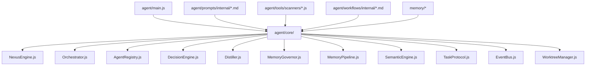

**Diagram sources**
- [agent/main.js](file://agent/main.js)
- [agent/core/NexusEngine.js](file://agent/core/NexusEngine.js)
- [agent/core/Orchestrator.js](file://agent/core/Orchestrator.js)
- [agent/core/AgentRegistry.js](file://agent/core/AgentRegistry.js)
- [agent/core/DecisionEngine.js](file://agent/core/DecisionEngine.js)
- [agent/core/Distiller.js](file://agent/core/Distiller.js)
- [agent/core/MemoryGovernor.js](file://agent/core/MemoryGovernor.js)
- [agent/core/MemoryPipeline.js](file://agent/core/MemoryPipeline.js)
- [agent/core/SemanticEngine.js](file://agent/core/SemanticEngine.js)
- [agent/core/TaskProtocol.js](file://agent/core/TaskProtocol.js)
- [agent/core/EventBus.js](file://agent/core/EventBus.js)
- [agent/core/WorktreeManager.js](file://agent/core/WorktreeManager.js)

**Section sources**
- [agent/main.js](file://agent/main.js)
- [README.md](file://README.md)

## Core Components
- NexusEngine: Central runtime that bootstraps the system and coordinates subsystems.
- Orchestrator: Manages agent lifecycle, collaboration, and inter-agent communication.
- AgentRegistry: Maintains agent metadata, capabilities, and specialization profiles.
- DecisionEngine: Drives agent selection and routing based on task characteristics.
- Distiller: Extracts and distills reusable knowledge from agent interactions.
- MemoryGovernor and MemoryPipeline: Govern memory allocation, retention, and retrieval.
- SemanticEngine: Provides semantic indexing and search over distilled knowledge.
- TaskProtocol: Defines standardized protocols for task creation, delegation, and completion.
- EventBus: Publishes and subscribes to cross-agent events.
- WorktreeManager: Manages filesystem workspaces per task or agent.

These components collectively enable autonomous operation, multi-agent collaboration, and domain-specific specialization.

**Section sources**
- [agent/core/NexusEngine.js](file://agent/core/NexusEngine.js)
- [agent/core/Orchestrator.js](file://agent/core/Orchestrator.js)
- [agent/core/AgentRegistry.js](file://agent/core/AgentRegistry.js)
- [agent/core/DecisionEngine.js](file://agent/core/DecisionEngine.js)
- [agent/core/Distiller.js](file://agent/core/Distiller.js)
- [agent/core/MemoryGovernor.js](file://agent/core/MemoryGovernor.js)
- [agent/core/MemoryPipeline.js](file://agent/core/MemoryPipeline.js)
- [agent/core/SemanticEngine.js](file://agent/core/SemanticEngine.js)
- [agent/core/TaskProtocol.js](file://agent/core/TaskProtocol.js)
- [agent/core/EventBus.js](file://agent/core/EventBus.js)
- [agent/core/WorktreeManager.js](file://agent/core/WorktreeManager.js)

## Architecture Overview
The system operates through structured phases: Planning, Knowledge, Implementation, Execution, Audit. Agents specialize by domain and collaborate via the Orchestrator and EventBus. Memory and semantic search support continuous learning and reuse.

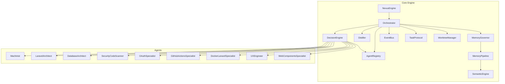

**Diagram sources**
- [agent/core/NexusEngine.js](file://agent/core/NexusEngine.js)
- [agent/core/Orchestrator.js](file://agent/core/Orchestrator.js)
- [agent/core/DecisionEngine.js](file://agent/core/DecisionEngine.js)
- [agent/core/AgentRegistry.js](file://agent/core/AgentRegistry.js)
- [agent/core/Distiller.js](file://agent/core/Distiller.js)
- [agent/core/MemoryGovernor.js](file://agent/core/MemoryGovernor.js)
- [agent/core/MemoryPipeline.js](file://agent/core/MemoryPipeline.js)
- [agent/core/SemanticEngine.js](file://agent/core/SemanticEngine.js)
- [agent/core/EventBus.js](file://agent/core/EventBus.js)
- [agent/core/WorktreeManager.js](file://agent/core/WorktreeManager.js)
- [agent/core/Machinist.js](file://agent/core/Machinist.js)
- [agent/core/LaravelArchitect.js](file://agent/core/LaravelArchitect.js)

## Detailed Component Analysis

### Agent Classification Patterns
Agents are classified by domain and specialization level. The classification workflow defines categories such as Development (Machinist, Laravel Specialist), Architecture (Database Architect, API Designer), Security (Security Scanner, OAuth Specialist), DevOps (GitHub Actions, Docker Specialist), and UX/UI (UX Engineer, Web Components Specialist). Specialization levels indicate depth of expertise and autonomy in handling tasks.

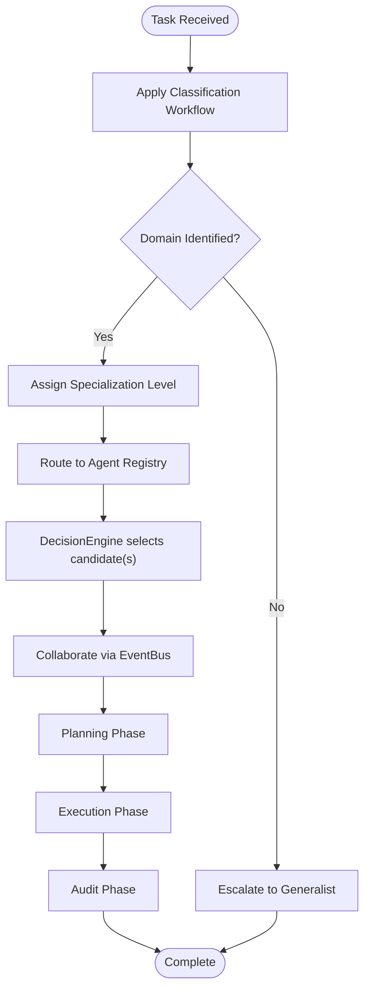

**Diagram sources**
- [agent/workflows/internal/agent-classification.md](file://agent/workflows/internal/agent-classification.md)
- [agent/core/DecisionEngine.js](file://agent/core/DecisionEngine.js)
- [agent/core/AgentRegistry.js](file://agent/core/AgentRegistry.js)
- [agent/core/EventBus.js](file://agent/core/EventBus.js)

**Section sources**
- [agent/workflows/internal/agent-classification.md](file://agent/workflows/internal/agent-classification.md)
- [agent/core/DecisionEngine.js](file://agent/core/DecisionEngine.js)
- [agent/core/AgentRegistry.js](file://agent/core/AgentRegistry.js)

### Prompt Engineering Strategies
Each agent’s prompt encapsulates domain-specific goals, constraints, and collaboration rules. Prompts are curated for:
- Clarity of objective and acceptance criteria
- Context window optimization
- Multi-step reasoning scaffolding
- Safety and guardrails
- Inter-agent coordination cues

Examples of prompt templates include:
- Development: [machinist.md](file://agent/prompts/internal/machinist.md)
- Laravel: [laravel-core-specialist.md](file://agent/prompts/internal/laravel-core-specialist.md)
- Database: [database-architect.md](file://agent/prompts/internal/database-architect.md)
- Security: [security-code-scanner.md](file://agent/prompts/internal/security-code-scanner.md)
- OAuth: [oauth-specialist.md](file://agent/prompts/internal/oauth-specialist.md)
- DevOps: [github-actions-specialist.md](file://agent/prompts/internal/github-actions-specialist.md), [docker-laravel-specialist.md](file://agent/prompts/internal/docker-laravel-specialist.md)
- UX/UI: [ux-engineer.md](file://agent/prompts/internal/ux-engineer.md), [web-components-specialist.md](file://agent/prompts/internal/web-components-specialist.md)

**Section sources**
- [agent/prompts/internal/machinist.md](file://agent/prompts/internal/machinist.md)
- [agent/prompts/internal/laravel-core-specialist.md](file://agent/prompts/internal/laravel-core-specialist.md)
- [agent/prompts/internal/database-architect.md](file://agent/prompts/internal/database-architect.md)
- [agent/prompts/internal/security-code-scanner.md](file://agent/prompts/internal/security-code-scanner.md)
- [agent/prompts/internal/oauth-specialist.md](file://agent/prompts/internal/oauth-specialist.md)
- [agent/prompts/internal/github-actions-specialist.md](file://agent/prompts/internal/github-actions-specialist.md)
- [agent/prompts/internal/docker-laravel-specialist.md](file://agent/prompts/internal/docker-laravel-specialist.md)
- [agent/prompts/internal/ux-engineer.md](file://agent/prompts/internal/ux-engineer.md)
- [agent/prompts/internal/web-components-specialist.md](file://agent/prompts/internal/web-components-specialist.md)

### Domain-Specific Capabilities

#### Development Agents
- Machinist: Constructs, modifies, and validates code artifacts with precision and safety.
- Laravel Specialist: Handles framework internals, packages, queues, events, Octane, Telescope, and related ecosystems.

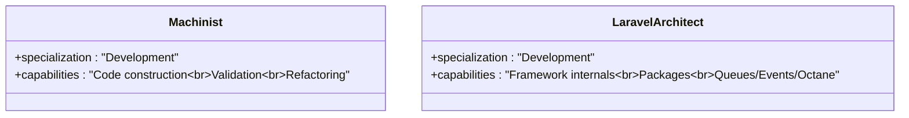

**Diagram sources**
- [agent/core/Machinist.js](file://agent/core/Machinist.js)
- [agent/core/LaravelArchitect.js](file://agent/core/LaravelArchitect.js)

**Section sources**
- [agent/core/Machinist.js](file://agent/core/Machinist.js)
- [agent/core/LaravelArchitect.js](file://agent/core/LaravelArchitect.js)

#### Architecture Agents
- Database Architect: Designs and audits schemas, relationships, and performance.
- API Designer: Shapes REST/GraphQL APIs with versioning and gateway streaming.

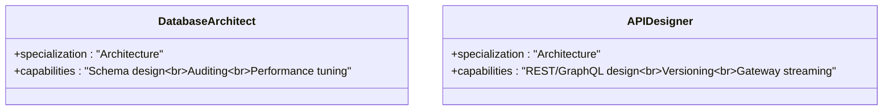

**Diagram sources**
- [agent/tools/scanners/database-architect.js](file://agent/tools/scanners/database-architect.js)
- [agent/prompts/internal/rest-api-designer.md](file://agent/prompts/internal/rest-api-designer.md)

**Section sources**
- [agent/tools/scanners/database-architect.js](file://agent/tools/scanners/database-architect.js)
- [agent/prompts/internal/database-architect.md](file://agent/prompts/internal/database-architect.md)

#### Security Agents
- Security Scanner: Identifies vulnerabilities and enforces secure patterns.
- OAuth Specialist: Implements and audits authentication and authorization flows.

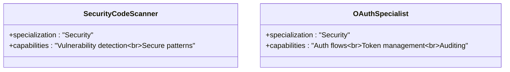

**Diagram sources**
- [agent/prompts/internal/security-code-scanner.md](file://agent/prompts/internal/security-code-scanner.md)
- [agent/prompts/internal/oauth-specialist.md](file://agent/prompts/internal/oauth-specialist.md)

**Section sources**
- [agent/prompts/internal/security-code-scanner.md](file://agent/prompts/internal/security-code-scanner.md)
- [agent/prompts/internal/oauth-specialist.md](file://agent/prompts/internal/oauth-specialist.md)

#### DevOps Agents
- GitHub Actions Specialist: Automates CI/CD pipelines and artifact management.
- Docker Specialist: Containerizes applications and integrates with Laravel environments.

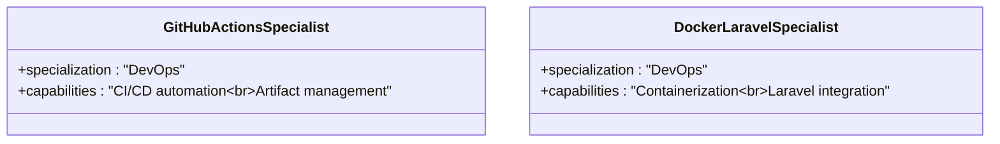

**Diagram sources**
- [agent/prompts/internal/github-actions-specialist.md](file://agent/prompts/internal/github-actions-specialist.md)
- [agent/prompts/internal/docker-laravel-specialist.md](file://agent/prompts/internal/docker-laravel-specialist.md)

**Section sources**
- [agent/prompts/internal/github-actions-specialist.md](file://agent/prompts/internal/github-actions-specialist.md)
- [agent/prompts/internal/docker-laravel-specialist.md](file://agent/prompts/internal/docker-laravel-specialist.md)

#### UX/UI Agents
- UX Engineer: Designs accessible, performant user experiences.
- Web Components Specialist: Builds reusable, standards-compliant components.

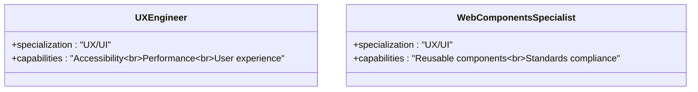

**Diagram sources**
- [agent/prompts/internal/ux-engineer.md](file://agent/prompts/internal/ux-engineer.md)
- [agent/prompts/internal/web-components-specialist.md](file://agent/prompts/internal/web-components-specialist.md)

**Section sources**
- [agent/prompts/internal/ux-engineer.md](file://agent/prompts/internal/ux-engineer.md)
- [agent/prompts/internal/web-components-specialist.md](file://agent/prompts/internal/web-components-specialist.md)

### Collaboration Patterns and Decision-Making
Agents collaborate through:
- Event-driven communication via EventBus
- Shared TaskProtocol for task creation and handoff
- DecisionEngine selecting appropriate agents based on domain and specialization level
- WorktreeManager coordinating filesystem contexts

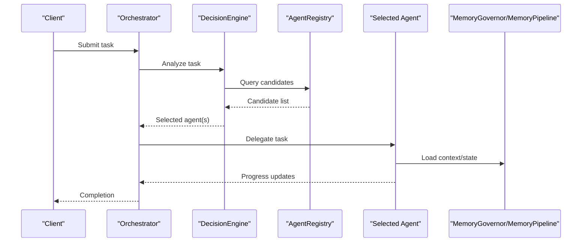

**Diagram sources**
- [agent/core/Orchestrator.js](file://agent/core/Orchestrator.js)
- [agent/core/DecisionEngine.js](file://agent/core/DecisionEngine.js)
- [agent/core/AgentRegistry.js](file://agent/core/AgentRegistry.js)
- [agent/core/MemoryGovernor.js](file://agent/core/MemoryGovernor.js)
- [agent/core/MemoryPipeline.js](file://agent/core/MemoryPipeline.js)
- [agent/core/TaskProtocol.js](file://agent/core/TaskProtocol.js)

**Section sources**
- [agent/core/Orchestrator.js](file://agent/core/Orchestrator.js)
- [agent/core/DecisionEngine.js](file://agent/core/DecisionEngine.js)
- [agent/core/AgentRegistry.js](file://agent/core/AgentRegistry.js)
- [agent/core/MemoryGovernor.js](file://agent/core/MemoryGovernor.js)
- [agent/core/MemoryPipeline.js](file://agent/core/MemoryPipeline.js)
- [agent/core/TaskProtocol.js](file://agent/core/TaskProtocol.js)

### Workflow Orchestration Examples
- Planning Workflow: Establishes objectives, constraints, and resource allocation.
- Execution Workflow: Executes planned tasks, monitors progress, and adapts.
- Nexus Pipeline: Coordinates multi-phase, multi-agent workflows with feedback loops.

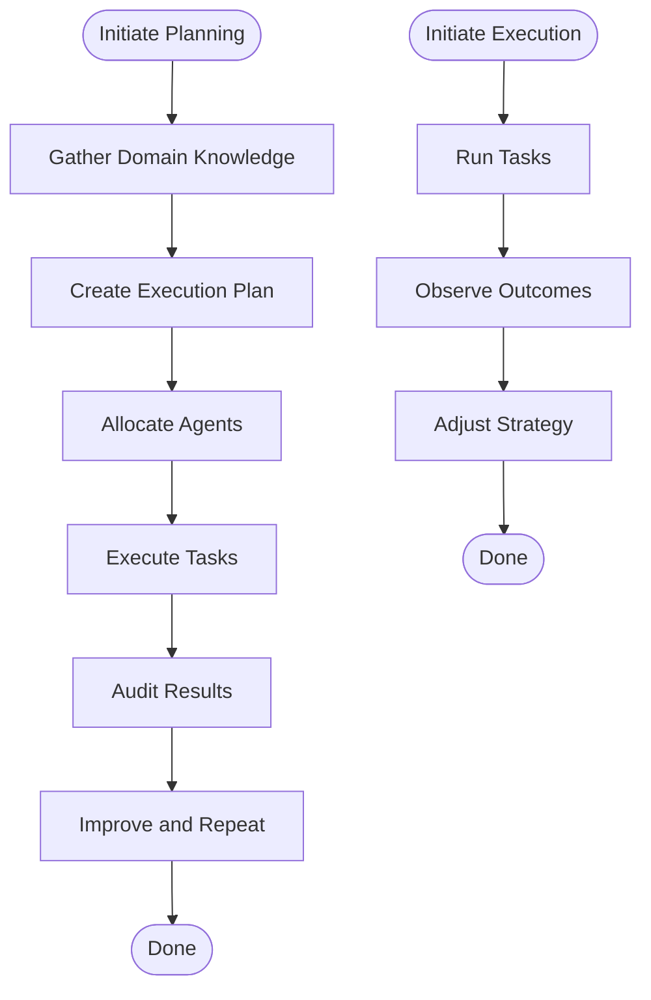

**Diagram sources**
- [agent/workflows/internal/planning-workflow.md](file://agent/workflows/internal/planning-workflow.md)
- [agent/workflows/internal/execution-workflow.md](file://agent/workflows/internal/execution-workflow.md)
- [agent/workflows/internal/nexus-pipeline.md](file://agent/workflows/internal/nexus-pipeline.md)

**Section sources**
- [agent/workflows/internal/planning-workflow.md](file://agent/workflows/internal/planning-workflow.md)
- [agent/workflows/internal/execution-workflow.md](file://agent/workflows/internal/execution-workflow.md)
- [agent/workflows/internal/nexus-pipeline.md](file://agent/workflows/internal/nexus-pipeline.md)

## Dependency Analysis
The system exhibits layered dependencies:
- Core depends on Registry, DecisionEngine, and Memory subsystems
- Agents depend on prompts, tools, and workflows
- Memory subsystems depend on semantic engines and indexes

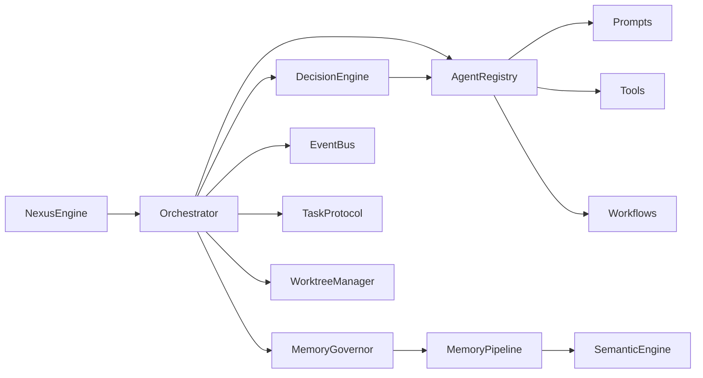

**Diagram sources**
- [agent/core/NexusEngine.js](file://agent/core/NexusEngine.js)
- [agent/core/Orchestrator.js](file://agent/core/Orchestrator.js)
- [agent/core/DecisionEngine.js](file://agent/core/DecisionEngine.js)
- [agent/core/AgentRegistry.js](file://agent/core/AgentRegistry.js)
- [agent/core/MemoryGovernor.js](file://agent/core/MemoryGovernor.js)
- [agent/core/MemoryPipeline.js](file://agent/core/MemoryPipeline.js)
- [agent/core/SemanticEngine.js](file://agent/core/SemanticEngine.js)
- [agent/core/EventBus.js](file://agent/core/EventBus.js)
- [agent/core/TaskProtocol.js](file://agent/core/TaskProtocol.js)
- [agent/core/WorktreeManager.js](file://agent/core/WorktreeManager.js)

**Section sources**
- [agent/core/NexusEngine.js](file://agent/core/NexusEngine.js)
- [agent/core/Orchestrator.js](file://agent/core/Orchestrator.js)
- [agent/core/DecisionEngine.js](file://agent/core/DecisionEngine.js)
- [agent/core/AgentRegistry.js](file://agent/core/AgentRegistry.js)
- [agent/core/MemoryGovernor.js](file://agent/core/MemoryGovernor.js)
- [agent/core/MemoryPipeline.js](file://agent/core/MemoryPipeline.js)
- [agent/core/SemanticEngine.js](file://agent/core/SemanticEngine.js)
- [agent/core/EventBus.js](file://agent/core/EventBus.js)
- [agent/core/TaskProtocol.js](file://agent/core/TaskProtocol.js)
- [agent/core/WorktreeManager.js](file://agent/core/WorktreeManager.js)

## Performance Considerations
- Memory governance: Efficient allocation and pruning reduce overhead during long-running sessions.
- Semantic search: Vector indices accelerate retrieval of relevant knowledge.
- Parallel execution: Agents can operate concurrently where safe, coordinated by the Orchestrator.
- Prompt optimization: Context window management and iterative refinement improve throughput.
- Tool integration: Scanners and validators should be batched and cached to minimize redundant computations.

[No sources needed since this section provides general guidance]

## Troubleshooting Guide
Common issues and mitigations:
- Agent selection failures: Verify DecisionEngine configuration and AgentRegistry entries.
- Memory saturation: Review MemoryGovernor policies and prune stale sessions.
- Workflow stalls: Inspect EventBus subscriptions and TaskProtocol adherence.
- Prompt drift: Re-evaluate prompt templates and guardrails periodically.
- Test coverage: Use existing unit tests to validate agent behavior under controlled scenarios.

**Section sources**
- [tests/TDD/EvolutionPiper.test.js](file://tests/TDD/EvolutionPiper.test.js)
- [tests/TDD/Machinist.test.js](file://tests/TDD/Machinist.test.js)
- [tests/TDD/MemoryGovernor.test.js](file://tests/TDD/MemoryGovernor.test.js)
- [tests/TDD/Orchestrator.test.js](file://tests/TDD/Orchestrator.test.js)
- [tests/TDD/nexus-engine.test.js](file://tests/TDD/nexus-engine.test.js)

## Conclusion
The NEXUS AI specialized agent ecosystem provides a scalable, modular foundation for autonomous multi-domain tasks. Through structured classification, robust decision-making, and collaborative workflows, it supports over 150 specialized agents spanning development, architecture, security, DevOps, and UX/UI. The system’s memory and semantic engines enable continuous learning and improvement, while rigorous testing ensures reliability across evolving workloads.

[No sources needed since this section summarizes without analyzing specific files]

## Appendices

### Agent Specialization Levels
- Level 1: Generalist with broad capability
- Level 2: Domain-focused with moderate autonomy
- Level 3: Deeply specialized with high autonomy and tool integration

[No sources needed since this section provides general guidance]

### Example Prompt Template Paths
- Development: [machinist.md](file://agent/prompts/internal/machinist.md)
- Laravel: [laravel-core-specialist.md](file://agent/prompts/internal/laravel-core-specialist.md)
- Database: [database-architect.md](file://agent/prompts/internal/database-architect.md)
- Security: [security-code-scanner.md](file://agent/prompts/internal/security-code-scanner.md)
- OAuth: [oauth-specialist.md](file://agent/prompts/internal/oauth-specialist.md)
- DevOps: [github-actions-specialist.md](file://agent/prompts/internal/github-actions-specialist.md), [docker-laravel-specialist.md](file://agent/prompts/internal/docker-laravel-specialist.md)
- UX/UI: [ux-engineer.md](file://agent/prompts/internal/ux-engineer.md), [web-components-specialist.md](file://agent/prompts/internal/web-components-specialist.md)

**Section sources**
- [agent/prompts/internal/machinist.md](file://agent/prompts/internal/machinist.md)
- [agent/prompts/internal/laravel-core-specialist.md](file://agent/prompts/internal/laravel-core-specialist.md)
- [agent/prompts/internal/database-architect.md](file://agent/prompts/internal/database-architect.md)
- [agent/prompts/internal/security-code-scanner.md](file://agent/prompts/internal/security-code-scanner.md)
- [agent/prompts/internal/oauth-specialist.md](file://agent/prompts/internal/oauth-specialist.md)
- [agent/prompts/internal/github-actions-specialist.md](file://agent/prompts/internal/github-actions-specialist.md)
- [agent/prompts/internal/docker-laravel-specialist.md](file://agent/prompts/internal/docker-laravel-specialist.md)
- [agent/prompts/internal/ux-engineer.md](file://agent/prompts/internal/ux-engineer.md)
- [agent/prompts/internal/web-components-specialist.md](file://agent/prompts/internal/web-components-specialist.md)

### Knowledge and Memory Indexes
- Retro dataset: [nexus-retro-dataset.jsonl](file://memory/datasets/nexus-retro-dataset.jsonl)
- Short-term memory index: [vector_index.json](file://memory/short_term/vector_index.json)
- Session snapshots: [session_1778912740327.json](file://memory/short_term/sessions/session_1778912740327.json), [session_1778912740628.json](file://memory/short_term/sessions/session_1778912740628.json), [session_1778912740733.json](file://memory/short_term/sessions/session_1778912740733.json)
- Memory index overview: [INDEX.md](file://memory/INDEX.md)

**Section sources**
- [memory/datasets/nexus-retro-dataset.jsonl](file://memory/datasets/nexus-retro-dataset.jsonl)
- [memory/short_term/vector_index.json](file://memory/short_term/vector_index.json)
- [memory/short_term/sessions/session_1778912740327.json](file://memory/short_term/sessions/session_1778912740327.json)
- [memory/short_term/sessions/session_1778912740628.json](file://memory/short_term/sessions/session_1778912740628.json)
- [memory/short_term/sessions/session_1778912740733.json](file://memory/short_term/sessions/session_1778912740733.json)
- [memory/INDEX.md](file://memory/INDEX.md)