# UX/UI Agents

<cite>
**Referenced Files in This Document**
- [ux-engineer.md](file://agent/prompts/internal/ux-engineer.md)
- [web-components-specialist.md](file://agent/prompts/internal/web-components-specialist.md)
- [tailwind-architect.md](file://agent/prompts/internal/tailwind-architect.md)
- [accessibility-testing-agent.md](file://agent/prompts/internal/accessibility-testing-agent.md)
- [core-web-vitals-specialist.md](file://agent/prompts/internal/core-web-vitals-specialist.md)
- [seo-performance-specialist.md](file://agent/prompts/internal/seo-performance-specialist.md)
- [i18n-specialist.md](file://agent/prompts/internal/i18n-specialist.md)
- [designer.js](file://agent/tools/Designer.js)
- [accessibility-scanner.js](file://agent/tools/AccessibilityScanner.js)
- [asset-engine.js](file://agent/tools/AssetEngine.js)
- [media-manager-specialist.md](file://agent/prompts/internal/media-manager-specialist.md)
- [email-template-specialist.md](file://agent/prompts/internal/email-template-specialist.md)
- [responsive-email-specialist.md](file://agent/prompts/internal/responsive-email-specialist.md)
- [content-management-specialist.md](file://agent/prompts/internal/content-management-specialist.md)
- [image-optimization-agent.md](file://agent/prompts/internal/image-optimization-agent.md)
- [media-library-specialist.md](file://agent/prompts/internal/media-library-specialist.md)
- [typography-color-theory-specialist.md](file://agent/prompts/internal/typography-color-theory-specialist.md)
- [layout-responsive-design-specialist.md](file://agent/prompts/internal/layout-responsive-design-specialist.md)
- [mobile-first-specialist.md](file://agent/prompts/internal/mobile-first-specialist.md)
- [user-research-persona-specialist.md](file://agent/prompts/internal/user-research-persona-specialist.md)
- [user-journey-wireframe-specialist.md](file://agent/prompts/internal/user-journey-wireframe-specialist.md)
- [mockup-prototyping-specialist.md](file://agent/prompts/internal/mockup-prototyping-specialist.md)
- [usability-testing-interaction-design-specialist.md](file://agent/prompts/internal/usability-testing-interaction-design-specialist.md)
- [motion-design-animation-specialist.md](file://agent/prompts/internal/motion-design-animation-specialist.md)
- [visual-effects-3d-graphics-specialist.md](file://agent/prompts/internal/visual-effects-3d-graphics-specialist.md)
- [graphics-image-specialist.md](file://agent/prompts/internal/graphics-image-specialist.md)
- [branding-scanner.js](file://agent/tools/scanners/branding-scanner.js)
- [ux-engineer-scanner.js](file://agent/tools/scanners/ux-engineer.js)
- [vcs-architect.md](file://agent/prompts/internal/vcs-architect.md)
- [design-standards.md](file://documentation/nexus_rules/design_standards.md)
- [nexus-ai-tech-stack.md](file://documentation/algorithms/nexus-ai-tech-stack.md)
- [nexus-multi-agent-stabilization-plan.md](file://documentation/planning/NEXUS_MULTI_AGENT_STABILIZATION_PLAN.md)
- [nexus-pipeline-map.md](file://documentation/mermaid/nexus_pipeline_map.md)
- [sandbox_pipeline.md](file://documentation/nexus_rules/sandbox_pipeline.md)
- [nexus-architecture-multi-agent.md](file://documentation/planning/NEXUS_AI_ARCHITECTURE_AUDIT.md)
- [nexus-architecture-multi-agent.md](file://documentation/planning/NEXUS_AI_Architecture_Analysis.md)
- [nexus-architecture-multi-agent.md](file://documentation/planning/NEXUS_AI_v2_Code_Review.md)
- [nexus-architecture-multi-agent.md](file://documentation/planning/NEXUS_CORE_MODULARIZATION.md)
- [nexus-architecture-multi-agent.md](file://documentation/planning/NEXUS_HARDENING_PLAN.md)
- [nexus-architecture-multi-agent.md](file://documentation/planning/NEXUS_SANDBOX_Review.md)
- [nexus-architecture-multi-agent.md](file://documentation/planning/STABILIZATION_PLAN.md)
- [nexus-architecture-multi-agent.md](file://documentation/planning/plan_NEXT_STEPS.md)
- [nexus-architecture-multi-agent.md](file://documentation/planning/plan_PLAN-1778479790742.md)
- [nexus-architecture-multi-agent.md](file://documentation/planning/plan_PLAN-1778912740316.md)
- [nexus-architecture-multi-agent.md](file://documentation/planning/plan_PLAN-1778912740619.md)
- [nexus-architecture-multi-agent.md](file://documentation/planning/plan_PLAN-1778912740718.md)
- [nexus-architecture-multi-agent.md](file://documentation/planning/plan_PLAN-1779702319557.md)
- [nexus-architecture-multi-agent.md](file://documentation/planning/plan_v320_AUTONOMOUS_EVOLUTION.md)
- [nexus-architecture-multi-agent.md](file://documentation/planning/plan_INTERNAL_RECURSIVE_EVOLUTION.md)
- [nexus-architecture-multi-agent.md](file://documentation/planning/plan_NEXT_STEPS.md)
- [nexus-architecture-multi-agent.md](file://documentation/planning/standard_workflow_project_tes.md)
- [nexus-architecture-multi-agent.md](file://documentation/planning/nexus_architecture_multi_agent.md)
- [nexus-architecture-multi-agent.md](file://documentation/planning/nexus_multi_agent_test.md)
- [nexus-architecture-multi-agent.md](file://documentation/planning/nexus_post_stabilization_hardering.md)
- [nexus-architecture-multi-agent.md](file://documentation/planning/nexus_review_guard_rails.md)
- [nexus-architecture-multi-agent.md](file://documentation/planning/nexus_stabilization.md)
- [nexus-architecture-multi-agent.md](file://documentation/planning/nexus_testing_TDD.md)
- [nexus-architecture-multi-agent.md](file://documentation/planning/UPGRADE_NEXUS_ENGINE_BUILDER.md)
- [nexus-architecture-multi-agent.md](file://documentation/planning/next_session_evolution_plan.md)
- [nexus-architecture-multi-agent.md](file://documentation/planning/nexus_vector_search_upgrade.md)
- [nexus-architecture-multi-agent.md](file://documentation/planning/educational_audit.md)
- [nexus-architecture-multi-agent.md](file://documentation/planning/pattern-recognition.md)
- [nexus-architecture-multi-agent.md](file://agent/workflows/internal/agent-classification.md)
- [nexus-architecture-multi-agent.md](file://agent/workflows/internal/knowledge-liaison.md)
- [nexus-architecture-multi-agent.md](file://agent/workflows/internal/loop-testing.md)
- [nexus-architecture-multi-agent.md](file://agent/workflows/internal/nexus-pipeline.md)
- [nexus-architecture-multi-agent.md](file://agent/workflows/internal/pattern-recognition.md)
- [nexus-architecture-multi-agent.md](file://agent/workflows/internal/skill-evolution.md)
- [nexus-architecture-multi-agent.md](file://agent/workflows/internal/planning-workflow.md)
- [nexus-architecture-multi-agent.md](file://agent/workflows/internal/execution-workflow.md)
- [nexus-architecture-multi-agent.md](file://agent/workflows/internal/audit-workflow.md)
- [nexus-architecture-multi-agent.md](file://agent/workflows/internal/educational-audit.md)
- [nexus-architecture-multi-agent.md](file://agent/workflows/external/frontend/ux-engineer.md)
- [nexus-architecture-multi-agent.md](file://agent/workflows/external/frontend/web-components-specialist.md)
- [nexus-architecture-multi-agent.md](file://agent/workflows/external/frontend/tailwind-architect.md)
- [nexus-architecture-multi-agent.md](file://agent/workflows/external/frontend/accessibility-testing-agent.md)
- [nexus-architecture-multi-agent.md](file://agent/workflows/external/frontend/core-web-vitals-specialist.md)
- [nexus-architecture-multi-agent.md](file://agent/workflows/external/frontend/seo-performance-specialist.md)
- [nexus-architecture-multi-agent.md](file://agent/workflows/external/frontend/i18n-specialist.md)
- [nexus-architecture-multi-agent.md](file://agent/workflows/external/frontend/media-manager-specialist.md)
- [nexus-architecture-multi-agent.md](file://agent/workflows/external/frontend/email-template-specialist.md)
- [nexus-architecture-multi-agent.md](file://agent/workflows/external/frontend/responsive-email-specialist.md)
- [nexus-architecture-multi-agent.md](file://agent/workflows/external/frontend/content-management-specialist.md)
- [nexus-architecture-multi-agent.md](file://agent/workflows/external/frontend/image-optimization-agent.md)
- [nexus-architecture-multi-agent.md](file://agent/workflows/external/frontend/media-library-specialist.md)
- [nexus-architecture-multi-agent.md](file://agent/workflows/external/frontend/typography-color-theory-specialist.md)
- [nexus-architecture-multi-agent.md](file://agent/workflows/external/frontend/layout-responsive-design-specialist.md)
- [nexus-architecture-multi-agent.md](file://agent/workflows/external/frontend/mobile-first-specialist.md)
- [nexus-architecture-multi-agent.md](file://agent/workflows/external/frontend/user-research-persona-specialist.md)
- [nexus-architecture-multi-agent.md](file://agent/workflows/external/frontend/user-journey-wireframe-specialist.md)
- [nexus-architecture-multi-agent.md](file://agent/workflows/external/frontend/mockup-prototyping-specialist.md)
- [nexus-architecture-multi-agent.md](file://agent/workflows/external/frontend/usability-testing-interaction-design-specialist.md)
- [nexus-architecture-multi-agent.md](file://agent/workflows/external/frontend/motion-design-animation-specialist.md)
- [nexus-architecture-multi-agent.md](file://agent/workflows/external/frontend/visual-effects-3d-graphics-specialist.md)
- [nexus-architecture-multi-agent.md](file://agent/workflows/external/frontend/graphics-image-specialist.md)
</cite>

## Table of Contents
1. [Introduction](#introduction)
2. [Project Structure](#project-structure)
3. [Core Components](#core-components)
4. [Architecture Overview](#architecture-overview)
5. [Detailed Component Analysis](#detailed-component-analysis)
6. [Dependency Analysis](#dependency-analysis)
7. [Performance Considerations](#performance-considerations)
8. [Troubleshooting Guide](#troubleshooting-guide)
9. [Conclusion](#conclusion)
10. [Appendices](#appendices)

## Introduction
This document presents comprehensive documentation for NEXUS AI UX/UI agents focused on user experience design, visual design, and content management. It synthesizes the repository’s prompt templates, tools, workflows, and planning documents to define roles, capabilities, and operational patterns for UX Engineers, Web Components Specialists, Tailwind Architects, Design System Specialists, Accessibility Testing Agents, Core Web Vitals Specialists, SEO Performance Specialists, and related specialists. The guide emphasizes design patterns, user research methodologies, and accessibility guidelines while aligning with the broader NEXUS multi-agent architecture and sandbox pipeline.

## Project Structure
The UX/UI agents are primarily defined by:
- Prompt templates under agent/prompts/internal and agent/prompts/external
- Tools under agent/tools and agent/tools/scanners
- Workflows under agent/workflows/internal and agent/workflows/external
- Planning and architecture documents under documentation

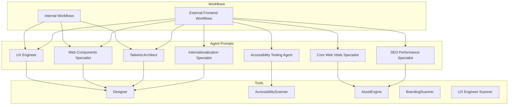

**Diagram sources**
- [ux-engineer.md](file://agent/prompts/internal/ux-engineer.md)
- [web-components-specialist.md](file://agent/prompts/internal/web-components-specialist.md)
- [tailwind-architect.md](file://agent/prompts/internal/tailwind-architect.md)
- [accessibility-testing-agent.md](file://agent/prompts/internal/accessibility-testing-agent.md)
- [core-web-vitals-specialist.md](file://agent/prompts/internal/core-web-vitals-specialist.md)
- [seo-performance-specialist.md](file://agent/prompts/internal/seo-performance-specialist.md)
- [i18n-specialist.md](file://agent/prompts/internal/i18n-specialist.md)
- [designer.js](file://agent/tools/Designer.js)
- [accessibility-scanner.js](file://agent/tools/AccessibilityScanner.js)
- [asset-engine.js](file://agent/tools/AssetEngine.js)
- [branding-scanner.js](file://agent/tools/scanners/branding-scanner.js)
- [ux-engineer-scanner.js](file://agent/tools/scanners/ux-engineer.js)

**Section sources**
- [ux-engineer.md](file://agent/prompts/internal/ux-engineer.md)
- [web-components-specialist.md](file://agent/prompts/internal/web-components-specialist.md)
- [tailwind-architect.md](file://agent/prompts/internal/tailwind-architect.md)
- [accessibility-testing-agent.md](file://agent/prompts/internal/accessibility-testing-agent.md)
- [core-web-vitals-specialist.md](file://agent/prompts/internal/core-web-vitals-specialist.md)
- [seo-performance-specialist.md](file://agent/prompts/internal/seo-performance-specialist.md)
- [i18n-specialist.md](file://agent/prompts/internal/i18n-specialist.md)
- [designer.js](file://agent/tools/Designer.js)
- [accessibility-scanner.js](file://agent/tools/AccessibilityScanner.js)
- [asset-engine.js](file://agent/tools/AssetEngine.js)
- [branding-scanner.js](file://agent/tools/scanners/branding-scanner.js)
- [ux-engineer-scanner.js](file://agent/tools/scanners/ux-engineer.js)

## Core Components
This section outlines the primary UX/UI agent components and their responsibilities, derived from prompt templates and supporting tools.

- UX Engineer: Defines user-centered design processes, personas, journey mapping, wireframing, prototyping, usability testing, and interaction design. Supports research methodologies and inclusive design practices.
- Web Components Specialist: Focuses on modern web components, encapsulation, reusability, and interoperability across frameworks.
- Tailwind Architect: Implements utility-first CSS, responsive design systems, and scalable styling patterns.
- Accessibility Testing Agent: Ensures inclusive design compliance, automated scanning, and WCAG guidelines adherence.
- Core Web Vitals Specialist: Optimizes performance metrics (LCP, FID, CLS) and user-centric metrics.
- SEO Performance Specialist: Enhances search visibility and page performance for SEO.
- Internationalization and Localization Specialist: Manages global audiences with i18n/l10n strategies.
- Media Manager and Asset Optimization Specialist: Handles media library, optimization, and content delivery.
- Email Template and Responsive Email Specialist: Designs responsive email layouts and cross-client compatibility.
- Content Management and Optimization Specialist: Develops content strategies and optimization techniques.
- Image Optimization and Media Library Specialist: Provides asset optimization and media library management.
- Typography and Color Theory Specialist: Establishes visual communication through typography and color systems.
- Layout and Responsive Design Specialist: Creates adaptive interfaces across breakpoints and devices.
- Mobile-First Specialist: Prioritizes mobile-first design and progressive enhancement.
- User Research and Persona Specialist: Conducts research and builds user personas.
- User Journey and Wireframe Specialist: Maps user journeys and creates wireframes.
- Mockup and Prototyping Specialist: Produces visual mockups and interactive prototypes.
- Usability Testing and Interaction Design Specialist: Performs usability testing and refines interaction patterns.
- Motion Design and Animation Specialist: Delivers motion and animation for engaging experiences.
- Visual Effects and 3D Graphics Specialist: Integrates visual effects and 3D graphics for immersive experiences.
- Graphics and Image Specialist: Produces and manages visual assets.

**Section sources**
- [ux-engineer.md](file://agent/prompts/internal/ux-engineer.md)
- [web-components-specialist.md](file://agent/prompts/internal/web-components-specialist.md)
- [tailwind-architect.md](file://agent/prompts/internal/tailwind-architect.md)
- [accessibility-testing-agent.md](file://agent/prompts/internal/accessibility-testing-agent.md)
- [core-web-vitals-specialist.md](file://agent/prompts/internal/core-web-vitals-specialist.md)
- [seo-performance-specialist.md](file://agent/prompts/internal/seo-performance-specialist.md)
- [i18n-specialist.md](file://agent/prompts/internal/i18n-specialist.md)
- [media-manager-specialist.md](file://agent/prompts/internal/media-manager-specialist.md)
- [email-template-specialist.md](file://agent/prompts/internal/email-template-specialist.md)
- [responsive-email-specialist.md](file://agent/prompts/internal/responsive-email-specialist.md)
- [content-management-specialist.md](file://agent/prompts/internal/content-management-specialist.md)
- [image-optimization-agent.md](file://agent/prompts/internal/image-optimization-agent.md)
- [media-library-specialist.md](file://agent/prompts/internal/media-library-specialist.md)
- [typography-color-theory-specialist.md](file://agent/prompts/internal/typography-color-theory-specialist.md)
- [layout-responsive-design-specialist.md](file://agent/prompts/internal/layout-responsive-design-specialist.md)
- [mobile-first-specialist.md](file://agent/prompts/internal/mobile-first-specialist.md)
- [user-research-persona-specialist.md](file://agent/prompts/internal/user-research-persona-specialist.md)
- [user-journey-wireframe-specialist.md](file://agent/prompts/internal/user-journey-wireframe-specialist.md)
- [mockup-prototyping-specialist.md](file://agent/prompts/internal/mockup-prototyping-specialist.md)
- [usability-testing-interaction-design-specialist.md](file://agent/prompts/internal/usability-testing-interaction-design-specialist.md)
- [motion-design-animation-specialist.md](file://agent/prompts/internal/motion-design-animation-specialist.md)
- [visual-effects-3d-graphics-specialist.md](file://agent/prompts/internal/visual-effects-3d-graphics-specialist.md)
- [graphics-image-specialist.md](file://agent/prompts/internal/graphics-image-specialist.md)

## Architecture Overview
The NEXUS AI multi-agent system orchestrates UX/UI agents through a structured pipeline aligned with planning, execution, and auditing workflows. The system integrates prompt-driven agents with tools for design, accessibility, and asset management, operating within a sandbox pipeline.

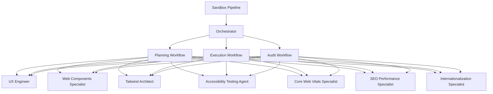

**Diagram sources**
- [nexus-pipeline-map.md](file://documentation/mermaid/nexus_pipeline_map.md)
- [sandbox_pipeline.md](file://documentation/nexus_rules/sandbox_pipeline.md)
- [nexus-multi-agent-stabilization-plan.md](file://documentation/planning/NEXUS_MULTI_AGENT_STABILIZATION_PLAN.md)
- [nexus-architecture-multi-agent.md](file://documentation/planning/NEXUS_AI_ARCHITECTURE_AUDIT.md)
- [nexus-architecture-multi-agent.md](file://documentation/planning/NEXUS_AI_Architecture_Analysis.md)
- [nexus-architecture-multi-agent.md](file://documentation/planning/NEXUS_AI_v2_Code_Review.md)
- [nexus-architecture-multi-agent.md](file://documentation/planning/NEXUS_CORE_MODULARIZATION.md)
- [nexus-architecture-multi-agent.md](file://documentation/planning/NEXUS_HARDENING_PLAN.md)
- [nexus-architecture-multi-agent.md](file://documentation/planning/NEXUS_SANDBOX_Review.md)
- [nexus-architecture-multi-agent.md](file://documentation/planning/STABILIZATION_PLAN.md)
- [nexus-architecture-multi-agent.md](file://documentation/planning/plan_NEXT_STEPS.md)
- [nexus-architecture-multi-agent.md](file://documentation/planning/plan_PLAN-1778479790742.md)
- [nexus-architecture-multi-agent.md](file://documentation/planning/plan_PLAN-1778912740316.md)
- [nexus-architecture-multi-agent.md](file://documentation/planning/plan_PLAN-1778912740619.md)
- [nexus-architecture-multi-agent.md](file://documentation/planning/plan_PLAN-1778912740718.md)
- [nexus-architecture-multi-agent.md](file://documentation/planning/plan_PLAN-1779702319557.md)
- [nexus-architecture-multi-agent.md](file://documentation/planning/plan_v320_AUTONOMOUS_EVOLUTION.md)
- [nexus-architecture-multi-agent.md](file://documentation/planning/plan_INTERNAL_RECURSIVE_EVOLUTION.md)
- [nexus-architecture-multi-agent.md](file://documentation/planning/plan_NEXT_STEPS.md)
- [nexus-architecture-multi-agent.md](file://documentation/planning/standard_workflow_project_tes.md)
- [nexus-architecture-multi-agent.md](file://documentation/planning/nexus_architecture_multi_agent.md)
- [nexus-architecture-multi-agent.md](file://documentation/planning/nexus_multi_agent_test.md)
- [nexus-architecture-multi-agent.md](file://documentation/planning/nexus_post_stabilization_hardering.md)
- [nexus-architecture-multi-agent.md](file://documentation/planning/nexus_review_guard_rails.md)
- [nexus-architecture-multi-agent.md](file://documentation/planning/nexus_stabilization.md)
- [nexus-architecture-multi-agent.md](file://documentation/planning/nexus_testing_TDD.md)
- [nexus-architecture-multi-agent.md](file://documentation/planning/UPGRADE_NEXUS_ENGINE_BUILDER.md)
- [nexus-architecture-multi-agent.md](file://documentation/planning/next_session_evolution_plan.md)
- [nexus-architecture-multi-agent.md](file://documentation/planning/nexus_vector_search_upgrade.md)
- [nexus-architecture-multi-agent.md](file://documentation/planning/educational_audit.md)
- [nexus-architecture-multi-agent.md](file://documentation/planning/pattern-recognition.md)

## Detailed Component Analysis

### UX Engineer
The UX Engineer agent coordinates user-centered design activities, including persona development, user journey mapping, wireframing, prototyping, usability testing, and interaction design. It leverages research methodologies and inclusive design practices to inform iterative design decisions.

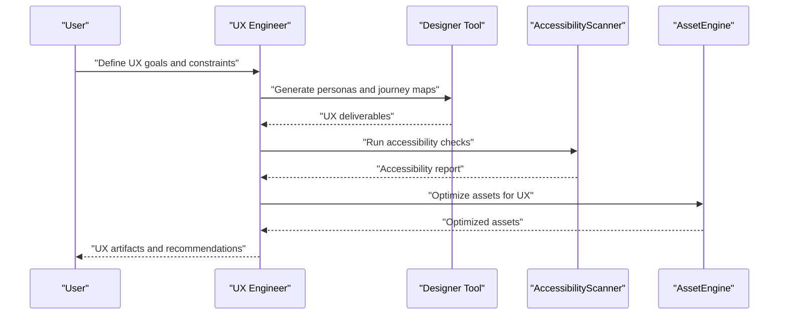

**Diagram sources**
- [ux-engineer.md](file://agent/prompts/internal/ux-engineer.md)
- [designer.js](file://agent/tools/Designer.js)
- [accessibility-scanner.js](file://agent/tools/AccessibilityScanner.js)
- [asset-engine.js](file://agent/tools/AssetEngine.js)

**Section sources**
- [ux-engineer.md](file://agent/prompts/internal/ux-engineer.md)
- [ux-engineer-scanner.js](file://agent/tools/scanners/ux-engineer.js)

### Web Components Specialist
The Web Components Specialist focuses on building reusable, framework-agnostic components with strong encapsulation and interoperability. It ensures consistent component APIs and lifecycle management across diverse environments.

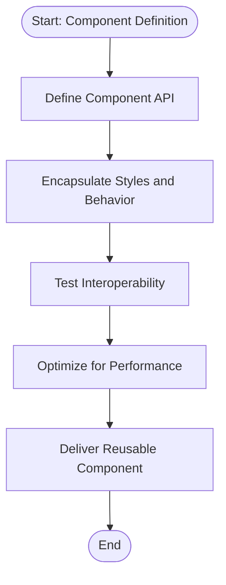

**Diagram sources**
- [web-components-specialist.md](file://agent/prompts/internal/web-components-specialist.md)

**Section sources**
- [web-components-specialist.md](file://agent/prompts/internal/web-components-specialist.md)

### Tailwind Architect
The Tailwind Architect implements utility-first CSS to build scalable, maintainable designs. It emphasizes atomic classes, responsive utilities, and design system alignment for rapid iteration.

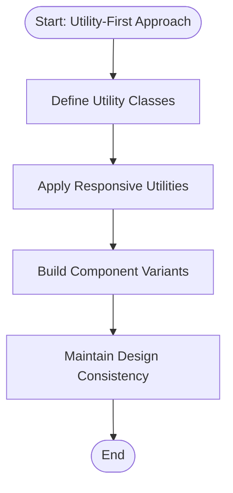

**Diagram sources**
- [tailwind-architect.md](file://agent/prompts/internal/tailwind-architect.md)

**Section sources**
- [tailwind-architect.md](file://agent/prompts/internal/tailwind-architect.md)

### Accessibility Testing Agent
The Accessibility Testing Agent enforces inclusive design by automating accessibility checks, generating reports, and ensuring WCAG compliance across digital products.

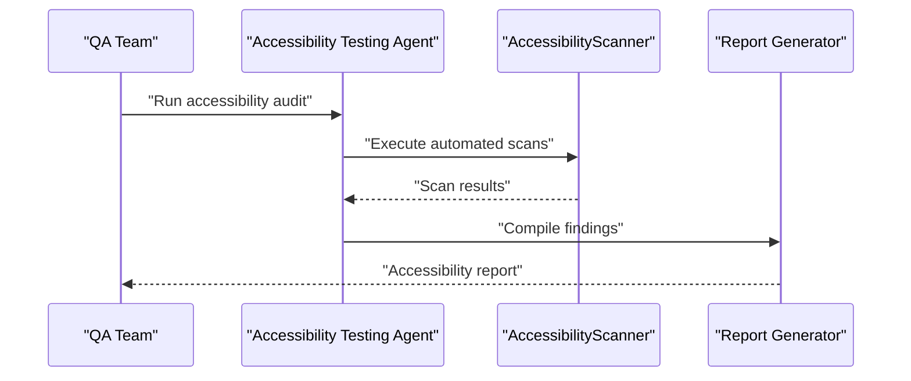

**Diagram sources**
- [accessibility-testing-agent.md](file://agent/prompts/internal/accessibility-testing-agent.md)
- [accessibility-scanner.js](file://agent/tools/AccessibilityScanner.js)

**Section sources**
- [accessibility-testing-agent.md](file://agent/prompts/internal/accessibility-testing-agent.md)
- [accessibility-scanner.js](file://agent/tools/AccessibilityScanner.js)

### Core Web Vitals Specialist
The Core Web Vitals Specialist optimizes user-centric metrics (LCP, FID, CLS) to improve perceived performance and user experience across devices and networks.

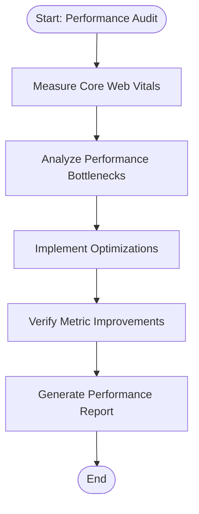

**Diagram sources**
- [core-web-vitals-specialist.md](file://agent/prompts/internal/core-web-vitals-specialist.md)
- [asset-engine.js](file://agent/tools/AssetEngine.js)

**Section sources**
- [core-web-vitals-specialist.md](file://agent/prompts/internal/core-web-vitals-specialist.md)
- [asset-engine.js](file://agent/tools/AssetEngine.js)

### SEO Performance Specialist
The SEO Performance Specialist enhances search visibility and page performance to improve rankings and user engagement.

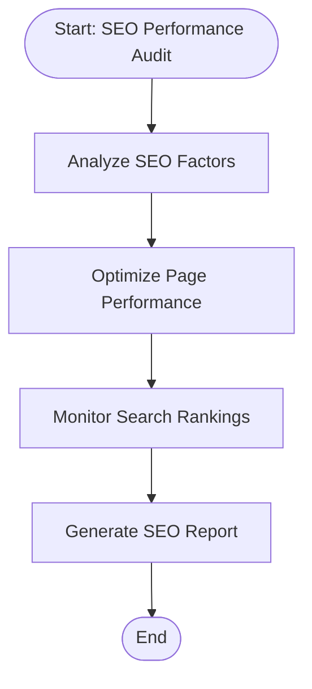

**Diagram sources**
- [seo-performance-specialist.md](file://agent/prompts/internal/seo-performance-specialist.md)
- [asset-engine.js](file://agent/tools/AssetEngine.js)

**Section sources**
- [seo-performance-specialist.md](file://agent/prompts/internal/seo-performance-specialist.md)
- [asset-engine.js](file://agent/tools/AssetEngine.js)

### Internationalization and Localization Specialist
The Internationalization and Localization Specialist manages global audiences by implementing i18n/l10n strategies, ensuring content and UI adapt properly across locales.

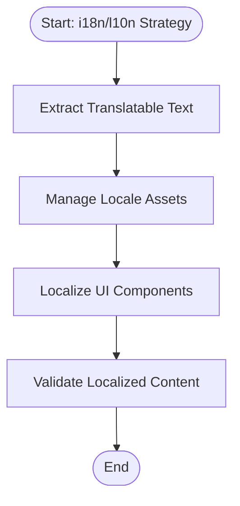

**Diagram sources**
- [i18n-specialist.md](file://agent/prompts/internal/i18n-specialist.md)

**Section sources**
- [i18n-specialist.md](file://agent/prompts/internal/i18n-specialist.md)

### Media Manager and Asset Optimization Specialist
The Media Manager and Asset Optimization Specialist handles media library operations, optimization, and content delivery to support efficient UX workflows.

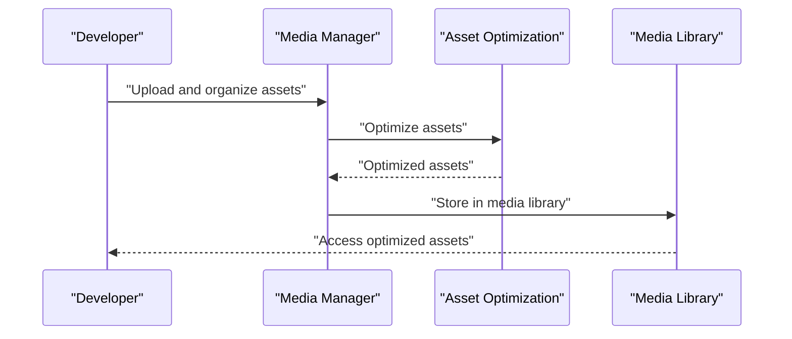

**Diagram sources**
- [media-manager-specialist.md](file://agent/prompts/internal/media-manager-specialist.md)
- [asset-engine.js](file://agent/tools/AssetEngine.js)
- [media-library-specialist.md](file://agent/prompts/internal/media-library-specialist.md)

**Section sources**
- [media-manager-specialist.md](file://agent/prompts/internal/media-manager-specialist.md)
- [media-library-specialist.md](file://agent/prompts/internal/media-library-specialist.md)
- [asset-engine.js](file://agent/tools/AssetEngine.js)

### Email Template and Responsive Email Specialist
The Email Template and Responsive Email Specialist designs responsive email layouts and ensures cross-client compatibility for effective email campaigns.

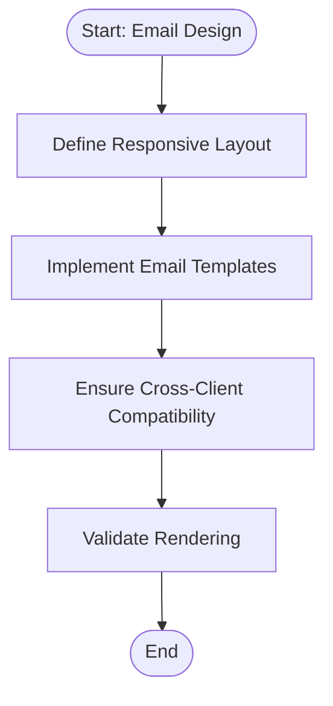

**Diagram sources**
- [email-template-specialist.md](file://agent/prompts/internal/email-template-specialist.md)
- [responsive-email-specialist.md](file://agent/prompts/internal/responsive-email-specialist.md)

**Section sources**
- [email-template-specialist.md](file://agent/prompts/internal/email-template-specialist.md)
- [responsive-email-specialist.md](file://agent/prompts/internal/responsive-email-specialist.md)

### Content Management and Optimization Specialist
The Content Management and Optimization Specialist develops content strategies and optimization techniques to enhance user engagement and conversion.

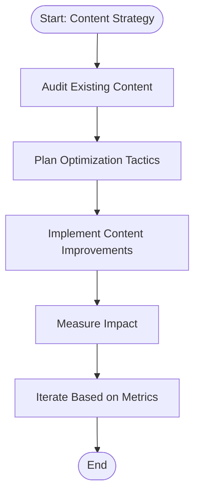

**Diagram sources**
- [content-management-specialist.md](file://agent/prompts/internal/content-management-specialist.md)

**Section sources**
- [content-management-specialist.md](file://agent/prompts/internal/content-management-specialist.md)

### Typography and Color Theory Specialist
The Typography and Color Theory Specialist establishes visual communication through typography and color systems, ensuring readability and brand consistency.

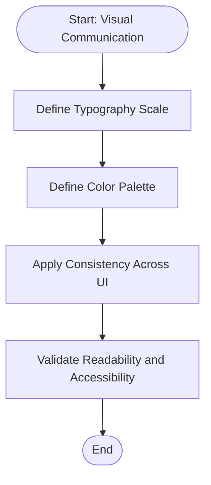

**Diagram sources**
- [typography-color-theory-specialist.md](file://agent/prompts/internal/typography-color-theory-specialist.md)

**Section sources**
- [typography-color-theory-specialist.md](file://agent/prompts/internal/typography-color-theory-specialist.md)

### Layout and Responsive Design Specialist
The Layout and Responsive Design Specialist creates adaptive interfaces across breakpoints and devices, ensuring optimal user experience on all screen sizes.

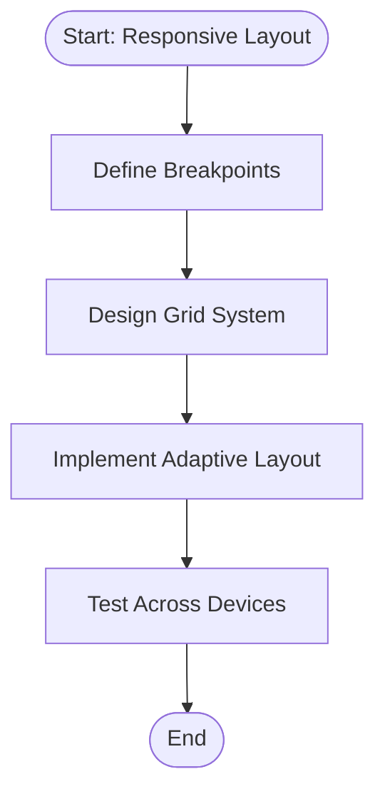

**Diagram sources**
- [layout-responsive-design-specialist.md](file://agent/prompts/internal/layout-responsive-design-specialist.md)

**Section sources**
- [layout-responsive-design-specialist.md](file://agent/prompts/internal/layout-responsive-design-specialist.md)

### Mobile-First Specialist
The Mobile-First Specialist prioritizes mobile-first design and progressive enhancement to ensure optimal performance and usability on mobile devices.

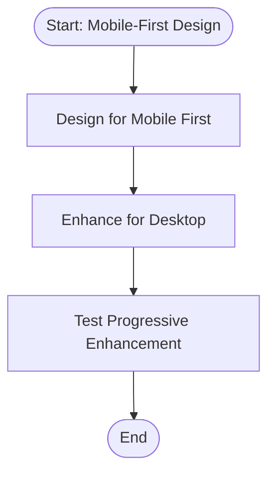

**Diagram sources**
- [mobile-first-specialist.md](file://agent/prompts/internal/mobile-first-specialist.md)

**Section sources**
- [mobile-first-specialist.md](file://agent/prompts/internal/mobile-first-specialist.md)

### User Research and Persona Specialist
The User Research and Persona Specialist conducts research and builds user personas to guide design decisions and ensure user-centered outcomes.

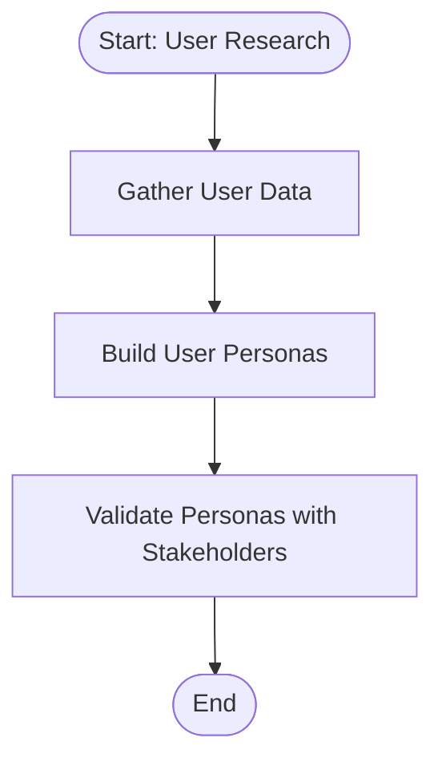

**Diagram sources**
- [user-research-persona-specialist.md](file://agent/prompts/internal/user-research-persona-specialist.md)

**Section sources**
- [user-research-persona-specialist.md](file://agent/prompts/internal/user-research-persona-specialist.md)

### User Journey and Wireframe Specialist
The User Journey and Wireframe Specialist maps user journeys and creates wireframes to visualize user interactions and interface flows.

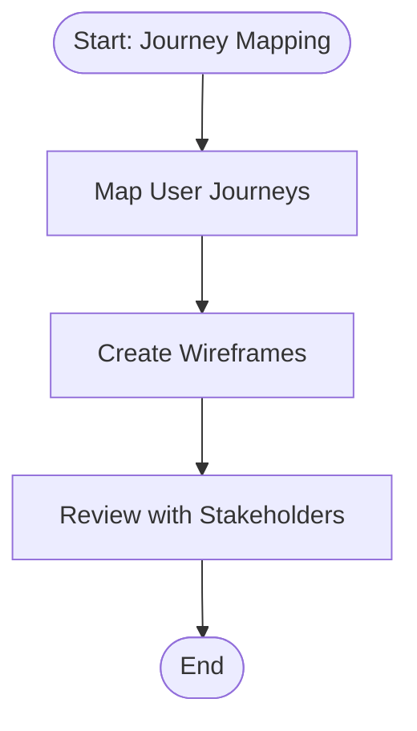

**Diagram sources**
- [user-journey-wireframe-specialist.md](file://agent/prompts/internal/user-journey-wireframe-specialist.md)

**Section sources**
- [user-journey-wireframe-specialist.md](file://agent/prompts/internal/user-journey-wireframe-specialist.md)

### Mockup and Prototyping Specialist
The Mockup and Prototyping Specialist produces visual mockups and interactive prototypes to communicate design ideas and gather feedback.

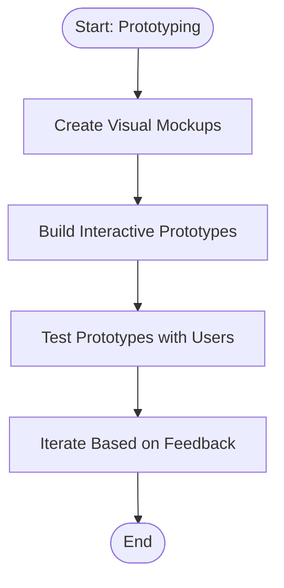

**Diagram sources**
- [mockup-prototyping-specialist.md](file://agent/prompts/internal/mockup-prototyping-specialist.md)

**Section sources**
- [mockup-prototyping-specialist.md](file://agent/prompts/internal/mockup-prototyping-specialist.md)

### Usability Testing and Interaction Design Specialist
The Usability Testing and Interaction Design Specialist performs usability testing and refines interaction patterns to improve user satisfaction and task completion.

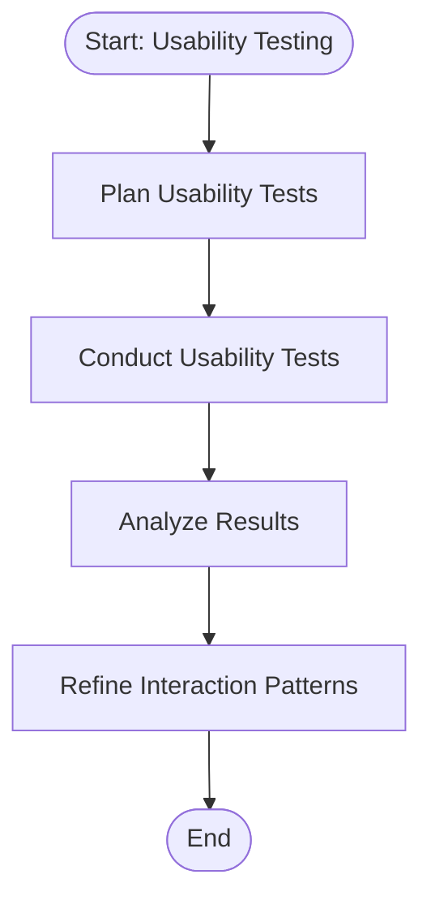

**Diagram sources**
- [usability-testing-interaction-design-specialist.md](file://agent/prompts/internal/usability-testing-interaction-design-specialist.md)

**Section sources**
- [usability-testing-interaction-design-specialist.md](file://agent/prompts/internal/usability-testing-interaction-design-specialist.md)

### Motion Design and Animation Specialist
The Motion Design and Animation Specialist delivers motion and animation for engaging experiences, focusing on smooth transitions and meaningful micro-interactions.

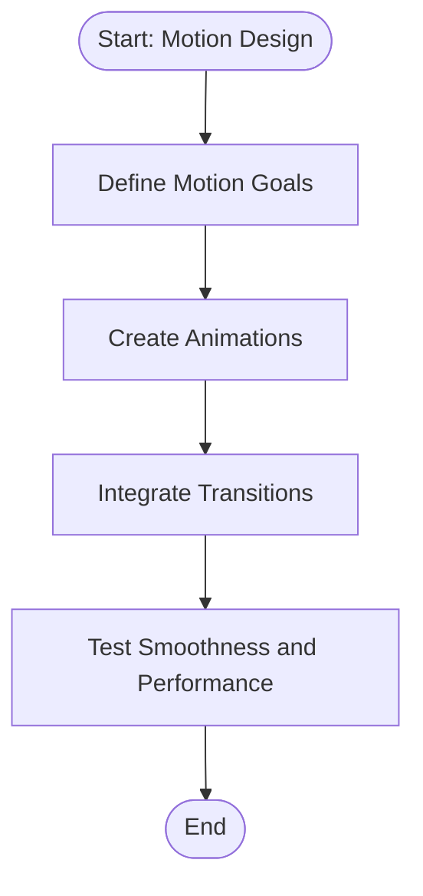

**Diagram sources**
- [motion-design-animation-specialist.md](file://agent/prompts/internal/motion-design-animation-specialist.md)

**Section sources**
- [motion-design-animation-specialist.md](file://agent/prompts/internal/motion-design-animation-specialist.md)

### Visual Effects and 3D Graphics Specialist
The Visual Effects and 3D Graphics Specialist integrates visual effects and 3D graphics for immersive experiences, balancing aesthetics and performance.

```mermaid
flowchart TD
Start(["Start: Visual Effects"]) --> PlanEffects["Plan Visual Effects"]
PlanEffects --> Implement3D["Implement 3D Graphics"]
Implement3D --> OptimizePerformance["Optimize Performance"]
OptimizePerformance --> ValidateExperience["Validate Immersive Experience"]
ValidateExperience --> End(["End"])
```

**Diagram sources**
- [visual-effects-3d-graphics-specialist.md](file://agent/prompts/internal/visual-effects-3d-graphics-specialist.md)

**Section sources**
- [visual-effects-3d-graphics-specialist.md](file://agent/prompts/internal/visual-effects-3d-graphics-specialist.md)

### Graphics and Image Specialist
The Graphics and Image Specialist produces and manages visual assets, ensuring quality, consistency, and brand alignment across all touchpoints.

```mermaid
flowchart TD
Start(["Start: Visual Asset Creation"]) --> CreateGraphics["Create Graphics and Images"]
CreateGraphics --> ManageAssets["Manage Visual Assets"]
ManageAssets --> EnsureBrandAlignment["Ensure Brand Alignment"]
EnsureBrandAlignment --> End(["End"])
```

**Diagram sources**
- [graphics-image-specialist.md](file://agent/prompts/internal/graphics-image-specialist.md)

**Section sources**
- [graphics-image-specialist.md](file://agent/prompts/internal/graphics-image-specialist.md)

## Dependency Analysis
The UX/UI agents depend on shared tools and workflows, with clear coupling and cohesion across components. The following diagram illustrates dependencies among agents and supporting tools.

```mermaid
graph TB
UX["UX Engineer"] --> DS["Designer"]
WC["Web Components Specialist"] --> DS
TW["Tailwind Architect"] --> DS
AT["Accessibility Testing Agent"] --> AS["AccessibilityScanner"]
CWV["Core Web Vitals Specialist"] --> AE["AssetEngine"]
SEO["SEO Performance Specialist"] --> AE
I18N["Internationalization Specialist"] --> DS
MM["Media Manager"] --> AE
ML["Media Library"] --> AE
ET["Email Templates"] --> DS
RET["Responsive Email"] --> DS
CM["Content Management"] --> DS
IO["Image Optimization"] --> AE
TCT["Typography & Color Theory"] --> DS
LRD["Layout & Responsive Design"] --> DS
MF["Mobile-First"] --> DS
URP["User Research & Personas"] --> DS
UJW["User Journey & Wireframes"] --> DS
MP["Mockup & Prototyping"] --> DS
UT["Usability Testing & Interaction Design"] --> DS
MDA["Motion Design & Animation"] --> DS
VEG["Visual Effects & 3D Graphics"] --> DS
GI["Graphics & Image"] --> DS
```

**Diagram sources**
- [ux-engineer.md](file://agent/prompts/internal/ux-engineer.md)
- [web-components-specialist.md](file://agent/prompts/internal/web-components-specialist.md)
- [tailwind-architect.md](file://agent/prompts/internal/tailwind-architect.md)
- [accessibility-testing-agent.md](file://agent/prompts/internal/accessibility-testing-agent.md)
- [core-web-vitals-specialist.md](file://agent/prompts/internal/core-web-vitals-specialist.md)
- [seo-performance-specialist.md](file://agent/prompts/internal/seo-performance-specialist.md)
- [i18n-specialist.md](file://agent/prompts/internal/i18n-specialist.md)
- [media-manager-specialist.md](file://agent/prompts/internal/media-manager-specialist.md)
- [media-library-specialist.md](file://agent/prompts/internal/media-library-specialist.md)
- [email-template-specialist.md](file://agent/prompts/internal/email-template-specialist.md)
- [responsive-email-specialist.md](file://agent/prompts/internal/responsive-email-specialist.md)
- [content-management-specialist.md](file://agent/prompts/internal/content-management-specialist.md)
- [image-optimization-agent.md](file://agent/prompts/internal/image-optimization-agent.md)
- [typography-color-theory-specialist.md](file://agent/prompts/internal/typography-color-theory-specialist.md)
- [layout-responsive-design-specialist.md](file://agent/prompts/internal/layout-responsive-design-specialist.md)
- [mobile-first-specialist.md](file://agent/prompts/internal/mobile-first-specialist.md)
- [user-research-persona-specialist.md](file://agent/prompts/internal/user-research-persona-specialist.md)
- [user-journey-wireframe-specialist.md](file://agent/prompts/internal/user-journey-wireframe-specialist.md)
- [mockup-prototyping-specialist.md](file://agent/prompts/internal/mockup-prototyping-specialist.md)
- [usability-testing-interaction-design-specialist.md](file://agent/prompts/internal/usability-testing-interaction-design-specialist.md)
- [motion-design-animation-specialist.md](file://agent/prompts/internal/motion-design-animation-specialist.md)
- [visual-effects-3d-graphics-specialist.md](file://agent/prompts/internal/visual-effects-3d-graphics-specialist.md)
- [graphics-image-specialist.md](file://agent/prompts/internal/graphics-image-specialist.md)
- [designer.js](file://agent/tools/Designer.js)
- [accessibility-scanner.js](file://agent/tools/AccessibilityScanner.js)
- [asset-engine.js](file://agent/tools/AssetEngine.js)

**Section sources**
- [ux-engineer.md](file://agent/prompts/internal/ux-engineer.md)
- [web-components-specialist.md](file://agent/prompts/internal/web-components-specialist.md)
- [tailwind-architect.md](file://agent/prompts/internal/tailwind-architect.md)
- [accessibility-testing-agent.md](file://agent/prompts/internal/accessibility-testing-agent.md)
- [core-web-vitals-specialist.md](file://agent/prompts/internal/core-web-vitals-specialist.md)
- [seo-performance-specialist.md](file://agent/prompts/internal/seo-performance-specialist.md)
- [i18n-specialist.md](file://agent/prompts/internal/i18n-specialist.md)
- [media-manager-specialist.md](file://agent/prompts/internal/media-manager-specialist.md)
- [media-library-specialist.md](file://agent/prompts/internal/media-library-specialist.md)
- [email-template-specialist.md](file://agent/prompts/internal/email-template-specialist.md)
- [responsive-email-specialist.md](file://agent/prompts/internal/responsive-email-specialist.md)
- [content-management-specialist.md](file://agent/prompts/internal/content-management-specialist.md)
- [image-optimization-agent.md](file://agent/prompts/internal/image-optimization-agent.md)
- [typography-color-theory-specialist.md](file://agent/prompts/internal/typography-color-theory-specialist.md)
- [layout-responsive-design-specialist.md](file://agent/prompts/internal/layout-responsive-design-specialist.md)
- [mobile-first-specialist.md](file://agent/prompts/internal/mobile-first-specialist.md)
- [user-research-persona-specialist.md](file://agent/prompts/internal/user-research-persona-specialist.md)
- [user-journey-wireframe-specialist.md](file://agent/prompts/internal/user-journey-wireframe-specialist.md)
- [mockup-prototyping-specialist.md](file://agent/prompts/internal/mockup-prototyping-specialist.md)
- [usability-testing-interaction-design-specialist.md](file://agent/prompts/internal/usability-testing-interaction-design-specialist.md)
- [motion-design-animation-specialist.md](file://agent/prompts/internal/motion-design-animation-specialist.md)
- [visual-effects-3d-graphics-specialist.md](file://agent/prompts/internal/visual-effects-3d-graphics-specialist.md)
- [graphics-image-specialist.md](file://agent/prompts/internal/graphics-image-specialist.md)
- [designer.js](file://agent/tools/Designer.js)
- [accessibility-scanner.js](file://agent/tools/AccessibilityScanner.js)
- [asset-engine.js](file://agent/tools/AssetEngine.js)

## Performance Considerations
- Utility-first CSS reduces render-blocking styles and improves maintainability.
- Automated accessibility scanning prevents regressions and ensures WCAG compliance.
- Core Web Vitals optimization improves user experience and SEO rankings.
- Asset optimization and media library management streamline content delivery.
- Responsive design and mobile-first strategies ensure broad device compatibility.

[No sources needed since this section provides general guidance]

## Troubleshooting Guide
- Accessibility issues: Use the Accessibility Testing Agent and AccessibilityScanner to identify and resolve compliance gaps.
- Performance bottlenecks: Use the Core Web Vitals Specialist and AssetEngine to measure and optimize user-centric metrics.
- SEO problems: Use the SEO Performance Specialist and AssetEngine to audit and improve search visibility.
- Internationalization challenges: Use the Internationalization Specialist to manage locale-specific content and UI.
- Media delivery issues: Use the Media Manager and AssetEngine to optimize and organize assets efficiently.

**Section sources**
- [accessibility-testing-agent.md](file://agent/prompts/internal/accessibility-testing-agent.md)
- [accessibility-scanner.js](file://agent/tools/AccessibilityScanner.js)
- [core-web-vitals-specialist.md](file://agent/prompts/internal/core-web-vitals-specialist.md)
- [asset-engine.js](file://agent/tools/AssetEngine.js)
- [seo-performance-specialist.md](file://agent/prompts/internal/seo-performance-specialist.md)
- [i18n-specialist.md](file://agent/prompts/internal/i18n-specialist.md)
- [media-manager-specialist.md](file://agent/prompts/internal/media-manager-specialist.md)

## Conclusion
NEXUS AI’s UX/UI agents provide a comprehensive, modular framework for user experience design, visual design, and content management. By leveraging prompt-driven agents, integrated tools, and robust workflows, teams can consistently deliver inclusive, performant, and visually compelling digital experiences. The architecture supports scalability, maintainability, and continuous improvement through planning, execution, and auditing cycles.

[No sources needed since this section summarizes without analyzing specific files]

## Appendices
- Design Standards: Align visual and interaction patterns with established design standards.
- Tech Stack: Reference the NEXUS AI tech stack for platform capabilities and constraints.
- Planning Documents: Use planning documents to guide agent evolution and system stabilization.

**Section sources**
- [design-standards.md](file://documentation/nexus_rules/design_standards.md)
- [nexus-ai-tech-stack.md](file://documentation/algorithms/nexus-ai-tech-stack.md)
- [nexus-multi-agent-stabilization-plan.md](file://documentation/planning/NEXUS_MULTI_AGENT_STABILIZATION_PLAN.md)