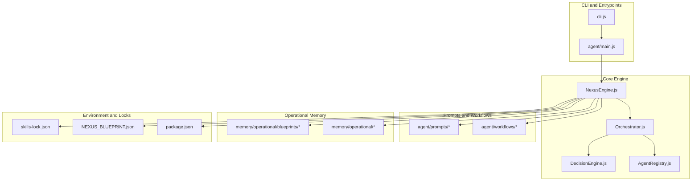
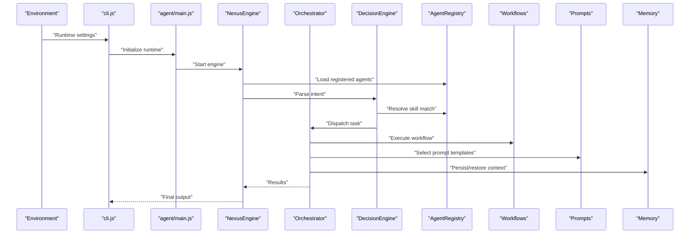
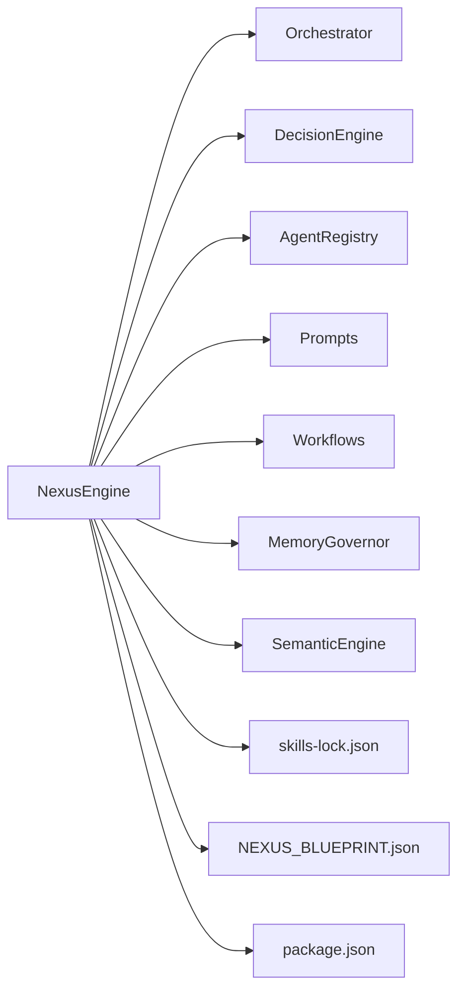

# Configuration and Customization

<cite>
**Referenced Files in This Document**
- [README.md](file://README.md)
- [package.json](file://package.json)
- [skills-lock.json](file://skills-lock.json)
- [NEXUS_BLUEPRINT.json](file://NEXUS_BLUEPRINT.json)
- [cli.js](file://cli.js)
- [agent/main.js](file://agent/main.js)
- [agent/core/NexusEngine.js](file://agent/core/NexusEngine.js)
- [agent/core/AgentRegistry.js](file://agent/core/AgentRegistry.js)
- [agent/core/Orchestrator.js](file://agent/core/Orchestrator.js)
- [agent/core/DecisionEngine.js](file://agent/core/DecisionEngine.js)
- [agent/core/MemoryGovernor.js](file://agent/core/MemoryGovernor.js)
- [agent/core/SemanticEngine.js](file://agent/core/SemanticEngine.js)
- [agent/core/TaskProtocol.js](file://agent/core/TaskProtocol.js)
- [agent/core/WorktreeManager.js](file://agent/core/WorktreeManager.js)
- [agent/core/Contract.js](file://agent/core/Contract.js)
- [agent/core/LocalIntelligence.js](file://agent/core/LocalIntelligence.js)
- [agent/core/NativeBridge.js](file://agent/core/NativeBridge.js)
- [agent/core/ResourceMonitor.js](file://agent/core/ResourceMonitor.js)
- [agent/core/Logger.js](file://agent/core/Logger.js)
- [agent/core/NexusClock.js](file://agent/core/NexusClock.js)
- [agent/core/ParallelRunner.js](file://agent/core/ParallelRunner.js)
- [agent/core/EvolutionPiper.js](file://agent/core/EvolutionPiper.js)
- [agent/core/Distiller.js](file://agent/core/Distiller.js)
- [agent/core/EventBus.js](file://agent/core/EventBus.js)
- [agent/core/Machinist.js](file://agent/core/Machinist.js)
- [agent/core/LaravelArchitect.js](file://agent/core/LaravelArchitect.js)
- [agent/core/SandboxExecutor.js](file://agent/core/SandboxExecutor.js)
- [agent/core/RedisMemory.js](file://agent/core/RedisMemory.js)
- [agent/core/Modifier.js](file://agent/core/Modifier.js)
- [agent/core/TaskProtocol.js](file://agent/core/TaskProtocol.js)
- [agent/prompts/internal/llm-orchestrator.md](file://agent/prompts/internal/llm-orchestrator.md)
- [agent/prompts/internal/orchestrator.md](file://agent/prompts/internal/orchestrator.md)
- [agent/prompts/internal/prompt-engineer.md](file://agent/prompts/internal/prompt-engineer.md)
- [agent/prompts/internal/machinist.md](file://agent/prompts/internal/machinist.md)
- [agent/workflows/internal/nexus-pipeline.md](file://agent/workflows/internal/nexus-pipeline.md)
- [agent/workflows/internal/planning-workflow.md](file://agent/workflows/internal/planning-workflow.md)
- [agent/workflows/internal/execution-workflow.md](file://agent/workflows/internal/execution-workflow.md)
- [agent/workflows/internal/knowledge-liaison.md](file://agent/workflows/internal/knowledge-liaison.md)
- [agent/workflows/internal/skill-evolution.md](file://agent/workflows/internal/skill-evolution.md)
- [memory/operational/blueprints/index.json](file://memory/operational/blueprints/index.json)
- [memory/operational/session_1778912740733.json](file://memory/operational/session_1778912740733.json)
- [install.ps1](file://install.ps1)
- [uninstall.ps1](file://uninstall.ps1)
- [nexus-sandbox.ps1](file://nexus-sandbox.ps1)
- [nexus-sandbox.sh](file://nexus-sandbox.sh)
- [Dockerfile](file://Dockerfile)
- [docker-compose.yml](file://docker-compose.yml)
- [.dockerignore](file://.dockerignore)
- [tests/TDD/nexus-engine.test.js](file://tests/TDD/nexus-engine.test.js)
</cite>

## Table of Contents
1. [Introduction](#introduction)
2. [Project Structure](#project-structure)
3. [Core Components](#core-components)
4. [Architecture Overview](#architecture-overview)
5. [Detailed Component Analysis](#detailed-component-analysis)
6. [Dependency Analysis](#dependency-analysis)
7. [Performance Considerations](#performance-considerations)
8. [Troubleshooting Guide](#troubleshooting-guide)
9. [Conclusion](#conclusion)
10. [Appendices](#appendices)

## Introduction
This document explains how to configure and customize NEXUS AI. It covers environment variables, configuration files, runtime settings, agent behavior customization, prompt engineering, skill selection, workflow modification, the blueprint system for custom agent configurations, and the skills lock mechanism for dependency management. It also provides extension guidelines, best practices for environment-specific settings, and production customization strategies.

## Project Structure
NEXUS AI is organized around an agent-centric architecture with modular components, prompts, workflows, and operational memory. Configuration surfaces appear in:
- Environment and installation scripts
- CLI entrypoint
- Agent engine and registry
- Prompts and workflows
- Operational memory blueprints
- Skills lock for deterministic dependencies

**Diagram sources**
- [cli.js](file://cli.js)
- [agent/main.js](file://agent/main.js)
- [agent/core/NexusEngine.js](file://agent/core/NexusEngine.js)
- [agent/core/Orchestrator.js](file://agent/core/Orchestrator.js)
- [agent/core/DecisionEngine.js](file://agent/core/DecisionEngine.js)
- [agent/core/AgentRegistry.js](file://agent/core/AgentRegistry.js)
- [agent/prompts/internal/llm-orchestrator.md](file://agent/prompts/internal/llm-orchestrator.md)
- [agent/workflows/internal/nexus-pipeline.md](file://agent/workflows/internal/nexus-pipeline.md)
- [memory/operational/blueprints/index.json](file://memory/operational/blueprints/index.json)
- [skills-lock.json](file://skills-lock.json)
- [NEXUS_BLUEPRINT.json](file://NEXUS_BLUEPRINT.json)
- [package.json](file://package.json)

**Section sources**
- [README.md](file://README.md)
- [package.json](file://package.json)
- [cli.js](file://cli.js)
- [agent/main.js](file://agent/main.js)

## Core Components
- NexusEngine: Central runtime that coordinates agents, memory, and workflows.
- Orchestrator: Manages agent lifecycle, scheduling, and inter-agent communication.
- DecisionEngine: Drives intent parsing, skill selection, and action routing.
- AgentRegistry: Registers and resolves agent capabilities and metadata.
- MemoryGovernor: Controls memory stages and persistence policies.
- SemanticEngine: Powers semantic indexing and retrieval for context windows.
- TaskProtocol: Defines standardized task envelopes and handoffs.
- WorktreeManager: Manages filesystem scaffolding and isolation for tasks.
- Contract: Encapsulates agent capability contracts and guarantees.
- LocalIntelligence: Provides local model inference and caching.
- NativeBridge: Integrates native OS/system capabilities.
- ResourceMonitor: Tracks resource usage and throttles workloads.
- Logger: Standardized logging across subsystems.
- NexusClock: Global timing and periodic scheduling.
- ParallelRunner: Executes concurrent tasks with bounded concurrency.
- EvolutionPiper: Drives iterative refinement and skill evolution.
- Distiller: Summarizes and distills knowledge streams.
- EventBus: Publish-subscribe for cross-module events.
- Machinist: Specialized agent for code generation and refactoring.
- LaravelArchitect: Domain-specific agent for Laravel ecosystems.
- SandboxExecutor: Executes tasks in isolated environments.
- RedisMemory: Optional distributed memory backend.
- Modifier: Applies runtime modifications to agent behavior.
- Skill locks and blueprints: Define deterministic dependencies and reusable configurations.

**Section sources**
- [agent/core/NexusEngine.js](file://agent/core/NexusEngine.js)
- [agent/core/Orchestrator.js](file://agent/core/Orchestrator.js)
- [agent/core/DecisionEngine.js](file://agent/core/DecisionEngine.js)
- [agent/core/AgentRegistry.js](file://agent/core/AgentRegistry.js)
- [agent/core/MemoryGovernor.js](file://agent/core/MemoryGovernor.js)
- [agent/core/SemanticEngine.js](file://agent/core/SemanticEngine.js)
- [agent/core/TaskProtocol.js](file://agent/core/TaskProtocol.js)
- [agent/core/WorktreeManager.js](file://agent/core/WorktreeManager.js)
- [agent/core/Contract.js](file://agent/core/Contract.js)
- [agent/core/LocalIntelligence.js](file://agent/core/LocalIntelligence.js)
- [agent/core/NativeBridge.js](file://agent/core/NativeBridge.js)
- [agent/core/ResourceMonitor.js](file://agent/core/ResourceMonitor.js)
- [agent/core/Logger.js](file://agent/core/Logger.js)
- [agent/core/NexusClock.js](file://agent/core/NexusClock.js)
- [agent/core/ParallelRunner.js](file://agent/core/ParallelRunner.js)
- [agent/core/EvolutionPiper.js](file://agent/core/EvolutionPiper.js)
- [agent/core/Distiller.js](file://agent/core/Distiller.js)
- [agent/core/EventBus.js](file://agent/core/EventBus.js)
- [agent/core/Machinist.js](file://agent/core/Machinist.js)
- [agent/core/LaravelArchitect.js](file://agent/core/LaravelArchitect.js)
- [agent/core/SandboxExecutor.js](file://agent/core/SandboxExecutor.js)
- [agent/core/RedisMemory.js](file://agent/core/RedisMemory.js)
- [agent/core/Modifier.js](file://agent/core/Modifier.js)

## Architecture Overview
NEXUS AI composes agents into a cohesive pipeline. Configuration flows from environment and lock files into the engine, which selects agents, loads prompts, executes workflows, and persists memory.

**Diagram sources**
- [cli.js](file://cli.js)
- [agent/main.js](file://agent/main.js)
- [agent/core/NexusEngine.js](file://agent/core/NexusEngine.js)
- [agent/core/Orchestrator.js](file://agent/core/Orchestrator.js)
- [agent/core/DecisionEngine.js](file://agent/core/DecisionEngine.js)
- [agent/core/AgentRegistry.js](file://agent/core/AgentRegistry.js)
- [agent/workflows/internal/nexus-pipeline.md](file://agent/workflows/internal/nexus-pipeline.md)
- [agent/prompts/internal/llm-orchestrator.md](file://agent/prompts/internal/llm-orchestrator.md)
- [agent/core/MemoryGovernor.js](file://agent/core/MemoryGovernor.js)

## Detailed Component Analysis

### Configuration System: Environment Variables, Files, and Runtime Settings
- Environment variables: Used to control runtime behavior, feature flags, and integrations. They are loaded early in the CLI and passed into the engine initialization.
- Configuration files:
  - package.json: Defines project metadata, scripts, and dependencies.
  - skills-lock.json: Locks agent skill versions and capabilities for reproducibility.
  - NEXUS_BLUEPRINT.json: Supplies default agent configurations and capabilities.
  - Operational blueprints: Stored under memory/operational/blueprints for reusable agent setups.
- Runtime settings: Determined by CLI arguments and environment variables, then injected into the engine and subsystems.

Best practices:
- Keep environment-specific overrides minimal and documented.
- Use skills-lock.json to enforce deterministic behavior across environments.
- Store reusable agent blueprints in memory/operational/blueprints for team-wide reuse.

**Section sources**
- [package.json](file://package.json)
- [skills-lock.json](file://skills-lock.json)
- [NEXUS_BLUEPRINT.json](file://NEXUS_BLUEPRINT.json)
- [memory/operational/blueprints/index.json](file://memory/operational/blueprints/index.json)
- [cli.js](file://cli.js)
- [agent/main.js](file://agent/main.js)

### Customizing Agent Behavior
- AgentRegistry: Register and resolve agents by capability. Add new agents here to extend behavior.
- DecisionEngine: Adjust skill selection heuristics and intent parsing rules.
- Modifier: Apply runtime modifications to agent behavior without changing core logic.
- LocalIntelligence and NativeBridge: Integrate local models and OS capabilities for specialized behavior.

Guidelines:
- Extend AgentRegistry with new agent entries and metadata.
- Tune DecisionEngine parameters for domain-specific intent resolution.
- Use Modifier to toggle features per session or environment.

**Section sources**
- [agent/core/AgentRegistry.js](file://agent/core/AgentRegistry.js)
- [agent/core/DecisionEngine.js](file://agent/core/DecisionEngine.js)
- [agent/core/Modifier.js](file://agent/core/Modifier.js)
- [agent/core/LocalIntelligence.js](file://agent/core/LocalIntelligence.js)
- [agent/core/NativeBridge.js](file://agent/core/NativeBridge.js)

### Prompt Engineering and Template Management
- Prompts are stored under agent/prompts/internal and agent/prompts/external. Internal prompts define core orchestration and agent-specific roles.
- Key prompt files:
  - llm-orchestrator.md: Defines orchestration and LLM interaction patterns.
  - orchestrator.md: Guides agent coordination and handoff logic.
  - prompt-engineer.md: Provides guidance for crafting effective prompts.
  - machinist.md: Agent-specific prompt for code generation/refactoring.

Customization tips:
- Modify prompt templates to reflect domain-specific terminology and constraints.
- Use prompt-engineer.md as a reference for structuring prompts and constraints.
- Keep prompt variations versioned alongside agent updates.

**Section sources**
- [agent/prompts/internal/llm-orchestrator.md](file://agent/prompts/internal/llm-orchestrator.md)
- [agent/prompts/internal/orchestrator.md](file://agent/prompts/internal/orchestrator.md)
- [agent/prompts/internal/prompt-engineer.md](file://agent/prompts/internal/prompt-engineer.md)
- [agent/prompts/internal/machinist.md](file://agent/prompts/internal/machinist.md)

### Skill Selection and Workflow Modification
- Skill selection is driven by DecisionEngine and resolved via AgentRegistry.
- Workflows define end-to-end processes:
  - nexus-pipeline.md: End-to-end orchestration.
  - planning-workflow.md: Planning and decomposition.
  - execution-workflow.md: Execution and iteration.
  - knowledge-liaison.md: Knowledge synthesis and grounding.
  - skill-evolution.md: Iterative refinement of agent capabilities.

Customization tips:
- Extend workflows to support new domains or process steps.
- Adjust skill selection thresholds and fallback strategies in DecisionEngine.
- Use EvolutionPiper to drive iterative improvements to workflows and agent behavior.

**Section sources**
- [agent/core/DecisionEngine.js](file://agent/core/DecisionEngine.js)
- [agent/core/AgentRegistry.js](file://agent/core/AgentRegistry.js)
- [agent/workflows/internal/nexus-pipeline.md](file://agent/workflows/internal/nexus-pipeline.md)
- [agent/workflows/internal/planning-workflow.md](file://agent/workflows/internal/planning-workflow.md)
- [agent/workflows/internal/execution-workflow.md](file://agent/workflows/internal/execution-workflow.md)
- [agent/workflows/internal/knowledge-liaison.md](file://agent/workflows/internal/knowledge-liaison.md)
- [agent/workflows/internal/skill-evolution.md](file://agent/workflows/internal/skill-evolution.md)
- [agent/core/EvolutionPiper.js](file://agent/core/EvolutionPiper.js)

### Blueprint System for Custom Agent Configurations
- Blueprints capture reusable agent configurations and capabilities.
- Operational blueprints are stored under memory/operational/blueprints and indexed for discovery.
- NEXUS_BLUEPRINT.json supplies default configurations for initial setup.

How to use:
- Create a blueprint JSON that defines agent capabilities, prompt overrides, and workflow preferences.
- Place the blueprint in memory/operational/blueprints for team-wide adoption.
- Reference the blueprint ID during runtime to apply the configuration.

**Section sources**
- [NEXUS_BLUEPRINT.json](file://NEXUS_BLUEPRINT.json)
- [memory/operational/blueprints/index.json](file://memory/operational/blueprints/index.json)

### Skills Lock Mechanism for Dependency Management
- skills-lock.json enforces deterministic versions and capabilities for agent skills.
- This ensures consistent behavior across environments and prevents drift.

How to use:
- Pin agent skill versions in skills-lock.json.
- Regenerate lock entries after adding or updating agents.
- Use CI to validate lock integrity.

**Section sources**
- [skills-lock.json](file://skills-lock.json)

### Extending the System: Adding New Agents and Modifying Functionality
- Add a new agent:
  - Implement the agent class and register it in AgentRegistry.
  - Provide a prompt template under agent/prompts/internal.
  - Optionally add a workflow segment under agent/workflows/internal.
- Modify existing functionality:
  - Adjust DecisionEngine parameters for skill selection.
  - Use Modifier to toggle features per deployment.
  - Update Operational Blueprints to propagate changes.

**Section sources**
- [agent/core/AgentRegistry.js](file://agent/core/AgentRegistry.js)
- [agent/prompts/internal/llm-orchestrator.md](file://agent/prompts/internal/llm-orchestrator.md)
- [agent/workflows/internal/nexus-pipeline.md](file://agent/workflows/internal/nexus-pipeline.md)
- [agent/core/Modifier.js](file://agent/core/Modifier.js)

### Environment-Specific Settings and Production Strategies
- Environment variables: Control feature flags, integrations, and resource limits.
- Installation and sandbox scripts:
  - install.ps1 and uninstall.ps1 manage environment setup and cleanup.
  - nexus-sandbox.ps1 and nexus-sandbox.sh bootstrap isolated environments.
- Containerization:
  - Dockerfile and docker-compose.yml define containerized deployments.
  - .dockerignore excludes unnecessary files from the build context.

Production best practices:
- Use environment-specific overrides for secrets and endpoints.
- Run sandboxed tasks via nexus-sandbox scripts for safety.
- Package with Docker for consistent deployments.

**Section sources**
- [install.ps1](file://install.ps1)
- [uninstall.ps1](file://uninstall.ps1)
- [nexus-sandbox.ps1](file://nexus-sandbox.ps1)
- [nexus-sandbox.sh](file://nexus-sandbox.sh)
- [Dockerfile](file://Dockerfile)
- [docker-compose.yml](file://docker-compose.yml)
- [.dockerignore](file://.dockerignore)

## Dependency Analysis
The engine depends on registries, prompts, workflows, and memory subsystems. Dependencies are managed via skills-lock.json and blueprints.

**Diagram sources**
- [agent/core/NexusEngine.js](file://agent/core/NexusEngine.js)
- [agent/core/Orchestrator.js](file://agent/core/Orchestrator.js)
- [agent/core/DecisionEngine.js](file://agent/core/DecisionEngine.js)
- [agent/core/AgentRegistry.js](file://agent/core/AgentRegistry.js)
- [agent/prompts/internal/llm-orchestrator.md](file://agent/prompts/internal/llm-orchestrator.md)
- [agent/workflows/internal/nexus-pipeline.md](file://agent/workflows/internal/nexus-pipeline.md)
- [agent/core/MemoryGovernor.js](file://agent/core/MemoryGovernor.js)
- [agent/core/SemanticEngine.js](file://agent/core/SemanticEngine.js)
- [skills-lock.json](file://skills-lock.json)
- [NEXUS_BLUEPRINT.json](file://NEXUS_BLUEPRINT.json)
- [package.json](file://package.json)

**Section sources**
- [agent/core/NexusEngine.js](file://agent/core/NexusEngine.js)
- [skills-lock.json](file://skills-lock.json)
- [NEXUS_BLUEPRINT.json](file://NEXUS_BLUEPRINT.json)
- [package.json](file://package.json)

## Performance Considerations
- Concurrency: ParallelRunner controls concurrent task execution; tune limits based on environment resources.
- Memory: MemoryGovernor and RedisMemory influence memory pressure; adjust retention and eviction policies.
- ResourceMonitor: Use built-in metrics to detect bottlenecks and throttle workloads.
- Sandboxing: Isolate heavy tasks with SandboxExecutor to prevent contention.

[No sources needed since this section provides general guidance]

## Troubleshooting Guide
- Verify environment variables and scripts:
  - Confirm install/uninstall and sandbox scripts executed successfully.
- Validate configuration integrity:
  - Ensure skills-lock.json matches current agent capabilities.
  - Confirm NEXUS_BLUEPRINT.json is present and readable.
- Test engine initialization:
  - Run unit tests for NexusEngine and related components to catch misconfiguration early.
- Review logs:
  - Use Logger outputs to trace agent dispatch and workflow execution.

**Section sources**
- [install.ps1](file://install.ps1)
- [uninstall.ps1](file://uninstall.ps1)
- [nexus-sandbox.ps1](file://nexus-sandbox.ps1)
- [nexus-sandbox.sh](file://nexus-sandbox.sh)
- [skills-lock.json](file://skills-lock.json)
- [NEXUS_BLUEPRINT.json](file://NEXUS_BLUEPRINT.json)
- [agent/core/Logger.js](file://agent/core/Logger.js)
- [tests/TDD/nexus-engine.test.js](file://tests/TDD/nexus-engine.test.js)

## Conclusion
NEXUS AI’s configuration and customization model centers on deterministic dependency management (skills-lock.json), reusable agent blueprints, and a flexible engine that orchestrates agents, prompts, and workflows. By leveraging environment variables, operational blueprints, and the skills lock, teams can tailor behavior for diverse environments while maintaining reproducibility and safety.

[No sources needed since this section summarizes without analyzing specific files]

## Appendices

### Appendix A: Configuration Reference
- Environment variables: Loaded by CLI and passed to the engine.
- package.json: Scripts and dependencies.
- skills-lock.json: Deterministic skill versions.
- NEXUS_BLUEPRINT.json: Default agent configuration.
- Operational blueprints: Reusable agent setups under memory/operational/blueprints.

**Section sources**
- [package.json](file://package.json)
- [skills-lock.json](file://skills-lock.json)
- [NEXUS_BLUEPRINT.json](file://NEXUS_BLUEPRINT.json)
- [memory/operational/blueprints/index.json](file://memory/operational/blueprints/index.json)
- [cli.js](file://cli.js)