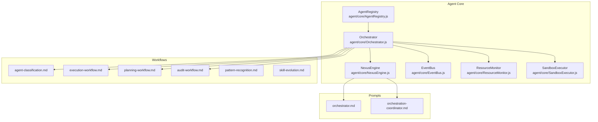
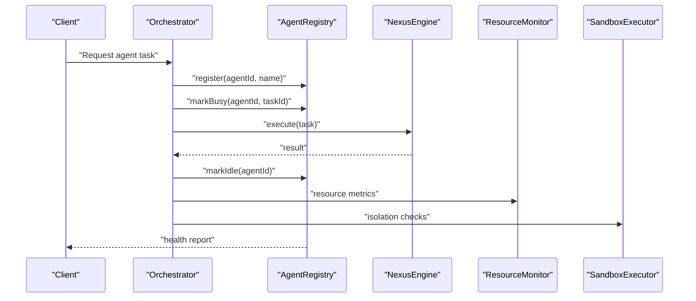
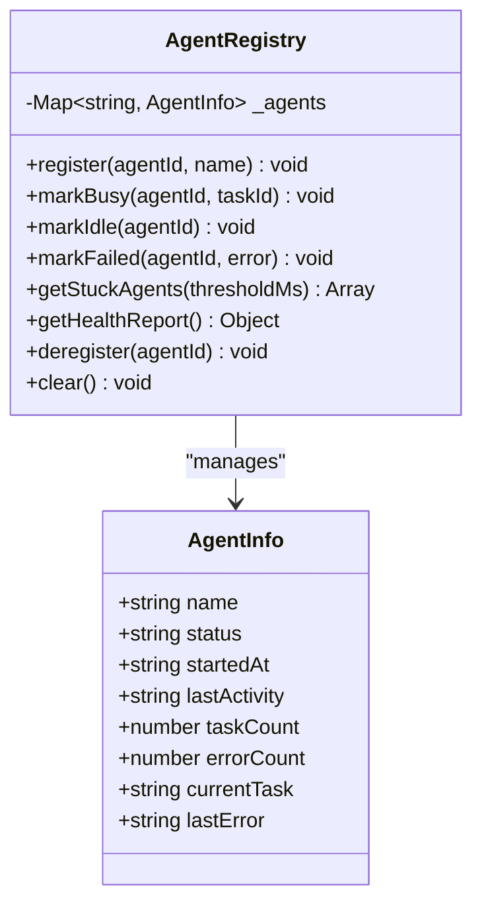
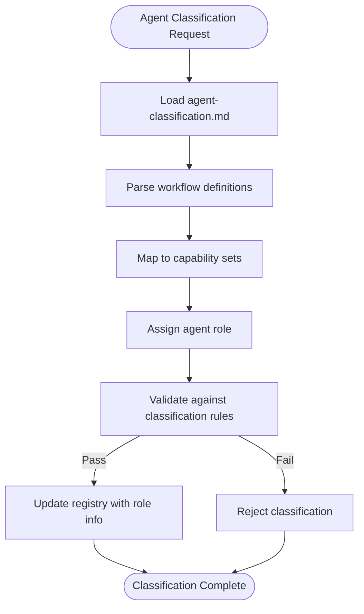
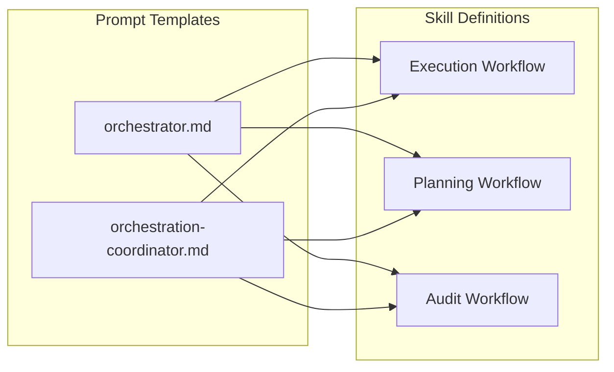
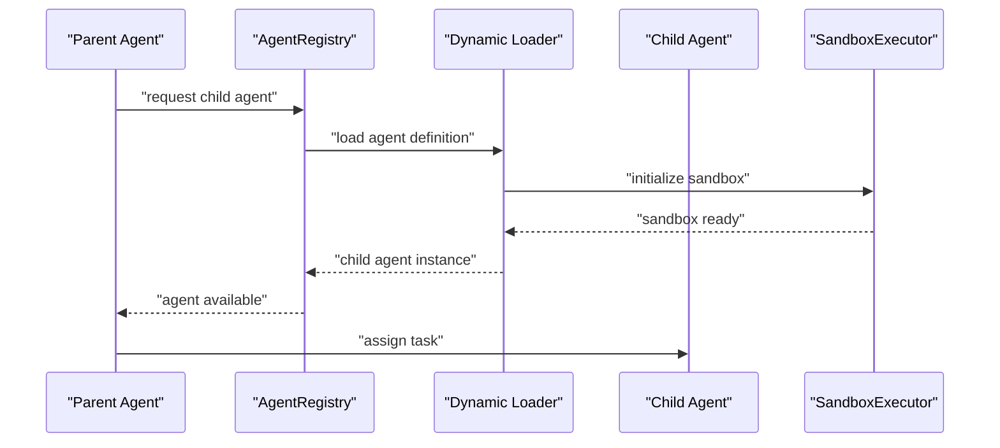
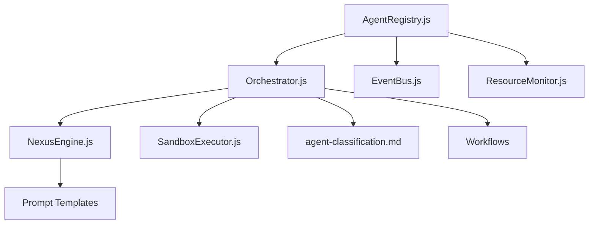

# Agent Registry

<cite>
**Referenced Files in This Document**
- [AgentRegistry.js](file://agent/core/AgentRegistry.js)
- [Orchestrator.js](file://agent/core/Orchestrator.js)
- [NexusEngine.js](file://agent/core/NexusEngine.js)
- [EventBus.js](file://agent/core/EventBus.js)
- [ResourceMonitor.js](file://agent/core/ResourceMonitor.js)
- [SandboxExecutor.js](file://agent/core/SandboxExecutor.js)
- [agent-classification.md](file://agent/workflows/internal/agent-classification.md)
- [llm-orchestrator.md](file://agent/prompts/internal/orchestration-coordinator.md)
- [orchestrator.md](file://agent/prompts/internal/orchestrator.md)
- [execution-workflow.md](file://agent/workflows/external/execution-workflow.md)
- [planning-workflow.md](file://agent/workflows/external/planning-workflow.md)
- [audit-workflow.md](file://agent/workflows/external/audit-workflow.md)
- [pattern-recognition.md](file://agent/workflows/internal/pattern-recognition.md)
- [skill-evolution.md](file://agent/workflows/internal/skill-evolution.md)
- [NEXUS_INTERNAL_PIPELINE_RECAP.md](file://documentation/nexus_rules/NEXUS_INTERNAL_PIPELINE_RECAP.md)
- [NEXUS_MULTIAGENT_STABILITY_GUIDE.md](file://documentation/nexus_rules/NEXUS_MULTIAGENT_STABILITY_GUIDE.md)
- [NEXUS_SANDBOX_Review.md](file://documentation/nexus_rules/NEXUS_SANDBOX_Review.md)
- [NEXUS_HYBRID_CORE_ROADMAP.md](file://documentation/nexus_rules/NEXUS_HYBRID_CORE_ROADMAP.md)
- [NEXUS_AI_ARCHITECTURE_AUDIT.md](file://documentation/planning/NEXUS_AI_ARCHITECTURE_AUDIT.md)
- [NEXUS_MULTI_AGENT_STABILIZATION_PLAN.md](file://documentation/planning/NEXUS_MULTI_AGENT_STABILIZATION_PLAN.md)
- [NEXUS_CORE_MODULARIZATION.md](file://documentation/algorithms/NEXUS_CORE_MODULARIZATION.md)
- [NEXUS_AGENT_GAP_ROUND3.md](file://documentation/algorithms/NEXUS_AGENT_GAP_ROUND3.md)
- [NEXUS_AI_Architecture_Analysis.md](file://documentation/planning/NEXUS_AI_Architecture_Analysis.md)
- [NEXUS_AI_Code_Review.md](file://documentation/planning/NEXUS_AI_Code_Review.md)
- [NEXUS_AI_v2_Code_Review.md](file://documentation/planning/NEXUS_AI_v2_Code_Review.md)
- [NEXUS_AI_Next_Gen_Bugs.md](file://documentation/planning/NEXUS_AI_Next_Gen_Bugs.md)
- [NEXUS_AI_Next_Gen_Bugs.md](file://documentation/planning/NEXUS_AI_Next_Gen_Bugs.md)
</cite>

## Table of Contents
1. [Introduction](#introduction)
2. [Project Structure](#project-structure)
3. [Core Components](#core-components)
4. [Architecture Overview](#architecture-overview)
5. [Detailed Component Analysis](#detailed-component-analysis)
6. [Dependency Analysis](#dependency-analysis)
7. [Performance Considerations](#performance-considerations)
8. [Troubleshooting Guide](#troubleshooting-guide)
9. [Conclusion](#conclusion)
10. [Appendices](#appendices)

## Introduction
The Agent Registry serves as the central "Control Tower" for managing specialized AI agents within the NEXUS ecosystem. It provides comprehensive lifecycle management, agent discovery, and health monitoring capabilities. The registry tracks agent status, activity metrics, and operational health while enabling dynamic agent loading and relationship management. This document explains how the registry integrates with the broader orchestration system, manages agent configurations, and supports advanced features like agent isolation and resource management.

## Project Structure
The Agent Registry is part of the agent core subsystem and interacts with several orchestration and workflow components. The registry maintains agent metadata and status, while higher-level systems handle agent execution, skill mapping, and capability assignment.

**Diagram sources**
- [AgentRegistry.js](file://agent/core/AgentRegistry.js)
- [Orchestrator.js](file://agent/core/Orchestrator.js)
- [NexusEngine.js](file://agent/core/NexusEngine.js)
- [EventBus.js](file://agent/core/EventBus.js)
- [ResourceMonitor.js](file://agent/core/ResourceMonitor.js)
- [SandboxExecutor.js](file://agent/core/SandboxExecutor.js)
- [agent-classification.md](file://agent/workflows/internal/agent-classification.md)
- [execution-workflow.md](file://agent/workflows/external/execution-workflow.md)
- [planning-workflow.md](file://agent/workflows/external/planning-workflow.md)
- [audit-workflow.md](file://agent/workflows/external/audit-workflow.md)
- [pattern-recognition.md](file://agent/workflows/internal/pattern-recognition.md)
- [skill-evolution.md](file://agent/workflows/internal/skill-evolution.md)
- [orchestrator.md](file://agent/prompts/internal/orchestrator.md)
- [llm-orchestrator.md](file://agent/prompts/internal/orchestration-coordinator.md)

**Section sources**
- [AgentRegistry.js](file://agent/core/AgentRegistry.js)
- [Orchestrator.js](file://agent/core/Orchestrator.js)
- [NexusEngine.js](file://agent/core/NexusEngine.js)
- [EventBus.js](file://agent/core/EventBus.js)
- [ResourceMonitor.js](file://agent/core/ResourceMonitor.js)
- [SandboxExecutor.js](file://agent/core/SandboxExecutor.js)
- [agent-classification.md](file://agent/workflows/internal/agent-classification.md)
- [execution-workflow.md](file://agent/workflows/external/execution-workflow.md)
- [planning-workflow.md](file://agent/workflows/external/planning-workflow.md)
- [audit-workflow.md](file://agent/workflows/external/audit-workflow.md)
- [pattern-recognition.md](file://agent/workflows/internal/pattern-recognition.md)
- [skill-evolution.md](file://agent/workflows/internal/skill-evolution.md)
- [orchestrator.md](file://agent/prompts/internal/orchestrator.md)
- [llm-orchestrator.md](file://agent/prompts/internal/orchestration-coordinator.md)

## Core Components
The Agent Registry provides centralized agent lifecycle management with the following responsibilities:
- Registration and de-registration of agents
- Status tracking (idle, busy, failed, timeout)
- Activity monitoring and stuck agent detection
- Health reporting for operational oversight
- Integration hooks for orchestration and monitoring

Key implementation characteristics:
- Singleton pattern ensuring a single registry instance across the system
- In-memory agent map for fast lookups and updates
- Threshold-based stuck agent detection to prevent system bottlenecks
- Comprehensive health metrics for observability

**Section sources**
- [AgentRegistry.js](file://agent/core/AgentRegistry.js)

## Architecture Overview
The Agent Registry operates as a foundational component within the NEXUS orchestration architecture. It interfaces with the Orchestrator to coordinate agent activities, integrates with the Nexus Engine for core processing, and collaborates with Resource Monitor and Sandbox Executor for isolation and resource management.

**Diagram sources**
- [AgentRegistry.js](file://agent/core/AgentRegistry.js)
- [Orchestrator.js](file://agent/core/Orchestrator.js)
- [NexusEngine.js](file://agent/core/NexusEngine.js)
- [ResourceMonitor.js](file://agent/core/ResourceMonitor.js)
- [SandboxExecutor.js](file://agent/core/SandboxExecutor.js)

## Detailed Component Analysis

### Agent Registry Class
The Agent Registry implements a comprehensive agent lifecycle management system with the following methods and behaviors:
- Registration: Creates agent entries with initial status and metadata
- Busy/Idle transitions: Track task execution and completion
- Failure tracking: Record errors and update failure counts
- Stuck detection: Identify agents exceeding configured time thresholds
- Health reporting: Aggregate statistics for system monitoring
- Cleanup: Support for deregistration and clearing all agents

**Diagram sources**
- [AgentRegistry.js](file://agent/core/AgentRegistry.js)

**Section sources**
- [AgentRegistry.js](file://agent/core/AgentRegistry.js)

### Agent Classification and Capability Assignment
The system employs structured workflows and documentation to define agent capabilities and classification:
- Agent classification workflow establishes categories and roles for different agent types
- Pattern recognition and skill evolution processes enable dynamic capability mapping
- Execution and planning workflows define operational contexts and requirements
- Audit workflows ensure compliance and quality assurance

**Diagram sources**
- [agent-classification.md](file://agent/workflows/internal/agent-classification.md)
- [pattern-recognition.md](file://agent/workflows/internal/pattern-recognition.md)
- [skill-evolution.md](file://agent/workflows/internal/skill-evolution.md)

**Section sources**
- [agent-classification.md](file://agent/workflows/internal/agent-classification.md)
- [pattern-recognition.md](file://agent/workflows/internal/pattern-recognition.md)
- [skill-evolution.md](file://agent/workflows/internal/skill-evolution.md)

### Prompt Templates and Skill Definitions
The registry integrates with prompt-based systems that define agent behavior and capabilities:
- Orchestrator prompts guide agent coordination and task allocation
- Orchestration coordinator prompts manage cross-agent communication
- Skill definitions specify executable capabilities and workflows
- Template-based approaches enable consistent agent behavior across contexts

**Diagram sources**
- [orchestrator.md](file://agent/prompts/internal/orchestrator.md)
- [llm-orchestrator.md](file://agent/prompts/internal/orchestration-coordinator.md)
- [execution-workflow.md](file://agent/workflows/external/execution-workflow.md)
- [planning-workflow.md](file://agent/workflows/external/planning-workflow.md)
- [audit-workflow.md](file://agent/workflows/external/audit-workflow.md)

**Section sources**
- [orchestrator.md](file://agent/prompts/internal/orchestrator.md)
- [llm-orchestrator.md](file://agent/prompts/internal/orchestration-coordinator.md)
- [execution-workflow.md](file://agent/workflows/external/execution-workflow.md)
- [planning-workflow.md](file://agent/workflows/external/planning-workflow.md)
- [audit-workflow.md](file://agent/workflows/external/audit-workflow.md)

### Dynamic Agent Loading and Relationship Management
Dynamic agent loading enables runtime instantiation and management of specialized agents:
- Runtime agent creation based on capability requirements
- Relationship mapping between parent and child agents
- Isolation boundaries for secure multi-agent execution
- Resource allocation and monitoring for each agent instance

**Diagram sources**
- [AgentRegistry.js](file://agent/core/AgentRegistry.js)
- [SandboxExecutor.js](file://agent/core/SandboxExecutor.js)
- [Orchestrator.js](file://agent/core/Orchestrator.js)

**Section sources**
- [AgentRegistry.js](file://agent/core/AgentRegistry.js)
- [SandboxExecutor.js](file://agent/core/SandboxExecutor.js)
- [Orchestrator.js](file://agent/core/Orchestrator.js)

## Dependency Analysis
The Agent Registry has clear dependencies and integration points within the NEXUS architecture:

**Diagram sources**
- [AgentRegistry.js](file://agent/core/AgentRegistry.js)
- [Orchestrator.js](file://agent/core/Orchestrator.js)
- [NexusEngine.js](file://agent/core/NexusEngine.js)
- [EventBus.js](file://agent/core/EventBus.js)
- [ResourceMonitor.js](file://agent/core/ResourceMonitor.js)
- [SandboxExecutor.js](file://agent/core/SandboxExecutor.js)
- [agent-classification.md](file://agent/workflows/internal/agent-classification.md)

**Section sources**
- [AgentRegistry.js](file://agent/core/AgentRegistry.js)
- [Orchestrator.js](file://agent/core/Orchestrator.js)
- [NexusEngine.js](file://agent/core/NexusEngine.js)
- [EventBus.js](file://agent/core/EventBus.js)
- [ResourceMonitor.js](file://agent/core/ResourceMonitor.js)
- [SandboxExecutor.js](file://agent/core/SandboxExecutor.js)
- [agent-classification.md](file://agent/workflows/internal/agent-classification.md)

## Performance Considerations
The Agent Registry is designed for high-performance agent lifecycle management:
- In-memory operations minimize latency for frequent status updates
- Efficient map-based lookups support rapid agent queries
- Threshold-based stuck detection prevents resource starvation
- Health reporting aggregates metrics without blocking primary operations
- Integration with ResourceMonitor enables proactive capacity management

## Troubleshooting Guide
Common issues and resolution strategies for the Agent Registry:

### Stuck Agent Detection
- Symptom: Agents remain in busy state beyond expected duration
- Resolution: Adjust threshold values and implement cleanup procedures
- Monitoring: Regular health reports help identify recurring stuck agents

### Registration Failures
- Symptom: Agent registration fails or duplicates occur
- Resolution: Validate unique agent IDs and proper initialization sequences
- Prevention: Implement pre-registration validation checks

### Performance Degradation
- Symptom: Slow response times for agent queries
- Resolution: Optimize health report generation and reduce unnecessary scans
- Monitoring: Track registry operation timing and memory usage

**Section sources**
- [AgentRegistry.js](file://agent/core/AgentRegistry.js)

## Conclusion
The Agent Registry provides essential infrastructure for managing specialized AI agents within the NEXUS ecosystem. Its comprehensive lifecycle management, health monitoring, and integration capabilities enable scalable multi-agent systems. The registry's design supports dynamic agent loading, capability assignment, and secure isolation while maintaining performance and observability. Through its integration with orchestration workflows and prompt-based systems, the registry facilitates sophisticated agent coordination and execution patterns.

## Appendices

### Agent Lifecycle States
The registry manages four primary agent states:
- Idle: Available for new tasks
- Busy: Currently executing a task
- Failed: Encountered an error during execution
- Timeout: Exceeded configured time limits

### Integration Guidelines
- Register agents before assigning tasks
- Update status transitions promptly
- Monitor health reports regularly
- Implement proper cleanup procedures
- Configure appropriate stuck detection thresholds

### Security and Isolation
- SandboxExecutor provides execution isolation
- ResourceMonitor tracks resource consumption
- EventBus enables secure inter-agent communication
- Proper agent registration ensures accountability