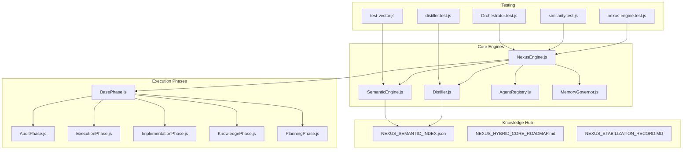
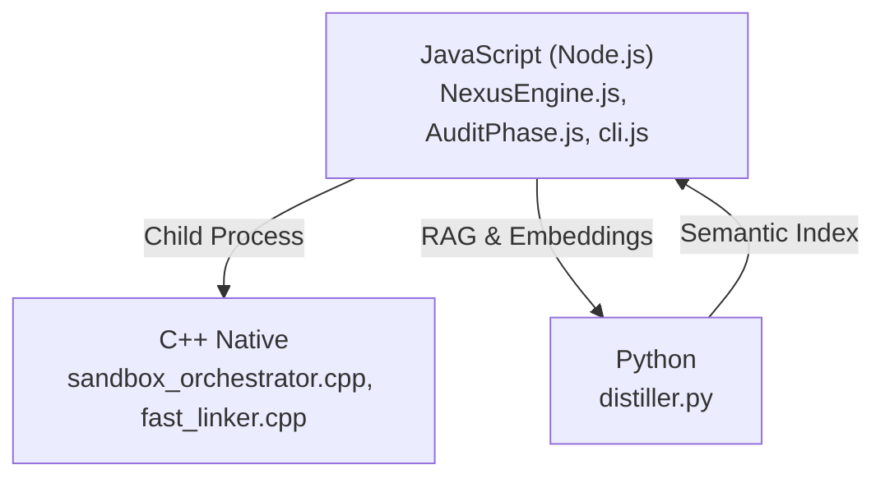
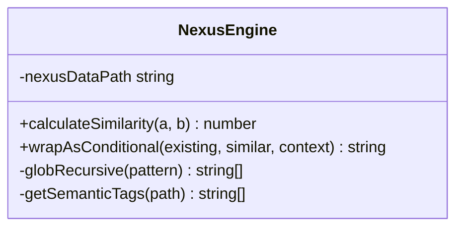
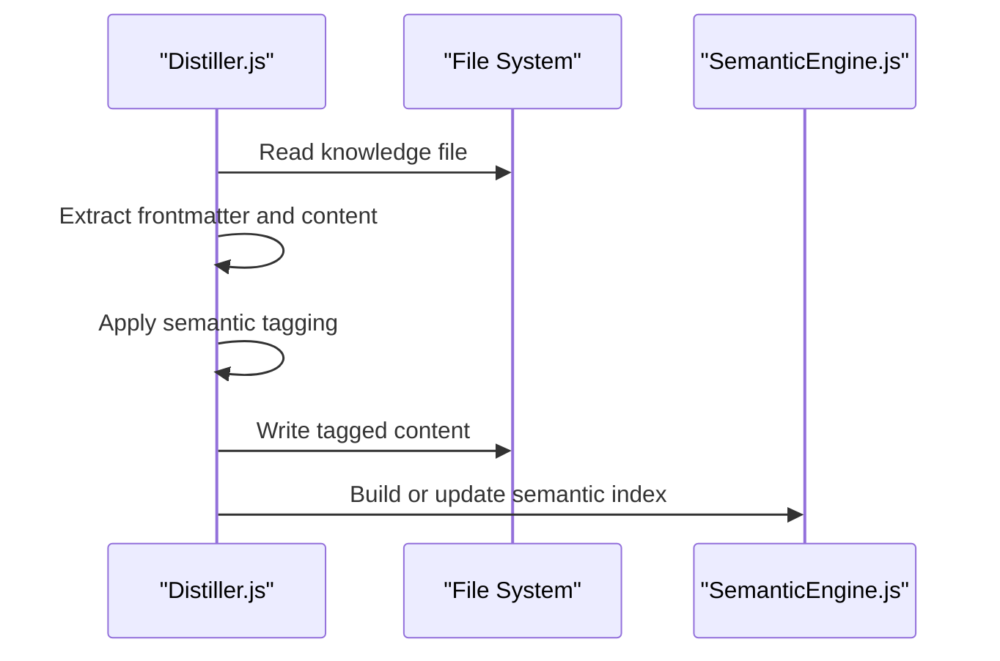
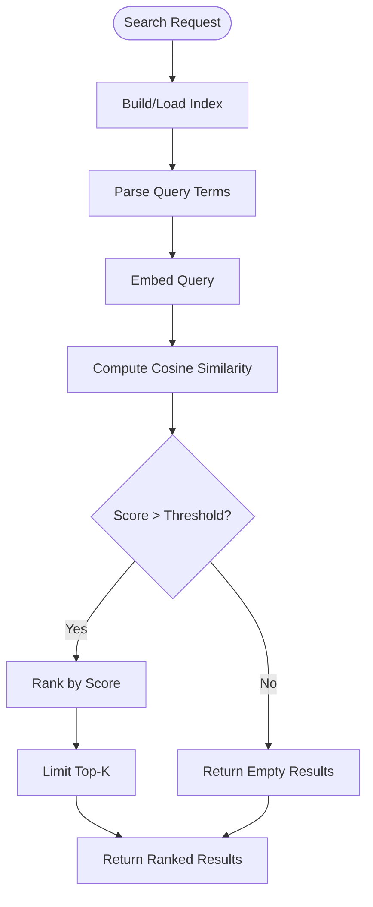
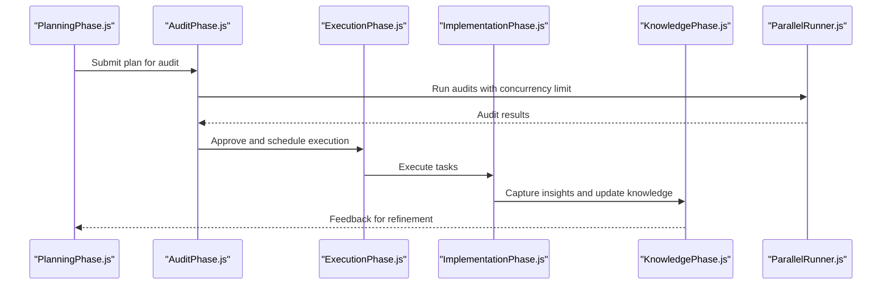
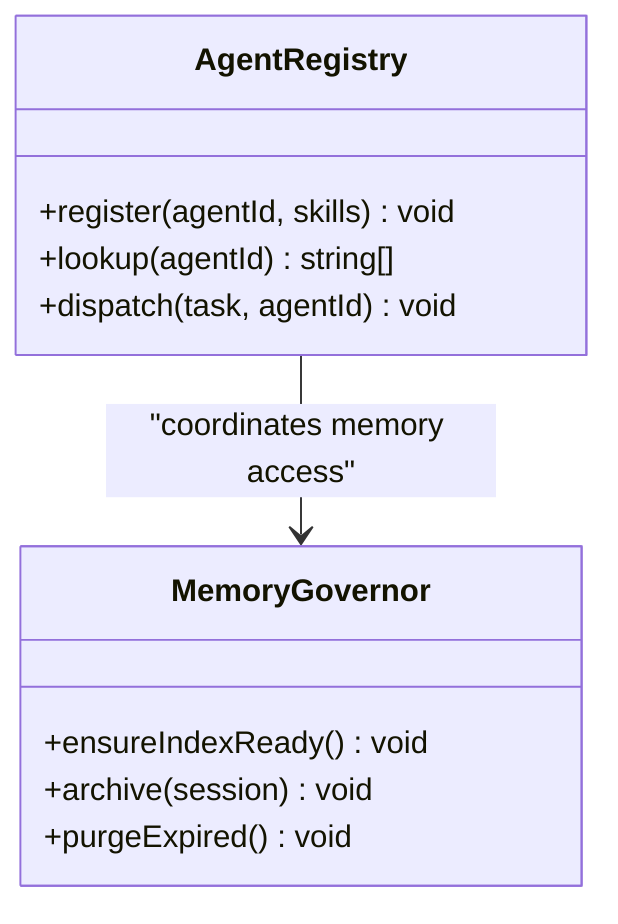
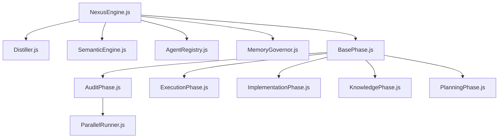

# Algorithms and Skill Extraction

<cite>
**Referenced Files in This Document**
- [NexusEngine.js](file://agent/core/NexusEngine.js)
- [Distiller.js](file://agent/core/Distiller.js)
- [SemanticEngine.js](file://agent/core/SemanticEngine.js)
- [AgentRegistry.js](file://agent/core/AgentRegistry.js)
- [MemoryGovernor.js](file://agent/core/MemoryGovernor.js)
- [AuditPhase.js](file://agent/core/phases/AuditPhase.js)
- [BasePhase.js](file://agent/core/phases/BasePhase.js)
- [ExecutionPhase.js](file://agent/core/phases/ExecutionPhase.js)
- [ImplementationPhase.js](file://agent/core/phases/ImplementationPhase.js)
- [KnowledgePhase.js](file://agent/core/phases/KnowledgePhase.js)
- [PlanningPhase.js](file://agent/core/phases/PlanningPhase.js)
- [ParallelRunner.js](file://agent/core/ParallelRunner.js)
- [nexus-engine.test.js](file://tests/TDD/nexus-engine.test.js)
- [similarity.test.js](file://tests/TDD/similarity.test.js)
- [distiller.test.js](file://tests/TDD/distiller.test.js)
- [Orchestrator.test.js](file://tests/TDD/Orchestrator.test.js)
- [test-vector.js](file://tests/test-vector.js)
- [NEXUS_HYBRID_CORE_ROADMAP.md](file://memory/distilled/tdd/NEXUS_HYBRID_CORE_ROADMAP.md)
- [NEXUS_STABILIZATION_RECORD.MD](file://memory/distilled/tdd/NEXUS_STABILIZATION_RECORD.MD)
- [NEXUS_SEMANTIC_INDEX.json](file://memory/distilled/NEXUS_SEMANTIC_INDEX.json)
</cite>

## Table of Contents
1. [Introduction](#introduction)
2. [Project Structure](#project-structure)
3. [Core Components](#core-components)
4. [Architecture Overview](#architecture-overview)
5. [Detailed Component Analysis](#detailed-component-analysis)
6. [Dependency Analysis](#dependency-analysis)
7. [Performance Considerations](#performance-considerations)
8. [Troubleshooting Guide](#troubleshooting-guide)
9. [Conclusion](#conclusion)

## Introduction
This document explains the algorithms and skill extraction mechanisms within the NEXUS-AI system. It focuses on how knowledge is distilled, tagged, searched, and orchestrated into actionable skills for autonomous agents. The system employs a hybrid architecture combining JavaScript orchestration, C++ native operations, and Python-based vector distillation to achieve scalable, intelligent task execution across diverse domains.

## Project Structure
The repository organizes algorithms and skills primarily under:
- agent/core: Core engines for knowledge processing, semantic search, and agent orchestration
- agent/core/phases: Phase-based execution pipeline for planning, auditing, and implementation
- memory/distilled: Semantic tagging and knowledge hubs for skills and wisdom
- tests/TDD: Automated tests validating similarity, distillation, and engine behavior
- memory/short_term: Vector index and semantic search infrastructure

**Diagram sources**
- [NexusEngine.js](file://agent/core/NexusEngine.js)
- [Distiller.js](file://agent/core/Distiller.js)
- [SemanticEngine.js](file://agent/core/SemanticEngine.js)
- [AgentRegistry.js](file://agent/core/AgentRegistry.js)
- [MemoryGovernor.js](file://agent/core/MemoryGovernor.js)
- [BasePhase.js](file://agent/core/phases/BasePhase.js)
- [AuditPhase.js](file://agent/core/phases/AuditPhase.js)
- [ExecutionPhase.js](file://agent/core/phases/ExecutionPhase.js)
- [ImplementationPhase.js](file://agent/core/phases/ImplementationPhase.js)
- [KnowledgePhase.js](file://agent/core/phases/KnowledgePhase.js)
- [PlanningPhase.js](file://agent/core/phases/PlanningPhase.js)
- [nexus-engine.test.js](file://tests/TDD/nexus-engine.test.js)
- [similarity.test.js](file://tests/TDD/similarity.test.js)
- [distiller.test.js](file://tests/TDD/distiller.test.js)
- [Orchestrator.test.js](file://tests/TDD/Orchestrator.test.js)
- [test-vector.js](file://tests/test-vector.js)
- [NEXUS_SEMANTIC_INDEX.json](file://memory/distilled/NEXUS_SEMANTIC_INDEX.json)
- [NEXUS_HYBRID_CORE_ROADMAP.md](file://memory/distilled/tdd/NEXUS_HYBRID_CORE_ROADMAP.md)
- [NEXUS_STABILIZATION_RECORD.MD](file://memory/distilled/tdd/NEXUS_STABILIZATION_RECORD.MD)

**Section sources**
- [NexusEngine.js](file://agent/core/NexusEngine.js)
- [NEXUS_HYBRID_CORE_ROADMAP.md](file://memory/distilled/tdd/NEXUS_HYBRID_CORE_ROADMAP.md)

## Core Components
This section outlines the primary algorithms and their roles in skill extraction and execution.

- NexusEngine: Central coordinator that manages knowledge consolidation, similarity detection, and conditional wrapping for robust decision-making.
- Distiller: Applies semantic tagging to knowledge documents and enriches them with metadata for downstream search and routing.
- SemanticEngine: Builds semantic indexes and performs vectorized similarity searches to surface relevant knowledge for agent tasks.
- AgentRegistry: Maintains agent capabilities and skill mappings for dispatch and execution.
- MemoryGovernor: Controls memory lifecycle and ensures efficient access to semantic indices and operational artifacts.
- Phase-based Pipeline: Structured execution model (Planning, Audit, Execution, Implementation, Knowledge) that orchestrates autonomous workflows.

Key algorithms:
- Cosine similarity with zero-vector normalization guard
- Knowledge consolidation and collision resolution
- Semantic tagging and metadata injection
- Vector search with multi-domain queries

**Section sources**
- [NexusEngine.js](file://agent/core/NexusEngine.js)
- [Distiller.js](file://agent/core/Distiller.js)
- [SemanticEngine.js](file://agent/core/SemanticEngine.js)
- [AgentRegistry.js](file://agent/core/AgentRegistry.js)
- [MemoryGovernor.js](file://agent/core/MemoryGovernor.js)

## Architecture Overview
The system integrates three languages for specialized workloads:
- JavaScript (Node.js): Orchestrator, CLI interface, and asynchronous I/O loops
- C++ (Native): Sandbox operations, file manipulation, and heavy I/O tasks
- Python (AI & Vector Distillation): Knowledge harvesting, semantic embeddings, and RAG interactions

**Diagram sources**
- [NexusEngine.js](file://agent/core/NexusEngine.js)
- [NEXUS_HYBRID_CORE_ROADMAP.md](file://memory/distilled/tdd/NEXUS_HYBRID_CORE_ROADMAP.md)

## Detailed Component Analysis

### NexusEngine: Knowledge Consolidation and Similarity
NexusEngine implements:
- Similarity calculation using cosine similarity with safeguards against zero-norm vectors
- Conditional wrapping to consolidate similar knowledge or resolve collisions
- Path resolution and operational path management for stability

**Diagram sources**
- [NexusEngine.js](file://agent/core/NexusEngine.js)

Validation highlights:
- Identity strings yield perfect similarity
- Different strings produce low similarity
- Partial matches yield moderate similarity
- Consolidation triggers on high similarity; collision resolution on low similarity

**Section sources**
- [nexus-engine.test.js](file://tests/TDD/nexus-engine.test.js)
- [similarity.test.js](file://tests/TDD/similarity.test.js)

### Distiller: Semantic Tagging and Knowledge Enhancement
Distiller applies semantic tagging to knowledge documents, injecting metadata that enables targeted retrieval and routing.

**Diagram sources**
- [Distiller.js](file://agent/core/Distiller.js)
- [SemanticEngine.js](file://agent/core/SemanticEngine.js)

Validation highlights:
- Tags are injected into file metadata
- Identified domain tags appear in tagged content
- Index updates support downstream search

**Section sources**
- [distiller.test.js](file://tests/TDD/distiller.test.js)

### SemanticEngine: Vector Search and Retrieval
SemanticEngine builds and queries semantic indexes to retrieve relevant knowledge for agent tasks.

**Diagram sources**
- [SemanticEngine.js](file://agent/core/SemanticEngine.js)
- [test-vector.js](file://tests/test-vector.js)

Validation highlights:
- Security, database, and multi-domain queries return relevant results
- Scores indicate relevance for ranking
- Tags assist cross-domain filtering

**Section sources**
- [test-vector.js](file://tests/test-vector.js)

### Phase-Based Execution Pipeline
The pipeline coordinates autonomous workflows across structured phases:

**Diagram sources**
- [PlanningPhase.js](file://agent/core/phases/PlanningPhase.js)
- [AuditPhase.js](file://agent/core/phases/AuditPhase.js)
- [ExecutionPhase.js](file://agent/core/phases/ExecutionPhase.js)
- [ImplementationPhase.js](file://agent/core/phases/ImplementationPhase.js)
- [KnowledgePhase.js](file://agent/core/phases/KnowledgePhase.js)
- [ParallelRunner.js](file://agent/core/ParallelRunner.js)

Operational notes:
- AuditPhase uses a bounded concurrency runner to prevent resource exhaustion
- ParallelRunner enforces controlled parallelism for audits and other tasks

**Section sources**
- [AuditPhase.js](file://agent/core/phases/AuditPhase.js)
- [ParallelRunner.js](file://agent/core/ParallelRunner.js)

### Agent Registry and Memory Governance
AgentRegistry maintains agent capabilities and skill mappings, while MemoryGovernor controls memory lifecycle and index access.

**Diagram sources**
- [AgentRegistry.js](file://agent/core/AgentRegistry.js)
- [MemoryGovernor.js](file://agent/core/MemoryGovernor.js)

## Dependency Analysis
The system exhibits layered dependencies:
- Core engines depend on memory governance and semantic indexing
- Phase execution depends on registry and parallel runners
- Testing validates core algorithms and integration points

**Diagram sources**
- [NexusEngine.js](file://agent/core/NexusEngine.js)
- [Distiller.js](file://agent/core/Distiller.js)
- [SemanticEngine.js](file://agent/core/SemanticEngine.js)
- [AgentRegistry.js](file://agent/core/AgentRegistry.js)
- [MemoryGovernor.js](file://agent/core/MemoryGovernor.js)
- [BasePhase.js](file://agent/core/phases/BasePhase.js)
- [AuditPhase.js](file://agent/core/phases/AuditPhase.js)
- [ExecutionPhase.js](file://agent/core/phases/ExecutionPhase.js)
- [ImplementationPhase.js](file://agent/core/phases/ImplementationPhase.js)
- [KnowledgePhase.js](file://agent/core/phases/KnowledgePhase.js)
- [PlanningPhase.js](file://agent/core/phases/PlanningPhase.js)
- [ParallelRunner.js](file://agent/core/ParallelRunner.js)

**Section sources**
- [NexusEngine.js](file://agent/core/NexusEngine.js)
- [AgentRegistry.js](file://agent/core/AgentRegistry.js)
- [MemoryGovernor.js](file://agent/core/MemoryGovernor.js)

## Performance Considerations
- Concurrency control: AuditPhase uses a bounded runner to cap parallel tasks and avoid resource contention
- Indexing strategy: SemanticEngine builds indexes once and reuses them for queries to minimize latency
- Path normalization: NexusEngine improves path handling across platforms to reduce overhead
- Hybrid execution: C++ native components handle heavy I/O and sandbox operations, offloading CPU-bound tasks from Node.js

**Section sources**
- [AuditPhase.js](file://agent/core/phases/AuditPhase.js)
- [NexusEngine.js](file://agent/core/NexusEngine.js)
- [NEXUS_HYBRID_CORE_ROADMAP.md](file://memory/distilled/tdd/NEXUS_HYBRID_CORE_ROADMAP.md)

## Troubleshooting Guide
Common issues and resolutions:
- Zero-norm vectors causing NaN in similarity: Guard returns zero similarity for zero vectors
- Unbounded concurrency leading to resource exhaustion: Use ParallelRunner with explicit limits
- Missing semantic tags after distillation: Verify tagging injection and index rebuild
- Vector search returning empty results: Confirm index build and query term relevance

Validation references:
- Similarity tests confirm identity, partial, and different string behaviors
- Distiller tests verify metadata injection and tag presence
- Vector search tests demonstrate multi-domain retrieval

**Section sources**
- [similarity.test.js](file://tests/TDD/similarity.test.js)
- [distiller.test.js](file://tests/TDD/distiller.test.js)
- [test-vector.js](file://tests/test-vector.js)

## Conclusion
NEXUS-AI’s algorithms and skill extraction pipeline integrate semantic tagging, vector search, and phase-based orchestration to enable autonomous, scalable execution across domains. The hybrid architecture leverages specialized components for optimal performance, while rigorous testing ensures reliability and maintainability. This foundation supports continuous evolution of skills and knowledge through iterative refinement and semantic enrichment.