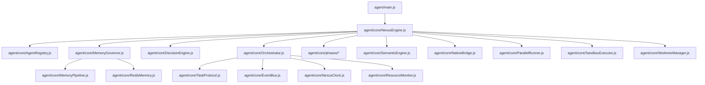
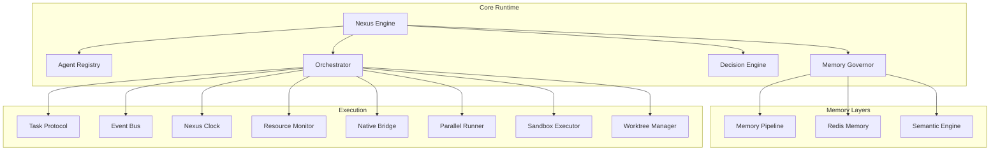
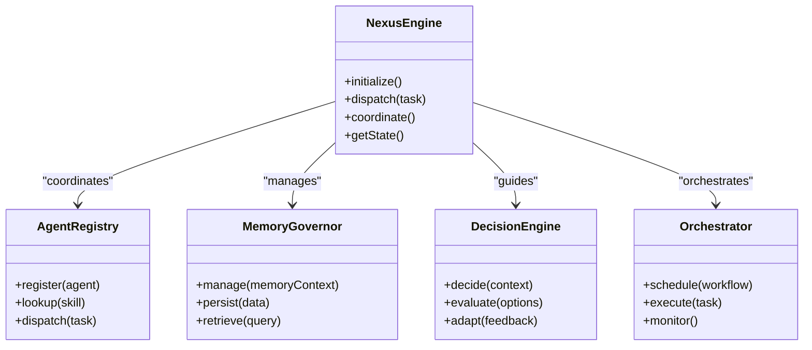
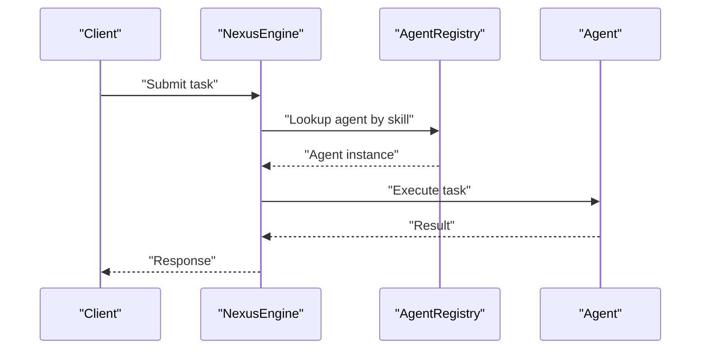
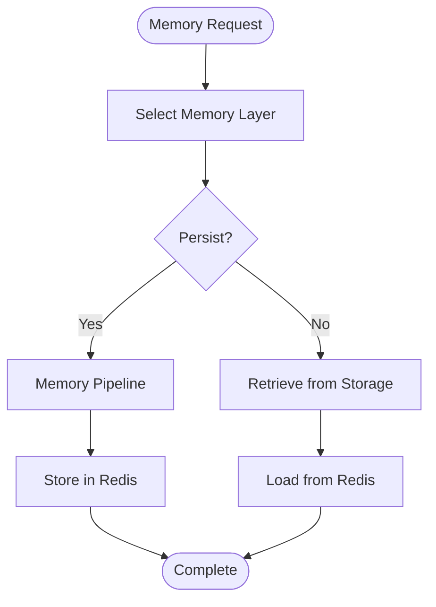
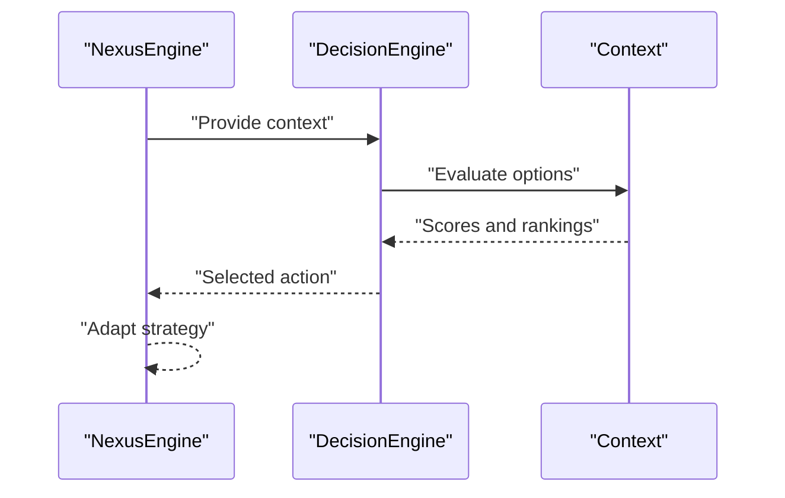
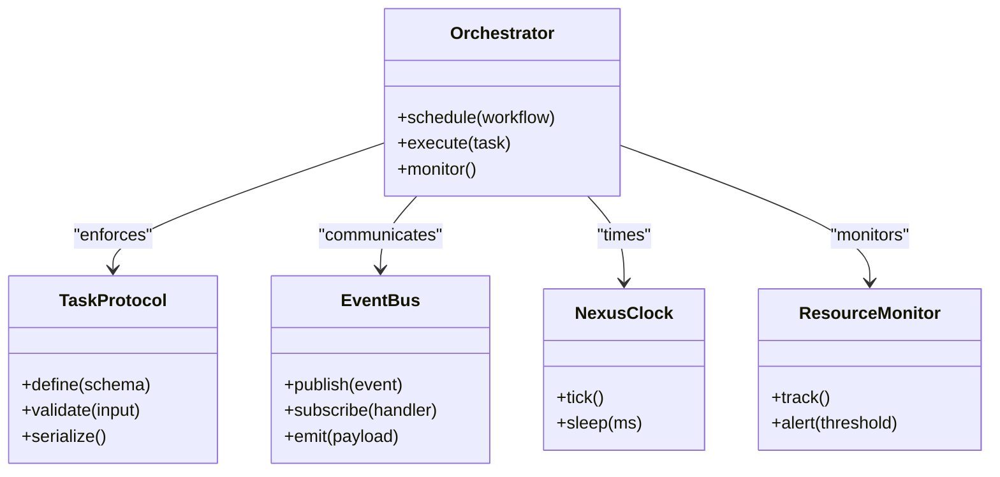
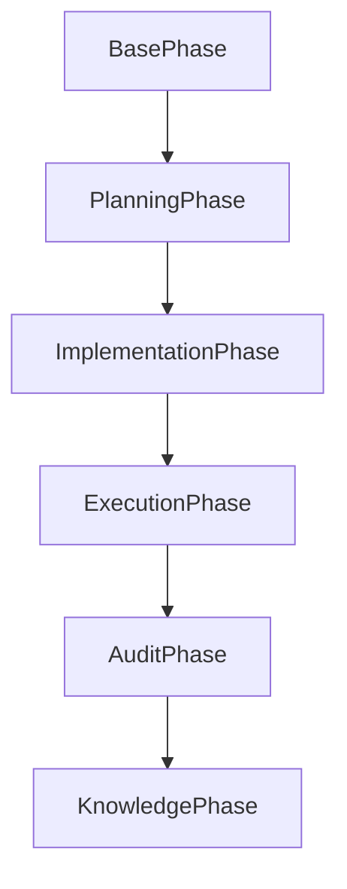
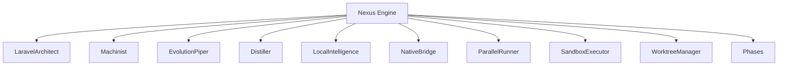
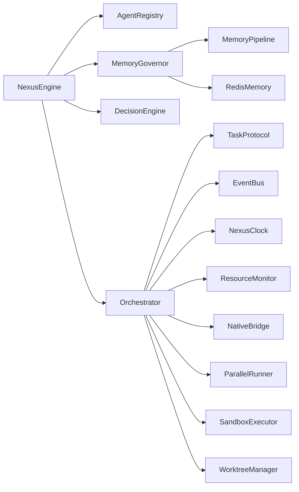

# Core Architecture

<cite>
**Referenced Files in This Document**
- [README.md](file://README.md)
- [package.json](file://package.json)
- [Dockerfile](file://Dockerfile)
- [docker-compose.yml](file://docker-compose.yml)
- [agent/main.js](file://agent/main.js)
- [agent/core/NexusEngine.js](file://agent/core/NexusEngine.js)
- [agent/core/AgentRegistry.js](file://agent/core/AgentRegistry.js)
- [agent/core/MemoryGovernor.js](file://agent/core/MemoryGovernor.js)
- [agent/core/DecisionEngine.js](file://agent/core/DecisionEngine.js)
- [agent/core/Orchestrator.js](file://agent/core/Orchestrator.js)
- [agent/core/MemoryPipeline.js](file://agent/core/MemoryPipeline.js)
- [agent/core/RedisMemory.js](file://agent/core/RedisMemory.js)
- [agent/core/SemanticEngine.js](file://agent/core/SemanticEngine.js)
- [agent/core/TaskProtocol.js](file://agent/core/TaskProtocol.js)
- [agent/core/EventBus.js](file://agent/core/EventBus.js)
- [agent/core/NexusClock.js](file://agent/core/NexusClock.js)
- [agent/core/ResourceMonitor.js](file://agent/core/ResourceMonitor.js)
- [agent/core/LocalIntelligence.js](file://agent/core/LocalIntelligence.js)
- [agent/core/NativeBridge.js](file://agent/core/NativeBridge.js)
- [agent/core/ParallelRunner.js](file://agent/core/ParallelRunner.js)
- [agent/core/SandboxExecutor.js](file://agent/core/SandboxExecutor.js)
- [agent/core/WorktreeManager.js](file://agent/core/WorktreeManager.js)
- [agent/core/phases/BasePhase.js](file://agent/core/phases/BasePhase.js)
- [agent/core/phases/PlanningPhase.js](file://agent/core/phases/PlanningPhase.js)
- [agent/core/phases/ExecutionPhase.js](file://agent/core/phases/ExecutionPhase.js)
- [agent/core/phases/AuditPhase.js](file://agent/core/phases/AuditPhase.js)
- [agent/core/phases/ImplementationPhase.js](file://agent/core/phases/ImplementationPhase.js)
- [agent/core/phases/KnowledgePhase.js](file://agent/core/phases/KnowledgePhase.js)
- [agent/core/Distiller.js](file://agent/core/Distiller.js)
- [agent/core/EvolutionPiper.js](file://agent/core/EvolutionPiper.js)
- [agent/core/LaravelArchitect.js](file://agent/core/LaravelArchitect.js)
- [agent/core/Machinist.js](file://agent/core/Machinist.js)
- [agent/core/Contract.js](file://agent/core/Contract.js)
- [agent/core/Logger.js](file://agent/core/Logger.js)
- [agent/core/NexusError.js](file://agent/core/NexusError.js)
- [agent/core/Modifier.js](file://agent/core/Modifier.js)
- [agent/core/worker/plugin-worker.js](file://agent/core/workers/plugin-worker.js)
- [memory/INDEX.md](file://memory/INDEX.md)
- [memory/INDEX_NEURAL_MAP.md](file://memory/INDEX_NEURAL_MAP.md)
- [tests/TDD/nexus-engine.test.js](file://tests/TDD/nexus-engine.test.js)
- [tests/TDD/Orchestrator.test.js](file://tests/TDD/Orchestrator.test.js)
- [tests/TDD/MemoryGovernor.test.js](file://tests/TDD/MemoryGovernor.test.js)
- [tests/TDD/EvolutionPiper.test.js](file://tests/TDD/EvolutionPiper.test.js)
- [tests/TDD/Machinist.test.js](file://tests/TDD/Machinist.test.js)
- [tests/TDD/distiller.test.js](file://tests/TDD/distiller.test.js)
- [tests/TDD/TDDGuard.test.js](file://tests/TDD/TDDGuard.test.js)
- [tests/pipeline_internal_test.js](file://tests/pipeline_internal_test.js)
- [documentation/nexus_rules/architecture.md](file://documentation/nexus_rules/architecture.md)
- [documentation/planning/NEXUS_AI_ARCHITECTURE_AUDIT.md](file://documentation/planning/NEXUS_AI_ARCHITECTURE_AUDIT.md)
- [documentation/planning/NEXUS_AI_Architecture_Analysis.md](file://documentation/planning/NEXUS_AI_Architecture_Analysis.md)
- [documentation/mermaid/nexus_pipeline_map.md](file://documentation/mermaid/nexus_pipeline_map.md)
- [documentation/mermaid/sandbox_pipeline.md](file://documentation/mermaid/sandbox_pipeline.md)
</cite>

## Table of Contents
1. [Introduction](#introduction)
2. [Project Structure](#project-structure)
3. [Core Components](#core-components)
4. [Architecture Overview](#architecture-overview)
5. [Detailed Component Analysis](#detailed-component-analysis)
6. [Dependency Analysis](#dependency-analysis)
7. [Performance Considerations](#performance-considerations)
8. [Troubleshooting Guide](#troubleshooting-guide)
9. [Conclusion](#conclusion)
10. [Appendices](#appendices)

## Introduction
This document describes the core architecture of the NEXUS AI system. It focuses on the high-level design patterns centered around the Nexus Engine as the central coordinator, Agent Registry for managing specialized agents, Memory Governor for intelligent memory management, Decision Engine for strategic choices, and Orchestrator for workflow coordination. The document also covers component interactions, data flows, integration patterns, infrastructure requirements, scalability considerations, deployment topology, and cross-cutting concerns such as security, monitoring, and disaster recovery. The technology stack, third-party dependencies, and version compatibility are derived from repository metadata and architectural artifacts.

## Project Structure
The NEXUS AI codebase is organized around a modular agent-centric architecture with dedicated directories for core runtime components, workflows, prompts, tools, and memory layers. The primary entry point initializes the system and delegates to the Nexus Engine, which coordinates specialized agents and memory systems.

**Diagram sources**
- [agent/main.js](file://agent/main.js)
- [agent/core/NexusEngine.js](file://agent/core/NexusEngine.js)
- [agent/core/AgentRegistry.js](file://agent/core/AgentRegistry.js)
- [agent/core/MemoryGovernor.js](file://agent/core/MemoryGovernor.js)
- [agent/core/DecisionEngine.js](file://agent/core/DecisionEngine.js)
- [agent/core/Orchestrator.js](file://agent/core/Orchestrator.js)
- [agent/core/MemoryPipeline.js](file://agent/core/MemoryPipeline.js)
- [agent/core/RedisMemory.js](file://agent/core/RedisMemory.js)
- [agent/core/TaskProtocol.js](file://agent/core/TaskProtocol.js)
- [agent/core/EventBus.js](file://agent/core/EventBus.js)
- [agent/core/NexusClock.js](file://agent/core/NexusClock.js)
- [agent/core/ResourceMonitor.js](file://agent/core/ResourceMonitor.js)
- [agent/core/phases/BasePhase.js](file://agent/core/phases/BasePhase.js)
- [agent/core/SemanticEngine.js](file://agent/core/SemanticEngine.js)
- [agent/core/NativeBridge.js](file://agent/core/NativeBridge.js)
- [agent/core/ParallelRunner.js](file://agent/core/ParallelRunner.js)
- [agent/core/SandboxExecutor.js](file://agent/core/SandboxExecutor.js)
- [agent/core/WorktreeManager.js](file://agent/core/WorktreeManager.js)

**Section sources**
- [agent/main.js](file://agent/main.js)
- [README.md](file://README.md)

## Core Components
This section documents the five pillars of the NEXUS AI architecture and their roles:

- Nexus Engine: Central coordinator orchestrating agents, memory, and decision-making.
- Agent Registry: Manages specialized agents and their lifecycle.
- Memory Governor: Controls memory layers, retention, and retrieval.
- Decision Engine: Makes strategic choices based on context and goals.
- Orchestrator: Coordinates workflows, tasks, and event-driven execution.

Key responsibilities and interactions:
- Nexus Engine initializes subsystems, routes requests, and manages global state.
- Agent Registry maintains agent capabilities, availability, and dispatching.
- Memory Governor governs short-term, operational, and long-term memory layers with Redis-backed persistence.
- Decision Engine evaluates plans, selects optimal actions, and adapts to feedback.
- Orchestrator defines task protocols, schedules work, and ensures reliable execution.

**Section sources**
- [agent/core/NexusEngine.js](file://agent/core/NexusEngine.js)
- [agent/core/AgentRegistry.js](file://agent/core/AgentRegistry.js)
- [agent/core/MemoryGovernor.js](file://agent/core/MemoryGovernor.js)
- [agent/core/DecisionEngine.js](file://agent/core/DecisionEngine.js)
- [agent/core/Orchestrator.js](file://agent/core/Orchestrator.js)

## Architecture Overview
The system follows a layered, event-driven architecture with clear separation of concerns. The Nexus Engine acts as the central hub, delegating to specialized modules while maintaining oversight of memory, decision-making, and workflow execution.

**Diagram sources**
- [agent/core/NexusEngine.js](file://agent/core/NexusEngine.js)
- [agent/core/AgentRegistry.js](file://agent/core/AgentRegistry.js)
- [agent/core/MemoryGovernor.js](file://agent/core/MemoryGovernor.js)
- [agent/core/DecisionEngine.js](file://agent/core/DecisionEngine.js)
- [agent/core/Orchestrator.js](file://agent/core/Orchestrator.js)
- [agent/core/MemoryPipeline.js](file://agent/core/MemoryPipeline.js)
- [agent/core/RedisMemory.js](file://agent/core/RedisMemory.js)
- [agent/core/SemanticEngine.js](file://agent/core/SemanticEngine.js)
- [agent/core/TaskProtocol.js](file://agent/core/TaskProtocol.js)
- [agent/core/EventBus.js](file://agent/core/EventBus.js)
- [agent/core/NexusClock.js](file://agent/core/NexusClock.js)
- [agent/core/ResourceMonitor.js](file://agent/core/ResourceMonitor.js)
- [agent/core/NativeBridge.js](file://agent/core/NativeBridge.js)
- [agent/core/ParallelRunner.js](file://agent/core/ParallelRunner.js)
- [agent/core/SandboxExecutor.js](file://agent/core/SandboxExecutor.js)
- [agent/core/WorktreeManager.js](file://agent/core/WorktreeManager.js)

## Detailed Component Analysis

### Nexus Engine
The Nexus Engine is the central coordinator responsible for initializing subsystems, routing requests, and managing global state. It integrates with the Agent Registry, Memory Governor, Decision Engine, and Orchestrator to orchestrate end-to-end workflows.

**Diagram sources**
- [agent/core/NexusEngine.js](file://agent/core/NexusEngine.js)
- [agent/core/AgentRegistry.js](file://agent/core/AgentRegistry.js)
- [agent/core/MemoryGovernor.js](file://agent/core/MemoryGovernor.js)
- [agent/core/DecisionEngine.js](file://agent/core/DecisionEngine.js)
- [agent/core/Orchestrator.js](file://agent/core/Orchestrator.js)

**Section sources**
- [agent/core/NexusEngine.js](file://agent/core/NexusEngine.js)

### Agent Registry
The Agent Registry manages specialized agents, enabling dynamic dispatch based on skills and capabilities. It supports registration, lookup, and delegation of tasks to appropriate agents.

**Diagram sources**
- [agent/core/NexusEngine.js](file://agent/core/NexusEngine.js)
- [agent/core/AgentRegistry.js](file://agent/core/AgentRegistry.js)

**Section sources**
- [agent/core/AgentRegistry.js](file://agent/core/AgentRegistry.js)

### Memory Governor
The Memory Governor controls memory layers, ensuring efficient storage and retrieval across short-term, operational, and long-term contexts. It integrates with the Memory Pipeline and Redis-backed storage.

**Diagram sources**
- [agent/core/MemoryGovernor.js](file://agent/core/MemoryGovernor.js)
- [agent/core/MemoryPipeline.js](file://agent/core/MemoryPipeline.js)
- [agent/core/RedisMemory.js](file://agent/core/RedisMemory.js)

**Section sources**
- [agent/core/MemoryGovernor.js](file://agent/core/MemoryGovernor.js)
- [agent/core/MemoryPipeline.js](file://agent/core/MemoryPipeline.js)
- [agent/core/RedisMemory.js](file://agent/core/RedisMemory.js)

### Decision Engine
The Decision Engine evaluates options, selects optimal actions, and adapts based on feedback. It collaborates with the Nexus Engine to align decisions with broader objectives.

**Diagram sources**
- [agent/core/DecisionEngine.js](file://agent/core/DecisionEngine.js)
- [agent/core/NexusEngine.js](file://agent/core/NexusEngine.js)

**Section sources**
- [agent/core/DecisionEngine.js](file://agent/core/DecisionEngine.js)

### Orchestrator
The Orchestrator coordinates workflows, enforces task protocols, and ensures reliable execution through scheduling, event handling, and resource monitoring.

**Diagram sources**
- [agent/core/Orchestrator.js](file://agent/core/Orchestrator.js)
- [agent/core/TaskProtocol.js](file://agent/core/TaskProtocol.js)
- [agent/core/EventBus.js](file://agent/core/EventBus.js)
- [agent/core/NexusClock.js](file://agent/core/NexusClock.js)
- [agent/core/ResourceMonitor.js](file://agent/core/ResourceMonitor.js)

**Section sources**
- [agent/core/Orchestrator.js](file://agent/core/Orchestrator.js)
- [agent/core/TaskProtocol.js](file://agent/core/TaskProtocol.js)
- [agent/core/EventBus.js](file://agent/core/EventBus.js)
- [agent/core/NexusClock.js](file://agent/core/NexusClock.js)
- [agent/core/ResourceMonitor.js](file://agent/core/ResourceMonitor.js)

### Phase-Based Execution Model
The system employs a phase-based execution model to structure planning, implementation, execution, and auditing. Each phase encapsulates distinct responsibilities and transitions.

**Diagram sources**
- [agent/core/phases/BasePhase.js](file://agent/core/phases/BasePhase.js)
- [agent/core/phases/PlanningPhase.js](file://agent/core/phases/PlanningPhase.js)
- [agent/core/phases/ImplementationPhase.js](file://agent/core/phases/ImplementationPhase.js)
- [agent/core/phases/ExecutionPhase.js](file://agent/core/phases/ExecutionPhase.js)
- [agent/core/phases/AuditPhase.js](file://agent/core/phases/AuditPhase.js)
- [agent/core/phases/KnowledgePhase.js](file://agent/core/phases/KnowledgePhase.js)

**Section sources**
- [agent/core/phases/BasePhase.js](file://agent/core/phases/BasePhase.js)
- [agent/core/phases/PlanningPhase.js](file://agent/core/phases/PlanningPhase.js)
- [agent/core/phases/ImplementationPhase.js](file://agent/core/phases/ImplementationPhase.js)
- [agent/core/phases/ExecutionPhase.js](file://agent/core/phases/ExecutionPhase.js)
- [agent/core/phases/AuditPhase.js](file://agent/core/phases/AuditPhase.js)
- [agent/core/phases/KnowledgePhase.js](file://agent/core/phases/KnowledgePhase.js)

### Specialized Agents and Tools
The system includes specialized agents and tools for diverse domains such as Laravel development, machine learning, design, and security. These agents integrate via the Agent Registry and are governed by the Nexus Engine.

**Diagram sources**
- [agent/core/NexusEngine.js](file://agent/core/NexusEngine.js)
- [agent/core/LaravelArchitect.js](file://agent/core/LaravelArchitect.js)
- [agent/core/Machinist.js](file://agent/core/Machinist.js)
- [agent/core/EvolutionPiper.js](file://agent/core/EvolutionPiper.js)
- [agent/core/Distiller.js](file://agent/core/Distiller.js)
- [agent/core/LocalIntelligence.js](file://agent/core/LocalIntelligence.js)
- [agent/core/NativeBridge.js](file://agent/core/NativeBridge.js)
- [agent/core/ParallelRunner.js](file://agent/core/ParallelRunner.js)
- [agent/core/SandboxExecutor.js](file://agent/core/SandboxExecutor.js)
- [agent/core/WorktreeManager.js](file://agent/core/WorktreeManager.js)
- [agent/core/phases/BasePhase.js](file://agent/core/phases/BasePhase.js)

**Section sources**
- [agent/core/LaravelArchitect.js](file://agent/core/LaravelArchitect.js)
- [agent/core/Machinist.js](file://agent/core/Machinist.js)
- [agent/core/EvolutionPiper.js](file://agent/core/EvolutionPiper.js)
- [agent/core/Distiller.js](file://agent/core/Distiller.js)
- [agent/core/LocalIntelligence.js](file://agent/core/LocalIntelligence.js)
- [agent/core/NativeBridge.js](file://agent/core/NativeBridge.js)
- [agent/core/ParallelRunner.js](file://agent/core/ParallelRunner.js)
- [agent/core/SandboxExecutor.js](file://agent/core/SandboxExecutor.js)
- [agent/core/WorktreeManager.js](file://agent/core/WorktreeManager.js)

## Dependency Analysis
The system exhibits strong cohesion within functional modules and moderate coupling through shared interfaces such as TaskProtocol, EventBus, and MemoryGovernor. Dependencies are primarily unidirectional from Nexus Engine to subsystems, minimizing circular dependencies.

**Diagram sources**
- [agent/core/NexusEngine.js](file://agent/core/NexusEngine.js)
- [agent/core/AgentRegistry.js](file://agent/core/AgentRegistry.js)
- [agent/core/MemoryGovernor.js](file://agent/core/MemoryGovernor.js)
- [agent/core/DecisionEngine.js](file://agent/core/DecisionEngine.js)
- [agent/core/Orchestrator.js](file://agent/core/Orchestrator.js)
- [agent/core/MemoryPipeline.js](file://agent/core/MemoryPipeline.js)
- [agent/core/RedisMemory.js](file://agent/core/RedisMemory.js)
- [agent/core/TaskProtocol.js](file://agent/core/TaskProtocol.js)
- [agent/core/EventBus.js](file://agent/core/EventBus.js)
- [agent/core/NexusClock.js](file://agent/core/NexusClock.js)
- [agent/core/ResourceMonitor.js](file://agent/core/ResourceMonitor.js)
- [agent/core/NativeBridge.js](file://agent/core/NativeBridge.js)
- [agent/core/ParallelRunner.js](file://agent/core/ParallelRunner.js)
- [agent/core/SandboxExecutor.js](file://agent/core/SandboxExecutor.js)
- [agent/core/WorktreeManager.js](file://agent/core/WorktreeManager.js)

**Section sources**
- [agent/core/NexusEngine.js](file://agent/core/NexusEngine.js)
- [agent/core/Orchestrator.js](file://agent/core/Orchestrator.js)

## Performance Considerations
- Concurrency and Parallelism: ParallelRunner enables concurrent task execution, reducing latency for multi-agent workflows.
- Memory Efficiency: MemoryGovernor and RedisMemory provide scalable persistence and retrieval, with MemoryPipeline optimizing write throughput.
- Scheduling and Timing: NexusClock and ResourceMonitor support deterministic scheduling and resource-aware execution.
- Sandboxing: SandboxExecutor isolates potentially unsafe operations, preventing resource contention and improving stability.
- Monitoring: ResourceMonitor and Logging components provide observability for performance tuning.

[No sources needed since this section provides general guidance]

## Troubleshooting Guide
Common areas to investigate during troubleshooting:
- Agent Registry: Verify agent registration and skill-based dispatch.
- Memory Governor: Confirm memory layer selection and Redis connectivity.
- Decision Engine: Review decision logs and feedback loops.
- Orchestrator: Inspect task protocol compliance and event bus subscriptions.
- Logging and Error Handling: Use Logger and NexusError for diagnostics.

**Section sources**
- [agent/core/Logger.js](file://agent/core/Logger.js)
- [agent/core/NexusError.js](file://agent/core/NexusError.js)
- [agent/core/AgentRegistry.js](file://agent/core/AgentRegistry.js)
- [agent/core/MemoryGovernor.js](file://agent/core/MemoryGovernor.js)
- [agent/core/DecisionEngine.js](file://agent/core/DecisionEngine.js)
- [agent/core/Orchestrator.js](file://agent/core/Orchestrator.js)

## Conclusion
The NEXUS AI core architecture centers on a robust Nexus Engine coordinating specialized agents, intelligent memory management, strategic decision-making, and workflow orchestration. The modular design, event-driven communication, and layered memory architecture enable scalability, maintainability, and adaptability. Infrastructure and deployment considerations emphasize containerization, persistent storage, and observability to support autonomous operation.

[No sources needed since this section summarizes without analyzing specific files]

## Appendices

### Technology Stack and Dependencies
- JavaScript runtime and module system
- Containerization with Docker and Docker Compose
- Redis for memory persistence
- Testing frameworks and CI workflows

**Section sources**
- [package.json](file://package.json)
- [Dockerfile](file://Dockerfile)
- [docker-compose.yml](file://docker-compose.yml)

### Infrastructure Requirements and Deployment Topology
- Containerized deployment using Docker and Docker Compose
- Persistent volume for Redis-backed memory
- Optional CI/CD pipelines for automated testing and publishing

**Section sources**
- [Dockerfile](file://Dockerfile)
- [docker-compose.yml](file://docker-compose.yml)
- [.github/workflows/ci.yml](file://.github/workflows/ci.yml)
- [.github/workflows/npm-publish.yml](file://.github/workflows/npm-publish.yml)

### Security, Monitoring, and Disaster Recovery
- Sandboxed execution via SandboxExecutor to isolate tasks
- Event-driven logging and error handling for auditability
- Memory governance and semantic indexing for data integrity
- CI/CD pipelines supporting automated testing and release management

**Section sources**
- [agent/core/SandboxExecutor.js](file://agent/core/SandboxExecutor.js)
- [agent/core/Logger.js](file://agent/core/Logger.js)
- [agent/core/NexusError.js](file://agent/core/NexusError.js)
- [agent/core/SemanticEngine.js](file://agent/core/SemanticEngine.js)
- [memory/INDEX.md](file://memory/INDEX.md)
- [memory/INDEX_NEURAL_MAP.md](file://memory/INDEX_NEURAL_MAP.md)

### Version Compatibility and Standards
- Architectural guidelines and standards documented in the repository
- Golden protocols and workflow standards for consistent behavior

**Section sources**
- [documentation/nexus_rules/architecture.md](file://documentation/nexus_rules/architecture.md)
- [documentation/planning/NEXUS_AI_ARCHITECTURE_AUDIT.md](file://documentation/planning/NEXUS_AI_ARCHITECTURE_AUDIT.md)
- [documentation/planning/NEXUS_AI_Architecture_Analysis.md](file://documentation/planning/NEXUS_AI_Architecture_Analysis.md)

### System Context and Pipeline Views
- System context diagrams and pipeline maps illustrate end-to-end flows and component interactions.

**Section sources**
- [documentation/mermaid/nexus_pipeline_map.md](file://documentation/mermaid/nexus_pipeline_map.md)
- [documentation/mermaid/sandbox_pipeline.md](file://documentation/mermaid/sandbox_pipeline.md)

### Test Coverage and Validation
- Unit and integration tests validate core components including Nexus Engine, Orchestrator, Memory Governor, and specialized modules.

**Section sources**
- [tests/TDD/nexus-engine.test.js](file://tests/TDD/nexus-engine.test.js)
- [tests/TDD/Orchestrator.test.js](file://tests/TDD/Orchestrator.test.js)
- [tests/TDD/MemoryGovernor.test.js](file://tests/TDD/MemoryGovernor.test.js)
- [tests/TDD/EvolutionPiper.test.js](file://tests/TDD/EvolutionPiper.test.js)
- [tests/TDD/Machinist.test.js](file://tests/TDD/Machinist.test.js)
- [tests/TDD/distiller.test.js](file://tests/TDD/distiller.test.js)
- [tests/TDD/TDDGuard.test.js](file://tests/TDD/TDDGuard.test.js)
- [tests/pipeline_internal_test.js](file://tests/pipeline_internal_test.js)