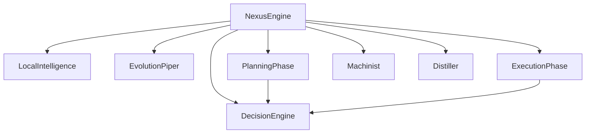
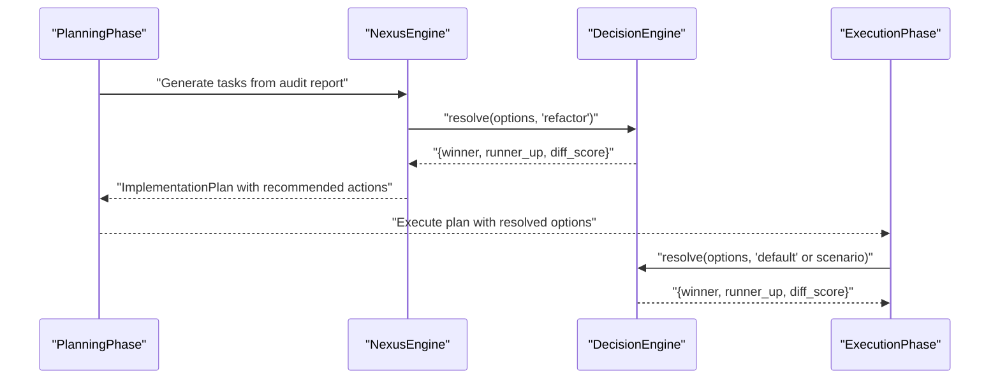
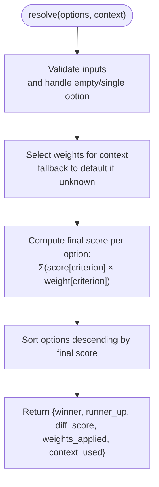
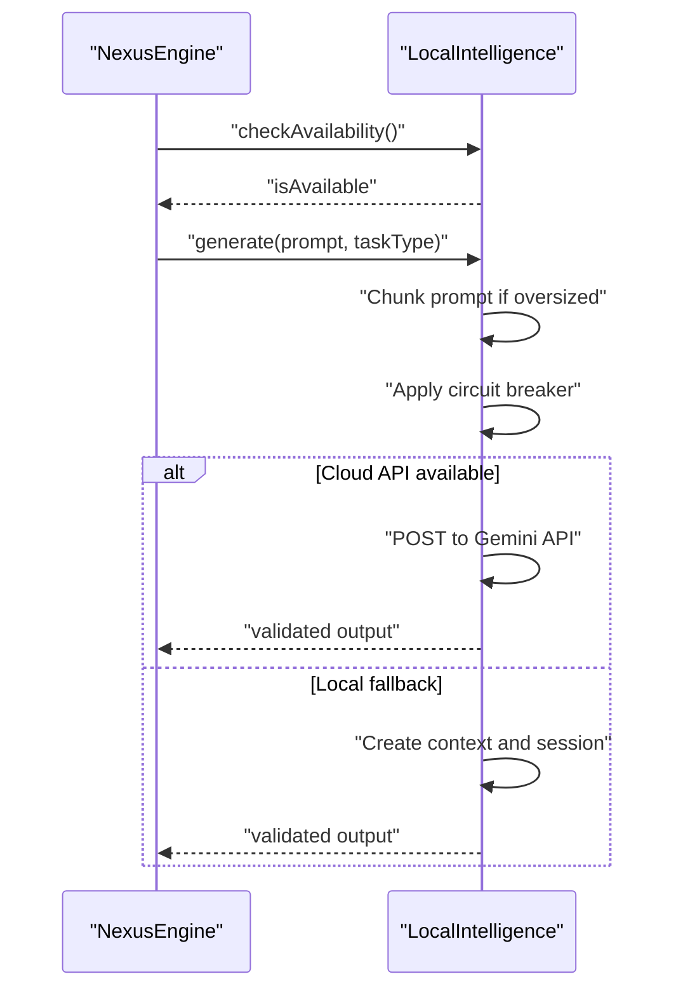
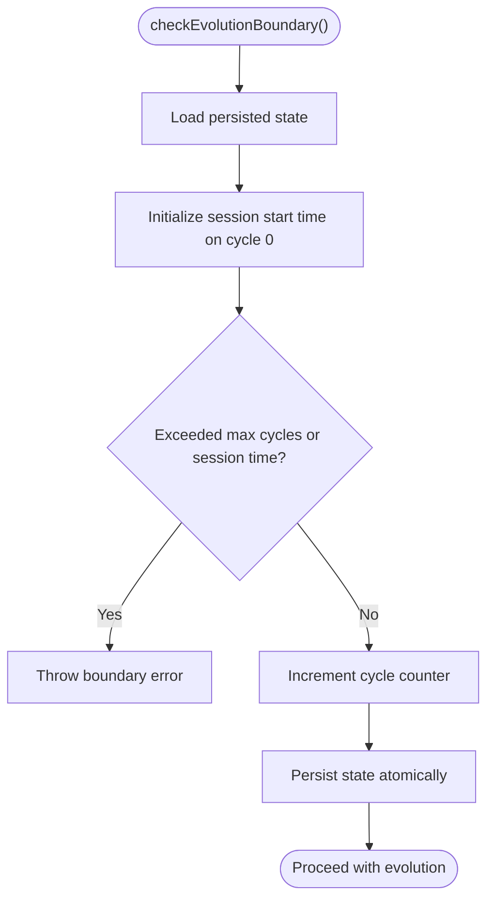
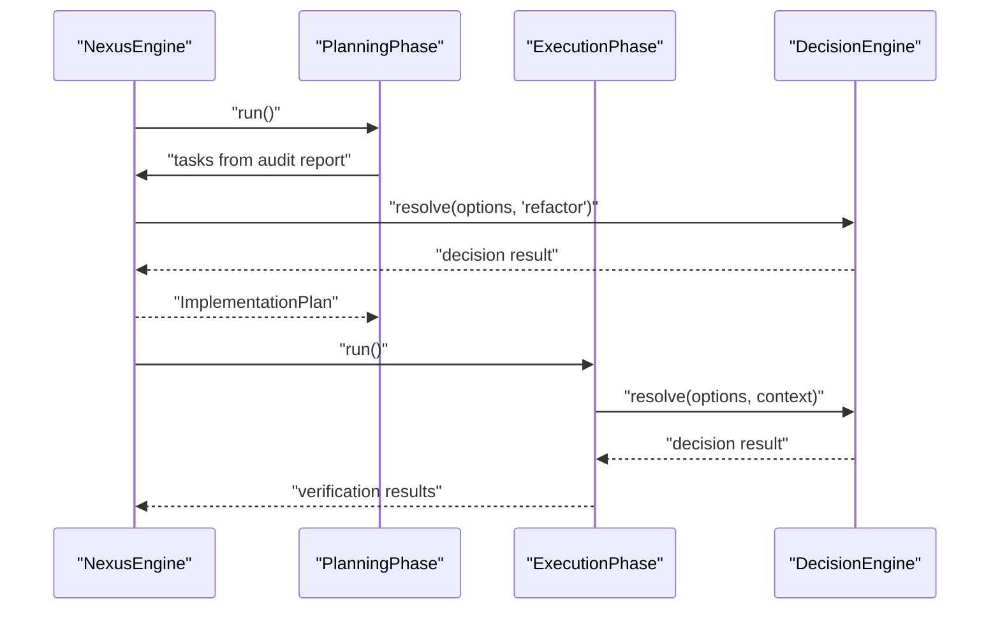
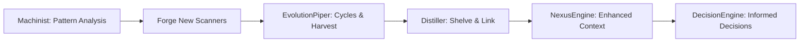
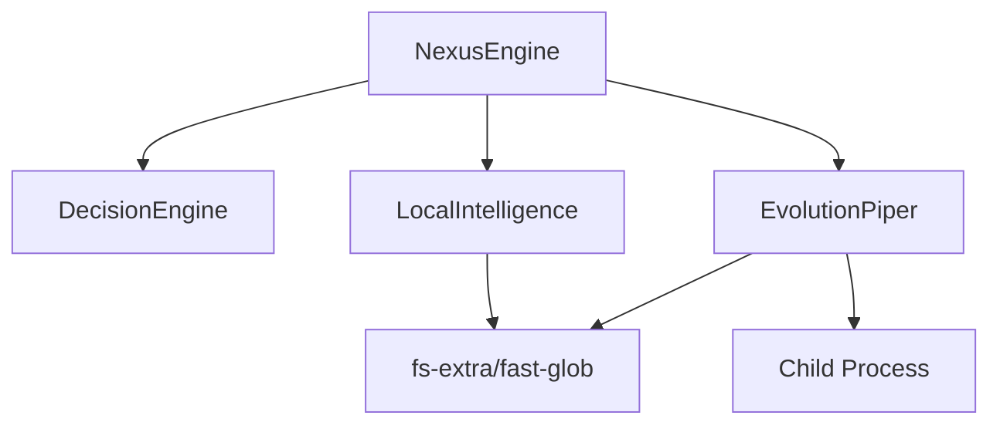

# Decision Engine

<cite>
**Referenced Files in This Document**
- [DecisionEngine.js](file://agent/core/DecisionEngine.js)
- [LocalIntelligence.js](file://agent/core/LocalIntelligence.js)
- [EvolutionPiper.js](file://agent/core/EvolutionPiper.js)
- [NexusEngine.js](file://agent/core/NexusEngine.js)
- [PlanningPhase.js](file://agent/core/phases/PlanningPhase.js)
- [ExecutionPhase.js](file://agent/core/phases/ExecutionPhase.js)
- [Machinist.js](file://agent/core/Machinist.js)
- [Distiller.js](file://agent/core/Distiller.js)
</cite>

## Table of Contents
1. [Introduction](#introduction)
2. [Project Structure](#project-structure)
3. [Core Components](#core-components)
4. [Architecture Overview](#architecture-overview)
5. [Detailed Component Analysis](#detailed-component-analysis)
6. [Dependency Analysis](#dependency-analysis)
7. [Performance Considerations](#performance-considerations)
8. [Troubleshooting Guide](#troubleshooting-guide)
9. [Conclusion](#conclusion)

## Introduction
The Decision Engine is the central arbiter within the NEXUS AI system that resolves conflicts among competing agent suggestions by applying weighted evaluation criteria. It operates contextually, selecting appropriate priority profiles for different domains (e.g., security, performance, readability) and produces a ranked outcome with a clear winner, runner-up, and margin of victory. The engine integrates tightly with LocalIntelligence for intelligent reasoning and with EvolutionPiper for adaptive learning loops, ensuring that decisions are grounded in both situational awareness and continuous evolution.

## Project Structure
The Decision Engine resides in the core orchestration layer alongside specialized components:
- DecisionEngine: Central decision-making module with context-aware weighting.
- LocalIntelligence: On-device and cloud inference provider with safety guards.
- EvolutionPiper: Recursive evolution cycle manager enforcing hard limits and persistence.
- NexusEngine: Orchestration hub that coordinates phases and invokes the Decision Engine.
- PlanningPhase and ExecutionPhase: Workflow stages where the Decision Engine compares alternatives.
- Machinist and Distiller: Systems that evolve capabilities and consolidate knowledge, feeding back into decision quality.

**Diagram sources**
- [NexusEngine.js:109-135](file://agent/core/NexusEngine.js#L109-L135)
- [DecisionEngine.js:18-70](file://agent/core/DecisionEngine.js#L18-L70)
- [LocalIntelligence.js:24-56](file://agent/core/LocalIntelligence.js#L24-L56)
- [EvolutionPiper.js:10-35](file://agent/core/EvolutionPiper.js#L10-L35)
- [PlanningPhase.js:8-73](file://agent/core/phases/PlanningPhase.js#L8-L73)
- [ExecutionPhase.js:9-106](file://agent/core/phases/ExecutionPhase.js#L9-L106)
- [Machinist.js:30-36](file://agent/core/Machinist.js#L30-L36)
- [Distiller.js:10-18](file://agent/core/Distiller.js#L10-L18)

**Section sources**
- [NexusEngine.js:109-135](file://agent/core/NexusEngine.js#L109-L135)
- [DecisionEngine.js:18-70](file://agent/core/DecisionEngine.js#L18-L70)

## Core Components
- DecisionEngine
  - Purpose: Resolve multi-agent suggestions using weighted criteria tailored to context.
  - Key features:
    - Context-aware weight profiles (security, stability, performance, readability).
    - Robust ranking and scoring with tie handling and margin calculation.
    - Fallback to default weights for unknown contexts.
  - Evaluation matrix: Each option contributes a partial score per criterion; final score is the dot product of scores and weights, then sorted descending.
  - Outputs: Winner, runner-up, difference margin, applied weights, and context used.

- LocalIntelligence
  - Purpose: Provide secure, bounded reasoning and generation with safety and resilience.
  - Key features:
    - Availability checks with TTL caching and circuit breaker.
    - Prompt chunking to prevent OOM and silent truncation.
    - Dual-path inference: cloud Gemini API or local node-llama-cpp.
    - Output validation and truncation guardrails.
  - Integration: Used by NexusEngine for blueprint generation and self-healing.

- EvolutionPiper
  - Purpose: Manage recursive evolution cycles with hard limits and persistence.
  - Key features:
    - Cycle counter and session time enforcement.
    - Atomic state persistence to disk.
    - Sandbox spawning and harvesting with documentation generation.
  - Integration: Drives autonomous learning and feeds distilled knowledge back into the system.

**Section sources**
- [DecisionEngine.js:18-70](file://agent/core/DecisionEngine.js#L18-L70)
- [LocalIntelligence.js:24-116](file://agent/core/LocalIntelligence.js#L24-L116)
- [EvolutionPiper.js:10-35](file://agent/core/EvolutionPiper.js#L10-L35)

## Architecture Overview
The Decision Engine participates in two primary decision-making scenarios:
- Planning-phase comparisons: When generating actionable plans, the engine evaluates candidate actions or refactors against a refactor-focused context.
- Execution-phase comparisons: During implementation, when multiple options exist for a single change (e.g., resolving collisions), the engine selects the best alternative.

**Diagram sources**
- [PlanningPhase.js:8-73](file://agent/core/phases/PlanningPhase.js#L8-L73)
- [NexusEngine.js:1066-1073](file://agent/core/NexusEngine.js#L1066-L1073)
- [ExecutionPhase.js:9-106](file://agent/core/phases/ExecutionPhase.js#L9-L106)
- [DecisionEngine.js:29-61](file://agent/core/DecisionEngine.js#L29-L61)

## Detailed Component Analysis

### DecisionEngine: Context-Aware Strategy Selection
- Role: Central decision arbiter for multi-agent suggestions.
- Weight profiles: Context determines which criteria are prioritized (e.g., security-heavy contexts increase security weight).
- Scoring:
  - For each option, compute a final score as the sum of (score for criterion × weight for criterion).
  - Rank options by final score descending.
  - Compute margin as the difference between top two scores.
- Edge cases:
  - Single option: return it as winner with null runner-up.
  - Unknown context: fallback to default weights and warn.
- Outputs include:
  - Winner and runner-up options.
  - Margin separating the top two.
  - Applied weights and context used.

**Diagram sources**
- [DecisionEngine.js:29-61](file://agent/core/DecisionEngine.js#L29-L61)

**Section sources**
- [DecisionEngine.js:18-70](file://agent/core/DecisionEngine.js#L18-L70)

### Integration with LocalIntelligence: Intelligent Reasoning and Safety
- Context: NexusEngine uses LocalIntelligence for blueprint generation and self-healing, ensuring reasoning is bounded and resilient.
- Safety measures:
  - Availability TTL cache to avoid frequent initialization.
  - Circuit breaker to fail fast under sustained failure.
  - Prompt chunking and output validation/truncation.
- Dual-path inference:
  - Cloud Gemini API with retry-on-rate-limit.
  - Local node-llama-cpp with context sizing tuned per task type.

**Diagram sources**
- [LocalIntelligence.js:58-116](file://agent/core/LocalIntelligence.js#L58-L116)
- [LocalIntelligence.js:118-223](file://agent/core/LocalIntelligence.js#L118-L223)
- [LocalIntelligence.js:226-352](file://agent/core/LocalIntelligence.js#L226-L352)

**Section sources**
- [LocalIntelligence.js:24-116](file://agent/core/LocalIntelligence.js#L24-L116)
- [LocalIntelligence.js:118-223](file://agent/core/LocalIntelligence.js#L118-L223)
- [LocalIntelligence.js:226-352](file://agent/core/LocalIntelligence.js#L226-L352)

### Integration with EvolutionPiper: Adaptive Learning and Persistence
- Role: Enforce hard limits on evolution cycles and session duration, persist state atomically, and manage sandbox lifecycle.
- Impact on decision-making:
  - Ensures decisions occur within bounded time and iteration budgets.
  - Sandboxes and harvested knowledge inform future contexts and weights.
- Persistence:
  - Atomic write of cycle state to avoid corruption on crashes.

**Diagram sources**
- [EvolutionPiper.js:41-77](file://agent/core/EvolutionPiper.js#L41-L77)
- [EvolutionPiper.js:79-112](file://agent/core/EvolutionPiper.js#L79-L112)

**Section sources**
- [EvolutionPiper.js:10-35](file://agent/core/EvolutionPiper.js#L10-L35)
- [EvolutionPiper.js:41-77](file://agent/core/EvolutionPiper.js#L41-L77)
- [EvolutionPiper.js:79-112](file://agent/core/EvolutionPiper.js#L79-L112)

### NexusEngine: Orchestration and Decision Invocation
- Responsibilities:
  - Coordinates phases and maintains system state.
  - Instantiates DecisionEngine and integrates it into decision points.
  - Uses DecisionEngine to compare alternatives in planning and execution phases.
- Decision invocation examples:
  - Planning: resolve(refactor-focused options) to select the best remediation path.
  - Execution: resolve(default or scenario-specific options) to choose the optimal implementation.

**Diagram sources**
- [NexusEngine.js:1066-1073](file://agent/core/NexusEngine.js#L1066-L1073)
- [PlanningPhase.js:8-73](file://agent/core/phases/PlanningPhase.js#L8-L73)
- [ExecutionPhase.js:9-106](file://agent/core/phases/ExecutionPhase.js#L9-L106)
- [DecisionEngine.js:29-61](file://agent/core/DecisionEngine.js#L29-L61)

**Section sources**
- [NexusEngine.js:109-135](file://agent/core/NexusEngine.js#L109-L135)
- [NexusEngine.js:1066-1073](file://agent/core/NexusEngine.js#L1066-L1073)

### Pattern Recognition and Evolutionary Adaptation
- Pattern recognition:
  - Machinist analyzes recurring audit findings to identify patterns and forge new scanners aligned with distilled knowledge.
- Evolutionary adaptation:
  - Distiller shelves, tags, links, and rebuilds vector indices from knowledge nodes, enabling semantic search and improved decision context.
  - EvolutionPiper’s cycles and sandbox harvesting continuously expand the knowledge base and refine decision weights.

**Diagram sources**
- [Machinist.js:105-114](file://agent/core/Machinist.js#L105-L114)
- [Machinist.js:163-204](file://agent/core/Machinist.js#L163-L204)
- [EvolutionPiper.js:132-207](file://agent/core/EvolutionPiper.js#L132-L207)
- [Distiller.js:261-299](file://agent/core/Distiller.js#L261-L299)
- [NexusEngine.js:109-135](file://agent/core/NexusEngine.js#L109-L135)
- [DecisionEngine.js:18-70](file://agent/core/DecisionEngine.js#L18-L70)

**Section sources**
- [Machinist.js:105-114](file://agent/core/Machinist.js#L105-L114)
- [Machinist.js:163-204](file://agent/core/Machinist.js#L163-L204)
- [EvolutionPiper.js:132-207](file://agent/core/EvolutionPiper.js#L132-L207)
- [Distiller.js:261-299](file://agent/core/Distiller.js#L261-L299)

## Dependency Analysis
- Cohesion and coupling:
  - DecisionEngine is cohesive around scoring and ranking; low coupling to external concerns.
  - NexusEngine composes DecisionEngine and delegates decision points to it.
  - LocalIntelligence is consumed by NexusEngine for reasoning tasks and by ExecutionPhase for self-healing.
  - EvolutionPiper provides bounded evolution cycles that indirectly influence decision quality by expanding knowledge.
- External dependencies:
  - node-llama-cpp and Gemini API for inference.
  - fs-extra and fast-glob for file operations.
  - Child process spawning for sandbox operations.

**Diagram sources**
- [DecisionEngine.js:18-70](file://agent/core/DecisionEngine.js#L18-L70)
- [NexusEngine.js:109-135](file://agent/core/NexusEngine.js#L109-L135)
- [LocalIntelligence.js:24-56](file://agent/core/LocalIntelligence.js#L24-L56)
- [EvolutionPiper.js:10-35](file://agent/core/EvolutionPiper.js#L10-L35)

**Section sources**
- [DecisionEngine.js:18-70](file://agent/core/DecisionEngine.js#L18-L70)
- [NexusEngine.js:109-135](file://agent/core/NexusEngine.js#L109-L135)
- [LocalIntelligence.js:24-56](file://agent/core/LocalIntelligence.js#L24-L56)
- [EvolutionPiper.js:10-35](file://agent/core/EvolutionPiper.js#L10-L35)

## Performance Considerations
- DecisionEngine:
  - Scoring is linear in number of options and criteria; suitable for small to moderate option sets typical in agent comparisons.
  - Sorting cost is O(n log n); acceptable for typical use cases.
- LocalIntelligence:
  - Availability TTL reduces repeated initialization overhead.
  - Prompt chunking prevents OOM and improves throughput for large inputs.
  - Circuit breaker avoids cascading failures under sustained errors.
- EvolutionPiper:
  - Atomic state persistence prevents corruption and supports reliable restarts.
  - Hard limits on cycles and session time bound resource usage.

## Troubleshooting Guide
- DecisionEngine warnings:
  - Unknown context falls back to default weights and logs a warning; verify context usage.
- LocalIntelligence:
  - Circuit breaker OPEN triggers fail-fast behavior; inspect availability and error logs.
  - Prompt chunking indicates oversized inputs; consider splitting tasks or reducing scope.
  - Cloud API rate limits trigger retries with exponential backoff; monitor quotas.
- EvolutionPiper:
  - Exceeding max cycles or session time throws explicit boundary errors; reset counters after distillation or adjust limits.
  - Atomic persistence failures indicate filesystem issues; ensure write permissions and disk availability.

**Section sources**
- [DecisionEngine.js:35-40](file://agent/core/DecisionEngine.js#L35-L40)
- [LocalIntelligence.js:159-171](file://agent/core/LocalIntelligence.js#L159-L171)
- [LocalIntelligence.js:256-294](file://agent/core/LocalIntelligence.js#L256-L294)
- [EvolutionPiper.js:51-69](file://agent/core/EvolutionPiper.js#L51-L69)
- [EvolutionPiper.js:98-112](file://agent/core/EvolutionPiper.js#L98-L112)

## Conclusion
The Decision Engine is the strategic backbone of NEXUS AI, transforming multi-agent suggestions into authoritative choices through context-aware weighting and robust evaluation. Its integration with LocalIntelligence ensures decisions are grounded in safe, bounded reasoning, while EvolutionPiper’s cycles and Distiller’s knowledge management continuously improve decision quality. Together, these components sustain system autonomy, operational effectiveness, and adaptive evolution across diverse scenarios.