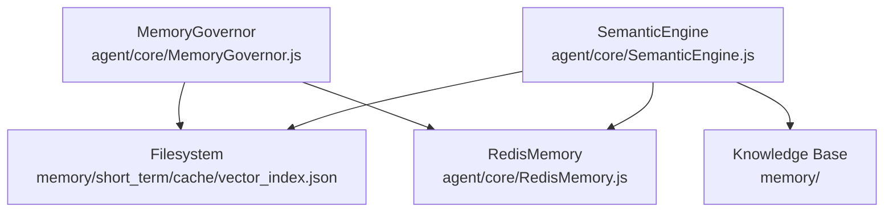
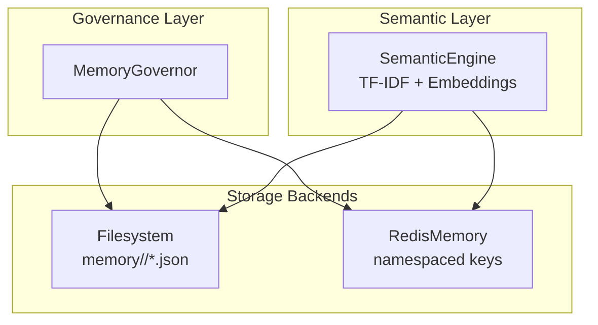
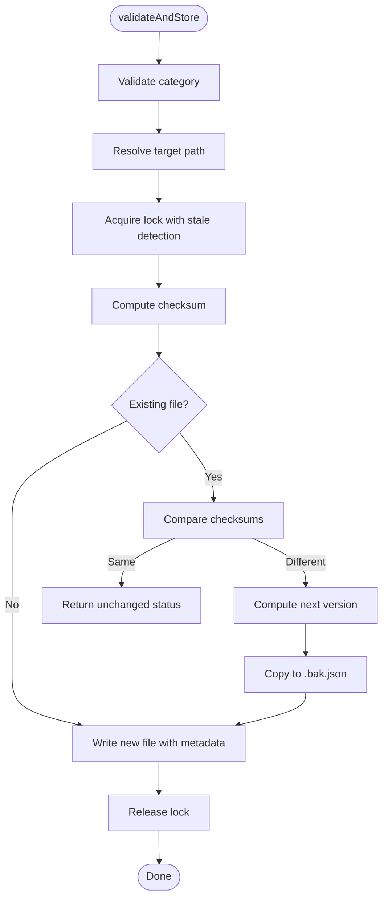
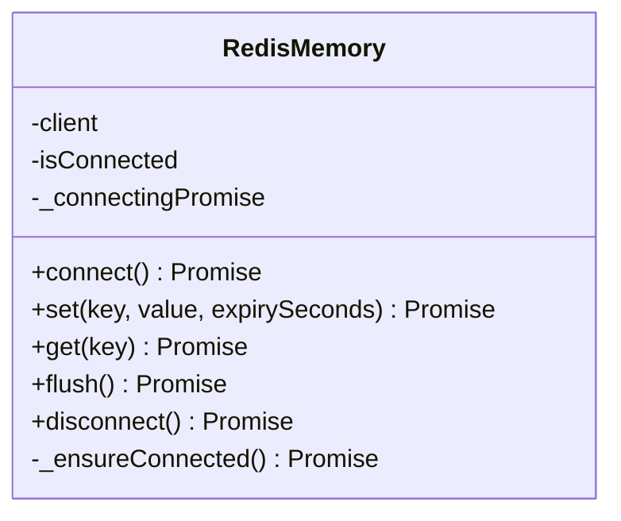
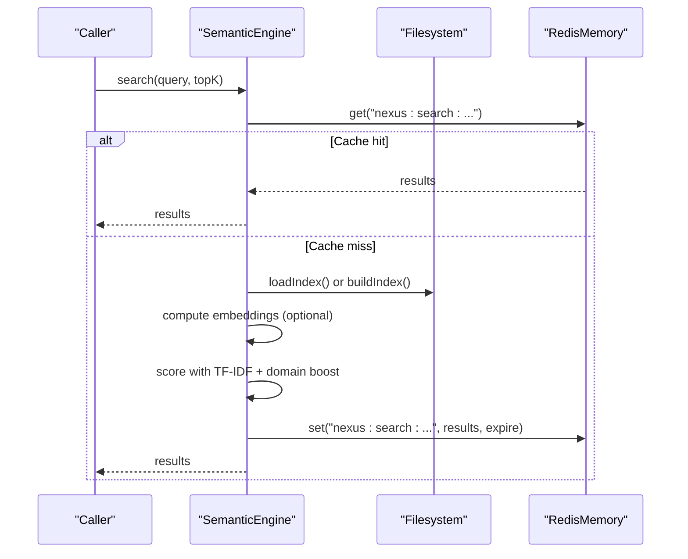
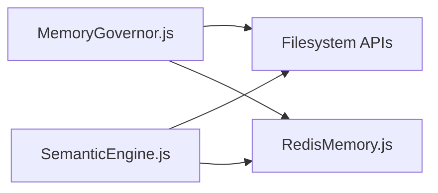

# Memory Governor

<cite>
**Referenced Files in This Document**
- [MemoryGovernor.js](file://agent/core/MemoryGovernor.js)
- [RedisMemory.js](file://agent/core/RedisMemory.js)
- [SemanticEngine.js](file://agent/core/SemanticEngine.js)
- [memory-manager.md](file://agent/prompts/internal/memory-manager.md)
- [memory-context-manager.md](file://agent/prompts/internal/memory-context-manager.md)
</cite>

## Table of Contents
1. [Introduction](#introduction)
2. [Project Structure](#project-structure)
3. [Core Components](#core-components)
4. [Architecture Overview](#architecture-overview)
5. [Detailed Component Analysis](#detailed-component-analysis)
6. [Dependency Analysis](#dependency-analysis)
7. [Performance Considerations](#performance-considerations)
8. [Troubleshooting Guide](#troubleshooting-guide)
9. [Conclusion](#conclusion)

## Introduction
This document explains the Memory Governor system that coordinates intelligent memory management across the NEXUS AI platform. It covers how the governor manages multiple memory layers (short-term, operational, and semantic), integrates with RedisMemory for persistent storage, and leverages vector indexing for semantic search. It also documents memory allocation strategies, retention policies, access patterns, optimization techniques, caching mechanisms, data serialization, and operational procedures for handling memory constraints and overflow.

## Project Structure
The Memory Governor resides in the agent core and interacts with Redis-backed memory and the Semantic Engine for vector search. The governance layer ensures safe, versioned persistence of knowledge artifacts across categories such as raw, normalized, semantic, distilled, operational, archived, and short_term.

**Diagram sources**
- [MemoryGovernor.js:1-136](file://agent/core/MemoryGovernor.js#L1-L136)
- [RedisMemory.js:1-105](file://agent/core/RedisMemory.js#L1-L105)
- [SemanticEngine.js:1-597](file://agent/core/SemanticEngine.js#L1-L597)

**Section sources**
- [MemoryGovernor.js:1-136](file://agent/core/MemoryGovernor.js#L1-L136)
- [RedisMemory.js:1-105](file://agent/core/RedisMemory.js#L1-L105)
- [SemanticEngine.js:1-597](file://agent/core/SemanticEngine.js#L1-L597)

## Core Components
- MemoryGovernor: Ensures memory directories, provides file locking with stale detection, validates content uniqueness via checksums, and writes versioned JSON artifacts with metadata.
- RedisMemory: Provides namespaced in-memory key-value storage with lazy connection, automatic JSON serialization, and targeted flush operations.
- SemanticEngine: Builds and caches vector indices, performs hybrid semantic search with TF-IDF and embeddings, and caches query results in Redis.

**Section sources**
- [MemoryGovernor.js:6-136](file://agent/core/MemoryGovernor.js#L6-L136)
- [RedisMemory.js:10-105](file://agent/core/RedisMemory.js#L10-L105)
- [SemanticEngine.js:10-597](file://agent/core/SemanticEngine.js#L10-L597)

## Architecture Overview
The Memory Governor orchestrates three primary memory layers:
- Short-term: transient, fast-access contexts and caches (e.g., vector index cache).
- Operational: structured runtime artifacts and indexes.
- Semantic: knowledge graph and embeddings for retrieval.

It integrates with RedisMemory for persistent caching and semantic search results, and with filesystem-based storage for durable artifacts and vector index caching.

**Diagram sources**
- [MemoryGovernor.js:13-136](file://agent/core/MemoryGovernor.js#L13-L136)
- [RedisMemory.js:10-105](file://agent/core/RedisMemory.js#L10-L105)
- [SemanticEngine.js:164-368](file://agent/core/SemanticEngine.js#L164-L368)

## Detailed Component Analysis

### MemoryGovernor
Responsibilities:
- Directory initialization for memory categories.
- File locking with stale lock detection and exponential backoff to prevent deadlocks.
- Content validation via checksum to avoid redundant writes.
- Versioning and archival backup on updates.
- Metadata injection including timestamps and checksums.

Key behaviors:
- Lock acquisition and release ensure concurrent-safe persistence.
- On update, a backup copy is created before writing the new version.
- Unchanged content returns early with status metadata.

**Diagram sources**
- [MemoryGovernor.js:86-132](file://agent/core/MemoryGovernor.js#L86-L132)

**Section sources**
- [MemoryGovernor.js:13-136](file://agent/core/MemoryGovernor.js#L13-L136)

### RedisMemory
Responsibilities:
- Lazy connection pattern to avoid manual connect calls.
- Namespaced keys to prevent conflicts with other applications.
- JSON serialization for values.
- Targeted flush that deletes only NEXUS-prefixed keys.

Operational highlights:
- Auto-connect on get/set/flush/disconnect.
- Robust error handling and graceful fallback behavior.
- Prefix-based cleanup to maintain isolation.

**Diagram sources**
- [RedisMemory.js:10-105](file://agent/core/RedisMemory.js#L10-L105)

**Section sources**
- [RedisMemory.js:10-105](file://agent/core/RedisMemory.js#L10-L105)

### SemanticEngine
Responsibilities:
- Build vector index from knowledge files using TF-IDF and optional embeddings.
- Cache vector index to short_term cache for reuse.
- Hybrid semantic search combining vector similarity and TF-IDF scoring.
- Domain vocabulary boosting and Redis caching of search results.

Key mechanisms:
- Index building with Ollama embedding warmup and retries.
- Cosine similarity with zero-norm guards.
- Multi-label tag extraction and scoring.
- Cache invalidation and Redis flush on distillation events.

**Diagram sources**
- [SemanticEngine.js:298-368](file://agent/core/SemanticEngine.js#L298-L368)
- [RedisMemory.js:49-71](file://agent/core/RedisMemory.js#L49-L71)

**Section sources**
- [SemanticEngine.js:164-368](file://agent/core/SemanticEngine.js#L164-L368)

### Memory Layers and Categories
- raw: unprocessed inputs and logs.
- normalized: cleaned and standardized content.
- semantic: tagged and indexed knowledge for retrieval.
- distilled: curated insights and decisions.
- operational: runtime artifacts and indexes.
- archived: historical backups with version suffixes.
- short_term: ephemeral contexts and caches.

Access patterns:
- Short-term cache persists vector index and transient contexts.
- Operational stores structured indexes and session artifacts.
- Semantic layer supports retrieval via TF-IDF and embeddings.
- Archival backups ensure recoverability without overwriting.

Retention policies:
- No auto-delete policy enforced by governance roles.
- Version increments on content change; backups preserved.
- Cache TTLs applied for search results and embeddings.

**Section sources**
- [MemoryGovernor.js:13-18](file://agent/core/MemoryGovernor.js#L13-L18)
- [memory-manager.md:22-25](file://agent/prompts/internal/memory-manager.md#L22-L25)

### Memory Allocation Strategies
- Directory-based allocation per memory category.
- File-level locking to serialize writes and prevent corruption.
- Checksum-based deduplication to minimize storage overhead.
- Versioned backups to enable rollback and audit trails.

**Section sources**
- [MemoryGovernor.js:13-136](file://agent/core/MemoryGovernor.js#L13-L136)

### Access Patterns and Serialization
- Governance writes JSON with metadata and checksums.
- RedisMemory serializes objects to JSON strings; numeric values remain as-is.
- SemanticEngine caches vector index and search results with TTLs.

**Section sources**
- [MemoryGovernor.js:95-127](file://agent/core/MemoryGovernor.js#L95-L127)
- [RedisMemory.js:49-71](file://agent/core/RedisMemory.js#L49-L71)
- [SemanticEngine.js:246-263](file://agent/core/SemanticEngine.js#L246-L263)

### Query Optimization and Performance Tuning
- Hybrid search: vector similarity with TF-IDF fallback and domain boost.
- Redis caching for frequent queries with 30-minute TTL.
- Ollama warmup and retry with exponential backoff to mitigate contention.
- Index cache freshness checks to avoid rebuilding unnecessarily.

**Section sources**
- [SemanticEngine.js:298-368](file://agent/core/SemanticEngine.js#L298-L368)
- [SemanticEngine.js:375-414](file://agent/core/SemanticEngine.js#L375-L414)
- [SemanticEngine.js:420-475](file://agent/core/SemanticEngine.js#L420-L475)
- [SemanticEngine.js:268-290](file://agent/core/SemanticEngine.js#L268-L290)

### Memory Constraints, Overflow Handling, and Cleanup
- Stale lock detection and force-release to prevent deadlocks.
- No automatic deletion; governance roles enforce manual approvals for cleanup.
- Targeted Redis flush using NEXUS prefix to avoid affecting other apps.
- Vector index cache invalidation triggers rebuild on next search.

**Section sources**
- [MemoryGovernor.js:31-84](file://agent/core/MemoryGovernor.js#L31-L84)
- [memory-manager.md:22-25](file://agent/prompts/internal/memory-manager.md#L22-L25)
- [RedisMemory.js:74-88](file://agent/core/RedisMemory.js#L74-L88)
- [SemanticEngine.js:575-593](file://agent/core/SemanticEngine.js#L575-L593)

## Dependency Analysis
- MemoryGovernor depends on filesystem utilities for directory creation, file locking, checksum computation, and JSON serialization.
- SemanticEngine depends on RedisMemory for caching and on filesystem for index persistence and knowledge base scanning.
- RedisMemory encapsulates Redis client lifecycle and provides namespaced keys.

**Diagram sources**
- [MemoryGovernor.js:1-136](file://agent/core/MemoryGovernor.js#L1-L136)
- [RedisMemory.js:1-105](file://agent/core/RedisMemory.js#L1-L105)
- [SemanticEngine.js:1-597](file://agent/core/SemanticEngine.js#L1-L597)

**Section sources**
- [MemoryGovernor.js:1-136](file://agent/core/MemoryGovernor.js#L1-L136)
- [RedisMemory.js:1-105](file://agent/core/RedisMemory.js#L1-L105)
- [SemanticEngine.js:1-597](file://agent/core/SemanticEngine.js#L1-L597)

## Performance Considerations
- Prefer checksum-based deduplication to reduce IO and storage usage.
- Use Redis caching for hot queries to minimize repeated computation.
- Warm embeddings and throttle batch requests to avoid Ollama contention.
- Keep vector index cache fresh but avoid unnecessary rebuilds by checking cache age.
- Apply TTLs to transient caches to bound memory growth.

## Troubleshooting Guide
Common issues and resolutions:
- Lock timeout or stale locks: Investigate long-running processes and ensure proper lock release; stale locks are auto-detected and removed.
- Redis connectivity failures: Verify Redis availability; the system falls back to file-based persistence gracefully.
- Ollama embedding errors: Check warmup attempts and retry delays; adjust text length for token limits; monitor failure thresholds.
- Cache misses: Confirm index cache validity and rebuild if expired; invalidate cache after distillation.

**Section sources**
- [MemoryGovernor.js:31-84](file://agent/core/MemoryGovernor.js#L31-L84)
- [RedisMemory.js:16-21](file://agent/core/RedisMemory.js#L16-L21)
- [SemanticEngine.js:375-414](file://agent/core/SemanticEngine.js#L375-L414)
- [SemanticEngine.js:420-475](file://agent/core/SemanticEngine.js#L420-L475)
- [SemanticEngine.js:575-593](file://agent/core/SemanticEngine.js#L575-L593)

## Conclusion
The Memory Governor system provides robust, deterministic coordination across NEXUS AI’s memory layers. By combining filesystem-based persistence with Redis-backed caching, it ensures efficient retrieval, reliable concurrency, and maintainable knowledge artifacts. The SemanticEngine augments retrieval with vector search and domain-aware scoring, while governance policies and cleanup procedures preserve system integrity under memory constraints.