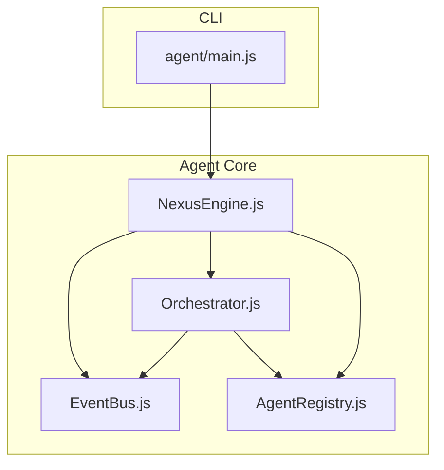
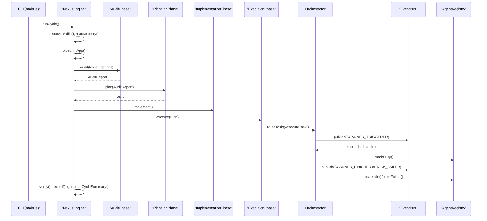
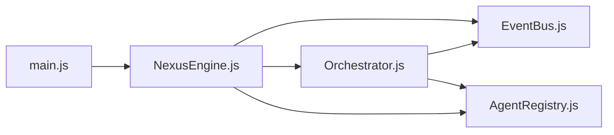

# Nexus Engine

<cite>
**Referenced Files in This Document**
- [NexusEngine.js](file://agent/core/NexusEngine.js)
- [main.js](file://agent/main.js)
- [EventBus.js](file://agent/core/EventBus.js)
- [Orchestrator.js](file://agent/core/Orchestrator.js)
- [AgentRegistry.js](file://agent/core/AgentRegistry.js)
- [nexus-engine.test.js](file://tests/TDD/nexus-engine.test.js)
- [setup_dynamic_section.js](file://tests/TDD/setup_dynamic_section.js)
- [Orchestrator.test.js](file://tests/TDD/Orchestrator.test.js)
</cite>

## Table of Contents
1. [Introduction](#introduction)
2. [Project Structure](#project-structure)
3. [Core Components](#core-components)
4. [Architecture Overview](#architecture-overview)
5. [Detailed Component Analysis](#detailed-component-analysis)
6. [Dependency Analysis](#dependency-analysis)
7. [Performance Considerations](#performance-considerations)
8. [Troubleshooting Guide](#troubleshooting-guide)
9. [Conclusion](#conclusion)
10. [Appendices](#appendices)

## Introduction
The Nexus Engine is the central orchestrator of the NEXUS AI system. It coordinates agent interactions, manages modular workflow phases, and maintains system-wide stability. It initializes subsystems, discovers skills and agents, executes orchestrated cycles, and integrates tightly with the event-driven infrastructure. The engine exposes both a CLI entry point and programmatic APIs for automation and integration.

## Project Structure
The Nexus Engine resides under agent/core and is complemented by CLI entry point, event bus, orchestrator, and agent registry modules. The CLI (agent/main.js) constructs a single NexusEngine instance and routes commands to its methods.

**Diagram sources**
- [NexusEngine.js:60-137](file://agent/core/NexusEngine.js#L60-L137)
- [main.js:19-35](file://agent/main.js#L19-L35)
- [EventBus.js:17-99](file://agent/core/EventBus.js#L17-L99)
- [Orchestrator.js:15-33](file://agent/core/Orchestrator.js#L15-L33)
- [AgentRegistry.js:6-28](file://agent/core/AgentRegistry.js#L6-L28)

**Section sources**
- [NexusEngine.js:60-137](file://agent/core/NexusEngine.js#L60-L137)
- [main.js:19-35](file://agent/main.js#L19-L35)

## Core Components
- NexusEngine: Central orchestrator that composes subsystems, defines lifecycle states, and exposes modular methods for audit, planning, implementation, execution, verification, and knowledge distillation.
- EventBus: Strictly schema-validated event bus enforcing payload contracts and deduplication.
- Orchestrator: Routes tasks to agents via sandbox execution, tracks retries and failures, and persists a dead letter queue.
- AgentRegistry: Tracks agent health, status, and stuck tasks to maintain system observability.

Key capabilities:
- Modular lifecycle with timeouts and failure handling
- Skill and agent discovery with metadata extraction
- Knowledge harvesting and semantic search
- Lazy initialization of heavy components
- Robust logging and error recording

**Section sources**
- [NexusEngine.js:48-55](file://agent/core/NexusEngine.js#L48-L55)
- [NexusEngine.js:348-395](file://agent/core/NexusEngine.js#L348-L395)
- [EventBus.js:5-15](file://agent/core/EventBus.js#L5-L15)
- [Orchestrator.js:15-33](file://agent/core/Orchestrator.js#L15-L33)
- [AgentRegistry.js:6-28](file://agent/core/AgentRegistry.js#L6-L28)

## Architecture Overview
The Nexus Engine orchestrates a four-phase pipeline: Audit → Plan → Implement → Execute → Verify → Record → Summarize. It leverages the event bus for decoupled agent interactions, the orchestrator for task routing and sandbox execution, and the agent registry for health monitoring.

**Diagram sources**
- [main.js:57-121](file://agent/main.js#L57-L121)
- [NexusEngine.js:348-395](file://agent/core/NexusEngine.js#L348-L395)
- [NexusEngine.js:310-344](file://agent/core/NexusEngine.js#L310-L344)
- [Orchestrator.js:58-136](file://agent/core/Orchestrator.js#L58-L136)
- [EventBus.js:31-71](file://agent/core/EventBus.js#L31-L71)
- [AgentRegistry.js:35-73](file://agent/core/AgentRegistry.js#L35-L73)

## Detailed Component Analysis

### NexusEngine
Responsibilities:
- Lifecycle management: INIT, PROCESSING, EXECUTING, LOGGING, COMPLETED, FAILED
- Modular phases: Audit, Planning, Implementation, Execution, Knowledge
- Discovery: skills and agents with metadata extraction and semantic tagging
- Knowledge: semantic search, harvesting, distillation, and consolidation
- Resource-awareness: lazy initialization of expensive components, Redis connectivity, local AI availability
- Logging and error handling: structured logs, correlation IDs, error recording

Initialization highlights:
- Resolves project and data paths, sets up internal and external prompt/workflow directories
- Composes subsystems: memory pipeline, TDD tools, decision engine, parallel runner, semantic engine, sandbox executor
- Initializes specialized phases and connects to Redis and local AI

Core methods:
- runCycle(options): orchestrates a full cycle with a global 90-minute timeout
- audit(), plan(), implement(), execute(), verify(), cleanCodeAndVerify(): modular phase runners
- harvest(), distill(), updateStatus(): knowledge lifecycle operations
- blueprintApp(): generates and caches project architecture blueprint
- record(), generateCycleSummary(): session and summary persistence
- logError(): centralized error logging

Agent lifecycle management:
- loadAgent(): resolves and loads agent prompt content
- wrapAsConditional(): consolidates or resolves knowledge collisions
- calculateSimilarity(): semantic similarity scoring

Discovery and metadata:
- discoverSkills(), discoverAgents(): scans directories and external sources
- _extractSkillMeta(), _extractAgentTags(): metadata extraction from files and content
- _scanAllSkillSources(): aggregates skills from workflows, external, and distilled sources
- _findAllAgentFiles(): recursive discovery of agent prompt files

Lazy components:
- designer, a11yScanner, queryOptimizer, worktreeManager, evolutionPiper, native: created on first access

**Section sources**
- [NexusEngine.js:48-55](file://agent/core/NexusEngine.js#L48-L55)
- [NexusEngine.js:60-137](file://agent/core/NexusEngine.js#L60-L137)
- [NexusEngine.js:310-344](file://agent/core/NexusEngine.js#L310-L344)
- [NexusEngine.js:348-395](file://agent/core/NexusEngine.js#L348-L395)
- [NexusEngine.js:397-490](file://agent/core/NexusEngine.js#L397-L490)
- [NexusEngine.js:492-505](file://agent/core/NexusEngine.js#L492-L505)
- [NexusEngine.js:507-515](file://agent/core/NexusEngine.js#L507-L515)
- [NexusEngine.js:524-563](file://agent/core/NexusEngine.js#L524-L563)
- [NexusEngine.js:565-636](file://agent/core/NexusEngine.js#L565-L636)
- [NexusEngine.js:638-719](file://agent/core/NexusEngine.js#L638-L719)
- [NexusEngine.js:725-794](file://agent/core/NexusEngine.js#L725-L794)
- [NexusEngine.js:800-821](file://agent/core/NexusEngine.js#L800-L821)
- [NexusEngine.js:823-989](file://agent/core/NexusEngine.js#L823-L989)
- [NexusEngine.js:991-1107](file://agent/core/NexusEngine.js#L991-L1107)
- [NexusEngine.js:1109-1115](file://agent/core/NexusEngine.js#L1109-L1115)

### CLI Entry Point (main.js)
Role:
- Parses CLI arguments and routes commands to NexusEngine
- Provides interactive and automated modes for orchestration
- Supports commands: run, audit, skills, agents, harvest, refactor, update-skills, distill, forge, status, sandbox, dlq, think, review, help

Key flows:
- run: executes the full cycle with optional approval loops and user feedback
- sandbox: spawns a sandbox runner script with platform-specific handling
- dlq: displays dead letter queue contents
- think/review: queries local AI for advice and code review

**Section sources**
- [main.js:19-302](file://agent/main.js#L19-L302)

### EventBus
Role:
- Enforces strict event schema and validates required payload fields
- Deduplicates events using a composite key and a short time window
- Maintains an audit log of published events

**Section sources**
- [EventBus.js:5-15](file://agent/core/EventBus.js#L5-L15)
- [EventBus.js:31-71](file://agent/core/EventBus.js#L31-L71)

### Orchestrator
Role:
- Routes tasks to agents via sandbox execution with timeout guards
- Manages retries, success, and failure transitions
- Persists a dead letter queue for permanently failed tasks
- Integrates with AgentRegistry to track agent status

**Section sources**
- [Orchestrator.js:15-33](file://agent/core/Orchestrator.js#L15-L33)
- [Orchestrator.js:58-136](file://agent/core/Orchestrator.js#L58-L136)
- [Orchestrator.js:167-207](file://agent/core/Orchestrator.js#L167-L207)
- [Orchestrator.js:218-235](file://agent/core/Orchestrator.js#L218-L235)

### AgentRegistry
Role:
- Tracks agent health: idle/busy/failed, task counts, error counts, last activity
- Detects stuck agents based on a configurable threshold
- Provides a health report for system status

**Section sources**
- [AgentRegistry.js:6-28](file://agent/core/AgentRegistry.js#L6-L28)
- [AgentRegistry.js:75-104](file://agent/core/AgentRegistry.js#L75-L104)

## Dependency Analysis
The Nexus Engine composes multiple subsystems and delegates task execution to the orchestrator. The orchestrator depends on the event bus and agent registry. The CLI depends on the engine.

**Diagram sources**
- [main.js:19-35](file://agent/main.js#L19-L35)
- [NexusEngine.js:60-137](file://agent/core/NexusEngine.js#L60-L137)
- [EventBus.js:17-99](file://agent/core/EventBus.js#L17-L99)
- [Orchestrator.js:15-33](file://agent/core/Orchestrator.js#L15-L33)
- [AgentRegistry.js:6-28](file://agent/core/AgentRegistry.js#L6-L28)

**Section sources**
- [main.js:19-35](file://agent/main.js#L19-L35)
- [NexusEngine.js:60-137](file://agent/core/NexusEngine.js#L60-L137)
- [EventBus.js:17-99](file://agent/core/EventBus.js#L17-L99)
- [Orchestrator.js:15-33](file://agent/core/Orchestrator.js#L15-L33)
- [AgentRegistry.js:6-28](file://agent/core/AgentRegistry.js#L6-L28)

## Performance Considerations
- Global cycle timeout: enforced at 90 minutes to prevent indefinite hangs
- Resource-aware scheduling: tests demonstrate pre-execution stress checks and optional throttling/pauses
- Lazy initialization: expensive components are created on first access to reduce startup overhead
- Event deduplication: reduces redundant processing and network chatter
- Sandboxed execution: isolates agent tasks and limits I/O overhead

Practical tips:
- Monitor system stress before running large batches
- Use the status command to inspect CPU/RAM and agent health
- Prefer incremental runs (audit, plan, implement, execute) for faster feedback loops

**Section sources**
- [NexusEngine.js:348-358](file://agent/core/NexusEngine.js#L348-L358)
- [setup_dynamic_section.js:62-83](file://tests/TDD/setup_dynamic_section.js#L62-L83)
- [NexusEngine.js:139-145](file://agent/core/NexusEngine.js#L139-L145)
- [EventBus.js:53-61](file://agent/core/EventBus.js#L53-L61)
- [Orchestrator.js:167-207](file://agent/core/Orchestrator.js#L167-L207)

## Troubleshooting Guide
Common issues and strategies:
- Redis connectivity: engine attempts to connect and falls back to file-only mode if unavailable
- Local AI availability: engine checks availability and disables AI features if not present
- Task timeouts: Orchestrator enforces per-task timeouts and publishes failure events
- Dead letter queue: permanently failed tasks are persisted for later inspection
- Stuck agents: AgentRegistry detects agents busy beyond a threshold and reports them
- Knowledge collisions: wrapAsConditional consolidates or resolves conflicting knowledge

Debugging steps:
- Use the dlq command to inspect failed tasks
- Run status to check system stress and agent health
- Enable verbose CLI modes for detailed logs
- Review error logs generated during cycles

**Section sources**
- [NexusEngine.js:147-162](file://agent/core/NexusEngine.js#L147-L162)
- [Orchestrator.js:35-44](file://agent/core/Orchestrator.js#L35-L44)
- [Orchestrator.js:167-207](file://agent/core/Orchestrator.js#L167-L207)
- [Orchestrator.js:110-131](file://agent/core/Orchestrator.js#L110-L131)
- [AgentRegistry.js:75-86](file://agent/core/AgentRegistry.js#L75-L86)
- [NexusEngine.js:524-563](file://agent/core/NexusEngine.js#L524-L563)

## Conclusion
The Nexus Engine is the backbone of the NEXUS AI system, providing robust orchestration, modular phases, and resilient task execution. Its integration with the event bus, orchestrator, and agent registry ensures scalable, observable, and fault-tolerant operations. The CLI offers flexible automation and interactive workflows, while built-in safeguards protect against resource exhaustion and long-running failures.

## Appendices

### Practical Examples
- Full cycle execution: run the CLI with run to execute Audit → Plan → Implement → Execute → Verify → Record → Summarize
- Interactive approval: approve or iterate planning based on developer feedback
- Knowledge distillation: distill and standardize the knowledge hub with setRack and distill
- Sandbox testing: run sandbox master runner for autonomous project testing
- Diagnostics: use status and dlq to monitor system health and failed tasks

**Section sources**
- [main.js:57-121](file://agent/main.js#L57-L121)
- [main.js:160-165](file://agent/main.js#L160-L165)
- [main.js:181-219](file://agent/main.js#L181-L219)
- [main.js:220-244](file://agent/main.js#L220-L244)
- [main.js:177-179](file://agent/main.js#L177-L179)

### Configuration Options
- CLI flags: --mode, --root, --target, --yes, --rack, --section, --distill
- Engine options: rootPath passed to constructor influences data and prompt/workflow discovery
- Runtime settings: cycle timeout, task timeouts, and retry policies are embedded in orchestrator and engine

**Section sources**
- [main.js:22-29](file://agent/main.js#L22-L29)
- [NexusEngine.js:61-68](file://agent/core/NexusEngine.js#L61-L68)
- [Orchestrator.js:167](file://agent/core/Orchestrator.js#L167)

### Related Tests and Validation
- wrapAsConditional test verifies consolidation and collision resolution behavior
- Orchestrator lifecycle and task routing tests validate event handling and sandbox execution
- Resource stress checks demonstrate pre-execution safeguards

**Section sources**
- [nexus-engine.test.js:6-26](file://tests/TDD/nexus-engine.test.js#L6-L26)
- [Orchestrator.test.js:9-65](file://tests/TDD/Orchestrator.test.js#L9-L65)
- [setup_dynamic_section.js:62-83](file://tests/TDD/setup_dynamic_section.js#L62-L83)