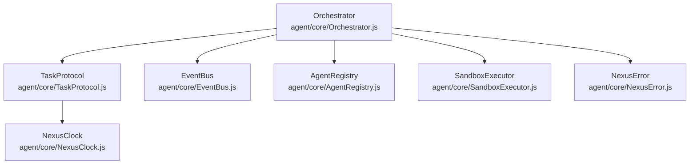
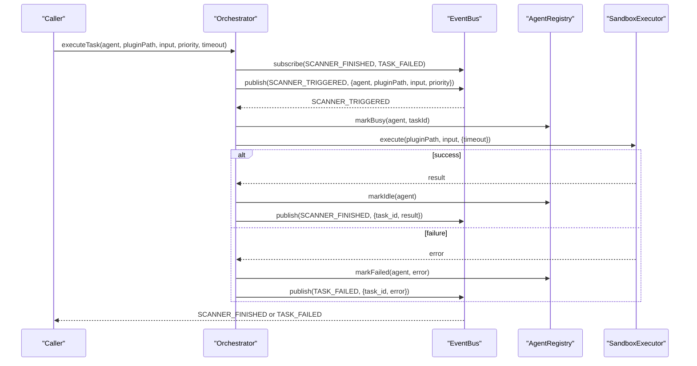
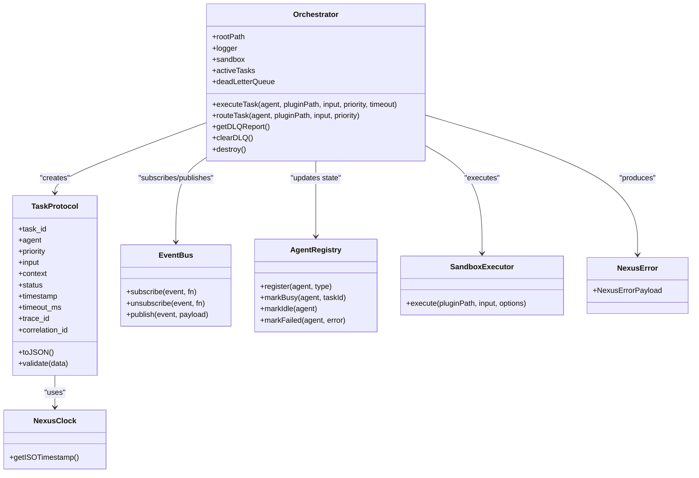
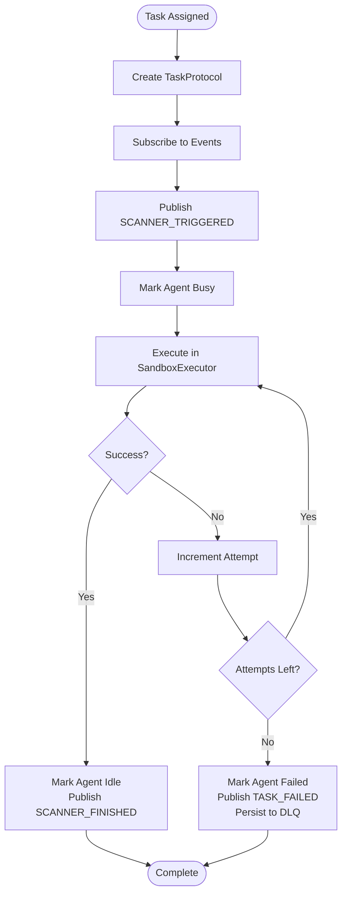

# Orchestrator

<cite>
**Referenced Files in This Document**
- [Orchestrator.js](file://agent/core/Orchestrator.js)
- [TaskProtocol.js](file://agent/core/TaskProtocol.js)
- [EventBus.js](file://agent/core/EventBus.js)
- [AgentRegistry.js](file://agent/core/AgentRegistry.js)
- [SandboxExecutor.js](file://agent/core/SandboxExecutor.js)
- [NexusClock.js](file://agent/core/NexusClock.js)
- [NexusError.js](file://agent/core/NexusError.js)
- [execution-workflow.md](file://agent/workflows/internal/execution-workflow.md)
- [planning-workflow.md](file://agent/workflows/internal/planning-workflow.md)
- [orchestration-coordinator.md](file://agent/prompts/internal/orchestration-coordinator.md)
</cite>

## Table of Contents
1. [Introduction](#introduction)
2. [Project Structure](#project-structure)
3. [Core Components](#core-components)
4. [Architecture Overview](#architecture-overview)
5. [Detailed Component Analysis](#detailed-component-analysis)
6. [Dependency Analysis](#dependency-analysis)
7. [Performance Considerations](#performance-considerations)
8. [Troubleshooting Guide](#troubleshooting-guide)
9. [Conclusion](#conclusion)
10. [Appendices](#appendices)

## Introduction
This document explains the Orchestrator system that coordinates workflow execution and task management across the NEXUS AI platform. It focuses on how the Orchestrator manages complex workflows, schedules tasks, routes work to agents, and maintains reliability through error recovery and monitoring. It also documents the TaskProtocol for standardized task representation, integration with internal workflows, and operational mechanisms such as task routing, priority management, and resource allocation.

## Project Structure
The Orchestrator resides in the agent core module and integrates with supporting subsystems:
- Event-driven coordination via EventBus
- Agent lifecycle and availability via AgentRegistry
- Task metadata and validation via TaskProtocol
- Execution isolation and sandboxing via SandboxExecutor
- Timestamping via NexusClock
- Error modeling via NexusError

**Diagram sources**
- [Orchestrator.js:15-33](file://agent/core/Orchestrator.js#L15-L33)
- [TaskProtocol.js:3-15](file://agent/core/TaskProtocol.js#L3-L15)
- [EventBus.js](file://agent/core/EventBus.js)
- [AgentRegistry.js](file://agent/core/AgentRegistry.js)
- [SandboxExecutor.js](file://agent/core/SandboxExecutor.js)
- [NexusClock.js](file://agent/core/NexusClock.js)
- [NexusError.js](file://agent/core/NexusError.js)

**Section sources**
- [Orchestrator.js:15-33](file://agent/core/Orchestrator.js#L15-L33)
- [TaskProtocol.js:3-15](file://agent/core/TaskProtocol.js#L3-L15)

## Core Components
- Orchestrator: Central coordinator that publishes and consumes orchestration events, manages active tasks, tracks agent availability, retries failed executions, and persists permanent failures to a Dead Letter Queue (DLQ).
- TaskProtocol: Standardized task model with validation rules for priority, status, and required fields.
- EventBus: Publish/subscribe mechanism enabling decoupled orchestration flows.
- AgentRegistry: Tracks agent availability and assigns tasks to busy/idle agents.
- SandboxExecutor: Executes agent plugins in an isolated environment with timeout support.
- NexusClock: Provides ISO timestamps for task traceability.
- NexusError: Error payload model for failure reporting and retry decisions.

**Section sources**
- [Orchestrator.js:15-33](file://agent/core/Orchestrator.js#L15-L33)
- [TaskProtocol.js:17-35](file://agent/core/TaskProtocol.js#L17-L35)
- [EventBus.js](file://agent/core/EventBus.js)
- [AgentRegistry.js](file://agent/core/AgentRegistry.js)
- [SandboxExecutor.js](file://agent/core/SandboxExecutor.js)
- [NexusClock.js](file://agent/core/NexusClock.js)
- [NexusError.js](file://agent/core/NexusError.js)

## Architecture Overview
The Orchestrator implements an event-driven architecture:
- External triggers publish SCANNER_TRIGGERED events with task metadata.
- Orchestrator creates TaskProtocol instances, marks agents busy, and invokes SandboxExecutor.
- Successful completions emit SCANNER_FINISHED; failures emit TASK_FAILED.
- Permanent failures are recorded in DLQ for later analysis.

**Diagram sources**
- [Orchestrator.js:58-136](file://agent/core/Orchestrator.js#L58-L136)
- [Orchestrator.js:167-207](file://agent/core/Orchestrator.js#L167-L207)
- [AgentRegistry.js](file://agent/core/AgentRegistry.js)
- [SandboxExecutor.js](file://agent/core/SandboxExecutor.js)

## Detailed Component Analysis

### Orchestrator
Responsibilities:
- Initialize DLQ persistence and event handlers.
- Manage active tasks with timeouts and retries.
- Coordinate agent assignment and lifecycle transitions.
- Emit orchestration lifecycle events and maintain logs.

Key behaviors:
- DLQ initialization and persistence with atomic writes and concurrency guards.
- Event subscriptions with cleanup on destroy to prevent memory leaks.
- Retry loop with bounded attempts and NexusErrorPayload generation on final failure.
- Timeout-based rejection for pending tasks to avoid hanging promises.

Operational highlights:
- Task routing via executeTask and routeTask.
- DLQ reporting and clearing utilities.
- Logging integration for orchestration and error events.

**Section sources**
- [Orchestrator.js:35-44](file://agent/core/Orchestrator.js#L35-L44)
- [Orchestrator.js:47-56](file://agent/core/Orchestrator.js#L47-L56)
- [Orchestrator.js:58-136](file://agent/core/Orchestrator.js#L58-L136)
- [Orchestrator.js:141-161](file://agent/core/Orchestrator.js#L141-L161)
- [Orchestrator.js:167-207](file://agent/core/Orchestrator.js#L167-L207)
- [Orchestrator.js:209-216](file://agent/core/Orchestrator.js#L209-L216)
- [Orchestrator.js:218-235](file://agent/core/Orchestrator.js#L218-L235)

### TaskProtocol
Purpose:
- Define a canonical task structure for inter-agent communication.
- Enforce validation rules for priority and status values.
- Provide serialization and tracing identifiers.

Validation rules:
- Required fields include task_id, agent, priority, status, and timestamp.
- Priority must be one of low, normal, high, critical.
- Status must be one of pending, running, done, failed.

Traceability:
- Generates unique trace_id and correlates tasks via correlation_id.

**Section sources**
- [TaskProtocol.js:17-35](file://agent/core/TaskProtocol.js#L17-L35)
- [TaskProtocol.js:37-50](file://agent/core/TaskProtocol.js#L37-L50)

### Integration with Internal Workflows
The Orchestrator participates in broader workflow execution:
- Execution workflow defines the runtime flow for task execution and completion.
- Planning workflow outlines higher-level planning phases that may trigger orchestration.
- Orchestration coordinator prompt describes the role and responsibilities of the orchestrator in multi-agent systems.

These documents contextualize the Orchestrator’s place in the NEXUS AI pipeline and guide how it collaborates with planning and execution phases.

**Section sources**
- [execution-workflow.md](file://agent/workflows/internal/execution-workflow.md)
- [planning-workflow.md](file://agent/workflows/internal/planning-workflow.md)
- [orchestration-coordinator.md](file://agent/prompts/internal/orchestration-coordinator.md)

### Task Routing and Priority Management
Routing:
- executeTask publishes SCANNER_TRIGGERED with a generated taskId and subscribes to SCANNER_FINISHED/TASK_FAILED to resolve the promise.
- routeTask publishes SCANNER_TRIGGERED without resolving a promise, enabling fire-and-forget routing.

Priority:
- Priority is passed through TaskProtocol and used during agent assignment to reflect urgency.

Timeout:
- executeTask enforces a configurable timeout to prevent indefinite waits.

**Section sources**
- [Orchestrator.js:167-207](file://agent/core/Orchestrator.js#L167-L207)
- [Orchestrator.js:209-216](file://agent/core/Orchestrator.js#L209-L216)
- [TaskProtocol.js:4-15](file://agent/core/TaskProtocol.js#L4-L15)

### Resource Allocation and Agent Collaboration
Resource allocation:
- AgentRegistry tracks agent availability and transitions agents between busy, idle, and failed states.
- The Orchestrator ensures agents are marked busy upon task assignment and idle upon successful completion, or failed upon final exhaustion.

Collaboration:
- Inter-agent collaboration is mediated by the event bus, allowing multiple agents to participate in workflows without tight coupling.

**Section sources**
- [Orchestrator.js:60-108](file://agent/core/Orchestrator.js#L60-L108)
- [AgentRegistry.js](file://agent/core/AgentRegistry.js)

### Workflow Definition, Execution Monitoring, and Error Recovery
Workflow definition:
- Workflows define the sequence of phases and transitions; the Orchestrator executes tasks within these workflows by routing them to appropriate agents.

Execution monitoring:
- Logs capture orchestration lifecycle events and task outcomes.
- DLQ captures permanent failures for post-mortem analysis.

Error recovery:
- Retry loop with bounded attempts and NexusErrorPayload for transient vs. permanent failures.
- DLQ prevents loss of permanently failed tasks and supports remediation workflows.

**Section sources**
- [Orchestrator.js:78-107](file://agent/core/Orchestrator.js#L78-L107)
- [Orchestrator.js:111-131](file://agent/core/Orchestrator.js#L111-L131)
- [NexusError.js](file://agent/core/NexusError.js)

### Examples

#### Example: Workflow Execution
- A planning phase produces a set of tasks.
- The Orchestrator receives SCANNER_TRIGGERED events and assigns tasks to agents via AgentRegistry.
- Successful completions emit SCANNER_FINISHED; failures emit TASK_FAILED and are persisted to DLQ.

**Section sources**
- [Orchestrator.js:58-136](file://agent/core/Orchestrator.js#L58-L136)

#### Example: Task Delegation
- routeTask publishes SCANNER_TRIGGERED with agent, pluginPath, input, and priority, enabling asynchronous delegation without waiting for completion.

**Section sources**
- [Orchestrator.js:209-216](file://agent/core/Orchestrator.js#L209-L216)

#### Example: Progress Tracking
- Active tasks are tracked in-memory via activeTasks map.
- Logs record task assignment, completion, and failure events for visibility.

**Section sources**
- [Orchestrator.js:20](file://agent/core/Orchestrator.js#L20)
- [Orchestrator.js:71](file://agent/core/Orchestrator.js#L71)
- [Orchestrator.js:89](file://agent/core/Orchestrator.js#L89)
- [Orchestrator.js:103](file://agent/core/Orchestrator.js#L103)

### Validation, Dependency Resolution, and Parallel Processing
Validation:
- TaskProtocol.validate enforces required fields, valid priorities, and valid statuses.

Dependency resolution:
- The Orchestrator does not enforce task dependencies internally; workflows define dependencies externally, and the Orchestrator executes tasks as events arrive.

Parallel processing:
- Multiple tasks can be routed concurrently; each task is isolated by taskId and handled independently with its own timeout and retry logic.

**Section sources**
- [TaskProtocol.js:17-35](file://agent/core/TaskProtocol.js#L17-L35)
- [Orchestrator.js:167-207](file://agent/core/Orchestrator.js#L167-L207)

## Dependency Analysis
The Orchestrator depends on several core modules. The following diagram shows these relationships:

**Diagram sources**
- [Orchestrator.js:15-33](file://agent/core/Orchestrator.js#L15-L33)
- [TaskProtocol.js:3-15](file://agent/core/TaskProtocol.js#L3-L15)
- [EventBus.js](file://agent/core/EventBus.js)
- [AgentRegistry.js](file://agent/core/AgentRegistry.js)
- [SandboxExecutor.js](file://agent/core/SandboxExecutor.js)
- [NexusClock.js](file://agent/core/NexusClock.js)
- [NexusError.js](file://agent/core/NexusError.js)

**Section sources**
- [Orchestrator.js:15-33](file://agent/core/Orchestrator.js#L15-L33)
- [TaskProtocol.js:3-15](file://agent/core/TaskProtocol.js#L3-L15)

## Performance Considerations
- Timeouts: executeTask enforces per-task timeouts to prevent hanging promises and resource starvation.
- Retries: Bounded retry loop reduces transient failure impact while preventing infinite loops.
- Isolation: SandboxExecutor encapsulates execution to minimize cross-task interference.
- DLQ persistence: Atomic writes and concurrency guards protect DLQ integrity under load.
- Memory hygiene: Event subscriptions are tracked and cleaned up on destroy to prevent leaks.

[No sources needed since this section provides general guidance]

## Troubleshooting Guide
Common issues and remedies:
- Task timeouts: Verify timeoutMs and agent responsiveness; check logs for SCANNER_TRIGGERED and TASK_FAILED events.
- Frequent retries: Inspect agent health via AgentRegistry and review NexusErrorPayload details.
- DLQ growth: Investigate root causes using getDLQReport and clearDLQ to reset state.
- Hanging listeners: Ensure destroy is called to unsubscribe all handlers.

**Section sources**
- [Orchestrator.js:172-176](file://agent/core/Orchestrator.js#L172-L176)
- [Orchestrator.js:111-131](file://agent/core/Orchestrator.js#L111-L131)
- [Orchestrator.js:218-235](file://agent/core/Orchestrator.js#L218-L235)
- [Orchestrator.js:52-56](file://agent/core/Orchestrator.js#L52-L56)

## Conclusion
The Orchestrator provides a robust, event-driven foundation for coordinating NEXUS AI workflows. It standardizes task representation via TaskProtocol, manages agent resources through AgentRegistry, isolates execution via SandboxExecutor, and ensures reliability through retries, timeouts, and DLQ persistence. By integrating with internal workflows and leveraging the event bus, it enables scalable, observable, and resilient task execution across distributed agent networks.

[No sources needed since this section summarizes without analyzing specific files]

## Appendices

### Appendix A: Task Lifecycle Flow

**Diagram sources**
- [Orchestrator.js:60-136](file://agent/core/Orchestrator.js#L60-L136)
- [TaskProtocol.js:4-15](file://agent/core/TaskProtocol.js#L4-L15)