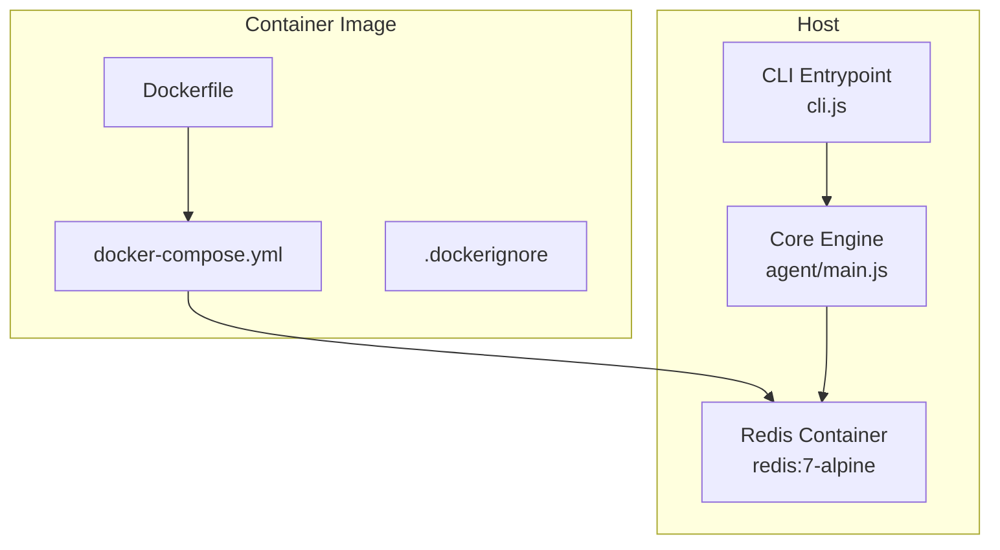
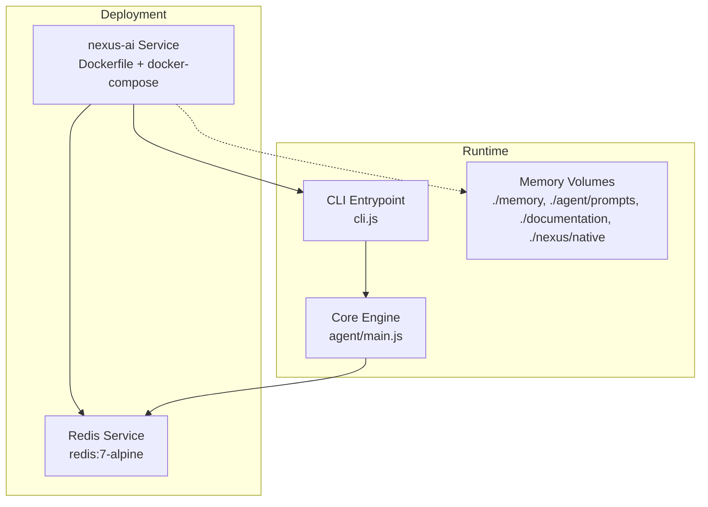
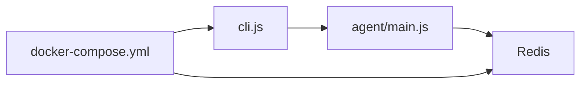

# Deployment and Operations

<cite>
**Referenced Files in This Document**
- [Dockerfile](file://Dockerfile)
- [docker-compose.yml](file://docker-compose.yml)
- [.dockerignore](file://.dockerignore)
- [package.json](file://package.json)
- [README.md](file://README.md)
- [cli.js](file://cli.js)
- [agent/main.js](file://agent/main.js)
- [install.ps1](file://install.ps1)
- [uninstall.ps1](file://uninstall.ps1)
- [nexus-sandbox.ps1](file://nexus-sandbox.ps1)
- [nexus-sandbox.sh](file://nexus-sandbox.sh)
- [.gitignore](file://.gitignore)
</cite>

## Table of Contents
1. [Introduction](#introduction)
2. [Project Structure](#project-structure)
3. [Core Components](#core-components)
4. [Architecture Overview](#architecture-overview)
5. [Detailed Component Analysis](#detailed-component-analysis)
6. [Dependency Analysis](#dependency-analysis)
7. [Performance Considerations](#performance-considerations)
8. [Troubleshooting Guide](#troubleshooting-guide)
9. [Conclusion](#conclusion)
10. [Appendices](#appendices)

## Introduction
This document provides comprehensive deployment and operations guidance for NEXUS AI. It covers containerized deployment with Docker and docker-compose, Windows and Linux deployment procedures, environment setup, system requirements, installation and uninstallation scripts, sandbox environment configuration, production deployment strategies, scaling considerations, monitoring approaches, maintenance procedures, troubleshooting, performance optimization, and operational best practices.

## Project Structure
NEXUS AI is delivered as a Node/Bun-based CLI tool with optional containerization. The repository includes:
- A Dockerfile for building a minimal container image
- A docker-compose.yml for orchestrating the application and Redis
- Scripts for Windows and Linux to run the sandbox pipeline
- Installation and uninstallation scripts for Windows
- A CLI entrypoint that delegates to the core engine

**Diagram sources**
- [Dockerfile:1-36](file://Dockerfile#L1-L36)
- [docker-compose.yml:1-41](file://docker-compose.yml#L1-L41)
- [cli.js:10-39](file://cli.js#L10-L39)
- [agent/main.js:34](file://agent/main.js#L34)

**Section sources**
- [Dockerfile:1-36](file://Dockerfile#L1-L36)
- [docker-compose.yml:1-41](file://docker-compose.yml#L1-L41)
- [README.md:146-219](file://README.md#L146-L219)

## Core Components
- CLI Entrypoint: Delegates commands to the core engine and supports engine-level commands such as run, audit, status, sandbox, and uninstall.
- Core Engine: Orchestrates the full lifecycle (Audit → Plan → Execute → Verify → Record), exposes observability commands (status, dlq), and manages sandbox execution.
- Containerization: Single service image with Redis dependency, mounted volumes for persistent memory and documentation, and health checks.

Key deployment artifacts:
- Dockerfile defines the base image, working directory, environment variables, and entrypoint.
- docker-compose.yml builds the app image, starts Redis, mounts volumes, sets environment variables, and configures health checks.
- .dockerignore excludes unnecessary files from the image build context.

**Section sources**
- [cli.js:14-39](file://cli.js#L14-L39)
- [agent/main.js:36-121](file://agent/main.js#L36-L121)
- [Dockerfile:4-31](file://Dockerfile#L4-L31)
- [docker-compose.yml:11-33](file://docker-compose.yml#L11-L33)
- [.dockerignore:1-14](file://.dockerignore#L1-L14)

## Architecture Overview
The deployment architecture centers on a single autonomous agent container orchestrated alongside a Redis container. The CLI delegates to the core engine, which coordinates specialized agents and interacts with Redis for memory and coordination.

**Diagram sources**
- [docker-compose.yml:11-33](file://docker-compose.yml#L11-L33)
- [Dockerfile:10-23](file://Dockerfile#L10-L23)
- [agent/main.js:34](file://agent/main.js#L34)

## Detailed Component Analysis

### Containerized Deployment with Docker
- Base image and environment: Alpine-based Node runtime, timezone configured, and standard environment variables set for autonomous mode and timezone.
- Working directory and permissions: Application directory created and CLI script made executable.
- Build steps: Dependency installation with a clean install, project files copied, and default entrypoint configured.
- Health checks: A lightweight health check validates the CLI entrypoint.

Operational notes:
- The container expects a Redis endpoint via an environment variable.
- Persistent volumes are mounted for memory, prompts, documentation, and native assets.

**Section sources**
- [Dockerfile:4-31](file://Dockerfile#L4-L31)
- [docker-compose.yml:11-33](file://docker-compose.yml#L11-L33)
- [docker-compose.yml:26-30](file://docker-compose.yml#L26-L30)

### docker-compose Orchestration
- Services:
  - redis: Uses redis:7-alpine with a named volume for persistence.
  - nexus-ai: Builds from the current directory, sets environment variables, mounts volumes, and defines health checks.
- Networks and volumes: A dedicated bridge network and a named Redis volume are declared.

Scaling and networking:
- The service depends on Redis and exposes health checks suitable for orchestration platforms.

**Section sources**
- [docker-compose.yml:1-41](file://docker-compose.yml#L1-L41)

### Windows Deployment Procedures
- Installer script:
  - Downloads and extracts the repository content.
  - Creates and secures the nexus directory with memory, logs, documentation, and external brain components.
  - Adds .gitignore entries and .htaccess protection.
  - Provides a summary of available commands and NPX usage.
- Uninstaller script:
  - Safely removes engine components while preserving documentation.
  - Confirms actions and proceeds with deletion.
- Sandbox runner:
  - Validates prerequisites (Bun, PHP, optional native orchestrator).
  - Executes TDD sections sequentially, optionally skipping distillation.
  - Produces a timestamped log file and summarizes outcomes.

**Section sources**
- [install.ps1:16-203](file://install.ps1#L16-L203)
- [uninstall.ps1:8-32](file://uninstall.ps1#L8-L32)
- [nexus-sandbox.ps1:55-96](file://nexus-sandbox.ps1#L55-L96)
- [nexus-sandbox.ps1:101-173](file://nexus-sandbox.ps1#L101-L173)
- [nexus-sandbox.ps1:175-197](file://nexus-sandbox.ps1#L175-L197)

### Linux Deployment Procedures
- Sandbox runner:
  - Parses arguments to run specific sections or skip distillation.
  - Checks for Bun and PHP presence and validates the TALL template path.
  - Executes TDD scripts and writes logs to a timestamped file.
  - Summarizes total elapsed time and failed sections.

**Section sources**
- [nexus-sandbox.sh:26-50](file://nexus-sandbox.sh#L26-L50)
- [nexus-sandbox.sh:72-96](file://nexus-sandbox.sh#L72-L96)
- [nexus-sandbox.sh:100-135](file://nexus-sandbox.sh#L100-L135)
- [nexus-sandbox.sh:137-145](file://nexus-sandbox.sh#L137-L145)
- [nexus-sandbox.sh:147-169](file://nexus-sandbox.sh#L147-L169)

### Environment Setup and System Requirements
- Node.js and Bun:
  - The CLI uses Bun as the runtime for invoking the engine.
  - The package.json defines Node engine requirements and scripts.
- Redis:
  - The compose file sets REDIS_URL and depends on the redis service.
- Timezone:
  - Both Dockerfile and engine-related components reference UTC+8.

**Section sources**
- [package.json:28-34](file://package.json#L28-L34)
- [package.json:54-56](file://package.json#L54-L56)
- [Dockerfile:6-8](file://Dockerfile#L6-L8)
- [docker-compose.yml:16-18](file://docker-compose.yml#L16-L18)

### Installation and Uninstallation Scripts
- Windows installer:
  - Creates nexus base structure, memory, logs, documentation, and external brain.
  - Applies security hardening and prints usage guidance.
- Windows uninstaller:
  - Safely deletes engine components while preserving documentation.
- CLI uninstall:
  - Supports interactive and non-interactive modes with optional target directory.

**Section sources**
- [install.ps1:164-301](file://install.ps1#L164-L301)
- [uninstall.ps1:8-32](file://uninstall.ps1#L8-L32)
- [cli.js:99-147](file://cli.js#L99-L147)

### Sandbox Environment Configuration
- Windows:
  - Validates Bun, PHP, and native orchestrator availability.
  - Runs predefined TDD sections and optionally distills knowledge.
- Linux:
  - Similar validation and execution with argument parsing and logging.

**Section sources**
- [nexus-sandbox.ps1:55-96](file://nexus-sandbox.ps1#L55-L96)
- [nexus-sandbox.ps1:101-173](file://nexus-sandbox.ps1#L101-L173)
- [nexus-sandbox.sh:72-96](file://nexus-sandbox.sh#L72-L96)
- [nexus-sandbox.sh:100-135](file://nexus-sandbox.sh#L100-L135)

### Production Deployment Strategies
- Image and build:
  - Use the provided Dockerfile to build a minimal image.
  - Leverage .dockerignore to reduce build context size.
- Orchestration:
  - docker-compose is provided for local and small-scale deployments.
  - For larger environments, adopt platform-native orchestration with the same service contract.
- Persistence:
  - Mount volumes for memory and documentation to preserve state across restarts.
- Health checks:
  - Utilize the built-in health check to integrate with platform health management.

**Section sources**
- [Dockerfile:19-23](file://Dockerfile#L19-L23)
- [.dockerignore:1-14](file://.dockerignore#L1-L14)
- [docker-compose.yml:26-30](file://docker-compose.yml#L26-L30)

### Scaling Considerations
- Horizontal scaling:
  - The autonomous agent is designed to operate as a single service in this deployment model.
  - Redis is used for coordination; scale Redis independently if needed.
- Resource planning:
  - Monitor CPU and memory via the status command and adjust container resource limits accordingly.

**Section sources**
- [agent/main.js:177-179](file://agent/main.js#L177-L179)

### Monitoring Approaches
- System status:
  - Use the status command to obtain real-time CPU, RAM, agent, and evolution metrics.
- Dead letter queue:
  - Use the dlq command to inspect permanently failed tasks.
- Logs:
  - Sandbox runners produce timestamped logs for diagnostics.

**Section sources**
- [agent/main.js:177-179](file://agent/main.js#L177-L179)
- [agent/main.js:220-243](file://agent/main.js#L220-L243)
- [nexus-sandbox.ps1:23-30](file://nexus-sandbox.ps1#L23-L30)
- [nexus-sandbox.sh:55-62](file://nexus-sandbox.sh#L55-L62)

### Maintenance Procedures
- Knowledge pipeline:
  - Use distill, harvest, refactor, and update-skills to maintain the HUB.
- Skill discovery:
  - Use skills and agents to enumerate capabilities.
- Periodic updates:
  - Use the update command to synchronize external brain components.

**Section sources**
- [agent/main.js:126-133](file://agent/main.js#L126-L133)
- [agent/main.js:134-141](file://agent/main.js#L134-L141)
- [agent/main.js:160-165](file://agent/main.js#L160-L165)
- [cli.js:70-97](file://cli.js#L70-L97)

## Dependency Analysis
The deployment relies on:
- Node/Bun runtime for CLI invocation
- Redis for coordination and memory
- Mounted volumes for persistent state

**Diagram sources**
- [cli.js:14-39](file://cli.js#L14-L39)
- [agent/main.js:34](file://agent/main.js#L34)
- [docker-compose.yml:11-33](file://docker-compose.yml#L11-L33)

**Section sources**
- [cli.js:14-39](file://cli.js#L14-L39)
- [agent/main.js:34](file://agent/main.js#L34)
- [docker-compose.yml:11-33](file://docker-compose.yml#L11-L33)

## Performance Considerations
- Use Bun as the runtime for improved performance.
- Minimize build context by leveraging .dockerignore.
- Persist memory and documentation to avoid repeated initialization overhead.
- Monitor resource usage with the status command and tune container limits.

[No sources needed since this section provides general guidance]

## Troubleshooting Guide
Common deployment issues and resolutions:
- Bun not found:
  - Ensure Bun is installed and available on PATH before running sandbox scripts.
- PHP not found:
  - PHP is optional for sandbox operations; the runner will continue without it.
- Native orchestrator not compiled:
  - The runner falls back to Node.js if the native binary is unavailable.
- Sandbox runner not found:
  - Confirm the presence of the sandbox master runner under tests/TDD.
- Health check failures:
  - Validate the CLI entrypoint and environment variables.

**Section sources**
- [nexus-sandbox.ps1:58-64](file://nexus-sandbox.ps1#L58-L64)
- [nexus-sandbox.ps1:66-71](file://nexus-sandbox.ps1#L66-L71)
- [nexus-sandbox.ps1:81-86](file://nexus-sandbox.ps1#L81-L86)
- [nexus-sandbox.ps1:188-193](file://nexus-sandbox.ps1#L188-L193)
- [docker-compose.yml:26-30](file://docker-compose.yml#L26-L30)

## Conclusion
NEXUS AI provides a streamlined containerized deployment model with a robust CLI and sandbox automation. The provided Dockerfile, docker-compose, and platform-specific scripts enable repeatable installations, safe uninstallation, and reliable sandbox execution. Adopt the recommended monitoring, maintenance, and scaling practices to operate in production environments effectively.

[No sources needed since this section summarizes without analyzing specific files]

## Appendices

### Appendix A: Command Reference
- Run full cycle: nexus run
- Audit only: nexus audit
- System status: nexus status
- Dead letter queue: nexus dlq
- Sandbox execution: nexus sandbox
- Harvest knowledge: nexus harvest <dir>
- Distill knowledge: nexus distill
- Update skills: nexus update-skills
- Forge scanner: nexus forge <name> <file>
- Think locally: nexus think <query>
- Review code: nexus review <file>
- Help: nexus help

**Section sources**
- [README.md:169-203](file://README.md#L169-L203)
- [agent/main.js:276-300](file://agent/main.js#L276-L300)

### Appendix B: Environment Variables
- NEXUS_MODE: autonomous
- NEXUS_TZ: UTC+8
- REDIS_URL: redis://redis:6379

**Section sources**
- [Dockerfile:25-27](file://Dockerfile#L25-L27)
- [docker-compose.yml:16-18](file://docker-compose.yml#L16-L18)