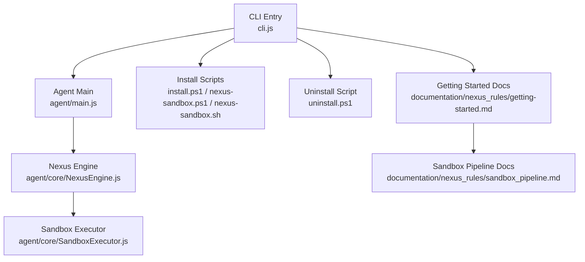
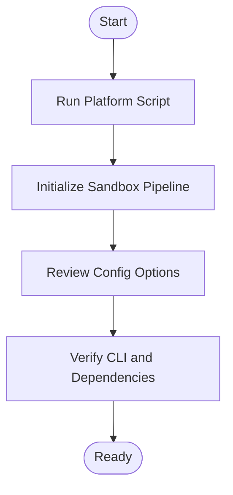
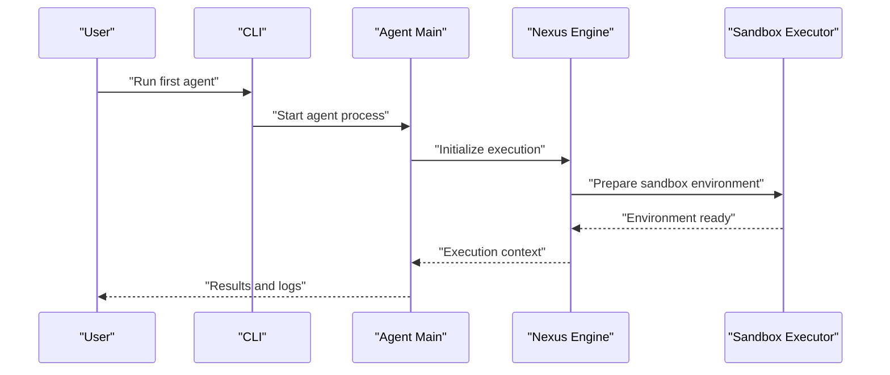
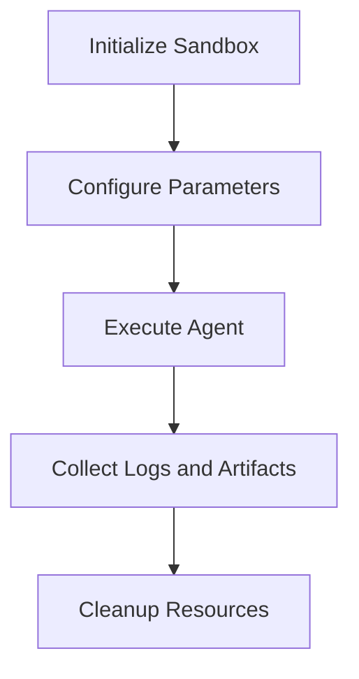

# Getting Started

<cite>
**Referenced Files in This Document**
- [README.md](file://README.md)
- [cli.js](file://cli.js)
- [package.json](file://package.json)
- [install.ps1](file://install.ps1)
- [uninstall.ps1](file://uninstall.ps1)
- [nexus-sandbox.ps1](file://nexus-sandbox.ps1)
- [nexus-sandbox.sh](file://nexus-sandbox.sh)
- [agent/main.js](file://agent/main.js)
- [agent/core/NexusEngine.js](file://agent/core/NexusEngine.js)
- [agent/core/SandboxExecutor.js](file://agent/core/SandboxExecutor.js)
- [agent/prompts/internal/guru.md](file://agent/prompts/internal/guru.md)
- [documentation/nexus_rules/getting-started.md](file://documentation/nexus_rules/getting-started.md)
- [documentation/nexus_rules/INSTALLATION_WORKFLOW.md](file://documentation/nexus_rules/INSTALLATION_WORKFLOW.md)
- [documentation/nexus_rules/sandbox_pipeline.md](file://documentation/nexus_rules/sandbox_pipeline.md)
- [tests/TDD/SandboxProjectSetup.js](file://tests/TDD/SandboxProjectSetup.js)
</cite>

## Table of Contents
1. [Introduction](#introduction)
2. [Project Structure](#project-structure)
3. [System Requirements](#system-requirements)
4. [Installation](#installation)
5. [Initial Setup](#initial-setup)
6. [CLI Interface](#cli-interface)
7. [First Agent Run](#first-agent-run)
8. [Sandbox Environment](#sandbox-environment)
9. [Basic Usage Patterns](#basic-usage-patterns)
10. [Troubleshooting](#troubleshooting)
11. [Prerequisites and Recommended Environment](#prerequisites-and-recommended-environment)
12. [Conclusion](#conclusion)

## Introduction
NEXUS AI is an autonomous multi-agent system designed to execute complex tasks through structured phases and workflows. It provides a CLI interface, a sandbox environment for safe experimentation, and a comprehensive set of built-in agents and tools. This guide helps you install NEXUS AI on Windows and Linux, configure your environment, and run your first agent in the sandbox.

## Project Structure
At a high level, the repository contains:
- CLI entry point and scripts for installation/uninstallation
- Agent core engine and sandbox executor
- Prompts and workflows for agents
- Documentation covering installation, sandbox pipeline, and getting started
- Tests and TDD scaffolding for sandbox projects

**Diagram sources**
- [cli.js](file://cli.js)
- [agent/main.js](file://agent/main.js)
- [agent/core/NexusEngine.js](file://agent/core/NexusEngine.js)
- [agent/core/SandboxExecutor.js](file://agent/core/SandboxExecutor.js)
- [install.ps1](file://install.ps1)
- [nexus-sandbox.ps1](file://nexus-sandbox.ps1)
- [nexus-sandbox.sh](file://nexus-sandbox.sh)
- [documentation/nexus_rules/getting-started.md](file://documentation/nexus_rules/getting-started.md)
- [documentation/nexus_rules/sandbox_pipeline.md](file://documentation/nexus_rules/sandbox_pipeline.md)

**Section sources**
- [README.md](file://README.md)
- [package.json](file://package.json)

## System Requirements
- Operating Systems: Windows PowerShell and Linux shell support are provided via dedicated scripts.
- Node.js runtime is required for the CLI and agent execution.
- Git is recommended for cloning the repository and managing updates.
- Docker is optional but recommended for containerized sandbox runs.
- Sufficient disk space for local model caches and generated artifacts.

**Section sources**
- [documentation/nexus_rules/getting-started.md](file://documentation/nexus_rules/getting-started.md)
- [documentation/nexus_rules/INSTALLATION_WORKFLOW.md](file://documentation/nexus_rules/INSTALLATION_WORKFLOW.md)

## Installation
Choose the method that matches your platform.

### Windows Installation
- Open PowerShell as Administrator.
- Navigate to the repository root.
- Run the installation script to bootstrap the environment and dependencies.
- Verify installation by launching the CLI.

**Section sources**
- [install.ps1](file://install.ps1)
- [nexus-sandbox.ps1](file://nexus-sandbox.ps1)

### Linux Installation
- Open a terminal.
- Navigate to the repository root.
- Make the sandbox script executable if needed.
- Run the sandbox script to initialize the environment.
- Launch the CLI to confirm installation.

**Section sources**
- [nexus-sandbox.sh](file://nexus-sandbox.sh)

### Post-Installation Verification
- Confirm the CLI responds to help or version commands.
- Ensure all required dependencies are present in the package manifest.

**Section sources**
- [package.json](file://package.json)

## Initial Setup
After installation, prepare your environment for first use:
- Initialize the sandbox pipeline according to the documented workflow.
- Review the getting started guide for environment variables and configuration options.
- Validate that the Nexus Engine and Sandbox Executor are ready to accept tasks.

**Diagram sources**
- [documentation/nexus_rules/INSTALLATION_WORKFLOW.md](file://documentation/nexus_rules/INSTALLATION_WORKFLOW.md)
- [documentation/nexus_rules/getting-started.md](file://documentation/nexus_rules/getting-started.md)

**Section sources**
- [documentation/nexus_rules/getting-started.md](file://documentation/nexus_rules/getting-started.md)
- [documentation/nexus_rules/sandbox_pipeline.md](file://documentation/nexus_rules/sandbox_pipeline.md)

## CLI Interface
The CLI serves as the primary entry point to interact with NEXUS AI. Typical usage includes:
- Listing available commands and options
- Running predefined workflows or agents
- Managing sandbox environments
- Executing diagnostic or maintenance tasks

Key capabilities supported by the CLI include:
- Command discovery and help
- Agent invocation and monitoring
- Sandbox lifecycle management
- Configuration and environment inspection

**Section sources**
- [cli.js](file://cli.js)
- [package.json](file://package.json)

## First Agent Run
Follow this step-by-step tutorial to run your first agent in the sandbox:

1. Prepare the sandbox
   - Initialize the sandbox pipeline using the platform-specific script.
   - Confirm that the sandbox is ready for agent execution.

2. Select an agent
   - Choose a built-in agent prompt suitable for your task.
   - Review the agent's purpose and capabilities described in the prompt.

3. Execute the agent
   - Use the CLI to start the agent with appropriate parameters.
   - Monitor progress through the Nexus Engine and Sandbox Executor.

4. Inspect results
   - Review logs and outputs produced by the agent.
   - Validate that the agent completed its intended task within the sandbox.

**Diagram sources**
- [cli.js](file://cli.js)
- [agent/main.js](file://agent/main.js)
- [agent/core/NexusEngine.js](file://agent/core/NexusEngine.js)
- [agent/core/SandboxExecutor.js](file://agent/core/SandboxExecutor.js)

**Section sources**
- [agent/main.js](file://agent/main.js)
- [agent/core/NexusEngine.js](file://agent/core/NexusEngine.js)
- [agent/core/SandboxExecutor.js](file://agent/core/SandboxExecutor.js)
- [agent/prompts/internal/guru.md](file://agent/prompts/internal/guru.md)
- [tests/TDD/SandboxProjectSetup.js](file://tests/TDD/SandboxProjectSetup.js)

## Sandbox Environment
The sandbox provides a controlled execution environment for agents:
- Isolation of resource usage and filesystem access
- Controlled logging and artifact generation
- Pipeline orchestration for multi-phase tasks

To use the sandbox:
- Initialize the sandbox pipeline before running agents.
- Configure sandbox parameters via environment variables or configuration files.
- Execute agents within the sandbox and review their outputs.

**Diagram sources**
- [documentation/nexus_rules/sandbox_pipeline.md](file://documentation/nexus_rules/sandbox_pipeline.md)
- [agent/core/SandboxExecutor.js](file://agent/core/SandboxExecutor.js)

**Section sources**
- [documentation/nexus_rules/sandbox_pipeline.md](file://documentation/nexus_rules/sandbox_pipeline.md)
- [agent/core/SandboxExecutor.js](file://agent/core/SandboxExecutor.js)

## Basic Usage Patterns
Common usage patterns include:
- Running a single agent for targeted tasks
- Iterating through predefined workflows
- Monitoring agent performance and resource usage
- Extending agents using provided prompts and tools

Recommended approaches:
- Start with simple prompts and gradually increase complexity
- Use the sandbox for iterative testing
- Leverage built-in tools and scanners for specialized tasks

**Section sources**
- [agent/prompts/internal/guru.md](file://agent/prompts/internal/guru.md)
- [agent/tools/Validator.js](file://agent/tools/Validator.js)
- [agent/tools/Designer.js](file://agent/tools/Designer.js)

## Troubleshooting
Common installation and setup issues:

- PowerShell execution policy restrictions on Windows
  - Adjust execution policy or run with bypass flags as permitted by your environment.
  - Re-run the installation script after policy changes.

- Permission errors during installation
  - Ensure you are running the script with sufficient privileges.
  - Check that the target directory is writable.

- Node.js version compatibility
  - Verify your Node.js version meets the minimum requirement.
  - Reinstall or switch Node.js versions if necessary.

- Sandbox initialization failures
  - Confirm all prerequisites are installed.
  - Review sandbox pipeline documentation for environment-specific steps.

- CLI not responding
  - Check that the CLI entry point is executable and configured correctly.
  - Validate that required dependencies are present in the package manifest.

**Section sources**
- [install.ps1](file://install.ps1)
- [nexus-sandbox.ps1](file://nexus-sandbox.ps1)
- [nexus-sandbox.sh](file://nexus-sandbox.sh)
- [package.json](file://package.json)
- [documentation/nexus_rules/getting-started.md](file://documentation/nexus_rules/getting-started.md)

## Prerequisites and Recommended Environment
Prerequisites:
- Node.js runtime
- Git for repository operations
- Docker (optional) for containerized runs

Recommended development environment:
- VS Code or another editor with JavaScript/Node.js support
- Terminal configured for PowerShell (Windows) or bash (Linux)
- Access to documentation and prompt templates for agents

**Section sources**
- [package.json](file://package.json)
- [documentation/nexus_rules/getting-started.md](file://documentation/nexus_rules/getting-started.md)

## Conclusion
You are now ready to install NEXUS AI, configure your environment, and run your first agent in the sandbox. Use the CLI to manage agents and workflows, leverage the sandbox for safe experimentation, and consult the documentation for advanced configurations and troubleshooting.