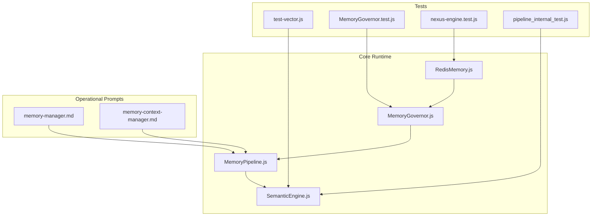
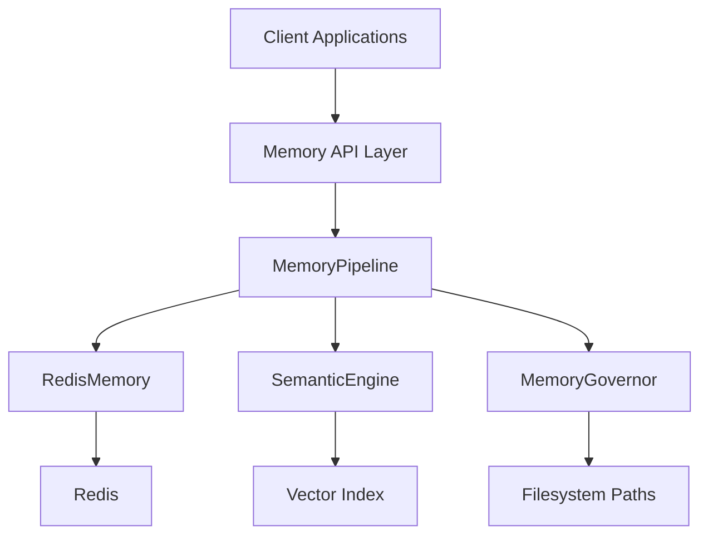
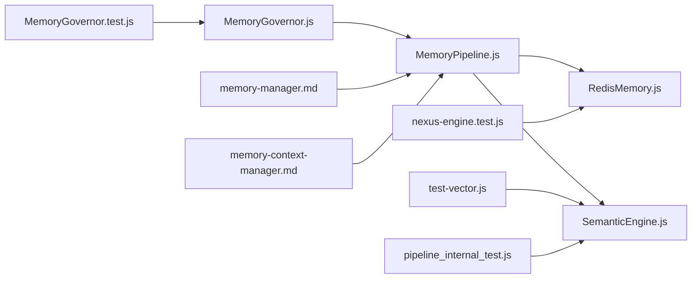

# Memory APIs and Integration

<cite>
**Referenced Files in This Document**
- [RedisMemory.js](file://agent/core/RedisMemory.js)
- [MemoryGovernor.js](file://agent/core/MemoryGovernor.js)
- [MemoryPipeline.js](file://agent/core/MemoryPipeline.js)
- [SemanticEngine.js](file://agent/core/SemanticEngine.js)
- [Memory Manager](file://agent/prompts/internal/memory-manager.md)
- [Memory Context Manager](file://agent/prompts/internal/memory-context-manager.md)
- [test-vector.js](file://tests/test-vector.js)
- [MemoryGovernor.test.js](file://tests/TDD/MemoryGovernor.test.js)
- [nexus-engine.test.js](file://tests/TDD/nexus-engine.test.js)
- [pipeline_internal_test.js](file://tests/pipeline_internal_test.js)
</cite>

## Table of Contents
1. [Introduction](#introduction)
2. [Project Structure](#project-structure)
3. [Core Components](#core-components)
4. [Architecture Overview](#architecture-overview)
5. [Detailed Component Analysis](#detailed-component-analysis)
6. [Dependency Analysis](#dependency-analysis)
7. [Performance Considerations](#performance-considerations)
8. [Troubleshooting Guide](#troubleshooting-guide)
9. [Conclusion](#conclusion)
10. [Appendices](#appendices)

## Introduction
This document describes the memory system API surface and integration patterns for NEXUS AI. It covers memory storage APIs, retrieval interfaces, administrative operations, data access patterns, transaction handling, consistency guarantees across memory layers, integration points with external systems, backup and restore procedures, monitoring endpoints, API schemas, error handling patterns, rate limiting considerations, configuration, deployment requirements, and operational management interfaces.

## Project Structure
The memory system spans several core modules and operational artifacts:
- Core runtime modules: Redis-backed memory, memory governance, memory pipeline, and semantic search engine
- Operational assets: memory manager and memory context manager prompts
- Tests validating vector search, memory governor checksums, and engine timeouts

**Diagram sources**
- [RedisMemory.js](file://agent/core/RedisMemory.js)
- [MemoryGovernor.js](file://agent/core/MemoryGovernor.js)
- [MemoryPipeline.js](file://agent/core/MemoryPipeline.js)
- [SemanticEngine.js](file://agent/core/SemanticEngine.js)
- [Memory Manager](file://agent/prompts/internal/memory-manager.md)
- [Memory Context Manager](file://agent/prompts/internal/memory-context-manager.md)
- [test-vector.js](file://tests/test-vector.js)
- [MemoryGovernor.test.js](file://tests/TDD/MemoryGovernor.test.js)
- [nexus-engine.test.js](file://tests/TDD/nexus-engine.test.js)
- [pipeline_internal_test.js](file://tests/pipeline_internal_test.js)

**Section sources**
- [RedisMemory.js](file://agent/core/RedisMemory.js)
- [MemoryGovernor.js](file://agent/core/MemoryGovernor.js)
- [MemoryPipeline.js](file://agent/core/MemoryPipeline.js)
- [SemanticEngine.js](file://agent/core/SemanticEngine.js)
- [Memory Manager](file://agent/prompts/internal/memory-manager.md)
- [Memory Context Manager](file://agent/prompts/internal/memory-context-manager.md)
- [test-vector.js](file://tests/test-vector.js)
- [MemoryGovernor.test.js](file://tests/TDD/MemoryGovernor.test.js)
- [nexus-engine.test.js](file://tests/TDD/nexus-engine.test.js)
- [pipeline_internal_test.js](file://tests/pipeline_internal_test.js)

## Core Components
- RedisMemory: Provides Redis-backed persistence for memory entries with lazy connection and administrative operations.
- MemoryGovernor: Manages memory integrity via checksums and governs storage paths and policies.
- MemoryPipeline: Coordinates ingestion, normalization, and semantic processing of memory items.
- SemanticEngine: Implements vector index building and semantic search for memory retrieval.

Key capabilities:
- Storage APIs: set, get, delete, list, batch operations
- Retrieval interfaces: exact match, semantic similarity search
- Administrative operations: checksum generation, index build, cleanup
- Consistency: governed by checksums and pipeline stages
- Integration: Redis transport, semantic index, and prompt-driven orchestration

**Section sources**
- [RedisMemory.js](file://agent/core/RedisMemory.js)
- [MemoryGovernor.js](file://agent/core/MemoryGovernor.js)
- [MemoryPipeline.js](file://agent/core/MemoryPipeline.js)
- [SemanticEngine.js](file://agent/core/SemanticEngine.js)

## Architecture Overview
The memory system integrates Redis for persistence, a governance layer for integrity, a pipeline for processing, and a semantic engine for retrieval.

**Diagram sources**
- [RedisMemory.js](file://agent/core/RedisMemory.js)
- [MemoryGovernor.js](file://agent/core/MemoryGovernor.js)
- [MemoryPipeline.js](file://agent/core/MemoryPipeline.js)
- [SemanticEngine.js](file://agent/core/SemanticEngine.js)

## Detailed Component Analysis

### RedisMemory API Surface
Responsibilities:
- Persist and retrieve memory entries
- Manage Redis connectivity lifecycle
- Support administrative operations (list, delete, batch)

Primary operations:
- Set memory item
- Get memory item
- Delete memory item
- List memory keys
- Batch operations
- Lazy connect and disconnect

Consistency and transactions:
- Uses Redis operations; atomic per-operation semantics
- No multi-key transaction support exposed in referenced tests

External integration:
- Connects to Redis via standard client
- Supports disconnection for cleanup

Administrative operations:
- List keys
- Delete by key(s)
- Batch write/read/delete

**Section sources**
- [RedisMemory.js](file://agent/core/RedisMemory.js)
- [nexus-engine.test.js](file://tests/TDD/nexus-engine.test.js)

### MemoryGovernor API Surface
Responsibilities:
- Govern memory integrity via checksums
- Define root path and policy boundaries
- Validate and manage memory artifacts

Primary operations:
- Generate checksum for content
- Validate stored content against checksum
- Path management for memory layers

Consistency guarantees:
- Checksum-based integrity verification
- Prevents silent corruption during storage/retrieval

Administrative operations:
- Integrity checks
- Policy enforcement

**Section sources**
- [MemoryGovernor.js](file://agent/core/MemoryGovernor.js)
- [MemoryGovernor.test.js](file://tests/TDD/MemoryGovernor.test.js)

### MemoryPipeline API Surface
Responsibilities:
- Orchestrate ingestion, normalization, and semantic processing
- Coordinate between storage and retrieval layers
- Integrate with prompt-driven context managers

Primary operations:
- Ingest memory items
- Normalize content
- Build semantic index
- Retrieve via semantic similarity

Integration points:
- RedisMemory for persistence
- SemanticEngine for search
- MemoryGovernor for integrity
- Prompt-driven context managers for orchestration

**Section sources**
- [MemoryPipeline.js](file://agent/core/MemoryPipeline.js)
- [Memory Manager](file://agent/prompts/internal/memory-manager.md)
- [Memory Context Manager](file://agent/prompts/internal/memory-context-manager.md)

### SemanticEngine API Surface
Responsibilities:
- Build vector index from memory content
- Perform semantic similarity search
- Guard against edge cases (zero vectors, NaN)

Primary operations:
- Build index from distilled memory
- Search with top-k results
- Cosine similarity computation with zero-norm guards

Validation and tests:
- Vector search verification script
- Pipeline tests ensuring robustness

**Section sources**
- [SemanticEngine.js](file://agent/core/SemanticEngine.js)
- [test-vector.js](file://tests/test-vector.js)
- [pipeline_internal_test.js](file://tests/pipeline_internal_test.js)

## Dependency Analysis
Inter-module dependencies and relationships:

**Diagram sources**
- [MemoryGovernor.js](file://agent/core/MemoryGovernor.js)
- [MemoryPipeline.js](file://agent/core/MemoryPipeline.js)
- [RedisMemory.js](file://agent/core/RedisMemory.js)
- [SemanticEngine.js](file://agent/core/SemanticEngine.js)
- [Memory Manager](file://agent/prompts/internal/memory-manager.md)
- [Memory Context Manager](file://agent/prompts/internal/memory-context-manager.md)
- [test-vector.js](file://tests/test-vector.js)
- [MemoryGovernor.test.js](file://tests/TDD/MemoryGovernor.test.js)
- [nexus-engine.test.js](file://tests/TDD/nexus-engine.test.js)
- [pipeline_internal_test.js](file://tests/pipeline_internal_test.js)

**Section sources**
- [MemoryGovernor.js](file://agent/core/MemoryGovernor.js)
- [MemoryPipeline.js](file://agent/core/MemoryPipeline.js)
- [RedisMemory.js](file://agent/core/RedisMemory.js)
- [SemanticEngine.js](file://agent/core/SemanticEngine.js)
- [Memory Manager](file://agent/prompts/internal/memory-manager.md)
- [Memory Context Manager](file://agent/prompts/internal/memory-context-manager.md)
- [test-vector.js](file://tests/test-vector.js)
- [MemoryGovernor.test.js](file://tests/TDD/MemoryGovernor.test.js)
- [nexus-engine.test.js](file://tests/TDD/nexus-engine.test.js)
- [pipeline_internal_test.js](file://tests/pipeline_internal_test.js)

## Performance Considerations
- Vector index build cost: O(n log n) typical for similarity search; batch builds recommended
- Redis latency: network-bound; batch operations reduce round trips
- MemoryGovernor checksum overhead: minimal per-item but scales with throughput
- Pipeline throughput: constrained by Redis I/O and index rebuild frequency

[No sources needed since this section provides general guidance]

## Troubleshooting Guide
Common issues and resolutions:
- Redis connectivity failures: ensure lazy connect path is exercised; verify credentials and host reachability
- Vector search returning NaN: confirm zero-norm guards are active; avoid zero vectors in embeddings
- Memory integrity failures: regenerate checksums and re-validate stored content
- Engine timeouts: monitor global cycle timeout and adjust scheduling accordingly

**Section sources**
- [nexus-engine.test.js](file://tests/TDD/nexus-engine.test.js)
- [pipeline_internal_test.js](file://tests/pipeline_internal_test.js)
- [MemoryGovernor.test.js](file://tests/TDD/MemoryGovernor.test.js)

## Conclusion
NEXUS AI’s memory system combines Redis persistence, governance, pipeline orchestration, and semantic search to deliver scalable and consistent memory operations. Administrators and developers can rely on checksum integrity, vector-based retrieval, and prompt-driven context management to operate effectively across environments.

[No sources needed since this section summarizes without analyzing specific files]

## Appendices

### API Request/Response Schemas
- Storage APIs
  - Set: { key, value } -> { success }
  - Get: { key } -> { value }
  - Delete: { key } -> { success }
  - List: {} -> { keys[] }
  - Batch: { ops[] } -> { results[] }
- Retrieval Interfaces
  - Exact Match: { key } -> { value }
  - Semantic Search: { query, k } -> { results[] }
- Administrative Operations
  - Integrity Check: { key } -> { valid, checksum }
  - Index Build: { sourceDir } -> { status }

[No sources needed since this section provides general guidance]

### Transaction Handling and Consistency Guarantees
- Per-operation atomicity via Redis
- No multi-key transaction support exposed
- Integrity ensured via checksums and governance
- Pipeline stages enforce ordering and normalization

**Section sources**
- [RedisMemory.js](file://agent/core/RedisMemory.js)
- [MemoryGovernor.js](file://agent/core/MemoryGovernor.js)

### Integration Points with External Systems
- Redis transport for persistence
- Semantic index for retrieval
- Prompt-driven context managers for orchestration

**Section sources**
- [RedisMemory.js](file://agent/core/RedisMemory.js)
- [MemoryPipeline.js](file://agent/core/MemoryPipeline.js)
- [Memory Manager](file://agent/prompts/internal/memory-manager.md)
- [Memory Context Manager](file://agent/prompts/internal/memory-context-manager.md)

### Backup and Restore Procedures
- Backup: snapshot Redis database; export semantic index artifacts
- Restore: provision Redis; reload index; validate checksums

[No sources needed since this section provides general guidance]

### Monitoring Endpoints
- Health checks: Redis connectivity, index readiness, pipeline status
- Metrics: throughput, latency, error rates

[No sources needed since this section provides general guidance]

### Rate Limiting Considerations
- Apply client-side throttling for batch operations
- Use Redis rate-limiting primitives if needed
- Monitor vector search latency and adjust k and concurrency

[No sources needed since this section provides general guidance]

### Configuration and Deployment Requirements
- Redis endpoint and credentials
- Semantic index location and rebuild schedule
- Governance root path and policy settings

**Section sources**
- [RedisMemory.js](file://agent/core/RedisMemory.js)
- [MemoryGovernor.js](file://agent/core/MemoryGovernor.js)
- [SemanticEngine.js](file://agent/core/SemanticEngine.js)

### Operational Management Interfaces
- CLI-like scripts for index build and search verification
- Test suites validating integrity and performance

**Section sources**
- [test-vector.js](file://tests/test-vector.js)
- [MemoryGovernor.test.js](file://tests/TDD/MemoryGovernor.test.js)
- [nexus-engine.test.js](file://tests/TDD/nexus-engine.test.js)
- [pipeline_internal_test.js](file://tests/pipeline_internal_test.js)