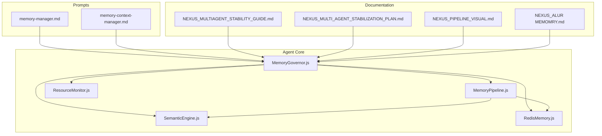
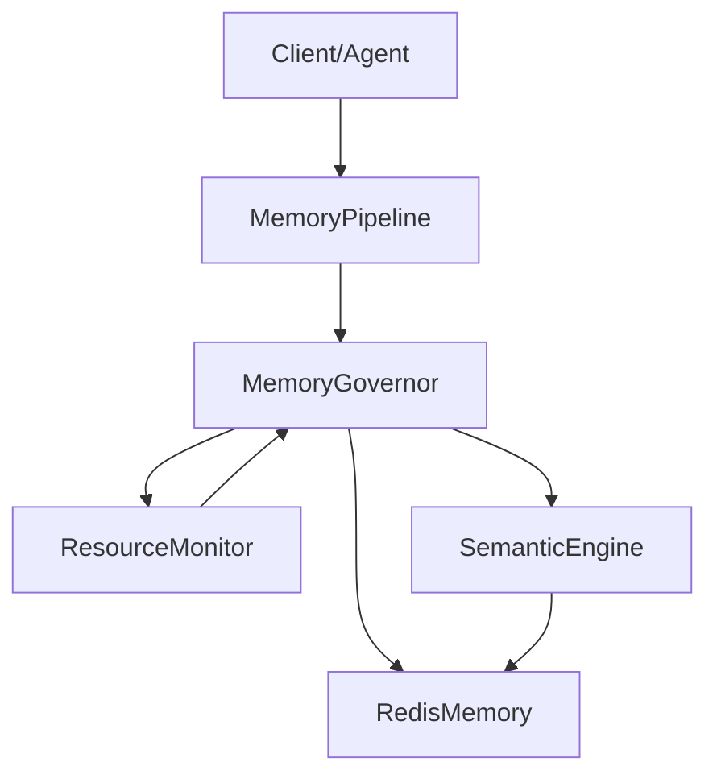
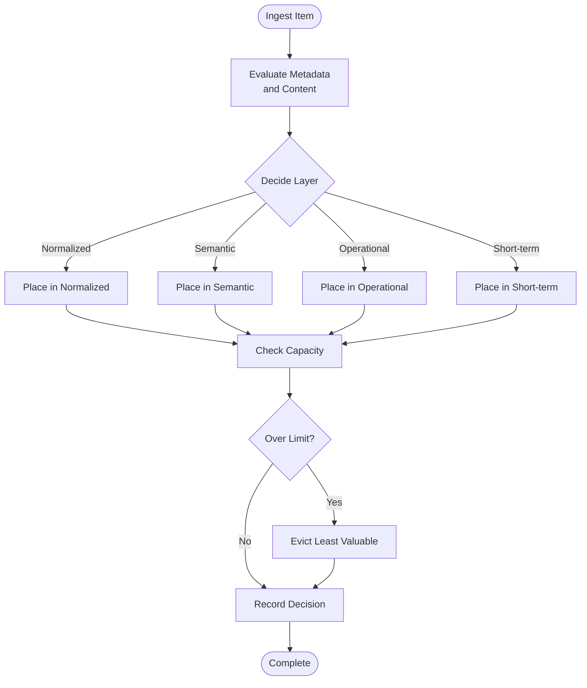
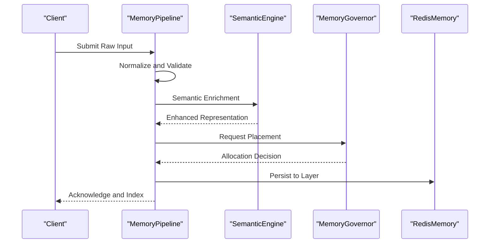
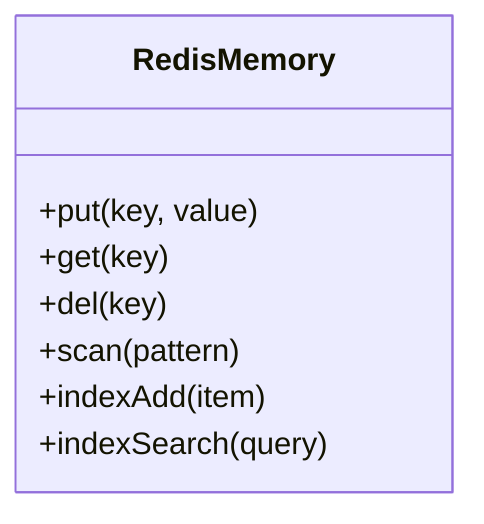
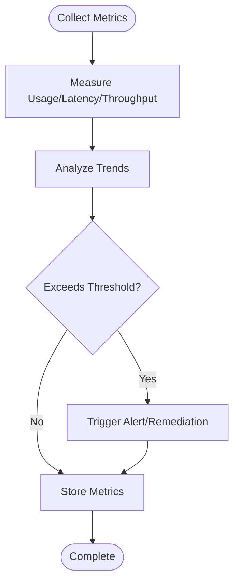
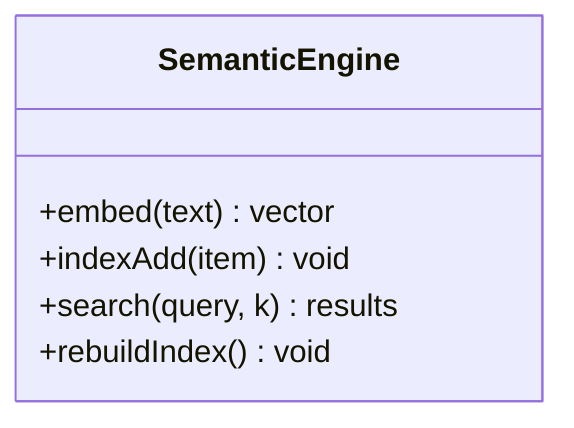
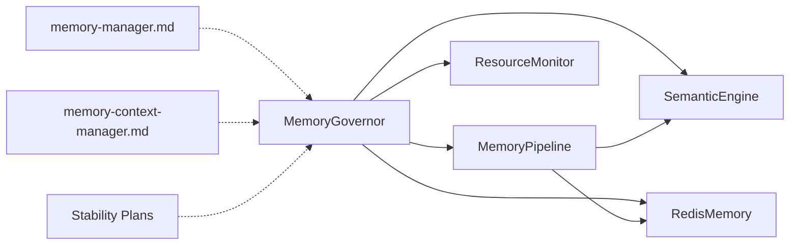

# Memory Governance

<cite>
**Referenced Files in This Document**
- [MemoryGovernor.js](file://agent/core/MemoryGovernor.js)
- [MemoryPipeline.js](file://agent/core/MemoryPipeline.js)
- [RedisMemory.js](file://agent/core/RedisMemory.js)
- [ResourceMonitor.js](file://agent/core/ResourceMonitor.js)
- [SemanticEngine.js](file://agent/core/SemanticEngine.js)
- [MemoryManager.md](file://agent/prompts/internal/memory-manager.md)
- [memory-context-manager.md](file://agent/prompts/internal/memory-context-manager.md)
- [MemoryGovernor.test.js](file://tests/TDD/MemoryGovernor.test.js)
- [MemoryGovernor.stress-test.js](file://agent/tests/stress-test.js)
- [NEXUS_MEMORY_SYSTEM.md](file://documentation/mermaid/alur memomry.md)
- [NEXUS_MULTIAGENT_STABILITY_GUIDE.md](file://documentation/planning/NEXUS_MULTIAGENT_STABILITY_GUIDE.md)
- [NEXUS_MULTI_AGENT_STABILIZATION_PLAN.md](file://documentation/planning/NEXUS_MULTI_AGENT_STABILIZATION_PLAN.md)
- [NEXUS_HYBRID_CORE_ROADMAP.md](file://documentation/nexus_rules/NEXUS_HYBRID_CORE_ROADMAP.md)
- [NEXUS_INTERNAL_PIPELINE_RECAP.md](file://documentation/nexus_rules/NEXUS_INTERNAL_PIPELINE_RECAP.md)
- [NEXUS_SANDBOX_Review.md](file://documentation/planning/NEXUS_SANDBOX_Review.md)
- [NEXUS_PIPELINE_REMEDIATION_REPORT.md](file://documentation/audit/NEXUS_PIPELINE_REMEDIATION_REPORT.md)
- [NEXUS_AUDIT_SUMMARY_10_LOOP_SCAN.md](file://documentation/audit/AUDIT-NEXUS-HARDENING-SYNC.md)
- [NEXUS_CORE_MODULARIZATION.md](file://documentation/performance/NEXUS_CORE_MODULARIZATION.md)
- [NEXUS_MULTIAGENT_STABILITY_GUIDE.md](file://documentation/performance/NEXUS_MULTIAGENT_STABILITY_GUIDE.md)
- [NEXUS_EXTREME_PERFORMANCE_ROADMAP.md](file://documentation/audit/EXTREME_PERFORMANCE_ROADMAP.md)
- [NEXUS_INTERNAL_WORKFLOW.md](file://documentation/nexus_rules/INTERNAL_WORKFLOW.md)
- [NEXUS_BUG_REPORT.md](file://documentation/nexus_rules/NEXUS_BUG_REPORT.md)
- [NEXUS_DOCKER_TALL_EVOLUTION.md](file://documentation/nexus_rules/NEXUS_DOCKER_TALL_EVOLUTION.md)
- [NEXUS_VISION_1000_PROJECT.md](file://documentation/nexus_rules/NEXUS_VISION_1000_PROJECT.md)
- [NEXUS_PIPELINE_VISUAL.md](file://documentation/mermaid/PIPELINE_VISUAL.md)
- [NEXUS_SANDBOX_PIPELINE.md](file://documentation/mermaid/sandbox_pipeline.md)
- [NEXUS_ALUR NEXUS.md](file://documentation/mermaid/alur nexus.md)
- [NEXUS_ALUR AGI.md](file://documentation/mermaid/alur agi.md)
- [NEXUS_ALUR PLANNING.md](file://documentation/mermaid/alur planning.md)
- [NEXUS_ALUR AGENT.md](file://documentation/mermaid/alur agent.md)
- [NEXUS_ALUR CPP.md](file://documentation/mermaid/alur cpp.md)
- [NEXUS_ALUR MEMOMRY.md](file://documentation/mermaid/alur memomry.md)
- [NEXUS_SANDBOX_PIPELINE.md](file://documentation/nexus_rules/sandbox_pipeline.md)
- [NEXUS_INTERNAL_CORE — HARD BOUNDARY & SYSTEM CONSTRAINT.md](file://documentation/nexus_rules/NEXUS_INTERNAL_CORE — HARD BOUNDARY & SYSTEM CONSTRAINT.md)
- [NEXUS_CORE_MODULARIZATION.md](file://documentation/performance/NEXUS_CORE_MODULARIZATION.md)
- [NEXUS_MULTIAGENT_STABILITY_GUIDE.md](file://documentation/performance/NEXUS_MULTIAGENT_STABILITY_GUIDE.md)
- [NEXUS_EXTREME_PERFORMANCE_ROADMAP.md](file://documentation/audit/EXTREME_PERFORMANCE_ROADMAP.md)
- [NEXUS_INTERNAL_WORKFLOW.md](file://documentation/nexus_rules/INTERNAL_WORKFLOW.md)
- [NEXUS_BUG_REPORT.md](file://documentation/nexus_rules/NEXUS_BUG_REPORT.md)
- [NEXUS_DOCKER_TALL_EVOLUTION.md](file://documentation/nexus_rules/NEXUS_DOCKER_TALL_EVOLUTION.md)
- [NEXUS_VISION_1000_PROJECT.md](file://documentation/nexus_rules/NEXUS_VISION_1000_PROJECT.md)
- [NEXUS_PIPELINE_VISUAL.md](file://documentation/mermaid/PIPELINE_VISUAL.md)
- [NEXUS_SANDBOX_PIPELINE.md](file://documentation/mermaid/sandbox_pipeline.md)
- [NEXUS_ALUR NEXUS.md](file://documentation/mermaid/alur nexus.md)
- [NEXUS_ALUR AGI.md](file://documentation/mermaid/alur agi.md)
- [NEXUS_ALUR PLANNING.md](file://documentation/mermaid/alur planning.md)
- [NEXUS_ALUR AGENT.md](file://documentation/mermaid/alur agent.md)
- [NEXUS_ALUR CPP.md](file://documentation/mermaid/alur cpp.md)
- [NEXUS_ALUR MEMOMRY.md](file://documentation/mermaid/alur memomry.md)
- [NEXUS_SANDBOX_PIPELINE.md](file://documentation/nexus_rules/sandbox_pipeline.md)
- [NEXUS_INTERNAL_CORE — HARD BOUNDARY & SYSTEM CONSTRAINT.md](file://documentation/nexus_rules/NEXUS_INTERNAL_CORE — HARD BOUNDARY & SYSTEM CONSTRAINT.md)
</cite>

## Table of Contents
1. [Introduction](#introduction)
2. [Project Structure](#project-structure)
3. [Core Components](#core-components)
4. [Architecture Overview](#architecture-overview)
5. [Detailed Component Analysis](#detailed-component-analysis)
6. [Dependency Analysis](#dependency-analysis)
7. [Performance Considerations](#performance-considerations)
8. [Troubleshooting Guide](#troubleshooting-guide)
9. [Conclusion](#conclusion)
10. [Appendices](#appendices)

## Introduction
This document provides comprehensive documentation for the Memory Governor system that powers intelligent memory management in NEXUS AI. It explains how the Memory Governor performs capacity planning, manages the data lifecycle across memory layers, and allocates resources among different memory tiers. It also documents the Memory Pipeline’s transformation processes, semantic indexing, and quality assurance mechanisms. Additional coverage includes memory optimization algorithms, eviction policies, performance monitoring, configuration options, tuning parameters, troubleshooting, multi-agent stability considerations, memory contention resolution, and system-wide memory health management.

## Project Structure
The Memory Governor resides in the agent core and integrates with supporting components such as the Memory Pipeline, Redis-backed persistence, semantic engines, and resource monitoring utilities. Prompts guide memory management behavior and context handling. Documentation artifacts define system boundaries, stability plans, and pipeline visuals.

**Diagram sources**
- [MemoryGovernor.js](file://agent/core/MemoryGovernor.js)
- [MemoryPipeline.js](file://agent/core/MemoryPipeline.js)
- [ResourceMonitor.js](file://agent/core/ResourceMonitor.js)
- [SemanticEngine.js](file://agent/core/SemanticEngine.js)
- [RedisMemory.js](file://agent/core/RedisMemory.js)
- [memory-manager.md](file://agent/prompts/internal/memory-manager.md)
- [memory-context-manager.md](file://agent/prompts/internal/memory-context-manager.md)
- [NEXUS_MULTIAGENT_STABILITY_GUIDE.md](file://documentation/planning/NEXUS_MULTIAGENT_STABILITY_GUIDE.md)
- [NEXUS_MULTI_AGENT_STABILIZATION_PLAN.md](file://documentation/planning/NEXUS_MULTI_AGENT_STABILIZATION_PLAN.md)
- [NEXUS_PIPELINE_VISUAL.md](file://documentation/mermaid/PIPELINE_VISUAL.md)
- [NEXUS_ALUR MEMOMRY.md](file://documentation/mermaid/alur memomry.md)

**Section sources**
- [MemoryGovernor.js](file://agent/core/MemoryGovernor.js)
- [MemoryPipeline.js](file://agent/core/MemoryPipeline.js)
- [ResourceMonitor.js](file://agent/core/ResourceMonitor.js)
- [SemanticEngine.js](file://agent/core/SemanticEngine.js)
- [RedisMemory.js](file://agent/core/RedisMemory.js)
- [memory-manager.md](file://agent/prompts/internal/memory-manager.md)
- [memory-context-manager.md](file://agent/prompts/internal/memory-context-manager.md)
- [NEXUS_MULTIAGENT_STABILITY_GUIDE.md](file://documentation/planning/NEXUS_MULTIAGENT_STABILITY_GUIDE.md)
- [NEXUS_MULTI_AGENT_STABILIZATION_PLAN.md](file://documentation/planning/NEXUS_MULTI_AGENT_STABILIZATION_PLAN.md)
- [NEXUS_PIPELINE_VISUAL.md](file://documentation/mermaid/PIPELINE_VISUAL.md)
- [NEXUS_ALUR MEMOMRY.md](file://documentation/mermaid/alur memomry.md)

## Core Components
- MemoryGovernor: Central orchestrator for capacity planning, memory allocation across layers, and enforcement of stability and health constraints.
- MemoryPipeline: Transforms raw inputs into normalized, semantic, and operational forms; applies quality gates; and routes to appropriate memory layers.
- RedisMemory: Persistent storage layer abstraction for memory items across operational, normalized, semantic, and short-term caches.
- ResourceMonitor: Tracks memory usage, latency, and throughput to inform governance decisions.
- SemanticEngine: Provides semantic indexing and retrieval for efficient memory search and relevance scoring.
- Prompts: Define memory manager behavior and context handling policies.

Key responsibilities:
- Capacity planning: Determine available slots per memory layer and enforce upper bounds.
- Lifecycle management: Normalize → Semanticize → Operational → Archive/Evict.
- Allocation: Distribute new items across layers based on recency, importance, and policy.
- Quality assurance: Validate item integrity, completeness, and relevance before acceptance.
- Monitoring: Continuously observe memory health and trigger remediation actions.

**Section sources**
- [MemoryGovernor.js](file://agent/core/MemoryGovernor.js)
- [MemoryPipeline.js](file://agent/core/MemoryPipeline.js)
- [RedisMemory.js](file://agent/core/RedisMemory.js)
- [ResourceMonitor.js](file://agent/core/ResourceMonitor.js)
- [SemanticEngine.js](file://agent/core/SemanticEngine.js)
- [memory-manager.md](file://agent/prompts/internal/memory-manager.md)
- [memory-context-manager.md](file://agent/prompts/internal/memory-context-manager.md)

## Architecture Overview
The Memory Governor sits at the center of a layered memory architecture. Data enters via the Memory Pipeline, which normalizes and semantically enriches content. The Governor enforces capacity limits, allocates items to appropriate layers, and triggers eviction when thresholds are exceeded. RedisMemory persists items across layers. ResourceMonitor feeds metrics to inform governance decisions. SemanticEngine supports fast retrieval and relevance ranking.

**Diagram sources**
- [MemoryGovernor.js](file://agent/core/MemoryGovernor.js)
- [MemoryPipeline.js](file://agent/core/MemoryPipeline.js)
- [ResourceMonitor.js](file://agent/core/ResourceMonitor.js)
- [SemanticEngine.js](file://agent/core/SemanticEngine.js)
- [RedisMemory.js](file://agent/core/RedisMemory.js)

## Detailed Component Analysis

### MemoryGovernor
Responsibilities:
- Capacity planning: Compute available capacity per memory layer and enforce hard/soft limits.
- Allocation: Decide where to place incoming items (normalized, semantic, operational, short-term).
- Eviction: Trigger removal of least valuable items when capacity is exceeded.
- Stability: Enforce multi-agent stability constraints and contention resolution.
- Health: Monitor memory health and initiate remediation workflows.

Processing logic:
- On item ingestion, evaluate metadata and content characteristics.
- Route to appropriate layer based on recency, importance, and policy.
- If capacity exceeded, apply eviction policy to free space.
- Log governance decisions and update health metrics.

**Diagram sources**
- [MemoryGovernor.js](file://agent/core/MemoryGovernor.js)

**Section sources**
- [MemoryGovernor.js](file://agent/core/MemoryGovernor.js)
- [NEXUS_MULTIAGENT_STABILITY_GUIDE.md](file://documentation/planning/NEXUS_MULTIAGENT_STABILITY_GUIDE.md)
- [NEXUS_MULTI_AGENT_STABILIZATION_PLAN.md](file://documentation/planning/NEXUS_MULTI_AGENT_STABILIZATION_PLAN.md)

### MemoryPipeline
Responsibilities:
- Normalize raw inputs into structured, validated forms.
- Apply semantic enrichment to improve searchability and relevance.
- Quality gates: Validate completeness, coherence, and safety.
- Transformations: Tokenization, embedding generation, and index updates.

**Diagram sources**
- [MemoryPipeline.js](file://agent/core/MemoryPipeline.js)
- [SemanticEngine.js](file://agent/core/SemanticEngine.js)
- [MemoryGovernor.js](file://agent/core/MemoryGovernor.js)
- [RedisMemory.js](file://agent/core/RedisMemory.js)

**Section sources**
- [MemoryPipeline.js](file://agent/core/MemoryPipeline.js)
- [SemanticEngine.js](file://agent/core/SemanticEngine.js)
- [memory-manager.md](file://agent/prompts/internal/memory-manager.md)
- [memory-context-manager.md](file://agent/prompts/internal/memory-context-manager.md)

### RedisMemory
Responsibilities:
- Persist memory items across layers: normalized, semantic, operational, short-term.
- Provide fast reads/writes for active memory items.
- Maintain indices and metadata for retrieval and search.

**Diagram sources**
- [RedisMemory.js](file://agent/core/RedisMemory.js)

**Section sources**
- [RedisMemory.js](file://agent/core/RedisMemory.js)

### ResourceMonitor
Responsibilities:
- Track memory usage, latency, and throughput.
- Feed metrics to MemoryGovernor for adaptive capacity planning.
- Alert on anomalies and trigger remediation.

**Diagram sources**
- [ResourceMonitor.js](file://agent/core/ResourceMonitor.js)

**Section sources**
- [ResourceMonitor.js](file://agent/core/ResourceMonitor.js)

### SemanticEngine
Responsibilities:
- Generate embeddings and maintain semantic indexes.
- Support vector search and similarity scoring.
- Enhance retrieval quality and reduce search latency.

**Diagram sources**
- [SemanticEngine.js](file://agent/core/SemanticEngine.js)

**Section sources**
- [SemanticEngine.js](file://agent/core/SemanticEngine.js)

## Dependency Analysis
The Memory Governor depends on the Memory Pipeline for processed items, SemanticEngine for semantic capabilities, RedisMemory for persistence, and ResourceMonitor for health signals. Prompts define behavioral constraints. Documentation artifacts provide stability and roadmap guidance.

**Diagram sources**
- [MemoryGovernor.js](file://agent/core/MemoryGovernor.js)
- [MemoryPipeline.js](file://agent/core/MemoryPipeline.js)
- [SemanticEngine.js](file://agent/core/SemanticEngine.js)
- [RedisMemory.js](file://agent/core/RedisMemory.js)
- [ResourceMonitor.js](file://agent/core/ResourceMonitor.js)
- [memory-manager.md](file://agent/prompts/internal/memory-manager.md)
- [memory-context-manager.md](file://agent/prompts/internal/memory-context-manager.md)
- [NEXUS_MULTIAGENT_STABILITY_GUIDE.md](file://documentation/planning/NEXUS_MULTIAGENT_STABILITY_GUIDE.md)

**Section sources**
- [MemoryGovernor.js](file://agent/core/MemoryGovernor.js)
- [MemoryPipeline.js](file://agent/core/MemoryPipeline.js)
- [SemanticEngine.js](file://agent/core/SemanticEngine.js)
- [RedisMemory.js](file://agent/core/RedisMemory.js)
- [ResourceMonitor.js](file://agent/core/ResourceMonitor.js)
- [memory-manager.md](file://agent/prompts/internal/memory-manager.md)
- [memory-context-manager.md](file://agent/prompts/internal/memory-context-manager.md)
- [NEXUS_MULTIAGENT_STABILITY_GUIDE.md](file://documentation/planning/NEXUS_MULTIAGENT_STABILITY_GUIDE.md)

## Performance Considerations
- Adaptive capacity planning: Use ResourceMonitor metrics to adjust layer quotas dynamically.
- Batch operations: Group normalization and semantic enrichment to reduce overhead.
- Index maintenance: Periodic rebuilds and incremental updates for SemanticEngine.
- Contention control: Implement queuing and backpressure in MemoryPipeline under load.
- Latency budgets: Enforce per-operation latency targets to prevent cascading delays.

[No sources needed since this section provides general guidance]

## Troubleshooting Guide
Common issues and resolutions:
- Memory pressure spikes: Increase soft limits temporarily; enable eviction; scale out Redis replicas.
- Slow semantic search: Rebuild indexes; optimize embedding batch sizes; add more compute.
- Pipeline backlogs: Add parallel workers; tune normalization thresholds; implement retry with exponential backoff.
- Multi-agent contention: Enforce inter-agent isolation; rate-limit shared resources; use distributed locks.
- Health alerts: Review ResourceMonitor logs; check Redis connectivity; validate governance thresholds.

Validation and tests:
- Unit and integration tests validate MemoryGovernor behavior under various scenarios.
- Stress tests simulate high-load conditions to uncover bottlenecks and contention.

**Section sources**
- [MemoryGovernor.test.js](file://tests/TDD/MemoryGovernor.test.js)
- [MemoryGovernor.stress-test.js](file://agent/tests/stress-test.js)
- [NEXUS_PIPELINE_REMEDIATION_REPORT.md](file://documentation/audit/NEXUS_PIPELINE_REMEDIATION_REPORT.md)
- [NEXUS_AUDIT_SUMMARY_10_LOOP_SCAN.md](file://documentation/audit/AUDIT-NEXUS-HARDENING-SYNC.md)

## Conclusion
The Memory Governor system orchestrates intelligent memory management across NEXUS AI by aligning capacity planning, lifecycle management, and resource allocation with quality and stability goals. Through the Memory Pipeline, semantic indexing, and robust monitoring, it ensures efficient, scalable, and resilient memory operations. Proper configuration, tuning, and adherence to stability guidelines are essential for sustained performance and multi-agent harmony.

[No sources needed since this section summarizes without analyzing specific files]

## Appendices

### Configuration Options and Tuning Parameters
- Capacity thresholds per layer: normalized, semantic, operational, short-term.
- Eviction policy parameters: recency bias, importance weights, decay rates.
- Semantic engine parameters: embedding dimension, index rebuild cadence, search top-k.
- ResourceMonitor parameters: sampling interval, alert thresholds, remediation triggers.
- Pipeline parameters: normalization strictness, batch sizes, parallelism, retry policies.

[No sources needed since this section provides general guidance]

### Multi-Agent Stability and Contention Resolution
- Isolation: Assign dedicated memory slices per agent or capability domain.
- Coordination: Use centralized governance queues for cross-layer operations.
- Fairness: Implement weighted round-robin or priority queues for shared resources.
- Recovery: Automatic rollback and retry on transient failures; circuit breakers for unhealthy dependencies.

**Section sources**
- [NEXUS_MULTIAGENT_STABILITY_GUIDE.md](file://documentation/planning/NEXUS_MULTIAGENT_STABILITY_GUIDE.md)
- [NEXUS_MULTI_AGENT_STABILIZATION_PLAN.md](file://documentation/planning/NEXUS_MULTI_AGENT_STABILIZATION_PLAN.md)
- [NEXUS_HYBRID_CORE_ROADMAP.md](file://documentation/nexus_rules/NEXUS_HYBRID_CORE_ROADMAP.md)
- [NEXUS_INTERNAL_PIPELINE_RECAP.md](file://documentation/nexus_rules/NEXUS_INTERNAL_PIPELINE_RECAP.md)

### System-Wide Memory Health Management
- Continuous monitoring: Track utilization, latency, and error rates.
- Proactive remediation: Auto-scaling, index maintenance, and capacity rebalancing.
- Documentation-driven governance: Align policies with internal workflows and bug reports.

**Section sources**
- [NEXUS_INTERNAL_WORKFLOW.md](file://documentation/nexus_rules/INTERNAL_WORKFLOW.md)
- [NEXUS_BUG_REPORT.md](file://documentation/nexus_rules/NEXUS_BUG_REPORT.md)
- [NEXUS_DOCKER_TALL_EVOLUTION.md](file://documentation/nexus_rules/NEXUS_DOCKER_TALL_EVOLUTION.md)
- [NEXUS_VISION_1000_PROJECT.md](file://documentation/nexus_rules/NEXUS_VISION_1000_PROJECT.md)
- [NEXUS_CORE_MODULARIZATION.md](file://documentation/performance/NEXUS_CORE_MODULARIZATION.md)
- [NEXUS_MULTIAGENT_STABILITY_GUIDE.md](file://documentation/performance/NEXUS_MULTIAGENT_STABILITY_GUIDE.md)
- [NEXUS_EXTREME_PERFORMANCE_ROADMAP.md](file://documentation/audit/EXTREME_PERFORMANCE_ROADMAP.md)