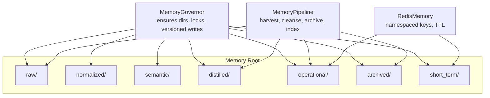
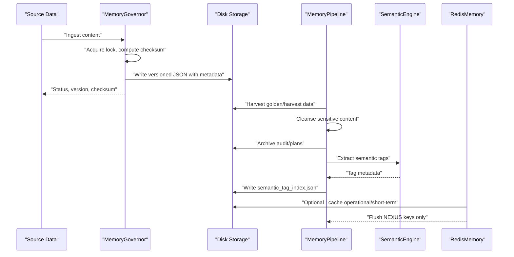
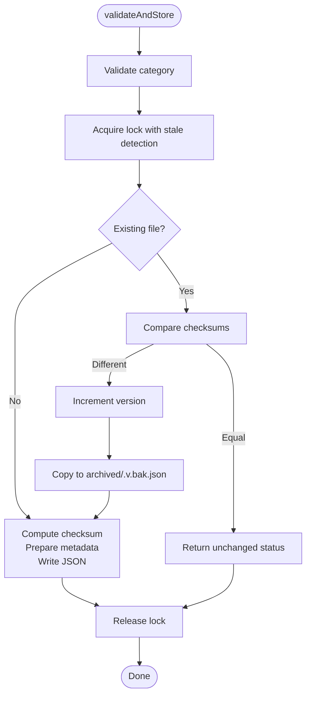
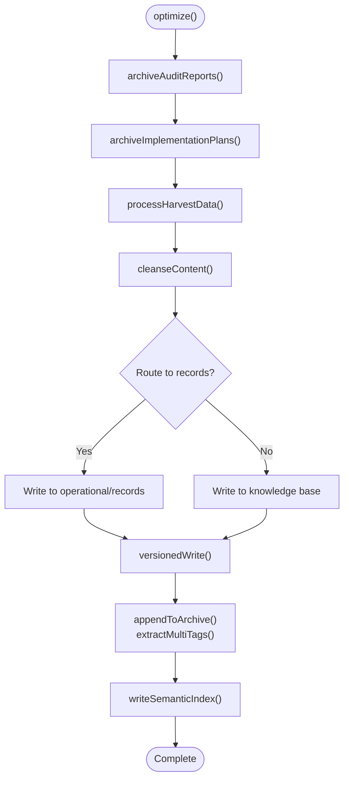
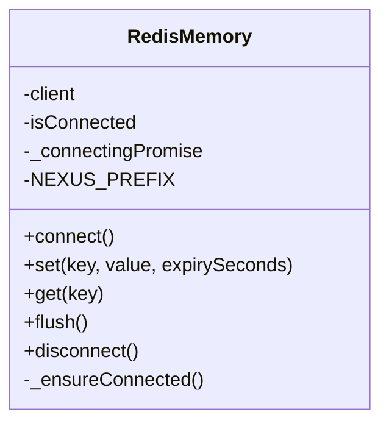
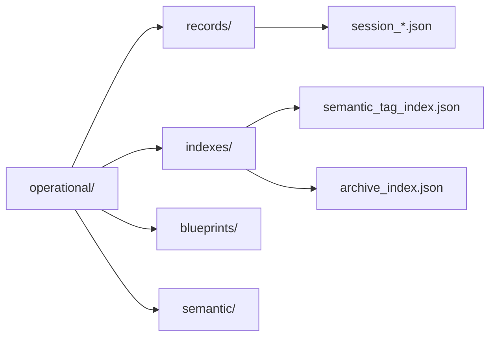
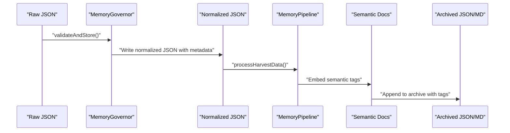
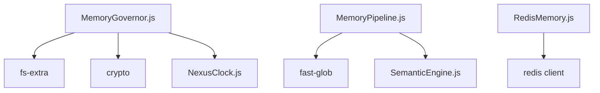

# Memory Storage Layers

<cite>
**Referenced Files in This Document**
- [MemoryGovernor.js](file://agent/core/MemoryGovernor.js)
- [RedisMemory.js](file://agent/core/RedisMemory.js)
- [MemoryPipeline.js](file://agent/core/MemoryPipeline.js)
- [SemanticEngine.js](file://agent/core/SemanticEngine.js)
- [NexusClock.js](file://agent/core/NexusClock.js)
- [memory INDEX.md](file://memory/INDEX.md)
- [memory INDEX_NEURAL_MAP.md](file://memory/INDEX_NEURAL_MAP.md)
- [semantic index](file://memory/operational/indexes/semantic_tag_index.json)
- [archive index](file://memory/operational/archive_index.json)
- [session files](file://memory/operational/records/session_*.json)
- [short term vector index](file://memory/short_term/vector_index.json)
- [short term link cache](file://memory/short_term/link_cache.json)
- [distilled dataset](file://memory/datasets/nexus-retro-dataset.jsonl)
</cite>

## Table of Contents
1. [Introduction](#introduction)
2. [Project Structure](#project-structure)
3. [Core Components](#core-components)
4. [Architecture Overview](#architecture-overview)
5. [Detailed Component Analysis](#detailed-component-analysis)
6. [Dependency Analysis](#dependency-analysis)
7. [Performance Considerations](#performance-considerations)
8. [Troubleshooting Guide](#troubleshooting-guide)
9. [Conclusion](#conclusion)
10. [Appendices](#appendices)

## Introduction
This document describes the NEXUS AI multi-layered memory storage architecture. It explains the hierarchical organization of raw, normalized, operational, semantic, archived, and short-term memory stores, their purposes and characteristics, data transformation processes between layers, retention policies, Redis-backed storage implementation, data serialization formats, and optimization strategies. It also provides examples of data flow through the memory hierarchy, query patterns for each layer, performance considerations, capacity planning, and lifecycle management across all memory layers.

## Project Structure
The memory subsystem is organized under a central memory root with distinct directories for each layer. A governance component ensures directory structure, enforces file locking, and writes versioned artifacts. A pipeline component orchestrates harvesting, cleansing, archiving, and semantic indexing. Redis-backed in-memory storage complements persistent disk storage.

**Diagram sources**
- [MemoryGovernor.js:13-18](file://agent/core/MemoryGovernor.js#L13-L18)
- [MemoryPipeline.js:9-18](file://agent/core/MemoryPipeline.js#L9-L18)
- [RedisMemory.js:8](file://agent/core/RedisMemory.js#L8)

**Section sources**
- [MemoryGovernor.js:13-18](file://agent/core/MemoryGovernor.js#L13-L18)
- [MemoryPipeline.js:9-18](file://agent/core/MemoryPipeline.js#L9-L18)
- [RedisMemory.js:8](file://agent/core/RedisMemory.js#L8)

## Core Components
- MemoryGovernor: Ensures memory directories, manages file locks with stale detection, computes checksums, and performs versioned writes with backups.
- MemoryPipeline: Orchestrates harvesting golden data, content cleansing, audit/planning archival, and semantic index generation.
- RedisMemory: Provides namespaced Redis-backed storage with auto-connect, TTL, and safe flush semantics.

**Section sources**
- [MemoryGovernor.js:6-136](file://agent/core/MemoryGovernor.js#L6-L136)
- [MemoryPipeline.js:9-254](file://agent/core/MemoryPipeline.js#L9-L254)
- [RedisMemory.js:10-105](file://agent/core/RedisMemory.js#L10-L105)

## Architecture Overview
The memory architecture follows a layered ingestion-to-archival pipeline with optional Redis caching for short-term and operational data.

**Diagram sources**
- [MemoryGovernor.js:95-131](file://agent/core/MemoryGovernor.js#L95-L131)
- [MemoryPipeline.js:48-96](file://agent/core/MemoryPipeline.js#L48-L96)
- [MemoryPipeline.js:163-182](file://agent/core/MemoryPipeline.js#L163-L182)
- [MemoryPipeline.js:184-226](file://agent/core/MemoryPipeline.js#L184-L226)
- [RedisMemory.js:74-88](file://agent/core/RedisMemory.js#L74-L88)

## Detailed Component Analysis

### MemoryGovernor: Directory Management, Locking, and Versioned Writes
- Responsibilities:
  - Ensure existence of memory directories for each layer.
  - Provide robust file locking with stale lock detection and exponential backoff.
  - Compute SHA-256 checksums to detect unchanged content.
  - Perform versioned writes with pre-overwrite backups and metadata injection.
- Data model:
  - Stored as JSON with content and metadata including version, checksum, and timestamp.
- Retention policy:
  - Backups stored under archived with version suffixes.
- Serialization:
  - JSON with pretty-print spacing.
- Concurrency:
  - Lock files with process PID tracking and stale age thresholds.

**Diagram sources**
- [MemoryGovernor.js:86-132](file://agent/core/MemoryGovernor.js#L86-L132)

**Section sources**
- [MemoryGovernor.js:13-18](file://agent/core/MemoryGovernor.js#L13-L18)
- [MemoryGovernor.js:31-84](file://agent/core/MemoryGovernor.js#L31-L84)
- [MemoryGovernor.js:95-131](file://agent/core/MemoryGovernor.js#L95-L131)

### MemoryPipeline: Harvest, Cleanse, Archive, Index
- Responsibilities:
  - Recursively process golden/harvest projects and move content to knowledge base or operational records.
  - Apply content cleansing to redact secrets and sensitive patterns.
  - Archive audit reports and implementation plans with semantic tagging appended to a rotating archive file.
  - Build a semantic tag index from metadata embedded in documents.
- Data model:
  - Documents with embedded semantic metadata tags.
  - Tag index JSON mapping tags to filenames.
  - Archive index JSON tracking current archive file and rotation counter.
- Retention policy:
  - Rotating archives based on size threshold.
  - Versioned backups during writes.
- Serialization:
  - JSON for indexes and records; Markdown for documents.

**Diagram sources**
- [MemoryPipeline.js:20-27](file://agent/core/MemoryPipeline.js#L20-L27)
- [MemoryPipeline.js:121-161](file://agent/core/MemoryPipeline.js#L121-L161)
- [MemoryPipeline.js:48-96](file://agent/core/MemoryPipeline.js#L48-L96)
- [MemoryPipeline.js:98-112](file://agent/core/MemoryPipeline.js#L98-L112)
- [MemoryPipeline.js:163-182](file://agent/core/MemoryPipeline.js#L163-L182)
- [MemoryPipeline.js:184-226](file://agent/core/MemoryPipeline.js#L184-L226)

**Section sources**
- [MemoryPipeline.js:20-27](file://agent/core/MemoryPipeline.js#L20-L27)
- [MemoryPipeline.js:48-96](file://agent/core/MemoryPipeline.js#L48-L96)
- [MemoryPipeline.js:98-112](file://agent/core/MemoryPipeline.js#L98-L112)
- [MemoryPipeline.js:121-161](file://agent/core/MemoryPipeline.js#L121-L161)
- [MemoryPipeline.js:163-182](file://agent/core/MemoryPipeline.js#L163-L182)
- [MemoryPipeline.js:184-226](file://agent/core/MemoryPipeline.js#L184-L226)
- [MemoryPipeline.js:228-250](file://agent/core/MemoryPipeline.js#L228-L250)

### RedisMemory: Namespaced In-Memory Storage
- Responsibilities:
  - Provide namespaced Redis keys to avoid conflicts.
  - Auto-connect on demand with connection reuse.
  - Store JSON-serializable values with TTL.
  - Safely flush only NEXUS-managed keys.
- Data model:
  - String values serialized to JSON when objects are stored.
- Retention policy:
  - TTL-based eviction via EX option.
- Serialization:
  - JSON stringify for objects; raw string for primitives.

**Diagram sources**
- [RedisMemory.js:10-105](file://agent/core/RedisMemory.js#L10-L105)

**Section sources**
- [RedisMemory.js:23-47](file://agent/core/RedisMemory.js#L23-L47)
- [RedisMemory.js:49-71](file://agent/core/RedisMemory.js#L49-L71)
- [RedisMemory.js:74-88](file://agent/core/RedisMemory.js#L74-L88)
- [RedisMemory.js:90-100](file://agent/core/RedisMemory.js#L90-L100)

### Layered Memory Stores

#### Raw Layer
- Purpose: Unprocessed, immediate capture of incoming data (audits, reports, logs).
- Characteristics: High throughput ingestion; minimal transformation.
- Storage: Disk JSON with governance metadata; potential for temporary staging before normalization.
- Lifecycle: Transitions to normalized layer via pipeline or manual curation.

**Section sources**
- [MemoryPipeline.js:13-16](file://agent/core/MemoryPipeline.js#L13-L16)

#### Normalized Layer
- Purpose: Structured, validated, and standardized form of raw data.
- Characteristics: Consistent schema; de-duplicated; enriched with derived fields.
- Storage: Disk JSON; governed by checksum/versioning.
- Lifecycle: Used as input for semantic enrichment and distilled knowledge.

**Section sources**
- [MemoryGovernor.js:95-131](file://agent/core/MemoryGovernor.js#L95-L131)

#### Operational Layer
- Purpose: Active working memory for runtime orchestration and planning.
- Characteristics: Includes indexes, records, and blueprints; supports fast queries.
- Storage: JSON indexes and session records; optional Redis caching for hot paths.
- Lifecycle: Evolves with agent loops; periodically archived and indexed.

**Diagram sources**
- [MemoryPipeline.js:184-226](file://agent/core/MemoryPipeline.js#L184-L226)
- [MemoryPipeline.js:228-250](file://agent/core/MemoryPipeline.js#L228-L250)
- [session files](file://memory/operational/records/session_*.json)
- [semantic index](file://memory/operational/indexes/semantic_tag_index.json)
- [archive index](file://memory/operational/archive_index.json)

**Section sources**
- [MemoryPipeline.js:184-226](file://agent/core/MemoryPipeline.js#L184-L226)
- [MemoryPipeline.js:228-250](file://agent/core/MemoryPipeline.js#L228-L250)
- [session files](file://memory/operational/records/session_*.json)

#### Semantic Layer
- Purpose: Richly tagged, discoverable knowledge for retrieval and reasoning.
- Characteristics: Embedded semantic metadata; tag-driven searchability.
- Storage: Documents with metadata tags; tag index for fast lookup.
- Lifecycle: Generated from operational content via pipeline.

**Section sources**
- [MemoryPipeline.js:163-182](file://agent/core/MemoryPipeline.js#L163-L182)
- [MemoryPipeline.js:184-226](file://agent/core/MemoryPipeline.js#L184-L226)

#### Archived Layer
- Purpose: Immutable historical artifacts and backups.
- Characteristics: Rotating archives; versioned backups; long-term retention.
- Storage: Markdown archives and JSON backups; governed by archive index.
- Lifecycle: Controlled rotation based on size thresholds.

**Section sources**
- [MemoryGovernor.js:122-125](file://agent/core/MemoryGovernor.js#L122-L125)
- [MemoryPipeline.js:228-250](file://agent/core/MemoryPipeline.js#L228-L250)

#### Short-term Layer
- Purpose: Temporary, high-frequency data for immediate agent decisions.
- Characteristics: Vector indices, link caches, and ephemeral sessions.
- Storage: JSON vector index and link cache; optionally cached in Redis.
- Lifecycle: Flushable; designed for transient workloads.

**Section sources**
- [short term vector index](file://memory/short_term/vector_index.json)
- [short term link cache](file://memory/short_term/link_cache.json)
- [RedisMemory.js:74-88](file://agent/core/RedisMemory.js#L74-L88)

### Data Transformation Processes
- From Raw to Normalized:
  - Validation and schema alignment.
  - Deduplication and enrichment.
- From Normalized to Semantic:
  - Extraction of semantic tags via SemanticEngine.
  - Embedding metadata into documents.
- From Operational to Archived:
  - Rotation of archives based on size thresholds.
  - Versioned backups of overwritten files.

**Diagram sources**
- [MemoryGovernor.js:95-131](file://agent/core/MemoryGovernor.js#L95-L131)
- [MemoryPipeline.js:48-96](file://agent/core/MemoryPipeline.js#L48-L96)
- [MemoryPipeline.js:163-182](file://agent/core/MemoryPipeline.js#L163-L182)
- [MemoryPipeline.js:228-250](file://agent/core/MemoryPipeline.js#L228-L250)

## Dependency Analysis
- MemoryGovernor depends on filesystem utilities, cryptography, and a clock utility for timestamps.
- MemoryPipeline depends on SemanticEngine for tag extraction and fast-glob for recursive scanning.
- RedisMemory is a standalone component with Redis client integration.

**Diagram sources**
- [MemoryGovernor.js:1-5](file://agent/core/MemoryGovernor.js#L1-L5)
- [MemoryPipeline.js:114-119](file://agent/core/MemoryPipeline.js#L114-L119)
- [RedisMemory.js:5](file://agent/core/RedisMemory.js#L5)

**Section sources**
- [MemoryGovernor.js:1-5](file://agent/core/MemoryGovernor.js#L1-L5)
- [MemoryPipeline.js:114-119](file://agent/core/MemoryPipeline.js#L114-L119)
- [RedisMemory.js:5](file://agent/core/RedisMemory.js#L5)

## Performance Considerations
- File I/O
  - Use versioned writes to avoid unnecessary reprocessing and reduce redundant I/O.
  - Employ checksum comparisons to skip unchanged content.
- Locking
  - Stale lock detection prevents deadlocks; exponential backoff reduces contention.
- Redis
  - Namespaced keys prevent collisions; auto-connect avoids repeated connection overhead.
  - Use appropriate TTL values to balance freshness and memory pressure.
- Indexing
  - Build semantic tag index incrementally and cache hot tags in Redis for fast retrieval.
- Capacity Planning
  - Monitor archive sizes and rotate archives proactively.
  - Limit short-term cache sizes and implement eviction policies.
- Serialization
  - Prefer compact JSON and avoid excessive nesting to reduce memory footprint.

[No sources needed since this section provides general guidance]

## Troubleshooting Guide
- Lock Timeout
  - Symptom: Operation fails with lock timeout.
  - Action: Investigate stale locks older than threshold; remove stale lock files manually if necessary.
- Stale Lock Detected
  - Symptom: Warning about stale lock; automatic force release occurs.
  - Action: Verify process health; ensure proper lock release on shutdown.
- Redis Connection Issues
  - Symptom: Redis errors logged; fallback to file-based memory.
  - Action: Check Redis availability; confirm credentials and network connectivity.
- Archive Rotation Not Triggering
  - Symptom: Archive file grows beyond threshold.
  - Action: Verify archive index JSON and size checks; ensure rotation logic executes.
- Semantic Index Missing Tags
  - Symptom: Tag index empty or incomplete.
  - Action: Confirm metadata presence in documents; rebuild index after fixing content.

**Section sources**
- [MemoryGovernor.js:31-84](file://agent/core/MemoryGovernor.js#L31-L84)
- [RedisMemory.js:16-21](file://agent/core/RedisMemory.js#L16-L21)
- [MemoryPipeline.js:228-250](file://agent/core/MemoryPipeline.js#L228-L250)
- [MemoryPipeline.js:184-226](file://agent/core/MemoryPipeline.js#L184-L226)

## Conclusion
The NEXUS AI memory architecture combines robust disk-based storage with Redis-backed caching to support scalable, layered memory. Governance ensures data integrity and concurrency safety; the pipeline transforms raw inputs into semantic, archival, and operational forms. With explicit retention policies, serialization choices, and optimization strategies, the system balances performance, reliability, and long-term knowledge preservation.

[No sources needed since this section summarizes without analyzing specific files]

## Appendices

### Data Serialization Formats
- JSON: Used for structured artifacts, indexes, and records.
- Markdown: Used for human-readable archives and documentation.

**Section sources**
- [MemoryGovernor.js:119-127](file://agent/core/MemoryGovernor.js#L119-L127)
- [MemoryPipeline.js:219-223](file://agent/core/MemoryPipeline.js#L219-L223)

### Query Patterns by Layer
- Raw/Normalized
  - Path-based lookup by filename; checksum verification for unchanged content.
- Operational
  - Tag-based search via semantic_tag_index.json; session record retrieval by ID.
- Semantic
  - Tag-to-document mapping; multi-tag filtering for discovery.
- Archived
  - Archive rotation and incremental append; size-based rotation triggers.
- Short-term
  - Vector index and link cache lookups; optional Redis caching for hot keys.

**Section sources**
- [MemoryGovernor.js:95-131](file://agent/core/MemoryGovernor.js#L95-L131)
- [MemoryPipeline.js:184-226](file://agent/core/MemoryPipeline.js#L184-L226)
- [MemoryPipeline.js:228-250](file://agent/core/MemoryPipeline.js#L228-L250)
- [short term vector index](file://memory/short_term/vector_index.json)
- [short term link cache](file://memory/short_term/link_cache.json)

### Example Data Flow Through Memory Hierarchy
- Ingestion: Raw JSON written via MemoryGovernor with metadata.
- Normalization: Structured JSON produced and stored.
- Semantic Enrichment: Documents tagged; semantic index updated.
- Archival: Audit and planning reports appended to rotating archives.
- Short-term: Vector index and link cache maintained; optional Redis caching.

**Section sources**
- [MemoryGovernor.js:95-131](file://agent/core/MemoryGovernor.js#L95-L131)
- [MemoryPipeline.js:48-96](file://agent/core/MemoryPipeline.js#L48-L96)
- [MemoryPipeline.js:163-182](file://agent/core/MemoryPipeline.js#L163-L182)
- [MemoryPipeline.js:184-226](file://agent/core/MemoryPipeline.js#L184-L226)