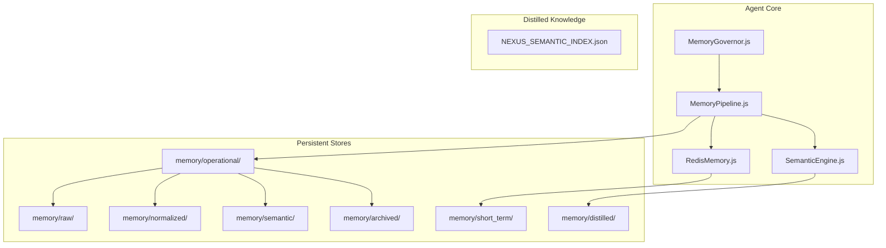
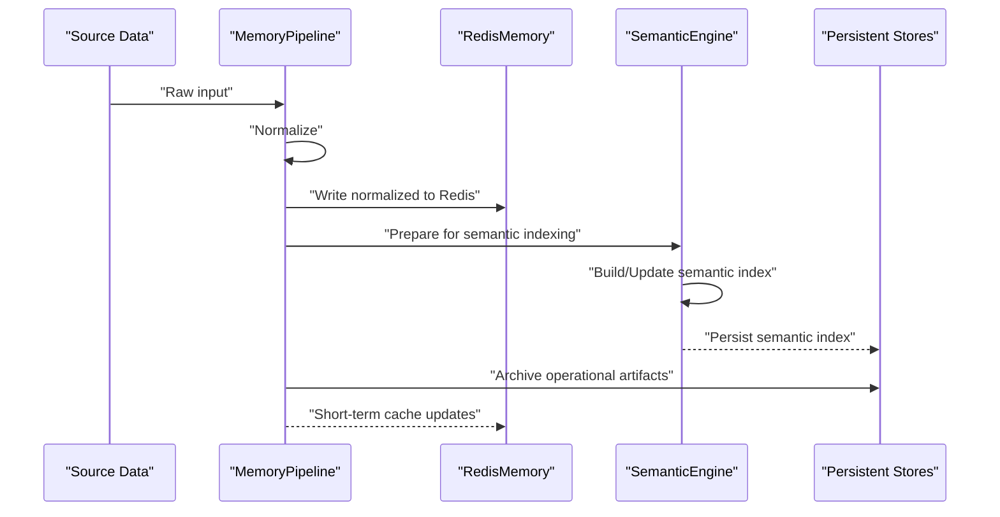
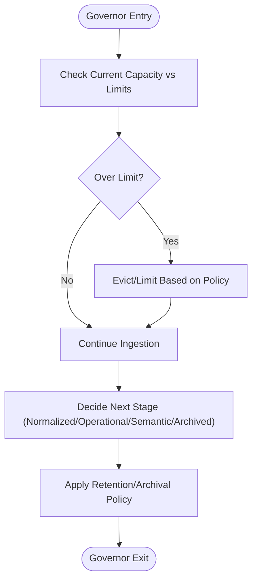
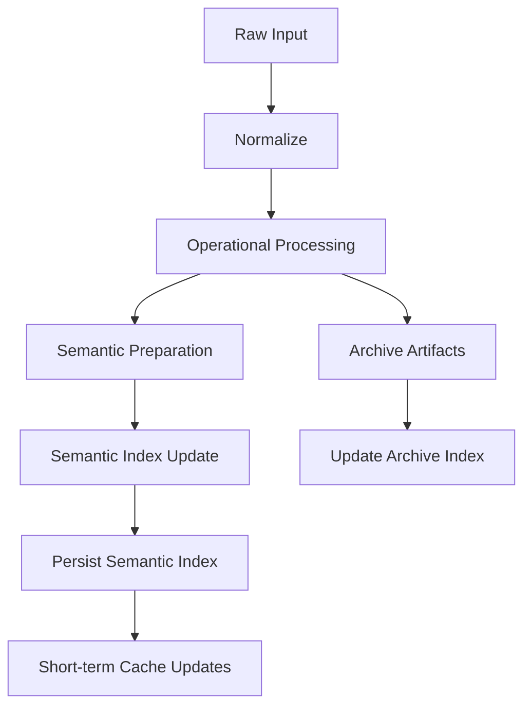
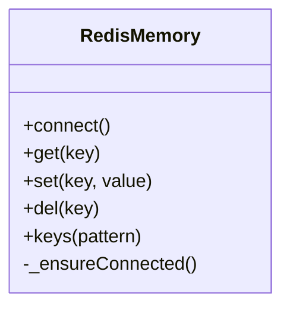
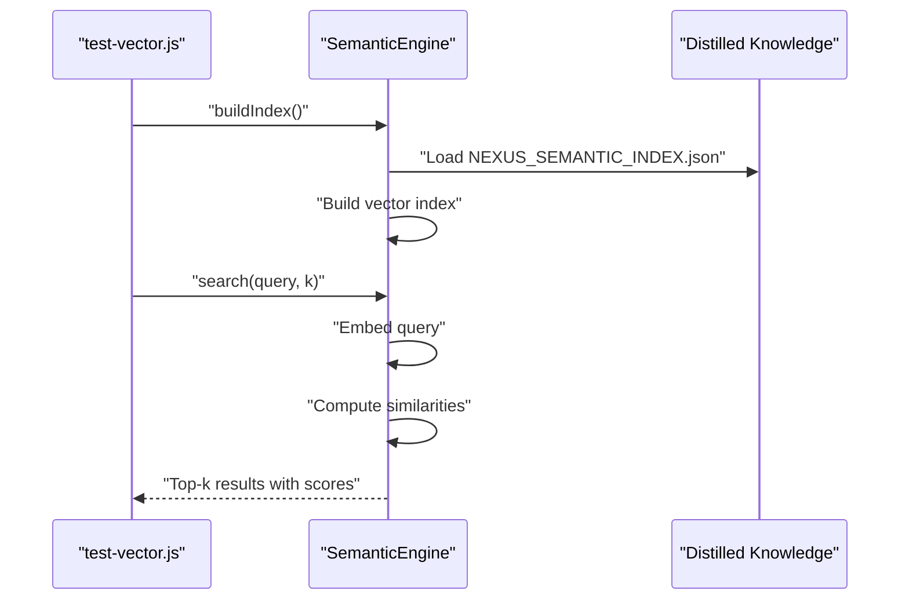
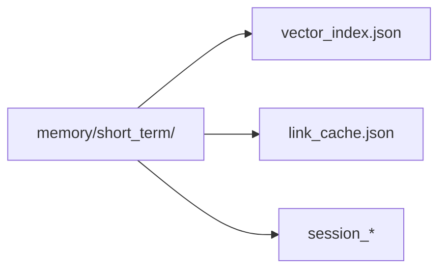
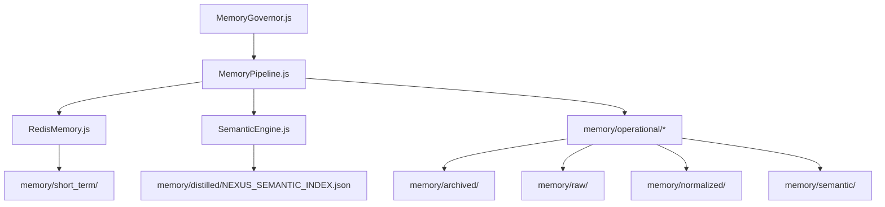

# Memory System

<cite>
**Referenced Files in This Document**
- [MemoryGovernor.js](file://agent/core/MemoryGovernor.js)
- [MemoryPipeline.js](file://agent/core/MemoryPipeline.js)
- [RedisMemory.js](file://agent/core/RedisMemory.js)
- [SemanticEngine.js](file://agent/core/SemanticEngine.js)
- [test-vector.js](file://tests/test-vector.js)
- [MemoryGovernor.test.js](file://tests/TDD/MemoryGovernor.test.js)
- [pipeline_internal_test.js](file://tests/pipeline_internal_test.js)
- [vector_index.json](file://memory/short_term/vector_index.json)
- [NEXUS_SEMANTIC_INDEX.json](file://memory/distilled/NEXUS_SEMANTIC_INDEX.json)
- [session_1778912740327.json](file://memory/operational/session_1778912740327.json)
- [archive_index.json](file://memory/operational/archive_index.json)
- [link_cache.json](file://memory/operational/link_cache.json)
- [NEXUS_BLUEPRINT.json](file://NEXUS_BLUEPRINT.json)
</cite>

## Table of Contents
1. [Introduction](#introduction)
2. [Project Structure](#project-structure)
3. [Core Components](#core-components)
4. [Architecture Overview](#architecture-overview)
5. [Detailed Component Analysis](#detailed-component-analysis)
6. [Dependency Analysis](#dependency-analysis)
7. [Performance Considerations](#performance-considerations)
8. [Troubleshooting Guide](#troubleshooting-guide)
9. [Conclusion](#conclusion)
10. [Appendices](#appendices)

## Introduction
This document describes the NEXUS AI memory system architecture, focusing on the multi-layered memory hierarchy, intelligent memory management via the Memory Governor, the Memory Pipeline for data transformation and semantic indexing, Redis-backed memory storage, vector embeddings, and semantic search capabilities. It also covers optimization strategies, data retention policies, performance considerations, and integration points within the broader system.

## Project Structure
The memory system spans several directories and components:
- Core runtime memory modules under agent/core (MemoryGovernor, MemoryPipeline, RedisMemory, SemanticEngine)
- Persistent memory stores under memory/ (raw, normalized, operational, semantic, archived, short_term)
- Distilled knowledge under memory/distilled with a semantic index
- Tests validating vector search and memory pipeline behavior

**Diagram sources**
- [MemoryGovernor.js](file://agent/core/MemoryGovernor.js)
- [MemoryPipeline.js](file://agent/core/MemoryPipeline.js)
- [RedisMemory.js](file://agent/core/RedisMemory.js)
- [SemanticEngine.js](file://agent/core/SemanticEngine.js)
- [NEXUS_SEMANTIC_INDEX.json](file://memory/distilled/NEXUS_SEMANTIC_INDEX.json)

**Section sources**
- [MemoryGovernor.js](file://agent/core/MemoryGovernor.js)
- [MemoryPipeline.js](file://agent/core/MemoryPipeline.js)
- [RedisMemory.js](file://agent/core/RedisMemory.js)
- [SemanticEngine.js](file://agent/core/SemanticEngine.js)
- [NEXUS_SEMANTIC_INDEX.json](file://memory/distilled/NEXUS_SEMANTIC_INDEX.json)

## Core Components
- MemoryGovernor: Central orchestrator for memory lifecycle, capacity planning, and retention policies across layers.
- MemoryPipeline: Transforms raw inputs into normalized, operational, semantic, and archived forms; coordinates indexing and embedding.
- RedisMemory: Redis-backed persistence layer for short-term and operational memory, enabling fast retrieval and cache-like semantics.
- SemanticEngine: Builds and queries semantic indices using vector embeddings for cross-domain semantic search.

Key responsibilities:
- Multi-layered memory hierarchy: raw → normalized → operational → semantic → archived
- Intelligent capacity management and data lifecycle policies
- Vector embedding and semantic search over distilled knowledge
- Integration with operational sessions, archives, and short-term caches

**Section sources**
- [MemoryGovernor.js](file://agent/core/MemoryGovernor.js)
- [MemoryPipeline.js](file://agent/core/MemoryPipeline.js)
- [RedisMemory.js](file://agent/core/RedisMemory.js)
- [SemanticEngine.js](file://agent/core/SemanticEngine.js)

## Architecture Overview
The memory system follows a layered ingestion and transformation pipeline with Redis-backed persistence and semantic indexing.

**Diagram sources**
- [MemoryPipeline.js](file://agent/core/MemoryPipeline.js)
- [RedisMemory.js](file://agent/core/RedisMemory.js)
- [SemanticEngine.js](file://agent/core/SemanticEngine.js)
- [NEXUS_SEMANTIC_INDEX.json](file://memory/distilled/NEXUS_SEMANTIC_INDEX.json)

## Detailed Component Analysis

### MemoryGovernor
Role:
- Enforces memory capacity limits and retention policies across layers
- Coordinates lifecycle transitions (raw → normalized → operational → semantic → archived)
- Integrates with RedisMemory for short-term persistence and with SemanticEngine for semantic indexing

Responsibilities:
- Policy-driven eviction and archival decisions
- Monitoring and throttling based on resource constraints
- Scheduling periodic maintenance tasks (index rebuilds, cache purges)

**Diagram sources**
- [MemoryGovernor.js](file://agent/core/MemoryGovernor.js)

**Section sources**
- [MemoryGovernor.js](file://agent/core/MemoryGovernor.js)

### MemoryPipeline
Role:
- Transforms raw inputs through normalization and operational stages
- Produces semantic-ready content and coordinates with SemanticEngine
- Manages persistent artifacts (sessions, archives, link caches)

Processing stages:
- Raw ingestion → Normalized representation
- Operational artifact generation (sessions, indexes, caches)
- Semantic enrichment and indexing
- Archival of processed content

**Diagram sources**
- [MemoryPipeline.js](file://agent/core/MemoryPipeline.js)
- [NEXUS_SEMANTIC_INDEX.json](file://memory/distilled/NEXUS_SEMANTIC_INDEX.json)
- [archive_index.json](file://memory/operational/archive_index.json)
- [link_cache.json](file://memory/operational/link_cache.json)

**Section sources**
- [MemoryPipeline.js](file://agent/core/MemoryPipeline.js)
- [session_1778912740327.json](file://memory/operational/session_1778912740327.json)
- [archive_index.json](file://memory/operational/archive_index.json)
- [link_cache.json](file://memory/operational/link_cache.json)

### RedisMemory
Role:
- Provides Redis-backed storage for short-term and operational memory
- Supports fast reads/writes and cache-like semantics
- Integrates with MemoryPipeline for normalized data persistence

Features:
- Lazy connection guard (_ensureConnected)
- Efficient key-value operations for session and cache data
- Seamless integration with MemoryGovernor for capacity-aware operations

**Diagram sources**
- [RedisMemory.js](file://agent/core/RedisMemory.js)

**Section sources**
- [RedisMemory.js](file://agent/core/RedisMemory.js)

### SemanticEngine
Role:
- Builds semantic indices from distilled knowledge
- Performs vector similarity search over embeddings
- Validates cosine similarity behavior and guards against edge cases

Vector search workflow:
- Index building from distilled knowledge
- Query embedding and similarity scoring
- Retrieval of top-k matches with scores and metadata

**Diagram sources**
- [test-vector.js](file://tests/test-vector.js)
- [SemanticEngine.js](file://agent/core/SemanticEngine.js)
- [NEXUS_SEMANTIC_INDEX.json](file://memory/distilled/NEXUS_SEMANTIC_INDEX.json)

**Section sources**
- [test-vector.js](file://tests/test-vector.js)
- [SemanticEngine.js](file://agent/core/SemanticEngine.js)
- [NEXUS_SEMANTIC_INDEX.json](file://memory/distilled/NEXUS_SEMANTIC_INDEX.json)

### Short-term Memory and Vector Index
Short-term memory supports transient session data and vector index for rapid semantic recall.

**Diagram sources**
- [vector_index.json](file://memory/short_term/vector_index.json)
- [link_cache.json](file://memory/operational/link_cache.json)
- [session_1778912740327.json](file://memory/operational/session_1778912740327.json)

**Section sources**
- [vector_index.json](file://memory/short_term/vector_index.json)
- [link_cache.json](file://memory/operational/link_cache.json)
- [session_1778912740327.json](file://memory/operational/session_1778912740327.json)

## Dependency Analysis
The memory system exhibits clear separation of concerns with explicit dependencies among core components and persistent stores.

**Diagram sources**
- [MemoryGovernor.js](file://agent/core/MemoryGovernor.js)
- [MemoryPipeline.js](file://agent/core/MemoryPipeline.js)
- [RedisMemory.js](file://agent/core/RedisMemory.js)
- [SemanticEngine.js](file://agent/core/SemanticEngine.js)
- [NEXUS_SEMANTIC_INDEX.json](file://memory/distilled/NEXUS_SEMANTIC_INDEX.json)

**Section sources**
- [MemoryGovernor.js](file://agent/core/MemoryGovernor.js)
- [MemoryPipeline.js](file://agent/core/MemoryPipeline.js)
- [RedisMemory.js](file://agent/core/RedisMemory.js)
- [SemanticEngine.js](file://agent/core/SemanticEngine.js)

## Performance Considerations
- Vector search stability: Tests confirm cosine similarity guards prevent NaN results for zero or orthogonal vectors, ensuring robust similarity scoring.
- Lazy Redis connectivity: RedisMemory includes a lazy connection mechanism to avoid unnecessary overhead during initialization.
- Global timeout in engine cycles: The engine run cycle enforces a bounded execution window to prevent long-running operations from blocking the system.
- Index granularity: SemanticEngine operates on a curated semantic index to balance recall precision and computational cost.

Recommendations:
- Monitor Redis latency and memory usage for short-term caches.
- Batch semantic index updates during off-peak hours.
- Tune similarity thresholds and top-k parameters based on domain needs.
- Implement incremental index updates to reduce rebuild frequency.

**Section sources**
- [pipeline_internal_test.js](file://tests/pipeline_internal_test.js)
- [RedisMemory.js](file://agent/core/RedisMemory.js)
- [SemanticEngine.js](file://agent/core/SemanticEngine.js)

## Troubleshooting Guide
Common issues and resolutions:
- Vector search returns unexpected scores: Verify cosine similarity guards and ensure query embeddings are normalized.
- Redis connectivity failures: Confirm lazy connection behavior and network availability.
- Engine cycle timeouts: Review global timeout configuration and break long-running tasks into smaller units.
- Missing semantic index entries: Validate distilled knowledge loading and index build steps.

Validation references:
- Vector search verification script demonstrates index building and multi-domain queries.
- MemoryGovernor tests validate lifecycle and policy enforcement.

**Section sources**
- [test-vector.js](file://tests/test-vector.js)
- [MemoryGovernor.test.js](file://tests/TDD/MemoryGovernor.test.js)
- [pipeline_internal_test.js](file://tests/pipeline_internal_test.js)

## Conclusion
The NEXUS AI memory system integrates a multi-layered hierarchy with intelligent governance, a robust pipeline for data transformation, Redis-backed persistence, and semantic indexing powered by vector embeddings. Together, these components enable scalable, efficient, and semantically aware memory management aligned with the broader system architecture.

## Appendices
- Blueprint alignment: The memory system aligns with the project blueprint for modularization and autonomous pipeline evolution.
- Operational artifacts: Sessions, archive indexes, and link caches provide structured operational state for downstream consumers.

**Section sources**
- [NEXUS_BLUEPRINT.json](file://NEXUS_BLUEPRINT.json)