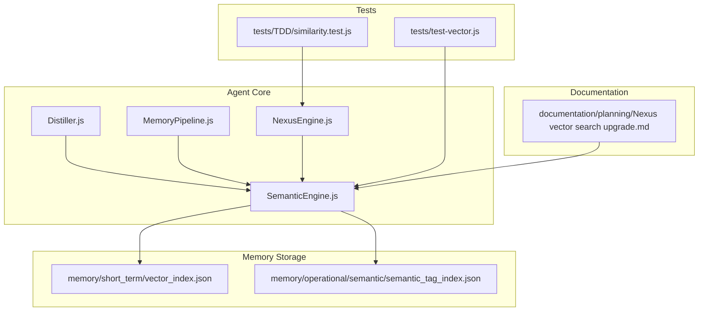
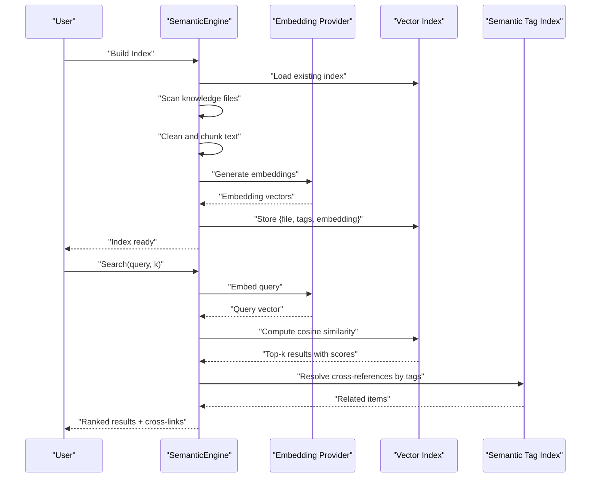
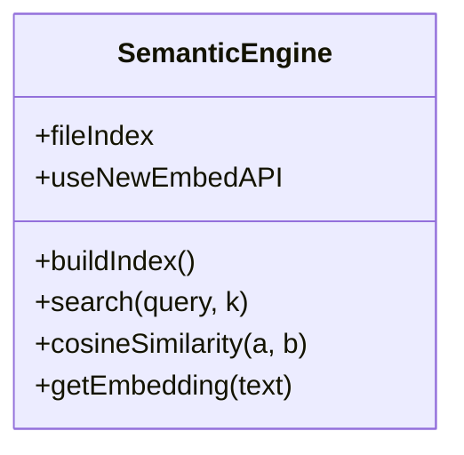
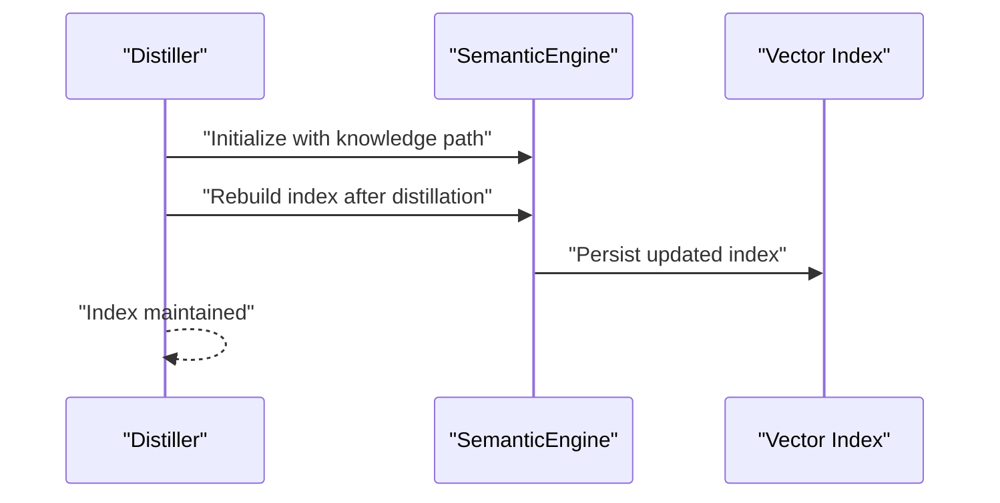
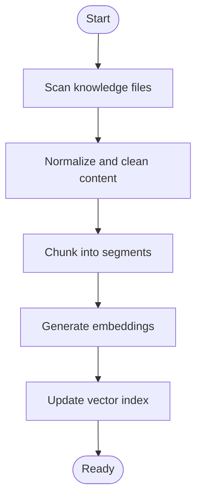
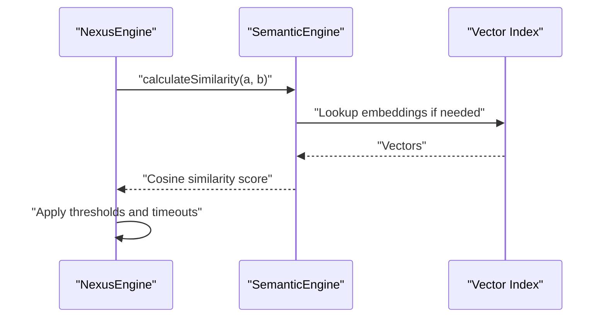
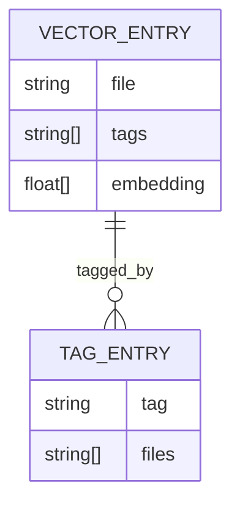
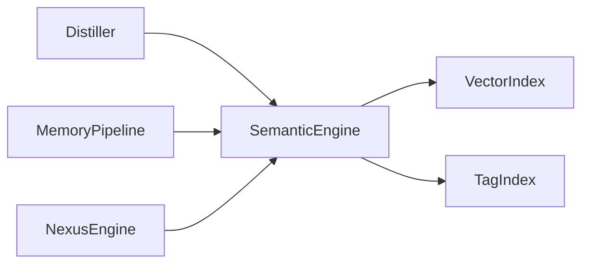

# Semantic Memory and Search

<cite>
**Referenced Files in This Document**
- [SemanticEngine.js](file://agent/core/SemanticEngine.js)
- [Distiller.js](file://agent/core/Distiller.js)
- [MemoryPipeline.js](file://agent/core/MemoryPipeline.js)
- [NexusEngine.js](file://agent/core/NexusEngine.js)
- [test-vector.js](file://tests/test-vector.js)
- [similarity.test.js](file://tests/TDD/similarity.test.js)
- [vector_index.json](file://memory/short_term/vector_index.json)
- [semantic_tag_index.json](file://memory/operational/semantic/semantic_tag_index.json)
- [Nexus vector search upgrade.md](file://documentation/planning/Nexus vector search upgrade.md)
</cite>

## Table of Contents
1. [Introduction](#introduction)
2. [Project Structure](#project-structure)
3. [Core Components](#core-components)
4. [Architecture Overview](#architecture-overview)
5. [Detailed Component Analysis](#detailed-component-analysis)
6. [Dependency Analysis](#dependency-analysis)
7. [Performance Considerations](#performance-considerations)
8. [Troubleshooting Guide](#troubleshooting-guide)
9. [Conclusion](#conclusion)
10. [Appendices](#appendices)

## Introduction
This document explains the semantic memory system and vector search capabilities in NEXUS AI. It covers how semantic embeddings are generated, how vector indices are built and queried, and how similarity search ranks results. It also documents the SemanticEngine’s role in contextual understanding, knowledge retrieval, and cross-reference linking, along with vector database operations, query optimization, and relevance scoring. Practical examples illustrate semantic queries, ranking, and knowledge graph construction, and guidance is provided for maintaining semantic memory, updating embeddings, and optimizing performance at scale.

## Project Structure
The semantic memory system spans several modules:
- agent/core/SemanticEngine.js: Core engine for building vector indices, generating embeddings, and performing similarity search.
- agent/core/Distiller.js: Knowledge distillation pipeline that triggers vector index rebuilds after content refinement.
- agent/core/MemoryPipeline.js: Memory ingestion and processing pipeline integrating semantic indexing.
- agent/core/NexusEngine.js: Higher-level orchestration including similarity computation and cycle management.
- tests/test-vector.js: End-to-end verification script for vector search.
- tests/TDD/similarity.test.js: Unit tests validating similarity logic.
- memory/short_term/vector_index.json: Persisted vector index for fast retrieval.
- memory/operational/semantic/semantic_tag_index.json: Operational semantic tag index for cross-linking.
- documentation/planning/Nexus vector search upgrade.md: Strategic roadmap for vector search enhancements.

**Diagram sources**
- [SemanticEngine.js](file://agent/core/SemanticEngine.js)
- [Distiller.js](file://agent/core/Distiller.js)
- [MemoryPipeline.js](file://agent/core/MemoryPipeline.js)
- [NexusEngine.js](file://agent/core/NexusEngine.js)
- [vector_index.json](file://memory/short_term/vector_index.json)
- [semantic_tag_index.json](file://memory/operational/semantic/semantic_tag_index.json)
- [test-vector.js](file://tests/test-vector.js)
- [similarity.test.js](file://tests/TDD/similarity.test.js)
- [Nexus vector search upgrade.md](file://documentation/planning/Nexus vector search upgrade.md)

**Section sources**
- [SemanticEngine.js](file://agent/core/SemanticEngine.js)
- [Distiller.js](file://agent/core/Distiller.js)
- [MemoryPipeline.js](file://agent/core/MemoryPipeline.js)
- [NexusEngine.js](file://agent/core/NexusEngine.js)
- [test-vector.js](file://tests/test-vector.js)
- [similarity.test.js](file://tests/TDD/similarity.test.js)
- [vector_index.json](file://memory/short_term/vector_index.json)
- [semantic_tag_index.json](file://memory/operational/semantic/semantic_tag_index.json)
- [Nexus vector search upgrade.md](file://documentation/planning/Nexus vector search upgrade.md)

## Core Components
- SemanticEngine: Builds and maintains a vector index from processed knowledge, generates embeddings via an external embedding service, computes cosine similarity, and returns ranked results with metadata such as tags.
- Distiller: Integrates semantic indexing into the knowledge distillation workflow and triggers index rebuilds after content refinement.
- MemoryPipeline: Coordinates ingestion and preprocessing steps that feed the SemanticEngine.
- NexusEngine: Provides higher-level orchestration, including similarity computation used during knowledge fusion and cycle management.
- Vector Index: Persisted JSON index containing file metadata, tags, and embeddings for efficient retrieval.
- Semantic Tag Index: Operational index supporting cross-linking and knowledge graph construction.

Key responsibilities:
- Embedding generation: Clean text chunks, split long texts, and request embeddings from the configured embedding provider.
- Indexing: Store embeddings alongside file paths, tags, and metadata.
- Similarity search: Compute cosine similarity between query embeddings and stored vectors; rank and filter results.
- Cross-reference linking: Use semantic tags and tag-based indices to connect related knowledge items.

**Section sources**
- [SemanticEngine.js](file://agent/core/SemanticEngine.js)
- [Distiller.js](file://agent/core/Distiller.js)
- [MemoryPipeline.js](file://agent/core/MemoryPipeline.js)
- [NexusEngine.js](file://agent/core/NexusEngine.js)
- [vector_index.json](file://memory/short_term/vector_index.json)
- [semantic_tag_index.json](file://memory/operational/semantic/semantic_tag_index.json)

## Architecture Overview
The semantic memory pipeline integrates ingestion, embedding, indexing, and retrieval:

**Diagram sources**
- [SemanticEngine.js](file://agent/core/SemanticEngine.js)
- [vector_index.json](file://memory/short_term/vector_index.json)
- [semantic_tag_index.json](file://memory/operational/semantic/semantic_tag_index.json)
- [test-vector.js](file://tests/test-vector.js)

## Detailed Component Analysis

### SemanticEngine: Embedding, Indexing, and Retrieval
- Embedding generation:
  - Cleans and chunks input text, respecting provider limits.
  - Requests embeddings from an external provider, with warm-up and throttling to avoid resource contention.
  - Stores successful embeddings with associated metadata.
- Vector indexing:
  - Maintains an in-memory file index and persists to a JSON vector index for fast retrieval.
  - Supports rebuilding the index after knowledge updates.
- Similarity search:
  - Embeds the query and computes cosine similarity against stored vectors.
  - Returns top-k results with scores and metadata (e.g., tags).
- Robustness:
  - Includes guards against zero-norm vectors to prevent invalid similarity computations.

**Diagram sources**
- [SemanticEngine.js](file://agent/core/SemanticEngine.js)

**Section sources**
- [SemanticEngine.js](file://agent/core/SemanticEngine.js)

### Knowledge Distillation and Index Maintenance
- Distiller integrates semantic indexing into the distillation workflow.
- Triggers index rebuilds after distillation completes to incorporate refined knowledge.

**Diagram sources**
- [Distiller.js](file://agent/core/Distiller.js)
- [SemanticEngine.js](file://agent/core/SemanticEngine.js)
- [vector_index.json](file://memory/short_term/vector_index.json)

**Section sources**
- [Distiller.js](file://agent/core/Distiller.js)
- [SemanticEngine.js](file://agent/core/SemanticEngine.js)

### Memory Pipeline Integration
- MemoryPipeline coordinates ingestion and preprocessing prior to semantic indexing.
- Ensures that only processed, normalized content enters the SemanticEngine.

**Diagram sources**
- [MemoryPipeline.js](file://agent/core/MemoryPipeline.js)
- [SemanticEngine.js](file://agent/core/SemanticEngine.js)

**Section sources**
- [MemoryPipeline.js](file://agent/core/MemoryPipeline.js)
- [SemanticEngine.js](file://agent/core/SemanticEngine.js)

### NexusEngine: Similarity and Cycle Management
- NexusEngine provides higher-level similarity computation used during knowledge fusion and cycle orchestration.
- Includes safeguards and timeouts for stability in long-running cycles.

**Diagram sources**
- [NexusEngine.js](file://agent/core/NexusEngine.js)
- [SemanticEngine.js](file://agent/core/SemanticEngine.js)
- [vector_index.json](file://memory/short_term/vector_index.json)

**Section sources**
- [NexusEngine.js](file://agent/core/NexusEngine.js)
- [similarity.test.js](file://tests/TDD/similarity.test.js)

### Vector Index and Semantic Tag Index
- Vector Index: Persisted JSON containing entries with file path, tags, and embedding vectors for rapid similarity search.
- Semantic Tag Index: Operational index enabling cross-referencing and knowledge graph construction by grouping related items via shared tags.

**Diagram sources**
- [vector_index.json](file://memory/short_term/vector_index.json)
- [semantic_tag_index.json](file://memory/operational/semantic/semantic_tag_index.json)

**Section sources**
- [vector_index.json](file://memory/short_term/vector_index.json)
- [semantic_tag_index.json](file://memory/operational/semantic/semantic_tag_index.json)

### Example Semantic Queries and Ranking
- Security-focused query: “authentication token security” returns top-k results with relevance scores and associated tags.
- Database-focused query: “migration schema eloquent” retrieves domain-specific knowledge.
- Multi-domain query: “livewire form validation security” surfaces cross-domain results enriched by shared tags.

Ranking mechanism:
- Query embedding is compared to stored embeddings using cosine similarity.
- Results are filtered and sorted by score; tags enhance cross-linking and contextual relevance.

**Section sources**
- [test-vector.js](file://tests/test-vector.js)
- [SemanticEngine.js](file://agent/core/SemanticEngine.js)

## Dependency Analysis
- Coupling:
  - Distiller and MemoryPipeline depend on SemanticEngine for vector indexing.
  - NexusEngine depends on SemanticEngine for similarity computations.
- Cohesion:
  - SemanticEngine encapsulates embedding, indexing, and retrieval concerns.
- External dependencies:
  - Embedding provider accessed via an API endpoint; warm-up and rate-limiting are handled to maintain reliability.
- Operational indices:
  - Vector index and semantic tag index provide decoupled persistence for retrieval and cross-linking.

**Diagram sources**
- [Distiller.js](file://agent/core/Distiller.js)
- [MemoryPipeline.js](file://agent/core/MemoryPipeline.js)
- [NexusEngine.js](file://agent/core/NexusEngine.js)
- [SemanticEngine.js](file://agent/core/SemanticEngine.js)
- [vector_index.json](file://memory/short_term/vector_index.json)
- [semantic_tag_index.json](file://memory/operational/semantic/semantic_tag_index.json)

**Section sources**
- [Distiller.js](file://agent/core/Distiller.js)
- [MemoryPipeline.js](file://agent/core/MemoryPipeline.js)
- [NexusEngine.js](file://agent/core/NexusEngine.js)
- [SemanticEngine.js](file://agent/core/SemanticEngine.js)
- [vector_index.json](file://memory/short_term/vector_index.json)
- [semantic_tag_index.json](file://memory/operational/semantic/semantic_tag_index.json)

## Performance Considerations
- Embedding provider warm-up: Preload the embedding model to avoid cold-start latency.
- Batch processing and throttling: Introduce small delays between embedding requests to reduce provider contention.
- Index granularity: Chunk content to balance recall and precision; avoid oversized segments that dilute similarity signals.
- Caching and persistence: Persist vector and tag indices to disk for fast startup and incremental updates.
- Query optimization:
  - Pre-filter by tags to reduce candidate sets.
  - Tune top-k and similarity thresholds to balance precision and recall.
- Scalability:
  - Monitor embedding provider quotas and costs.
  - Consider hierarchical indexing or approximate nearest neighbor strategies for very large knowledge bases.

[No sources needed since this section provides general guidance]

## Troubleshooting Guide
Common issues and resolutions:
- Zero-norm vectors causing invalid similarity:
  - Guard against zero-norm vectors to return a safe similarity value.
- Provider connectivity:
  - Verify provider availability and credentials; ensure warm-up completes before heavy batching.
- Index corruption or staleness:
  - Rebuild the vector index after major content updates.
- Cross-linking gaps:
  - Review semantic tag index to ensure tags are consistently applied and resolved.

Validation references:
- Similarity logic tests confirm zero-norm guards and expected behaviors.
- End-to-end vector search verification validates end-to-end pipeline correctness.

**Section sources**
- [similarity.test.js](file://tests/TDD/similarity.test.js)
- [test-vector.js](file://tests/test-vector.js)
- [SemanticEngine.js](file://agent/core/SemanticEngine.js)

## Conclusion
NEXUS AI’s semantic memory system leverages vector embeddings and cosine similarity to enable contextual understanding and precise knowledge retrieval. The SemanticEngine orchestrates embedding generation, indexing, and search, while Distiller and MemoryPipeline integrate semantic indexing into broader knowledge workflows. Operational indices support fast retrieval and cross-linking, and tests validate robustness and correctness. With careful maintenance, embedding updates, and query optimization, the system scales to large knowledge bases and delivers reliable, relevant results.

[No sources needed since this section summarizes without analyzing specific files]

## Appendices

### Roadmap and Enhancements
- Strategic improvements for vector search are documented to guide future development and performance upgrades.

**Section sources**
- [Nexus vector search upgrade.md](file://documentation/planning/Nexus vector search upgrade.md)