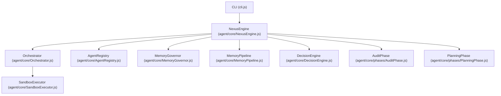
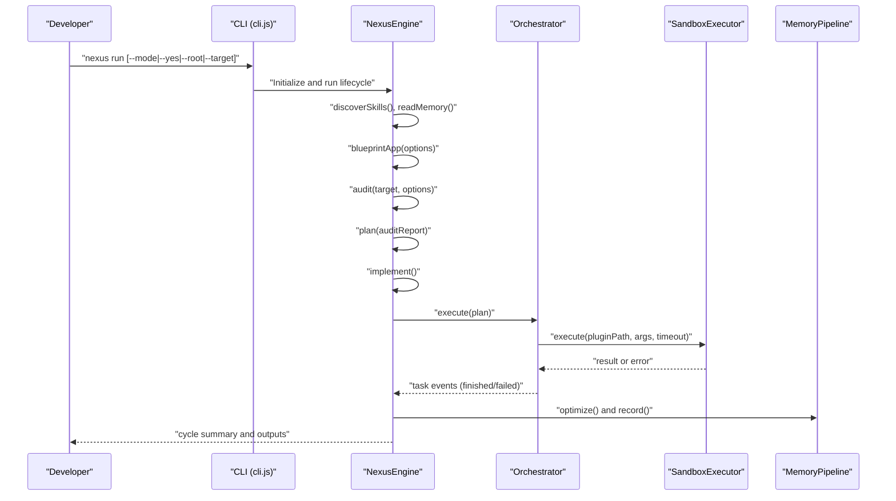
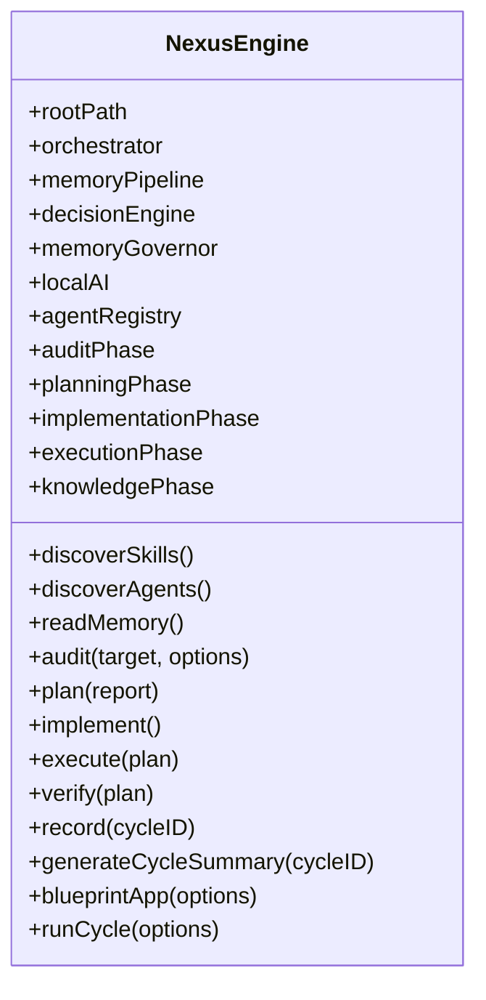
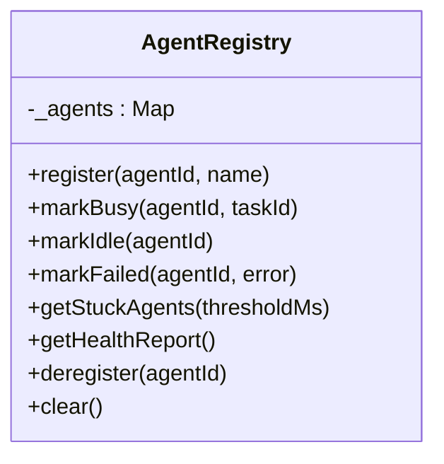
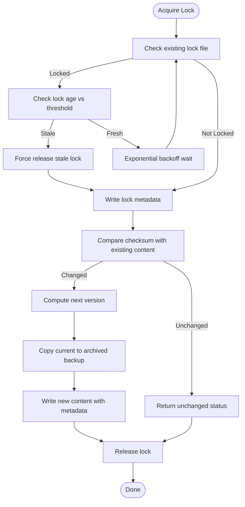
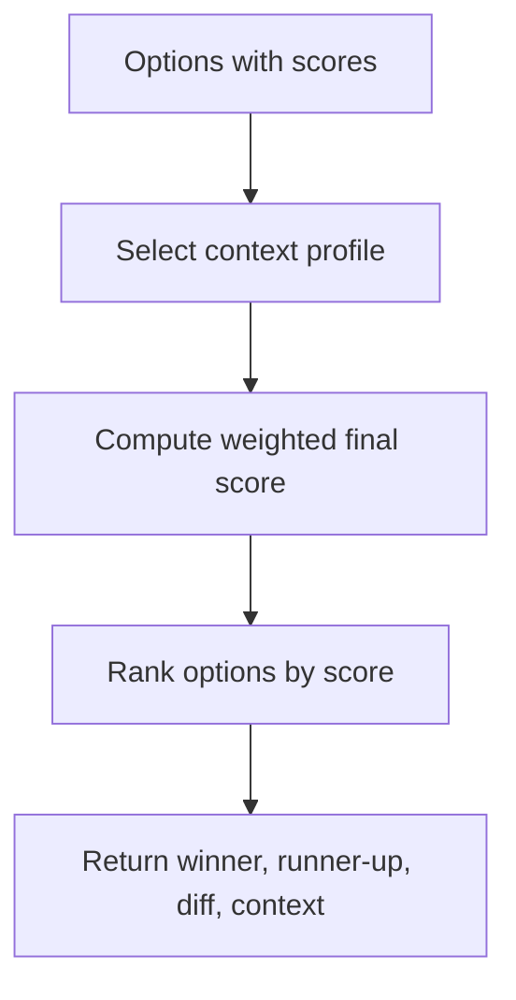
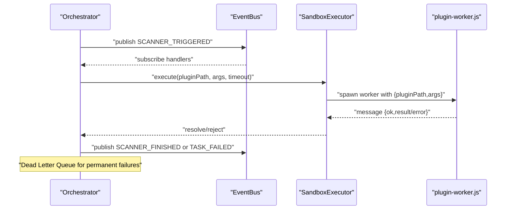
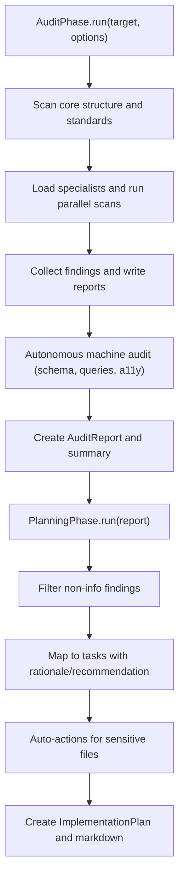
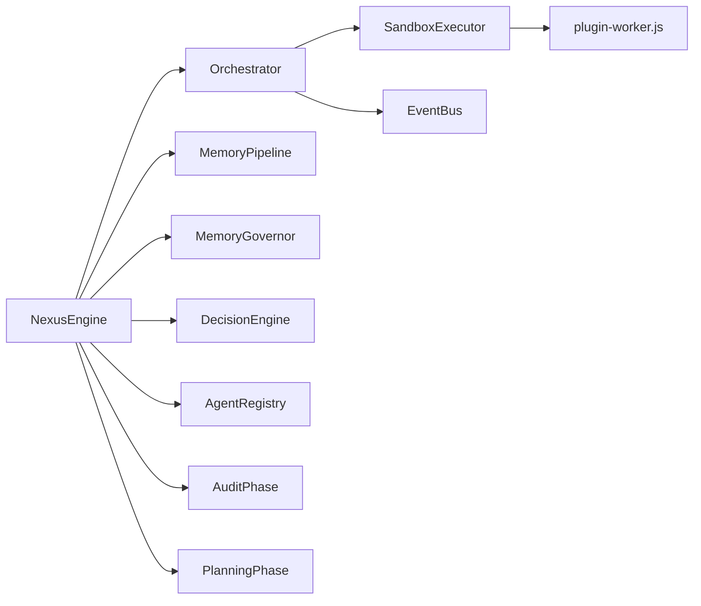

# Project Overview

<cite>
**Referenced Files in This Document**
- [README.md](file://README.md)
- [cli.js](file://cli.js)
- [agent/main.js](file://agent/main.js)
- [agent/core/NexusEngine.js](file://agent/core/NexusEngine.js)
- [agent/core/AgentRegistry.js](file://agent/core/AgentRegistry.js)
- [agent/core/MemoryGovernor.js](file://agent/core/MemoryGovernor.js)
- [agent/core/DecisionEngine.js](file://agent/core/DecisionEngine.js)
- [agent/core/Orchestrator.js](file://agent/core/Orchestrator.js)
- [agent/core/SandboxExecutor.js](file://agent/core/SandboxExecutor.js)
- [agent/core/MemoryPipeline.js](file://agent/core/MemoryPipeline.js)
- [agent/core/phases/AuditPhase.js](file://agent/core/phases/AuditPhase.js)
- [agent/core/phases/PlanningPhase.js](file://agent/core/phases/PlanningPhase.js)
- [package.json](file://package.json)
</cite>

## Table of Contents
1. [Introduction](#introduction)
2. [Project Structure](#project-structure)
3. [Core Components](#core-components)
4. [Architecture Overview](#architecture-overview)
5. [Detailed Component Analysis](#detailed-component-analysis)
6. [Dependency Analysis](#dependency-analysis)
7. [Performance Considerations](#performance-considerations)
8. [Troubleshooting Guide](#troubleshooting-guide)
9. [Conclusion](#conclusion)
10. [Appendices](#appendices)

## Introduction
Human-AI Nexus is an autonomous multi-agent AI system designed to automate software development through a structured, documentation-first lifecycle. It orchestrates specialized agents to audit codebases, propose actionable plans, generate and execute changes, and continuously distill institutional knowledge into a standardized “Golden HUB.” The system emphasizes stability, observability, and deterministic contracts, ensuring that no code is written without prior documentation and approval.

Key goals:
- Provide a repeatable, safe pipeline for autonomous development.
- Maintain a semantic memory backbone to evolve capabilities over time.
- Offer strong guardrails against runaway tasks, resource misuse, and data corruption.
- Enable both beginner-friendly guided modes and advanced expert workflows.

## Project Structure
At a high level, the project is organized around:
- CLI entrypoint delegating to the Nexus Engine.
- The Nexus Engine as the central orchestrator coordinating phases, agents, and memory.
- A modular set of core machines (specialists) and guardrails.
- A semantic memory pipeline for ingestion, archival, and retrieval.
- Public interfaces exposed via CLI commands and programmatic APIs.

**Diagram sources**
- [cli.js:10-39](file://cli.js#L10-L39)
- [agent/core/NexusEngine.js:60-137](file://agent/core/NexusEngine.js#L60-L137)
- [agent/core/Orchestrator.js:15-33](file://agent/core/Orchestrator.js#L15-L33)
- [agent/core/SandboxExecutor.js:9-14](file://agent/core/SandboxExecutor.js#L9-L14)
- [agent/core/AgentRegistry.js:6-124](file://agent/core/AgentRegistry.js#L6-L124)
- [agent/core/MemoryGovernor.js:6-136](file://agent/core/MemoryGovernor.js#L6-L136)
- [agent/core/MemoryPipeline.js:9-18](file://agent/core/MemoryPipeline.js#L9-L18)
- [agent/core/DecisionEngine.js:18-73](file://agent/core/DecisionEngine.js#L18-L73)
- [agent/core/phases/AuditPhase.js:8-189](file://agent/core/phases/AuditPhase.js#L8-L189)
- [agent/core/phases/PlanningPhase.js:8-73](file://agent/core/phases/PlanningPhase.js#L8-L73)

**Section sources**
- [README.md:101-125](file://README.md#L101-L125)
- [cli.js:10-39](file://cli.js#L10-L39)
- [agent/core/NexusEngine.js:60-137](file://agent/core/NexusEngine.js#L60-L137)

## Core Components
- Nexus Engine: Central orchestrator that initializes paths, registers specialists, coordinates lifecycle phases, and manages memory and observability.
- Agent Registry: Tracks agent health, detects stuck agents, and provides a health report.
- Memory Governor: Ensures safe, versioned writes with file locking and stale lock detection.
- Decision Engine: Resolves conflicts among agent suggestions using configurable weight profiles.
- Orchestrator: Routes tasks to sandbox executors, enforces timeouts, and maintains a Dead Letter Queue for permanent failures.
- Sandbox Executor: Executes agent plugins in a secure, isolated worker thread with path validation and manifest gating.
- Memory Pipeline: Archives, cleanses, and indexes knowledge for semantic retrieval and long-term storage.
- Audit Phase: Discovers and executes parallel scans, aggregates findings, and produces structured reports.
- Planning Phase: Translates audit findings into executable tasks with rationale and recommendations.

Public interfaces and parameters:
- CLI commands expose lifecycle operations (run, audit, distill, forge, think, review, status, dlq, sandbox) and options such as mode, yes, root, and target.
- Programmatic usage is available via exporting NexusEngine from agent/main.js.

Return values:
- Lifecycle methods return structured artifacts (AuditReport, ImplementationPlan) and write outputs to memory and documentation paths.

**Section sources**
- [agent/core/NexusEngine.js:60-137](file://agent/core/NexusEngine.js#L60-L137)
- [agent/core/AgentRegistry.js:6-124](file://agent/core/AgentRegistry.js#L6-L124)
- [agent/core/MemoryGovernor.js:6-136](file://agent/core/MemoryGovernor.js#L6-L136)
- [agent/core/DecisionEngine.js:18-73](file://agent/core/DecisionEngine.js#L18-L73)
- [agent/core/Orchestrator.js:15-136](file://agent/core/Orchestrator.js#L15-L136)
- [agent/core/SandboxExecutor.js:9-80](file://agent/core/SandboxExecutor.js#L9-L80)
- [agent/core/MemoryPipeline.js:9-200](file://agent/core/MemoryPipeline.js#L9-L200)
- [agent/core/phases/AuditPhase.js:8-189](file://agent/core/phases/AuditPhase.js#L8-L189)
- [agent/core/phases/PlanningPhase.js:8-73](file://agent/core/phases/PlanningPhase.js#L8-L73)
- [agent/main.js:19-302](file://agent/main.js#L19-L302)
- [cli.js:10-68](file://cli.js#L10-L68)

## Architecture Overview
The system follows a modular, phase-based lifecycle with strong isolation and observability:
- CLI delegates to Nexus Engine.
- Nexus Engine initializes core machines and paths, then runs lifecycle phases.
- Orchestrator publishes tasks and coordinates agent execution via a sandbox executor.
- MemoryGovernor and MemoryPipeline protect and enrich knowledge.
- DecisionEngine resolves multi-agent decisions.
- AgentRegistry monitors agent health and detects stuck agents.

**Diagram sources**
- [cli.js:10-39](file://cli.js#L10-L39)
- [agent/main.js:36-121](file://agent/main.js#L36-L121)
- [agent/core/NexusEngine.js:310-395](file://agent/core/NexusEngine.js#L310-L395)
- [agent/core/Orchestrator.js:167-200](file://agent/core/Orchestrator.js#L167-L200)
- [agent/core/SandboxExecutor.js:16-76](file://agent/core/SandboxExecutor.js#L16-L76)
- [agent/core/MemoryPipeline.js:20-27](file://agent/core/MemoryPipeline.js#L20-L27)

## Detailed Component Analysis

### Nexus Engine
NexusEngine is the central coordinator that:
- Initializes resource paths and lazy-loads heavy components.
- Manages lifecycle phases (audit, plan, implement, execute, verify, record, summarize).
- Integrates memory systems, semantic search, and local AI.
- Provides safety nets like timeouts and error logging.

Key responsibilities:
- Lifecycle orchestration and state transitions.
- Skill and agent discovery.
- Memory access and semantic tagging.
- Blueprint generation for new projects.

**Diagram sources**
- [agent/core/NexusEngine.js:60-137](file://agent/core/NexusEngine.js#L60-L137)
- [agent/core/NexusEngine.js:171-200](file://agent/core/NexusEngine.js#L171-L200)
- [agent/core/NexusEngine.js:310-395](file://agent/core/NexusEngine.js#L310-L395)

**Section sources**
- [agent/core/NexusEngine.js:60-137](file://agent/core/NexusEngine.js#L60-L137)
- [agent/core/NexusEngine.js:171-200](file://agent/core/NexusEngine.js#L171-L200)
- [agent/core/NexusEngine.js:310-395](file://agent/core/NexusEngine.js#L310-L395)

### Agent Registry
Tracks agent health and activity, detecting stuck agents and providing a health report.

**Diagram sources**
- [agent/core/AgentRegistry.js:6-124](file://agent/core/AgentRegistry.js#L6-L124)

**Section sources**
- [agent/core/AgentRegistry.js:6-124](file://agent/core/AgentRegistry.js#L6-L124)

### Memory Governor
Ensures safe, versioned writes with file locks and stale lock detection to prevent corruption and deadlocks.

**Diagram sources**
- [agent/core/MemoryGovernor.js:31-132](file://agent/core/MemoryGovernor.js#L31-L132)

**Section sources**
- [agent/core/MemoryGovernor.js:6-136](file://agent/core/MemoryGovernor.js#L6-L136)

### Decision Engine
Resolves conflicts between agent suggestions using configurable weight profiles tailored to contexts (e.g., security, performance, learning).

**Diagram sources**
- [agent/core/DecisionEngine.js:29-61](file://agent/core/DecisionEngine.js#L29-L61)

**Section sources**
- [agent/core/DecisionEngine.js:18-73](file://agent/core/DecisionEngine.js#L18-L73)

### Orchestrator and Sandbox Executor
Orchestrator routes tasks to sandbox executors, enforces timeouts, retries, and persists permanent failures to a Dead Letter Queue. SandboxExecutor validates plugin paths and executes them in a worker thread with a manifest gate.

**Diagram sources**
- [agent/core/Orchestrator.js:58-136](file://agent/core/Orchestrator.js#L58-L136)
- [agent/core/SandboxExecutor.js:16-76](file://agent/core/SandboxExecutor.js#L16-L76)

**Section sources**
- [agent/core/Orchestrator.js:15-200](file://agent/core/Orchestrator.js#L15-L200)
- [agent/core/SandboxExecutor.js:9-80](file://agent/core/SandboxExecutor.js#L9-L80)

### Audit and Planning Phases
AuditPhase discovers and runs parallel scans, aggregates findings, and writes structured reports. PlanningPhase converts findings into actionable tasks with rationale and recommendations.

**Diagram sources**
- [agent/core/phases/AuditPhase.js:9-163](file://agent/core/phases/AuditPhase.js#L9-L163)
- [agent/core/phases/PlanningPhase.js:9-69](file://agent/core/phases/PlanningPhase.js#L9-L69)

**Section sources**
- [agent/core/phases/AuditPhase.js:8-189](file://agent/core/phases/AuditPhase.js#L8-L189)
- [agent/core/phases/PlanningPhase.js:8-73](file://agent/core/phases/PlanningPhase.js#L8-L73)

### Conceptual Overview
Beginners can rely on guided modes and interactive approvals, while experts can run fully automated cycles with explicit options. The system’s documentation-first approach ensures transparency and traceability at every stage.

Practical examples:
- Run a full cycle: nexus run [--mode efficient|learning] [--yes] [--root path] [--target path]
- Audit only: nexus audit <target>
- Inspect system health: nexus status
- View permanent failures: nexus dlq
- Distill knowledge: nexus distill [--rack name]
- Forge a new scanner: nexus forge <Name> <wisdom.md>
- Ask local AI: nexus think "<query>" or nexus review <file>

**Section sources**
- [agent/main.js:36-121](file://agent/main.js#L36-L121)
- [agent/main.js:122-301](file://agent/main.js#L122-L301)
- [README.md:169-203](file://README.md#L169-L203)

## Dependency Analysis
High-level dependencies among core components:

**Diagram sources**
- [agent/core/NexusEngine.js:110-135](file://agent/core/NexusEngine.js#L110-L135)
- [agent/core/Orchestrator.js:15-33](file://agent/core/Orchestrator.js#L15-L33)
- [agent/core/SandboxExecutor.js:45-46](file://agent/core/SandboxExecutor.js#L45-L46)

**Section sources**
- [agent/core/NexusEngine.js:110-135](file://agent/core/NexusEngine.js#L110-L135)
- [agent/core/Orchestrator.js:15-33](file://agent/core/Orchestrator.js#L15-L33)

## Performance Considerations
- Concurrency control: ParallelRunner limits concurrent scans to prevent OOM on constrained hardware.
- Stale lock detection: MemoryGovernor prevents deadlocks with stale locks and exponential backoff.
- Circuit breaker: Orchestrator uses Promise settlement patterns to avoid crashing on partial failures.
- Timeout enforcement: Orchestrator and SandboxExecutor enforce timeouts to prevent hanging tasks.
- Versioned writes: MemoryPipeline backs up before overwriting to avoid data loss.

[No sources needed since this section provides general guidance]

## Troubleshooting Guide
Common issues and remedies:
- Stuck agents: Use nexus status to inspect agent health and stuck agents; address bottlenecks or timeouts.
- Permanent failures: Check nexus dlq for failed tasks and investigate root causes.
- Memory corruption or deadlocks: Verify stale locks and ensure proper lock release; review MemoryGovernor logs.
- Hanging tasks: Confirm Orchestrator timeouts and SandboxExecutor limits are effective.
- Knowledge not updating: Run nexus distill and verify MemoryPipeline archives and indexes.

**Section sources**
- [agent/core/AgentRegistry.js:80-104](file://agent/core/AgentRegistry.js#L80-L104)
- [agent/core/Orchestrator.js:141-161](file://agent/core/Orchestrator.js#L141-L161)
- [agent/core/MemoryGovernor.js:31-84](file://agent/core/MemoryGovernor.js#L31-L84)
- [agent/core/MemoryPipeline.js:20-96](file://agent/core/MemoryPipeline.js#L20-L96)

## Conclusion
Human-AI Nexus provides a robust, scalable framework for autonomous software development. Its modular architecture, strong guardrails, and semantic memory pipeline enable teams to maintain quality, safety, and institutional knowledge across projects. Whether used interactively or in CI/CD, the system offers predictable outcomes and deep observability.

[No sources needed since this section summarizes without analyzing specific files]

## Appendices

### Public Interfaces and Parameters
- CLI entrypoint delegates to Nexus Engine for lifecycle commands.
- Programmatic export of NexusEngine enables library usage.

**Section sources**
- [cli.js:10-39](file://cli.js#L10-L39)
- [agent/main.js:304-305](file://agent/main.js#L304-L305)

### Configuration and Environment
- Node.js runtime requirement and dependencies are defined in package.json.
- CLI supports platform-specific spawning and argument handling.

**Section sources**
- [package.json:36-57](file://package.json#L36-L57)
- [cli.js:21-30](file://cli.js#L21-L30)