# Testing Framework

<cite>
**Referenced Files in This Document**
- [ci.yml](file://.github/workflows/ci.yml)
- [npm-publish.yml](file://.github/workflows/npm-publish.yml)
- [package.json](file://package.json)
- [playwright.config.js](file://playwright.config.js)
- [README.md](file://README.md)
- [agent/main.js](file://agent/main.js)
- [agent/core/NexusEngine.js](file://agent/core/NexusEngine.js)
- [agent/core/MemoryGovernor.js](file://agent/core/MemoryGovernor.js)
- [agent/core/Orchestrator.js](file://agent/core/Orchestrator.js)
- [agent/core/MemoryPipeline.js](file://agent/core/MemoryPipeline.js)
- [agent/core/SandboxExecutor.js](file://agent/core/SandboxExecutor.js)
- [agent/scripts/tdd_automated_loop.js](file://agent/scripts/tdd_automated_loop.js)
- [agent/tools/TDDGuard.js](file://agent/tools/TDDGuard.js)
- [agent/tools/TDDScaffolder.js](file://agent/tools/TDDScaffolder.js)
- [agent/tools/Validator.js](file://agent/tools/Validator.js)
- [tests/TDD/nexus-engine.test.js](file://tests/TDD/nexus-engine.test.js)
- [tests/TDD/MemoryGovernor.test.js](file://tests/TDD/MemoryGovernor.test.js)
- [tests/TDD/Orchestrator.test.js](file://tests/TDD/Orchestrator.test.js)
- [tests/TDD/EvolutionPiper.test.js](file://tests/TDD/EvolutionPiper.test.js)
- [tests/TDD/distiller.test.js](file://tests/TDD/distiller.test.js)
- [tests/TDD/TDDGuard.test.js](file://tests/TDD/TDDGuard.test.js)
- [tests/TDD/similarity.test.js](file://tests/TDD/similarity.test.js)
- [tests/TDD/runner.js](file://tests/TDD/runner.js)
- [tests/TDD/sandbox-master-runner.js](file://tests/TDD/sandbox-master-runner.js)
- [tests/TDD/SandboxProjectSetup.js](file://tests/TDD/SandboxProjectSetup.js)
- [tests/TDD/setup_dynamic_section.js](file://tests/TDD/setup_dynamic_section.js)
- [tests/TDD/phase1_testing.js](file://tests/TDD/phase1_testing.js)
- [tests/TDD/setup_section2.js](file://tests/TDD/setup_section2.js)
- [tests/TDD/setup_section3.js](file://tests/TDD/setup_section3.js)
- [tests/TDD/upgrade_to_tall.js](file://tests/TDD/upgrade_to_tall.js)
- [tests/TDD/100-projects-data.js](file://tests/TDD/100-projects-data.js)
- [tests/pipeline_internal_test.js](file://tests/pipeline_internal_test.js)
- [tests/test-vector.js](file://tests/test-vector.js)
- [e2e/example.spec.js](file://e2e/example.spec.js)
- [memory/distilled/tdd/NEXUS_TDD_PROJECT_1_LOG.MD](file://memory/distilled/tdd/NEXUS_TDD_PROJECT_1_LOG.MD)
- [memory/distilled/tdd/NEXUS_TDD_INSIGHTS.MD](file://memory/distilled/tdd/NEXUS_TDD_INSIGHTS.MD)
- [memory/distilled/tdd/NEXUS_TDD_IRON_LAWS.md](file://memory/distilled/tdd/NEXUS_TDD_IRON_LAWS.md)
- [memory/distilled/database/NEXUS_DATABASE_TESTING.md](file://memory/distilled/database/NEXUS_DATABASE_TESTING.md)
- [memory/distilled/performance/NEXUS_CORE_MODULARIZATION.md](file://memory/distilled/performance/NEXUS_CORE_MODULARIZATION.md)
- [memory/distilled/frontend/NEXUS_SANDBOX_UI_FINDINGS.md](file://memory/distilled/frontend/NEXUS_SANDBOX_UI_FINDINGS.md)
- [memory/distilled/core/NEXUS_SANDBOX_PIPELINE.MD](file://memory/distilled/core/NEXUS_SANDBOX_PIPELINE.MD)
- [memory/distilled/core/NEXUS_PIPELINE_REMEDIATION_REPORT.MD](file://memory/distilled/core/NEXUS_PIPELINE_REMEDIATION_REPORT.MD)
- [memory/distilled/core/NEXUS_EXTREME_PERFORMANCE_ROADMAP.md](file://memory/distilled/core/NEXUS_EXTREME_PERFORMANCE_ROADMAP.md)
- [memory/distilled/core/NEXUS_MULTIAGENT_STABILITY_GUIDE.md](file://memory/distilled/core/NEXUS_MULTIAGENT_STABILITY_GUIDE.md)
- [memory/distilled/core/NEXUS_MULTI_AGENT_STABILIZATION_PLAN.md](file://memory/distilled/core/NEXUS_MULTI_AGENT_STABILIZATION_PLAN.md)
- [memory/distilled/core/NEXUS_SANDBOX_Review.md](file://memory/distilled/core/NEXUS_SANDBOX_Review.md)
- [memory/distilled/core/NEXUS_SANDBOX_PIPELINE_EXTREME_AUDIT.md](file://memory/distilled/core/NEXUS_SANDBOX_PIPELINE_EXTREME_AUDIT.md)
- [memory/distilled/core/NEXUS_AUDIT_SUMMARY_10_LOOP_SCAN.md](file://memory/distilled/core/NEXUS_AUDIT_SUMMARY_10_LOOP_SCAN.md)
- [memory/distilled/core/NEXUS_AUDIT_V320_AUTONOMOUS_READINESS.md](file://memory/distilled/core/NEXUS_AUDIT_V320_AUTONOMOUS_READINESS.md)
- [memory/distilled/core/NEXUS_RECORD_NEXUS_AUTONOMOUS_SANDBOX_PIPELINE.md](file://memory/distilled/core/NEXUS_RECORD_NEXUS_AUTONOMOUS_SANDBOX_PIPELINE.md)
- [memory/distilled/core/NEXUS_RECORD_NEXUS_SEMANTIC_MASS_UPDATE_HUB_SKILL.md](file://memory/distilled/core/NEXUS_RECORD_NEXUS_SEMANTIC_MASS_UPDATE_HUB_SKILL.md)
- [memory/distilled/core/NEXUS_AUDIT_SUMMARY_AUDIT_1778479692344.MD](file://memory/distilled/core/NEXUS_AUDIT_SUMMARY_AUDIT_1778479692344.MD)
- [memory/distilled/core/NEXUS_AUDIT_SUMMARY_AUDIT_1778660095718.MD](file://memory/distilled/core/NEXUS_AUDIT_SUMMARY_AUDIT_1778660095718.MD)
- [memory/distilled/core/NEXUS_AUDIT_SUMMARY_AUDIT_1778912740298.MD](file://memory/distilled/core/NEXUS_AUDIT_SUMMARY_AUDIT_1778912740298.MD)
- [memory/distilled/core/NEXUS_AUDIT_SUMMARY_AUDIT_1778912740611.MD](file://memory/distilled/core/NEXUS_AUDIT_SUMMARY_AUDIT_1778912740611.MD)
- [memory/distilled/core/NEXUS_AUDIT_SUMMARY_AUDIT_1778912740711.MD](file://memory/distilled/core/NEXUS_AUDIT_SUMMARY_AUDIT_1778912740711.MD)
- [memory/distilled/core/NEXUS_AUDIT_SUMMARY_AUDIT_1779702317598.MD](file://memory/distilled/core/NEXUS_AUDIT_SUMMARY_AUDIT_1779702317598.MD)
- [memory/distilled/core/NEXUS_REPORT_CYBER_SECURITY_AUDIT_1778660095718.MD](file://memory/distilled/core/NEXUS_REPORT_CYBER_SECURITY_AUDIT_1778660095718.MD)
- [memory/distilled/core/NEXUS_REPORT_CYBER_SECURITY_AUDIT_1779702317598.MD](file://memory/distilled/core/NEXUS_REPORT_CYBER_SECURITY_AUDIT_1779702317598.MD)
- [memory/distilled/core/NEXUS_REPORT_DATABASE_ARCHITECT_AUDIT_1778660095718.MD](file://memory/distilled/core/NEXUS_REPORT_DATABASE_ARCHITECT_AUDIT_1778660095718.MD)
- [memory/distilled/core/NEXUS_REPORT_DATABASE_ARCHITECT_AUDIT_1779702317598.MD](file://memory/distilled/core/NEXUS_REPORT_DATABASE_ARCHITECT_AUDIT_1779702317598.MD)
- [memory/distilled/core/NEXUS_REPORT_DOCUMENTATION_ARCHITECT_AUDIT_1778660095718.MD](file://memory/distilled/core/NEXUS_REPORT_DOCUMENTATION_ARCHITECT_AUDIT_1778660095718.MD)
- [memory/distilled/core/NEXUS_REPORT_DOCUMENTATION_ARCHITECT_AUDIT_1779702317598.MD](file://memory/distilled/core/NEXUS_REPORT_DOCUMENTATION_ARCHITECT_AUDIT_1779702317598.MD)
- [memory/distilled/core/NEXUS_REPORT_SEO_PERFORMANCE_SPECIALIST_AUDIT_1778660095718.MD](file://memory/distilled/core/NEXUS_REPORT_SEO_PERFORMANCE_SPECIALIST_AUDIT_1778660095718.MD)
- [memory/distilled/core/NEXUS_REPORT_SEO_PERFORMANCE_SPECIALIST_AUDIT_1779702317598.MD](file://memory/distilled/core/NEXUS_REPORT_SEO_PERFORMANCE_SPECIALIST_AUDIT_1779702317598.MD)
- [memory/distilled/core/NEXUS_REPORT_UX_ENGINEER_AUDIT_1778660095718.MD](file://memory/distilled/core/NEXUS_REPORT_UX_ENGINEER_AUDIT_1778660095718.MD)
- [memory/distilled/core/NEXUS_REPORT_UX_ENGINEER_AUDIT_1779702317598.MD](file://memory/distilled/core/NEXUS_REPORT_UX_ENGINEER_AUDIT_1779702317598.MD)
- [memory/distilled/core/NEXUS_REPORT_VCS_ARCHITECT_AUDIT_1778660095718.MD](file://memory/distilled/core/NEXUS_REPORT_VCS_ARCHITECT_AUDIT_1778660095718.MD)
- [memory/distilled/core/NEXUS_REPORT_VCS_ARCHITECT_AUDIT_1779702317598.MD](file://memory/distilled/core/NEXUS_REPORT_VCS_ARCHITECT_AUDIT_1779702317598.MD)
- [memory/distilled/core/NEXUS_AUDIT_NEXUS_HARDENING_SYNC.md](file://memory/distilled/core/NEXUS_AUDIT_NEXUS_HARDENING_SYNC.md)
- [memory/distilled/core/NEXUS_AUDIT_NEXUS_HARDENING_SYNC.md](file://memory/distilled/core/NEXUS_AUDIT_NEXUS_HARDENING_SYNC.md)
- [memory/distilled/core/NEXUS_AUDIT_V320_AUTONOMOUS_READINESS.md](file://memory/distilled/core/NEXUS_AUDIT_V320_AUTONOMOUS_READINESS.md)
- [memory/distilled/core/NEXUS_AUDIT_SUMMARY_10_LOOP_SCAN.md](file://memory/distilled/core/NEXUS_AUDIT_SUMMARY_10_LOOP_SCAN.md)
- [memory/distilled/core/NEXUS_SANDBOX_PIPELINE_EXTREME_AUDIT.md](file://memory/distilled/core/NEXUS_SANDBOX_PIPELINE_EXTREME_AUDIT.md)
- [memory/distilled/core/NEXUS_PIPELINE_REMEDIATION_REPORT.MD](file://memory/distilled/core/NEXUS_PIPELINE_REMEDIATION_REPORT.MD)
- [memory/distilled/core/NEXUS_RECORD_NEXUS_AUTONOMOUS_SANDBOX_PIPELINE.md](file://memory/distilled/core/NEXUS_RECORD_NEXUS_AUTONOMOUS_SANDBOX_PIPELINE.md)
- [memory/distilled/core/NEXUS_RECORD_NEXUS_SEMANTIC_MASS_UPDATE_HUB_SKILL.md](file://memory/distilled/core/NEXUS_RECORD_NEXUS_SEMANTIC_MASS_UPDATE_HUB_SKILL.md)
- [memory/distilled/core/NEXUS_MULTIAGENT_STABILITY_GUIDE.md](file://memory/distilled/core/NEXUS_MULTIAGENT_STABILITY_GUIDE.md)
- [memory/distilled/core/NEXUS_MULTI_AGENT_STABILIZATION_PLAN.md](file://memory/distilled/core/NEXUS_MULTI_AGENT_STABILIZATION_PLAN.md)
- [memory/distilled/core/NEXUS_SANDBOX_Review.md](file://memory/distilled/core/NEXUS_SANDBOX_Review.md)
- [memory/distilled/core/NEXUS_EXTREME_PERFORMANCE_ROADMAP.md](file://memory/distilled/core/NEXUS_EXTREME_PERFORMANCE_ROADMAP.md)
- [memory/distilled/core/NEXUS_SANDBOX_PIPELINE.MD](file://memory/distilled/core/NEXUS_SANDBOX_PIPELINE.MD)
- [memory/distilled/core/NEXUS_INTERNAL_WORKFLOW.MD](file://memory/distilled/core/NEXUS_INTERNAL_WORKFLOW.MD)
- [memory/distilled/core/NEXUS_WORKFLOW.MD](file://memory/distilled/core/NEXUS_WORKFLOW.MD)
- [memory/distilled/core/NEXUS_SUPERPOWERS_WORKFLOW.md](file://memory/distilled/core/NEXUS_SUPERPOWERS_WORKFLOW.md)
- [memory/distilled/core/NEXUS_STANDARD_WORKFLOW_PROJECT_TES.MD](file://memory/distilled/core/NEXUS_STANDARD_WORKFLOW_PROJECT_TES.MD)
- [memory/distilled/core/NEXUS_TDD_IRON_LAWS.md](file://memory/distilled/core/NEXUS_TDD_IRON_LAWS.md)
- [memory/distilled/core/NEXUS_TDD_PROJECT_1_LOG.MD](file://memory/distilled/core/NEXUS_TDD_PROJECT_1_LOG.MD)
- [memory/distilled/core/NEXUS_TDD_INSIGHTS.MD](file://memory/distilled/core/NEXUS_TDD_INSIGHTS.MD)
- [memory/distilled/core/NEXUS_TESTING_ANTI_PATTERNS.MD](file://memory/distilled/core/NEXUS_TESTING_ANTI_PATTERNS.MD)
- [memory/distilled/core/NEXUS_TESTING_TDD.MD](file://memory/distilled/core/NEXUS_TESTING_TDD.MD)
- [memory/distilled/core/NEXUS_ZERO_FLAWS_STANDARDS.MD](file://memory/distilled/core/NEXUS_ZERO_FLAWS_STANDARDS.MD)
- [memory/distilled/core/NEXUS_CONTRACTS.MD](file://memory/distilled/core/NEXUS_CONTRACTS.MD)
- [memory/distilled/core/NEXUS_CORE_PRINCIPLES.md](file://memory/distilled/core/NEXUS_CORE_PRINCIPLES.md)
- [memory/distilled/core/NEXUS_PROJECT_MATURITY_STANDARDS.MD](file://memory/distilled/core/NEXUS_PROJECT_MATURITY_STANDARDS.MD)
- [memory/distilled/core/NEXUS_COLLABORATION_CONTRACT.MD](file://memory/distilled/core/NEXUS_COLLABORATION_CONTRACT.MD)
- [memory/distilled/core/NEXUS_DATABASE_STANDARDS.md](file://memory/distilled/core/NEXUS_DATABASE_STANDARDS.md)
- [memory/distilled/core/NEXUS_DESIGN_STANDARDS.MD](file://memory/distilled/core/NEXUS_DESIGN_STANDARDS.MD)
- [memory/distilled/core/NEXUS_INSTALLATION_WORKFLOW.MD](file://memory/distilled/core/NEXUS_INSTALLATION_WORKFLOW.MD)
- [memory/distilled/core/NEXUS_INTEGRATION_ALGORITHM.MD](file://memory/distilled/core/NEXUS_INTEGRATION_ALGORITHM.MD)
- [memory/distilled/core/NEXUS_LIVEWIRE_STANDARDS.MD](file://memory/distilled/core/NEXUS_LIVEWIRE_STANDARDS.MD)
- [memory/distilled/core/NEXUS_MEDIA_PROTOCOL.MD](file://memory/distilled/core/NEXUS_MEDIA_PROTOCOL.MD)
- [memory/distilled/core/NEXUS_ORCHESTRATOR_GOLDEN_PROTOCOL.MD](file://memory/distilled/core/NEXUS_ORCHESTRATOR_GOLDEN_PROTOCOL.MD)
- [memory/distilled/core/NEXUS_INTERNAL_WORKFLOW.MD](file://memory/distilled/core/NEXUS_INTERNAL_WORKFLOW.MD)
- [memory/distilled/core/NEXUS_WORKFLOW.MD](file://memory/distilled/core/NEXUS_WORKFLOW.MD)
- [memory/distilled/core/NEXUS_SUPERPOWERS_WORKFLOW.md](file://memory/distilled/core/NEXUS_SUPERPOWERS_WORKFLOW.md)
- [memory/distilled/core/NEXUS_STANDARD_WORKFLOW_PROJECT_TES.MD](file://memory/distilled/core/NEXUS_STANDARD_WORKFLOW_PROJECT_TES.MD)
- [memory/distilled/core/NEXUS_TDD_IRON_LAWS.md](file://memory/distilled/core/NEXUS_TDD_IRON_LAWS.md)
- [memory/distilled/core/NEXUS_TDD_PROJECT_1_LOG.MD](file://memory/distilled/core/NEXUS_TDD_PROJECT_1_LOG.MD)
- [memory/distilled/core/NEXUS_TDD_INSIGHTS.MD](file://memory/distilled/core/NEXUS_TDD_INSIGHTS.MD)
- [memory/distilled/core/NEXUS_TESTING_ANTI_PATTERNS.MD](file://memory/distilled/core/NEXUS_TESTING_ANTI_PATTERNS.MD)
- [memory/distilled/core/NEXUS_TESTING_TDD.MD](file://memory/distilled/core/NEXUS_TESTING_TDD.MD)
- [memory/distilled/core/NEXUS_ZERO_FLAWS_STANDARDS.MD](file://memory/distilled/core/NEXUS_ZERO_FLAWS_STANDARDS.MD)
- [memory/distilled/core/NEXUS_CONTRACTS.MD](file://memory/distilled/core/NEXUS_CONTRACTS.MD)
- [memory/distilled/core/NEXUS_CORE_PRINCIPLES.md](file://memory/distilled/core/NEXUS_CORE_PRINCIPLES.md)
- [memory/distilled/core/NEXUS_PROJECT_MATURITY_STANDARDS.MD](file://memory/distilled/core/NEXUS_PROJECT_MATURITY_STANDARDS.MD)
- [memory/distilled/core/NEXUS_COLLABORATION_CONTRACT.MD](file://memory/distilled/core/NEXUS_COLLABORATION_CONTRACT.MD)
- [memory/distilled/core/NEXUS_DATABASE_STANDARDS.md](file://memory/distilled/core/NEXUS_DATABASE_STANDARDS.md)
- [memory/distilled/core/NEXUS_DESIGN_STANDARDS.MD](file://memory/distilled/core/NEXUS_DESIGN_STANDARDS.MD)
- [memory/distilled/core/NEXUS_INSTALLATION_WORKFLOW.MD](file://memory/distilled/core/NEXUS_INSTALLATION_WORKFLOW.MD)
- [memory/distilled/core/NEXUS_INTEGRATION_ALGORITHM.MD](file://memory/distilled/core/NEXUS_INTEGRATION_ALGORITHM.MD)
- [memory/distilled/core/NEXUS_LIVEWIRE_STANDARDS.MD](file://memory/distilled/core/NEXUS_LIVEWIRE_STANDARDS.MD)
- [memory/distilled/core/NEXUS_MEDIA_PROTOCOL.MD](file://memory/distilled/core/NEXUS_MEDIA_PROTOCOL.MD)
- [memory/distilled/core/NEXUS_ORCHESTRATOR_GOLDEN_PROTOCOL.MD](file://memory/distilled/core/NEXUS_ORCHESTRATOR_GOLDEN_PROTOCOL.MD)
</cite>

## Update Summary
**Changes Made**
- Enhanced sandbox project setup with improved template management and DRY architecture
- Expanded pipeline testing with dynamic section handling for scalable TDD workflows
- Added resource monitoring and stress management capabilities for production-like testing
- Implemented unified sandbox project setup module replacing duplicated code across sections
- Introduced 100-project testing framework with structured section-based testing approach

## Table of Contents
1. [Introduction](#introduction)
2. [Project Structure](#project-structure)
3. [Core Components](#core-components)
4. [Architecture Overview](#architecture-overview)
5. [Detailed Component Analysis](#detailed-component-analysis)
6. [Enhanced Testing Infrastructure](#enhanced-testing-infrastructure)
7. [Dynamic Section Handling](#dynamic-section-handling)
8. [Dependency Analysis](#dependency-analysis)
9. [Performance Considerations](#performance-considerations)
10. [Troubleshooting Guide](#troubleshooting-guide)
11. [Conclusion](#conclusion)
12. [Appendices](#appendices)

## Introduction
This document describes the NEXUS AI testing framework and methodologies. It explains the Test-Driven Development (TDD) implementation, automated testing pipelines, and quality assurance processes. It covers Nexus Engine testing, Orchestrator validation, and Memory Governor testing procedures. It also documents the testing infrastructure including sandbox environments, pipeline tests, and vector-based testing approaches. Finally, it provides guidelines for writing effective tests, continuous integration workflows, and performance testing strategies, along with the tools and best practices used throughout the development lifecycle.

**Updated** Enhanced with improved sandbox project setup capabilities, expanded pipeline testing, and dynamic section handling improvements in TDD testing framework.

## Project Structure
The testing system is organized around:
- CI/CD workflows under .github/workflows
- Core agent modules under agent/core implementing Nexus Engine, Orchestrator, MemoryGovernor, and related components
- TDD test suites under tests/TDD with enhanced sandbox infrastructure
- Pipeline and sandbox tests under tests/ with dynamic section handling
- E2E tests under e2e/
- Documentation and distilled knowledge under memory/distilled

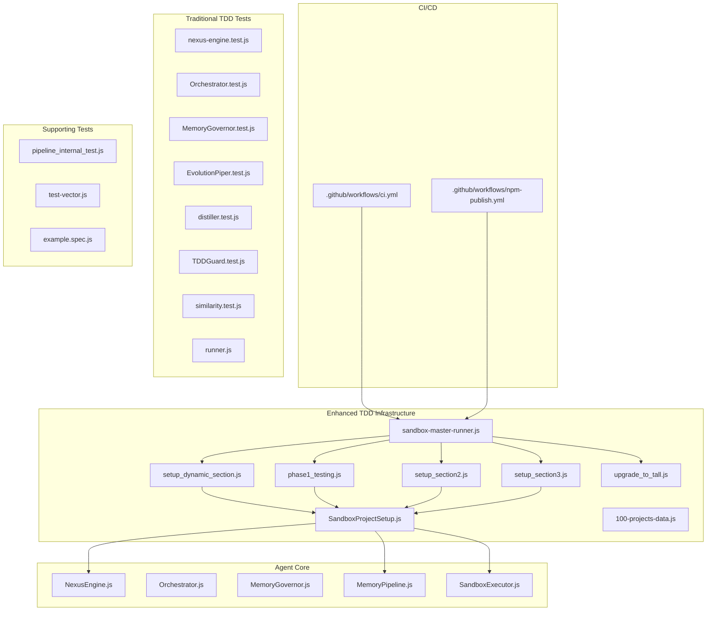

**Diagram sources**
- [.github/workflows/ci.yml](file://.github/workflows/ci.yml)
- [.github/workflows/npm-publish.yml](file://.github/workflows/npm-publish.yml)
- [agent/core/NexusEngine.js](file://agent/core/NexusEngine.js)
- [agent/core/Orchestrator.js](file://agent/core/Orchestrator.js)
- [agent/core/MemoryGovernor.js](file://agent/core/MemoryGovernor.js)
- [agent/core/MemoryPipeline.js](file://agent/core/MemoryPipeline.js)
- [agent/core/SandboxExecutor.js](file://agent/core/SandboxExecutor.js)
- [tests/TDD/SandboxProjectSetup.js](file://tests/TDD/SandboxProjectSetup.js)
- [tests/TDD/setup_dynamic_section.js](file://tests/TDD/setup_dynamic_section.js)
- [tests/TDD/phase1_testing.js](file://tests/TDD/phase1_testing.js)
- [tests/TDD/setup_section2.js](file://tests/TDD/setup_section2.js)
- [tests/TDD/setup_section3.js](file://tests/TDD/setup_section3.js)
- [tests/TDD/sandbox-master-runner.js](file://tests/TDD/sandbox-master-runner.js)
- [tests/TDD/upgrade_to_tall.js](file://tests/TDD/upgrade_to_tall.js)
- [tests/TDD/100-projects-data.js](file://tests/TDD/100-projects-data.js)
- [tests/TDD/nexus-engine.test.js](file://tests/TDD/nexus-engine.test.js)
- [tests/TDD/Orchestrator.test.js](file://tests/TDD/Orchestrator.test.js)
- [tests/TDD/MemoryGovernor.test.js](file://tests/TDD/MemoryGovernor.test.js)
- [tests/TDD/EvolutionPiper.test.js](file://tests/TDD/EvolutionPiper.test.js)
- [tests/TDD/distiller.test.js](file://tests/TDD/distiller.test.js)
- [tests/TDD/TDDGuard.test.js](file://tests/TDD/TDDGuard.test.js)
- [tests/TDD/similarity.test.js](file://tests/TDD/similarity.test.js)
- [tests/TDD/runner.js](file://tests/TDD/runner.js)
- [tests/pipeline_internal_test.js](file://tests/pipeline_internal_test.js)
- [tests/test-vector.js](file://tests/test-vector.js)
- [e2e/example.spec.js](file://e2e/example.spec.js)

**Section sources**
- [.github/workflows/ci.yml](file://.github/workflows/ci.yml)
- [.github/workflows/npm-publish.yml](file://.github/workflows/npm-publish.yml)
- [package.json](file://package.json)
- [playwright.config.js](file://playwright.config.js)
- [README.md](file://README.md)

## Core Components
- Nexus Engine: Central reasoning and orchestration module tested via dedicated unit tests.
- Orchestrator: Coordinates tasks and phases; validated through targeted unit tests.
- Memory Governor: Manages memory resources and constraints; tested with unit tests and sandbox scenarios.
- Memory Pipeline: Processes and transforms memory streams; validated in TDD and pipeline tests.
- Sandbox Executor: Executes isolated tasks; integrated into sandbox master runner and project setup.
- **Enhanced Sandbox Infrastructure**: Unified SandboxProjectSetup module with improved template management and resource monitoring.
- **Dynamic Section Handling**: Scalable testing framework supporting 100+ projects across 10 sections with automated resource management.
- **TDD Tools**: Guard, Scaffolder, and Validator support TDD workflows and code quality checks.
- **TDD Runner**: Orchestrates test execution across modules and environments.
- **E2E**: Playwright-based end-to-end tests for UI and integration scenarios.

Key TDD artifacts and references:
- TDD project logs and insights under memory/distilled/tdd
- Standards and protocols for TDD and QA under memory/distilled/core

**Section sources**
- [agent/core/NexusEngine.js](file://agent/core/NexusEngine.js)
- [agent/core/Orchestrator.js](file://agent/core/Orchestrator.js)
- [agent/core/MemoryGovernor.js](file://agent/core/MemoryGovernor.js)
- [agent/core/MemoryPipeline.js](file://agent/core/MemoryPipeline.js)
- [agent/core/SandboxExecutor.js](file://agent/core/SandboxExecutor.js)
- [agent/tools/TDDGuard.js](file://agent/tools/TDDGuard.js)
- [agent/tools/TDDScaffolder.js](file://agent/tools/TDDScaffolder.js)
- [agent/tools/Validator.js](file://agent/tools/Validator.js)
- [tests/TDD/runner.js](file://tests/TDD/runner.js)
- [e2e/example.spec.js](file://e2e/example.spec.js)
- [memory/distilled/tdd/NEXUS_TDD_PROJECT_1_LOG.MD](file://memory/distilled/tdd/NEXUS_TDD_PROJECT_1_LOG.MD)
- [memory/distilled/tdd/NEXUS_TDD_INSIGHTS.MD](file://memory/distilled/tdd/NEXUS_TDD_INSIGHTS.MD)
- [memory/distilled/tdd/NEXUS_TDD_IRON_LAWS.md](file://memory/distilled/tdd/NEXUS_TDD_IRON_LAWS.md)

## Architecture Overview
The testing architecture integrates CI/CD, TDD runners, and modular test suites. The CI workflows trigger the TDD runner, which executes unit tests for Nexus Engine, Orchestrator, Memory Governor, and other components. Enhanced sandbox infrastructure provides scalable testing across 100+ projects with dynamic section handling and resource monitoring. Pipeline and sandbox tests complement unit tests, while E2E tests validate end-to-end flows.

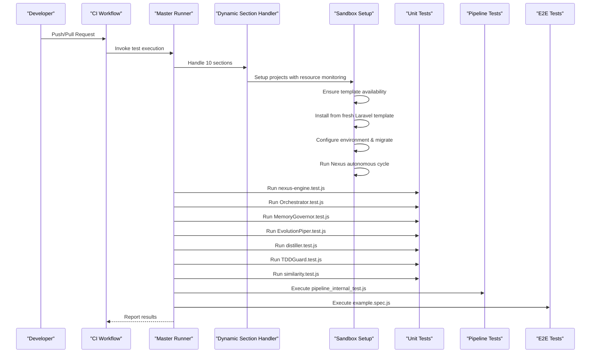

**Diagram sources**
- [.github/workflows/ci.yml](file://.github/workflows/ci.yml)
- [tests/TDD/sandbox-master-runner.js](file://tests/TDD/sandbox-master-runner.js)
- [tests/TDD/setup_dynamic_section.js](file://tests/TDD/setup_dynamic_section.js)
- [tests/TDD/SandboxProjectSetup.js](file://tests/TDD/SandboxProjectSetup.js)
- [tests/TDD/runner.js](file://tests/TDD/runner.js)
- [tests/TDD/nexus-engine.test.js](file://tests/TDD/nexus-engine.test.js)
- [tests/TDD/Orchestrator.test.js](file://tests/TDD/Orchestrator.test.js)
- [tests/TDD/MemoryGovernor.test.js](file://tests/TDD/MemoryGovernor.test.js)
- [tests/TDD/EvolutionPiper.test.js](file://tests/TDD/EvolutionPiper.test.js)
- [tests/TDD/distiller.test.js](file://tests/TDD/distiller.test.js)
- [tests/TDD/TDDGuard.test.js](file://tests/TDD/TDDGuard.test.js)
- [tests/TDD/similarity.test.js](file://tests/TDD/similarity.test.js)
- [tests/pipeline_internal_test.js](file://tests/pipeline_internal_test.js)
- [e2e/example.spec.js](file://e2e/example.spec.js)

## Detailed Component Analysis

### Nexus Engine Testing
Nexus Engine tests validate core reasoning and execution logic. The suite ensures correctness of engine behavior under various conditions and integrates with the TDD runner.

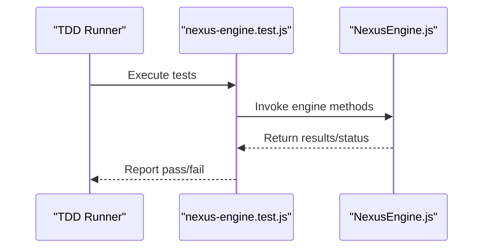

**Diagram sources**
- [tests/TDD/runner.js](file://tests/TDD/runner.js)
- [tests/TDD/nexus-engine.test.js](file://tests/TDD/nexus-engine.test.js)
- [agent/core/NexusEngine.js](file://agent/core/NexusEngine.js)

**Section sources**
- [tests/TDD/nexus-engine.test.js](file://tests/TDD/nexus-engine.test.js)
- [agent/core/NexusEngine.js](file://agent/core/NexusEngine.js)

### Orchestrator Validation
Orchestrator tests validate coordination of tasks and phases. The suite ensures proper sequencing and resource allocation during orchestration.

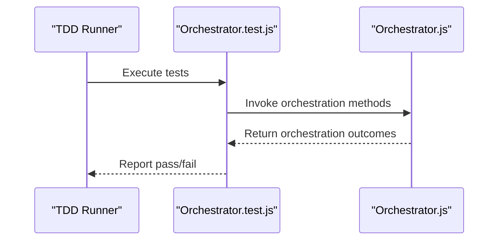

**Diagram sources**
- [tests/TDD/runner.js](file://tests/TDD/runner.js)
- [tests/TDD/Orchestrator.test.js](file://tests/TDD/Orchestrator.test.js)
- [agent/core/Orchestrator.js](file://agent/core/Orchestrator.js)

**Section sources**
- [tests/TDD/Orchestrator.test.js](file://tests/TDD/Orchestrator.test.js)
- [agent/core/Orchestrator.js](file://agent/core/Orchestrator.js)

### Memory Governor Testing
Memory Governor tests validate memory management and constraint enforcement. These tests ensure efficient and safe memory usage across operations.

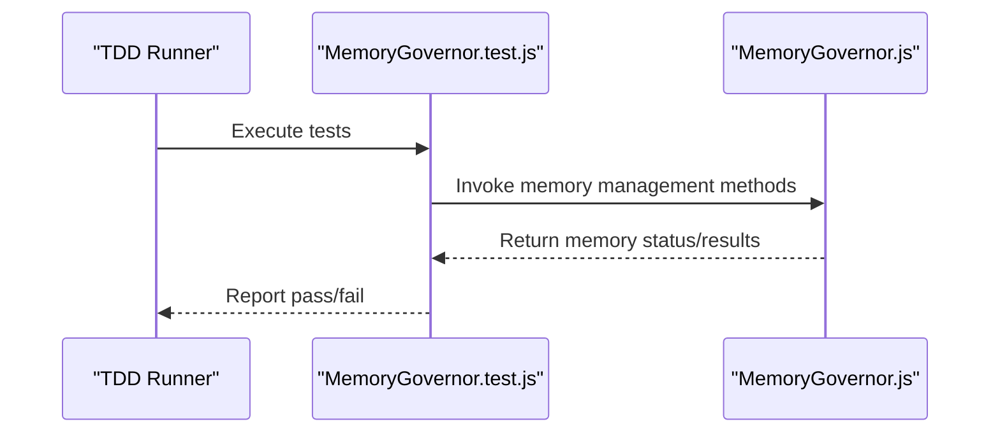

**Diagram sources**
- [tests/TDD/runner.js](file://tests/TDD/runner.js)
- [tests/TDD/MemoryGovernor.test.js](file://tests/TDD/MemoryGovernor.test.js)
- [agent/core/MemoryGovernor.js](file://agent/core/MemoryGovernor.js)

**Section sources**
- [tests/TDD/MemoryGovernor.test.js](file://tests/TDD/MemoryGovernor.test.js)
- [agent/core/MemoryGovernor.js](file://agent/core/MemoryGovernor.js)

### Memory Pipeline and Evolution Piper Testing
Memory Pipeline and Evolution Piper tests validate memory processing and evolution workflows. These tests ensure accurate transformation and progression of memory states.

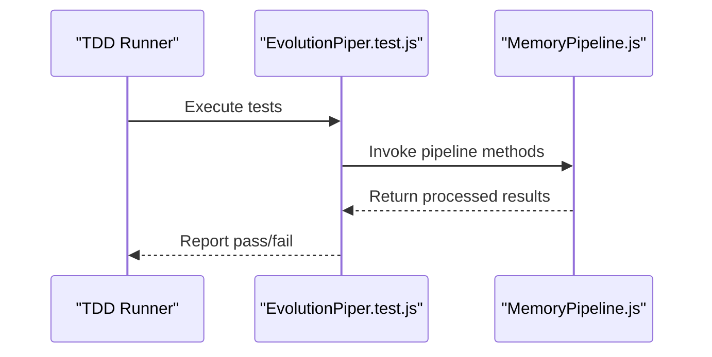

**Diagram sources**
- [tests/TDD/runner.js](file://tests/TDD/runner.js)
- [tests/TDD/EvolutionPiper.test.js](file://tests/TDD/EvolutionPiper.test.js)
- [agent/core/MemoryPipeline.js](file://agent/core/MemoryPipeline.js)

**Section sources**
- [tests/TDD/EvolutionPiper.test.js](file://tests/TDD/EvolutionPiper.test.js)
- [agent/core/MemoryPipeline.js](file://agent/core/MemoryPipeline.js)

### Distiller and TDD Guard Testing
Distiller tests validate knowledge extraction and summarization, while TDD Guard tests enforce TDD adherence and code quality.

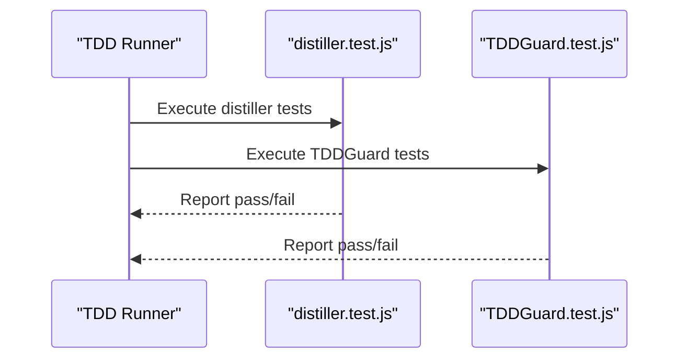

**Diagram sources**
- [tests/TDD/runner.js](file://tests/TDD/runner.js)
- [tests/TDD/distiller.test.js](file://tests/TDD/distiller.test.js)
- [tests/TDD/TDDGuard.test.js](file://tests/TDD/TDDGuard.test.js)

**Section sources**
- [tests/TDD/distiller.test.js](file://tests/TDD/distiller.test.js)
- [tests/TDD/TDDGuard.test.js](file://tests/TDD/TDDGuard.test.js)

### Similarity Testing
Similarity tests validate vector-based similarity computations used across the system.

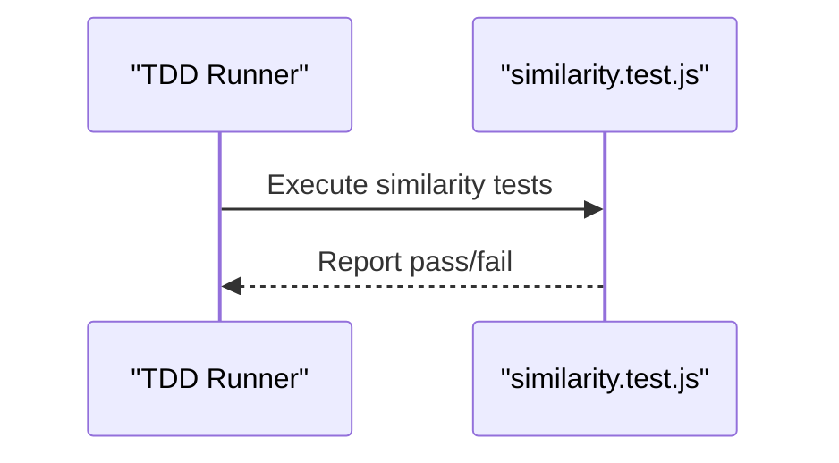

**Diagram sources**
- [tests/TDD/runner.js](file://tests/TDD/runner.js)
- [tests/TDD/similarity.test.js](file://tests/TDD/similarity.test.js)

**Section sources**
- [tests/TDD/similarity.test.js](file://tests/TDD/similarity.test.js)

### E2E Testing
End-to-end tests use Playwright to validate UI and integration flows.

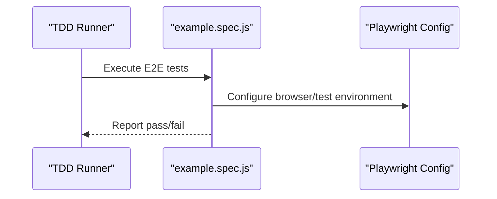

**Diagram sources**
- [tests/TDD/runner.js](file://tests/TDD/runner.js)
- [e2e/example.spec.js](file://e2e/example.spec.js)
- [playwright.config.js](file://playwright.config.js)

**Section sources**
- [e2e/example.spec.js](file://e2e/example.spec.js)
- [playwright.config.js](file://playwright.config.js)

## Enhanced Testing Infrastructure

### Unified Sandbox Project Setup
The enhanced testing infrastructure centers around the SandboxProjectSetup module, which replaces duplicated setup logic across multiple sections and provides a unified approach to sandbox project creation.

**Key Features:**
- **Template Management**: Ensures fresh Laravel template availability via Composer
- **Resource Monitoring**: Integrates with ResourceMonitor for stress-aware execution
- **Backup/Restore**: Preserves Nexus knowledge between project generations
- **Blueprint Regeneration**: Always regenerates blueprints for consistency
- **Performance Optimization**: Reuses node_modules and vendor dependencies when available

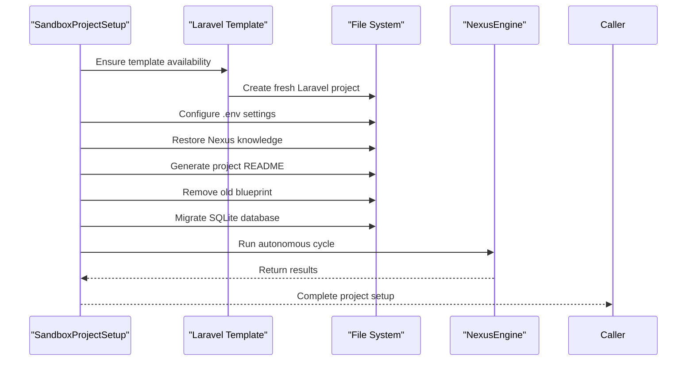

**Diagram sources**
- [tests/TDD/SandboxProjectSetup.js](file://tests/TDD/SandboxProjectSetup.js)

**Section sources**
- [tests/TDD/SandboxProjectSetup.js](file://tests/TDD/SandboxProjectSetup.js)

### Dynamic Section Handling
The testing framework now supports dynamic section handling through setup_dynamic_section.js, enabling scalable testing across 10 different sections with varying project types and complexity levels.

**Dynamic Section Capabilities:**
- **Scalable Testing**: Supports 100+ projects across 10 sections
- **Resource Awareness**: Monitors system resources and adjusts execution accordingly
- **Progress Tracking**: Provides real-time progress indicators and ETA calculations
- **Error Management**: Comprehensive error logging and recovery mechanisms
- **Flexible Configuration**: Supports different modes (learning, efficient) per section

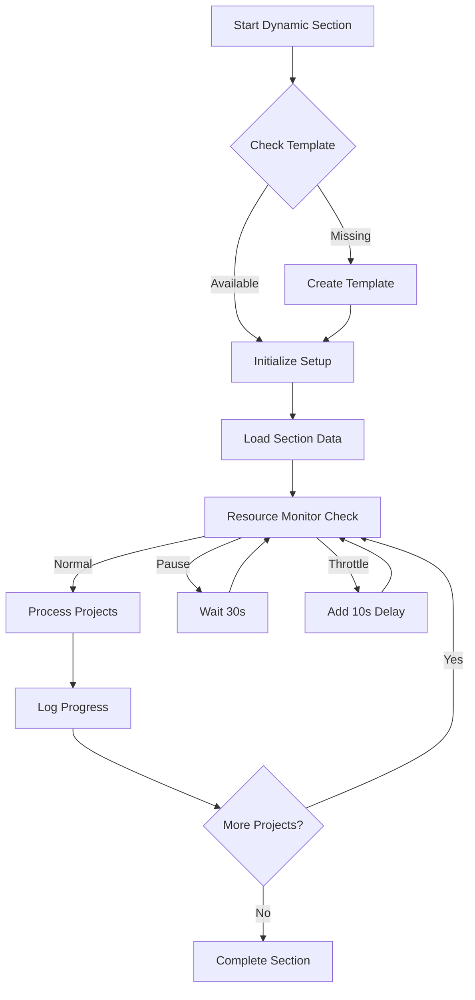

**Diagram sources**
- [tests/TDD/setup_dynamic_section.js](file://tests/TDD/setup_dynamic_section.js)
- [tests/TDD/100-projects-data.js](file://tests/TDD/100-projects-data.js)

**Section sources**
- [tests/TDD/setup_dynamic_section.js](file://tests/TDD/setup_dynamic_section.js)
- [tests/TDD/100-projects-data.js](file://tests/TDD/100-projects-data.js)

### Master Runner Architecture
The sandbox-master-runner.js coordinates execution across all 10 sections, providing a centralized entry point for comprehensive testing workflows.

**Master Runner Features:**
- **Section Selection**: Run specific sections or all sections
- **Distillation Support**: Optional knowledge distillation after completion
- **Progress Reporting**: Comprehensive execution tracking and reporting
- **Error Handling**: Graceful handling of section failures
- **Interactive Confirmation**: Safe distillation with user confirmation

**Section sources**
- [tests/TDD/sandbox-master-runner.js](file://tests/TDD/sandbox-master-runner.js)

## Dynamic Section Handling

### Section-Based Testing Framework
The framework now supports structured testing across 10 distinct sections, each focusing on specific Laravel TALL stack challenges and complexity levels.

**Section Categories:**
- **Section 1**: Fundamental CRUD & Authentication (10 projects)
- **Section 2**: Dashboard & Admin Panels (10 projects)
- **Section 3**: Security & Realtime (11 projects)
- **Sections 4-10**: Specialized domains with increasing complexity

**Section Configuration:**
Each section defines its own project list, tags, execution mode, and project characteristics through the 100-projects-data.js configuration.

**Section sources**
- [tests/TDD/phase1_testing.js](file://tests/TDD/phase1_testing.js)
- [tests/TDD/setup_section2.js](file://tests/TDD/setup_section2.js)
- [tests/TDD/setup_section3.js](file://tests/TDD/setup_section3.js)
- [tests/TDD/100-projects-data.js](file://tests/TDD/100-projects-data.js)

### Upgrade to Fresh Laravel Templates
The upgrade_to_tall.js script provides backward compatibility by upgrading existing sandbox projects to use fresh Laravel templates instead of the legacy url-shortener approach.

**Upgrade Process:**
- **Knowledge Preservation**: Backs up and restores Nexus knowledge
- **Template Migration**: Replaces project structure with fresh Laravel installation
- **Configuration Updates**: Updates .env files with project-specific settings
- **Sequential Processing**: Handles upgrades systematically across all Phase 1 projects

**Section sources**
- [tests/TDD/upgrade_to_tall.js](file://tests/TDD/upgrade_to_tall.js)

## Dependency Analysis
The testing system exhibits clear separation of concerns with enhanced sandbox infrastructure:
- CI/CD workflows depend on the master runner
- The master runner depends on dynamic section handlers and unified sandbox setup
- Dynamic sections depend on sandbox project setup and resource monitoring
- Sandbox setup depends on Nexus Engine and template management
- Individual test suites depend on agent core modules
- E2E tests depend on Playwright configuration

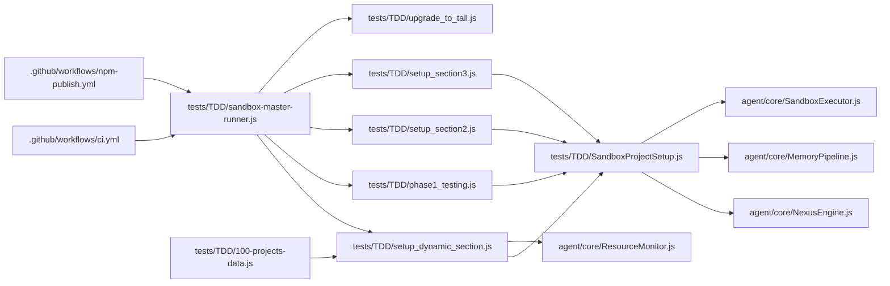

**Diagram sources**
- [.github/workflows/ci.yml](file://.github/workflows/ci.yml)
- [.github/workflows/npm-publish.yml](file://.github/workflows/npm-publish.yml)
- [tests/TDD/sandbox-master-runner.js](file://tests/TDD/sandbox-master-runner.js)
- [tests/TDD/setup_dynamic_section.js](file://tests/TDD/setup_dynamic_section.js)
- [tests/TDD/phase1_testing.js](file://tests/TDD/phase1_testing.js)
- [tests/TDD/setup_section2.js](file://tests/TDD/setup_section2.js)
- [tests/TDD/setup_section3.js](file://tests/TDD/setup_section3.js)
- [tests/TDD/upgrade_to_tall.js](file://tests/TDD/upgrade_to_tall.js)
- [tests/TDD/SandboxProjectSetup.js](file://tests/TDD/SandboxProjectSetup.js)
- [tests/TDD/100-projects-data.js](file://tests/TDD/100-projects-data.js)
- [agent/core/NexusEngine.js](file://agent/core/NexusEngine.js)
- [agent/core/MemoryPipeline.js](file://agent/core/MemoryPipeline.js)
- [agent/core/SandboxExecutor.js](file://agent/core/SandboxExecutor.js)
- [agent/core/ResourceMonitor.js](file://agent/core/ResourceMonitor.js)

**Section sources**
- [tests/TDD/sandbox-master-runner.js](file://tests/TDD/sandbox-master-runner.js)
- [tests/TDD/setup_dynamic_section.js](file://tests/TDD/setup_dynamic_section.js)
- [tests/TDD/SandboxProjectSetup.js](file://tests/TDD/SandboxProjectSetup.js)
- [agent/core/NexusEngine.js](file://agent/core/NexusEngine.js)
- [agent/core/Orchestrator.js](file://agent/core/Orchestrator.js)
- [agent/core/MemoryGovernor.js](file://agent/core/MemoryGovernor.js)
- [agent/core/MemoryPipeline.js](file://agent/core/MemoryPipeline.js)
- [agent/core/SandboxExecutor.js](file://agent/core/SandboxExecutor.js)
- [agent/core/ResourceMonitor.js](file://agent/core/ResourceMonitor.js)

## Performance Considerations
- Modular test suites enable selective execution and faster feedback loops.
- **Enhanced Resource Management**: Dynamic sections implement stress-aware execution with automatic throttling and pausing.
- **Template Reuse**: SandboxProjectSetup optimizes performance by reusing node_modules and vendor dependencies.
- **Progressive Scaling**: 100+ project testing framework scales efficiently with resource monitoring.
- Vector-based and pipeline tests isolate heavy computations for focused evaluation.
- E2E tests should be minimized and targeted to reduce CI runtime.
- Use sandbox environments to avoid flakiness and resource contention.
- Leverage CI caching and parallelism to optimize build and test throughput.

## Troubleshooting Guide
Common issues and resolutions:
- **Flaky tests**: Use deterministic fixtures and sandbox environments; re-run failed tests in isolation.
- **CI failures**: Review CI logs and ensure runner dependencies are installed; validate environment variables.
- **E2E instability**: Configure Playwright timeouts and retries; ensure browser compatibility.
- **Memory Governor violations**: Add assertions for memory limits and resource usage; simulate constrained environments.
- **TDD guard failures**: Align code with TDD laws and scaffolding; ensure tests drive implementation.
- **Template creation failures**: Ensure Composer and PHP are installed and accessible in PATH.
- **Resource monitoring issues**: Verify system resource availability; adjust stress thresholds as needed.
- **Dynamic section timeouts**: Monitor system resources; consider reducing concurrent project count.

Reference materials:
- TDD project logs and insights for historical context and lessons learned
- QA and TDD standards for best practices and anti-patterns

**Section sources**
- [memory/distilled/tdd/NEXUS_TDD_PROJECT_1_LOG.MD](file://memory/distilled/tdd/NEXUS_TDD_PROJECT_1_LOG.MD)
- [memory/distilled/tdd/NEXUS_TDD_INSIGHTS.MD](file://memory/distilled/tdd/NEXUS_TDD_INSIGHTS.MD)
- [memory/distilled/core/NEXUS_TESTING_ANTI_PATTERNS.MD](file://memory/distilled/core/NEXUS_TESTING_ANTI_PATTERNS.MD)
- [memory/distilled/core/NEXUS_TDD_IRON_LAWS.md](file://memory/distilled/core/NEXUS_TDD_IRON_LAWS.md)

## Conclusion
The NEXUS AI testing framework integrates CI/CD, TDD, and quality assurance practices across Nexus Engine, Orchestrator, Memory Governor, and supporting components. The enhanced modular test suites, unified sandbox infrastructure, and scalable dynamic section handling provide comprehensive coverage for 100+ projects across diverse Laravel TALL stack scenarios. The improved resource monitoring, template management, and DRY architecture ensure maintainable, reliable, and high-performance testing infrastructure.

## Appendices

### Continuous Integration Workflows
- CI workflow triggers test execution and reports results
- NPM publish workflow handles artifact publishing

**Section sources**
- [.github/workflows/ci.yml](file://.github/workflows/ci.yml)
- [.github/workflows/npm-publish.yml](file://.github/workflows/npm-publish.yml)

### Tools and Frameworks
- Playwright for E2E testing
- Node-based TDD runner and test suites
- **Enhanced**: Sandbox executor with resource monitoring for isolated execution
- **New**: Unified SandboxProjectSetup module for template management
- **New**: Dynamic section handling for scalable testing workflows

**Section sources**
- [playwright.config.js](file://playwright.config.js)
- [tests/TDD/runner.js](file://tests/TDD/runner.js)
- [agent/core/SandboxExecutor.js](file://agent/core/SandboxExecutor.js)
- [tests/TDD/SandboxProjectSetup.js](file://tests/TDD/SandboxProjectSetup.js)
- [tests/TDD/setup_dynamic_section.js](file://tests/TDD/setup_dynamic_section.js)

### Best Practices and Standards
- TDD Iron Laws and project insights
- QA standards and zero-flaws principles
- Database and performance standards
- **Enhanced**: Sandbox pipeline and audit reports with resource monitoring
- **New**: Dynamic section testing guidelines and scalability considerations
- **New**: Template management best practices for consistent project generation

**Section sources**
- [memory/distilled/tdd/NEXUS_TDD_IRON_LAWS.md](file://memory/distilled/tdd/NEXUS_TDD_IRON_LAWS.md)
- [memory/distilled/tdd/NEXUS_TDD_PROJECT_1_LOG.MD](file://memory/distilled/tdd/NEXUS_TDD_PROJECT_1_LOG.MD)
- [memory/distilled/tdd/NEXUS_TDD_INSIGHTS.MD](file://memory/distilled/tdd/NEXUS_TDD_INSIGHTS.MD)
- [memory/distilled/core/NEXUS_ZERO_FLAWS_STANDARDS.MD](file://memory/distilled/core/NEXUS_ZERO_FLAWS_STANDARDS.MD)
- [memory/distilled/core/NEXUS_DATABASE_STANDARDS.md](file://memory/distilled/core/NEXUS_DATABASE_STANDARDS.md)
- [memory/distilled/core/NEXUS_CORE_MODULARIZATION.md](file://memory/distilled/core/NEXUS_CORE_MODULARIZATION.md)
- [memory/distilled/core/NEXUS_SANDBOX_PIPELINE.MD](file://memory/distilled/core/NEXUS_SANDBOX_PIPELINE.MD)
- [memory/distilled/core/NEXUS_SANDBOX_PIPELINE_EXTREME_AUDIT.md](file://memory/distilled/core/NEXUS_SANDBOX_PIPELINE_EXTREME_AUDIT.md)
- [memory/distilled/core/NEXUS_AUDIT_SUMMARY_10_LOOP_SCAN.md](file://memory/distilled/core/NEXUS_AUDIT_SUMMARY_10_LOOP_SCAN.md)
- [memory/distilled/core/NEXUS_AUDIT_V320_AUTONOMOUS_READINESS.md](file://memory/distilled/core/NEXUS_AUDIT_V320_AUTONOMOUS_READINESS.md)
- [memory/distilled/core/NEXUS_RECORD_NEXUS_AUTONOMOUS_SANDBOX_PIPELINE.md](file://memory/distilled/core/NEXUS_RECORD_NEXUS_AUTONOMOUS_SANDBOX_PIPELINE.md)
- [memory/distilled/core/NEXUS_RECORD_NEXUS_SEMANTIC_MASS_UPDATE_HUB_SKILL.md](file://memory/distilled/core/NEXUS_RECORD_NEXUS_SEMANTIC_MASS_UPDATE_HUB_SKILL.md)
- [memory/distilled/core/NEXUS_MULTIAGENT_STABILITY_GUIDE.md](file://memory/distilled/core/NEXUS_MULTIAGENT_STABILITY_GUIDE.md)
- [memory/distilled/core/NEXUS_MULTI_AGENT_STABILIZATION_PLAN.md](file://memory/distilled/core/NEXUS_MULTI_AGENT_STABILIZATION_PLAN.md)
- [memory/distilled/core/NEXUS_SANDBOX_Review.md](file://memory/distilled/core/NEXUS_SANDBOX_Review.md)
- [memory/distilled/core/NEXUS_EXTREME_PERFORMANCE_ROADMAP.md](file://memory/distilled/core/NEXUS_EXTREME_PERFORMANCE_ROADMAP.md)
- [memory/distilled/core/NEXUS_SANDBOX_UI_FINDINGS.md](file://memory/distilled/frontend/NEXUS_SANDBOX_UI_FINDINGS.md)
- [memory/distilled/database/NEXUS_DATABASE_TESTING.md](file://memory/distilled/database/NEXUS_DATABASE_TESTING.md)