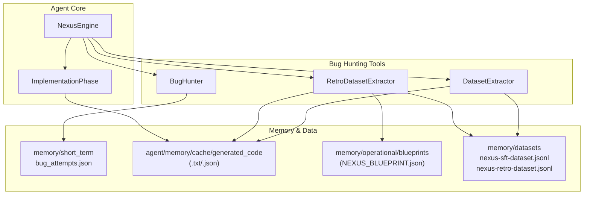
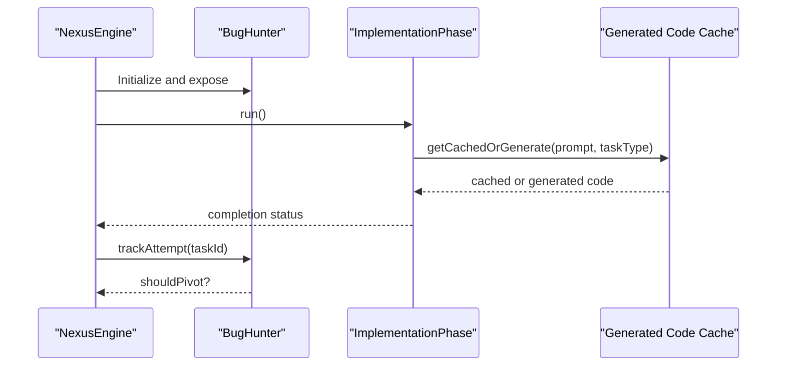
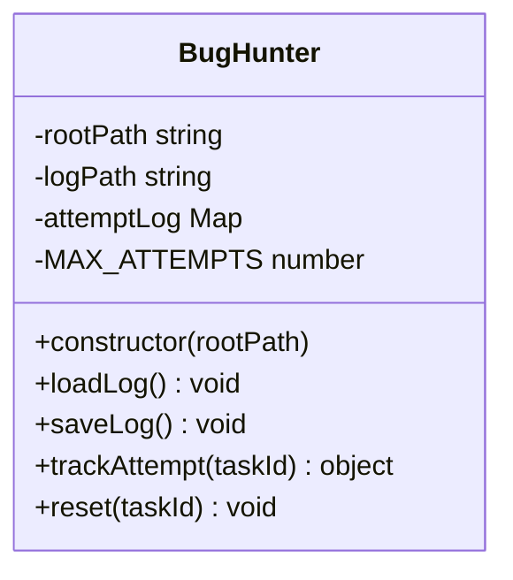
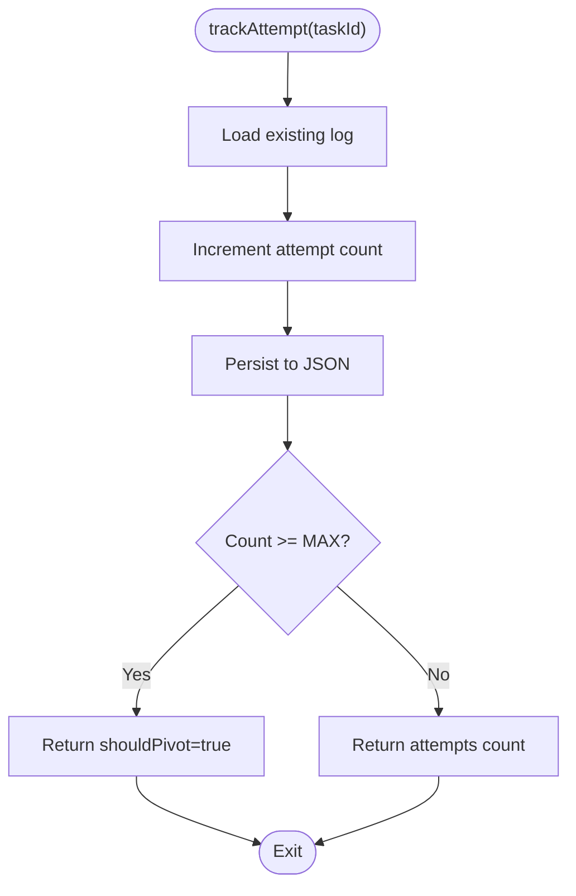
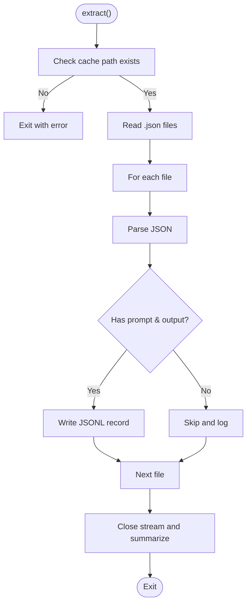
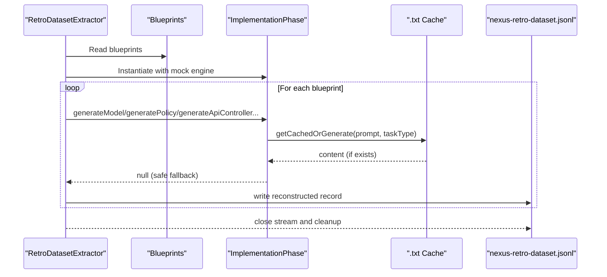
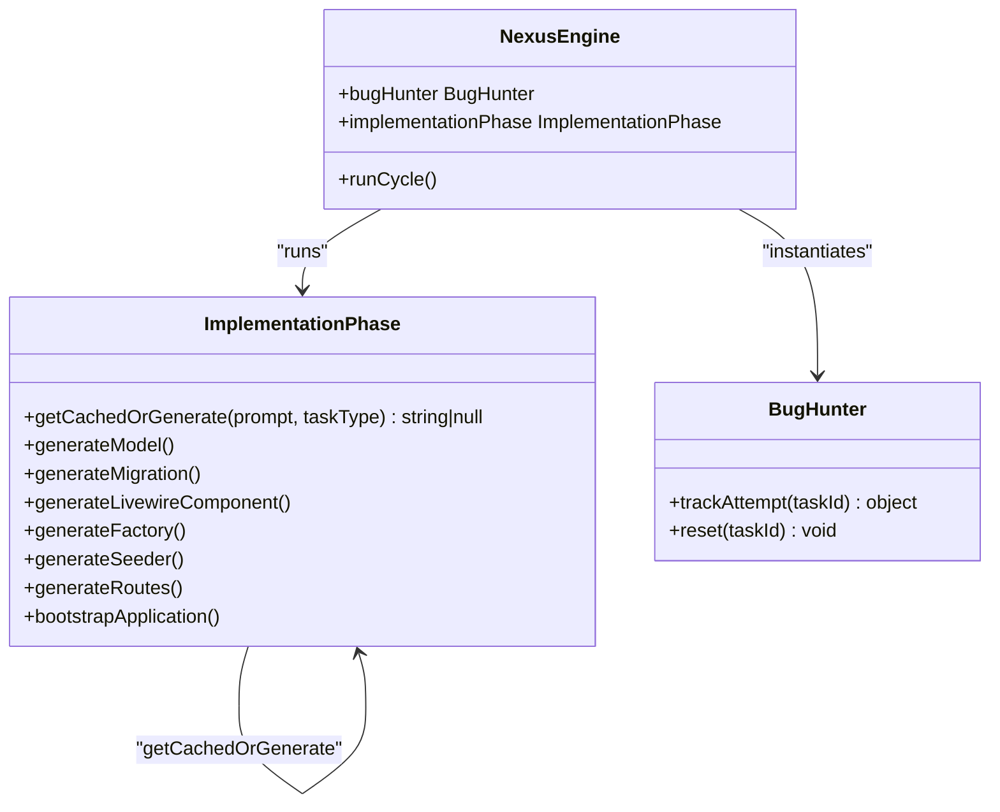
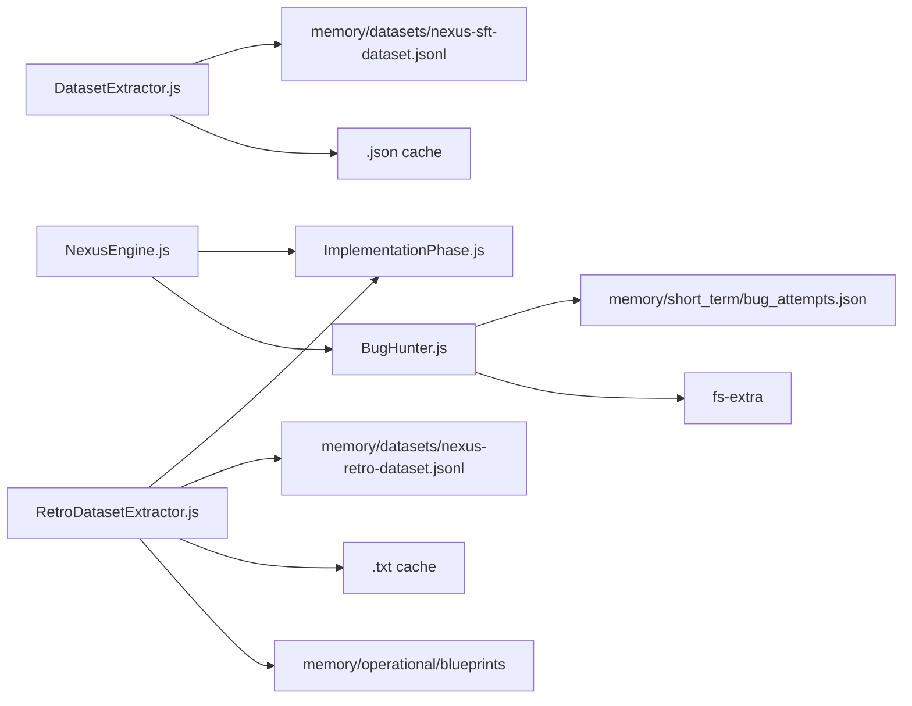

# Bug Hunting Tools

<cite>
**Referenced Files in This Document**
- [BugHunter.js](file://agent/tools/BugHunter.js)
- [RetroDatasetExtractor.js](file://agent/tools/RetroDatasetExtractor.js)
- [DatasetExtractor.js](file://agent/tools/DatasetExtractor.js)
- [ImplementationPhase.js](file://agent/core/phases/ImplementationPhase.js)
- [NexusEngine.js](file://agent/core/NexusEngine.js)
- [NEXUS_BLUEPRINT.json](file://NEXUS_BLUEPRINT.json)
</cite>

## Table of Contents
1. [Introduction](#introduction)
2. [Project Structure](#project-structure)
3. [Core Components](#core-components)
4. [Architecture Overview](#architecture-overview)
5. [Detailed Component Analysis](#detailed-component-analysis)
6. [Dependency Analysis](#dependency-analysis)
7. [Performance Considerations](#performance-considerations)
8. [Troubleshooting Guide](#troubleshooting-guide)
9. [Conclusion](#conclusion)
10. [Appendices](#appendices)

## Introduction
This document describes the bug hunting tools suite in NEXUS AI, focusing on:
- BugHunter: Automated strategy pivot and attempt tracking to reduce repeated failures.
- RetroDatasetExtractor: Historical dataset reconstruction from legacy caches and blueprints.
- DatasetExtractor: Structured dataset extraction from generated code caches for fine-tuning.

It explains configuration, detection algorithms, false positive reduction, integration with the agent system, practical workflows, and performance optimization. These tools are central to the autonomous development pipeline and code quality assurance.

## Project Structure
The bug hunting tools live under agent/tools and integrate with the agent core phases and engine. They rely on:
- Short-term memory for persistent tracking (BugHunter).
- Generated code caches for dataset extraction (DatasetExtractor).
- Legacy blueprints and caches for retro reconstruction (RetroDatasetExtractor).
- Local AI generation and caching for code synthesis (ImplementationPhase).

**Diagram sources**
- [NexusEngine.js:101-102](file://agent/core/NexusEngine.js#L101-L102)
- [BugHunter.js:10-16](file://agent/tools/BugHunter.js#L10-L16)
- [DatasetExtractor.js:5-11](file://agent/tools/DatasetExtractor.js#L5-L11)
- [RetroDatasetExtractor.js:6-17](file://agent/tools/RetroDatasetExtractor.js#L6-L17)
- [ImplementationPhase.js:202-241](file://agent/core/phases/ImplementationPhase.js#L202-L241)

**Section sources**
- [NexusEngine.js:101-102](file://agent/core/NexusEngine.js#L101-L102)
- [BugHunter.js:10-16](file://agent/tools/BugHunter.js#L10-L16)
- [DatasetExtractor.js:5-11](file://agent/tools/DatasetExtractor.js#L5-L11)
- [RetroDatasetExtractor.js:6-17](file://agent/tools/RetroDatasetExtractor.js#L6-L17)
- [ImplementationPhase.js:202-241](file://agent/core/phases/ImplementationPhase.js#L202-L241)

## Core Components
- BugHunter
  - Tracks task attempts and enforces a fixed maximum attempts threshold to trigger a strategy pivot.
  - Persists state to memory/short_term/bug_attempts.json.
  - Provides reset capability to clear tracked attempts.

- DatasetExtractor
  - Scans generated code cache (.json) and emits a structured dataset in JSONL format suitable for fine-tuning.
  - Filters records to ensure prompt and output presence.

- RetroDatasetExtractor
  - Reconstructs a historical dataset by replaying blueprint-driven generation via ImplementationPhase.
  - Reads legacy .txt cache files and writes reconstructed records to a JSONL dataset.
  - Uses a mock engine to avoid side effects and writes safe fallbacks to a dummy root.

- Integration with NexusEngine
  - NexusEngine instantiates BugHunter and exposes it to the broader pipeline.
  - ImplementationPhase provides the caching and generation mechanism used by both tools.

**Section sources**
- [BugHunter.js:9-68](file://agent/tools/BugHunter.js#L9-L68)
- [DatasetExtractor.js:4-62](file://agent/tools/DatasetExtractor.js#L4-L62)
- [RetroDatasetExtractor.js:6-129](file://agent/tools/RetroDatasetExtractor.js#L6-L129)
- [NexusEngine.js:101-102](file://agent/core/NexusEngine.js#L101-L102)
- [ImplementationPhase.js:202-241](file://agent/core/phases/ImplementationPhase.js#L202-L241)

## Architecture Overview
The bug hunting tools participate in the autonomous development lifecycle:
- NexusEngine orchestrates the cycle and holds BugHunter.
- ImplementationPhase generates and caches code, enabling DatasetExtractor and RetroDatasetExtractor to reuse cached artifacts.
- BugHunter monitors repeated failures and suggests pivots to improve outcomes.

**Diagram sources**
- [NexusEngine.js:101-102](file://agent/core/NexusEngine.js#L101-L102)
- [BugHunter.js:49-62](file://agent/tools/BugHunter.js#L49-L62)
- [ImplementationPhase.js:202-241](file://agent/core/phases/ImplementationPhase.js#L202-L241)

## Detailed Component Analysis

### BugHunter
Purpose:
- Enforce a “3 Fixes Rule” by limiting consecutive failures per task.
- Persist state to disk for resilience across cycles.

Key behaviors:
- Attempt tracking with a per-task counter.
- Threshold-based pivot recommendation.
- Persistence to JSON file with load/save routines.

**Diagram sources**
- [BugHunter.js:9-68](file://agent/tools/BugHunter.js#L9-L68)

Operational flow:

**Diagram sources**
- [BugHunter.js:49-62](file://agent/tools/BugHunter.js#L49-L62)

Configuration and usage:
- Maximum attempts configurable via MAX_ATTEMPTS.
- Persistence path derived from rootPath and short-term memory location.
- Reset clears the task’s record and persists.

Integration:
- Instantiated by NexusEngine and exposed to the pipeline for strategy pivots.

**Section sources**
- [BugHunter.js:9-68](file://agent/tools/BugHunter.js#L9-L68)
- [NexusEngine.js:101-102](file://agent/core/NexusEngine.js#L101-L102)

### DatasetExtractor
Purpose:
- Extract structured training data from generated code cache for supervised fine-tuning.

Key behaviors:
- Scans generated_code cache for .json entries.
- Validates records and writes JSONL with instruction, output, and task_type.
- Emits progress and total usable records.

**Diagram sources**
- [DatasetExtractor.js:13-61](file://agent/tools/DatasetExtractor.js#L13-L61)

Configuration and usage:
- Cache path defaults to agent/memory/cache/generated_code.
- Output dataset path defaults to memory/datasets/nexus-sft-dataset.jsonl.

False positive reduction:
- Only emits records with both prompt and output fields.

Performance:
- Streams output to minimize memory footprint.

**Section sources**
- [DatasetExtractor.js:4-62](file://agent/tools/DatasetExtractor.js#L4-L62)

### RetroDatasetExtractor
Purpose:
- Reconstruct historical training pairs from legacy caches and blueprints.

Key behaviors:
- Reads blueprints and iterates through model, migration, factory, seeder, Livewire component, layout, and route generations.
- Intercepts getCachedOrGenerate to read .txt cache files and emit reconstructed records.
- Writes a JSONL dataset and cleans up a dummy root used for safe fallbacks.

**Diagram sources**
- [RetroDatasetExtractor.js:19-128](file://agent/tools/RetroDatasetExtractor.js#L19-L128)
- [ImplementationPhase.js:202-241](file://agent/core/phases/ImplementationPhase.js#L202-L241)

Configuration and usage:
- Blueprints path: memory/operational/blueprints.
- Cache path: agent/memory/cache/generated_code.
- Output dataset path: memory/datasets/nexus-retro-dataset.jsonl.
- Dummy root for safe fallbacks: scratch/dummy_retro_engine.

False positive reduction:
- Only records with readable .txt cache content are emitted.
- Safe fallbacks are written to a dummy root to avoid polluting the project.

Integration with blueprints:
- Uses NEXUS_BLUEPRINT.json to drive generation tasks.

**Section sources**
- [RetroDatasetExtractor.js:6-129](file://agent/tools/RetroDatasetExtractor.js#L6-L129)
- [NEXUS_BLUEPRINT.json:1-158](file://NEXUS_BLUEPRINT.json#L1-L158)

### Integration with ImplementationPhase and Agent System
- ImplementationPhase provides getCachedOrGenerate, which:
  - Computes a cache key from prompt + taskType.
  - Reads/writes .txt cache files.
  - Saves .json dataset entries for SFT fine-tuning.
- NexusEngine holds BugHunter and coordinates the lifecycle.

**Diagram sources**
- [NexusEngine.js:101-102](file://agent/core/NexusEngine.js#L101-L102)
- [ImplementationPhase.js:202-241](file://agent/core/phases/ImplementationPhase.js#L202-L241)
- [BugHunter.js:49-62](file://agent/tools/BugHunter.js#L49-L62)

**Section sources**
- [NexusEngine.js:101-102](file://agent/core/NexusEngine.js#L101-L102)
- [ImplementationPhase.js:202-241](file://agent/core/phases/ImplementationPhase.js#L202-L241)

## Dependency Analysis
- BugHunter depends on:
  - File system for persistence (fs-extra).
  - Short-term memory path for state file.
- DatasetExtractor depends on:
  - Generated code cache (.json).
  - Output dataset directory creation.
- RetroDatasetExtractor depends on:
  - Blueprints directory.
  - Generated code cache (.txt).
  - ImplementationPhase for generation and safe fallbacks.
- NexusEngine depends on:
  - BugHunter for strategy pivoting.
  - ImplementationPhase for code generation and caching.

**Diagram sources**
- [BugHunter.js:1-3](file://agent/tools/BugHunter.js#L1-L3)
- [DatasetExtractor.js:1-2](file://agent/tools/DatasetExtractor.js#L1-L2)
- [RetroDatasetExtractor.js:1-4](file://agent/tools/RetroDatasetExtractor.js#L1-L4)
- [NexusEngine.js:101-102](file://agent/core/NexusEngine.js#L101-L102)

**Section sources**
- [BugHunter.js:1-3](file://agent/tools/BugHunter.js#L1-L3)
- [DatasetExtractor.js:1-2](file://agent/tools/DatasetExtractor.js#L1-L2)
- [RetroDatasetExtractor.js:1-4](file://agent/tools/RetroDatasetExtractor.js#L1-L4)
- [NexusEngine.js:101-102](file://agent/core/NexusEngine.js#L101-L102)

## Performance Considerations
- Streamed writes: Both DatasetExtractor and RetroDatasetExtractor use streaming to reduce memory overhead.
- Cache reuse: ImplementationPhase’s getCachedOrGenerate avoids redundant AI generation and reduces latency.
- Safe fallbacks: RetroDatasetExtractor writes safe fallbacks to a dummy root to prevent project contamination.
- Lazy initialization: NexusEngine defers instantiation of heavy components to reduce startup cost.

[No sources needed since this section provides general guidance]

## Troubleshooting Guide
Common issues and resolutions:
- Missing cache directories:
  - DatasetExtractor logs an error and exits early if the cache directory does not exist.
  - RetroDatasetExtractor logs errors for missing blueprints or cache directories and exits early.
- Empty or malformed cache entries:
  - DatasetExtractor skips entries without prompt/output and warns about parsing failures.
- Persistence failures:
  - BugHunter logs errors when loading or saving the attempt log.
- Generation failures:
  - ImplementationPhase validates generated code syntax and writes safe fallbacks when needed.

**Section sources**
- [DatasetExtractor.js:17-28](file://agent/tools/DatasetExtractor.js#L17-L28)
- [DatasetExtractor.js:50-52](file://agent/tools/DatasetExtractor.js#L50-L52)
- [RetroDatasetExtractor.js:23-31](file://agent/tools/RetroDatasetExtractor.js#L23-L31)
- [BugHunter.js:27-29](file://agent/tools/BugHunter.js#L27-L29)
- [ImplementationPhase.js:299-310](file://agent/core/phases/ImplementationPhase.js#L299-L310)

## Conclusion
The bug hunting tools suite provides:
- A robust strategy pivot mechanism (BugHunter) to prevent stuck loops.
- Practical dataset extraction (DatasetExtractor) for supervised fine-tuning.
- Historical dataset reconstruction (RetroDatasetExtractor) leveraging legacy caches and blueprints.
Integrated with NexusEngine and ImplementationPhase, these tools strengthen the autonomous development pipeline and code quality assurance by reducing false positives, reusing proven artifacts, and enabling continuous improvement through data-driven refinement.

[No sources needed since this section summarizes without analyzing specific files]

## Appendices

### Practical Workflows
- Bug detection and pivot:
  - After each task, call trackAttempt(taskId).
  - If shouldPivot is true, halt and reassess strategy.
  - Use reset(taskId) to clear state after successful remediation.
- Dataset creation:
  - Run DatasetExtractor to produce a JSONL dataset for fine-tuning.
  - Use RetroDatasetExtractor to reconstruct historical pairs from legacy caches and blueprints.
- Integration steps:
  - Ensure NexusEngine is initialized with BugHunter.
  - Verify ImplementationPhase cache is populated for DatasetExtractor and RetroDatasetExtractor.

**Section sources**
- [BugHunter.js:49-62](file://agent/tools/BugHunter.js#L49-L62)
- [DatasetExtractor.js:13-61](file://agent/tools/DatasetExtractor.js#L13-L61)
- [RetroDatasetExtractor.js:19-128](file://agent/tools/RetroDatasetExtractor.js#L19-L128)
- [NexusEngine.js:101-102](file://agent/core/NexusEngine.js#L101-L102)

### Configuration Options
- BugHunter
  - rootPath: base directory for state persistence.
  - MAX_ATTEMPTS: failure threshold before pivot.
- DatasetExtractor
  - rootPath: base directory for cache and output.
  - cachePath: path to generated_code cache.
  - outPath: path to output JSONL dataset.
- RetroDatasetExtractor
  - rootPath: base directory for blueprints, cache, and output.
  - agentCachePath: path to legacy .txt cache.
  - blueprintsPath: path to blueprints.
  - outPath: path to output JSONL dataset.
  - dummyRoot: temporary directory for safe fallbacks.

**Section sources**
- [BugHunter.js:10-16](file://agent/tools/BugHunter.js#L10-L16)
- [DatasetExtractor.js:5-11](file://agent/tools/DatasetExtractor.js#L5-L11)
- [RetroDatasetExtractor.js:7-17](file://agent/tools/RetroDatasetExtractor.js#L7-L17)

### Detection Algorithms and False Positive Reduction
- BugHunter:
  - Fixed threshold algorithm with persistent state.
  - Reduces false positives by preventing repeated attempts on the same task.
- DatasetExtractor:
  - Record validation ensures prompt and output presence.
  - Skips malformed or missing entries.
- RetroDatasetExtractor:
  - Relies on readable .txt cache content.
  - Writes safe fallbacks to avoid injecting invalid code.

**Section sources**
- [BugHunter.js:49-62](file://agent/tools/BugHunter.js#L49-L62)
- [DatasetExtractor.js:40-49](file://agent/tools/DatasetExtractor.js#L40-L49)
- [RetroDatasetExtractor.js:54-77](file://agent/tools/RetroDatasetExtractor.js#L54-L77)

### Custom Rule Creation
- Use ImplementationPhase’s getCachedOrGenerate to:
  - Compute cache keys from prompt + taskType.
  - Persist dataset entries for SFT fine-tuning.
- RetroDatasetExtractor demonstrates:
  - Interception of getCachedOrGenerate to read legacy caches.
  - Reconstruction of records for historical datasets.

**Section sources**
- [ImplementationPhase.js:202-241](file://agent/core/phases/ImplementationPhase.js#L202-L241)
- [RetroDatasetExtractor.js:54-77](file://agent/tools/RetroDatasetExtractor.js#L54-L77)