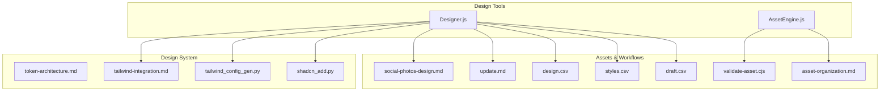
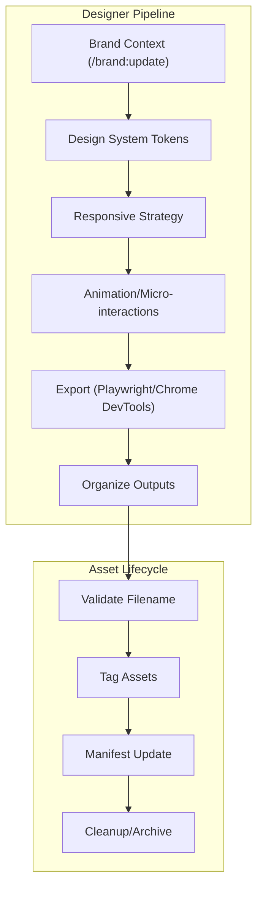
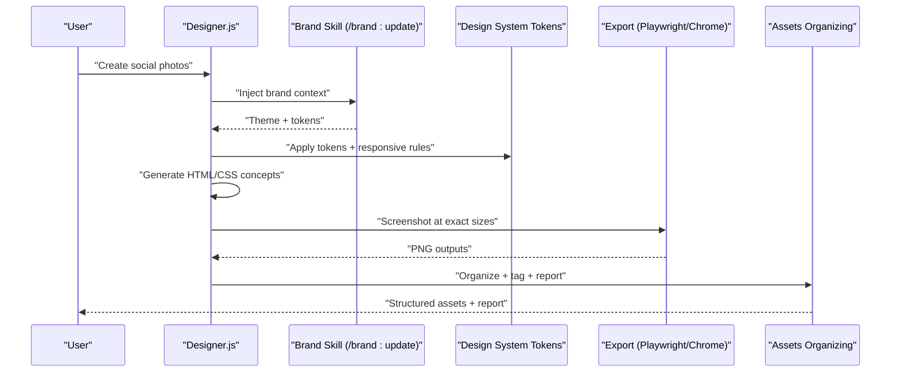
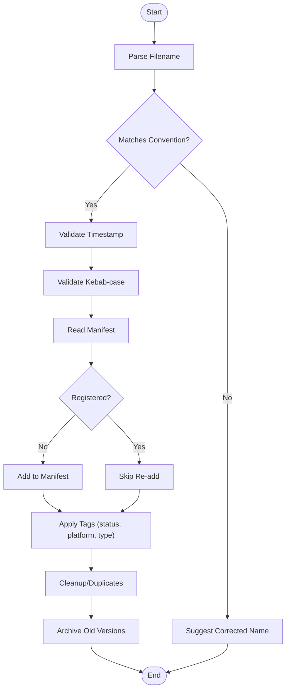
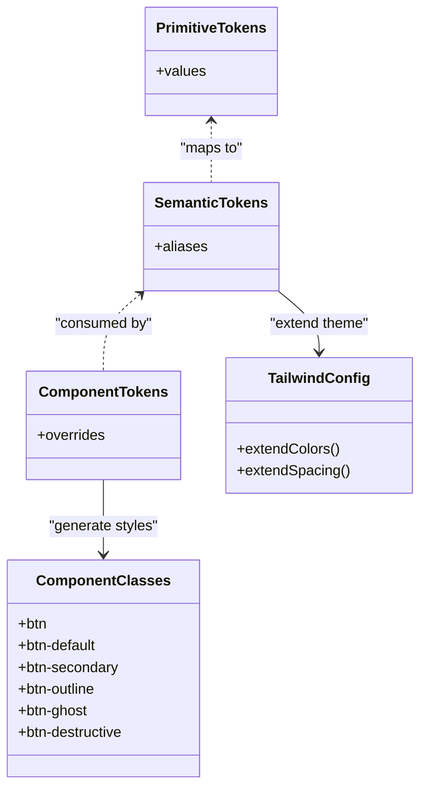
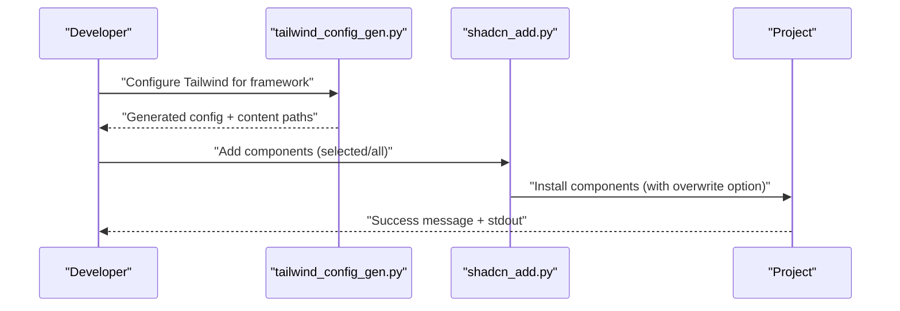
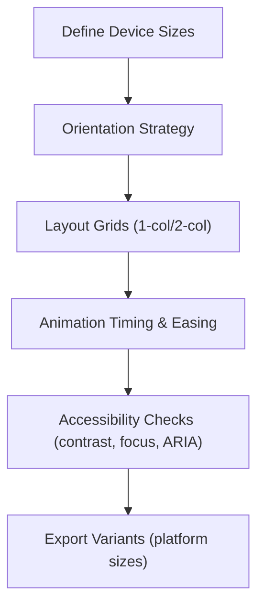
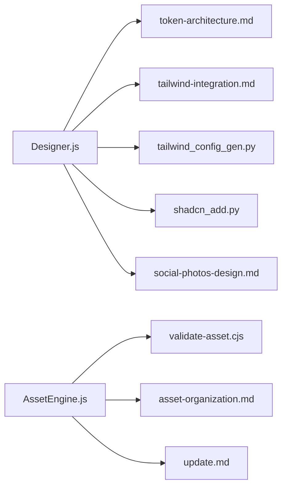

# Design and Creation Tools

<cite>
**Referenced Files in This Document**
- [Designer.js](file://agent/tools/Designer.js)
- [AssetEngine.js](file://agent/tools/AssetEngine.js)
- [token-architecture.md](file://memory/references/ui-ux-pro-max-skill-main/.claude/skills/design-system/references/token-architecture.md)
- [tailwind-integration.md](file://memory/references/ui-ux-pro-max-skill-main/.claude/skills/design-system/references/tailwind-integration.md)
- [tailwind_config_gen.py](file://memory/references/ui-ux-pro-max-skill-main/.claude/skills/ui-styling/scripts/tailwind_config_gen.py)
- [shadcn_add.py](file://memory/references/ui-ux-pro-max-skill-main/.claude/skills/ui-styling/scripts/shadcn_add.py)
- [social-photos-design.md](file://memory/references/ui-ux-pro-max-skill-main/.claude/skills/design/references/social-photos-design.md)
- [update.md](file://memory/references/ui-ux-pro-max-skill-main/.claude/skills/brand/references/update.md)
- [asset-organization.md](file://memory/references/ui-ux-pro-max-skill-main/.claude/skills/brand/references/asset-organization.md)
- [validate-asset.cjs](file://memory/references/ui-ux-pro-max-skill-main/.claude/skills/brand/scripts/validate-asset.cjs)
- [draft.csv](file://memory/references/ui-ux-pro-max-skill-main/cli/assets/data/draft.csv)
- [styles.csv](file://memory/references/ui-ux-pro-max-skill-main/cli/assets/data/styles.csv)
- [design.csv](file://memory/references/ui-ux-pro-max-skill-main/cli/assets/data/design.csv)
</cite>

## Table of Contents
1. [Introduction](#introduction)
2. [Project Structure](#project-structure)
3. [Core Components](#core-components)
4. [Architecture Overview](#architecture-overview)
5. [Detailed Component Analysis](#detailed-component-analysis)
6. [Dependency Analysis](#dependency-analysis)
7. [Performance Considerations](#performance-considerations)
8. [Troubleshooting Guide](#troubleshooting-guide)
9. [Conclusion](#conclusion)
10. [Appendices](#appendices)

## Introduction
This document explains the design and creation tools in NEXUS AI with a focus on:
- Designer: a tool for UI/UX creation, component generation, and visual design assistance.
- AssetEngine: a tool for managing digital assets, media optimization, and resource generation.
It also covers design system integration, component library creation, responsive design patterns, accessibility compliance, configuration of design tokens and themes, automated design workflows, and integration with frontend frameworks.

## Project Structure
The design and creation capabilities are implemented as modular tools and integrated with a robust design system and asset lifecycle pipeline:
- Designer tool orchestrates design ideation, component generation, and visual export.
- AssetEngine manages assets, validates filenames, and organizes outputs.
- Design system references define token architecture, Tailwind integration, and component classes.
- Scripts automate Tailwind configuration and shadcn/ui component addition.
- CSV datasets encode responsive strategies, animation patterns, and accessibility guidelines.
- Brand and asset organization references define naming conventions, tagging, and cleanup workflows.

**Diagram sources**
- [Designer.js](file://agent/tools/Designer.js)
- [AssetEngine.js](file://agent/tools/AssetEngine.js)
- [token-architecture.md](file://memory/references/ui-ux-pro-max-skill-main/.claude/skills/design-system/references/token-architecture.md)
- [tailwind-integration.md](file://memory/references/ui-ux-pro-max-skill-main/.claude/skills/design-system/references/tailwind-integration.md)
- [tailwind_config_gen.py](file://memory/references/ui-ux-pro-max-skill-main/.claude/skills/ui-styling/scripts/tailwind_config_gen.py)
- [shadcn_add.py](file://memory/references/ui-ux-pro-max-skill-main/.claude/skills/ui-styling/scripts/shadcn_add.py)
- [social-photos-design.md](file://memory/references/ui-ux-pro-max-skill-main/.claude/skills/design/references/social-photos-design.md)
- [update.md](file://memory/references/ui-ux-pro-max-skill-main/.claude/skills/brand/references/update.md)
- [asset-organization.md](file://memory/references/ui-ux-pro-max-skill-main/.claude/skills/brand/references/asset-organization.md)
- [validate-asset.cjs](file://memory/references/ui-ux-pro-max-skill-main/.claude/skills/brand/scripts/validate-asset.cjs)
- [design.csv](file://memory/references/ui-ux-pro-max-skill-main/cli/assets/data/design.csv)
- [styles.csv](file://memory/references/ui-ux-pro-max-skill-main/cli/assets/data/styles.csv)
- [draft.csv](file://memory/references/ui-ux-pro-max-skill-main/cli/assets/data/draft.csv)

**Section sources**
- [Designer.js](file://agent/tools/Designer.js)
- [AssetEngine.js](file://agent/tools/AssetEngine.js)
- [token-architecture.md](file://memory/references/ui-ux-pro-max-skill-main/.claude/skills/design-system/references/token-architecture.md)
- [tailwind-integration.md](file://memory/references/ui-ux-pro-max-skill-main/.claude/skills/design-system/references/tailwind-integration.md)
- [tailwind_config_gen.py](file://memory/references/ui-ux-pro-max-skill-main/.claude/skills/ui-styling/scripts/tailwind_config_gen.py)
- [shadcn_add.py](file://memory/references/ui-ux-pro-max-skill-main/.claude/skills/ui-styling/scripts/shadcn_add.py)
- [social-photos-design.md](file://memory/references/ui-ux-pro-max-skill-main/.claude/skills/design/references/social-photos-design.md)
- [update.md](file://memory/references/ui-ux-pro-max-skill-main/.claude/skills/brand/references/update.md)
- [asset-organization.md](file://memory/references/ui-ux-pro-max-skill-main/.claude/skills/brand/references/asset-organization.md)
- [validate-asset.cjs](file://memory/references/ui-ux-pro-max-skill-main/.claude/skills/brand/scripts/validate-asset.cjs)
- [design.csv](file://memory/references/ui-ux-pro-max-skill-main/cli/assets/data/design.csv)
- [styles.csv](file://memory/references/ui-ux-pro-max-skill-main/cli/assets/data/styles.csv)
- [draft.csv](file://memory/references/ui-ux-pro-max-skill-main/cli/assets/data/draft.csv)

## Core Components
- Designer tool: orchestrates design workflows, integrates brand and design system context, generates HTML/CSS concepts, exports screenshots, and organizes outputs.
- AssetEngine: validates asset filenames, checks metadata, updates manifests, enforces tagging, and supports cleanup and archival.

Key responsibilities:
- Designer: responsive strategy, animation micro-interactions, accessibility patterns, and export to platform-specific sizes.
- AssetEngine: naming convention enforcement, manifest registration, tagging taxonomy, and organizational cleanup.

**Section sources**
- [Designer.js](file://agent/tools/Designer.js)
- [AssetEngine.js](file://agent/tools/AssetEngine.js)
- [social-photos-design.md](file://memory/references/ui-ux-pro-max-skill-main/.claude/skills/design/references/social-photos-design.md)
- [validate-asset.cjs](file://memory/references/ui-ux-pro-max-skill-main/.claude/skills/brand/scripts/validate-asset.cjs)

## Architecture Overview
The design and creation tools integrate with a layered design system and asset lifecycle:
- Token architecture defines primitive, semantic, and component-level tokens for scalable theming.
- Tailwind integration maps tokens to CSS variables and component classes.
- Scripts automate Tailwind configuration and shadcn/ui component installation.
- Designer coordinates brand context, design system tokens, and responsive patterns to produce platform-ready assets.
- AssetEngine validates and organizes assets according to naming, tagging, and archival policies.

**Diagram sources**
- [update.md](file://memory/references/ui-ux-pro-max-skill-main/.claude/skills/brand/references/update.md)
- [token-architecture.md](file://memory/references/ui-ux-pro-max-skill-main/.claude/skills/design-system/references/token-architecture.md)
- [tailwind-integration.md](file://memory/references/ui-ux-pro-max-skill-main/.claude/skills/design-system/references/tailwind-integration.md)
- [social-photos-design.md](file://memory/references/ui-ux-pro-max-skill-main/.claude/skills/design/references/social-photos-design.md)
- [asset-organization.md](file://memory/references/ui-ux-pro-max-skill-main/.claude/skills/brand/references/asset-organization.md)
- [validate-asset.cjs](file://memory/references/ui-ux-pro-max-skill-main/.claude/skills/brand/scripts/validate-asset.cjs)

## Detailed Component Analysis

### Designer Tool
The Designer tool coordinates design automation across brand, design system, and export stages. It consumes responsive and animation guidelines, applies design tokens, and produces platform-specific assets.

**Diagram sources**
- [Designer.js](file://agent/tools/Designer.js)
- [social-photos-design.md](file://memory/references/ui-ux-pro-max-skill-main/.claude/skills/design/references/social-photos-design.md)
- [update.md](file://memory/references/ui-ux-pro-max-skill-main/.claude/skills/brand/references/update.md)

Key capabilities:
- Responsive strategy: device sizing, orientation, and layout grids.
- Animation and micro-interactions: timing, easing, and interaction affordances.
- Accessibility patterns: high contrast, focus states, semantic markup, reduced motion.
- Export pipeline: exact viewport capture and platform sizing.

**Section sources**
- [social-photos-design.md](file://memory/references/ui-ux-pro-max-skill-main/.claude/skills/design/references/social-photos-design.md)
- [design.csv](file://memory/references/ui-ux-pro-max-skill-main/cli/assets/data/design.csv)
- [styles.csv](file://memory/references/ui-ux-pro-max-skill-main/cli/assets/data/styles.csv)
- [draft.csv](file://memory/references/ui-ux-pro-max-skill-main/cli/assets/data/draft.csv)

### AssetEngine
The AssetEngine enforces naming conventions, validates assets, updates manifests, and applies tagging and cleanup.

**Diagram sources**
- [validate-asset.cjs](file://memory/references/ui-ux-pro-max-skill-main/.claude/skills/brand/scripts/validate-asset.cjs)
- [asset-organization.md](file://memory/references/ui-ux-pro-max-skill-main/.claude/skills/brand/references/asset-organization.md)

Operational highlights:
- Filename parsing and validation with suggestions.
- Manifest registration and lookup.
- Tagging taxonomy and search patterns.
- Cleanup and archival workflows.

**Section sources**
- [validate-asset.cjs](file://memory/references/ui-ux-pro-max-skill-main/.claude/skills/brand/scripts/validate-asset.cjs)
- [asset-organization.md](file://memory/references/ui-ux-pro-max-skill-main/.claude/skills/brand/references/asset-organization.md)

### Design System Integration
The design system provides a three-layer token architecture and Tailwind integration for scalable theming and component styling.

**Diagram sources**
- [token-architecture.md](file://memory/references/ui-ux-pro-max-skill-main/.claude/skills/design-system/references/token-architecture.md)
- [tailwind-integration.md](file://memory/references/ui-ux-pro-max-skill-main/.claude/skills/design-system/references/tailwind-integration.md)
- [tailwind_config_gen.py](file://memory/references/ui-ux-pro-max-skill-main/.claude/skills/ui-styling/scripts/tailwind_config_gen.py)

Implementation patterns:
- Primitive tokens define foundational values (colors, spacing).
- Semantic tokens alias primitives for meaning and theme switching.
- Component tokens override per-component needs.
- Tailwind configuration extends theme with tokens and maps to CSS variables.
- Component classes encapsulate consistent button variants and sizes.

**Section sources**
- [token-architecture.md](file://memory/references/ui-ux-pro-max-skill-main/.claude/skills/design-system/references/token-architecture.md)
- [tailwind-integration.md](file://memory/references/ui-ux-pro-max-skill-main/.claude/skills/design-system/references/tailwind-integration.md)
- [tailwind_config_gen.py](file://memory/references/ui-ux-pro-max-skill-main/.claude/skills/ui-styling/scripts/tailwind_config_gen.py)

### Component Library Creation and Framework Integration
Automation scripts streamline adding shadcn/ui components and generating Tailwind configurations for popular frameworks.

**Diagram sources**
- [tailwind_config_gen.py](file://memory/references/ui-ux-pro-max-skill-main/.claude/skills/ui-styling/scripts/tailwind_config_gen.py)
- [shadcn_add.py](file://memory/references/ui-ux-pro-max-skill-main/.claude/skills/ui-styling/scripts/shadcn_add.py)

Capabilities:
- Tailwind configuration generation per framework (React, Vue, Svelte, Next.js).
- Component installation for shadcn/ui with overwrite support.
- Dry-run mode for previewing commands.

**Section sources**
- [tailwind_config_gen.py](file://memory/references/ui-ux-pro-max-skill-main/.claude/skills/ui-styling/scripts/tailwind_config_gen.py)
- [shadcn_add.py](file://memory/references/ui-ux-pro-max-skill-main/.claude/skills/ui-styling/scripts/shadcn_add.py)

### Responsive Design Patterns and Accessibility Compliance
Responsive and accessibility guidelines are encoded in CSV datasets and design references, ensuring consistent application across concepts and exports.

**Diagram sources**
- [design.csv](file://memory/references/ui-ux-pro-max-skill-main/cli/assets/data/design.csv)
- [styles.csv](file://memory/references/ui-ux-pro-max-skill-main/cli/assets/data/styles.csv)
- [draft.csv](file://memory/references/ui-ux-pro-max-skill-main/cli/assets/data/draft.csv)

Guidelines covered:
- Device-specific text scaling, padding, and image sizing.
- Orientation-aware layouts (portrait vs landscape).
- Micro-interactions with precise timing and easing.
- WCAG-compliant contrast, focus rings, semantic markup, and reduced motion support.

**Section sources**
- [design.csv](file://memory/references/ui-ux-pro-max-skill-main/cli/assets/data/design.csv)
- [styles.csv](file://memory/references/ui-ux-pro-max-skill-main/cli/assets/data/styles.csv)
- [draft.csv](file://memory/references/ui-ux-pro-max-skill-main/cli/assets/data/draft.csv)

## Dependency Analysis
The Designer and AssetEngine depend on design system references and scripts, while maintaining loose coupling to frontend frameworks and export tools.

**Diagram sources**
- [Designer.js](file://agent/tools/Designer.js)
- [AssetEngine.js](file://agent/tools/AssetEngine.js)
- [token-architecture.md](file://memory/references/ui-ux-pro-max-skill-main/.claude/skills/design-system/references/token-architecture.md)
- [tailwind-integration.md](file://memory/references/ui-ux-pro-max-skill-main/.claude/skills/design-system/references/tailwind-integration.md)
- [tailwind_config_gen.py](file://memory/references/ui-ux-pro-max-skill-main/.claude/skills/ui-styling/scripts/tailwind_config_gen.py)
- [shadcn_add.py](file://memory/references/ui-ux-pro-max-skill-main/.claude/skills/ui-styling/scripts/shadcn_add.py)
- [social-photos-design.md](file://memory/references/ui-ux-pro-max-skill-main/.claude/skills/design/references/social-photos-design.md)
- [validate-asset.cjs](file://memory/references/ui-ux-pro-max-skill-main/.claude/skills/brand/scripts/validate-asset.cjs)
- [asset-organization.md](file://memory/references/ui-ux-pro-max-skill-main/.claude/skills/brand/references/asset-organization.md)
- [update.md](file://memory/references/ui-ux-pro-max-skill-main/.claude/skills/brand/references/update.md)

**Section sources**
- [Designer.js](file://agent/tools/Designer.js)
- [AssetEngine.js](file://agent/tools/AssetEngine.js)
- [token-architecture.md](file://memory/references/ui-ux-pro-max-skill-main/.claude/skills/design-system/references/token-architecture.md)
- [tailwind-integration.md](file://memory/references/ui-ux-pro-max-skill-main/.claude/skills/design-system/references/tailwind-integration.md)
- [tailwind_config_gen.py](file://memory/references/ui-ux-pro-max-skill-main/.claude/skills/ui-styling/scripts/tailwind_config_gen.py)
- [shadcn_add.py](file://memory/references/ui-ux-pro-max-skill-main/.claude/skills/ui-styling/scripts/shadcn_add.py)
- [social-photos-design.md](file://memory/references/ui-ux-pro-max-skill-main/.claude/skills/design/references/social-photos-design.md)
- [validate-asset.cjs](file://memory/references/ui-ux-pro-max-skill-main/.claude/skills/brand/scripts/validate-asset.cjs)
- [asset-organization.md](file://memory/references/ui-ux-pro-max-skill-main/.claude/skills/brand/references/asset-organization.md)
- [update.md](file://memory/references/ui-ux-pro-max-skill-main/.claude/skills/brand/references/update.md)

## Performance Considerations
- Prefer CSS variables and Tailwind utilities for efficient rendering and theme switching.
- Use component classes to minimize style duplication and improve maintainability.
- Optimize export workflows with exact viewport sizing and device-scale factors to reduce rework.
- Apply reduced-motion preferences and defer heavy animations to improve accessibility and performance.

[No sources needed since this section provides general guidance]

## Troubleshooting Guide
Common issues and resolutions:
- Naming convention violations: Use the validator to detect and suggest corrected filenames; ensure kebab-case and timestamp formatting.
- Manifest registration failures: Verify asset presence and manifest structure; re-run validation to register missing entries.
- Tailwind configuration mismatches: Regenerate config for the correct framework and ensure content paths include generated components.
- shadcn/ui installation errors: Initialize shadcn first, then add components; use overwrite mode carefully to avoid losing customizations.
- Export quality issues: Confirm viewport sizes and allow time for fonts/images to render before capturing screenshots.

**Section sources**
- [validate-asset.cjs](file://memory/references/ui-ux-pro-max-skill-main/.claude/skills/brand/scripts/validate-asset.cjs)
- [asset-organization.md](file://memory/references/ui-ux-pro-max-skill-main/.claude/skills/brand/references/asset-organization.md)
- [tailwind_config_gen.py](file://memory/references/ui-ux-pro-max-skill-main/.claude/skills/ui-styling/scripts/tailwind_config_gen.py)
- [shadcn_add.py](file://memory/references/ui-ux-pro-max-skill-main/.claude/skills/ui-styling/scripts/shadcn_add.py)
- [social-photos-design.md](file://memory/references/ui-ux-pro-max-skill-main/.claude/skills/design/references/social-photos-design.md)

## Conclusion
NEXUS AI’s design and creation tools provide a cohesive pipeline for automated UI/UX design, robust asset management, and scalable design system integration. Designer orchestrates brand-aligned, responsive, and accessible concepts with precise export workflows. AssetEngine ensures consistent naming, tagging, and archival. Together with Tailwind and component libraries, teams can accelerate design automation while maintaining quality and compliance.

[No sources needed since this section summarizes without analyzing specific files]

## Appendices
- Design token presets and update workflows are documented for quick theme application and synchronization across design artifacts.
- Asset organization and tagging enable scalable discovery and maintenance of visual resources.

**Section sources**
- [update.md](file://memory/references/ui-ux-pro-max-skill-main/.claude/skills/brand/references/update.md)
- [asset-organization.md](file://memory/references/ui-ux-pro-max-skill-main/.claude/skills/brand/references/asset-organization.md)