# Scanner Suite

<cite>
**Referenced Files in This Document**
- [branding-scanner.js](file://agent/tools/scanners/branding-scanner.js)
- [cyber-security.js](file://agent/tools/scanners/cyber-security.js)
- [database-architect.js](file://agent/tools/scanners/database-architect.js)
- [documentation-architect.js](file://agent/tools/scanners/documentation-architect.js)
- [manifest.json](file://agent/tools/scanners/manifest.json)
- [seo-performance-specialist.js](file://agent/tools/scanners/seo-performance-specialist.js)
- [ux-engineer.js](file://agent/tools/scanners/ux-engineer.js)
- [vcs-architect.js](file://agent/tools/scanners/vcs-architect.js)
- [security-code-scanner.md](file://agent/prompts/internal/security-code-scanner.md)
- [database-architect.md](file://agent/prompts/internal/database-architect.md)
- [documentation-architect.md](file://agent/prompts/internal/documentation-architect.md)
- [ux-engineer.md](file://agent/prompts/internal/ux-engineer.md)
- [vcs-architect.md](file://agent/prompts/internal/vcs-architect.md)
- [seo-performance-specialist.md](file://agent/prompts/internal/seo-performance-specialist.md)
- [branding-scanner.md](file://agent/prompts/internal/branding-scanner.md)
- [report_cyber-security_AUDIT-1778660095718.json](file://memory/raw/reports/report_cyber-security_AUDIT-1778660095718.json)
- [report_database-architect_AUDIT-1778660095718.json](file://memory/raw/reports/report_database-architect_AUDIT-1778660095718.json)
- [report_documentation-architect_AUDIT-1778660095718.json](file://memory/raw/reports/report_documentation-architect_AUDIT-1778660095718.json)
- [report_seo-performance-specialist_AUDIT-1778660095718.json](file://memory/raw/reports/report_seo-performance-specialist_AUDIT-1778660095718.json)
- [report_ux-engineer_AUDIT-1778660095718.json](file://memory/raw/reports/report_ux-engineer_AUDIT-1778660095718.json)
- [report_vcs-architect_AUDIT-1778660095718.json](file://memory/raw/reports/report_vcs-architect_AUDIT-1778660095718.json)
- [NEXUS_REPORT_CYBER-SECURITY_AUDIT-1779702317598.MD](file://memory/raw/NEXUS_REPORT_CYBER-SECURITY_AUDIT-1779702317598.MD)
- [NEXUS_REPORT_DATABASE-ARCHITECT_AUDIT-1779702317598.MD](file://memory/raw/NEXUS_REPORT_DATABASE-ARCHITECT_AUDIT-1779702317598.MD)
- [NEXUS_REPORT_DOCUMENTATION-ARCHITECT_AUDIT-1779702317598.MD](file://memory/raw/NEXUS_REPORT_DOCUMENTATION-ARCHITECT_AUDIT-1779702317598.MD)
- [NEXUS_REPORT_SEO-PERFORMANCE-SPECIALIST_AUDIT-1779702317598.MD](file://memory/raw/NEXUS_REPORT_SEO-PERFORMANCE-SPECIALIST_AUDIT-1779702317598.MD)
- [NEXUS_REPORT_UX-ENGINEER_AUDIT-1779702317598.MD](file://memory/raw/NEXUS_REPORT_UX-ENGINEER_AUDIT-1779702317598.MD)
- [NEXUS_REPORT_VCS-ARCHITECT_AUDIT-1779702317598.MD](file://memory/raw/NEXUS_REPORT_VCS-ARCHITECT_AUDIT-1779702317598.MD)
</cite>

## Table of Contents
1. [Introduction](#introduction)
2. [Project Structure](#project-structure)
3. [Core Components](#core-components)
4. [Architecture Overview](#architecture-overview)
5. [Detailed Component Analysis](#detailed-component-analysis)
6. [Dependency Analysis](#dependency-analysis)
7. [Performance Considerations](#performance-considerations)
8. [Troubleshooting Guide](#troubleshooting-guide)
9. [Conclusion](#conclusion)
10. [Appendices](#appendices)

## Introduction
This document describes the scanner suite in NEXUS AI, focusing on eight specialized scanners: cyber-security, database-architect, documentation-architect, VCS architect, branding scanner, SEO-performance specialist, UX engineer, and manifest.json validator. It explains how each scanner operates, how to configure them, how to create custom rules, how they integrate with the broader NEXUS agent ecosystem, and how reporting works. Practical examples illustrate automated security scanning, documentation quality metrics, and performance optimization workflows.

## Project Structure
The scanner suite resides under agent/tools/scanners and is paired with prompt templates under agent/prompts/internal. Reports and artifacts are stored under memory/raw/reports and memory/raw for historical audit outputs.

```mermaid
graph TB
subgraph "Scanners"
CS["cyber-security.js"]
DA["database-architect.js"]
DOC["documentation-architect.js"]
VCS["vcs-architect.js"]
BR["branding-scanner.js"]
SEO["seo-performance-specialist.js"]
UX["ux-engineer.js"]
MAN["manifest.json"]
end
subgraph "Prompts"
P_CS["security-code-scanner.md"]
P_DA["database-architect.md"]
P_DOC["documentation-architect.md"]
P_VCS["vcs-architect.md"]
P_BR["branding-scanner.md"]
P_SEO["seo-performance-specialist.md"]
P_UX["ux-engineer.md"]
end
subgraph "Reports"
R1["report_cyber-security_AUDIT-*.json"]
R2["report_database-architect_AUDIT-*.json"]
R3["report_documentation-architect_AUDIT-*.json"]
R4["report_seo-performance-specialist_AUDIT-*.json"]
R5["report_ux-engineer_AUDIT-*.json"]
R6["report_vcs-architect_AUDIT-*.json"]
D1["NEXUS_REPORT_CYBER-SECURITY_AUDIT-*.MD"]
D2["NEXUS_REPORT_DATABASE-ARCHITECT_AUDIT-*.MD"]
D3["NEXUS_REPORT_DOCUMENTATION-ARCHITECT_AUDIT-*.MD"]
D4["NEXUS_REPORT_SEO-PERFORMANCE-SPECIALIST_AUDIT-*.MD"]
D5["NEXUS_REPORT_UX-ENGINEER_AUDIT-*.MD"]
D6["NEXUS_REPORT_VCS-ARCHITECT_AUDIT-*.MD"]
end
CS --> P_CS
DA --> P_DA
DOC --> P_DOC
VCS --> P_VCS
BR --> P_BR
SEO --> P_SEO
UX --> P_UX
CS --> R1
DA --> R2
DOC --> R3
SEO --> R4
UX --> R5
VCS --> R6
CS --> D1
DA --> D2
DOC --> D3
SEO --> D4
UX --> D5
VCS --> D6
```

**Diagram sources**
- [cyber-security.js](file://agent/tools/scanners/cyber-security.js)
- [database-architect.js](file://agent/tools/scanners/database-architect.js)
- [documentation-architect.js](file://agent/tools/scanners/documentation-architect.js)
- [vcs-architect.js](file://agent/tools/scanners/vcs-architect.js)
- [branding-scanner.js](file://agent/tools/scanners/branding-scanner.js)
- [seo-performance-specialist.js](file://agent/tools/scanners/seo-performance-specialist.js)
- [ux-engineer.js](file://agent/tools/scanners/ux-engineer.js)
- [manifest.json](file://agent/tools/scanners/manifest.json)
- [security-code-scanner.md](file://agent/prompts/internal/security-code-scanner.md)
- [database-architect.md](file://agent/prompts/internal/database-architect.md)
- [documentation-architect.md](file://agent/prompts/internal/documentation-architect.md)
- [vcs-architect.md](file://agent/prompts/internal/vcs-architect.md)
- [branding-scanner.md](file://agent/prompts/internal/branding-scanner.md)
- [seo-performance-specialist.md](file://agent/prompts/internal/seo-performance-specialist.md)
- [ux-engineer.md](file://agent/prompts/internal/ux-engineer.md)
- [report_cyber-security_AUDIT-1778660095718.json](file://memory/raw/reports/report_cyber-security_AUDIT-1778660095718.json)
- [report_database-architect_AUDIT-1778660095718.json](file://memory/raw/reports/report_database-architect_AUDIT-1778660095718.json)
- [report_documentation-architect_AUDIT-1778660095718.json](file://memory/raw/reports/report_documentation-architect_AUDIT-1778660095718.json)
- [report_seo-performance-specialist_AUDIT-1778660095718.json](file://memory/raw/reports/report_seo-performance-specialist_AUDIT-1778660095718.json)
- [report_ux-engineer_AUDIT-1778660095718.json](file://memory/raw/reports/report_ux-engineer_AUDIT-1778660095718.json)
- [report_vcs-architect_AUDIT-1778660095718.json](file://memory/raw/reports/report_vcs-architect_AUDIT-1778660095718.json)
- [NEXUS_REPORT_CYBER-SECURITY_AUDIT-1779702317598.MD](file://memory/raw/NEXUS_REPORT_CYBER-SECURITY_AUDIT-1779702317598.MD)
- [NEXUS_REPORT_DATABASE-ARCHITECT_AUDIT-1779702317598.MD](file://memory/raw/NEXUS_REPORT_DATABASE-ARCHITECT_AUDIT-1779702317598.MD)
- [NEXUS_REPORT_DOCUMENTATION-ARCHITECT_AUDIT-1779702317598.MD](file://memory/raw/NEXUS_REPORT_DOCUMENTATION-ARCHITECT_AUDIT-1779702317598.MD)
- [NEXUS_REPORT_SEO-PERFORMANCE-SPECIALIST_AUDIT-1779702317598.MD](file://memory/raw/NEXUS_REPORT_SEO-PERFORMANCE-SPECIALIST_AUDIT-1779702317598.MD)
- [NEXUS_REPORT_UX-ENGINEER_AUDIT-1779702317598.MD](file://memory/raw/NEXUS_REPORT_UX-ENGINEER_AUDIT-1779702317598.MD)
- [NEXUS_REPORT_VCS-ARCHITECT_AUDIT-1779702317598.MD](file://memory/raw/NEXUS_REPORT_VCS-ARCHITECT_AUDIT-1779702317598.MD)

**Section sources**
- [cyber-security.js](file://agent/tools/scanners/cyber-security.js)
- [database-architect.js](file://agent/tools/scanners/database-architect.js)
- [documentation-architect.js](file://agent/tools/scanners/documentation-architect.js)
- [vcs-architect.js](file://agent/tools/scanners/vcs-architect.js)
- [branding-scanner.js](file://agent/tools/scanners/branding-scanner.js)
- [seo-performance-specialist.js](file://agent/tools/scanners/seo-performance-specialist.js)
- [ux-engineer.js](file://agent/tools/scanners/ux-engineer.js)
- [manifest.json](file://agent/tools/scanners/manifest.json)

## Core Components
Each scanner is a focused module designed to evaluate a specific aspect of the system. They share a common pattern:
- A scanner script that ingests target assets and applies domain-specific rules.
- A prompt template that defines the reasoning and evaluation criteria.
- Reporting outputs in JSON and Markdown formats for historical auditing and compliance.

Key scanners:
- Cyber-security: vulnerability assessment and security posture analysis.
- Database-architect: schema evaluation and data integrity checks.
- Documentation-architect: documentation quality metrics and completeness.
- VCS architect: version control analysis and branching strategies.
- Branding scanner: visual consistency and brand guidelines enforcement.
- SEO-performance specialist: search optimization and performance signals.
- UX engineer: user experience evaluation and accessibility checks.
- Manifest.json validator: application configuration validation.

**Section sources**
- [cyber-security.js](file://agent/tools/scanners/cyber-security.js)
- [database-architect.js](file://agent/tools/scanners/database-architect.js)
- [documentation-architect.js](file://agent/tools/scanners/documentation-architect.js)
- [vcs-architect.js](file://agent/tools/scanners/vcs-architect.js)
- [branding-scanner.js](file://agent/tools/scanners/branding-scanner.js)
- [seo-performance-specialist.js](file://agent/tools/scanners/seo-performance-specialist.js)
- [ux-engineer.js](file://agent/tools/scanners/ux-engineer.js)
- [manifest.json](file://agent/tools/scanners/manifest.json)

## Architecture Overview
The scanner suite integrates with NEXUS agents via prompt-driven workflows. Scanners consume targets, apply rules, and produce structured reports. Prompts define the evaluation logic and scoring criteria. Historical reports are persisted for trend analysis and compliance.

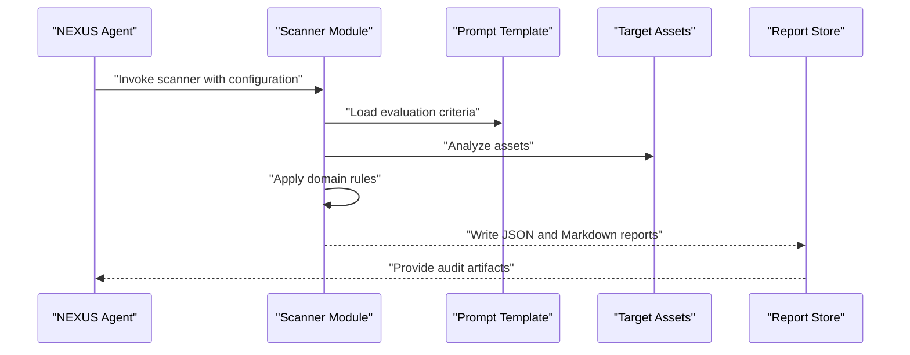

**Diagram sources**
- [cyber-security.js](file://agent/tools/scanners/cyber-security.js)
- [security-code-scanner.md](file://agent/prompts/internal/security-code-scanner.md)
- [report_cyber-security_AUDIT-1778660095718.json](file://memory/raw/reports/report_cyber-security_AUDIT-1778660095718.json)
- [NEXUS_REPORT_CYBER-SECURITY_AUDIT-1779702317598.MD](file://memory/raw/NEXUS_REPORT_CYBER-SECURITY_AUDIT-1779702317598.MD)

## Detailed Component Analysis

### Cyber-security Scanner
Purpose: Conduct vulnerability assessments and security analysis aligned with internal security prompts.

Processing logic:
- Loads security evaluation criteria from the prompt template.
- Scans target assets for security misconfigurations and risks.
- Produces structured findings and severity scores.
- Persists JSON and Markdown reports for audit trails.

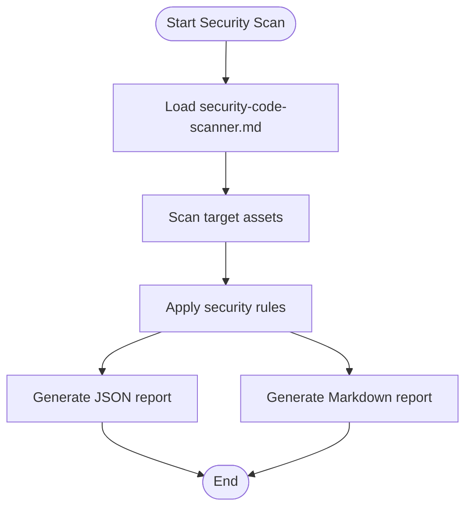

**Diagram sources**
- [cyber-security.js](file://agent/tools/scanners/cyber-security.js)
- [security-code-scanner.md](file://agent/prompts/internal/security-code-scanner.md)
- [report_cyber-security_AUDIT-1778660095718.json](file://memory/raw/reports/report_cyber-security_AUDIT-1778660095718.json)
- [NEXUS_REPORT_CYBER-SECURITY_AUDIT-1779702317598.MD](file://memory/raw/NEXUS_REPORT_CYBER-SECURITY_AUDIT-1779702317598.MD)

**Section sources**
- [cyber-security.js](file://agent/tools/scanners/cyber-security.js)
- [security-code-scanner.md](file://agent/prompts/internal/security-code-scanner.md)
- [report_cyber-security_AUDIT-1778660095718.json](file://memory/raw/reports/report_cyber-security_AUDIT-1778660095718.json)
- [NEXUS_REPORT_CYBER-SECURITY_AUDIT-1779702317598.MD](file://memory/raw/NEXUS_REPORT_CYBER-SECURITY_AUDIT-1779702317598.MD)

### Database-architect Scanner
Purpose: Evaluate database schema and data integrity against established standards.

Processing logic:
- Loads schema evaluation criteria from the prompt template.
- Inspects database assets for normalization, constraints, and naming conventions.
- Generates structured findings and remediation suggestions.
- Persists JSON and Markdown reports.

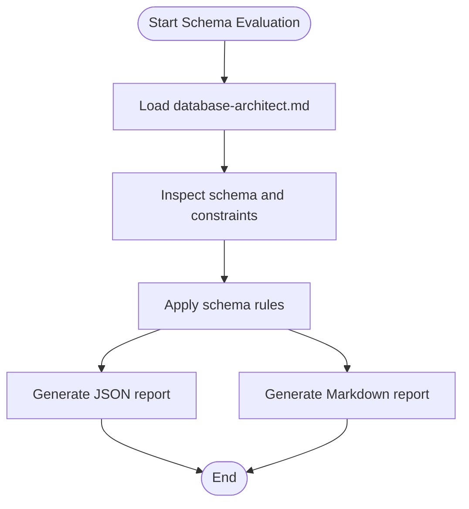

**Diagram sources**
- [database-architect.js](file://agent/tools/scanners/database-architect.js)
- [database-architect.md](file://agent/prompts/internal/database-architect.md)
- [report_database-architect_AUDIT-1778660095718.json](file://memory/raw/reports/report_database-architect_AUDIT-1778660095718.json)
- [NEXUS_REPORT_DATABASE-ARCHITECT_AUDIT-1779702317598.MD](file://memory/raw/NEXUS_REPORT_DATABASE-ARCHITECT_AUDIT-1779702317598.MD)

**Section sources**
- [database-architect.js](file://agent/tools/scanners/database-architect.js)
- [database-architect.md](file://agent/prompts/internal/database-architect.md)
- [report_database-architect_AUDIT-1778660095718.json](file://memory/raw/reports/report_database-architect_AUDIT-1778660095718.json)
- [NEXUS_REPORT_DATABASE-ARCHITECT_AUDIT-1779702317598.MD](file://memory/raw/NEXUS_REPORT_DATABASE-ARCHITECT_AUDIT-1779702317598.MD)

### Documentation-architect Scanner
Purpose: Assess documentation quality, completeness, and adherence to style guidelines.

Processing logic:
- Loads documentation evaluation criteria from the prompt template.
- Reviews documentation assets for coverage, clarity, and structure.
- Produces quality metrics and improvement recommendations.
- Persists JSON and Markdown reports.

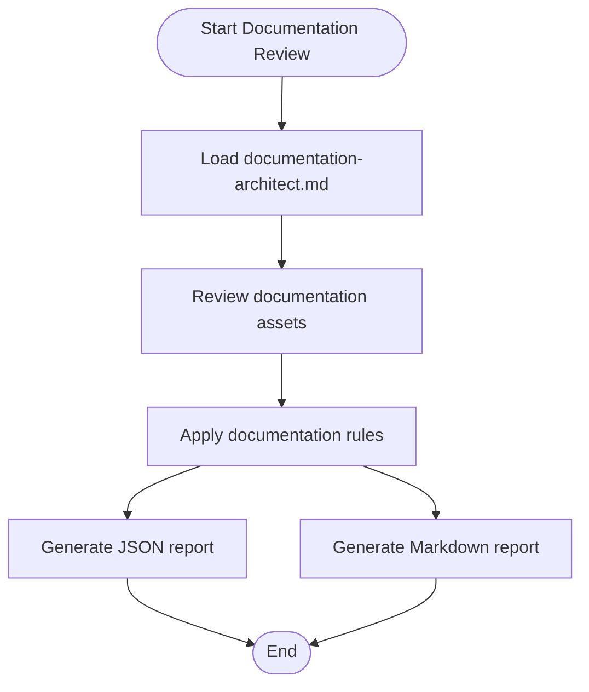

**Diagram sources**
- [documentation-architect.js](file://agent/tools/scanners/documentation-architect.js)
- [documentation-architect.md](file://agent/prompts/internal/documentation-architect.md)
- [report_documentation-architect_AUDIT-1778660095718.json](file://memory/raw/reports/report_documentation-architect_AUDIT-1778660095718.json)
- [NEXUS_REPORT_DOCUMENTATION-ARCHITECT_AUDIT-1779702317598.MD](file://memory/raw/NEXUS_REPORT_DOCUMENTATION-ARCHITECT_AUDIT-1779702317598.MD)

**Section sources**
- [documentation-architect.js](file://agent/tools/scanners/documentation-architect.js)
- [documentation-architect.md](file://agent/prompts/internal/documentation-architect.md)
- [report_documentation-architect_AUDIT-1778660095718.json](file://memory/raw/reports/report_documentation-architect_AUDIT-1778660095718.json)
- [NEXUS_REPORT_DOCUMENTATION-ARCHITECT_AUDIT-1779702317598.MD](file://memory/raw/NEXUS_REPORT_DOCUMENTATION-ARCHITECT_AUDIT-1779702317598.MD)

### VCS Architect Scanner
Purpose: Analyze version control practices, branch strategies, and commit hygiene.

Processing logic:
- Loads VCS evaluation criteria from the prompt template.
- Inspects repository history and branching patterns.
- Flags anti-patterns and suggests improvements.
- Persists JSON and Markdown reports.

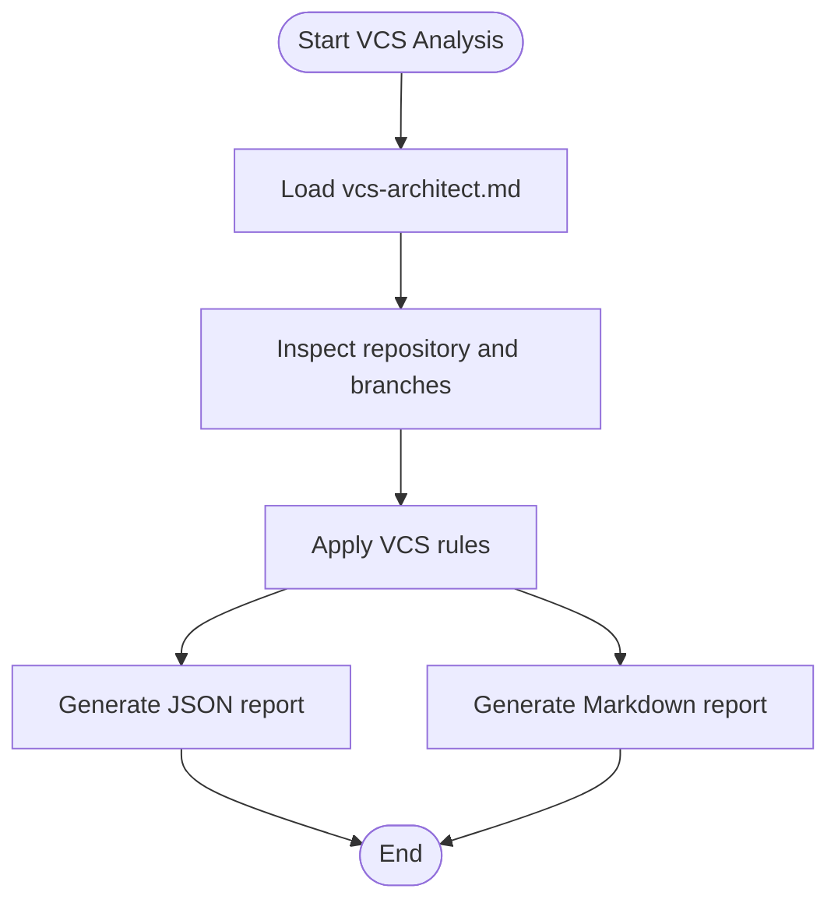

**Diagram sources**
- [vcs-architect.js](file://agent/tools/scanners/vcs-architect.js)
- [vcs-architect.md](file://agent/prompts/internal/vcs-architect.md)
- [report_vcs-architect_AUDIT-1778660095718.json](file://memory/raw/reports/report_vcs-architect_AUDIT-1778660095718.json)
- [NEXUS_REPORT_VCS-ARCHITECT_AUDIT-1779702317598.MD](file://memory/raw/NEXUS_REPORT_VCS-ARCHITECT_AUDIT-1779702317598.MD)

**Section sources**
- [vcs-architect.js](file://agent/tools/scanners/vcs-architect.js)
- [vcs-architect.md](file://agent/prompts/internal/vcs-architect.md)
- [report_vcs-architect_AUDIT-1778660095718.json](file://memory/raw/reports/report_vcs-architect_AUDIT-1778660095718.json)
- [NEXUS_REPORT_VCS-ARCHITECT_AUDIT-1779702317598.MD](file://memory/raw/NEXUS_REPORT_VCS-ARCHITECT_AUDIT-1779702317598.MD)

### Branding Scanner
Purpose: Enforce visual consistency and brand guidelines across UI assets.

Processing logic:
- Loads branding evaluation criteria from the prompt template.
- Analyzes visual assets for consistency and compliance.
- Generates findings and remediation steps.
- Persists JSON and Markdown reports.

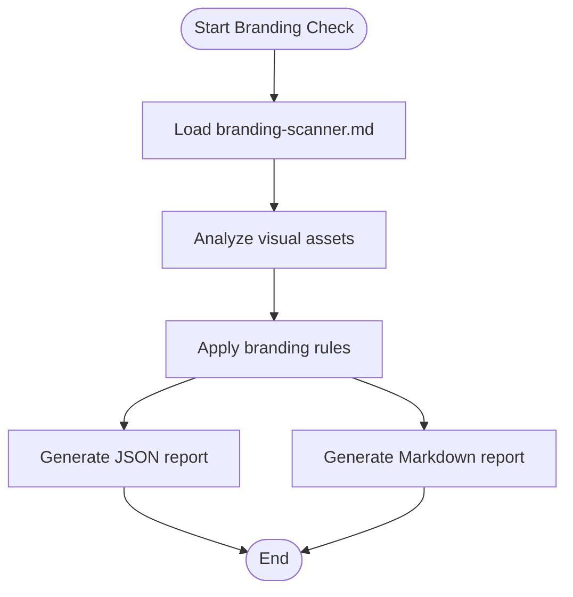

**Diagram sources**
- [branding-scanner.js](file://agent/tools/scanners/branding-scanner.js)
- [branding-scanner.md](file://agent/prompts/internal/branding-scanner.md)
- [report_ux-engineer_AUDIT-1778660095718.json](file://memory/raw/reports/report_ux-engineer_AUDIT-1778660095718.json)
- [NEXUS_REPORT_UX-ENGINEER_AUDIT-1779702317598.MD](file://memory/raw/NEXUS_REPORT_UX-ENGINEER_AUDIT-1779702317598.MD)

**Section sources**
- [branding-scanner.js](file://agent/tools/scanners/branding-scanner.js)
- [branding-scanner.md](file://agent/prompts/internal/branding-scanner.md)
- [report_ux-engineer_AUDIT-1778660095718.json](file://memory/raw/reports/report_ux-engineer_AUDIT-1778660095718.json)
- [NEXUS_REPORT_UX-ENGINEER_AUDIT-1779702317598.MD](file://memory/raw/NEXUS_REPORT_UX-ENGINEER_AUDIT-1779702317598.MD)

### SEO-Performance Specialist
Purpose: Optimize content for search visibility and performance signals.

Processing logic:
- Loads SEO-performance criteria from the prompt template.
- Evaluates content for on-page SEO and performance indicators.
- Produces actionable recommendations.
- Persists JSON and Markdown reports.

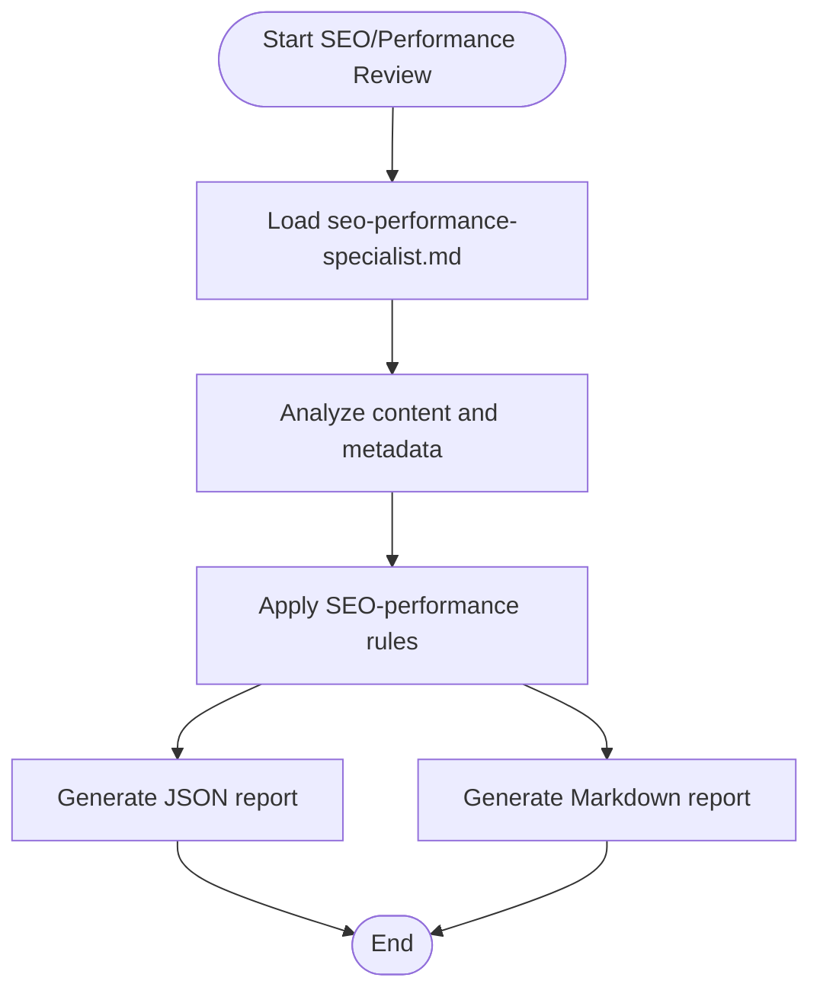

**Diagram sources**
- [seo-performance-specialist.js](file://agent/tools/scanners/seo-performance-specialist.js)
- [seo-performance-specialist.md](file://agent/prompts/internal/seo-performance-specialist.md)
- [report_seo-performance-specialist_AUDIT-1778660095718.json](file://memory/raw/reports/report_seo-performance-specialist_AUDIT-1778660095718.json)
- [NEXUS_REPORT_SEO-PERFORMANCE-SPECIALIST_AUDIT-1779702317598.MD](file://memory/raw/NEXUS_REPORT_SEO-PERFORMANCE-SPECIALIST_AUDIT-1779702317598.MD)

**Section sources**
- [seo-performance-specialist.js](file://agent/tools/scanners/seo-performance-specialist.js)
- [seo-performance-specialist.md](file://agent/prompts/internal/seo-performance-specialist.md)
- [report_seo-performance-specialist_AUDIT-1778660095718.json](file://memory/raw/reports/report_seo-performance-specialist_AUDIT-1778660095718.json)
- [NEXUS_REPORT_SEO-PERFORMANCE-SPECIALIST_AUDIT-1779702317598.MD](file://memory/raw/NEXUS_REPORT_SEO-PERFORMANCE-SPECIALIST_AUDIT-1779702317598.MD)

### UX Engineer Scanner
Purpose: Evaluate user experience, accessibility, and interaction patterns.

Processing logic:
- Loads UX evaluation criteria from the prompt template.
- Reviews UI/UX assets for usability and accessibility.
- Generates findings and improvement suggestions.
- Persists JSON and Markdown reports.

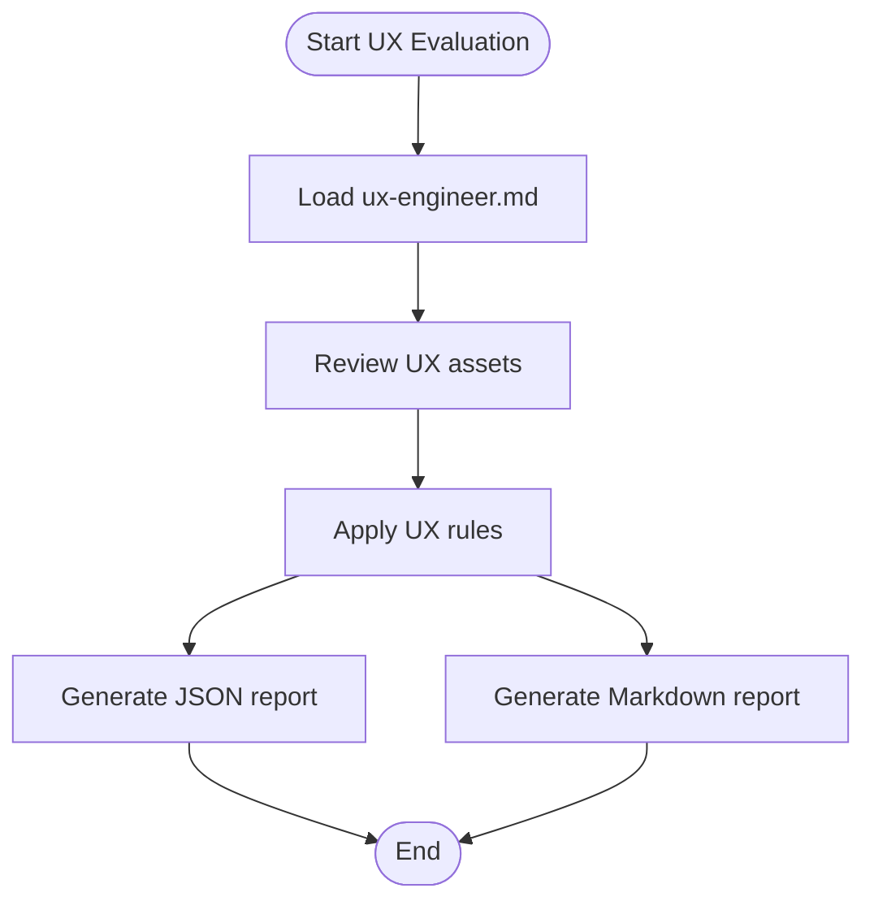

**Diagram sources**
- [ux-engineer.js](file://agent/tools/scanners/ux-engineer.js)
- [ux-engineer.md](file://agent/prompts/internal/ux-engineer.md)
- [report_ux-engineer_AUDIT-1778660095718.json](file://memory/raw/reports/report_ux-engineer_AUDIT-1778660095718.json)
- [NEXUS_REPORT_UX-ENGINEER_AUDIT-1779702317598.MD](file://memory/raw/NEXUS_REPORT_UX-ENGINEER_AUDIT-1779702317598.MD)

**Section sources**
- [ux-engineer.js](file://agent/tools/scanners/ux-engineer.js)
- [ux-engineer.md](file://agent/prompts/internal/ux-engineer.md)
- [report_ux-engineer_AUDIT-1778660095718.json](file://memory/raw/reports/report_ux-engineer_AUDIT-1778660095718.json)
- [NEXUS_REPORT_UX-ENGINEER_AUDIT-1779702317598.MD](file://memory/raw/NEXUS_REPORT_UX-ENGINEER_AUDIT-1779702317598.MD)

### Manifest.json Validator
Purpose: Validate application configuration manifests for correctness and completeness.

Processing logic:
- Loads manifest validation rules from the prompt template.
- Parses and validates manifest entries.
- Flags missing or invalid fields.
- Persists JSON and Markdown reports.

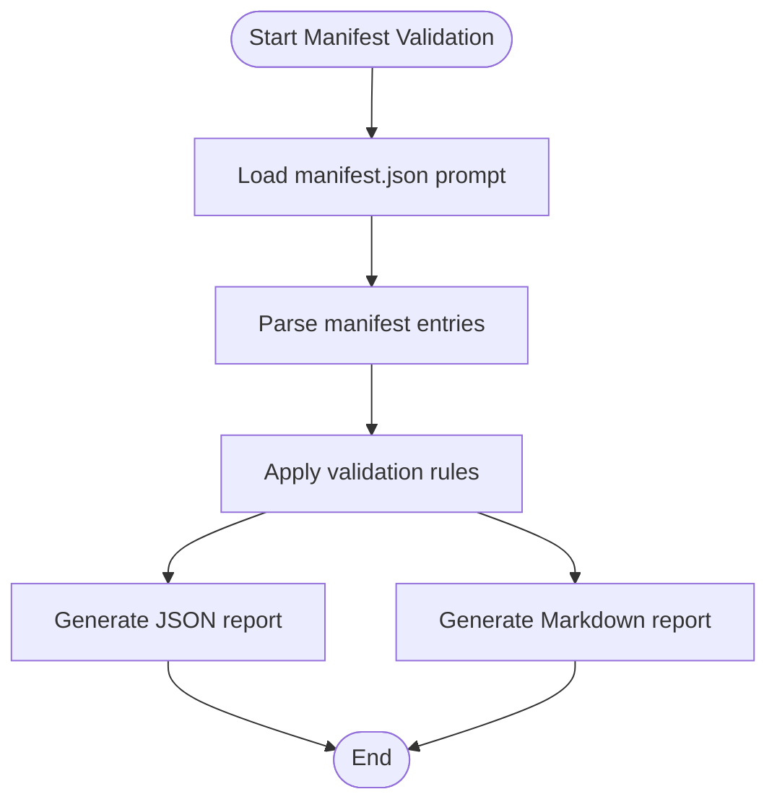

**Diagram sources**
- [manifest.json](file://agent/tools/scanners/manifest.json)
- [branding-scanner.md](file://agent/prompts/internal/branding-scanner.md)
- [report_ux-engineer_AUDIT-1778660095718.json](file://memory/raw/reports/report_ux-engineer_AUDIT-1778660095718.json)
- [NEXUS_REPORT_UX-ENGINEER_AUDIT-1779702317598.MD](file://memory/raw/NEXUS_REPORT_UX-ENGINEER_AUDIT-1779702317598.MD)

**Section sources**
- [manifest.json](file://agent/tools/scanners/manifest.json)
- [branding-scanner.md](file://agent/prompts/internal/branding-scanner.md)
- [report_ux-engineer_AUDIT-1778660095718.json](file://memory/raw/reports/report_ux-engineer_AUDIT-1778660095718.json)
- [NEXUS_REPORT_UX-ENGINEER_AUDIT-1779702317598.MD](file://memory/raw/NEXUS_REPORT_UX-ENGINEER_AUDIT-1779702317598.MD)

## Dependency Analysis
Scanners depend on:
- Prompt templates for evaluation logic.
- Target asset sets for analysis.
- Report stores for persistence.

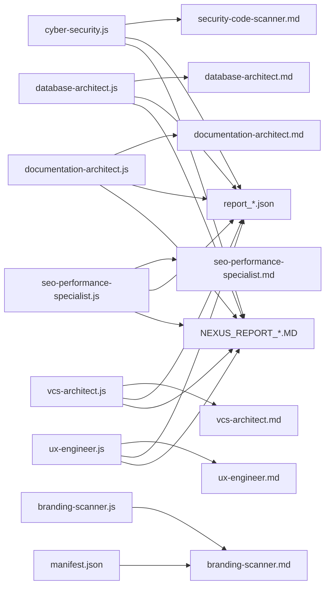

**Diagram sources**
- [cyber-security.js](file://agent/tools/scanners/cyber-security.js)
- [database-architect.js](file://agent/tools/scanners/database-architect.js)
- [documentation-architect.js](file://agent/tools/scanners/documentation-architect.js)
- [vcs-architect.js](file://agent/tools/scanners/vcs-architect.js)
- [branding-scanner.js](file://agent/tools/scanners/branding-scanner.js)
- [seo-performance-specialist.js](file://agent/tools/scanners/seo-performance-specialist.js)
- [ux-engineer.js](file://agent/tools/scanners/ux-engineer.js)
- [manifest.json](file://agent/tools/scanners/manifest.json)
- [security-code-scanner.md](file://agent/prompts/internal/security-code-scanner.md)
- [database-architect.md](file://agent/prompts/internal/database-architect.md)
- [documentation-architect.md](file://agent/prompts/internal/documentation-architect.md)
- [vcs-architect.md](file://agent/prompts/internal/vcs-architect.md)
- [branding-scanner.md](file://agent/prompts/internal/branding-scanner.md)
- [seo-performance-specialist.md](file://agent/prompts/internal/seo-performance-specialist.md)
- [ux-engineer.md](file://agent/prompts/internal/ux-engineer.md)
- [report_cyber-security_AUDIT-1778660095718.json](file://memory/raw/reports/report_cyber-security_AUDIT-1778660095718.json)
- [report_database-architect_AUDIT-1778660095718.json](file://memory/raw/reports/report_database-architect_AUDIT-1778660095718.json)
- [report_documentation-architect_AUDIT-1778660095718.json](file://memory/raw/reports/report_documentation-architect_AUDIT-1778660095718.json)
- [report_seo-performance-specialist_AUDIT-1778660095718.json](file://memory/raw/reports/report_seo-performance-specialist_AUDIT-1778660095718.json)
- [report_ux-engineer_AUDIT-1778660095718.json](file://memory/raw/reports/report_ux-engineer_AUDIT-1778660095718.json)
- [report_vcs-architect_AUDIT-1778660095718.json](file://memory/raw/reports/report_vcs-architect_AUDIT-1778660095718.json)
- [NEXUS_REPORT_CYBER-SECURITY_AUDIT-1779702317598.MD](file://memory/raw/NEXUS_REPORT_CYBER-SECURITY_AUDIT-1779702317598.MD)
- [NEXUS_REPORT_DATABASE-ARCHITECT_AUDIT-1779702317598.MD](file://memory/raw/NEXUS_REPORT_DATABASE-ARCHITECT_AUDIT-1779702317598.MD)
- [NEXUS_REPORT_DOCUMENTATION-ARCHITECT_AUDIT-1779702317598.MD](file://memory/raw/NEXUS_REPORT_DOCUMENTATION-ARCHITECT_AUDIT-1779702317598.MD)
- [NEXUS_REPORT_SEO-PERFORMANCE-SPECIALIST_AUDIT-1779702317598.MD](file://memory/raw/NEXUS_REPORT_SEO-PERFORMANCE-SPECIALIST_AUDIT-1779702317598.MD)
- [NEXUS_REPORT_UX-ENGINEER_AUDIT-1779702317598.MD](file://memory/raw/NEXUS_REPORT_UX-ENGINEER_AUDIT-1779702317598.MD)
- [NEXUS_REPORT_VCS-ARCHITECT_AUDIT-1779702317598.MD](file://memory/raw/NEXUS_REPORT_VCS-ARCHITECT_AUDIT-1779702317598.MD)

**Section sources**
- [cyber-security.js](file://agent/tools/scanners/cyber-security.js)
- [database-architect.js](file://agent/tools/scanners/database-architect.js)
- [documentation-architect.js](file://agent/tools/scanners/documentation-architect.js)
- [vcs-architect.js](file://agent/tools/scanners/vcs-architect.js)
- [branding-scanner.js](file://agent/tools/scanners/branding-scanner.js)
- [seo-performance-specialist.js](file://agent/tools/scanners/seo-performance-specialist.js)
- [ux-engineer.js](file://agent/tools/scanners/ux-engineer.js)
- [manifest.json](file://agent/tools/scanners/manifest.json)

## Performance Considerations
- Rule complexity: Prefer modular rule sets to reduce scan time.
- Incremental scanning: Focus on changed assets to minimize overhead.
- Caching: Reuse validated manifests and previously computed results.
- Parallelization: Run independent scanners concurrently where safe.
- Report size: Limit verbose outputs to essential findings for faster processing.

[No sources needed since this section provides general guidance]

## Troubleshooting Guide
Common issues and resolutions:
- Missing prompt templates: Ensure prompt files exist and are readable by the scanner.
- Empty or malformed reports: Verify scanner configuration and target asset paths.
- Permission errors: Confirm write permissions to the report directory.
- Timeout during scans: Reduce rule scope or increase timeout thresholds.
- Inconsistent results: Align rule sets across environments and versions.

**Section sources**
- [cyber-security.js](file://agent/tools/scanners/cyber-security.js)
- [database-architect.js](file://agent/tools/scanners/database-architect.js)
- [documentation-architect.js](file://agent/tools/scanners/documentation-architect.js)
- [vcs-architect.js](file://agent/tools/scanners/vcs-architect.js)
- [branding-scanner.js](file://agent/tools/scanners/branding-scanner.js)
- [seo-performance-specialist.js](file://agent/tools/scanners/seo-performance-specialist.js)
- [ux-engineer.js](file://agent/tools/scanners/ux-engineer.js)
- [manifest.json](file://agent/tools/scanners/manifest.json)

## Conclusion
The NEXUS AI scanner suite provides a cohesive framework for automated assessment across security, databases, documentation, version control, branding, SEO/performance, UX, and manifest validation. By leveraging prompt-driven evaluation logic, structured reporting, and persistent audit artifacts, teams can maintain high-quality systems with consistent governance and continuous improvement.

[No sources needed since this section summarizes without analyzing specific files]

## Appendices

### Scanner Configuration and Custom Rules
- Configuration: Each scanner loads a corresponding prompt template that defines evaluation criteria and scoring logic.
- Custom rules: Extend or override rules by editing the associated prompt template while keeping the scanner invocation unchanged.
- Integration: Scanners are invoked by NEXUS agents and write JSON and Markdown reports to the memory/raw/reports and memory/raw directories respectively.

**Section sources**
- [security-code-scanner.md](file://agent/prompts/internal/security-code-scanner.md)
- [database-architect.md](file://agent/prompts/internal/database-architect.md)
- [documentation-architect.md](file://agent/prompts/internal/documentation-architect.md)
- [vcs-architect.md](file://agent/prompts/internal/vcs-architect.md)
- [branding-scanner.md](file://agent/prompts/internal/branding-scanner.md)
- [seo-performance-specialist.md](file://agent/prompts/internal/seo-performance-specialist.md)
- [ux-engineer.md](file://agent/prompts/internal/ux-engineer.md)

### Reporting Mechanisms
- JSON reports: Structured findings for machine processing and integration.
- Markdown reports: Human-readable summaries for audit trails and compliance documentation.

**Section sources**
- [report_cyber-security_AUDIT-1778660095718.json](file://memory/raw/reports/report_cyber-security_AUDIT-1778660095718.json)
- [report_database-architect_AUDIT-1778660095718.json](file://memory/raw/reports/report_database-architect_AUDIT-1778660095718.json)
- [report_documentation-architect_AUDIT-1778660095718.json](file://memory/raw/reports/report_documentation-architect_AUDIT-1778660095718.json)
- [report_seo-performance-specialist_AUDIT-1778660095718.json](file://memory/raw/reports/report_seo-performance-specialist_AUDIT-1778660095718.json)
- [report_ux-engineer_AUDIT-1778660095718.json](file://memory/raw/reports/report_ux-engineer_AUDIT-1778660095718.json)
- [report_vcs-architect_AUDIT-1778660095718.json](file://memory/raw/reports/report_vcs-architect_AUDIT-1778660095718.json)
- [NEXUS_REPORT_CYBER-SECURITY_AUDIT-1779702317598.MD](file://memory/raw/NEXUS_REPORT_CYBER-SECURITY_AUDIT-1779702317598.MD)
- [NEXUS_REPORT_DATABASE-ARCHITECT_AUDIT-1779702317598.MD](file://memory/raw/NEXUS_REPORT_DATABASE-ARCHITECT_AUDIT-1779702317598.MD)
- [NEXUS_REPORT_DOCUMENTATION-ARCHITECT_AUDIT-1779702317598.MD](file://memory/raw/NEXUS_REPORT_DOCUMENTATION-ARCHITECT_AUDIT-1779702317598.MD)
- [NEXUS_REPORT_SEO-PERFORMANCE-SPECIALIST_AUDIT-1779702317598.MD](file://memory/raw/NEXUS_REPORT_SEO-PERFORMANCE-SPECIALIST_AUDIT-1779702317598.MD)
- [NEXUS_REPORT_UX-ENGINEER_AUDIT-1779702317598.MD](file://memory/raw/NEXUS_REPORT_UX-ENGINEER_AUDIT-1779702317598.MD)
- [NEXUS_REPORT_VCS-ARCHITECT_AUDIT-1779702317598.MD](file://memory/raw/NEXUS_REPORT_VCS-ARCHITECT_AUDIT-1779702317598.MD)

### Example Workflows
- Automated security scanning: Invoke the cyber-security scanner with configured targets; review JSON and Markdown reports for risk findings and remediation steps.
- Documentation quality metrics: Run the documentation-architect scanner to assess coverage and clarity; export metrics from the JSON report for trend analysis.
- Performance optimization: Use the SEO-performance specialist scanner to identify on-page optimization opportunities; apply recommendations and re-scan to validate improvements.

[No sources needed since this section provides general guidance]