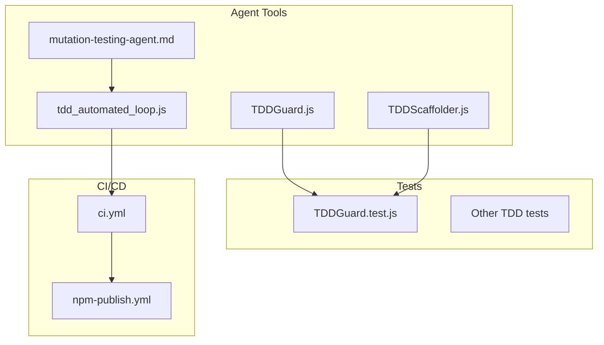
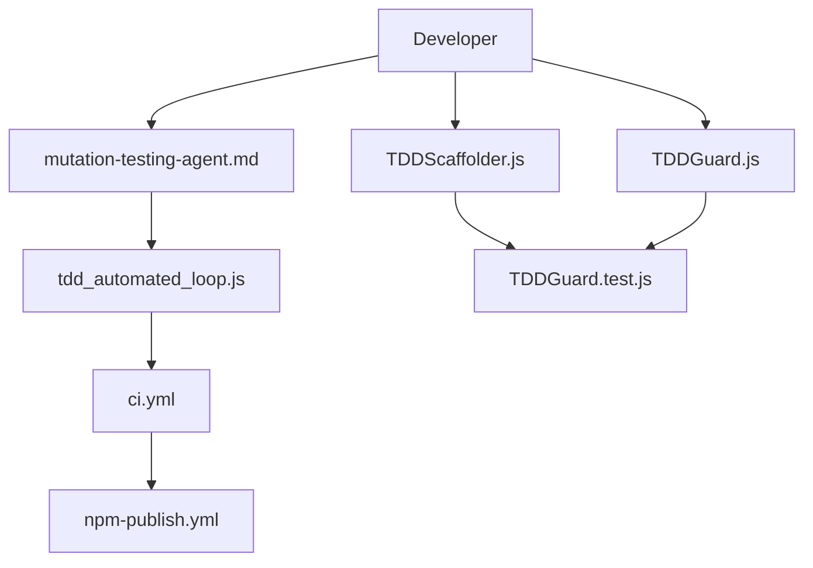
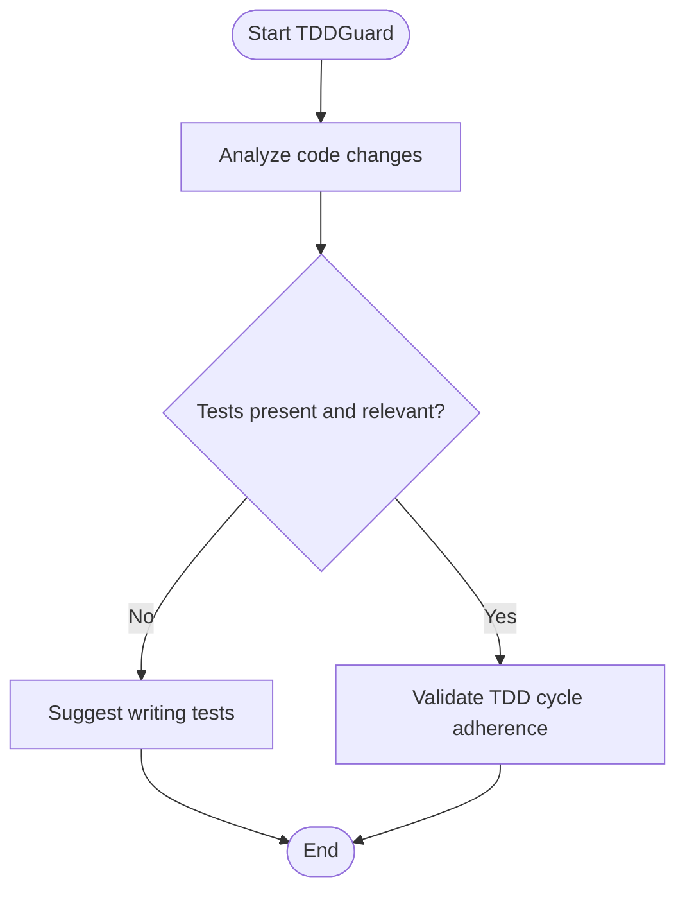
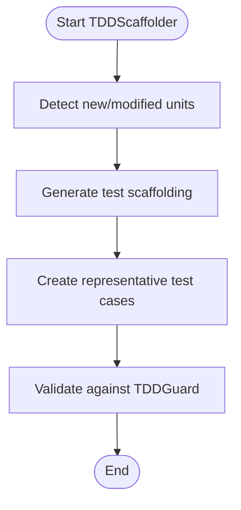
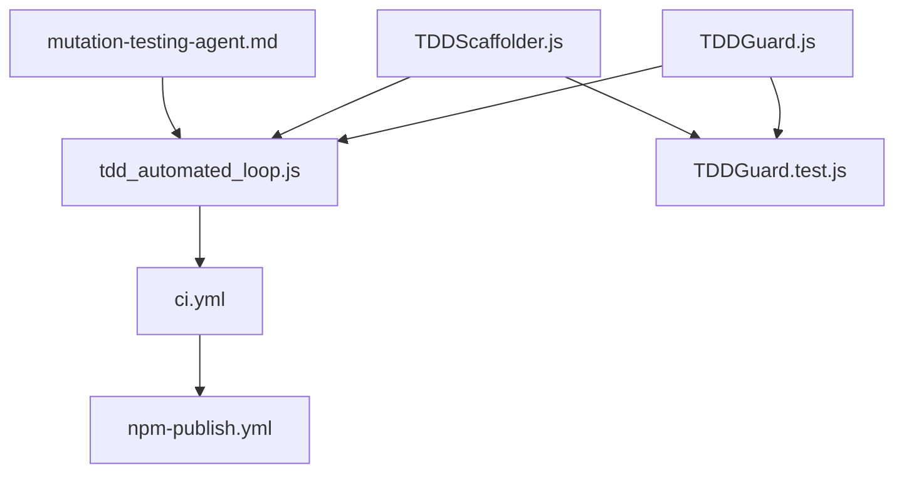

# Testing and Quality Assurance

<cite>
**Referenced Files in This Document**
- [TDDGuard.js](file://agent/tools/TDDGuard.js)
- [TDDScaffolder.js](file://agent/tools/TDDScaffolder.js)
- [mutation-testing-agent.md](file://agent/prompts/internal/mutation-testing-agent.md)
- [tdd_automated_loop.js](file://agent/scripts/tdd_automated_loop.js)
- [ci.yml](file://.github/workflows/ci.yml)
- [npm-publish.yml](file://.github/workflows/npm-publish.yml)
- [TDDGuard.test.js](file://tests/TDD/TDDGuard.test.js)
- [README.md](file://README.md)
</cite>

## Table of Contents
1. [Introduction](#introduction)
2. [Project Structure](#project-structure)
3. [Core Components](#core-components)
4. [Architecture Overview](#architecture-overview)
5. [Detailed Component Analysis](#detailed-component-analysis)
6. [Dependency Analysis](#dependency-analysis)
7. [Performance Considerations](#performance-considerations)
8. [Troubleshooting Guide](#troubleshooting-guide)
9. [Conclusion](#conclusion)
10. [Appendices](#appendices)

## Introduction
This document describes the testing and quality assurance capabilities in NEXUS AI with a focus on three key tools:
- TDDGuard: Enforces Test-Driven Development (TDD) practices during development.
- TDDScaffolder: Generates test scaffolding and test cases to accelerate TDD workflows.
- MutationTestingAgent: Provides advanced code mutation testing to assess test suite robustness.

It also covers testing workflow automation, test coverage analysis, continuous testing integration, and quality gate enforcement. Configuration options for test frameworks, assertion libraries, and quality metrics are outlined, along with examples of automated testing pipelines and integration with CI/CD systems.

## Project Structure
The testing and QA tools are primarily located under the agent/tools directory and agent/scripts, with supporting prompts and tests under agent/prompts and tests/TDD respectively. CI/CD workflows are defined under .github/workflows.



**Diagram sources**
- [TDDGuard.js](file://agent/tools/TDDGuard.js)
- [TDDScaffolder.js](file://agent/tools/TDDScaffolder.js)
- [mutation-testing-agent.md](file://agent/prompts/internal/mutation-testing-agent.md)
- [tdd_automated_loop.js](file://agent/scripts/tdd_automated_loop.js)
- [TDDGuard.test.js](file://tests/TDD/TDDGuard.test.js)
- [ci.yml](file://.github/workflows/ci.yml)
- [npm-publish.yml](file://.github/workflows/npm-publish.yml)

**Section sources**
- [TDDGuard.js](file://agent/tools/TDDGuard.js)
- [TDDScaffolder.js](file://agent/tools/TDDScaffolder.js)
- [mutation-testing-agent.md](file://agent/prompts/internal/mutation-testing-agent.md)
- [tdd_automated_loop.js](file://agent/scripts/tdd_automated_loop.js)
- [TDDGuard.test.js](file://tests/TDD/TDDGuard.test.js)
- [ci.yml](file://.github/workflows/ci.yml)
- [npm-publish.yml](file://.github/workflows/npm-publish.yml)

## Core Components
- TDDGuard enforces TDD discipline by validating that new code changes are accompanied by appropriate tests, guiding developers to write tests first and ensuring adherence to TDD cycles.
- TDDScaffolder accelerates TDD by generating boilerplate test scaffolding and representative test cases for new or modified functions, reducing friction in test authoring.
- MutationTestingAgent leverages mutation testing to evaluate the effectiveness of existing tests by introducing controlled faults and measuring whether tests detect them, providing insights into test suite strength.

These components integrate with automated loops and CI/CD pipelines to maintain quality gates and enforce standards across development iterations.

**Section sources**
- [TDDGuard.js](file://agent/tools/TDDGuard.js)
- [TDDScaffolder.js](file://agent/tools/TDDScaffolder.js)
- [mutation-testing-agent.md](file://agent/prompts/internal/mutation-testing-agent.md)

## Architecture Overview
The testing and QA architecture centers around developer-facing tools and prompts that guide TDD practices, automated scripts that run tests and mutations, and CI/CD workflows that enforce quality gates.



**Diagram sources**
- [TDDGuard.js](file://agent/tools/TDDGuard.js)
- [TDDScaffolder.js](file://agent/tools/TDDScaffolder.js)
- [mutation-testing-agent.md](file://agent/prompts/internal/mutation-testing-agent.md)
- [tdd_automated_loop.js](file://agent/scripts/tdd_automated_loop.js)
- [ci.yml](file://.github/workflows/ci.yml)
- [npm-publish.yml](file://.github/workflows/npm-publish.yml)
- [TDDGuard.test.js](file://tests/TDD/TDDGuard.test.js)

## Detailed Component Analysis

### TDDGuard
TDDGuard enforces TDD by checking that new code changes are paired with tests and validating adherence to TDD cycles. It integrates with the automated TDD loop to ensure continuous enforcement of test-first practices.

Key responsibilities:
- Validate test presence and relevance for new or modified code.
- Enforce TDD cycle completion (Red-Green-Refactor) signals.
- Integrate with automated testing scripts and CI checks.



**Diagram sources**
- [TDDGuard.js](file://agent/tools/TDDGuard.js)

**Section sources**
- [TDDGuard.js](file://agent/tools/TDDGuard.js)
- [TDDGuard.test.js](file://tests/TDD/TDDGuard.test.js)

### TDDScaffolder
TDDScaffolder generates test scaffolding and representative test cases to accelerate TDD. It reduces the cognitive load of writing boilerplate and encourages comprehensive test coverage early in development.

Key responsibilities:
- Generate test scaffolding for new functions/classes.
- Produce representative test cases aligned with TDD principles.
- Integrate with TDDGuard to validate generated tests.



**Diagram sources**
- [TDDScaffolder.js](file://agent/tools/TDDScaffolder.js)

**Section sources**
- [TDDScaffolder.js](file://agent/tools/TDDScaffolder.js)
- [TDDGuard.test.js](file://tests/TDD/TDDGuard.test.js)

### MutationTestingAgent
MutationTestingAgent performs advanced mutation testing to measure test suite effectiveness. It introduces controlled mutations to code and verifies whether tests detect them, providing quantitative quality metrics.

Key responsibilities:
- Parse and instrument code for mutation.
- Execute mutated variants under test harness.
- Report mutation scores and weak test areas.
- Feed results back into the TDD loop for improvement.

```mermaid
sequenceDiagram
participant Dev as "Developer"
participant MTDA as "MutationTestingAgent"
participant Loop as "tdd_automated_loop.js"
participant CI as "ci.yml"
participant Tests as "TDDGuard.test.js"
Dev->>MTDA : Request mutation analysis
MTDA->>Loop : Prepare mutated variants
Loop->>Tests : Run tests on mutated code
Tests-->>Loop : Results (survived/escaped mutations)
Loop->>MTDA : Aggregate mutation metrics
MTDA-->>Dev : Mutation report and recommendations
Loop->>CI : Trigger CI with mutation results
```

**Diagram sources**
- [mutation-testing-agent.md](file://agent/prompts/internal/mutation-testing-agent.md)
- [tdd_automated_loop.js](file://agent/scripts/tdd_automated_loop.js)
- [ci.yml](file://.github/workflows/ci.yml)
- [TDDGuard.test.js](file://tests/TDD/TDDGuard.test.js)

**Section sources**
- [mutation-testing-agent.md](file://agent/prompts/internal/mutation-testing-agent.md)
- [tdd_automated_loop.js](file://agent/scripts/tdd_automated_loop.js)
- [TDDGuard.test.js](file://tests/TDD/TDDGuard.test.js)

### Automated TDD Loop
The automated TDD loop coordinates TDDGuard, TDDScaffolder, and MutationTestingAgent to continuously enforce and improve testing quality. It triggers tests after code changes and mutation runs, feeding results back into the loop.

```mermaid
sequenceDiagram
participant Dev as "Developer"
participant TDSS as "TDDScaffolder"
participant TDDG as "TDDGuard"
participant Loop as "tdd_automated_loop.js"
participant Tests as "TDDGuard.test.js"
participant MTDA as "MutationTestingAgent"
Dev->>TDSS : Generate test scaffolding
TDSS->>TDDG : Validate generated tests
TDDG->>Loop : Approve TDD cycle
Loop->>Tests : Run unit tests
Tests-->>Loop : Test results
Loop->>MTDA : Run mutation tests
MTDA-->>Loop : Mutation metrics
Loop-->>Dev : Quality feedback and suggestions
```

**Diagram sources**
- [TDDScaffolder.js](file://agent/tools/TDDScaffolder.js)
- [TDDGuard.js](file://agent/tools/TDDGuard.js)
- [tdd_automated_loop.js](file://agent/scripts/tdd_automated_loop.js)
- [TDDGuard.test.js](file://tests/TDD/TDDGuard.test.js)
- [mutation-testing-agent.md](file://agent/prompts/internal/mutation-testing-agent.md)

**Section sources**
- [tdd_automated_loop.js](file://agent/scripts/tdd_automated_loop.js)
- [TDDGuard.js](file://agent/tools/TDDGuard.js)
- [TDDScaffolder.js](file://agent/tools/TDDScaffolder.js)
- [mutation-testing-agent.md](file://agent/prompts/internal/mutation-testing-agent.md)
- [TDDGuard.test.js](file://tests/TDD/TDDGuard.test.js)

## Dependency Analysis
The testing tools depend on each other and on the CI/CD infrastructure to form a cohesive quality assurance pipeline. TDDGuard and TDDScaffolder feed into the automated loop, which in turn triggers CI jobs and mutation testing.



**Diagram sources**
- [TDDGuard.js](file://agent/tools/TDDGuard.js)
- [TDDScaffolder.js](file://agent/tools/TDDScaffolder.js)
- [tdd_automated_loop.js](file://agent/scripts/tdd_automated_loop.js)
- [ci.yml](file://.github/workflows/ci.yml)
- [npm-publish.yml](file://.github/workflows/npm-publish.yml)
- [TDDGuard.test.js](file://tests/TDD/TDDGuard.test.js)
- [mutation-testing-agent.md](file://agent/prompts/internal/mutation-testing-agent.md)

**Section sources**
- [TDDGuard.js](file://agent/tools/TDDGuard.js)
- [TDDScaffolder.js](file://agent/tools/TDDScaffolder.js)
- [tdd_automated_loop.js](file://agent/scripts/tdd_automated_loop.js)
- [ci.yml](file://.github/workflows/ci.yml)
- [npm-publish.yml](file://.github/workflows/npm-publish.yml)
- [TDDGuard.test.js](file://tests/TDD/TDDGuard.test.js)
- [mutation-testing-agent.md](file://agent/prompts/internal/mutation-testing-agent.md)

## Performance Considerations
- Mutation testing can be computationally expensive; schedule it during off-peak CI slots or as optional stages to balance speed and coverage.
- Use incremental test runs and targeted mutation batches to reduce CI duration while maintaining quality insights.
- Cache test artifacts and mutation results to avoid redundant computations across pipeline runs.

## Troubleshooting Guide
Common issues and resolutions:
- Tests fail due to missing scaffolding: Use TDDScaffolder to generate test scaffolding and rerun TDDGuard validation.
- Mutation score low: Review mutation report outputs and strengthen edge-case tests identified by the MutationTestingAgent.
- CI failures in automated loop: Inspect ci.yml job logs and ensure the automated loop script executes with proper permissions and environment variables.

**Section sources**
- [TDDGuard.js](file://agent/tools/TDDGuard.js)
- [TDDScaffolder.js](file://agent/tools/TDDScaffolder.js)
- [mutation-testing-agent.md](file://agent/prompts/internal/mutation-testing-agent.md)
- [tdd_automated_loop.js](file://agent/scripts/tdd_automated_loop.js)
- [ci.yml](file://.github/workflows/ci.yml)

## Conclusion
NEXUS AI’s testing and QA tools provide a comprehensive TDD-centric framework that automates enforcement, scaffolding, and mutation-based quality assessment. By integrating TDDGuard, TDDScaffolder, and MutationTestingAgent into automated loops and CI/CD pipelines, teams can maintain high-quality standards, improve test coverage, and enforce quality gates consistently across development cycles.

## Appendices

### Configuration Options
- Test frameworks and assertion libraries: Configure via the automated loop and test harness to align with project standards.
- Quality metrics: Define thresholds for mutation scores and coverage to gate merges and releases.
- CI/CD integration: Use ci.yml to trigger automated testing and mutation runs; leverage npm-publish.yml for release gating.

**Section sources**
- [ci.yml](file://.github/workflows/ci.yml)
- [npm-publish.yml](file://.github/workflows/npm-publish.yml)
- [README.md](file://README.md)