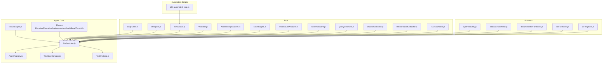
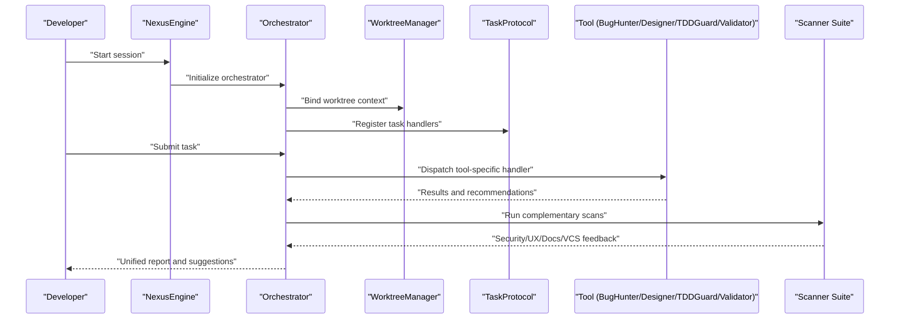
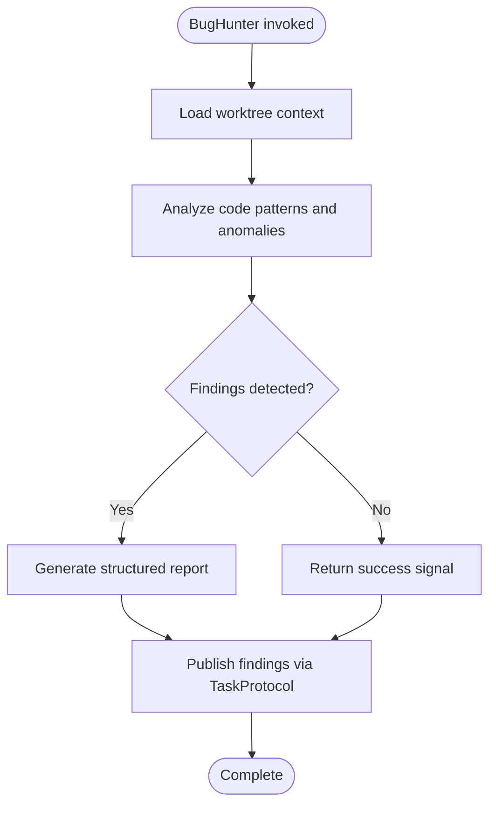
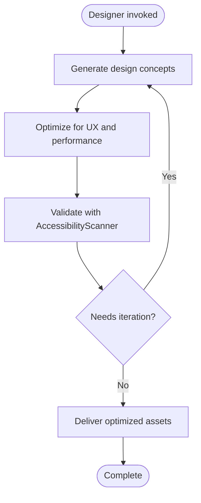
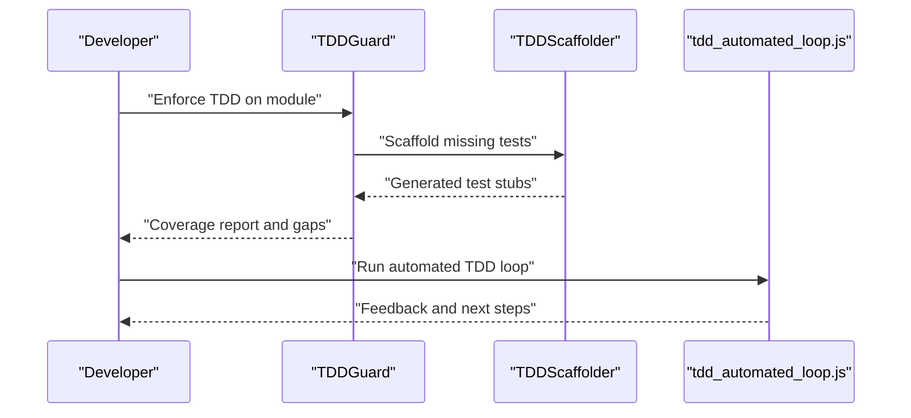
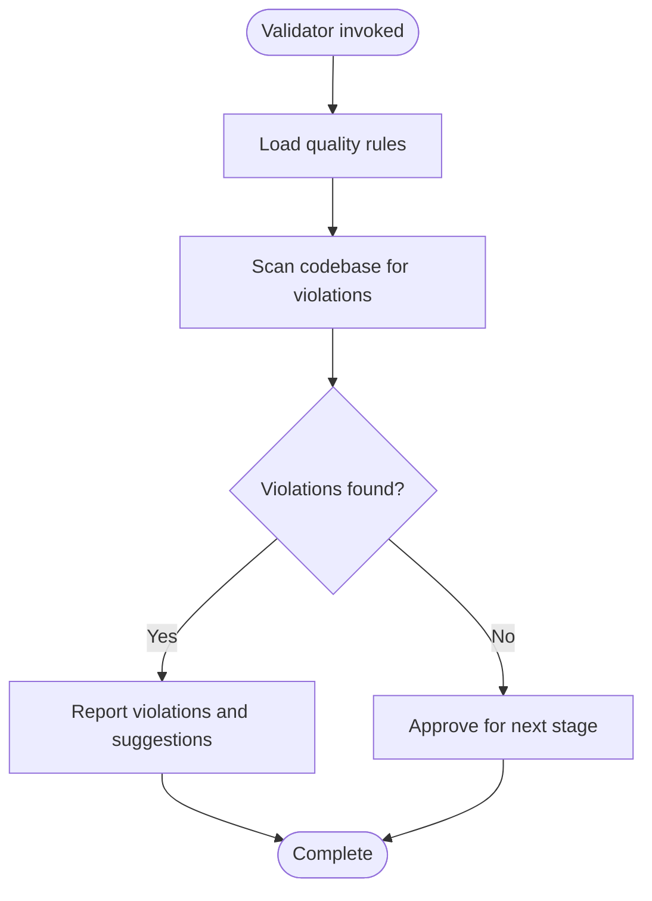
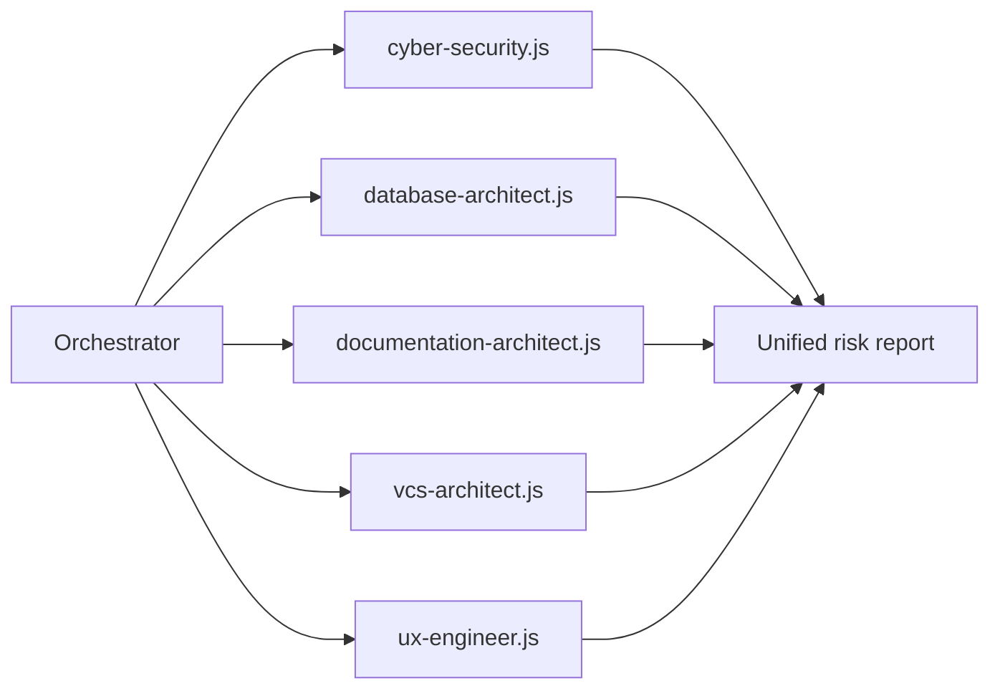
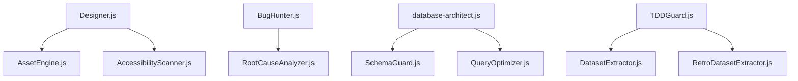
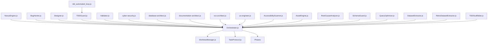

# Tools and Utilities

<cite>
**Referenced Files in This Document**
- [BugHunter.js](file://agent/tools/BugHunter.js)
- [Designer.js](file://agent/tools/Designer.js)
- [TDDGuard.js](file://agent/tools/TDDGuard.js)
- [Validator.js](file://agent/tools/Validator.js)
- [cyber-security.js](file://agent/tools/scanners/cyber-security.js)
- [database-architect.js](file://agent/tools/scanners/database-architect.js)
- [documentation-architect.js](file://agent/tools/scanners/documentation-architect.js)
- [vcs-architect.js](file://agent/tools/scanners/vcs-architect.js)
- [ux-engineer.js](file://agent/tools/scanners/ux-engineer.js)
- [AccessibilityScanner.js](file://agent/tools/AccessibilityScanner.js)
- [AssetEngine.js](file://agent/tools/AssetEngine.js)
- [RootCauseAnalyzer.js](file://agent/tools/RootCauseAnalyzer.js)
- [SchemaGuard.js](file://agent/tools/SchemaGuard.js)
- [QueryOptimizer.js](file://agent/tools/QueryOptimizer.js)
- [DatasetExtractor.js](file://agent/tools/DatasetExtractor.js)
- [RetroDatasetExtractor.js](file://agent/tools/RetroDatasetExtractor.js)
- [TDDScaffolder.js](file://agent/tools/TDDScaffolder.js)
- [tdd_automated_loop.js](file://agent/scripts/tdd_automated_loop.js)
- [NexusEngine.js](file://agent/core/NexusEngine.js)
- [AgentRegistry.js](file://agent/core/AgentRegistry.js)
- [Orchestrator.js](file://agent/core/Orchestrator.js)
- [WorktreeManager.js](file://agent/core/WorktreeManager.js)
- [TaskProtocol.js](file://agent/core/TaskProtocol.js)
- [AuditPhase.js](file://agent/core/phases/AuditPhase.js)
- [ExecutionPhase.js](file://agent/core/phases/ExecutionPhase.js)
- [ImplementationPhase.js](file://agent/core/phases/ImplementationPhase.js)
- [PlanningPhase.js](file://agent/core/phases/PlanningPhase.js)
- [BasePhase.js](file://agent/core/phases/BasePhase.js)
- [CoreUtils.js](file://agent/core/phases/CoreUtils.js)
- [NexusClock.js](file://agent/core/NexusClock.js)
- [ResourceMonitor.js](file://agent/core/ResourceMonitor.js)
- [EventBus.js](file://agent/core/EventBus.js)
- [main.js](file://agent/main.js)
- [README.md](file://README.md)
</cite>

## Table of Contents
1. [Introduction](#introduction)
2. [Project Structure](#project-structure)
3. [Core Components](#core-components)
4. [Architecture Overview](#architecture-overview)
5. [Detailed Component Analysis](#detailed-component-analysis)
6. [Dependency Analysis](#dependency-analysis)
7. [Performance Considerations](#performance-considerations)
8. [Troubleshooting Guide](#troubleshooting-guide)
9. [Conclusion](#conclusion)
10. [Appendices](#appendices)

## Introduction
This document describes the NEXUS AI tools and utilities ecosystem. It focuses on four primary tool families:
- BugHunter: automated bug detection and analysis
- Designer: UI/UX creation and optimization
- TDDGuard: test-driven development enforcement
- Validator: code quality assurance

It also covers the scanner suite (cybersecurity, database architects, documentation architects, VCS architects, UX engineers), supporting utilities (accessibility scanning, asset engine, root cause analyzer, schema guard, query optimizer, dataset extractors), and automation scripts for TDD loops. The guide explains configuration options, usage patterns, and integration with the agent system, along with practical examples across development scenarios.

## Project Structure
The tools and utilities live under the agent/tools directory and integrate with the broader agent core, which orchestrates phases, manages worktrees, and coordinates tasks. Scanner tools are organized under agent/tools/scanners. Utility scripts reside under agent/scripts.

**Diagram sources**
- [NexusEngine.js](file://agent/core/NexusEngine.js)
- [Orchestrator.js](file://agent/core/Orchestrator.js)
- [AgentRegistry.js](file://agent/core/AgentRegistry.js)
- [WorktreeManager.js](file://agent/core/WorktreeManager.js)
- [TaskProtocol.js](file://agent/core/TaskProtocol.js)
- [PlanningPhase.js](file://agent/core/phases/PlanningPhase.js)
- [ExecutionPhase.js](file://agent/core/phases/ExecutionPhase.js)
- [ImplementationPhase.js](file://agent/core/phases/ImplementationPhase.js)
- [AuditPhase.js](file://agent/core/phases/AuditPhase.js)
- [BasePhase.js](file://agent/core/phases/BasePhase.js)
- [CoreUtils.js](file://agent/core/phases/CoreUtils.js)
- [BugHunter.js](file://agent/tools/BugHunter.js)
- [Designer.js](file://agent/tools/Designer.js)
- [TDDGuard.js](file://agent/tools/TDDGuard.js)
- [Validator.js](file://agent/tools/Validator.js)
- [AccessibilityScanner.js](file://agent/tools/AccessibilityScanner.js)
- [AssetEngine.js](file://agent/tools/AssetEngine.js)
- [RootCauseAnalyzer.js](file://agent/tools/RootCauseAnalyzer.js)
- [SchemaGuard.js](file://agent/tools/SchemaGuard.js)
- [QueryOptimizer.js](file://agent/tools/QueryOptimizer.js)
- [DatasetExtractor.js](file://agent/tools/DatasetExtractor.js)
- [RetroDatasetExtractor.js](file://agent/tools/RetroDatasetExtractor.js)
- [TDDScaffolder.js](file://agent/tools/TDDScaffolder.js)
- [cyber-security.js](file://agent/tools/scanners/cyber-security.js)
- [database-architect.js](file://agent/tools/scanners/database-architect.js)
- [documentation-architect.js](file://agent/tools/scanners/documentation-architect.js)
- [vcs-architect.js](file://agent/tools/scanners/vcs-architect.js)
- [ux-engineer.js](file://agent/tools/scanners/ux-engineer.js)
- [tdd_automated_loop.js](file://agent/scripts/tdd_automated_loop.js)

**Section sources**
- [main.js](file://agent/main.js)
- [README.md](file://README.md)

## Core Components
This section introduces the four pillars of the NEXUS AI tools and their roles:
- BugHunter: identifies bugs and anomalies in code and suggests remediation steps
- Designer: generates and optimizes UI/UX assets and layouts
- TDDGuard: enforces TDD practices by validating tests, scaffolding missing tests, and guiding test coverage
- Validator: ensures code quality against standards and best practices

These tools are orchestrated by the agent system and can be combined with scanner suites and utility scripts to form end-to-end development workflows.

**Section sources**
- [BugHunter.js](file://agent/tools/BugHunter.js)
- [Designer.js](file://agent/tools/Designer.js)
- [TDDGuard.js](file://agent/tools/TDDGuard.js)
- [Validator.js](file://agent/tools/Validator.js)

## Architecture Overview
The agent system coordinates tools and scanners through a central engine and orchestrator. The NexusEngine initializes the runtime, the Orchestrator manages agent lifecycles and task routing, and WorktreeManager handles filesystem contexts. Phases define lifecycle stages for planning, execution, implementation, and auditing. Tools plug into this framework via the orchestrator and task protocol.

**Diagram sources**
- [NexusEngine.js](file://agent/core/NexusEngine.js)
- [Orchestrator.js](file://agent/core/Orchestrator.js)
- [WorktreeManager.js](file://agent/core/WorktreeManager.js)
- [TaskProtocol.js](file://agent/core/TaskProtocol.js)
- [BugHunter.js](file://agent/tools/BugHunter.js)
- [Designer.js](file://agent/tools/Designer.js)
- [TDDGuard.js](file://agent/tools/TDDGuard.js)
- [Validator.js](file://agent/tools/Validator.js)
- [cyber-security.js](file://agent/tools/scanners/cyber-security.js)
- [ux-engineer.js](file://agent/tools/scanners/ux-engineer.js)
- [documentation-architect.js](file://agent/tools/scanners/documentation-architect.js)
- [vcs-architect.js](file://agent/tools/scanners/vcs-architect.js)

## Detailed Component Analysis

### BugHunter
Purpose:
- Detect bugs and anomalies in codebases
- Provide actionable insights and remediation guidance

Key capabilities:
- Static analysis and pattern recognition
- Integration with the orchestrator for unified reporting
- Compatibility with scan results from other tools

Usage patterns:
- Run as part of a planning or audit phase
- Trigger after implementation to validate correctness
- Combine with Validator for quality gates

Integration:
- Dispatched via the orchestrator
- Results fed into the task protocol for downstream actions

**Diagram sources**
- [BugHunter.js](file://agent/tools/BugHunter.js)
- [Orchestrator.js](file://agent/core/Orchestrator.js)
- [TaskProtocol.js](file://agent/core/TaskProtocol.js)
- [WorktreeManager.js](file://agent/core/WorktreeManager.js)

**Section sources**
- [BugHunter.js](file://agent/tools/BugHunter.js)

### Designer
Purpose:
- Create and optimize UI/UX assets and layouts
- Align designs with accessibility and performance guidelines

Key capabilities:
- Asset generation and layout optimization
- Accessibility scanning integration
- Iterative refinement guided by UX engineer scans

Usage patterns:
- Use during planning to prototype solutions
- Optimize during implementation phases
- Validate with accessibility and UX scans

**Diagram sources**
- [Designer.js](file://agent/tools/Designer.js)
- [AccessibilityScanner.js](file://agent/tools/AccessibilityScanner.js)
- [ux-engineer.js](file://agent/tools/scanners/ux-engineer.js)

**Section sources**
- [Designer.js](file://agent/tools/Designer.js)

### TDDGuard
Purpose:
- Enforce test-driven development practices
- Scaffold missing tests and validate coverage
- Maintain TDD discipline across sprints

Key capabilities:
- Test discovery and scaffolding
- Coverage validation and gap analysis
- Automated TDD loop support

Usage patterns:
- Run during planning to set test expectations
- Execute after implementation to enforce coverage
- Integrate with automation scripts for continuous TDD

**Diagram sources**
- [TDDGuard.js](file://agent/tools/TDDGuard.js)
- [TDDScaffolder.js](file://agent/tools/TDDScaffolder.js)
- [tdd_automated_loop.js](file://agent/scripts/tdd_automated_loop.js)

**Section sources**
- [TDDGuard.js](file://agent/tools/TDDGuard.js)
- [TDDScaffolder.js](file://agent/tools/TDDScaffolder.js)
- [tdd_automated_loop.js](file://agent/scripts/tdd_automated_loop.js)

### Validator
Purpose:
- Ensure code quality against established standards
- Provide gatekeeping for merges and releases

Key capabilities:
- Quality checks and linting
- Compliance with architectural and style guidelines
- Integration with other quality tools

Usage patterns:
- Run in audit and execution phases
- Combine with BugHunter and TDDGuard for comprehensive QA
- Use as a pre-commit or CI gate

**Diagram sources**
- [Validator.js](file://agent/tools/Validator.js)
- [BugHunter.js](file://agent/tools/BugHunter.js)
- [TDDGuard.js](file://agent/tools/TDDGuard.js)

**Section sources**
- [Validator.js](file://agent/tools/Validator.js)

### Scanner Suite
Cybersecurity Scanner:
- Identifies vulnerabilities and misconfigurations
- Integrates with the orchestrator for risk scoring and remediation

Database Architect Scanner:
- Reviews database design and schema adherence
- Suggests normalization, indexing, and performance improvements

Documentation Architect Scanner:
- Evaluates documentation completeness and clarity
- Flags outdated or missing docs

VCS Architect Scanner:
- Audits version control practices and branch policies
- Highlights potential governance risks

UX Engineer Scanner:
- Assesses user experience and interaction patterns
- Provides optimization recommendations

**Diagram sources**
- [cyber-security.js](file://agent/tools/scanners/cyber-security.js)
- [database-architect.js](file://agent/tools/scanners/database-architect.js)
- [documentation-architect.js](file://agent/tools/scanners/documentation-architect.js)
- [vcs-architect.js](file://agent/tools/scanners/vcs-architect.js)
- [ux-engineer.js](file://agent/tools/scanners/ux-engineer.js)
- [Orchestrator.js](file://agent/core/Orchestrator.js)

**Section sources**
- [cyber-security.js](file://agent/tools/scanners/cyber-security.js)
- [database-architect.js](file://agent/tools/scanners/database-architect.js)
- [documentation-architect.js](file://agent/tools/scanners/documentation-architect.js)
- [vcs-architect.js](file://agent/tools/scanners/vcs-architect.js)
- [ux-engineer.js](file://agent/tools/scanners/ux-engineer.js)

### Supporting Utilities
AccessibilityScanner:
- Validates accessibility compliance
- Integrates with Designer and UX scans

AssetEngine:
- Manages asset generation and optimization
- Coordinates with Designer outputs

RootCauseAnalyzer:
- Traces defects to root causes
- Complements BugHunter findings

SchemaGuard:
- Enforces schema and contract integrity
- Useful alongside database architect scans

QueryOptimizer:
- Analyzes and optimizes queries
- Supports database architect recommendations

DatasetExtractor and RetroDatasetExtractor:
- Extract training and historical datasets
- Support model training and improvement cycles

**Diagram sources**
- [Designer.js](file://agent/tools/Designer.js)
- [AssetEngine.js](file://agent/tools/AssetEngine.js)
- [AccessibilityScanner.js](file://agent/tools/AccessibilityScanner.js)
- [BugHunter.js](file://agent/tools/BugHunter.js)
- [RootCauseAnalyzer.js](file://agent/tools/RootCauseAnalyzer.js)
- [database-architect.js](file://agent/tools/scanners/database-architect.js)
- [SchemaGuard.js](file://agent/tools/SchemaGuard.js)
- [QueryOptimizer.js](file://agent/tools/QueryOptimizer.js)
- [TDDGuard.js](file://agent/tools/TDDGuard.js)
- [DatasetExtractor.js](file://agent/tools/DatasetExtractor.js)
- [RetroDatasetExtractor.js](file://agent/tools/RetroDatasetExtractor.js)

**Section sources**
- [AccessibilityScanner.js](file://agent/tools/AccessibilityScanner.js)
- [AssetEngine.js](file://agent/tools/AssetEngine.js)
- [RootCauseAnalyzer.js](file://agent/tools/RootCauseAnalyzer.js)
- [SchemaGuard.js](file://agent/tools/SchemaGuard.js)
- [QueryOptimizer.js](file://agent/tools/QueryOptimizer.js)
- [DatasetExtractor.js](file://agent/tools/DatasetExtractor.js)
- [RetroDatasetExtractor.js](file://agent/tools/RetroDatasetExtractor.js)

### Automation Scripts
tdd_automated_loop.js:
- Drives continuous TDD cycles
- Integrates with TDDGuard and scaffolders
- Automates feedback loops for iterative development

Usage patterns:
- Configure for CI/CD pipelines
- Run locally during active development
- Pair with planning and execution phases

**Section sources**
- [tdd_automated_loop.js](file://agent/scripts/tdd_automated_loop.js)
- [TDDGuard.js](file://agent/tools/TDDGuard.js)
- [TDDScaffolder.js](file://agent/tools/TDDScaffolder.js)

## Dependency Analysis
The tools depend on the agent core for orchestration, worktree context, and task routing. Scanners depend on the orchestrator to publish unified reports. Utilities complement tools by providing specialized capabilities.

**Diagram sources**
- [NexusEngine.js](file://agent/core/NexusEngine.js)
- [Orchestrator.js](file://agent/core/Orchestrator.js)
- [WorktreeManager.js](file://agent/core/WorktreeManager.js)
- [TaskProtocol.js](file://agent/core/TaskProtocol.js)
- [PlanningPhase.js](file://agent/core/phases/PlanningPhase.js)
- [ExecutionPhase.js](file://agent/core/phases/ExecutionPhase.js)
- [ImplementationPhase.js](file://agent/core/phases/ImplementationPhase.js)
- [AuditPhase.js](file://agent/core/phases/AuditPhase.js)
- [BasePhase.js](file://agent/core/phases/BasePhase.js)
- [CoreUtils.js](file://agent/core/phases/CoreUtils.js)
- [BugHunter.js](file://agent/tools/BugHunter.js)
- [Designer.js](file://agent/tools/Designer.js)
- [TDDGuard.js](file://agent/tools/TDDGuard.js)
- [Validator.js](file://agent/tools/Validator.js)
- [AccessibilityScanner.js](file://agent/tools/AccessibilityScanner.js)
- [AssetEngine.js](file://agent/tools/AssetEngine.js)
- [RootCauseAnalyzer.js](file://agent/tools/RootCauseAnalyzer.js)
- [SchemaGuard.js](file://agent/tools/SchemaGuard.js)
- [QueryOptimizer.js](file://agent/tools/QueryOptimizer.js)
- [DatasetExtractor.js](file://agent/tools/DatasetExtractor.js)
- [RetroDatasetExtractor.js](file://agent/tools/RetroDatasetExtractor.js)
- [TDDScaffolder.js](file://agent/tools/TDDScaffolder.js)
- [cyber-security.js](file://agent/tools/scanners/cyber-security.js)
- [database-architect.js](file://agent/tools/scanners/database-architect.js)
- [documentation-architect.js](file://agent/tools/scanners/documentation-architect.js)
- [vcs-architect.js](file://agent/tools/scanners/vcs-architect.js)
- [ux-engineer.js](file://agent/tools/scanners/ux-engineer.js)
- [tdd_automated_loop.js](file://agent/scripts/tdd_automated_loop.js)

**Section sources**
- [NexusEngine.js](file://agent/core/NexusEngine.js)
- [Orchestrator.js](file://agent/core/Orchestrator.js)
- [WorktreeManager.js](file://agent/core/WorktreeManager.js)
- [TaskProtocol.js](file://agent/core/TaskProtocol.js)
- [BugHunter.js](file://agent/tools/BugHunter.js)
- [Designer.js](file://agent/tools/Designer.js)
- [TDDGuard.js](file://agent/tools/TDDGuard.js)
- [Validator.js](file://agent/tools/Validator.js)
- [cyber-security.js](file://agent/tools/scanners/cyber-security.js)
- [database-architect.js](file://agent/tools/scanners/database-architect.js)
- [documentation-architect.js](file://agent/tools/scanners/documentation-architect.js)
- [vcs-architect.js](file://agent/tools/scanners/vcs-architect.js)
- [ux-engineer.js](file://agent/tools/scanners/ux-engineer.js)

## Performance Considerations
- Use NexusClock and ResourceMonitor to track resource usage during tool runs
- Prefer incremental scans and targeted validations to reduce overhead
- Leverage WorktreeManager to limit file system traversal scope
- Batch tool invocations where possible to minimize startup costs

[No sources needed since this section provides general guidance]

## Troubleshooting Guide
Common issues and resolutions:
- Tool invocation failures: Verify orchestrator registration and task protocol bindings
- Worktree context errors: Confirm WorktreeManager initialization and permissions
- Scan conflicts: Ensure scanners are configured to avoid redundant checks
- TDD loop stalls: Review tdd_automated_loop.js configuration and TDDGuard scaffolding

Diagnostic aids:
- NexusClock timestamps for timing analysis
- ResourceMonitor metrics for resource contention
- EventBus logs for inter-component communication traces

**Section sources**
- [NexusClock.js](file://agent/core/NexusClock.js)
- [ResourceMonitor.js](file://agent/core/ResourceMonitor.js)
- [EventBus.js](file://agent/core/EventBus.js)
- [WorktreeManager.js](file://agent/core/WorktreeManager.js)

## Conclusion
The NEXUS AI tools and utilities provide a cohesive ecosystem for automated bug detection, UI/UX creation, TDD enforcement, and code quality assurance. Integrated with scanner suites and supporting utilities, they enable robust, scalable development workflows. By leveraging the agent core’s orchestration and task protocols, teams can automate repetitive tasks, maintain high standards, and accelerate delivery.

[No sources needed since this section summarizes without analyzing specific files]

## Appendices

### Configuration Options
- Tool selection: Choose tools per phase (planning, execution, implementation, audit)
- Scanner tuning: Adjust severity thresholds and scope for scanners
- Automation scripts: Configure TDD loop intervals and triggers
- Worktree scope: Limit scans to relevant directories for performance

[No sources needed since this section provides general guidance]

### Usage Patterns and Examples
- Example 1: Security-first sprint
  - Run cyber-security scanner in planning
  - Apply database architect recommendations in implementation
  - Validate with Validator in audit
- Example 2: UI/UX iteration
  - Use Designer to prototype
  - Validate with AccessibilityScanner and UX engineer scan
  - Optimize with AssetEngine and QueryOptimizer
- Example 3: TDD-driven development
  - Initialize with TDDGuard and TDDScaffolder
  - Run tdd_automated_loop.js continuously
  - Integrate with BugHunter and Validator for quality gates

[No sources needed since this section provides general guidance]