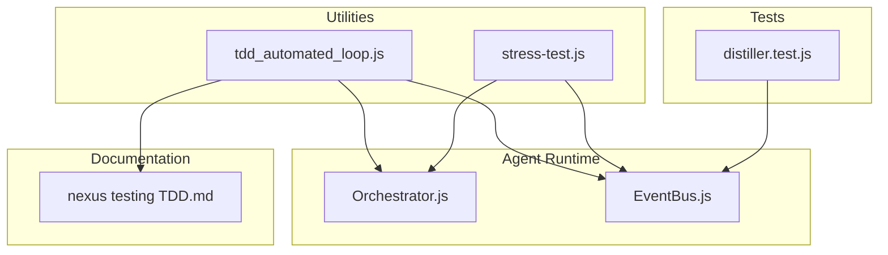
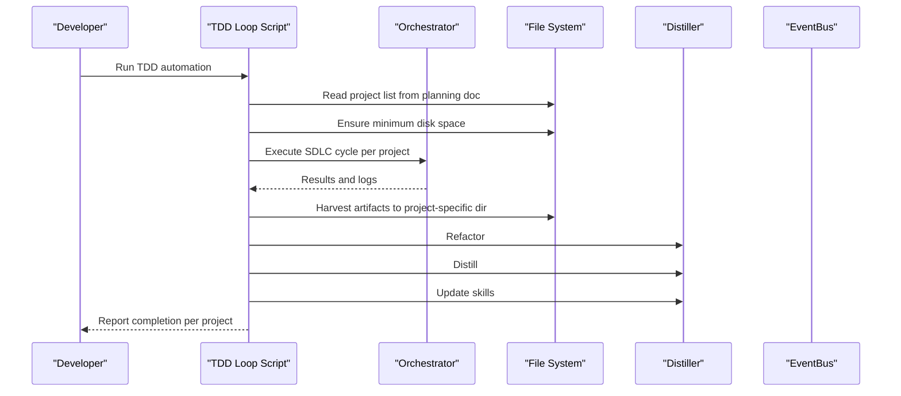
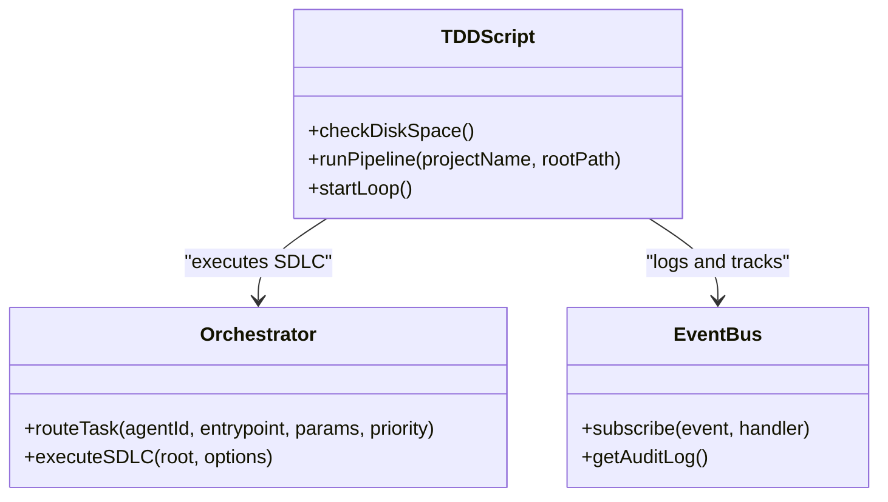
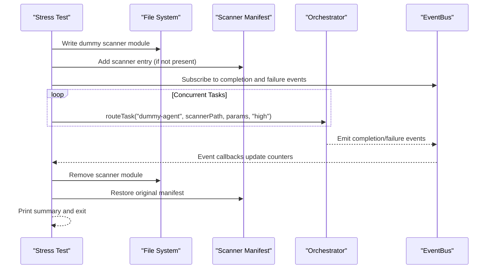
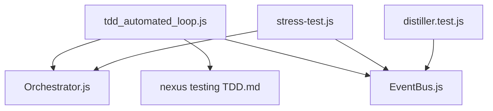

# Utility Scripts

<cite>
**Referenced Files in This Document**
- [tdd_automated_loop.js](file://agent/scripts/tdd_automated_loop.js)
- [stress-test.js](file://agent/tests/stress-test.js)
- [Orchestrator.js](file://agent/core/Orchestrator.js)
- [EventBus.js](file://agent/core/EventBus.js)
- [distiller.test.js](file://tests/TDD/distiller.test.js)
- [nexus testing TDD.md](file://documentation/planning/nexus%20testing%20TDD.md)
</cite>

## Table of Contents
1. [Introduction](#introduction)
2. [Project Structure](#project-structure)
3. [Core Components](#core-components)
4. [Architecture Overview](#architecture-overview)
5. [Detailed Component Analysis](#detailed-component-analysis)
6. [Dependency Analysis](#dependency-analysis)
7. [Performance Considerations](#performance-considerations)
8. [Troubleshooting Guide](#troubleshooting-guide)
9. [Conclusion](#conclusion)
10. [Appendices](#appendices)

## Introduction
This document describes the utility scripts that power continuous test-driven development (TDD) automation and performance stress testing within the NEXUS AI development pipeline. It focuses on:
- The TDD automated loop script that orchestrates SDLC cycles, knowledge harvesting, refactoring, distillation, and skill updates across multiple test projects.
- The stress testing utility that evaluates system resilience under concurrent workloads and failure injection.
- How these scripts integrate with the broader development environment, including the orchestrator, event bus, and semantic tagging mechanisms.

These utilities enable autonomous, repeatable quality assurance and performance validation, reducing manual intervention and accelerating feedback loops.

## Project Structure
The utility scripts reside in dedicated areas of the repository:
- TDD automation: agent/scripts/tdd_automated_loop.js
- Stress testing: agent/tests/stress-test.js
- Supporting runtime components: agent/core/Orchestrator.js and agent/core/EventBus.js
- Semantic tagging validation: tests/TDD/distiller.test.js
- Project list for automation: documentation/planning/nexus testing TDD.md

**Diagram sources**
- [tdd_automated_loop.js](file://agent/scripts/tdd_automated_loop.js)
- [stress-test.js](file://agent/tests/stress-test.js)
- [Orchestrator.js](file://agent/core/Orchestrator.js)
- [EventBus.js](file://agent/core/EventBus.js)
- [nexus testing TDD.md](file://documentation/planning/nexus%20testing%20TDD.md)
- [distiller.test.js](file://tests/TDD/distiller.test.js)

**Section sources**
- [tdd_automated_loop.js](file://agent/scripts/tdd_automated_loop.js)
- [stress-test.js](file://agent/tests/stress-test.js)
- [Orchestrator.js](file://agent/core/Orchestrator.js)
- [EventBus.js](file://agent/core/EventBus.js)
- [nexus testing TDD.md](file://documentation/planning/nexus%20testing%20TDD.md)
- [distiller.test.js](file://tests/TDD/distiller.test.js)

## Core Components
- TDD Automated Loop Script
  - Reads a project list from a planning document.
  - Ensures minimal disk space before starting.
  - Executes an SDLC cycle per project via the main agent entry.
  - Harvests artifacts into a project-specific knowledge directory with semantic metadata.
  - Triggers refactoring, distillation, and skill updates.
  - Continues to the next project even after encountering errors.

- Stress Testing Utility
  - Dynamically creates a dummy scanner module and registers it via the scanner manifest.
  - Subscribes to EventBus to track completion and failures.
  - Routes a configurable number of tasks concurrently and waits for completion.
  - Reports counts of successful and failed tasks and the size of the EventBus audit log.
  - Cleans up generated files and restores the manifest.

- Semantic Tagging Validation
  - Validates that the distiller adds semantic metadata tags to knowledge files.
  - Confirms that domain-specific tags (e.g., security) are detected and persisted.

**Section sources**
- [tdd_automated_loop.js](file://agent/scripts/tdd_automated_loop.js)
- [stress-test.js](file://agent/tests/stress-test.js)
- [distiller.test.js](file://tests/TDD/distiller.test.js)

## Architecture Overview
The TDD loop and stress tests interact with the core runtime components to form an autonomous QA pipeline.

**Diagram sources**
- [tdd_automated_loop.js](file://agent/scripts/tdd_automated_loop.js)
- [Orchestrator.js](file://agent/core/Orchestrator.js)
- [EventBus.js](file://agent/core/EventBus.js)

## Detailed Component Analysis

### TDD Automated Loop Script
Purpose:
- Automate end-to-end TDD cycles across multiple projects.
- Aggregate and tag knowledge artifacts for downstream learning.
- Drive continuous improvement via refactoring, distillation, and skill updates.

Key behaviors:
- Disk space check to prevent resource exhaustion.
- Iterates over projects parsed from a planning document.
- Creates minimal project scaffolding if missing.
- Invokes the main agent entry with root and confirmation flags.
- Copies and renames relevant knowledge files into a project-specific harvest directory, injecting semantic tags.
- Runs refactoring, distillation, and skill update commands.
- Logs progress and continues on errors.

Execution parameters:
- No explicit CLI flags; relies on Bun runtime and main agent entry arguments.
- Uses a planning document path to enumerate projects.

Automation workflow:
- Project discovery → Pre-flight checks → SDLC execution → Artifact harvesting → Knowledge refinement → Skill updates.

Integration points:
- Orchestrator for SDLC execution.
- File system for artifact harvesting and semantic metadata injection.
- CLI entry points for refactoring, distillation, and skill updates.

Customization options:
- Adjust the planning document path and project naming conventions.
- Modify the set of source directories for harvesting.
- Change the semantic tags injected during harvesting.
- Tune the number of projects processed in sequence.

Examples:
- Running the TDD loop to validate a set of planned projects and produce enriched knowledge artifacts for further refinement.

**Section sources**
- [tdd_automated_loop.js](file://agent/scripts/tdd_automated_loop.js)
- [nexus testing TDD.md](file://documentation/planning/nexus%20testing%20TDD.md)

#### Class and Module Relationships

**Diagram sources**
- [tdd_automated_loop.js](file://agent/scripts/tdd_automated_loop.js)
- [Orchestrator.js](file://agent/core/Orchestrator.js)
- [EventBus.js](file://agent/core/EventBus.js)

### Stress Testing Utility
Purpose:
- Evaluate system stability and throughput under concurrent workloads.
- Simulate intermittent failures to validate retry and resilience mechanisms.
- Measure completion rates and event bus audit log size for observability.

Key behaviors:
- Writes a temporary scanner module with randomized delays and occasional failures.
- Registers the scanner via the manifest to allow sandbox execution.
- Subscribes to EventBus to count completions and failures.
- Spawns multiple concurrent tasks and aggregates results.
- Prints summary statistics and cleans up temporary files and manifest changes.

Execution parameters:
- Number of concurrent tasks is configurable.
- Scanner module is dynamically generated and removed after the test.

Automation workflow:
- Prepare scanner → Update manifest → Subscribe to events → Dispatch tasks → Wait for completion → Report and cleanup.

Integration points:
- Orchestrator for task routing.
- EventBus for observability and metrics.
- File system for temporary artifacts.

Customization options:
- Adjust the number of concurrent tasks.
- Modify the scanner’s delay and failure probability.
- Change the subscription targets to capture additional events.

Examples:
- Running a high-concurrency stress test to validate the orchestrator’s throughput and resilience under simulated failures.

**Section sources**
- [stress-test.js](file://agent/tests/stress-test.js)
- [Orchestrator.js](file://agent/core/Orchestrator.js)
- [EventBus.js](file://agent/core/EventBus.js)

#### Sequence Diagram: Stress Test Execution

**Diagram sources**
- [stress-test.js](file://agent/tests/stress-test.js)
- [Orchestrator.js](file://agent/core/Orchestrator.js)
- [EventBus.js](file://agent/core/EventBus.js)

### Semantic Tagging Validation
Purpose:
- Ensure that knowledge artifacts produced during TDD are tagged with semantic metadata for downstream learning and retrieval.

Key behaviors:
- Creates a temporary knowledge file with domain content.
- Applies semantic tagging via the distiller.
- Verifies that the resulting content includes expected metadata and domain-specific tags.

Execution parameters:
- Temporary directory and file path are managed internally.
- Tests fail fast if expected tags are missing.

Automation workflow:
- Prepare test file → Apply tagging → Read and validate content → Clean up.

Integration points:
- Distiller for semantic tagging.
- File system for content manipulation.

Customization options:
- Extend the test to cover additional domains or tags.
- Adjust the content to reflect real-world knowledge artifacts.

Examples:
- Validating that security-related documents receive appropriate semantic tags for improved agent recall.

**Section sources**
- [distiller.test.js](file://tests/TDD/distiller.test.js)

## Dependency Analysis
The TDD loop and stress tests depend on core runtime components and the file system for orchestration and persistence.

**Diagram sources**
- [tdd_automated_loop.js](file://agent/scripts/tdd_automated_loop.js)
- [stress-test.js](file://agent/tests/stress-test.js)
- [Orchestrator.js](file://agent/core/Orchestrator.js)
- [EventBus.js](file://agent/core/EventBus.js)
- [nexus testing TDD.md](file://documentation/planning/nexus%20testing%20TDD.md)
- [distiller.test.js](file://tests/TDD/distiller.test.js)

**Section sources**
- [tdd_automated_loop.js](file://agent/scripts/tdd_automated_loop.js)
- [stress-test.js](file://agent/tests/stress-test.js)
- [Orchestrator.js](file://agent/core/Orchestrator.js)
- [EventBus.js](file://agent/core/EventBus.js)
- [nexus testing TDD.md](file://documentation/planning/nexus%20testing%20TDD.md)
- [distiller.test.js](file://tests/TDD/distiller.test.js)

## Performance Considerations
- Concurrency: The stress test demonstrates how to scale workload using concurrent task dispatch. For the TDD loop, consider batching or parallelizing independent project runs while respecting resource limits.
- Resource checks: The TDD loop validates disk space before starting. Extend this to CPU/memory monitoring for environments with strict quotas.
- Logging overhead: EventBus audit logs grow with event volume. Use sampling or selective subscriptions in high-throughput scenarios.
- I/O patterns: Harvesting and writing semantic metadata can be I/O intensive. Consider asynchronous writes and batching for large knowledge sets.

## Troubleshooting Guide
Common issues and resolutions:
- Low disk space: The TDD loop exits early if free space falls below a threshold. Free up space or adjust thresholds cautiously.
- Missing project scaffolding: The TDD loop creates minimal directories and files if absent. Verify paths and permissions.
- Scanner registration failures: The stress test modifies the manifest. Ensure the manifest exists and is writable; the test restores it afterward.
- Event counting discrepancies: The stress test polls completion counts. Confirm EventBus subscribers are registered and that tasks are completing or failing as expected.
- Semantic tagging not applied: Ensure the distiller is invoked and that the knowledge directory is correctly targeted.

**Section sources**
- [tdd_automated_loop.js](file://agent/scripts/tdd_automated_loop.js)
- [stress-test.js](file://agent/tests/stress-test.js)
- [distiller.test.js](file://tests/TDD/distiller.test.js)

## Conclusion
The TDD automated loop and stress testing utilities are integral to NEXUS AI’s autonomous development pipeline. They streamline continuous quality assurance, validate system resilience, and enrich the knowledge base with structured metadata. By integrating with the orchestrator and event bus, these scripts provide a robust foundation for scalable, repeatable development workflows.

## Appendices
- Example usage patterns:
  - TDD loop: Execute the script to iterate over all projects in the planning document, ensuring each undergoes an SDLC cycle and knowledge enrichment.
  - Stress test: Run the script to simulate high concurrency and intermittent failures, capturing completion and failure metrics.
  - Semantic tagging: Use the distiller test as a blueprint to validate tagging across diverse knowledge domains.