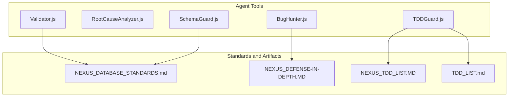
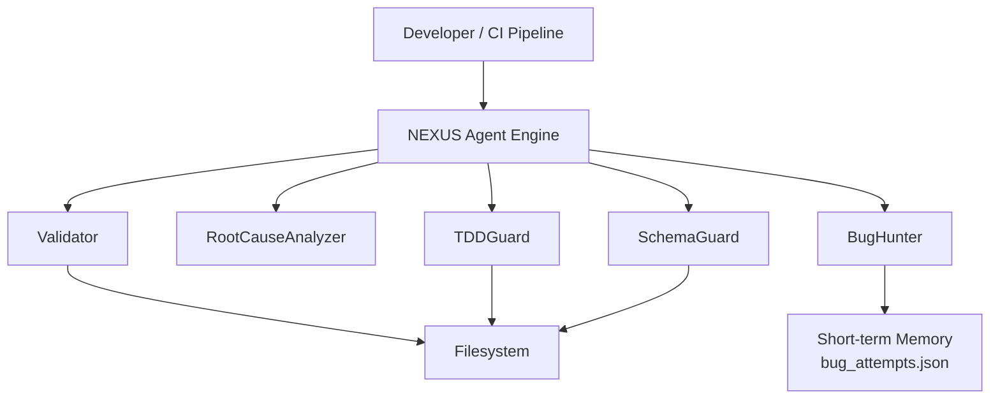
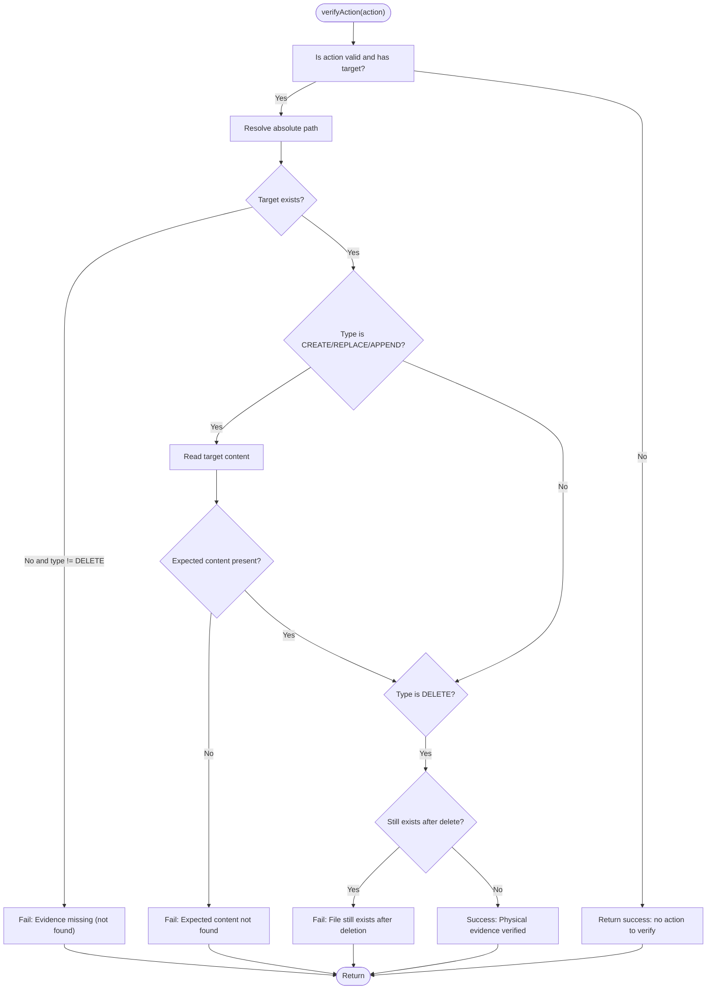
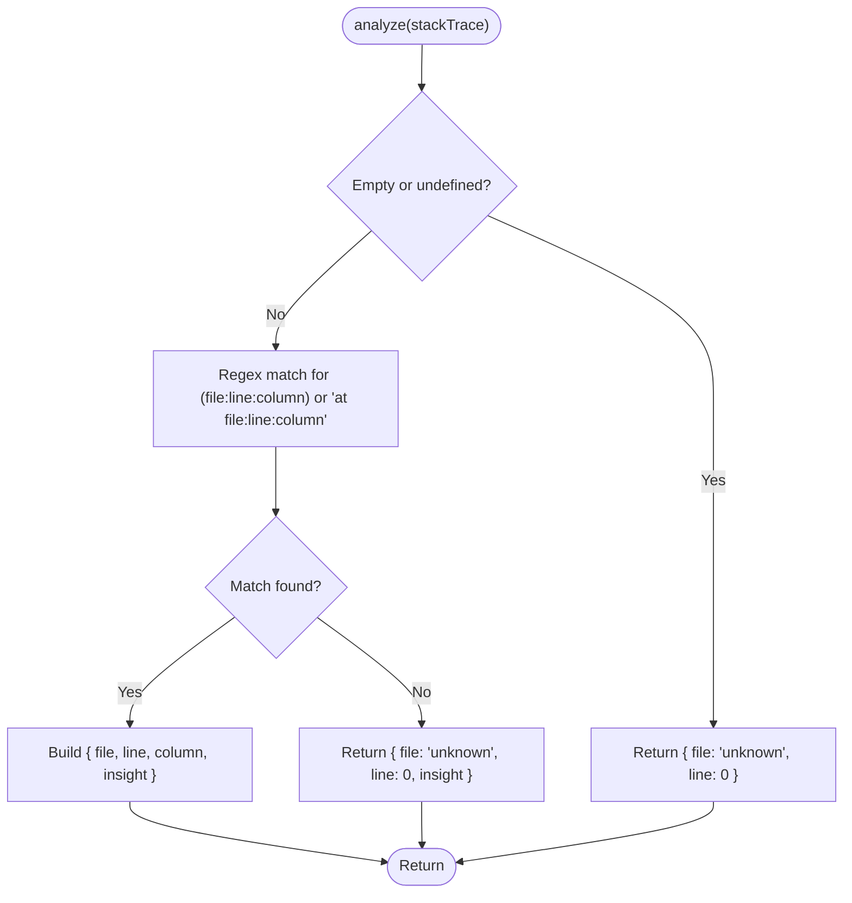
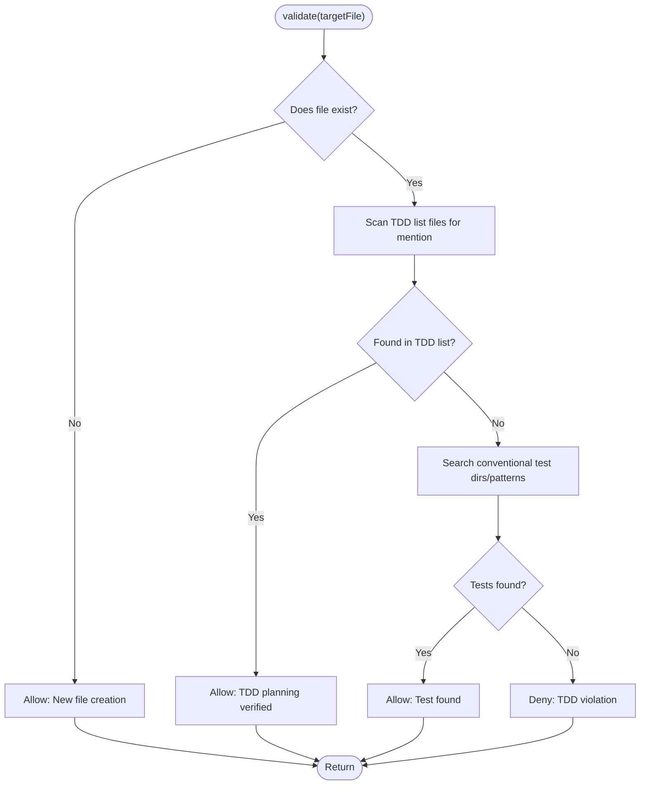
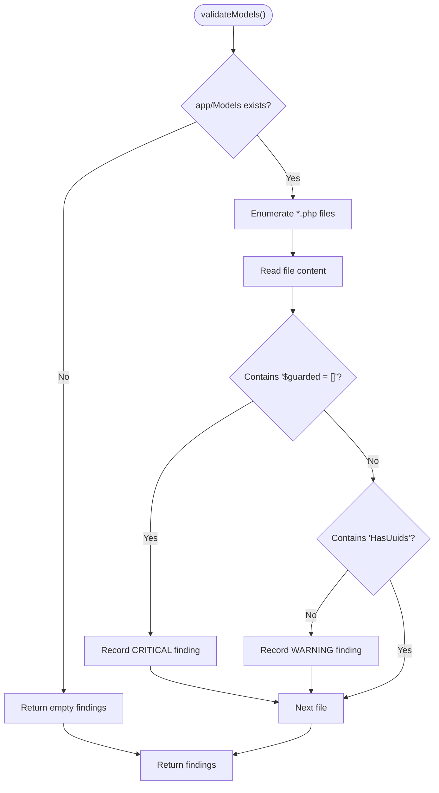
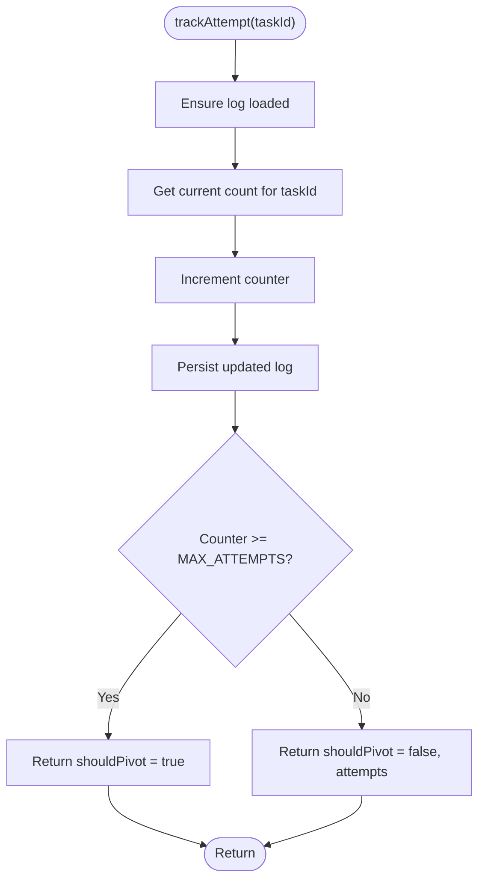
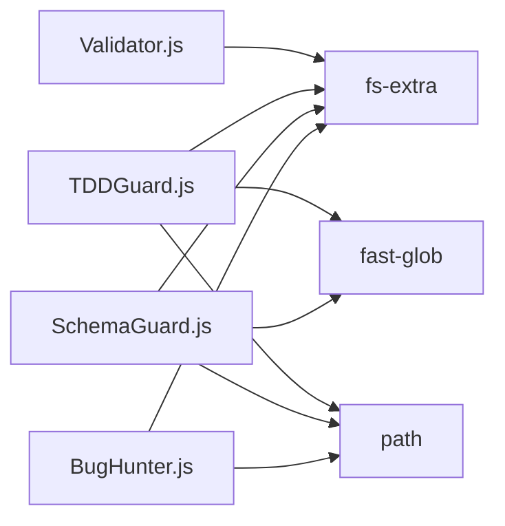
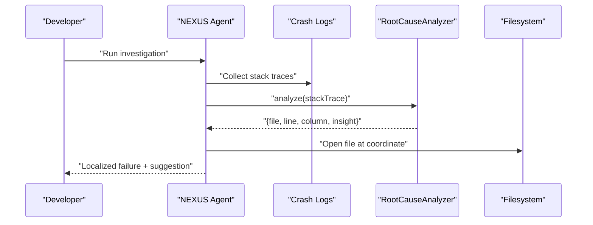

# Validation and Verification

<cite>
**Referenced Files in This Document**
- [Validator.js](file://agent/tools/Validator.js)
- [RootCauseAnalyzer.js](file://agent/tools/RootCauseAnalyzer.js)
- [TDDGuard.js](file://agent/tools/TDDGuard.js)
- [SchemaGuard.js](file://agent/tools/SchemaGuard.js)
- [BugHunter.js](file://agent/tools/BugHunter.js)
- [NEXUS_DEFENSE-IN-DEPTH.MD](file://memory/distilled/tdd/NEXUS_DEFENSE-IN-DEPTH.MD)
- [NEXUS_DATABASE_STANDARDS.md](file://nexus/memory/distilled/standards/NEXUS_DATABASE_STANDARDS.md)
- [NEXUS_TDD_LIST.MD](file://memory/distilled/security/NEXUS_TDD_LIST.MD)
- [TDD_LIST.md](file://documentation/TDD%20test%20project/TDD_LIST.md)
</cite>

## Table of Contents
1. [Introduction](#introduction)
2. [Project Structure](#project-structure)
3. [Core Components](#core-components)
4. [Architecture Overview](#architecture-overview)
5. [Detailed Component Analysis](#detailed-component-analysis)
6. [Dependency Analysis](#dependency-analysis)
7. [Performance Considerations](#performance-considerations)
8. [Troubleshooting Guide](#troubleshooting-guide)
9. [Conclusion](#conclusion)
10. [Appendices](#appendices)

## Introduction
This document describes the validation and verification tools in NEXUS AI, focusing on:
- Validator: physical verification of task changes against filesystem evidence
- RootCauseAnalyzer: systematic identification of failure coordinates from stack traces
- TDDGuard: enforcement of test-driven development discipline for production changes
- SchemaGuard: detection of schema-level security and consistency violations
- BugHunter: strategy pivot machine that tracks repeated task failures and suggests remediation

It also covers validation rules, custom logic hooks, automated verification workflows, configuration options, and integration with development processes.

## Project Structure
The validation and verification utilities live under agent/tools and are supported by distilled standards and TDD artifacts stored in memory and documentation.

**Diagram sources**
- [Validator.js:1-43](file://agent/tools/Validator.js#L1-L43)
- [RootCauseAnalyzer.js:1-29](file://agent/tools/RootCauseAnalyzer.js#L1-L29)
- [TDDGuard.js:1-73](file://agent/tools/TDDGuard.js#L1-L73)
- [SchemaGuard.js:1-46](file://agent/tools/SchemaGuard.js#L1-L46)
- [BugHunter.js:1-88](file://agent/tools/BugHunter.js#L1-L88)
- [NEXUS_DATABASE_STANDARDS.md](file://nexus/memory/distilled/standards/NEXUS_DATABASE_STANDARDS.md)
- [NEXUS_DEFENSE-IN-DEPTH.MD](file://memory/distilled/tdd/NEXUS_DEFENSE-IN-DEPTH.MD)
- [NEXUS_TDD_LIST.MD](file://memory/distilled/security/NEXUS_TDD_LIST.MD)
- [TDD_LIST.md](file://documentation/TDD%20test%20project/TDD_LIST.md)

**Section sources**
- [Validator.js:1-43](file://agent/tools/Validator.js#L1-L43)
- [RootCauseAnalyzer.js:1-29](file://agent/tools/RootCauseAnalyzer.js#L1-L29)
- [TDDGuard.js:1-73](file://agent/tools/TDDGuard.js#L1-L73)
- [SchemaGuard.js:1-46](file://agent/tools/SchemaGuard.js#L1-L46)
- [BugHunter.js:1-88](file://agent/tools/BugHunter.js#L1-L88)
- [NEXUS_DATABASE_STANDARDS.md](file://nexus/memory/distilled/standards/NEXUS_DATABASE_STANDARDS.md)
- [NEXUS_DEFENSE-IN-DEPTH.MD](file://memory/distilled/tdd/NEXUS_DEFENSE-IN-DEPTH.MD)
- [NEXUS_TDD_LIST.MD](file://memory/distilled/security/NEXUS_TDD_LIST.MD)
- [TDD_LIST.md](file://documentation/TDD%20test%20project/TDD_LIST.md)

## Core Components
- Validator: verifies whether a task action produced the expected physical changes on disk, including existence, content presence, and deletion outcomes.
- RootCauseAnalyzer: parses stack traces to extract the first failure coordinate (file, line, column) and provides a localized insight.
- TDDGuard: enforces preconditions for production code changes by ensuring either a corresponding test exists or the change is documented in a TDD list.
- SchemaGuard: scans Laravel model files for forbidden patterns and missing traits, reporting severity levels and affected files.
- BugHunter: tracks repeated task failures and triggers a strategy pivot when a threshold is reached, persisting state to a JSON log.

**Section sources**
- [Validator.js:8-39](file://agent/tools/Validator.js#L8-L39)
- [RootCauseAnalyzer.js:5-25](file://agent/tools/RootCauseAnalyzer.js#L5-L25)
- [TDDGuard.js:8-69](file://agent/tools/TDDGuard.js#L8-L69)
- [SchemaGuard.js:9-42](file://agent/tools/SchemaGuard.js#L9-L42)
- [BugHunter.js:10-84](file://agent/tools/BugHunter.js#L10-L84)

## Architecture Overview
The validation and verification subsystem integrates with the NEXUS agent runtime and leverages standards and TDD artifacts to enforce correctness and safety.

**Diagram sources**
- [Validator.js:17-39](file://agent/tools/Validator.js#L17-L39)
- [RootCauseAnalyzer.js:9-25](file://agent/tools/RootCauseAnalyzer.js#L9-L25)
- [TDDGuard.js:19-69](file://agent/tools/TDDGuard.js#L19-L69)
- [SchemaGuard.js:14-42](file://agent/tools/SchemaGuard.js#L14-L42)
- [BugHunter.js:13-84](file://agent/tools/BugHunter.js#L13-L84)

## Detailed Component Analysis

### Validator
Purpose:
- Confirm that a task action resulted in the expected physical changes on disk.

Key behaviors:
- Accepts an action object with target path and type (create, replace, append, delete).
- Validates existence for non-delete actions and absence for deletes.
- For content-changing actions, checks that the expected content is present.
- Returns structured results indicating success and a descriptive message.

Processing logic:

**Diagram sources**
- [Validator.js:17-39](file://agent/tools/Validator.js#L17-L39)

Configuration and thresholds:
- None. Operates deterministically on action metadata and filesystem state.

Integration:
- Called by the agent after applying a task to confirm intended changes.

**Section sources**
- [Validator.js:8-39](file://agent/tools/Validator.js#L8-L39)

### RootCauseAnalyzer
Purpose:
- Extract the first failure coordinate from a stack trace to guide focused debugging.

Key behaviors:
- Parses stack traces for file:line:column patterns.
- Returns a coordinate object with file, line, column, and a localized insight message.
- Defaults to unknown coordinates when parsing fails.

Processing logic:

**Diagram sources**
- [RootCauseAnalyzer.js:9-25](file://agent/tools/RootCauseAnalyzer.js#L9-L25)

Configuration and thresholds:
- None. Uses a fixed regex pattern and returns a single coordinate.

Integration:
- Used by the agent when handling exceptions to quickly localize the root cause.

**Section sources**
- [RootCauseAnalyzer.js:5-25](file://agent/tools/RootCauseAnalyzer.js#L5-L25)

### TDDGuard
Purpose:
- Enforce TDD discipline by ensuring production changes are justified by tests or documented TDD plans.

Key behaviors:
- Allows creation of new files.
- Checks for TDD list artifacts and permits changes referenced there.
- Scans conventional test directories and patterns to locate matching tests.
- Returns an allowed flag and a reason string.

Processing logic:

**Diagram sources**
- [TDDGuard.js:19-69](file://agent/tools/TDDGuard.js#L19-L69)

Configuration and thresholds:
- Test directories: tests, test, tests/Unit, tests/Feature
- TDD list files: TDD_LIST.md, TDD_TASKS.md, documentation/planning/TDD_LIST.md
- Test patterns: file.test.js, fileTest.php, file.spec.js, test_file.py

Integration:
- Integrated into pre-change validation steps to gate production modifications.

**Section sources**
- [TDDGuard.js:8-69](file://agent/tools/TDDGuard.js#L8-L69)
- [NEXUS_TDD_LIST.MD](file://memory/distilled/security/NEXUS_TDD_LIST.MD)
- [TDD_LIST.md](file://documentation/TDD%20test%20project/TDD_LIST.md)

### SchemaGuard
Purpose:
- Detect schema-level security and consistency violations in Laravel models.

Key behaviors:
- Scans PHP model files under app/Models.
- Flags forbidden patterns (e.g., $guarded = []) and missing traits (e.g., HasUuids).
- Reports findings with severity and affected file.

Processing logic:

**Diagram sources**
- [SchemaGuard.js:14-42](file://agent/tools/SchemaGuard.js#L14-L42)

Configuration and thresholds:
- None. Operates on a fixed set of patterns and traits.

Integration:
- Run periodically or on schema changes to maintain standards compliance.

**Section sources**
- [SchemaGuard.js:9-42](file://agent/tools/SchemaGuard.js#L9-L42)
- [NEXUS_DATABASE_STANDARDS.md](file://nexus/memory/distilled/standards/NEXUS_DATABASE_STANDARDS.md)

### BugHunter
Purpose:
- Track repeated task failures and trigger a strategy pivot when a threshold is exceeded.

Key behaviors:
- Loads a persistent log of previous attempts from memory/short_term/bug_attempts.json.
- Increments counters per task ID and persists updates.
- Returns a decision to pivot when the maximum attempts is reached.
- Provides a method to reset counters for a task.

Processing logic:

**Diagram sources**
- [BugHunter.js:64-78](file://agent/tools/BugHunter.js#L64-L78)

Configuration and thresholds:
- MAX_ATTEMPTS: 3
- Persistence path: memory/short_term/bug_attempts.json

Integration:
- Used in iterative loops to detect stuck strategies and suggest remediation.

**Section sources**
- [BugHunter.js:10-84](file://agent/tools/BugHunter.js#L10-L84)
- [NEXUS_DEFENSE-IN-DEPTH.MD](file://memory/distilled/tdd/NEXUS_DEFENSE-IN-DEPTH.MD)

## Dependency Analysis
The tools depend on filesystem access and optional globbing for pattern matching. TDDGuard depends on TDD artifacts, while SchemaGuard depends on standards documents.

**Diagram sources**
- [Validator.js:1-3](file://agent/tools/Validator.js#L1-L3)
- [TDDGuard.js:1-2](file://agent/tools/TDDGuard.js#L1-L2)
- [SchemaGuard.js:1-3](file://agent/tools/SchemaGuard.js#L1-L3)
- [BugHunter.js:1-2](file://agent/tools/BugHunter.js#L1-L2)

**Section sources**
- [Validator.js:1-3](file://agent/tools/Validator.js#L1-L3)
- [TDDGuard.js:1-2](file://agent/tools/TDDGuard.js#L1-L2)
- [SchemaGuard.js:1-3](file://agent/tools/SchemaGuard.js#L1-L3)
- [BugHunter.js:1-2](file://agent/tools/BugHunter.js#L1-L2)

## Performance Considerations
- Validator: minimal overhead; filesystem checks are O(1) per path, content checks are linear in content length.
- RootCauseAnalyzer: regex parsing is linear in stack trace length; negligible overhead.
- TDDGuard: scanning tests via fast-glob can be expensive in large repos; consider narrowing testDirs or patterns.
- SchemaGuard: enumerating and reading model files scales with number of models; consider incremental scans.
- BugHunter: JSON read/write is bounded by number of tracked tasks; ensure periodic cleanup to avoid bloat.

## Troubleshooting Guide
Common issues and resolutions:
- Validator reports “Evidence missing” for content not found:
  - Verify the action’s expected content is included in the target file.
  - Confirm the target path is correct and relative to the configured root.
  - See [Validator.js:27-31](file://agent/tools/Validator.js#L27-L31).
- RootCauseAnalyzer returns “unknown” coordinates:
  - Ensure stack traces include file:line:column format.
  - See [RootCauseAnalyzer.js:13-24](file://agent/tools/RootCauseAnalyzer.js#L13-L24).
- TDDGuard denies changes:
  - Create or update a TDD list artifact and reference the target file.
  - Or create a corresponding test under conventional test directories.
  - See [TDDGuard.js:26-37](file://agent/tools/TDDGuard.js#L26-L37) and [TDDGuard.js:41-59](file://agent/tools/TDDGuard.js#L41-L59).
- SchemaGuard flags forbidden patterns:
  - Replace $guarded = [] with $fillable and add HasUuids trait to models.
  - See [SchemaGuard.js:24-38](file://agent/tools/SchemaGuard.js#L24-L38) and [NEXUS_DATABASE_STANDARDS.md](file://nexus/memory/distilled/standards/NEXUS_DATABASE_STANDARDS.md).
- BugHunter triggers pivot:
  - Investigate root causes, adjust strategy, and reset counters if appropriate.
  - See [BugHunter.js:70-78](file://agent/tools/BugHunter.js#L70-L78) and [NEXUS_DEFENSE-IN-DEPTH.MD](file://memory/distilled/tdd/NEXUS_DEFENSE-IN-DEPTH.MD).

**Section sources**
- [Validator.js:23-36](file://agent/tools/Validator.js#L23-L36)
- [RootCauseAnalyzer.js:10-24](file://agent/tools/RootCauseAnalyzer.js#L10-L24)
- [TDDGuard.js:26-69](file://agent/tools/TDDGuard.js#L26-L69)
- [SchemaGuard.js:24-38](file://agent/tools/SchemaGuard.js#L24-L38)
- [BugHunter.js:70-78](file://agent/tools/BugHunter.js#L70-L78)
- [NEXUS_DATABASE_STANDARDS.md](file://nexus/memory/distilled/standards/NEXUS_DATABASE_STANDARDS.md)
- [NEXUS_DEFENSE-IN-DEPTH.MD](file://memory/distilled/tdd/NEXUS_DEFENSE-IN-DEPTH.MD)

## Conclusion
NEXUS AI’s validation and verification tools provide a layered approach to correctness:
- Physical verification ensures intended changes occurred.
- Root cause localization accelerates debugging.
- TDDGuard enforces disciplined development practices.
- SchemaGuard enforces security and consistency standards.
- BugHunter detects recurring failures and prompts strategy pivots.

Together, they support robust automated verification workflows integrated into development processes.

## Appendices

### Automated Validation Pipelines
Example workflows:
- Pre-commit verification:
  - Run Validator on staged changes.
  - Run TDDGuard to ensure test coverage.
  - Run SchemaGuard on changed models.
  - On failure, halt commit and surface messages.
- Post-deploy verification:
  - Run Validator to confirm deployment artifacts.
  - Run RootCauseAnalyzer on recent crash logs to localize issues.
- Periodic hygiene:
  - Run SchemaGuard across app/Models.
  - Review BugHunter logs and pivot flagged tasks.

[No sources needed since this section provides general guidance]

### Root Cause Investigation Workflow

**Diagram sources**
- [RootCauseAnalyzer.js:9-25](file://agent/tools/RootCauseAnalyzer.js#L9-L25)