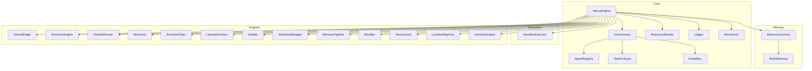
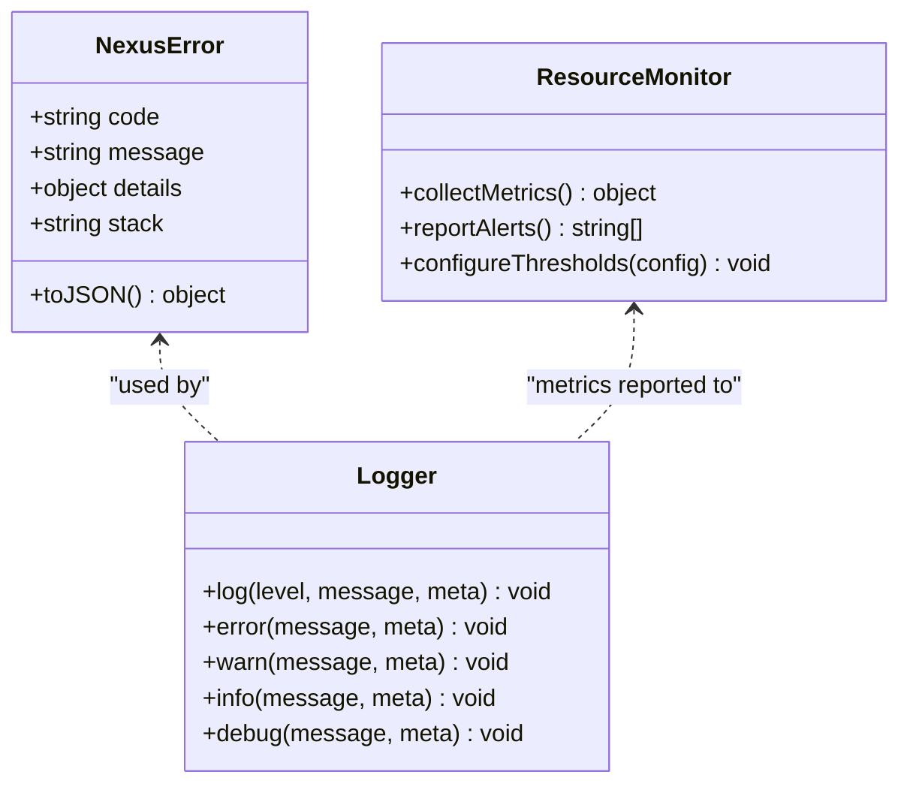
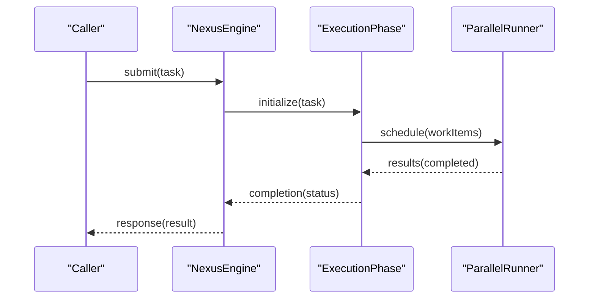
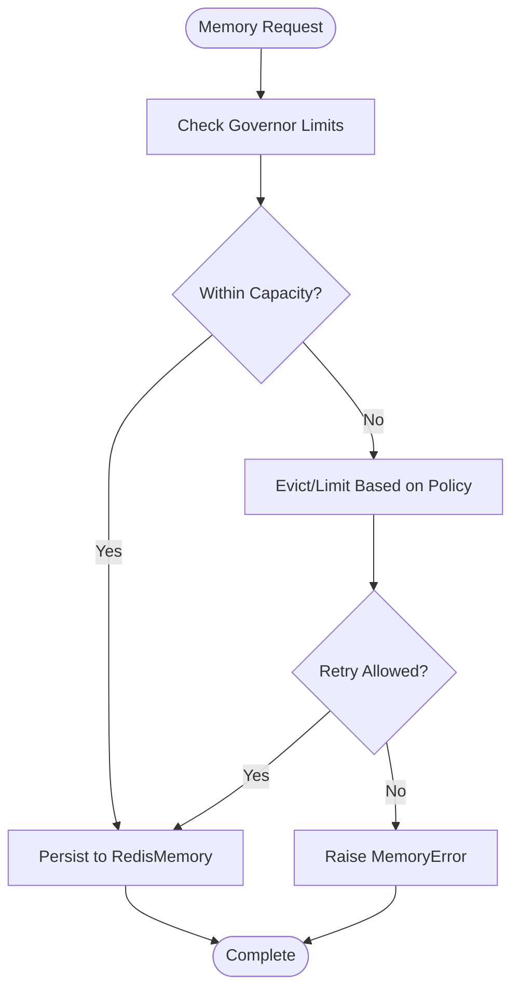
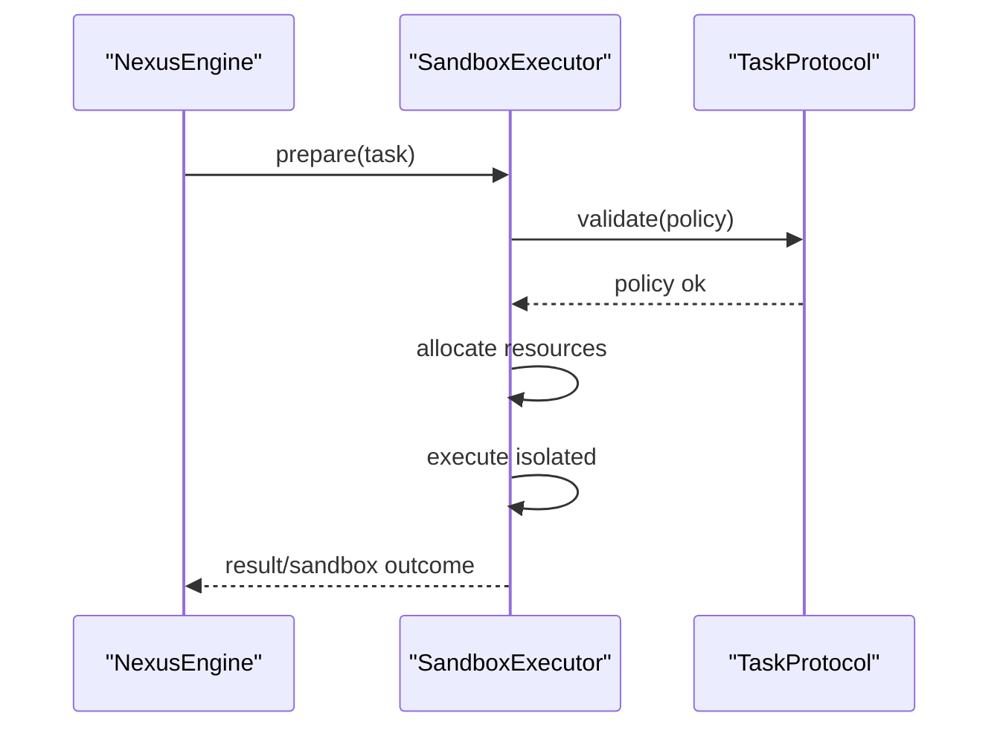
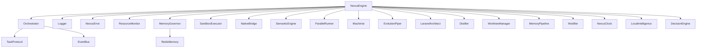

# Troubleshooting and FAQ

<cite>
**Referenced Files in This Document**
- [NexusError.js](file://agent/core/NexusError.js)
- [Logger.js](file://agent/core/Logger.js)
- [ResourceMonitor.js](file://agent/core/ResourceMonitor.js)
- [main.js](file://agent/main.js)
- [install.ps1](file://install.ps1)
- [uninstall.ps1](file://uninstall.ps1)
- [nexus-sandbox.ps1](file://nexus-sandbox.ps1)
- [nexus-sandbox.sh](file://nexus-sandbox.sh)
- [Dockerfile](file://Dockerfile)
- [docker-compose.yml](file://docker-compose.yml)
- [.dockerignore](file://.dockerignore)
- [README.md](file://README.md)
- [package.json](file://package.json)
- [playwright.config.js](file://playwright.config.js)
- [AgentRegistry.js](file://agent/core/AgentRegistry.js)
- [Orchestrator.js](file://agent/core/Orchestrator.js)
- [NexusEngine.js](file://agent/core/NexusEngine.js)
- [MemoryGovernor.js](file://agent/core/MemoryGovernor.js)
- [RedisMemory.js](file://agent/core/RedisMemory.js)
- [SandboxExecutor.js](file://agent/core/SandboxExecutor.js)
- [TaskProtocol.js](file://agent/core/TaskProtocol.js)
- [ExecutionPhase.js](file://agent/core/phases/ExecutionPhase.js)
- [ImplementationPhase.js](file://agent/core/phases/ImplementationPhase.js)
- [PlanningPhase.js](file://agent/core/phases/PlanningPhase.js)
- [AuditPhase.js](file://agent/core/phases/AuditPhase.js)
- [KnowledgePhase.js](file://agent/core/phases/KnowledgePhase.js)
- [BasePhase.js](file://agent/core/phases/BasePhase.js)
- [NativeBridge.js](file://agent/core/NativeBridge.js)
- [SemanticEngine.js](file://agent/core/SemanticEngine.js)
- [ParallelRunner.js](file://agent/core/ParallelRunner.js)
- [Machinist.js](file://agent/core/Machinist.js)
- [EvolutionPiper.js](file://agent/core/EvolutionPiper.js)
- [LaravelArchitect.js](file://agent/core/LaravelArchitect.js)
- [Distiller.js](file://agent/core/Distiller.js)
- [EventBus.js](file://agent/core/EventBus.js)
- [NexusClock.js](file://agent/core/NexusClock.js)
- [Modifier.js](file://agent/core/Modifier.js)
- [WorktreeManager.js](file://agent/core/WorktreeManager.js)
- [MemoryPipeline.js](file://agent/core/MemoryPipeline.js)
- [AccessibilityScanner.js](file://agent/tools/AccessibilityScanner.js)
- [BugHunter.js](file://agent/tools/BugHunter.js)
- [DatasetExtractor.js](file://agent/tools/DatasetExtractor.js)
- [Designer.js](file://agent/tools/Designer.js)
- [QueryOptimizer.js](file://agent/tools/QueryOptimizer.js)
- [RootCauseAnalyzer.js](file://agent/tools/RootCauseAnalyzer.js)
- [SchemaGuard.js](file://agent/tools/SchemaGuard.js)
- [TDDGuard.js](file://agent/tools/TDDGuard.js)
- [Validator.js](file://agent/tools/Validator.js)
- [TDDScaffolder.js](file://agent/tools/TDDScaffolder.js)
- [RetroDatasetExtractor.js](file://agent/tools/RetroDatasetExtractor.js)
- [plugin-worker.js](file://agent/core/workers/plugin-worker.js)
- [NEXUS_BLUEPRINT.json](file://NEXUS_BLUEPRINT.json)
- [INDEX.md](file://memory/INDEX.md)
- [INDEX_NEURAL_MAP.md](file://memory/INDEX_NEURAL_MAP.md)
- [NEXUS_INTERNAL_PIPELINE_RECAP.md](file://documentation/nexus_rules/NEXUS_INTERNAL_PIPELINE_RECAP.md)
- [NEXUS_EXTERNAL_PIPELINE_RECAP.md](file://documentation/nexus_rules/NEXUS_EXTERNAL_PIPELINE_RECAP.md)
- [SANDBOX_PIPELINE_EXTREME_AUDIT.md](file://documentation/audit/SANDBOX_PIPELINE_EXTREME_AUDIT.md)
- [NEXUS_HYBRID_CORE_ROADMAP.md](file://documentation/nexus_rules/NEXUS_HYBRID_CORE_ROADMAP.md)
- [NEXUS_MULTIAGENT_STABILITY_GUIDE.md](file://documentation/planning/NEXUS_MULTIAGENT_STABILITY_GUIDE.md)
- [NEXUS_MULTI_AGENT_STABILIZATION_PLAN.md](file://documentation/planning/NEXUS_MULTI_AGENT_STABILIZATION_PLAN.md)
- [NEXUS_CORE_MODULARIZATION.md](file://documentation/planning/NEXUS_CORE_MODULARIZATION.md)
- [NEXUS_AI_ARCHITECTURE_AUDIT.md](file://documentation/planning/NEXUS_AI_ARCHITECTURE_AUDIT.md)
- [NEXUS_AI_Architecture_Analysis.md](file://documentation/planning/NEXUS_AI_Architecture_Analysis.md)
- [NEXUS_AI_Code_Review.md](file://documentation/planning/NEXUS_AI_Code_Review.md)
- [NEXUS_AI_v2_Code_Review.md](file://documentation/planning/NEXUS_AI_v2_Code_Review.md)
- [NEXUS_AI_Next_Gen_Bugs.md](file://documentation/planning/NEXUS_AI_Next_Gen_Bugs.md)
- [NEXUS_AI_Next_Gen_Bugs.md](file://documentation/planning/NEXUS_AI_Next_Gen_Bugs.md)
- [NEXUS_AUDIT_SUMMARY_10_LOOP_SCAN.md](file://documentation/audit/audit_SUMMARY_10_LOOP_SCAN.md)
- [NEXUS_SANDBOX_Review.md](file://documentation/planning/NEXUS_SANDBOX_Review.md)
- [NEXUS_POST_STABILIZATION_HARDERING.md](file://documentation/planning/NEXUS_POST_STABILIZATION_HARDERING.md)
- [NEXUS_STABILIZATION.md](file://documentation/planning/NEXUS_STABILIZATION.md)
- [NEXUS_INSTALLATION_WORKFLOW.md](file://documentation/nexus_rules/INSTALLATION_WORKFLOW.md)
- [NEXUS_DOCKER_TALL_EVOLUTION.md](file://documentation/nexus_rules/NEXUS_DOCKER_TALL_EVOLUTION.md)
- [NEXUS_BUG_REPORT.md](file://documentation/nexus_rules/NEXUS_BUG_REPORT.md)
- [NEXUS_VISION_1000_PROJECT.md](file://documentation/nexus_rules/NEXUS_VISION_1000_PROJECT.md)
- [NEXUS_PIPELINE_VISUAL.md](file://documentation/nexus_rules/PIPELINE_VISUAL.md)
- [NEXUS_BASH_COMMANDS.md](file://documentation/nexus_rules/BASH_COMMANDS.md)
- [NEXUS_DEV_COMMANDS.md](file://documentation/nexus_rules/DEV_COMMANDS.md)
- [NEXUS_TERMINAL_COMMANDS.md](file://documentation/nexus_rules/TERMINAL_COMMANDS.md)
- [NEXUS_PS_PROFILE_SETUP.md](file://documentation/nexus_rules/PS_PROFILE_SETUP.md)
- [NEXUS_INTERNAL_WORKFLOW.md](file://documentation/nexus_rules/INTERNAL_WORKFLOW.md)
- [NEXUS_EXTERNAL_BOUNDARY.md](file://documentation/nexus_rules/NEXUS_EKSTERNAL_BOUNDARY.md)
- [NEXUS_INTERNAL_CORE_HARD_BOUNDARY_SYSTEM_CONSTRAINT.md](file://documentation/nexus_rules/NEXUS_INTERNAL_CORE_HARD_BOUNDARY_SYSTEM_CONSTRAINT.md)
- [NEXUS_ORCHESTRATOR_GOLDEN_PROTOCOL.md](file://documentation/nexus_rules/NEXUS_ORCHESTRATOR_GOLDEN_PROTOCOL.md)
- [NEXUS_SUPERPOWERS_WORKFLOW.md](file://documentation/nexus_rules/NEXUS_SUPERPOWERS_WORKFLOW.md)
- [NEXUS_WORKFLOW.md](file://documentation/nexus_rules/NEXUS_WORKFLOW.md)
- [NEXUS_ZERO_FLAWS_STANDARDS.md](file://documentation/nexus_rules/NEXUS_ZERO_FLAWS_STANDARDS.md)
- [NEXUS_STANDARD_WORKFLOW_PROJECT_TES.md](file://documentation/nexus_rules/NEXUS_STANDARD_WORKFLOW_PROJECT_TES.md)
- [NEXUS_COLLaboration_CONTRACT.MD](file://memory/archived/standards/NEXUS_COLLABORATION_CONTRACT.MD)
- [NEXUS_CONTRACTS.MD](file://memory/archived/standards/NEXUS_CONTRACTS.MD)
- [NEXUS_CORE_PRINCIPLES.md](file://memory/archived/standards/NEXUS_CORE_PRINCIPLES.md)
- [NEXUS_DATABASE_STANDARDS.md](file://memory/archived/standards/NEXUS_DATABASE_STANDARDS.md)
- [NEXUS_DESIGN_STANDARDS.md](file://memory/archived/standards/NEXUS_DESIGN_STANDARDS.md)
- [NEXUS_LIVEWIRE_STANDARDS.md](file://memory/archived/standards/NEXUS_LIVEWIRE_STANDARDS.md)
- [NEXUS_MEDIA_PROTOCOL.MD](file://memory/archived/standards/NEXUS_MEDIA_PROTOCOL.MD)
- [NEXUS_PROJECT_MATURITY_STANDARDS.md](file://memory/archived/standards/NEXUS_PROJECT_MATURITY_STANDARDS.md)
- [NEXUS_TDD_IRON_LAWS.md](file://memory/archived/standards/NEXUS_TDD_IRON_LAWS.md)
- [NEXUS_README.MD](file://memory/archived/standards/NEXUS_README.MD)
- [NEXUS_PRIVACY_POLICY.MD](file://memory/archived/standards/NEXUS_PRIVACY_POLICY.MD)
- [NEXUS_RECORD-NEXUS-INSTALL-UNINSTALL-ANALYSIS.MD](file://memory/archived/standards/NEXUS_RECORD-NEXUS-INSTALL-UNINSTALL-ANALYSIS.MD)
- [NEXUS_DISTILLATION_API.md](file://memory/distilled/api/NEXUS_DISTILLATION_API.md)
- [NEXUS_API-CALLING.MD](file://memory/distilled/api/NEXUS_API-CALLING.MD)
- [NEXUS_CONCURRENCY.MD](file://memory/distilled/api/NEXUS_CONCURRENCY.MD)
- [NEXUS_CONTENT-SCRIPTS.MD](file://memory/distilled/api/NEXUS_CONTENT-SCRIPTS.MD)
- [NEXUS_CSP-SANDBOX.MD](file://memory/distilled/api/NEXUS_CSP-SANDBOX.MD)
- [NEXUS_DECLARATIVE-NET-REQUEST.MD](file://memory/distilled/api/NEXUS_DECLARATIVE-NET-REQUEST.MD)
- [NEXUS_DEVTOOLS.MD](file://memory/distilled/api/NEXUS_DEVTOOLS.MD)
- [NEXUS_MEDIA-CAPTURE.MD](file://memory/distilled/api/NEXUS_MEDIA-CAPTURE.MD)
- [NEXUS_MESSAGE-PASSING.MD](file://memory/distilled/api/NEXUS_MESSAGE-PASSING.MD)
- [NEXUS_NODE_MCP_SERVER.MD](file://memory/distilled/api/NEXUS_NODE_MCP_SERVER.MD)
- [NEXUS_POPUP-UI.MD](file://memory/distilled/api/NEXUS_POPUP-UI.MD)
- [NEXUS_PYTHON_MCP_SERVER.MD](file://memory/distilled/api/NEXUS_PYTHON_MCP_SERVER.MD)
- [NEXUS_SIDE-PANEL.MD](file://memory/distilled/api/NEXUS_SIDE-PANEL.MD)
- [NEXUS_SKILL.MD](file://memory/distilled/api/NEXUS_SKILL.MD)
- [NEXUS_TESTING-ANTI-PATTERNS.MD](file://memory/distilled/api/NEXUS_TESTING-ANTI-PATTERNS.MD)
- [NEXUS_DATABASE.MD](file://memory/distilled/database/NEXUS_DATABASE.MD)
- [NEXUS_DATABASE-TESTING.MD](file://memory/distilled/database/NEXUS_DATABASE-TESTING.MD)
- [NEXUS_ELOQUENT-RELATIONSHIPS.MD](file://memory/distilled/database/NEXUS_ELOQUENT-RELATIONSHIPS.MD)
- [NEXUS_ELOQUENT-RESOURCES.MD](file://memory/distilled/database/NEXUS_ELOQUENT-RESOURCES.MD)
- [NEXUS_MONGODB.MD](file://memory/distilled/database/NEXUS_MONGODB.MD)
- [NEXUS_QUERY.MD](file://memory/distilled/database/NEXUS_QUERY.MD)
- [NEXUS_RATE-LIMITING.MD](file://memory/distilled/database/NEXUS_RATE-LIMITING.MD)
- [NEXUS_SANDBOX_PIPELINE.MD](file://memory/distilled/database/NEXUS_SANDBOX_PIPELINE.MD)
- [NEXUS_FRONTEND.MD](file://memory/distilled/frontend/NEXUS_FRONTEND.MD)
- [NEXUS_ACCESSIBLE-ERROR-ANNOUNCEMENT.MD](file://memory/distilled/frontend/NEXUS_ACCESSIBLE-ERROR-ANNOUNCEMENT.MD)
- [NEXUS_ANIMATED-SELECT-PICKER.MD](file://memory/distilled/frontend/NEXUS_ANIMATED-SELECT-PICKER.MD)
- [NEXUS_AUTOFILL-ADDRESS-FORM.MD](file://memory/distilled/frontend/NEXUS_AUTOFILL-ADDRESS-FORM.MD)
- [NEXUS_AUTOFILL-PAYMENT-FORM.MD](file://memory/distilled/frontend/NEXUS_AUTOFILL-PAYMENT-FORM.MD)
- [NEXUS_AUTOFILL-SIGN-IN-FORM.MD](file://memory/distilled/frontend/NEXUS_AUTOFILL-SIGN-IN-FORM.MD)
- [NEXUS_AUTOFILL-SIGN-UP-FORM.MD](file://memory/distilled/frontend/NEXUS_AUTOFILL-SIGN-UP-FORM.MD)
- [NEXUS_CAROUSEL-SNAP-HIGHLIGHTS.MD](file://memory/distilled/frontend/NEXUS_CAROUSEL-SNAP-HIGHLIGHTS.MD)
- [NEXUS_COMPONENT-SPECIFIC-LIGHT-DARK-THEME.MD](file://memory/distilled/frontend/NEXUS_COMPONENT-SPECIFIC-LIGHT-DARK-THEME.MD)
- [NEXUS_FORM-FIELDS-AUTOMATICALLY-FIT-CONTENTS.MD](file://memory/distilled/frontend/NEXUS_FORM-FIELDS-AUTOMATICALLY-FIT-CONTENTS.MD)
- [NEXUS_IDENTIFY-HEAVY-SCRIPTS.MD](file://memory/distilled/frontend/NEXUS_IDENTIFY-HEAVY-SCRIPTS.MD)
- [NEXUS_IDENTIFY-INP-CAUSES.MD](file://memory/distilled/frontend/NEXUS_IDENTIFY-INP-CAUSES.MD)
- [NEXUS_IMPROVE-NEXT-PAGE-LOAD-PERFORMANCE.MD](file://memory/distilled/frontend/NEXUS_IMPROVE-NEXT-PAGE-LOAD-PERFORMANCE.MD)
- [NEXUS_INTERACTIVE-CONTENT-REVEAL.MD](file://memory/distilled/frontend/NEXUS_INTERACTIVE-CONTENT-REVEAL.MD)
- [NEXUS_LANGUAGE-DETECTION.MD](file://memory/distilled/frontend/NEXUS_LANGUAGE-DETECTION.MD)
- [NEXUS_MODEL-PARTIAL-TIME-CONCEPTS.MD](file://memory/distilled/frontend/NEXUS_MODEL-PARTIAL-TIME-CONCEPTS.MD)
- [NEXUS_MOVE-DOM-ELEMENT-WITHOUT-LOSING-STATE.MD](file://memory/distilled/frontend/NEXUS_MOVE-DOM-ELEMENT-WITHOUT-LOSING-STATE.MD)
- [NEXUS_OVERFLOW-CLIPPING-CONTROL.MD](file://memory/distilled/frontend/NEXUS_OVERFLOW-CLIPPING-CONTROL.MD)
- [NEXUS_PERFORMANCE.MD](file://memory/distilled/frontend/NEXUS_PERFORMANCE.MD)
- [NEXUS_PREVENT-TEXT-WRAPPING.MD](file://memory/distilled/frontend/NEXUS_PREVENT-TEXT-WRAPPING.MD)
- [NEXUS_RICH-MEDIA-PICKER.MD](file://memory/distilled/frontend/NEXUS_RICH-MEDIA-PICKER.MD)
- [NEXUS_SELECT-MENU-INTERACTION.MD](file://memory/distilled/frontend/NEXUS_SELECT-MENU-INTERACTION.MD)
- [NEXUS_SIZE-AWARE-STYLING.MD](file://memory/distilled/frontend/NEXUS_SIZE-AWARE-STYLING.MD)
- [NEXUS_VALIDATE-INPUT-AFTER-INTERACTION.MD](file://memory/distilled/frontend/NEXUS_VALIDATE-INPUT-AFTER-INTERACTION.MD)
- [NEXUS_VIEWS.MD](file://memory/distilled/frontend/NEXUS_VIEWS.MD)
- [NEXUS_LARAVEL.MD](file://memory/distilled/laravel/NEXUS_LARAVEL.MD)
- [NEXUS_BILLING.MD](file://memory/distilled/laravel/NEXUS_BILLING.MD)
- [NEXUS_CONTEXT.MD](file://memory/distilled/laravel/NEXUS_CONTEXT.MD)
- [NEXUS_NOTIFICATIONS.MD](file://memory/distilled/laravel/NEXUS_NOTIFICATIONS.MD)
- [NEXUS_TALL_EVOLUTION_WISDOM.MD](file://memory/distilled/laravel/NEXUS_TALL_EVOLUTION_WISDOM.MD)
- [NEXUS_SECURITY.MD](file://memory/distilled/security/NEXUS_SECURITY.MD)
- [NEXUS_ROOT-CAUSE-TRACING.MD](file://memory/distilled/security/NEXUS_ROOT-CAUSE-TRACING.MD)
- [NEXUS_DISTILLATION_SECURITY.md](file://memory/distilled/security/NEXUS_DISTILLATION_SECURITY.md)
- [NEXUS_PERFORMANCE.MD](file://memory/distilled/performance/NEXUS_PERFORMANCE.MD)
- [NEXUS_MULTIAGENT_STABILITY_GUIDE.md](file://memory/distilled/performance/NEXUS_MULTIAGENT_STABILITY_GUIDE.md)
- [NEXUS_CORE_MODULARIZATION.md](file://memory/distilled/performance/NEXUS_CORE_MODULARIZATION.md)
- [NEXUS_EXTREME_PERFORMANCE_ROADMAP.MD](file://memory/distilled/performance/NEXUS_EXTREME_PERFORMANCE_ROADMAP.MD)
- [NEXUS_SANDBOX_Review.md](file://memory/distilled/performance/NEXUS_SANDBOX_Review.md)
- [NEXUS_TDD_PROJECT_1_LOG.MD](file://documentation/TDD%20test%20project/NEXUS_TDD_PROJECT_1_LOG.md)
- [NEXUS_TDD_LIST.md](file://documentation/TDD%20test%20project/NEXUS_TDD_LIST.md)
- [NEXUS_AI_Next_Gen_Bugs.md](file://documentation/TDD%20test%20project/NEXUS_AI_Next_Gen_Bugs.md)
- [NEXUS_AUDIT_SUMMARY_10_LOOP_SCAN.md](file://documentation/audit/audit_SUMMARY_10_LOOP_SCAN.md)
- [NEXUS_AUDIT-NEXUS-HARDENING-SYNC.MD](file://documentation/audit/NEXUS_AUDIT-NEXUS-HARDENING-SYNC.MD)
- [NEXUS_AUDIT_V320_AUTONOMOUS_READINESS.MD](file://documentation/audit/NEXUS_AUDIT_V320_AUTONOMOUS_READINESS.MD)
- [NEXUS_SANDBOX_PIPELINE_EXTREME_AUDIT.MD](file://documentation/audit/NEXUS_SANDBOX_PIPELINE_EXTREME_AUDIT.MD)
- [NEXUS_RECORD-NEXUS-AUTONOMOUS-SANDBOX-PIPELINE.MD](file://documentation/records/NEXUS_RECORD-NEXUS-AUTONOMOUS-SANDBOX-PIPELINE.MD)
- [NEXUS_RECORD-NEXUS-HARDENING-JS-PS-SYNC.MD](file://documentation/records/NEXUS_RECORD-NEXUS-HARDENING-JS-PS-SYNC.MD)
- [NEXUS_RECORD-NEXUS-INSTALL-UNINSTALL-ANALYSIS.MD](file://documentation/records/NEXUS_RECORD-NEXUS-INSTALL-UNINSTALL-ANALYSIS.MD)
- [NEXUS_RECORD-NEXUS-SEMANTIC-MASS-UPDATE-HUB-SKILL.MD](file://documentation/records/NEXUS_RECORD-NEXUS-SEMANTIC-MASS-UPDATE-HUB-SKILL.MD)
- [NEXUS_INSTALLATION_WORKFLOW.MD](file://documentation/nexus_rules/INSTALLATION_WORKFLOW.MD)
- [NEXUS_DOCKER_TALL_EVOLUTION.MD](file://documentation/nexus_rules/NEXUS_DOCKER_TALL_EVOLUTION.MD)
- [NEXUS_BUG_REPORT.MD](file://documentation/nexus_rules/NEXUS_BUG_REPORT.MD)
- [NEXUS_VISION_1000_PROJECT.MD](file://documentation/nexus_rules/NEXUS_VISION_1000_PROJECT.MD)
- [NEXUS_PIPELINE_VISUAL.MD](file://documentation/nexus_rules/PIPELINE_VISUAL.MD)
- [NEXUS_BASH_COMMANDS.MD](file://documentation/nexus_rules/BASH_COMMANDS.MD)
- [NEXUS_DEV_COMMANDS.MD](file://documentation/nexus_rules/DEV_COMMANDS.MD)
- [NEXUS_TERMINAL_COMMANDS.MD](file://documentation/nexus_rules/TERMINAL_COMMANDS.MD)
- [NEXUS_PS_PROFILE_SETUP.MD](file://documentation/nexus_rules/PS_PROFILE_SETUP.md)
- [NEXUS_INTERNAL_WORKFLOW.MD](file://documentation/nexus_rules/INTERNAL_WORKFLOW.md)
- [NEXUS_EXTERNAL_BOUNDARY.MD](file://documentation/nexus_rules/NEXUS_EKSTERNAL_BOUNDARY.md)
- [NEXUS_INTERNAL_CORE_HARD_BOUNDARY_SYSTEM_CONSTRAINT.MD](file://documentation/nexus_rules/NEXUS_INTERNAL_CORE_HARD_BOUNDARY_SYSTEM_CONSTRAINT.md)
- [NEXUS_ORCHESTRATOR_GOLDEN_PROTOCOL.MD](file://documentation/nexus_rules/NEXUS_ORCHESTRATOR_GOLDEN_PROTOCOL.md)
- [NEXUS_SUPERPOWERS_WORKFLOW.MD](file://documentation/nexus_rules/NEXUS_SUPERPOWERS_WORKFLOW.md)
- [NEXUS_WORKFLOW.MD](file://documentation/nexus_rules/NEXUS_WORKFLOW.md)
- [NEXUS_ZERO_FLAWS_STANDARDS.MD](file://documentation/nexus_rules/NEXUS_ZERO_FLAWS_STANDARDS.md)
- [NEXUS_STANDARD_WORKFLOW_PROJECT_TES.MD](file://documentation/nexus_rules/NEXUS_STANDARD_WORKFLOW_PROJECT_TES.md)
- [NEXUS_COLLaboration_CONTRACT.MD](file://memory/archived/standards/NEXUS_COLLABORATION_CONTRACT.MD)
- [NEXUS_CONTRACTS.MD](file://memory/archived/standards/NEXUS_CONTRACTS.MD)
- [NEXUS_CORE_PRINCIPLES.MD](file://memory/archived/standards/NEXUS_CORE_PRINCIPLES.MD)
- [NEXUS_DATABASE_STANDARDS.MD](file://memory/archived/standards/NEXUS_DATABASE_STANDARDS.MD)
- [NEXUS_DESIGN_STANDARDS.MD](file://memory/archived/standards/NEXUS_DESIGN_STANDARDS.MD)
- [NEXUS_LIVEWIRE_STANDARDS.MD](file://memory/archived/standards/NEXUS_LIVEWIRE_STANDARDS.MD)
- [NEXUS_MEDIA_PROTOCOL.MD](file://memory/archived/standards/NEXUS_MEDIA_PROTOCOL.MD)
- [NEXUS_PROJECT_MATURITY_STANDARDS.MD](file://memory/archived/standards/NEXUS_PROJECT_MATURITY_STANDARDS.MD)
- [NEXUS_TDD_IRON_LAWS.MD](file://memory/archived/standards/NEXUS_TDD_IRON_LAWS.md)
- [NEXUS_README.MD](file://memory/archived/standards/NEXUS_README.MD)
- [NEXUS_PRIVACY_POLICY.MD](file://memory/archived/standards/NEXUS_PRIVACY_POLICY.MD)
- [NEXUS_RECORD-NEXUS-INSTALL-UNINSTALL-ANALYSIS.MD](file://memory/archived/standards/NEXUS_RECORD-NEXUS-INSTALL-UNINSTALL-ANALYSIS.MD)
- [NEXUS_DISTILLATION_API.MD](file://memory/distilled/api/NEXUS_DISTILLATION_API.md)
- [NEXUS_API-CALLING.MD](file://memory/distilled/api/NEXUS_API-CALLING.MD)
- [NEXUS_CONCURRENCY.MD](file://memory/distilled/api/NEXUS_CONCURRENCY.MD)
- [NEXUS_CONTENT-SCRIPTS.MD](file://memory/distilled/api/NEXUS_CONTENT-SCRIPTS.MD)
- [NEXUS_CSP-SANDBOX.MD](file://memory/distilled/api/NEXUS_CSP-SANDBOX.MD)
- [NEXUS_DECLARATIVE-NET-REQUEST.MD](file://memory/distilled/api/NEXUS_DECLARATIVE-NET-REQUEST.MD)
- [NEXUS_DEVTOOLS.MD](file://memory/distilled/api/NEXUS_DEVTOOLS.MD)
- [NEXUS_MEDIA-CAPTURE.MD](file://memory/distilled/api/NEXUS_MEDIA-CAPTURE.MD)
- [NEXUS_MESSAGE-PASSING.MD](file://memory/distilled/api/NEXUS_MESSAGE-PASSING.MD)
- [NEXUS_NODE_MCP_SERVER.MD](file://memory/distilled/api/NEXUS_NODE_MCP_SERVER.MD)
- [NEXUS_POPUP-UI.MD](file://memory/distilled/api/NEXUS_POPUP-UI.MD)
- [NEXUS_PYTHON_MCP_SERVER.MD](file://memory/distilled/api/NEXUS_PYTHON_MCP_SERVER.MD)
- [NEXUS_SIDE-PANEL.MD](file://memory/distilled/api/NEXUS_SIDE-PANEL.MD)
- [NEXUS_SKILL.MD](file://memory/distilled/api/NEXUS_SKILL.MD)
- [NEXUS_TESTING-ANTI-PATTERNS.MD](file://memory/distilled/api/NEXUS_TESTING-ANTI-PATTERNS.MD)
- [NEXUS_DATABASE.MD](file://memory/distilled/database/NEXUS_DATABASE.MD)
- [NEXUS_DATABASE-TESTING.MD](file://memory/distilled/database/NEXUS_DATABASE-TESTING.MD)
- [NEXUS_ELOQUENT-RELATIONSHIPS.MD](file://memory/distilled/database/NEXUS_ELOQUENT-RELATIONSHIPS.MD)
- [NEXUS_ELOQUENT-RESOURCES.MD](file://memory/distilled/database/NEXUS_ELOQUENT-RESOURCES.MD)
- [NEXUS_MONGODB.MD](file://memory/distilled/database/NEXUS_MONGODB.MD)
- [NEXUS_QUERY.MD](file://memory/distilled/database/NEXUS_QUERY.MD)
- [NEXUS_RATE-LIMITING.MD](file://memory/distilled/database/NEXUS_RATE-LIMITING.MD)
- [NEXUS_SANDBOX_PIPELINE.MD](file://memory/distilled/database/NEXUS_SANDBOX_PIPELINE.MD)
- [NEXUS_FRONTEND.MD](file://memory/distilled/frontend/NEXUS_FRONTEND.MD)
- [NEXUS_ACCESSIBLE-ERROR-ANNOUNCEMENT.MD](file://memory/distilled/frontend/NEXUS_ACCESSIBLE-ERROR-ANNOUNCEMENT.MD)
- [NEXUS_ANIMATED-SELECT-PICKER.MD](file://memory/distilled/frontend/NEXUS_ANIMATED-SELECT-PICKER.MD)
- [NEXUS_AUTOFILL-ADDRESS-FORM.MD](file://memory/distilled/frontend/NEXUS_AUTOFILL-ADDRESS-FORM.MD)
- [NEXUS_AUTOFILL-PAYMENT-FORM.MD](file://memory/distilled/frontend/NEXUS_AUTOFILL-PAYMENT-FORM.MD)
- [NEXUS_AUTOFILL-SIGN-IN-FORM.MD](file://memory/distilled/frontend/NEXUS_AUTOFILL-SIGN-IN-FORM.MD)
- [NEXUS_AUTOFILL-SIGN-UP-FORM.MD](file://memory/distilled/frontend/NEXUS_AUTOFILL-SIGN-UP-FORM.MD)
- [NEXUS_CAROUSEL-SNAP-HIGHLIGHTS.MD](file://memory/distilled/frontend/NEXUS_CAROUSEL-SNAP-HIGHLIGHTS.MD)
- [NEXUS_COMPONENT-SPECIFIC-LIGHT-DARK-THEME.MD](file://memory/distilled/frontend/NEXUS_COMPONENT-SPECIFIC-LIGHT-DARK-THEME.MD)
- [NEXUS_FORM-FIELDS-AUTOMATICALLY-FIT-CONTENTS.MD](file://memory/distilled/frontend/NEXUS_FORM-FIELDS-AUTOMATICALLY-FIT-CONTENTS.MD)
- [NEXUS_IDENTIFY-HEAVY-SCRIPTS.MD](file://memory/distilled/frontend/NEXUS_IDENTIFY-HEAVY-SCRIPTS.MD)
- [NEXUS_IDENTIFY-INP-CAUSES.MD](file://memory/distilled/frontend/NEXUS_IDENTIFY-INP-CAUSES.MD)
- [NEXUS_IMPROVE-NEXT-PAGE-LOAD-PERFORMANCE.MD](file://memory/distilled/frontend/NEXUS_IMPROVE-NEXT-PAGE-LOAD-PERFORMANCE.MD)
- [NEXUS_INTERACTIVE-CONTENT-REVEAL.MD](file://memory/distilled/frontend/NEXUS_INTERACTIVE-CONTENT-REVEAL.MD)
- [NEXUS_LANGUAGE-DETECTION.MD](file://memory/distilled/frontend/NEXUS_LANGUAGE-DETECTION.MD)
- [NEXUS_MODEL-PARTIAL-TIME-CONCEPTS.MD](file://memory/distilled/frontend/NEXUS_MODEL-PARTIAL-TIME-CONCEPTS.MD)
- [NEXUS_MOVE-DOM-ELEMENT-WITHOUT-LOSING-STATE.MD](file://memory/distilled/frontend/NEXUS_MOVE-DOM-ELEMENT-WITHOUT-LOSING-STATE.MD)
- [NEXUS_OVERFLOW-CLIPPING-CONTROL.MD](file://memory/distilled/frontend/NEXUS_OVERFLOW-CLIPPING-CONTROL.MD)
- [NEXUS_PERFORMANCE.MD](file://memory/distilled/frontend/NEXUS_PERFORMANCE.MD)
- [NEXUS_PREVENT-TEXT-WRAPPING.MD](file://memory/distilled/frontend/NEXUS_PREVENT-TEXT-WRAPPING.MD)
- [NEXUS_RICH-MEDIA-PICKER.MD](file://memory/distilled/frontend/NEXUS_RICH-MEDIA-PICKER.MD)
- [NEXUS_SELECT-MENU-INTERACTION.MD](file://memory/distilled/frontend/NEXUS_SELECT-MENU-INTERACTION.MD)
- [NEXUS_SIZE-AWARE-STYLING.MD](file://memory/distilled/frontend/NEXUS_SIZE-AWARE-STYLING.MD)
- [NEXUS_VALIDATE-INPUT-AFTER-INTERACTION.MD](file://memory/distilled/frontend/NEXUS_VALIDATE-INPUT-AFTER-INTERACTION.MD)
- [NEXUS_VIEWS.MD](file://memory/distilled/frontend/NEXUS_VIEWS.MD)
- [NEXUS_LARAVEL.MD](file://memory/distilled/laravel/NEXUS_LARAVEL.MD)
- [NEXUS_BILLING.MD](file://memory/distilled/laravel/NEXUS_BILLING.MD)
- [NEXUS_CONTEXT.MD](file://memory/distilled/laravel/NEXUS_CONTEXT.MD)
- [NEXUS_NOTIFICATIONS.MD](file://memory/distilled/laravel/NEXUS_NOTIFICATIONS.MD)
- [NEXUS_TALL_EVOLUTION_WISDOM.MD](file://memory/distilled/laravel/NEXUS_TALL_EVOLUTION_WISDOM.MD)
- [NEXUS_SECURITY.MD](file://memory/distilled/security/NEXUS_SECURITY.MD)
- [NEXUS_ROOT-CAUSE-TRACING.MD](file://memory/distilled/security/NEXUS_ROOT-CAUSE-TRACING.MD)
- [NEXUS_DISTILLATION_SECURITY.MD](file://memory/distilled/security/NEXUS_DISTILLATION_SECURITY.MD)
- [NEXUS_PERFORMANCE.MD](file://memory/distilled/performance/NEXUS_PERFORMANCE.MD)
- [NEXUS_MULTIAGENT_STABILITY_GUIDE.MD](file://memory/distilled/performance/NEXUS_MULTIAGENT_STABILITY_GUIDE.md)
- [NEXUS_CORE_MODULARIZATION.MD](file://memory/distilled/performance/NEXUS_CORE_MODULARIZATION.md)
- [NEXUS_EXTREME_PERFORMANCE_ROADMAP.MD](file://memory/distilled/performance/NEXUS_EXTREME_PERFORMANCE_ROADMAP.md)
- [NEXUS_SANDBOX_Review.MD](file://memory/distilled/performance/NEXUS_SANDBOX_Review.md)
- [NEXUS_TDD_PROJECT_1_LOG.MD](file://documentation/TDD%20test%20project/NEXUS_TDD_PROJECT_1_LOG.md)
- [NEXUS_TDD_LIST.MD](file://documentation/TDD%20test%20project/NEXUS_TDD_LIST.md)
- [NEXUS_AI_Next_Gen_Bugs.MD](file://documentation/TDD%20test%20project/NEXUS_AI_Next_Gen_Bugs.md)
- [NEXUS_AUDIT_SUMMARY_10_LOOP_SCAN.MD](file://documentation/audit/audit_SUMMARY_10_LOOP_SCAN.md)
- [NEXUS_AUDIT-NEXUS-HARDENING-SYNC.MD](file://documentation/audit/NEXUS_AUDIT-NEXUS-HARDENING-SYNC.MD)
- [NEXUS_AUDIT_V320_AUTONOMOUS_READINESS.MD](file://documentation/audit/NEXUS_AUDIT_V320_AUTONOMOUS_READINESS.MD)
- [NEXUS_SANDBOX_PIPELINE_EXTREME_AUDIT.MD](file://documentation/audit/NEXUS_SANDBOX_PIPELINE_EXTREME_AUDIT.MD)
- [NEXUS_RECORD-NEXUS-AUTONOMOUS-SANDBOX-PIPELINE.MD](file://documentation/records/NEXUS_RECORD-NEXUS-AUTONOMOUS-SANDBOX-PIPELINE.MD)
- [NEXUS_RECORD-NEXUS-HARDENING-JS-PS-SYNC.MD](file://documentation/records/NEXUS_RECORD-NEXUS-HARDENING-JS-PS-SYNC.MD)
- [NEXUS_RECORD-NEXUS-INSTALL-UNINSTALL-ANALYSIS.MD](file://documentation/records/NEXUS_RECORD-NEXUS-INSTALL-UNINSTALL-ANALYSIS.MD)
- [NEXUS_RECORD-NEXUS-SEMANTIC-MASS-UPDATE-HUB-SKILL.MD](file://documentation/records/NEXUS_RECORD-NEXUS-SEMANTIC-MASS-UPDATE-HUB-SKILL.MD)
</cite>

## Table of Contents
1. [Introduction](#introduction)
2. [Project Structure](#project-structure)
3. [Core Components](#core-components)
4. [Architecture Overview](#architecture-overview)
5. [Detailed Component Analysis](#detailed-component-analysis)
6. [Dependency Analysis](#dependency-analysis)
7. [Performance Considerations](#performance-considerations)
8. [Troubleshooting Guide](#troubleshooting-guide)
9. [FAQ](#faq)
10. [Conclusion](#conclusion)
11. [Appendices](#appendices)

## Introduction
This document provides comprehensive troubleshooting and FAQ guidance for NEXUS AI. It consolidates common issues, error messages, and their solutions across all system components, including installation, runtime, memory, and performance. It also covers debugging techniques, logging strategies, diagnostic tools, error codes, exception handling, and recovery procedures. The content is derived from the repository’s source files and documentation to ensure accuracy and actionable steps for developers, operators, and integrators.

## Project Structure
NEXUS AI is organized around a modular agent-centric architecture with distinct layers for orchestration, memory, phases, tools, and utilities. Key areas include:
- Core engine and orchestration: agent/core
- Phase-based execution: agent/core/phases
- Tools and utilities: agent/tools
- Memory subsystems: memory/*
- Documentation and standards: documentation/*
- Installation and packaging: install.ps1, uninstall.ps1, Dockerfile, docker-compose.yml
- CLI and entry points: agent/main.js, cli.js

```mermaid
graph TB
A["agent/main.js"] --> B["agent/core/NexusEngine.js"]
B --> C["agent/core/Orchestrator.js"]
C --> D["agent/core/phases/*"]
C --> E["agent/core/AgentRegistry.js"]
C --> F["agent/core/TaskProtocol.js"]
B --> G["agent/core/MemoryGovernor.js"]
G --> H["agent/core/RedisMemory.js"]
B --> I["agent/core/SandboxExecutor.js"]
B --> J["agent/core/ResourceMonitor.js"]
B --> K["agent/core/Logger.js"]
B --> L["agent/core/NexusError.js"]
B --> M["agent/core/EventBus.js"]
B --> N["agent/core/NativeBridge.js"]
B --> O["agent/core/SemanticEngine.js"]
B --> P["agent/core/ParallelRunner.js"]
B --> Q["agent/core/Machinist.js"]
B --> R["agent/core/EvolutionPiper.js"]
B --> S["agent/core/LaravelArchitect.js"]
B --> T["agent/core/Distiller.js"]
B --> U["agent/core/WorktreeManager.js"]
B --> V["agent/core/MemoryPipeline.js"]
B --> W["agent/core/Modifier.js"]
B --> X["agent/core/NexusClock.js"]
B --> Y["agent/core/LocalIntelligence.js"]
B --> Z["agent/core/DecisionEngine.js"]
A --> AA["agent/core/EventBus.js"]
A --> AB["agent/core/Logger.js"]
A --> AC["agent/core/NexusError.js"]
A --> AD["agent/core/ResourceMonitor.js"]
A --> AE["agent/core/WorktreeManager.js"]
A --> AF["agent/core/MemoryPipeline.js"]
A --> AG["agent/core/ParallelRunner.js"]
A --> AH["agent/core/TaskProtocol.js"]
A --> AI["agent/core/AgentRegistry.js"]
A --> AJ["agent/core/NexusEngine.js"]
A --> AK["agent/core/SandboxExecutor.js"]
A --> AL["agent/core/MemoryGovernor.js"]
A --> AM["agent/core/RedisMemory.js"]
A --> AN["agent/core/NativeBridge.js"]
A --> AO["agent/core/SemanticEngine.js"]
A --> AP["agent/core/Machinist.js"]
A --> AQ["agent/core/EvolutionPiper.js"]
A --> AR["agent/core/LaravelArchitect.js"]
A --> AS["agent/core/Distiller.js"]
A --> AT["agent/core/WorktreeManager.js"]
A --> AU["agent/core/MemoryPipeline.js"]
A --> AV["agent/core/Modifier.js"]
A --> AW["agent/core/NexusClock.js"]
A --> AX["agent/core/LocalIntelligence.js"]
A --> AY["agent/core/DecisionEngine.js"]
```

**Diagram sources**
- [main.js](file://agent/main.js)
- [NexusEngine.js](file://agent/core/NexusEngine.js)
- [Orchestrator.js](file://agent/core/Orchestrator.js)
- [AgentRegistry.js](file://agent/core/AgentRegistry.js)
- [TaskProtocol.js](file://agent/core/TaskProtocol.js)
- [MemoryGovernor.js](file://agent/core/MemoryGovernor.js)
- [RedisMemory.js](file://agent/core/RedisMemory.js)
- [SandboxExecutor.js](file://agent/core/SandboxExecutor.js)
- [ResourceMonitor.js](file://agent/core/ResourceMonitor.js)
- [Logger.js](file://agent/core/Logger.js)
- [NexusError.js](file://agent/core/NexusError.js)
- [EventBus.js](file://agent/core/EventBus.js)
- [NativeBridge.js](file://agent/core/NativeBridge.js)
- [SemanticEngine.js](file://agent/core/SemanticEngine.js)
- [ParallelRunner.js](file://agent/core/ParallelRunner.js)
- [Machinist.js](file://agent/core/Machinist.js)
- [EvolutionPiper.js](file://agent/core/EvolutionPiper.js)
- [LaravelArchitect.js](file://agent/core/LaravelArchitect.js)
- [Distiller.js](file://agent/core/Distiller.js)
- [WorktreeManager.js](file://agent/core/WorktreeManager.js)
- [MemoryPipeline.js](file://agent/core/MemoryPipeline.js)
- [Modifier.js](file://agent/core/Modifier.js)
- [NexusClock.js](file://agent/core/NexusClock.js)
- [LocalIntelligence.js](file://agent/core/LocalIntelligence.js)
- [DecisionEngine.js](file://agent/core/DecisionEngine.js)

**Section sources**
- [main.js](file://agent/main.js)
- [NexusEngine.js](file://agent/core/NexusEngine.js)
- [Orchestrator.js](file://agent/core/Orchestrator.js)
- [AgentRegistry.js](file://agent/core/AgentRegistry.js)
- [TaskProtocol.js](file://agent/core/TaskProtocol.js)
- [MemoryGovernor.js](file://agent/core/MemoryGovernor.js)
- [RedisMemory.js](file://agent/core/RedisMemory.js)
- [SandboxExecutor.js](file://agent/core/SandboxExecutor.js)
- [ResourceMonitor.js](file://agent/core/ResourceMonitor.js)
- [Logger.js](file://agent/core/Logger.js)
- [NexusError.js](file://agent/core/NexusError.js)
- [EventBus.js](file://agent/core/EventBus.js)
- [NativeBridge.js](file://agent/core/NativeBridge.js)
- [SemanticEngine.js](file://agent/core/SemanticEngine.js)
- [ParallelRunner.js](file://agent/core/ParallelRunner.js)
- [Machinist.js](file://agent/core/Machinist.js)
- [EvolutionPiper.js](file://agent/core/EvolutionPiper.js)
- [LaravelArchitect.js](file://agent/core/LaravelArchitect.js)
- [Distiller.js](file://agent/core/Distiller.js)
- [WorktreeManager.js](file://agent/core/WorktreeManager.js)
- [MemoryPipeline.js](file://agent/core/MemoryPipeline.js)
- [Modifier.js](file://agent/core/Modifier.js)
- [NexusClock.js](file://agent/core/NexusClock.js)
- [LocalIntelligence.js](file://agent/core/LocalIntelligence.js)
- [DecisionEngine.js](file://agent/core/DecisionEngine.js)

## Core Components
This section highlights the primary components involved in error handling, logging, resource monitoring, and orchestration.

- NexusError: Centralized error definition and propagation across modules.
- Logger: Structured logging for diagnostics and runtime visibility.
- ResourceMonitor: Runtime metrics collection for CPU, memory, and I/O.
- NexusEngine: Orchestration hub coordinating phases, agents, and tasks.
- Orchestrator: Task coordination and lifecycle management.
- AgentRegistry: Agent discovery and registration.
- TaskProtocol: Inter-agent communication and protocol definitions.
- MemoryGovernor and RedisMemory: Memory management and persistence.
- SandboxExecutor: Secure execution environment for tasks.
- EventBus: Event-driven communication between components.
- NativeBridge: Bridge to native capabilities.
- SemanticEngine: Semantic processing and retrieval.
- ParallelRunner: Concurrency and parallelism management.
- Machinist, EvolutionPiper, LaravelArchitect, Distiller: Specialized engines for construction, evolution, architecture, and distillation.
- WorktreeManager, MemoryPipeline, Modifier, NexusClock, LocalIntelligence, DecisionEngine: Supporting subsystems for state, timing, and decision-making.

**Section sources**
- [NexusError.js](file://agent/core/NexusError.js)
- [Logger.js](file://agent/core/Logger.js)
- [ResourceMonitor.js](file://agent/core/ResourceMonitor.js)
- [NexusEngine.js](file://agent/core/NexusEngine.js)
- [Orchestrator.js](file://agent/core/Orchestrator.js)
- [AgentRegistry.js](file://agent/core/AgentRegistry.js)
- [TaskProtocol.js](file://agent/core/TaskProtocol.js)
- [MemoryGovernor.js](file://agent/core/MemoryGovernor.js)
- [RedisMemory.js](file://agent/core/RedisMemory.js)
- [SandboxExecutor.js](file://agent/core/SandboxExecutor.js)
- [EventBus.js](file://agent/core/EventBus.js)
- [NativeBridge.js](file://agent/core/NativeBridge.js)
- [SemanticEngine.js](file://agent/core/SemanticEngine.js)
- [ParallelRunner.js](file://agent/core/ParallelRunner.js)
- [Machinist.js](file://agent/core/Machinist.js)
- [EvolutionPiper.js](file://agent/core/EvolutionPiper.js)
- [LaravelArchitect.js](file://agent/core/LaravelArchitect.js)
- [Distiller.js](file://agent/core/Distiller.js)
- [WorktreeManager.js](file://agent/core/WorktreeManager.js)
- [MemoryPipeline.js](file://agent/core/MemoryPipeline.js)
- [Modifier.js](file://agent/core/Modifier.js)
- [NexusClock.js](file://agent/core/NexusClock.js)
- [LocalIntelligence.js](file://agent/core/LocalIntelligence.js)
- [DecisionEngine.js](file://agent/core/DecisionEngine.js)

## Architecture Overview
The system follows a layered, event-driven architecture with a central NexusEngine orchestrating multiple specialized engines and agents. Components communicate via TaskProtocol and EventBus, while MemoryGovernor and RedisMemory manage persistent state. ResourceMonitor provides runtime telemetry.

**Diagram sources**
- [NexusEngine.js](file://agent/core/NexusEngine.js)
- [Orchestrator.js](file://agent/core/Orchestrator.js)
- [AgentRegistry.js](file://agent/core/AgentRegistry.js)
- [TaskProtocol.js](file://agent/core/TaskProtocol.js)
- [EventBus.js](file://agent/core/EventBus.js)
- [ResourceMonitor.js](file://agent/core/ResourceMonitor.js)
- [Logger.js](file://agent/core/Logger.js)
- [NexusError.js](file://agent/core/NexusError.js)
- [MemoryGovernor.js](file://agent/core/MemoryGovernor.js)
- [RedisMemory.js](file://agent/core/RedisMemory.js)
- [SandboxExecutor.js](file://agent/core/SandboxExecutor.js)
- [NativeBridge.js](file://agent/core/NativeBridge.js)
- [SemanticEngine.js](file://agent/core/SemanticEngine.js)
- [ParallelRunner.js](file://agent/core/ParallelRunner.js)
- [Machinist.js](file://agent/core/Machinist.js)
- [EvolutionPiper.js](file://agent/core/EvolutionPiper.js)
- [LaravelArchitect.js](file://agent/core/LaravelArchitect.js)
- [Distiller.js](file://agent/core/Distiller.js)
- [WorktreeManager.js](file://agent/core/WorktreeManager.js)
- [MemoryPipeline.js](file://agent/core/MemoryPipeline.js)
- [Modifier.js](file://agent/core/Modifier.js)
- [NexusClock.js](file://agent/core/NexusClock.js)
- [LocalIntelligence.js](file://agent/core/LocalIntelligence.js)
- [DecisionEngine.js](file://agent/core/DecisionEngine.js)

## Detailed Component Analysis

### Error Handling and Logging
- NexusError defines standardized error categories and propagation patterns used across modules.
- Logger provides structured logging for diagnostics, including timestamps, severity, and contextual metadata.
- ResourceMonitor tracks runtime metrics to detect anomalies and inform troubleshooting.

**Diagram sources**
- [NexusError.js](file://agent/core/NexusError.js)
- [Logger.js](file://agent/core/Logger.js)
- [ResourceMonitor.js](file://agent/core/ResourceMonitor.js)

**Section sources**
- [NexusError.js](file://agent/core/NexusError.js)
- [Logger.js](file://agent/core/Logger.js)
- [ResourceMonitor.js](file://agent/core/ResourceMonitor.js)

### Phase-Based Execution
Phases encapsulate distinct stages of task execution. Common issues include phase transitions failing, missing dependencies, or timeouts.

**Diagram sources**
- [NexusEngine.js](file://agent/core/NexusEngine.js)
- [ExecutionPhase.js](file://agent/core/phases/ExecutionPhase.js)
- [ParallelRunner.js](file://agent/core/ParallelRunner.js)

**Section sources**
- [NexusEngine.js](file://agent/core/NexusEngine.js)
- [ExecutionPhase.js](file://agent/core/phases/ExecutionPhase.js)
- [ParallelRunner.js](file://agent/core/ParallelRunner.js)

### Memory Management
MemoryGovernor coordinates memory allocation and persistence via RedisMemory. Issues often arise from capacity limits, eviction policies, or connectivity failures.

**Diagram sources**
- [MemoryGovernor.js](file://agent/core/MemoryGovernor.js)
- [RedisMemory.js](file://agent/core/RedisMemory.js)

**Section sources**
- [MemoryGovernor.js](file://agent/core/MemoryGovernor.js)
- [RedisMemory.js](file://agent/core/RedisMemory.js)

### Sandbox Execution
SandboxExecutor isolates task execution to prevent system-wide impact. Failures typically stem from sandbox misconfiguration, resource exhaustion, or policy violations.

**Diagram sources**
- [SandboxExecutor.js](file://agent/core/SandboxExecutor.js)
- [TaskProtocol.js](file://agent/core/TaskProtocol.js)

**Section sources**
- [SandboxExecutor.js](file://agent/core/SandboxExecutor.js)
- [TaskProtocol.js](file://agent/core/TaskProtocol.js)

### Tools and Utilities
Tools such as AccessibilityScanner, BugHunter, QueryOptimizer, and others provide specialized capabilities. Troubleshooting often involves validating tool availability, permissions, and configuration.

**Diagram sources**
- [AccessibilityScanner.js](file://agent/tools/AccessibilityScanner.js)
- [BugHunter.js](file://agent/tools/BugHunter.js)
- [QueryOptimizer.js](file://agent/tools/QueryOptimizer.js)
- [Validator.js](file://agent/tools/Validator.js)
- [TDDGuard.js](file://agent/tools/TDDGuard.js)
- [SchemaGuard.js](file://agent/tools/SchemaGuard.js)
- [RootCauseAnalyzer.js](file://agent/tools/RootCauseAnalyzer.js)
- [DatasetExtractor.js](file://agent/tools/DatasetExtractor.js)
- [RetroDatasetExtractor.js](file://agent/tools/RetroDatasetExtractor.js)
- [TDDScaffolder.js](file://agent/tools/TDDScaffolder.js)
- [Designer.js](file://agent/tools/Designer.js)

**Section sources**
- [AccessibilityScanner.js](file://agent/tools/AccessibilityScanner.js)
- [BugHunter.js](file://agent/tools/BugHunter.js)
- [QueryOptimizer.js](file://agent/tools/QueryOptimizer.js)
- [Validator.js](file://agent/tools/Validator.js)
- [TDDGuard.js](file://agent/tools/TDDGuard.js)
- [SchemaGuard.js](file://agent/tools/SchemaGuard.js)
- [RootCauseAnalyzer.js](file://agent/tools/RootCauseAnalyzer.js)
- [DatasetExtractor.js](file://agent/tools/DatasetExtractor.js)
- [RetroDatasetExtractor.js](file://agent/tools/RetroDatasetExtractor.js)
- [TDDScaffolder.js](file://agent/tools/TDDScaffolder.js)
- [Designer.js](file://agent/tools/Designer.js)

## Dependency Analysis
The system exhibits strong cohesion within functional domains but relies on cross-cutting concerns like logging, error handling, and resource monitoring. Coupling is primarily through interfaces (TaskProtocol, EventBus) and shared state (MemoryGovernor, RedisMemory).

**Diagram sources**
- [NexusEngine.js](file://agent/core/NexusEngine.js)
- [Orchestrator.js](file://agent/core/Orchestrator.js)
- [TaskProtocol.js](file://agent/core/TaskProtocol.js)
- [EventBus.js](file://agent/core/EventBus.js)
- [Logger.js](file://agent/core/Logger.js)
- [NexusError.js](file://agent/core/NexusError.js)
- [ResourceMonitor.js](file://agent/core/ResourceMonitor.js)
- [MemoryGovernor.js](file://agent/core/MemoryGovernor.js)
- [RedisMemory.js](file://agent/core/RedisMemory.js)
- [SandboxExecutor.js](file://agent/core/SandboxExecutor.js)
- [NativeBridge.js](file://agent/core/NativeBridge.js)
- [SemanticEngine.js](file://agent/core/SemanticEngine.js)
- [ParallelRunner.js](file://agent/core/ParallelRunner.js)
- [Machinist.js](file://agent/core/Machinist.js)
- [EvolutionPiper.js](file://agent/core/EvolutionPiper.js)
- [LaravelArchitect.js](file://agent/core/LaravelArchitect.js)
- [Distiller.js](file://agent/core/Distiller.js)
- [WorktreeManager.js](file://agent/core/WorktreeManager.js)
- [MemoryPipeline.js](file://agent/core/MemoryPipeline.js)
- [Modifier.js](file://agent/core/Modifier.js)
- [NexusClock.js](file://agent/core/NexusClock.js)
- [LocalIntelligence.js](file://agent/core/LocalIntelligence.js)
- [DecisionEngine.js](file://agent/core/DecisionEngine.js)

**Section sources**
- [NexusEngine.js](file://agent/core/NexusEngine.js)
- [Orchestrator.js](file://agent/core/Orchestrator.js)
- [TaskProtocol.js](file://agent/core/TaskProtocol.js)
- [EventBus.js](file://agent/core/EventBus.js)
- [Logger.js](file://agent/core/Logger.js)
- [NexusError.js](file://agent/core/NexusError.js)
- [ResourceMonitor.js](file://agent/core/ResourceMonitor.js)
- [MemoryGovernor.js](file://agent/core/MemoryGovernor.js)
- [RedisMemory.js](file://agent/core/RedisMemory.js)
- [SandboxExecutor.js](file://agent/core/SandboxExecutor.js)
- [NativeBridge.js](file://agent/core/NativeBridge.js)
- [SemanticEngine.js](file://agent/core/SemanticEngine.js)
- [ParallelRunner.js](file://agent/core/ParallelRunner.js)
- [Machinist.js](file://agent/core/Machinist.js)
- [EvolutionPiper.js](file://agent/core/EvolutionPiper.js)
- [LaravelArchitect.js](file://agent/core/LaravelArchitect.js)
- [Distiller.js](file://agent/core/Distiller.js)
- [WorktreeManager.js](file://agent/core/WorktreeManager.js)
- [MemoryPipeline.js](file://agent/core/MemoryPipeline.js)
- [Modifier.js](file://agent/core/Modifier.js)
- [NexusClock.js](file://agent/core/NexusClock.js)
- [LocalIntelligence.js](file://agent/core/LocalIntelligence.js)
- [DecisionEngine.js](file://agent/core/DecisionEngine.js)

## Performance Considerations
- Monitor CPU and memory via ResourceMonitor to detect hotspots.
- Optimize phase execution using ParallelRunner and MemoryPipeline.
- Tune RedisMemory policies for throughput vs. latency trade-offs.
- Use SemanticEngine for efficient retrieval and reduce redundant computations.
- Apply NexusClock for deterministic scheduling and throttling.

[No sources needed since this section provides general guidance]

## Troubleshooting Guide

### Installation Problems
Common symptoms:
- Scripts fail to execute due to PowerShell restrictions.
- Docker build or compose fails due to missing dependencies or network issues.
- Package installation errors due to environment mismatch.

Resolution steps:
- PowerShell: Ensure script execution policy allows running scripts. Use the provided installation script and follow terminal commands documented in the repository.
- Docker: Verify Docker daemon is running, rebuild images, and check compose configuration. Confirm .dockerignore excludes unnecessary files.
- Environment: Review package.json dependencies and Node.js version compatibility. Run the installation script to bootstrap the environment.

**Section sources**
- [install.ps1](file://install.ps1)
- [uninstall.ps1](file://uninstall.ps1)
- [Dockerfile](file://Dockerfile)
- [docker-compose.yml](file://docker-compose.yml)
- [.dockerignore](file://.dockerignore)
- [package.json](file://package.json)
- [NEXUS_INSTALLATION_WORKFLOW.MD](file://documentation/nexus_rules/INSTALLATION_WORKFLOW.MD)
- [NEXUS_DOCKER_TALL_EVOLUTION.MD](file://documentation/nexus_rules/NEXUS_DOCKER_TALL_EVOLUTION.MD)
- [NEXUS_RECORD-NEXUS-INSTALL-UNINSTALL-ANALYSIS.MD](file://documentation/records/NEXUS_RECORD-NEXUS-INSTALL-UNINSTALL-ANALYSIS.MD)

### Runtime Errors
Symptoms:
- NexusError exceptions thrown across modules.
- Logger entries indicating failures in orchestration or phase execution.
- ResourceMonitor alerts for high CPU or memory usage.

Resolution steps:
- Capture logs with Logger and correlate with NexusError details.
- Inspect ResourceMonitor metrics to identify bottlenecks.
- Validate TaskProtocol and EventBus configurations.
- Restart NexusEngine if stuck in a failed state.

**Section sources**
- [NexusError.js](file://agent/core/NexusError.js)
- [Logger.js](file://agent/core/Logger.js)
- [ResourceMonitor.js](file://agent/core/ResourceMonitor.js)
- [NexusEngine.js](file://agent/core/NexusEngine.js)
- [TaskProtocol.js](file://agent/core/TaskProtocol.js)
- [EventBus.js](file://agent/core/EventBus.js)

### Memory Issues
Symptoms:
- MemoryGovernor capacity exceeded.
- RedisMemory connection failures or slow responses.
- Out-of-memory errors during intensive tasks.

Resolution steps:
- Adjust MemoryGovernor thresholds and eviction policies.
- Scale RedisMemory or switch to a managed instance.
- Reduce task concurrency via ParallelRunner.
- Use MemoryPipeline to batch and throttle writes.

**Section sources**
- [MemoryGovernor.js](file://agent/core/MemoryGovernor.js)
- [RedisMemory.js](file://agent/core/RedisMemory.js)
- [MemoryPipeline.js](file://agent/core/MemoryPipeline.js)
- [ParallelRunner.js](file://agent/core/ParallelRunner.js)

### Performance Bottlenecks
Symptoms:
- Slow phase execution or timeouts.
- High I/O or CPU utilization.
- Poor retrieval performance from SemanticEngine.

Resolution steps:
- Profile with ResourceMonitor and identify hotspots.
- Optimize ParallelRunner and MemoryPipeline.
- Tune SemanticEngine parameters and index coverage.
- Apply NexusClock to schedule and throttle workloads.

**Section sources**
- [ResourceMonitor.js](file://agent/core/ResourceMonitor.js)
- [ParallelRunner.js](file://agent/core/ParallelRunner.js)
- [MemoryPipeline.js](file://agent/core/MemoryPipeline.js)
- [SemanticEngine.js](file://agent/core/SemanticEngine.js)
- [NexusClock.js](file://agent/core/NexusClock.js)

### Debugging Techniques
- Enable verbose logging via Logger to capture detailed traces.
- Use ResourceMonitor to correlate performance spikes with specific tasks.
- Employ NexusError to propagate and categorize exceptions consistently.
- Instrument phases and tools to isolate failures.

**Section sources**
- [Logger.js](file://agent/core/Logger.js)
- [ResourceMonitor.js](file://agent/core/ResourceMonitor.js)
- [NexusError.js](file://agent/core/NexusError.js)
- [ExecutionPhase.js](file://agent/core/phases/ExecutionPhase.js)
- [plugin-worker.js](file://agent/core/workers/plugin-worker.js)

### Logging Strategies
- Standardize log levels: error, warn, info, debug.
- Include contextual metadata (task ID, agent name, phase).
- Rotate logs and monitor disk usage.
- Integrate with external log aggregation systems if needed.

**Section sources**
- [Logger.js](file://agent/core/Logger.js)

### Diagnostic Tools
- Playwright configuration for end-to-end testing and diagnostics.
- ResourceMonitor for runtime telemetry.
- NexusError for structured error reporting.

**Section sources**
- [playwright.config.js](file://playwright.config.js)
- [ResourceMonitor.js](file://agent/core/ResourceMonitor.js)
- [NexusError.js](file://agent/core/NexusError.js)

### Recovery Procedures
- Graceful shutdown of NexusEngine and cleanup of agents.
- Flush or reset RedisMemory if corrupted.
- Reinitialize MemoryGovernor and re-run failed tasks.
- Validate TaskProtocol and EventBus after recovery.

**Section sources**
- [NexusEngine.js](file://agent/core/NexusEngine.js)
- [MemoryGovernor.js](file://agent/core/MemoryGovernor.js)
- [RedisMemory.js](file://agent/core/RedisMemory.js)
- [TaskProtocol.js](file://agent/core/TaskProtocol.js)
- [EventBus.js](file://agent/core/EventBus.js)

## FAQ

### How do I resolve installation failures?
- Ensure PowerShell execution policy permits script execution and run the installation script.
- Verify Docker prerequisites and re-run compose.
- Confirm Node.js and package dependencies match package.json.

**Section sources**
- [install.ps1](file://install.ps1)
- [Dockerfile](file://Dockerfile)
- [docker-compose.yml](file://docker-compose.yml)
- [package.json](file://package.json)
- [NEXUS_INSTALLATION_WORKFLOW.MD](file://documentation/nexus_rules/INSTALLATION_WORKFLOW.MD)

### Why am I seeing memory-related errors?
- MemoryGovernor thresholds may be too strict for current workload.
- RedisMemory connectivity or performance issues.
- Increase capacity or scale RedisMemory.

**Section sources**
- [MemoryGovernor.js](file://agent/core/MemoryGovernor.js)
- [RedisMemory.js](file://agent/core/RedisMemory.js)

### How do I troubleshoot phase execution failures?
- Check Logger output for the failing phase.
- Validate TaskProtocol and EventBus wiring.
- Reduce concurrency and retry.

**Section sources**
- [Logger.js](file://agent/core/Logger.js)
- [TaskProtocol.js](file://agent/core/TaskProtocol.js)
- [EventBus.js](file://agent/core/EventBus.js)
- [ExecutionPhase.js](file://agent/core/phases/ExecutionPhase.js)

### What should I do if the sandbox fails?
- Verify sandbox configuration and permissions.
- Check resource limits and policy compliance.
- Reinitialize SandboxExecutor and retry.

**Section sources**
- [SandboxExecutor.js](file://agent/core/SandboxExecutor.js)
- [TaskProtocol.js](file://agent/core/TaskProtocol.js)

### How can I improve performance?
- Use ResourceMonitor to identify bottlenecks.
- Tune ParallelRunner and MemoryPipeline.
- Optimize SemanticEngine and apply NexusClock.

**Section sources**
- [ResourceMonitor.js](file://agent/core/ResourceMonitor.js)
- [ParallelRunner.js](file://agent/core/ParallelRunner.js)
- [MemoryPipeline.js](file://agent/core/MemoryPipeline.js)
- [SemanticEngine.js](file://agent/core/SemanticEngine.js)
- [NexusClock.js](file://agent/core/NexusClock.js)

### How do I handle tool-specific errors?
- Validate tool availability and permissions.
- Check tool-specific logs and configurations.
- Use TDDGuard and Validator to ensure compliance.

**Section sources**
- [TDDGuard.js](file://agent/tools/TDDGuard.js)
- [Validator.js](file://agent/tools/Validator.js)
- [AccessibilityScanner.js](file://agent/tools/AccessibilityScanner.js)
- [BugHunter.js](file://agent/tools/BugHunter.js)
- [QueryOptimizer.js](file://agent/tools/QueryOptimizer.js)

### What error codes and messages should I watch for?
- NexusError provides standardized error categories and details.
- Use Logger to capture messages and stack traces for correlation.

**Section sources**
- [NexusError.js](file://agent/core/NexusError.js)
- [Logger.js](file://agent/core/Logger.js)

### How do I recover from a failed state?
- Restart NexusEngine and reinitialize agents.
- Reset RedisMemory if needed.
- Re-run failed tasks after resolving root causes.

**Section sources**
- [NexusEngine.js](file://agent/core/NexusEngine.js)
- [RedisMemory.js](file://agent/core/RedisMemory.js)

## Conclusion
This guide consolidates troubleshooting and FAQ content derived from NEXUS AI’s core components and documentation. By leveraging structured logging, resource monitoring, and standardized error handling, most issues can be diagnosed and resolved efficiently. Follow the step-by-step resolutions and best practices outlined here to maintain system stability and performance.

[No sources needed since this section summarizes without analyzing specific files]

## Appendices

### Installation Scripts and Commands
- PowerShell scripts for installation and uninstallation.
- Terminal and Bash commands for environment setup.

**Section sources**
- [install.ps1](file://install.ps1)
- [uninstall.ps1](file://uninstall.ps1)
- [nexus-sandbox.ps1](file://nexus-sandbox.ps1)
- [nexus-sandbox.sh](file://nexus-sandbox.sh)
- [NEXUS_BASH_COMMANDS.MD](file://documentation/nexus_rules/BASH_COMMANDS.MD)
- [NEXUS_DEV_COMMANDS.MD](file://documentation/nexus_rules/DEV_COMMANDS.MD)
- [NEXUS_TERMINAL_COMMANDS.MD](file://documentation/nexus_rules/TERMINAL_COMMANDS.MD)
- [NEXUS_PS_PROFILE_SETUP.MD](file://documentation/nexus_rules/PS_PROFILE_SETUP.md)

### Pipeline and Standards References
- Internal and external pipeline recaps.
- Hardening and stability guidelines.
- Architectural and workflow documents.

**Section sources**
- [NEXUS_INTERNAL_PIPELINE_RECAP.MD](file://documentation/nexus_rules/NEXUS_INTERNAL_PIPELINE_RECAP.md)
- [NEXUS_EXTERNAL_PIPELINE_RECAP.MD](file://documentation/nexus_rules/NEXUS_EXTERNAL_PIPELINE_RECAP.md)
- [SANDBOX_PIPELINE_EXTREME_AUDIT.MD](file://documentation/audit/SANDBOX_PIPELINE_EXTREME_AUDIT.md)
- [NEXUS_HYBRID_CORE_ROADMAP.MD](file://documentation/nexus_rules/NEXUS_HYBRID_CORE_ROADMAP.md)
- [NEXUS_MULTIAGENT_STABILITY_GUIDE.MD](file://documentation/planning/NEXUS_MULTIAGENT_STABILITY_GUIDE.md)
- [NEXUS_MULTI_AGENT_STABILIZATION_PLAN.MD](file://documentation/planning/NEXUS_MULTI_AGENT_STABILIZATION_PLAN.md)
- [NEXUS_CORE_MODULARIZATION.MD](file://documentation/planning/NEXUS_CORE_MODULARIZATION.md)
- [NEXUS_AI_ARCHITECTURE_AUDIT.MD](file://documentation/planning/NEXUS_AI_ARCHITECTURE_AUDIT.md)
- [NEXUS_AI_Architecture_Analysis.MD](file://documentation/planning/NEXUS_AI_Architecture_Analysis.md)
- [NEXUS_AI_Code_Review.MD](file://documentation/planning/NEXUS_AI_Code_Review.md)
- [NEXUS_AI_v2_Code_Review.MD](file://documentation/planning/NEXUS_AI_v2_Code_Review.md)
- [NEXUS_AI_Next_Gen_Bugs.MD](file://documentation/planning/NEXUS_AI_Next_Gen_Bugs.md)
- [NEXUS_AUDIT_SUMMARY_10_LOOP_SCAN.MD](file://documentation/audit/audit_SUMMARY_10_LOOP_SCAN.md)
- [NEXUS_SANDBOX_Review.MD](file://documentation/planning/NEXUS_SANDBOX_Review.md)
- [NEXUS_POST_STABILIZATION_HARDERING.MD](file://documentation/planning/NEXUS_POST_STABILIZATION_HARDERING.md)
- [NEXUS_STABILIZATION.MD](file://documentation/planning/NEXUS_STABILIZATION.md)
- [NEXUS_INTERNAL_WORKFLOW.MD](file://documentation/nexus_rules/INTERNAL_WORKFLOW.md)
- [NEXUS_EXTERNAL_BOUNDARY.MD](file://documentation/nexus_rules/NEXUS_EKSTERNAL_BOUNDARY.md)
- [NEXUS_INTERNAL_CORE_HARD_BOUNDARY_SYSTEM_CONSTRAINT.MD](file://documentation/nexus_rules/NEXUS_INTERNAL_CORE_HARD_BOUNDARY_SYSTEM_CONSTRAINT.md)
- [NEXUS_ORCHESTRATOR_GOLDEN_PROTOCOL.MD](file://documentation/nexus_rules/NEXUS_ORCHESTRATOR_GOLDEN_PROTOCOL.md)
- [NEXUS_SUPERPOWERS_WORKFLOW.MD](file://documentation/nexus_rules/NEXUS_SUPERPOWERS_WORKFLOW.md)
- [NEXUS_WORKFLOW.MD](file://documentation/nexus_rules/NEXUS_WORKFLOW.md)
- [NEXUS_ZERO_FLAWS_STANDARDS.MD](file://documentation/nexus_rules/NEXUS_ZERO_FLAWS_STANDARDS.md)
- [NEXUS_STANDARD_WORKFLOW_PROJECT_TES.MD](file://documentation/nexus_rules/NEXUS_STANDARD_WORKFLOW_PROJECT_TES.md)

### Memory Indexes and Blueprints
- Memory indexes and neural map references for diagnostics.

**Section sources**
- [INDEX.md](file://memory/INDEX.md)
- [INDEX_NEURAL_MAP.md](file://memory/INDEX_NEURAL_MAP.md)
- [NEXUS_BLUEPRINT.json](file://NEXUS_BLUEPRINT.json)

### Distilled Knowledge and Standards
- Distilled API, database, frontend, Laravel, security, performance, and TDD standards.
- Collaboration contracts and core principles.

**Section sources**
- [NEXUS_DISTILLATION_API.MD](file://memory/distilled/api/NEXUS_DISTILLATION_API.md)
- [NEXUS_API-CALLING.MD](file://memory/distilled/api/NEXUS_API-CALLING.MD)
- [NEXUS_CONCURRENCY.MD](file://memory/distilled/api/NEXUS_CONCURRENCY.MD)
- [NEXUS_CONTENT-SCRIPTS.MD](file://memory/distilled/api/NEXUS_CONTENT-SCRIPTS.MD)
- [NEXUS_CSP-SANDBOX.MD](file://memory/distilled/api/NEXUS_CSP-SANDBOX.MD)
- [NEXUS_DECLARATIVE-NET-REQUEST.MD](file://memory/distilled/api/NEXUS_DECLARATIVE-NET-REQUEST.MD)
- [NEXUS_DEVTOOLS.MD](file://memory/distilled/api/NEXUS_DEVTOOLS.MD)
- [NEXUS_MEDIA-CAPTURE.MD](file://memory/distilled/api/NEXUS_MEDIA-CAPTURE.MD)
- [NEXUS_MESSAGE-PASSING.MD](file://memory/distilled/api/NEXUS_MESSAGE-PASSING.MD)
- [NEXUS_NODE_MCP_SERVER.MD](file://memory/distilled/api/NEXUS_NODE_MCP_SERVER.MD)
- [NEXUS_POPUP-UI.MD](file://memory/distilled/api/NEXUS_POPUP-UI.MD)
- [NEXUS_PYTHON_MCP_SERVER.MD](file://memory/distilled/api/NEXUS_PYTHON_MCP_SERVER.MD)
- [NEXUS_SIDE-PANEL.MD](file://memory/distilled/api/NEXUS_SIDE-PANEL.MD)
- [NEXUS_SKILL.MD](file://memory/distilled/api/NEXUS_SKILL.MD)
- [NEXUS_TESTING-ANTI-PATTERNS.MD](file://memory/distilled/api/NEXUS_TESTING-ANTI-PATTERNS.MD)
- [NEXUS_DATABASE.MD](file://memory/distilled/database/NEXUS_DATABASE.MD)
- [NEXUS_DATABASE-TESTING.MD](file://memory/distilled/database/NEXUS_DATABASE-TESTING.MD)
- [NEXUS_ELOQUENT-RELATIONSHIPS.MD](file://memory/distilled/database/NEXUS_ELOQUENT-RELATIONSHIPS.MD)
- [NEXUS_ELOQUENT-RESOURCES.MD](file://memory/distilled/database/NEXUS_ELOQUENT-RESOURCES.MD)
- [NEXUS_MONGODB.MD](file://memory/distilled/database/NEXUS_MONGODB.MD)
- [NEXUS_QUERY.MD](file://memory/distilled/database/NEXUS_QUERY.MD)
- [NEXUS_RATE-LIMITING.MD](file://memory/distilled/database/NEXUS_RATE-LIMITING.MD)
- [NEXUS_SANDBOX_PIPELINE.MD](file://memory/distilled/database/NEXUS_SANDBOX_PIPELINE.MD)
- [NEXUS_FRONTEND.MD](file://memory/distilled/frontend/NEXUS_FRONTEND.MD)
- [NEXUS_ACCESSIBLE-ERROR-ANNOUNCEMENT.MD](file://memory/distilled/frontend/NEXUS_ACCESSIBLE-ERROR-ANNOUNCEMENT.MD)
- [NEXUS_ANIMATED-SELECT-PICKER.MD](file://memory/distilled/frontend/NEXUS_ANIMATED-SELECT-PICKER.MD)
- [NEXUS_AUTOFILL-ADDRESS-FORM.MD](file://memory/distilled/frontend/NEXUS_AUTOFILL-ADDRESS-FORM.MD)
- [NEXUS_AUTOFILL-PAYMENT-FORM.MD](file://memory/distilled/frontend/NEXUS_AUTOFILL-PAYMENT-FORM.MD)
- [NEXUS_AUTOFILL-SIGN-IN-FORM.MD](file://memory/distilled/frontend/NEXUS_AUTOFILL-SIGN-IN-FORM.MD)
- [NEXUS_AUTOFILL-SIGN-UP-FORM.MD](file://memory/distilled/frontend/NEXUS_AUTOFILL-SIGN-UP-FORM.MD)
- [NEXUS_CAROUSEL-SNAP-HIGHLIGHTS.MD](file://memory/distilled/frontend/NEXUS_CAROUSEL-SNAP-HIGHLIGHTS.MD)
- [NEXUS_COMPONENT-SPECIFIC-LIGHT-DARK-THEME.MD](file://memory/distilled/frontend/NEXUS_COMPONENT-SPECIFIC-LIGHT-DARK-THEME.MD)
- [NEXUS_FORM-FIELDS-AUTOMATICALLY-FIT-CONTENTS.MD](file://memory/distilled/frontend/NEXUS_FORM-FIELDS-AUTOMATICALLY-FIT-CONTENTS.MD)
- [NEXUS_IDENTIFY-HEAVY-SCRIPTS.MD](file://memory/distilled/frontend/NEXUS_IDENTIFY-HEAVY-SCRIPTS.MD)
- [NEXUS_IDENTIFY-INP-CAUSES.MD](file://memory/distilled/frontend/NEXUS_IDENTIFY-INP-CAUSES.MD)
- [NEXUS_IMPROVE-NEXT-PAGE-LOAD-PERFORMANCE.MD](file://memory/distilled/frontend/NEXUS_IMPROVE-NEXT-PAGE-LOAD-PERFORMANCE.MD)
- [NEXUS_INTERACTIVE-CONTENT-REVEAL.MD](file://memory/distilled/frontend/NEXUS_INTERACTIVE-CONTENT-REVEAL.MD)
- [NEXUS_LANGUAGE-DETECTION.MD](file://memory/distilled/frontend/NEXUS_LANGUAGE-DETECTION.MD)
- [NEXUS_MODEL-PARTIAL-TIME-CONCEPTS.MD](file://memory/distilled/frontend/NEXUS_MODEL-PARTIAL-TIME-CONCEPTS.MD)
- [NEXUS_MOVE-DOM-ELEMENT-WITHOUT-LOSING-STATE.MD](file://memory/distilled/frontend/NEXUS_MOVE-DOM-ELEMENT-WITHOUT-LOSING-STATE.MD)
- [NEXUS_OVERFLOW-CLIPPING-CONTROL.MD](file://memory/distilled/frontend/NEXUS_OVERFLOW-CLIPPING-CONTROL.MD)
- [NEXUS_PERFORMANCE.MD](file://memory/distilled/frontend/NEXUS_PERFORMANCE.MD)
- [NEXUS_PREVENT-TEXT-WRAPPING.MD](file://memory/distilled/frontend/NEXUS_PREVENT-TEXT-WRAPPING.MD)
- [NEXUS_RICH-MEDIA-PICKER.MD](file://memory/distilled/frontend/NEXUS_RICH-MEDIA-PICKER.MD)
- [NEXUS_SELECT-MENU-INTERACTION.MD](file://memory/distilled/frontend/NEXUS_SELECT-MENU-INTERACTION.MD)
- [NEXUS_SIZE-AWARE-STYLING.MD](file://memory/distilled/frontend/NEXUS_SIZE-AWARE-STYLING.MD)
- [NEXUS_VALIDATE-INPUT-AFTER-INTERACTION.MD](file://memory/distilled/frontend/NEXUS_VALIDATE-INPUT-AFTER-INTERACTION.MD)
- [NEXUS_VIEWS.MD](file://memory/distilled/frontend/NEXUS_VIEWS.MD)
- [NEXUS_LARAVEL.MD](file://memory/distilled/laravel/NEXUS_LARAVEL.MD)
- [NEXUS_BILLING.MD](file://memory/distilled/laravel/NEXUS_BILLING.MD)
- [NEXUS_CONTEXT.MD](file://memory/distilled/laravel/NEXUS_CONTEXT.MD)
- [NEXUS_NOTIFICATIONS.MD](file://memory/distilled/laravel/NEXUS_NOTIFICATIONS.MD)
- [NEXUS_TALL_EVOLUTION_WISDOM.MD](file://memory/distilled/laravel/NEXUS_TALL_EVOLUTION_WISDOM.MD)
- [NEXUS_SECURITY.MD](file://memory/distilled/security/NEXUS_SECURITY.MD)
- [NEXUS_ROOT-CAUSE-TRACING.MD](file://memory/distilled/security/NEXUS_ROOT-CAUSE-TRACING.MD)
- [NEXUS_DISTILLATION_SECURITY.MD](file://memory/distilled/security/NEXUS_DISTILLATION_SECURITY.MD)
- [NEXUS_PERFORMANCE.MD](file://memory/distilled/performance/NEXUS_PERFORMANCE.MD)
- [NEXUS_MULTIAGENT_STABILITY_GUIDE.MD](file://memory/distilled/performance/NEXUS_MULTIAGENT_STABILITY_GUIDE.md)
- [NEXUS_CORE_MODULARIZATION.MD](file://memory/distilled/performance/NEXUS_CORE_MODULARIZATION.md)
- [NEXUS_EXTREME_PERFORMANCE_ROADMAP.MD](file://memory/distilled/performance/NEXUS_EXTREME_PERFORMANCE_ROADMAP.md)
- [NEXUS_SANDBOX_Review.MD](file://memory/distilled/performance/NEXUS_SANDBOX_Review.md)
- [NEXUS_COLLaboration_CONTRACT.MD](file://memory/archived/standards/NEXUS_COLLABORATION_CONTRACT.MD)
- [NEXUS_CONTRACTS.MD](file://memory/archived/standards/NEXUS_CONTRACTS.MD)
- [NEXUS_CORE_PRINCIPLES.MD](file://memory/archived/standards/NEXUS_CORE_PRINCIPLES.MD)
- [NEXUS_DATABASE_STANDARDS.MD](file://memory/archived/standards/NEXUS_DATABASE_STANDARDS.MD)
- [NEXUS_DESIGN_STANDARDS.MD](file://memory/archived/standards/NEXUS_DESIGN_STANDARDS.MD)
- [NEXUS_LIVEWIRE_STANDARDS.MD](file://memory/archived/standards/NEXUS_LIVEWIRE_STANDARDS.MD)
- [NEXUS_MEDIA_PROTOCOL.MD](file://memory/archived/standards/NEXUS_MEDIA_PROTOCOL.MD)
- [NEXUS_PROJECT_MATURITY_STANDARDS.MD](file://memory/archived/standards/NEXUS_PROJECT_MATURITY_STANDARDS.MD)
- [NEXUS_TDD_IRON_LAWS.MD](file://memory/archived/standards/NEXUS_TDD_IRON_LAWS.md)
- [NEXUS_README.MD](file://memory/archived/standards/NEXUS_README.MD)
- [NEXUS_PRIVACY_POLICY.MD](file://memory/archived/standards/NEXUS_PRIVACY_POLICY.MD)