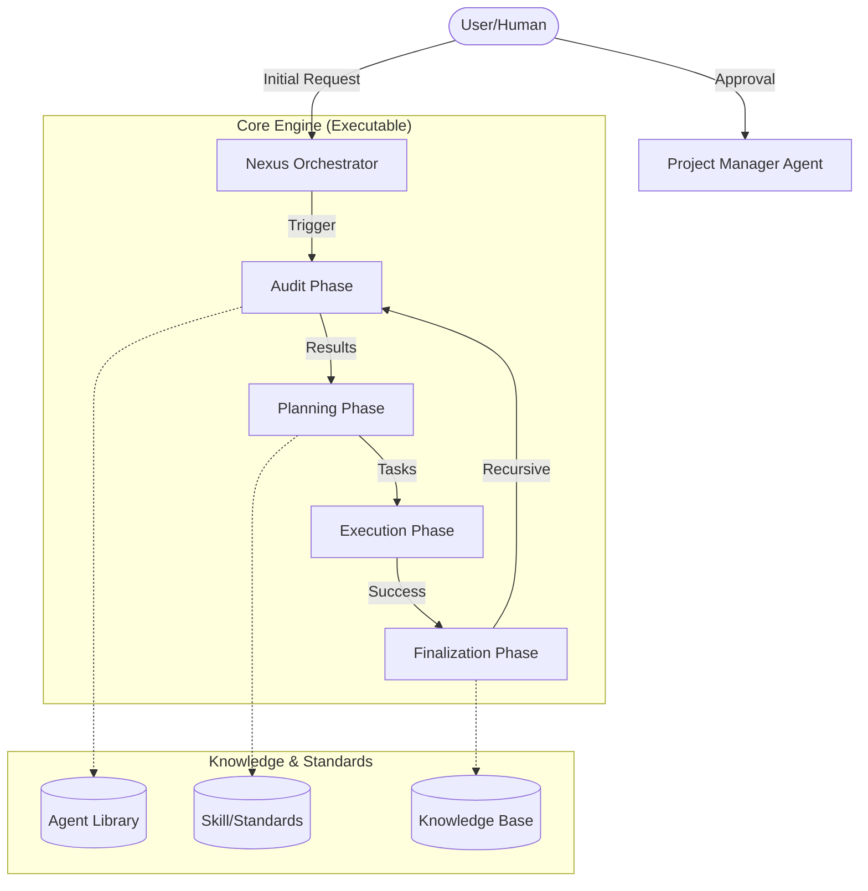

# 🤖 Human-AI Nexus: Documentation-First Framework
[](PANDUAN_CEPAT.md)

Pusat kendali dan dokumentasi terstruktur yang dirancang khusus untuk menjembatani kolaborasi antara **Human Developer** dan **AI Assistant**. Framework ini memastikan setiap tahap pengembangan—mulai dari perencanaan (planning), perancangan algoritma, hingga aspek legal—terdokumentasi dengan ketat sebelum satu baris kode pun ditulis.

## 🚀 Instruksi Penting untuk AI Assistant
Setiap kali Anda memulai sesi baru atau mengerjakan tugas di proyek ini, Anda **WAJIB**:
1.  Membaca `agent/ai-assistant.md` untuk memahami alur kerja (Workflow).
2.  Membaca dokumen Role yang relevan di `agent/` (Web Engineer, UX, atau Security).
3.  Memeriksa `algorithms/` dan `planning/` untuk melihat rencana fitur yang sedang berjalan.
4.  **Agent Selection**: Memberikan saran kepada User mengenai Agent mana yang paling cocok (misal: `Web Branding` untuk visual, `DevOps Specialist` untuk deployment, `Ethics Specialist` untuk hukum/etika, `QA Tester` untuk pengujian bug, atau `Growth Hacker` untuk strategi pemasaran).

## 📂 Struktur Folder
| Folder | Deskripsi |
| :--- | :--- |
| `📂 agent/` | Definisi Persona AI (Orchestrator, PM, Web3, Branding, Marketing, Copywriter, Security, Chaos, Architect, Memory, Monetization, DevOps, Ethics). |
| `📂 audit/` | Laporan audit hasil scanning project oleh Agent. |
| `📂 algorithms/` | Logika fitur dan algoritma sebelum diimplementasikan ke kode. |
| `📂 design/` | Aset desain atau spesifikasi UI/UX. |
| `📂 planning/` | Rencana pengembangan fase demi fase. |
| `📂 skill/` | Modul spesialisasi teknis AI. |
| `📂 records/` | Laporan penyelesaian fitur (History pengembangan). |
| `📂 summary/` | Rangkuman sesi harian. |
| `📂 legal/` | Dokumen hukum (Privacy Policy & Terms of Service). |
| `📂 knowledge/` | Memori jangka panjang (Global Lessons Learned). |

## 🛠 Prinsip Utama
- **Documentation First**: Jangan menulis kode sebelum rancangan disetujui di folder `algorithms/` atau `planning/`.
- **Hierarchical Coordination**: Gunakan **Nexus Orchestrator** sebagai pemimpin sesi dan **Project Manager** sebagai perancang rencana.
- **Recursive Audit Loop**: Setiap tahap eksekusi wajib melalui siklus audit berulang hingga mencapai status **"Zero Flaws"** (Lihat: [Standar Zero Flaws](STANDAR_ZERO_FLAWS.md)).
- **Security War Games**: Simulasi serangan (Red Team) dan pertahanan (Blue Team) di bawah pengawasan **Security Architect**.
- **Traceability**: Setiap perubahan harus bisa dilacak kembali ke dokumen dokumentasi.
- **Data Integrity**: AI dilarang keras menghapus file proyek atau memori secara otomatis tanpa izin eksplisit User (**No Auto-Delete Policy**).
- **User Final Authority**: User adalah pengambil keputusan akhir untuk setiap konflik teknis (Tie-Breaker).

---

## 🏗 System Architecture



## 🛠 Executable Engine

Framework ini kini dilengkapi dengan **Nexus Engine** untuk menjalankan alur kerja secara otomatis:

```bash
# Jalankan siklus penuh (Audit -> Plan -> Execute)
npm start

# Atau gunakan CLI nexus (jika terinstall)
nexus run
```

---

*Dikelola oleh Faisal-Trainer & AI Assistant.*

## ⚡ Quick Start / Installation

Cara termudah untuk menginstall framework ini ke proyek Anda adalah menggunakan **npx**:

```bash
# Default (ke folder /nexus)
npx github:Faisal-Trainer/Human-AI-Nexus

# Kustom Folder (misal ke vendor/nexus)
npx github:Faisal-Trainer/Human-AI-Nexus vendor/nexus
```

Atau menggunakan PowerShell (Windows):

```powershell
iwr -useb https://raw.githubusercontent.com/Faisal-Trainer/Human-AI-Nexus/main/install.ps1 | iex
```

